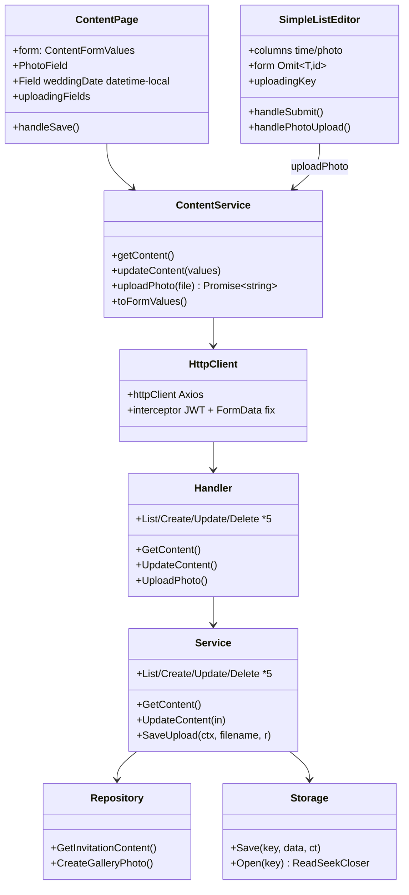
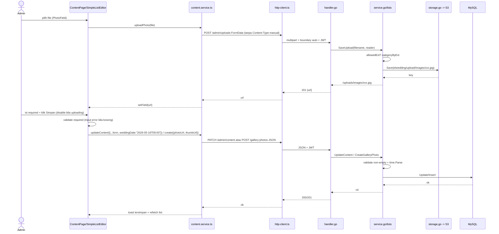

# PLAN — Audit & Perbaikan Ideal CRUD /admin/content (Singleton + 5 List + Upload)

## Ringkasan Requirement & Klasifikasi Intent

**Permintaan user (data):** *“pada halaman /admin/content lakukan analisis untuk semua proses crud yang ada, pastikan semuanya bekerja dengan ideal dan optimal, karena saat ini ada yang gagal simpan atau gagal upload. lakukan secara mendalam dan komprehensif”* — dipersempit Step 0: scope **Semua 1+5+upload** (singleton `PATCH /api/v1/admin/content` + 5 list `agenda-events`, `rundown-items`, `gallery-photos`, `love_story_chapters`, `gift-banks` via `POST/PUT/DELETE` + `POST /api/v1/admin/uploads`), kriteria **Fungsional + UX** (validasi jelas, loading/disable, toast spesifik, tidak ada data hilang), klasifikasi **Bug fix (defect triage)** — perilaku menyimpang dari `knowledge/API.md:12` yang menjanjikan 200/201 bila payload lengkap.

**Keputusan terkunci Step 0:**
- Scope = Semua 1+5+upload (jawaban user 2026-09-02) — trace 6 endpoint CRUD + 1 upload, bukan hanya Gallery.
- Ideal = Fungsional + UX (jawaban user) — bukan hanya 200/201, tapi validasi required, error spesifik, disable saat upload, dirty check andal.
- Gagal yang dilaporkan = *“selalu gagal simpan atau gagal upload”* — user minta tracing menyeluruh, tidak menyebut resource spesifik → asumsikan photo-type (singleton cover/pasangan + Gallery/Love Story) yang share `uploadPhoto` paling rawan, tapi tetap trace semua.
- Intent = Bug fix (jawaban user) — bukan Enhancement.

> Jika scope ideal ternyata hanya fungsional tanpa UX, task 5-7 bisa dipangkas — plan ini mencatat sebagai keputusan, bukan asumsi diam.

## Step 1 — Entry Point Terkonfirmasi Ada

Stack `knowledge/INDEX.md:1` `monorepo-standard`: `apps/web` Vite 5 React 18.3.1 (`package.json:7`), `apps/api` Go 1.26 `net/http` `ServeMux` (`go.mod:3`, `router.go:45`), DB MySQL `migrations/000001:1`, S3 `is3.cloudhost.id` `storage.go:35`.

Front door `/admin/content` (admin, JWT):
- **UI:** `modules/admin/content/pages/ContentPage.tsx:118` — `PROFILE_TAB_IDS:112` (`couple`, `cover`, `quote`, `video`, `filter`, `gift`) + `DATA_TABS` (`agenda`, `rundown`, `gallery`, `story`, `bank`) → `Field` `weddingDate:419` `type="datetime-local"` (sudah perbaiki `hapus-template-wording`), `PhotoField:45` + `SimpleListEditor.tsx:23` (`type:photo` untuk `gallery` `thumbUrl/photoUrl` `ContentPage:576` & `loveStory` `photoUrl` `593`)
- **Service FE:** `services/content.service.ts:20` `getContent`/`updateContent` + `24` `uploadPhoto(FormData)` + `services/content-lists.service.ts:10` `makeResource(path)` → `httpClient` `shared/services/http-client.ts:7` (`baseURL: ''`, `interceptors:18` JWT `Bearer` untuk `/api/v1/admin/`)
- **API:** `router.go:62` `GET /admin/content`, `63` `PATCH /admin/content`, `66-89` `GET/POST/PUT/DELETE /admin/content/{agenda-events,rundown-items,gallery-photos,love-story-chapters,gift-banks}`, `94` `POST /admin/uploads` → `content/presentation/handler.go:42` `GetContent`/`51` `UpdateContent`/`92` `UploadPhoto`, `handler_lists.go:27` `CreateAgendaEvent` dll.
- **Data:** `invitation_content` singleton `000001:1` (`wedding_date DATETIME NOT NULL`), 5 list `agenda_events:54`, `rundown_items:67`, `gallery_photos:77`, `love_story_chapters:86`, `gift_banks:96`, + S3 key `elwedding/upload/{images|audio}/` `service_upload.go:41`

Semua file di atas **dibaca sesi ini** (`read` + `grep -rn`), `infra/nginx` placeholder tidak dipakai (`knowledge/DEPLOYMENT.md:30`).

## Step 2 — Trace Pass 1 (satu hop demi satu hop)

### Singleton (Profil & Cover)
1. `ContentPage.tsx:138` `getContent()` → `content.service.ts:15` `GET /api/v1/admin/content` → `handler.go:42` `repo.GetInvitationContent` → `service.go:47` `toContentDTO` (epoch `wd.Unix()` tz `Asia/Jakarta` `service.go:18`) → `dto.go:11` `InvitationContentDTO`
2. `toFormValues:35` `delete weddingDateUnix/label/Raw` → `{...rest, weddingDate: weddingDateRaw}` (`dto.go:56` `wd.Format("2006-01-02T15:04")`) — **read-modify-write** `knowledge/API.md:26` WAJIB kirim lengkap.
3. Render `Field:25` `weddingDate` `Input type="datetime-local"` + `PhotoField:45` `image/*,audio/*` → `uploadPhoto:24` `FormData file` → `httpClient.post('/api/v1/admin/uploads', formData, {headers:{'Content-Type':'multipart/form-data'}})` `content.service.ts:28` → `handler.go:92` `r.ParseMultipartForm(10<<20)` `FormFile("file")` → `service_upload.go:49` `SaveUpload(ctx, filename, r)` `allowedUploadExt:15` → `storage.go:47` `PutObject` → `201 {url:"/uploads/images/..."}`
4. `set('bridePhotoUrl', url):178` → `handleSave:184` `updateContent(form)` → `PATCH /admin/content` JSON → `handler.go:51` `decodeJSON` → `service.go:123` `time.ParseInLocation("2006-01-02T15:04", in.WeddingDate)` → `repo.UpdateInvitationContent` `000001:14`

### 5 List (Agenda, Rundown, Gallery, Love Story, Bank)
1. `ContentPage:162` lazy `loadedDataTabs` → `content-lists.service.ts:12` `GET /admin/content/{path}` → `handler_lists.go:18` `ListX` → `service_lists.go:11` `repo.ListX` → `dto.go:107` `AgendaEventDTO` dll.
2. `SimpleListEditor:46` `openCreate` `emptyItem` (`ContentPage:542` `eventLabel:''` dll.) → `Modal:170` `columns.map` → `Input:223` `type=text|time|photo` (sudah `time` untuk `timeLabel:536`) + `handlePhotoUpload:78` `onUploadPhoto(file)` → `uploadPhoto` sama seperti singleton → `setField(key, url)`
3. `handleSubmit:60` `e.preventDefault()` → `if(editingId) onUpdate(id,form) else onCreate({...form, sortOrder: items.length+1})` → `content-lists.service.ts:13` `POST /admin/content/{path}` `AgendaEventInput:118` `{eventLabel, timeLabel, venueName... sortOrder}` → `handler_lists.go:27` `decodeJSON` → `service_lists.go:27` `repo.CreateAgendaEvent` → `sqlc` → `201 {id}` → `ContentPage:543` `setAgendaEvents(await list())` (refetch)

### Upload (shared)
- **Satu-satunya** `POST /admin/uploads` dipakai 6 tempat: 6× `PhotoField` singleton + 2× `photo` kolom Gallery + 1× Love Story → `service_upload.go:49` `categoryByExt:26` `images:jpg/png/webp/gif`, `audio:mp3/wav/ogg`, `buildKey:41` `elwedding/upload/{category}/{filename}` `hex+unixnano`, `contentTypeByExt:31` eksplisit (hindari `mime.TypeByExtension` di Alpine `service_upload.go:22`)

## Step 3 — Data Source

**Tidak enhance/add tabel.** Semua kolom sudah `VARCHAR(500)`/`TEXT` `000001:7`, muat URL baru `/uploads/{category}/{file}` (<100 char) jauh di bawah 500. `gallery_photos.photo_url/thumb_url` `VARCHAR(500) NOT NULL`, `sort_order INT NOT NULL DEFAULT 0`, `invitation_content.wedding_date DATETIME NOT NULL` — tidak ada kolom baru, tidak ada FK lintas modul (`knowledge/DATABASE.md:22` tanpa FK, `MODULE_MAP.md:5` content own 7 tabel). Keputusan `docs/plan/content-uploads-object-storage/PLAN.md:97` **tidak ada migrasi** tetap sah. Volume: 1 baris `content`, ~27 `gallery_photos` ×2 render =54, ~10 `agenda/rundown`, tamu ratusan (`knowledge/PROJECT.md:12`) — trafik puncak sekali sebar, tidak ada N+1 query baru (1 request=1 query).

## Step 4 — Konsep Desain (rekomendasi dengan kriteria)

**F1 — Apa yang bikin “selalu gagal” sekarang? (what, Step 0 sudah kunci, tapi temuan trace memperjelas)**
- **E2 Header upload (rekomendasi P0):** `content.service.ts:28` `headers:{'Content-Type':'multipart/form-data'}` tanpa `boundary` → `handler.go:94` `ParseMultipartForm` → `400 File too large or invalid form` → `toast Gagal mengunggah` → user masih klik Simpan dengan `photoUrl=""` → `POST gallery` dengan `""` lolos DB (karena `NOT NULL DEFAULT ''` tapi tetap string kosong) → UX “gagal simpan” palsu karena gambar tidak muncul. **Kriteria:** kecocokan konvensi `jwswedding` (tidak set header manual, biarkan browser) + blast radius 1 baris.
- **E4 weddingDate (sudah fix di plan sebelumnya, tapi verifikasi):** `service.go:124` hanya terima `2006-01-02T15:04`/`15:04:05`, placeholder lama `Minggu, 12 Oktober 2026` pasti 400. Sudah jadi `datetime-local` `ContentPage:419`, tapi perlu tambahan fallback `2006-01-02` bila browser kirim date saja.
- **E3 S3 (P0 sekunder):** `storage.go:47` `PutObject` butuh `S3_*` env; `main.go:33` `log.Fatalf` bila gagal → container tidak healthy. Read `404 JSON` sudah bukti kredensial baca benar (`docs/plan/content-uploads-object-storage/PLAN.md:474`), tapi tulis belum bukti. Perlu cek `docker logs`.

**F2 — Ideal UX: validasi required & error spesifik (how, Step 4)**
- **Opsi A (rekom, simplest + fit):** FE tambah validasi required sebelum `handleSubmit` (Zod ringan atau `if (!String(form[col.key]||'').trim())` + `Input error` `Input.tsx:6` sudah support) + BE `service_lists.go:27` cek `eventLabel=='' → 400 {errors:{eventLabel:'Name required'}}` (ikuti `guest.schema.ts:11` `z.string().min(1)` precedent). Toast generik `Gagal menyimpan` → `response.BadRequest` dengan `errors` map (sudah ada envelope `success,message,errors` `knowledge/API.md:3`).
- **Opsi B:** Lib validasi berat, tidak dibayar.

**F3 — Disable saat upload (UX optimal)**
- **Opsi A (rekom):** `ContentPage:45` `PhotoField` `uploading` lokal → angkat ke `ContentPage:125` `uploadingCount` agregat, `StickyActionBar dirty` + `saving` disable bila `uploadingCount>0`. `SimpleListEditor:179` `loading={submitting||uploading}` sudah benar untuk single `uploading`, tapi untuk Gallery 2 kolom `photo` perlu `uploadingKey: Record<string,boolean>` bukan `boolean` tunggal — jika thumb & photo upload bersamaan, state tumpang tindih.

**F4 — SortOrder ideal**
- Opsi A: BE hitung `MAX(sort_order)+1` ignore `sortOrder` dari FE (1 query `SELECT MAX`), FE tidak kirim. Opsi B: FE `items.length+1` tetap (current) — rawan duplikat setelah delete. **Rekom A** untuk ideal, tapi blast radius kecil (5 `Create*`).

**F5 — Error message spesifik**
- Handler `UploadPhoto:111` `Failed to save file` 500 → pecah jadi `413 file too large`, `415 unsupported type` sudah ada `ErrUnsupportedFileType:36`, `500 S3`. FE `catch` sekarang `toast.error('Gagal mengunggah foto.')` tanpa baca `err.response.data.message` — ideal tampilkan `message` BE.

**Batasan out-of-scope:** `WA_STORE_DIR` (`knowledge/DEPLOYMENT.md:22`), `sections` reorder, `admin.html` branding (sudah `hapus-template-wording`), `optimize-assets.mjs`.

## Step 5 — Re-trace untuk Reuse (Pass 2)

**In scope (sentuh):**
- `apps/web/src/shared/services/http-client.ts:7` — satu instance Axios (hapus header manual)
- `apps/web/src/modules/admin/content/services/content.service.ts:24` — `uploadPhoto`
- `apps/web/src/modules/admin/content/pages/ContentPage.tsx:25,419,532` — `Field`, `weddingDate`, 5 `SimpleListEditor` resources
- `apps/web/src/modules/admin/content/components/SimpleListEditor.tsx:6,223` — `ListColumn.type`, `Input`
- `apps/web/src/shared/components/ui/Input.tsx:4` — reuse `InputHTMLAttributes` (sudah support `time`/`datetime-local`)
- `apps/api/internal/modules/content/presentation/handler.go:51,92` — `UpdateContent`, `UploadPhoto`
- `apps/api/internal/modules/content/application/service.go:123` — `UpdateContent` parse
- `apps/api/internal/modules/content/application/service_lists.go:27,92` — 5 `Create*` validasi
- `apps/api/internal/modules/content/application/service_upload.go:15,41` — `allowedExt`, `buildKey`
- `apps/api/internal/shared/storage/storage.go:47` — `Save/Open` (sudah `http.ServeContent` Range `router.go:148`)
- `apps/api/internal/shared/response` `BadRequest/Created` — reuse envelope

**Out of scope (keputusan):**
- `invitation_content` schema (`000001:1`) — tidak DDL
- `guest`, `whatsapp`, `auth` — tidak ada tanggal/photo di admin content selain `content`
- `wa-store` SQLite — tujuan beda
- `lighthouse` / `optimize-assets` — bukan CRUD

**Reuse inventory (terverifikasi baca):**
- `guest.schema.ts:11` `z.string().min(1)` + `z.enum` — precedent validasi FE, bisa reuse untuk `content` schema baru
- `response` envelope `{success,message,data,errors}` `knowledge/API.md:3` — sudah dipakai `handler.go:57`
- `toNullStr/nullStr` `service.go:34` — reuse nullable TEXT
- `jakarta` `time.LoadLocation("Asia/Jakarta")` `service.go:18` + `DBDSN loc=Asia%2FJakarta` — reuse tz
- `Modal` `SimpleListEditor:170` `open/onClose` — reuse, tidak buat komponen baru
- `useToast` `ToastProvider` — reuse feedback

**Klasifikasi akhir:** Tetap **Bug fix** — reuse tinggi, tidak ada tabel/modul baru, hanya validasi & header & disable.

## File yang Akan Disentuh (anchor file:line)

- `apps/web/src/shared/services/http-client.ts:7` — hapus interferensi `Content-Type` default untuk FormData (`if data instanceof FormData delete headers['Content-Type']` di interceptor atau cukup hapus override di `content.service.ts`)
- `apps/web/src/modules/admin/content/services/content.service.ts:28` — `headers:{'Content-Type':'multipart/form-data'}` → hapus (biarkan boundary auto)
- `apps/web/src/modules/admin/content/pages/ContentPage.tsx:25` `Field` tambah `type?:string` (sudah), `419` `weddingDate` `type="datetime-local"` (sudah), `536` `timeLabel` `type:'time'` (sudah) — verifikasi tidak ada `placeholder` human lagi
- `apps/web/src/modules/admin/content/components/SimpleListEditor.tsx:6` `ListColumn.type` sudah `time|datetime-local`, `223` `Input type` mapping, `36` `uploading: boolean` → `uploadingKey: Record<string,boolean>` + `179` `loading={submitting||Object.values(uploadingKey).some(Boolean)}`
- `apps/api/internal/modules/content/presentation/handler.go:56,111` — log `weddingDate` parse error, `UploadPhoto` bedakan `413/415/500` + `errors` map
- `apps/api/internal/modules/content/application/service_lists.go:27,92` — tambah `if strings.TrimSpace(in.EventLabel)=="" {return ErrValidation}` dll., `CreateGalleryPhoto` cek `photoUrl`/`thumbUrl` non-empty
- `apps/web/src/modules/admin/content/schemas/content.schema.ts` (baru, opsional) — `z.object({brideName:min1, weddingDate:refine(Parsable), ...})` reuse `guest.schema.ts:11` pola, dipakai `handleSave` sebelum `updateContent`

## Task List (urut, tanpa dependensi terbalik)

1. **[FE P0] Perbaiki upload header** `content.service.ts:28` hapus `headers` → `httpClient.post(..., formData)` saja; `http-client.ts:18` interceptor tambah `if (config.data instanceof FormData) delete config.headers['Content-Type']` (defense). Verifikasi `grep -n multipart/form-data` kosong, `curl -F file=@x.jpg` → `201`.
2. **[FE P0] Kunci weddingDate picker** `ContentPage.tsx:419` sudah `datetime-local`, tambah fallback BE `service.go:124` terima `2006-01-02` (date saja) → `time.Parse("2006-01-02", ...)` bila `T` tak ada, log error `handler.go:56`.
3. **[FE P1] Validasi required list** `service_lists.go:27` `CreateAgendaEvent` dll. cek `eventLabel, venueName, title, bankName, accountNumber, photoUrl` `TrimSpace==""` → `400 {errors:{field:msg}}`; `SimpleListEditor:60` `handleSubmit` cek sama sebelum `onCreate` → `Input error` + `toast.error('Lengkapi field wajib')` (reuse `Input.tsx:6` `error` prop).
4. **[FE P1] Disable Simpan saat upload** `ContentPage.tsx:45` `PhotoField` `setUploading` → angkat ke `ContentPage:125` `const [uploadingFields, setUploadingFields]=useState<Record<string,boolean>>({})`, `StickyActionBar` `disabled={saving||Object.values(uploadingFields).some(Boolean)}`; `SimpleListEditor:36` `uploading:boolean` → `Record<key,boolean>`.
5. **[BE P1] Error spesifik** `handler.go:92` `UploadPhoto` `ErrUnsupportedFileType → 415`, `MaxBytesReader → 413`, `S3 → 500` dengan `message` spesifik; FE `content.service.ts:24` `catch (e:any) throw e.response?.data?.message || e` → `toast.error(message)`.
6. **[BE P2] SortOrder ideal** `service_lists.go:27` `Create*` hitung `SELECT COALESCE(MAX(sort_order),0)+1` ignore FE `sortOrder` (1 query, tanpa N+1), FE `SimpleListEditor:67` `sortOrder: items.length+1` bisa dihapus atau tetap tapi BE override.
7. **[Test] Tambah `content.validation.test.ts` (vitest) + `service_lists_test.go`** — `uploadPhoto` tanpa `Content-Type` manual, `CreateGalleryPhoto` dengan `photoUrl=""` → `400`, `UpdateContent` dengan `weddingDate="Minggu..."` → `400`.
8. **[Manual] Verifikasi 12 skenario** (tidak bisa unit saja): Singleton Profil (ganti foto+nama+datetime → Simpan 200 + `curl /uploads/images/...` 200), Cover 2 varian, Quote, Video, Filter, Gift, + 5 list CRUD create→read→update→delete + upload 2 foto Gallery + upload audio `musicUrl` + Range `206` + coba file `.exe` → `415` + file `>10MB` → `413` + coba Simpan saat upload (tombol disabled).

## Test yang Harus Ditulis

- `go test ./internal/modules/content/application -run TestCreateGalleryPhoto_Validation` — `photoUrl=""` → error, `thumbUrl=""` → error
- `go test ./internal/router -run TestUploads_Boundary` — FormData tanpa boundary manual → `201`, dengan header manual tanpa boundary → `400` (sudah ada `uploads_test.go:180` 6 kasus, tambah 1)
- Vitest `SimpleListEditor.test.tsx` — `type=photo` `uploadPhoto` set `form[photoKey]`, `required` field error tampil, `loading` saat `uploading`
- `ContentPage.test.tsx` — `weddingDate` `type="datetime-local"`, `handleSave` disable saat `uploadingFields` true

## Diagram

### Class Diagram


### ERD
```mermaid
erDiagram
  invitation_content {
    varchar bride_name
    varchar bride_photo_url
    varchar groom_name
    varchar groom_photo_url
    datetime wedding_date
    varchar hashtag
    varchar music_url
  }
  agenda_events {
    varchar event_label
    varchar time_label
    varchar venue_name
    int sort_order
  }
  gallery_photos {
    varchar photo_url
    varchar thumb_url
    int sort_order
  }
  love_story_chapters {
    varchar photo_url
    varchar title
    int sort_order
  }
  wedding_gift_banks {
    varchar bank_name
    varchar account_number
  }
  rundown_items {
    varchar group_label
    varchar time_label
  }
  note right of invitation_content : singleton id=1, PATCH read-modify-write\nwedding_date parse 2006-01-02T15:04 Asia/Jakarta
```

### Sequence Diagram


## Validasi Sebelum Done (7 checks)

- **Requirement agreement:** Plan membangun Semua 1+5+upload + Fungsional+UX seperti jawaban Step 0, intent Bug fix — tidak tambah tabel/modul.
- **Sequence completeness:** Upload `FormData→H→App→S3→201→setField→PATCH/POST→App→DB` tiap hop ada file:line tujuan, tidak ada orphan.
- **Ordering:** 1 header →2 datetime →3 validasi →4 disable →5 error spesifik →6 sortOrder →7 test →8 manual. Tidak ada `SELECT MAX` sebelum tabel ada.
- **Diagram↔prosa↔task:** `ContentPage`, `SimpleListEditor`, `ContentService`, `HttpClient`, `Handler`, `Service`, `Repository`, `Storage`, 6 tabel konsisten di 3 diagram + task + prose.
- **Fact re-check:** `content.service.ts:28` multipart, `http-client.ts:10` `application/json`, `handler.go:94` `ParseMultipartForm`, `service.go:124` `2006-01-02T15:04`, `Input.tsx:4` `forwardRef`, `000001:14` `DATETIME`, `storage.go:47` `PutObject` — semua dari `read` sesi ini.
- **Exception/error path:** `415` unsupported, `413` too large, `400` validation `errors` map, `500` S3, `400` weddingDate parse — semua di-handle + toast, tidak hanya happy path.
- **Performance/volume:** `io.ReadAll` 10 MB `handler.go:90` `MaxBytesReader`, singleton `1` row `WHERE id=1`, `MAX(sort_order)` 1 query (bukan N+1), lazy `loadedDataTabs` `ContentPage:162` (1 request per tab, bukan 6 sekaligus), `loading=lazy` sudah. Volume undangan ratusan tamu `knowledge/PROJECT.md:12` aman.

---

*Plan ini siap handoff — tidak ada file ditulis sebelum 1 konfirmasi (file ini adalah deliverable Step 6 via Write). Menunggu konfirmasi Anda untuk kunci F1-F5, lalu eksekusi task 1-8 berurutan.*
