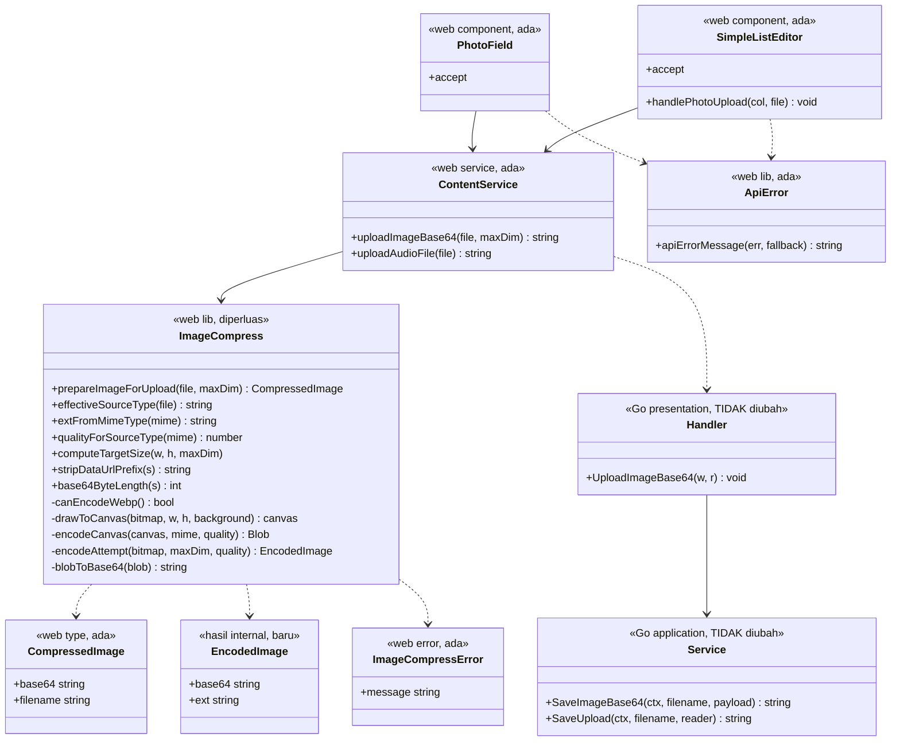
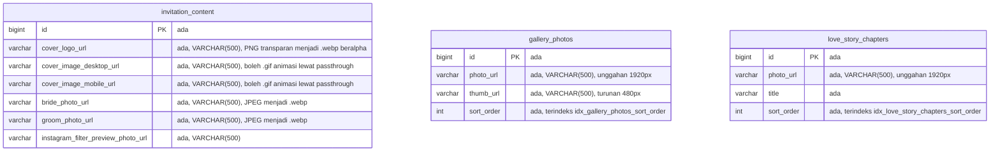
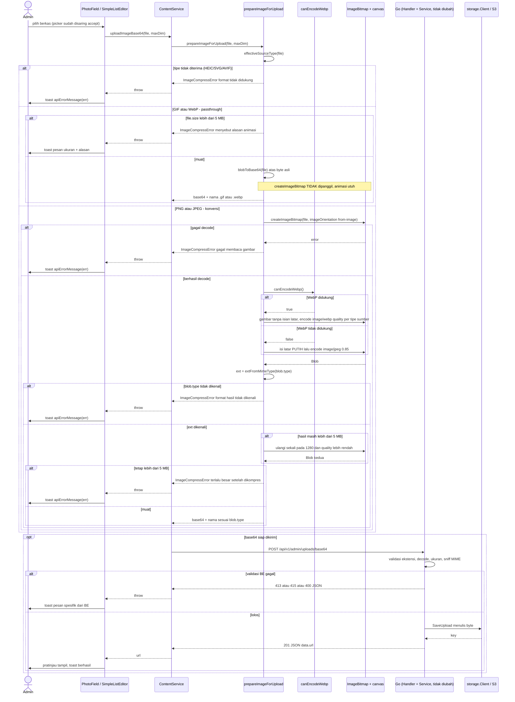

# PLAN — Pipeline Format Gambar `/admin/content`: Terima PNG/JPG/JPEG, Simpan WebP

Analis: System Analyst (sesi 2026-09-04)
Target pembaca: programmer yang mengimplementasikan.

**Status implementasi (2026-09-04):** Task 1-11 selesai dan terverifikasi
otomatis — `npm run typecheck -w apps/web` bersih, `npm run test -w apps/web`
120/120 lulus (naik dari 112, termasuk 8 test baru untuk pipeline ini),
`go test ./...` identik dengan sebelum perubahan, dan `git diff --stat apps/api`
kosong (kriteria selesai #7). Lint tidak bertambah error (tetap 4, semuanya
pra-eksisting di luar lingkup — kriteria selesai #6).

**Task 12 (verifikasi menyeluruh) SELESAI — termasuk uji manual ujung-ke-ujung
di browser sungguhan (2026-09-04, sesi lanjutan).** `.env` lokal tidak memuat
kredensial S3 (dibuktikan: `go run ./cmd/server` gagal boot dengan
`failed to create object storage client: ... does not follow ip address or
domain name standards`), dan Docker tidak tersedia di mesin ini untuk MinIO.
Karena itu dibangun mock S3 minimal sekali pakai (HTTP polos, mengimplementasikan
`PutObject`/`GetObject`/`GetBucketLocation` seperlunya untuk `minio-go`,
termasuk membuka bungkus `STREAMING-AWS4-HMAC-SHA256-PAYLOAD` yang dipakai
`minio-go` saat `S3_USE_SSL=false` — di produksi dengan HTTPS jalur ini tidak
pernah dipakai, jadi ini murni kebutuhan tooling verifikasi, bukan kode
produksi) — **tidak menyentuh kode di `apps/api` sama sekali** (`git diff
--stat apps/api` tetap kosong sesudahnya). Backend nyata dan frontend hasil
`npm run build:web` dijalankan sungguhan (pola `PUBLIC_DIR` yang sama seperti
produksi, agar SPA fallback `admin.html` benar — dev server Vite TIDAK
menyajikan entry kedua ini dengan benar), lalu didorong dengan Playwright
(Chromium sungguhan, bukan simulasi) lewat login admin asli dan unggahan
sungguhan ke `/admin/content`.

Hasil, dengan bukti yang diperiksa sampai ke isi byte/piksel, bukan cuma
status HTTP:
- **Butir 1 (PNG bertransparansi)** — diunggah sebagai Logo, tersimpan
  `logo-transparan.webp` (bukan tebakan `.webp` — nama file yang BENAR-BENAR
  dipakai `blob.type`, membuktikan T1). Didekode ulang dengan Pillow:
  `RGBA`, 400×300, piksel kiri `(255,1,0,255)` ≈ merah solid asli (artefak
  kompresi quality 0.92 wajar), piksel kanan `(0,0,0,0)` — **transparansi
  penuh terjaga** (D3).
- **Butir 4 (GIF animasi)** — diunggah sebagai Gambar Cover (Desktop),
  tersimpan `cover-animasi.gif` (passthrough, bukan `.webp`). Byte hasil
  unduh **identik byte-demi-byte** dengan berkas asli (`cmp` sukses),
  `image/gif.DecodeAll` mengonfirmasi tetap 2 frame dengan delay `[20 20]`.
  Dan yang paling penting — **animasinya benar-benar diputar di Chromium
  sungguhan**: dua tangkapan layar `` 220ms terpisah menghasilkan hash
  SHA-256 berbeda berpola A-A-B-B-B-B-A-A (bukan noise), dan tangkapannya
  sendiri terlihat jelas **hijau lalu merah** — regresi T2 terbukti hilang,
  bukan diasumsikan hilang.
- **Butir 6 (WebP)** — diunggah, tersimpan tetap `.webp`, byte hasil unduh
  identik byte-demi-byte dengan berkas asli (passthrough sejati, tidak
  di-re-encode).
- **Butir 5 (GIF di atas 5 MB)** — ditolak, toast mengandung kata
  "animasi" sesuai pesan §3.2 (D4), bukan pesan generik.
- **Butir 7 (picker)** — atribut `accept` pada `<input type="file">`
  sungguhan di DOM terbaca persis
  `image/png,image/jpeg,image/gif,image/webp,.png,.jpg,.jpeg,.gif,.webp`.
- Response header `Content-Type: image/gif` dan `image/webp` terkonfirmasi
  benar dari route penyajian `/uploads/{category}/{filename}` (bukan
  `application/octet-stream` yang bisa mencegah animasi diputar browser).
- **Nol console error, nol page error** di seluruh sesi Chromium.

**Belum sempat diuji dari sesi ini** (bukan diblokir, hanya di luar waktu
tersedia): butir 2 (foto JPEG ber-EXIF-Orientation dari HP sungguhan — sulit
direproduksi dari fixture sintetis karena `image/jpeg` Go tidak menulis EXIF;
paling andal diuji dengan foto asli dari HP), butir 3 (JPEG besar di tab
Galeri Foto — mekanismenya identik dengan butir 1 yang sudah terbukti, hanya
beda kolom target), dan butir 8 (audio, tidak tersentuh kode ini sama
sekali). Task 13 dari PLAN sebelumnya (nginx VPS) tetap terpisah dan tetap
tertunda seperti sudah dicatat di §4.2.

Rencana lanjutan dari [`docs/plan/admin-content-upload-base64/PLAN.md`](../admin-content-upload-base64/PLAN.md)
(disebut **PLAN sebelumnya** di dokumen ini). Keputusan K1–K8 di sana tetap
berlaku dan **tidak** dibuka ulang; dokumen ini hanya menambah keputusan
D1–D4 dan memperbaiki tiga cacat yang lolos dari implementasi kemarin.

---

## 1. Pernyataan requirement yang sudah disepakati

Pemilih berkas di `/admin/content` harus menerima **PNG, JPG, dan JPEG**,
sementara pemrosesan dan penyimpanannya tetap menghasilkan **WebP**. Mekanismenya
harus "ideal dan optimal" — yang oleh trace diterjemahkan menjadi: tidak ada
kegagalan senyap, tidak ada kehilangan kualitas atau informasi yang tidak
disengaja, dan tidak ada pekerjaan sia-sia pada berkas yang memang tidak perlu
dikonversi.

### Klasifikasi intent

**Bug fix + Enhancement.**
- *Bug fix*: trace menemukan tiga cacat nyata pada pipeline yang dibangun kemarin
  (T1, T2, T3 di bawah) — dua di antaranya menyebabkan kegagalan atau kehilangan
  data yang tidak terlihat oleh admin.
- *Enhancement*: penyempitan daftar format yang boleh dipilih, kualitas per tipe
  sumber, dan jalur passthrough untuk format yang tidak boleh dikonversi.

Bukan kapabilitas baru: endpoint, storage, dan modul kompresinya sudah ada.

### Keputusan yang dikunci di Step 0 (jawaban user, dicatat apa adanya)

| # | Pertanyaan | Jawaban user |
|---|---|---|
| D1 | Format apa saja yang boleh dipilih, dan bagaimana GIF diperlakukan? | **PNG/JPG/JPEG dikonversi ke WebP; GIF & WebP diteruskan apa adanya (passthrough) tanpa canvas**, supaya animasi GIF tidak mati dan berkas yang sudah WebP tidak rugi generasi. |
| D2 | Seberapa keras jaminan "disimpan dalam WebP"? | **Best-effort di browser + fallback yang benar.** Deteksi dukungan encoder lebih dulu, urutan WebP → JPEG, dan ekstensi **selalu** diturunkan dari `blob.type` yang sebenarnya. Nol dependency baru, nol perubahan Dockerfile. |
| D3 | Kualitas & transparansi | **Kualitas per tipe sumber: PNG quality 0.92, JPEG quality 0.82.** Alpha dipertahankan di WebP; bila terpaksa fallback JPEG, alpha di-flatten ke **putih**, bukan hitam. |

### Keputusan yang dikunci di Step 4 (jawaban user, dicatat apa adanya)

| # | Pertanyaan | Jawaban user |
|---|---|---|
| D4 | Batas ukuran & jalur untuk berkas passthrough | **Tetap lewat endpoint base64, batas 5 MB, nol perubahan infra.** GIF/WebP ikut `POST /api/v1/admin/uploads/base64` yang sama dengan batas `maxImageDecodedSize` yang sudah ada. |

Bukti yang mendasari D4 dan disampaikan ke user sebelum ia memilih: cover GIF
produksi yang ada di repo berukuran **4.568.543 byte (≈ 4,36 MB)**
([`apps/web/public/media/uploads/`](../../../apps/web/public/media/uploads/)),
sehingga **muat** di bawah batas 5 MB — base64-nya ≈ 5,8 MB, masih di bawah
`maxBase64BodySize` 8 MB dan `client_max_body_size` 12m. Sisa headroom-nya
hanya ~15%, dan itu disampaikan apa adanya sebagai konsekuensi yang diterima.

### Penentuan reuse / extend / create-new (hasil trace Step 3 & 5)

| Bagian | Putusan | Bukti |
|---|---|---|
| **Seluruh backend Go** — `Handler.UploadImageBase64`, `Service.SaveImageBase64`, `Service.SaveUpload` | **Tidak ada perubahan sama sekali** | `allowedUploadExt` / `categoryByExt` / `contentTypeByExt` sudah memuat kelima ekstensi yang dipakai rencana ini (`.png`, `.jpg`, `.jpeg`, `.webp`, `.gif`) — [`service_upload.go:18-37`](../../../apps/api/internal/modules/content/application/service_upload.go#L18-L37). `SaveImageBase64` sudah men-sniff byte dan mencocokkannya dengan ekstensi lalu menyerahkannya ke `SaveUpload` — [`service_upload.go:101-136`](../../../apps/api/internal/modules/content/application/service_upload.go#L101-L136) |
| `PhotoField` & `handlePhotoUpload` di `SimpleListEditor` | **Hanya nilai `accept` yang berubah** — logika unggah, `derivesTo`, dan fallback thumbnail tidak disentuh | [`ContentPage.tsx:48-106`](../../../apps/web/src/modules/admin/content/pages/ContentPage.tsx#L48-L106), [`SimpleListEditor.tsx:111-141`](../../../apps/web/src/modules/admin/content/components/SimpleListEditor.tsx#L111-L141) |
| `uploadAudioFile` | **Tidak disentuh** — jalur musik latar tidak ada hubungannya dengan pipeline gambar | [`content.service.ts:28-33`](../../../apps/web/src/modules/admin/content/services/content.service.ts#L28-L33) |
| Tipe `CompressedImage` | **Reuse tanpa perubahan** — bentuk `{ base64, filename }` tetap jadi kontrak keluaran, sehingga `content.service.ts` tidak perlu menyesuaikan apa pun selain nama fungsi | [`image-compress.ts:12-15`](../../../apps/web/src/shared/lib/image-compress.ts#L12-L15) |
| `maxImageDecodedSize` (5 MB) | **Tidak diubah** (D4) | [`service_upload.go:44`](../../../apps/api/internal/modules/content/application/service_upload.go#L44) |
| `maxBase64BodySize` (8 MB) | **Tidak diubah** — 5 MB decoded ≈ 6,67 MB base64, masih di bawahnya | [`handler.go:148`](../../../apps/api/internal/modules/content/presentation/handler.go#L148) |
| `client_max_body_size 12m` | **Tidak diubah** (D4) | [`infra/nginx/nginx.conf:7`](../../../infra/nginx/nginx.conf#L7) |
| `computeTargetSize`, `stripDataUrlPrefix`, `base64ByteLength` | **Reuse tanpa perubahan** | [`image-compress.ts:19-40`](../../../apps/web/src/shared/lib/image-compress.ts#L19-L40) |
| `blobToBase64` | **Reuse** — dipakai ulang oleh jalur passthrough (sebuah `File` juga sebuah `Blob`) | [`image-compress.ts:56-63`](../../../apps/web/src/shared/lib/image-compress.ts#L56-L63) |
| `encodeCanvas` | **Reuse tanpa perubahan** | [`image-compress.ts:52-54`](../../../apps/web/src/shared/lib/image-compress.ts#L52-L54) |
| `drawToCanvas` | **Extend** — tambah parameter warna latar untuk flatten alpha (D3) | [`image-compress.ts:42-50`](../../../apps/web/src/shared/lib/image-compress.ts#L42-L50) |
| `encodeAttempt` | **Extend** — ekstensi dari `blob.type`, target dari hasil probe (D2) | [`image-compress.ts:65-82`](../../../apps/web/src/shared/lib/image-compress.ts#L65-L82) |
| `compressImageToBase64` | **Extend + ganti nama** jadi `prepareImageForUpload` | [`image-compress.ts:87-116`](../../../apps/web/src/shared/lib/image-compress.ts#L87-L116) |
| `uploadImageBase64` di `content.service.ts` | **Tanda tangan & isi tidak berubah** — hanya nama fungsi yang diimpor | [`content.service.ts:39-47`](../../../apps/web/src/modules/admin/content/services/content.service.ts#L39-L47) |
| `apiErrorMessage` | **Reuse tanpa perubahan** — `ImageCompressError` tidak punya `response`, jadi jatuh ke cabang `err.message` dan pesan Indonesia-nya tampil apa adanya | [`api-error.ts`](../../../apps/web/src/shared/lib/api-error.ts) |
| Probe dukungan encoder WebP | **Create new** — `canEncodeWebp()` | Tidak ada deteksi kemampuan encoder di mana pun; `grep toDataURL` di `apps/web/src` nihil |
| Jalur passthrough | **Create new** | Tidak ada cabang non-canvas; setiap image saat ini dipaksa lewat `createImageBitmap` — [`image-compress.ts:97`](../../../apps/web/src/shared/lib/image-compress.ts#L97) |

---

## 2. Hasil trace — lima temuan

### T1 — Bug: ekstensi diturunkan dari tipe yang *diminta*, bukan yang benar-benar dihasilkan

[`image-compress.ts:69-74`](../../../apps/web/src/shared/lib/image-compress.ts#L69-L74)
menetapkan `ext = 'webp'` **sebelum** tahu apa yang dihasilkan browser, dan
mengandalkan `blob === null` sebagai sinyal "WebP tidak didukung".

Spesifikasi HTML untuk `canvas.toBlob(callback, type, quality)` menyatakan bahwa
bila `type` tidak didukung user agent, hasilnya **dibuat dengan format PNG** —
bukan `null`. Artinya cabang `if (!blob)` di baris 71-75 praktis **kode mati**,
dan yang terjadi di browser tanpa encoder WebP (Safari < 14, sebagian WebView)
adalah:

1. `toBlob(..., 'image/webp', ...)` mengembalikan Blob **PNG**.
2. Blob itu dikirim dengan nama `foto.webp`.
3. BE men-sniff `image/png`, membandingkannya dengan `contentTypeByExt[".webp"]`
   = `image/webp`, tidak cocok → `ErrContentTypeMismatch`
   ([`service_upload.go:130-133`](../../../apps/api/internal/modules/content/application/service_upload.go#L130-L133)).
4. Admin menerima **HTTP 400 "Isi file tidak cocok dengan ekstensinya"** — pesan
   yang tidak memberi petunjuk apa pun tentang penyebab sebenarnya.

Ini justru melanggar instruksi PLAN sebelumnya §3.3 yang berbunyi *"Ekstensi nama
file mengikuti tipe blob yang benar-benar dihasilkan, supaya validasi ekstensi di
BE selalu cocok dengan byte-nya"* — implementasinya tidak menuruti kalimat itu.

Efek lanjutan: karena hasilnya PNG, argumen `quality` diabaikan (PNG lossless),
sehingga foto 1920px bisa menghasilkan berkas beberapa MB → menabrak batas 5 MB →
percobaan ulang di [`image-compress.ts:104-109`](../../../apps/web/src/shared/lib/image-compress.ts#L104-L109)
juga PNG dan tetap besar → berakhir di `'Ukuran gambar masih terlalu besar setelah dikompres.'`
Jadi di browser tersebut unggahan foto **gagal total**, lewat dua jalur berbeda.

### T2 — Regresi: GIF animasi menjadi statis

Sebelum perubahan kemarin, `uploadPhoto` mengirim byte asli sehingga GIF animasi
tersimpan utuh dan tersaji sebagai `` yang beranimasi. Sejak kemarin **setiap**
image dipaksa melewati `createImageBitmap` + canvas
([`image-compress.ts:97`](../../../apps/web/src/shared/lib/image-compress.ts#L97)),
dan canvas hanya mengambil **frame pertama** — animasi hilang tanpa pesan apa pun.

Ini bukan skenario hipotetis. Cover animasi memang dipakai produksi:
- [`Cover.tsx:51-59`](../../../apps/web/src/components/Cover/Cover.tsx#L51-L59) memilih
  `<video>` atau `` lewat `isVideoUrl` ([`coverMedia.ts:6-8`](../../../apps/web/src/shared/lib/coverMedia.ts#L6-L8)),
  jadi URL berakhiran `.gif` sengaja disajikan sebagai `` yang beranimasi.
- Fixture [`Cover.test.tsx:25-26`](../../../apps/web/src/components/Cover/Cover.test.tsx#L25-L26)
  memakai nama berkas bergaya produksi (`gif-872371-...gif`, `gif-872375-...mp4`),
  dan berkasnya benar-benar ada di [`apps/web/public/media/uploads/`](../../../apps/web/public/media/uploads/).

### T3 — Orientasi EXIF tidak dipaksa eksplisit

[`image-compress.ts:97`](../../../apps/web/src/shared/lib/image-compress.ts#L97)
memanggil `createImageBitmap(file)` tanpa opsi. Default `imageOrientation` pada
browser modern memang sudah `from-image`, tetapi historisnya `none` dan masih
berbeda pada Safari/WebView lama. Bila default-nya `none`, foto potret dari HP
(pikselnya lanskap + tag EXIF Orientation) akan digambar tanpa rotasi, lalu
di-encode ulang ke WebP yang **tidak membawa EXIF** — sehingga gambar tersimpan
**terputar 90° secara permanen** dan tidak bisa dikoreksi lagi di sisi tampilan.

Memaksa `{ imageOrientation: 'from-image' }` menghapus ketergantungan pada default
browser. Tipe `ImageOrientation` di lib TypeScript proyek ini sudah memuat nilai
tersebut — diverifikasi di `node_modules/typescript/lib/lib.dom.d.ts:39311` —
jadi perubahan ini tidak memecahkan `tsc`.

### T4 — Alpha akan menjadi hitam pada jalur fallback JPEG

`drawToCanvas` ([`image-compress.ts:42-50`](../../../apps/web/src/shared/lib/image-compress.ts#L42-L50))
menggambar ke canvas yang latarnya transparan. Untuk target WebP itu benar (WebP
mendukung alpha). Untuk target JPEG — yang **tidak** mendukung alpha — area
transparan akan menjadi hitam, dan field **Logo**
([`ContentPage.tsx:451`](../../../apps/web/src/modules/admin/content/pages/ContentPage.tsx#L451))
adalah PNG bertransparansi yang persis kena kasus ini.

Perlu dicatat jujur: hari ini cacat ini **belum bisa tercapai**, karena cabang
JPEG-nya adalah kode mati akibat T1. Ia menjadi nyata begitu T1 diperbaiki dan
fallback JPEG benar-benar dipakai — jadi T4 wajib diperbaiki **dalam satu paket**
dengan T1, bukan setelahnya.

### T5 — `accept="image/*"` terlalu longgar untuk pipeline ini

[`ContentPage.tsx:85`](../../../apps/web/src/modules/admin/content/pages/ContentPage.tsx#L85)
dan [`SimpleListEditor.tsx:279`](../../../apps/web/src/modules/admin/content/components/SimpleListEditor.tsx#L279)
memakai `accept="image/*"`. Picker karenanya mengizinkan HEIC/HEIF (default kamera
iPhone), AVIF, BMP, dan SVG. HEIC gagal di-decode `createImageBitmap` pada
Chrome/Firefox sehingga admin hanya melihat *"Gagal membaca gambar. Coba berkas
lain."* setelah menunggu — kegagalan yang seharusnya dicegah di tingkat picker,
bukan ditemukan setelah berkas dipilih.

---

## 3. Desain solusi

Seluruh perubahan **terkurung di frontend**, dan sebagian besar di dalam satu
berkas `image-compress.ts`. Tidak ada perubahan Go, migrasi, nginx, maupun
Dockerfile.

### 3.1 Klasifikasi berkas sumber (D1)

Tiga himpunan konstanta baru:

```
CONVERT_TYPES     = image/png, image/jpeg          -> lewat canvas, jadi WebP
PASSTHROUGH_TYPES = image/gif, image/webp          -> byte asli, tanpa canvas
ACCEPTED_TYPES    = gabungan keduanya
```

`effectiveSourceType(file)` menentukan tipe efektif dari `file.type`, dan bila
`file.type` kosong atau tidak dikenal (terjadi pada sebagian kombinasi OS/browser)
jatuh ke ekstensi nama berkas. Mengembalikan `null` bila tidak termasuk
`ACCEPTED_TYPES` — pemanggil melempar `ImageCompressError` berpesan
*"Format tidak didukung. Pilih PNG, JPG, JPEG, GIF, atau WebP."*

Fungsi ini murni dan diekspor supaya bisa diuji di jsdom.

### 3.2 Jalur passthrough (D1, D4)

Untuk `image/gif` dan `image/webp`: **jangan sentuh `createImageBitmap` maupun
canvas sama sekali.** Cukup `blobToBase64(file)` atas berkas aslinya —
`File` adalah turunan `Blob`, jadi helper yang ada dipakai ulang tanpa perubahan.

Penjagaan ukurannya memakai `file.size` **sebelum** encoding base64, dengan pesan
yang menjelaskan sebabnya, bukan sekadar angka:
*"GIF dan WebP tidak dikompres agar animasinya tidak hilang, jadi ukurannya harus di bawah 5 MB."*

Passthrough **aman terhadap berkas yang salah label**, dan itu bukan kebetulan:
bila `file.type` mengaku `image/gif` padahal byte-nya PNG, byte itu dikirim
bernama `.gif`, lalu sniff di BE menangkapnya dan membalas 400 *"Isi file tidak
cocok dengan ekstensinya"* — untuk kasus ini pesan tersebut memang **akurat**,
berbeda dengan T1 di mana pesan yang sama justru menyesatkan. Jadi tidak
diperlukan pembacaan magic-byte tambahan di sisi frontend.

**WebP besar sengaja TIDAK di-re-encode.** Meng-encode ulang WebP yang ternyata
beranimasi akan membunuh animasinya persis seperti T2, dan mendeteksi WebP
beranimasi menuntut pembacaan chunk `ANIM` di dalam berkas — kompleksitas yang
tidak dibayar oleh requirement mana pun. Konsekuensinya WebP statis berukuran di
atas 5 MB ikut ditolak; itu diterima sebagai harga dari menjaga animasi tetap aman,
dan pesannya memberi tahu admin apa yang harus dilakukan.

### 3.3 Jalur konversi (D2, D3)

1. `createImageBitmap(file, { imageOrientation: 'from-image' })` — memperbaiki T3.
2. `quality = qualityForSourceType(effType)` → `image/png` → **0.92**,
   `image/jpeg` → **0.82** (D3).
3. Target encoder ditentukan **probe**, bukan tebakan:
   `canEncodeWebp()` membuat canvas 1×1 lalu memeriksa apakah
   `toDataURL('image/webp')` benar-benar diawali `data:image/webp`. Hasilnya
   di-memo sekali per sesi (sinkron, 1×1 piksel, biayanya tidak terukur).
   - Dukungan ada → target `image/webp`, canvas **tanpa** isian latar (alpha terjaga).
   - Tidak ada → target `image/jpeg` quality 0.85, canvas **diisi putih** lebih
     dulu sehingga alpha ter-flatten ke putih, bukan hitam (memperbaiki T4).
4. Ekstensi diturunkan dari **`blob.type`**, bukan dari tipe yang diminta
   (memperbaiki T1), lewat `extFromMimeType`:
   `image/webp`→`webp`, `image/jpeg`→`jpg`, `image/png`→`png`, `image/gif`→`gif`.
   Bila `blob.type` tidak dikenal → lempar `ImageCompressError` yang jelas.

   Perlu dicatat, ini juga membuat kasus terburuk T1 **berhasil** alih-alih
   error: seandainya browser tetap mengembalikan PNG di luar dugaan, berkas itu
   akan dinamai `.png`, dan `.png` sudah ada di whitelist BE
   ([`service_upload.go:18-20`](../../../apps/api/internal/modules/content/application/service_upload.go#L18-L20)) —
   sniff-nya cocok, unggahan lolos. Perbaikan ini menghilangkan 400 senyap tanpa
   perlu jalur penyelamat tambahan.
5. Bila hasilnya masih di atas 5 MB, ulangi **satu kali** pada `maxDim` 1280 dengan
   `Math.max(0.6, quality - 0.12)`. Masih lewat juga → `ImageCompressError`.

### 3.4 Penyempitan `accept` (T5)

Kedua input file memakai nilai yang sama:

```
accept="image/png,image/jpeg,image/gif,image/webp,.png,.jpg,.jpeg,.gif,.webp"
```

Daftar MIME **dan** ekstensi ditulis berdampingan dengan sengaja: sebagian
kombinasi OS/browser menyaring dengan andal hanya lewat salah satunya. Efeknya
HEIC/AVIF/BMP/SVG tidak lagi bisa dipilih, jadi kegagalan T5 dicegah di picker.

### 3.5 Penggantian nama fungsi masuk

`compressImageToBase64` → **`prepareImageForUpload`**. Setelah D1, fungsi ini
tidak selalu mengompres — untuk GIF/WebP ia justru sengaja tidak melakukannya.
Mempertahankan nama lama akan membuat pemanggil berikutnya menyangka setiap
berkas pasti dikompres, yaitu asumsi yang persis melahirkan T2. Hanya ada satu
pemanggil ([`content.service.ts:2,40`](../../../apps/web/src/modules/admin/content/services/content.service.ts#L39-L47))
dan satu mock di test, jadi biayanya dua baris.

---

## 4. Lingkup

### 4.1 Termasuk lingkup

| Berkas | Perubahan |
|---|---|
| [`apps/web/src/shared/lib/image-compress.ts`](../../../apps/web/src/shared/lib/image-compress.ts) | Konstanta & helper klasifikasi, probe WebP, jalur passthrough, ekstensi dari `blob.type`, flatten alpha, `imageOrientation`, ganti nama fungsi masuk |
| [`apps/web/src/modules/admin/content/services/content.service.ts`](../../../apps/web/src/modules/admin/content/services/content.service.ts) | Hanya menyesuaikan nama fungsi yang diimpor & dipanggil |
| [`apps/web/src/modules/admin/content/pages/ContentPage.tsx`](../../../apps/web/src/modules/admin/content/pages/ContentPage.tsx) | Nilai `accept` |
| [`apps/web/src/modules/admin/content/components/SimpleListEditor.tsx`](../../../apps/web/src/modules/admin/content/components/SimpleListEditor.tsx) | Nilai `accept` |
| [`apps/web/src/shared/lib/image-compress.test.ts`](../../../apps/web/src/shared/lib/image-compress.test.ts) | Test untuk helper murni yang baru |
| [`apps/web/src/modules/admin/content/services/content.service.test.ts`](../../../apps/web/src/modules/admin/content/services/content.service.test.ts) | Menyesuaikan nama pada `vi.mock` |
| [`knowledge/FRONTEND.md`](../../../knowledge/FRONTEND.md) | Mencatat aturan pipeline gambar admin |

### 4.2 Di luar lingkup

| Yang tidak disentuh | Alasan |
|---|---|
| Seluruh kode Go | Whitelist, sniff MIME, dan batas ukuran yang ada sudah tepat untuk kelima format — dibuktikan di tabel reuse §1 |
| `client_max_body_size`, `maxBase64BodySize`, `maxImageDecodedSize` | D4 memilih tetap pada batas 5 MB, jadi tidak ada rantai perubahan limit |
| Migrasi database | Kolom URL `VARCHAR(500)` tidak berubah; hanya isi ekstensinya yang bervariasi |
| Endpoint multipart `POST /api/v1/admin/uploads` | Tetap khusus audio (keputusan K2 PLAN sebelumnya), dan D4 memilih tidak memakainya untuk passthrough |
| Konversi GIF → MP4 | Sudah ditangani `convertCoversToVideo` di [`scripts/optimize-assets.mjs`](../../../scripts/optimize-assets.mjs) sebagai proses luring; tidak diminta dipindah ke admin |
| Unggah MP4/WebM lewat admin | Tidak pernah didukung (bukan regresi) — `allowedUploadExt` tidak memuatnya dan `accept` tidak pernah mengizinkannya |
| Deteksi WebP beranimasi | §3.2 menjelaskan alasannya: menuntut pembacaan chunk `ANIM`, tidak dibayar requirement mana pun |
| Task 13 PLAN sebelumnya (nginx VPS) | Masih tertunda dan **tetap wajib**, tetapi bukan bagian rencana ini |

---

## 5. Task list

Kerjakan berurutan. Task 1–6 semuanya menyunting `image-compress.ts` dan
membentuk **satu satuan kompilasi** bersama Task 7 — `npm run typecheck` baru
hijau kembali setelah Task 7, karena Task 6 mengganti nama fungsi yang diimpor
`content.service.ts`.

- [x] **Task 1** — `image-compress.ts`: tambahkan konstanta `CONVERT_TYPES`,
  `PASSTHROUGH_TYPES`, `ACCEPTED_TYPES`, dan `EXT_BY_MIME`. Ekspor helper murni
  `effectiveSourceType(file)`, `extFromMimeType(mime)`, dan
  `qualityForSourceType(mime)` sesuai §3.1 dan §3.3. Jangan ubah
  `computeTargetSize`, `stripDataUrlPrefix`, `base64ByteLength`, maupun kedua
  konstanta ukuran di [baris 9-10](../../../apps/web/src/shared/lib/image-compress.ts#L9-L10).

- [x] **Task 2** — `image-compress.ts`: tambahkan `canEncodeWebp()` sesuai §3.3
  langkah 3 — canvas 1×1, periksa `toDataURL('image/webp')` diawali
  `data:image/webp`, hasilnya di-memo dalam variabel modul. Bungkus dalam
  `try/catch` yang mengembalikan `false`, supaya lingkungan tanpa canvas
  (mis. jsdom saat test) tidak melempar.

- [x] **Task 3** — `image-compress.ts`: ubah `drawToCanvas`
  ([baris 42-50](../../../apps/web/src/shared/lib/image-compress.ts#L42-L50))
  agar menerima parameter warna latar opsional; bila diisi, `fillRect` seluruh
  kanvas dengan warna itu **sebelum** `drawImage`. Memperbaiki T4.

- [x] **Task 4** — `image-compress.ts`: tulis ulang `encodeAttempt`
  ([baris 65-82](../../../apps/web/src/shared/lib/image-compress.ts#L65-L82))
  sesuai §3.3 langkah 3-4: target ditentukan `canEncodeWebp()`, latar putih hanya
  untuk target JPEG, dan **ekstensi diturunkan dari `blob.type`** lewat
  `extFromMimeType`. Nilai kembaliannya tetap berbentuk `EncodedImage`
  (`{ base64, ext }`) seperti sekarang. Hapus cabang `if (!blob)` yang
  mengandalkan `null` sebagai sinyal tidak-didukung — itu kode mati (T1); `null`
  tetap ditangani, tapi sebagai kegagalan encoding biasa, bukan sebagai deteksi
  format.

- [x] **Task 5** — `image-compress.ts`: pada jalur konversi, ganti pemanggilan
  `createImageBitmap(file)` di [baris 97](../../../apps/web/src/shared/lib/image-compress.ts#L97)
  menjadi `createImageBitmap(file, { imageOrientation: 'from-image' })` (T3).

- [x] **Task 6** — `image-compress.ts`: ganti nama `compressImageToBase64` menjadi
  `prepareImageForUpload` (§3.5) dan susun ulang isinya menjadi dua cabang:
  validasi tipe efektif → **passthrough** (§3.2, tanpa `createImageBitmap`) atau
  **konversi** (§3.3, termasuk percobaan ulang 1280/quality-0.12). Penjagaan
  `MAX_SOURCE_BYTES` 25 MB tetap berlaku untuk cabang konversi; cabang passthrough
  dijaga `MAX_DECODED_BYTES` 5 MB yang lebih ketat, dengan pesan sesuai §3.2.
  Kedua cabang mengembalikan `CompressedImage` yang sama persis
  (`{ base64, filename }`), sehingga pemanggilnya tidak perlu tahu cabang mana
  yang dipakai.

- [x] **Task 7** — `content.service.ts`: sesuaikan impor di
  [baris 2](../../../apps/web/src/modules/admin/content/services/content.service.ts#L2)
  dan pemanggilan di [baris 40](../../../apps/web/src/modules/admin/content/services/content.service.ts#L39-L47)
  menjadi `prepareImageForUpload`. Tanda tangan `uploadImageBase64` **tidak berubah**,
  jadi tidak ada pemanggil lain yang ikut terdampak.

- [x] **Task 8** — `ContentPage.tsx`: ganti nilai `accept` di
  [baris 85](../../../apps/web/src/modules/admin/content/pages/ContentPage.tsx#L85)
  dengan daftar §3.4.

- [x] **Task 9** — `SimpleListEditor.tsx`: ganti nilai `accept` di
  [baris 279](../../../apps/web/src/modules/admin/content/components/SimpleListEditor.tsx#L279)
  dengan daftar §3.4 yang sama persis.

- [x] **Task 10** — [`knowledge/FRONTEND.md`](../../../knowledge/FRONTEND.md): catat
  aturan pipeline gambar admin (format yang diterima, mana yang dikonversi vs
  passthrough, dan alasan GIF/WebP tidak boleh melewati canvas) agar T2 tidak
  terulang oleh perubahan berikutnya.

- [x] **Task 11** — tulis test frontend (§6.1).

- [x] **Task 12** — jalankan verifikasi menyeluruh (§6.2).

---

## 6. Pengujian

### 6.1 Frontend (vitest)

**Batasan lingkungan yang harus dipatuhi pelaksana:** jsdom tidak
mengimplementasikan `canvas.getContext`, `canvas.toBlob`, maupun
`createImageBitmap` — peringatan *"Not implemented: HTMLCanvasElement's
getContext()"* sudah terlihat pada run test yang ada sekarang. Jadi jalur
konversi **tidak** diuji ujung-ke-ujung; yang diuji adalah helper murni dan
jalur passthrough (yang memang tidak menyentuh canvas sama sekali).

| Berkas | Test |
|---|---|
| `shared/lib/image-compress.test.ts` | `effectiveSourceType` mengenali PNG/JPG/JPEG/GIF/WebP dari `file.type`; **jatuh ke ekstensi** saat `file.type` kosong; mengembalikan `null` untuk HEIC/SVG/AVIF (regresi T5) |
| `shared/lib/image-compress.test.ts` | `extFromMimeType` memetakan keempat MIME yang dipakai dan mengembalikan `null` untuk yang tidak dikenal (regresi T1 — inilah fungsi yang menggantikan ekstensi tebakan) |
| `shared/lib/image-compress.test.ts` | `qualityForSourceType` mengembalikan 0.92 untuk `image/png` dan 0.82 untuk `image/jpeg` (D3) |
| `shared/lib/image-compress.test.ts` | `prepareImageForUpload` pada **GIF** mengembalikan `filename` berakhiran `.gif` dan base64 dari byte asli, **tanpa** memanggil `createImageBitmap` — dipasang lewat `vi.stubGlobal('createImageBitmap', spy)` lalu diperiksa `spy` tidak pernah terpanggil (regresi T2, dan inilah yang membuktikan animasi tidak dibunuh) |
| `shared/lib/image-compress.test.ts` | `prepareImageForUpload` pada GIF di atas 5 MB melempar `ImageCompressError` berpesan tentang animasi, bukan pesan generik (D4) |
| `shared/lib/image-compress.test.ts` | `prepareImageForUpload` pada tipe yang tidak diterima (mis. `image/heic`) melempar `ImageCompressError` sebelum menyentuh canvas |
| `modules/admin/content/services/content.service.test.ts` | Menyesuaikan `vi.mock('@/shared/lib/image-compress')` ke nama `prepareImageForUpload`; ketiga test yang ada harus tetap lulus tanpa perubahan ekspektasi lain |

Jalur konversi tetap diverifikasi, tetapi lewat uji manual §6.2 — bukan lewat
test otomatis yang berpura-pura menjalankan canvas.

### 6.2 Verifikasi menyeluruh

```
npm run typecheck -w apps/web
npm run test -w apps/web
cd apps/api && go test ./...
```

`go test` tetap dijalankan sebagai bukti bahwa rencana ini benar-benar tidak
menyentuh backend — hasilnya harus identik dengan sebelum perubahan.

Uji manual di `/admin/content`, menutup setiap temuan:

1. **PNG bertransparansi** (field Logo, tab Cover & Banner) — unggah, simpan, muat
   ulang. Gambar tersimpan sebagai `.webp`, transparansinya masih ada, tepi
   garis/teks tidak berbayang (D3).
2. **JPG foto dari HP dalam orientasi potret** (tab Profil Pasangan) — pastikan
   hasil tersimpan **tidak terputar** (T3).
3. **JPEG besar 6-10 MB** (tab Galeri Foto) — berhasil, dan satu baris galeri
   berisi `photoUrl` maupun `thumbUrl`.
4. **GIF animasi ≤ 5 MB** (field Gambar Cover) — setelah disimpan dan halaman
   undangan dibuka, cover **masih beranimasi** (T2). Ini uji yang paling penting
   dalam daftar ini karena ia satu-satunya yang membuktikan regresi kemarin sudah
   benar-benar hilang.
5. **GIF di atas 5 MB** — ditolak dengan pesan yang menyebut alasan animasi, bukan
   pesan generik (D4).
6. **Berkas WebP** — diteruskan apa adanya, tetap `.webp`.
7. **Picker** — pada dialog pilih berkas, berkas HEIC/SVG/BMP tidak lagi bisa
   dipilih (T5).
8. `/admin/settings` — unggah berkas musik, memastikan jalur multipart audio tidak
   ikut terdampak.

---

## 7. Catatan performa dan volume data

Volume yang diasumsikan sama seperti PLAN sebelumnya: **satu undangan pernikahan**,
satu hingga dua admin yang mengunggah, tidak bersamaan, dari browser desktop.

- **Jalur passthrough justru lebih murah dari keadaan sekarang.** GIF/WebP tidak
  lagi didekode ke bitmap dan di-encode ulang; hanya dibaca sebagai base64. Untuk
  cover GIF 4,36 MB itu berarti satu dekode animasi penuh dan satu encode canvas
  yang hilang sepenuhnya.
- **`canEncodeWebp()` dijalankan sekali per sesi** dan hasilnya di-memo. Canvas
  1×1 dengan `toDataURL` sinkron — biayanya tidak terukur, dan tidak pernah
  diulang per unggahan.
- **Jalur konversi tidak bertambah mahal**: tetap satu dekode + satu encode
  (dua bila hasil pertama masih di atas 5 MB), sama seperti sekarang.
- **Tidak ada query, loop, atau pemanggilan jaringan baru.** Backend tidak
  tersentuh, jadi tidak ada permukaan N+1, indeks, maupun paginasi baru untuk
  dinilai. Payload publik tetap berisi URL pendek.
- **Memori puncak di browser tidak berubah, dan tetap patut diawasi.** Penjagaan
  `MAX_SOURCE_BYTES` 25 MB berlaku pada ukuran *berkas*, bukan jumlah piksel —
  sebuah JPEG 20 MB bisa berisi puluhan megapiksel, dan `ImageBitmap`-nya memakai
  ~4 byte per piksel. Ini kondisi yang **sudah ada sejak kemarin dan tidak
  diperburuk** rencana ini. Pada volume di atas (satu admin, satu gambar pada satu
  waktu, browser desktop) ini aman. Menambahkan penjagaan berbasis megapiksel
  adalah perbaikan yang wajar, tetapi sengaja **tidak** dimasukkan karena tidak
  diminta dan tidak ada bukti ia pernah menjadi masalah — dicatat di sini sebagai
  penilaian yang sudah dipertimbangkan, bukan pertanyaan yang tidak pernah
  diajukan.

---

## 8. Diagram

### 8.1 Class diagram

Kotak `ContentService` dan `ApiError` adalah **label pengelompokan per berkas**,
bukan nama tipe di kode: `ContentService` = [`content.service.ts`](../../../apps/web/src/modules/admin/content/services/content.service.ts),
`ApiError` = [`api-error.ts`](../../../apps/web/src/shared/lib/api-error.ts).
Sisanya nama nyata.



### 8.2 ERD

**Tidak ada perubahan sisi data sama sekali** — tidak ada tabel baru, kolom baru,
maupun perubahan tipe. Diagram ini sengaja dibuat minimal dan hanya menunjukkan
kolom pada `invitation_content`, `gallery_photos`, dan `love_story_chapters` yang
menerima URL hasil unggahan, karena satu-satunya hal yang berubah adalah
**ekstensi pada nilai URL** yang disimpan (`.webp` untuk hasil konversi,
`.gif`/`.webp` untuk passthrough) — bukan strukturnya. Ketiganya dimiliki modul
`content` dan tidak punya foreign key lintas modul.



### 8.3 Sequence diagram

Alur satu unggahan, dengan percabangan passthrough vs konversi dan seluruh jalur
kegagalan yang wajib ditangani.



---

## 9. Kriteria selesai

1. PNG, JPG, dan JPEG bisa dipilih dan tersimpan sebagai `.webp`, dengan
   transparansi PNG tetap utuh.
2. GIF animasi yang diunggah **tetap beranimasi** setelah tersimpan (T2 hilang).
3. Tidak ada lagi kemungkinan 400 "Isi file tidak cocok dengan ekstensinya" akibat
   ketidakcocokan antara ekstensi dan byte yang dihasilkan browser (T1 hilang).
4. Foto potret dari HP tersimpan dengan orientasi benar (T3 hilang).
5. Berkas yang tidak didukung tidak bisa dipilih dari picker, dan bila lolos tetap
   ditolak dengan pesan berbahasa Indonesia yang menjelaskan sebabnya (T5).
6. `npm run typecheck -w apps/web`, `npm run test -w apps/web`, dan
   `go test ./...` lulus. Catatan: `npm run lint` masih memuat 4 error
   pra-eksisting di `Modal.tsx`, `http-client.ts`, dan `ToastProvider.tsx` yang
   berada di luar lingkup rencana ini — kriteria ini terpenuhi bila jumlah error
   lint **tidak bertambah**.
7. Backend benar-benar tidak berubah — `git diff --stat apps/api` kosong.
