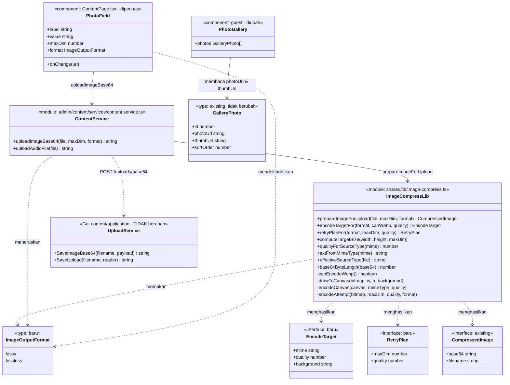
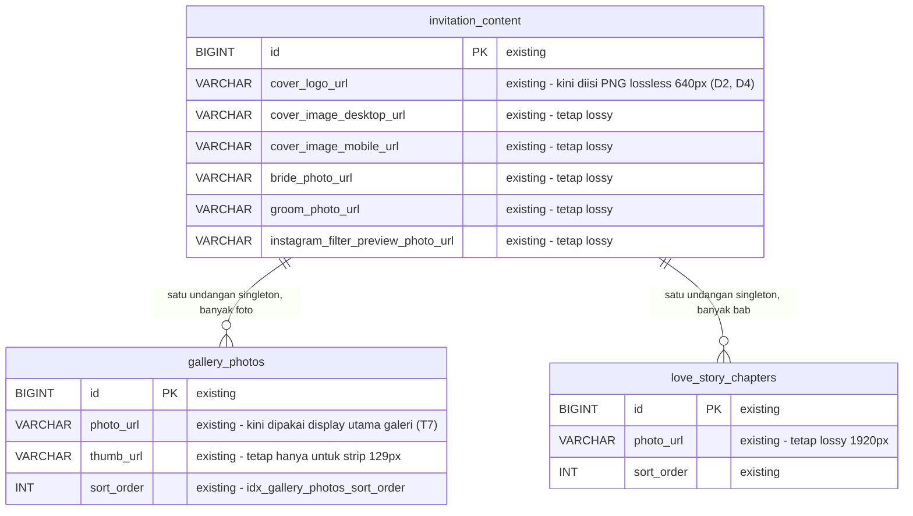
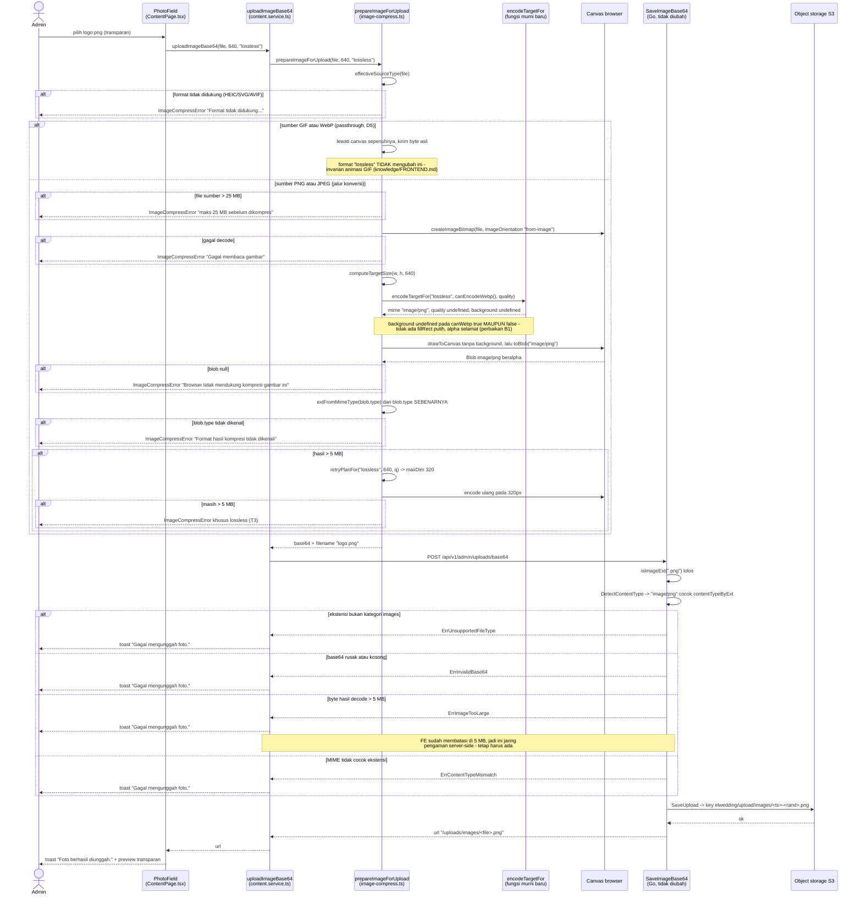
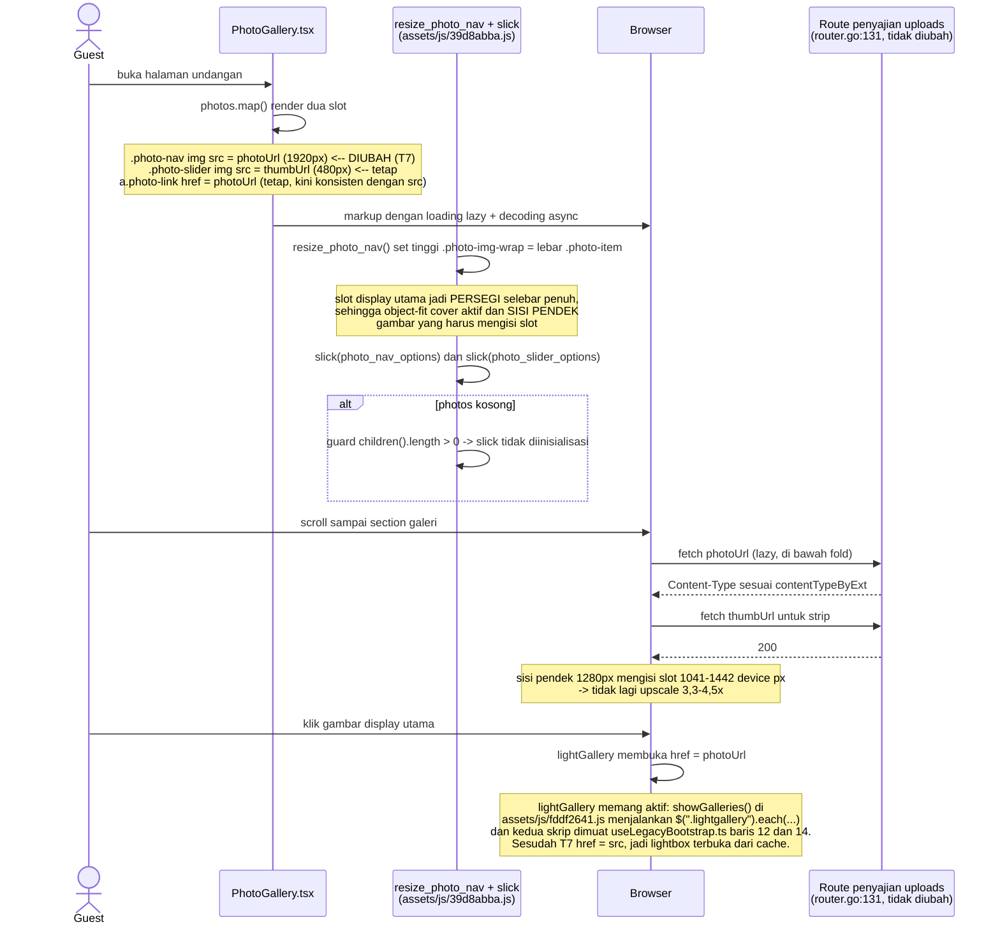

# PLAN — Format Gambar Lossless per-Field di `/admin/content` + Galeri Guest Tidak Pecah

Analis: System Analyst (sesi 2026-09-04)
Target pembaca: programmer yang mengimplementasikan.

---

## 1. Pernyataan requirement (hasil Step 0, sudah dikonfirmasi user)

Dua hal dalam satu batch pekerjaan, dengan klasifikasi intent berbeda:

**R1 — Bug fix.** Gambar yang seharusnya berlatar transparan (Logo) tersimpan
dengan **latar putih** — user mengonfirmasi ini benar-benar terjadi, bukan
dugaan ("yang harusnya background nya transparant menjadi memiliki background
putih, itu artinya rusak"). Permintaan awal user adalah "jangan ke WebP, semua
ke PNG saja". Setelah trace, akar masalahnya bukan WebP melainkan **encoder
lossy + flatten latar putih**; lihat §2.1. Perbaikannya adalah jalur
**PNG lossless** untuk field yang memang butuh transparansi.

**R2 — Bug fix.** Gambar yang dipakai sebagai cover/thumbnail utama di galeri
halaman guest tampil pecah. Akar masalahnya murni salah pilih aset, bukan
format; lihat §2.2.

### 1.1 Koreksi premis yang harus diketahui programmer

Permintaan awal berbunyi "WebP tidak support background transparant". **Premis
itu tidak akurat, dan sudah dibuktikan salah di project ini sendiri:**

- `docs/plan/admin-content-image-format-pipeline/PLAN.md` (bagian "Butir 1")
  mencatat verifikasi pixel-level: PNG transparan diunggah sebagai Logo,
  hasilnya didekode ulang dengan Pillow → mode `RGBA`, piksel kanan
  `(0,0,0,0)` — **alpha utuh di dalam WebP**.
- Seluruh ornamen template di [Cover.tsx:16](../../../apps/web/src/components/Cover/Cover.tsx#L16)
  dan seterusnya (`Orn-*.webp`) adalah WebP bertransparansi yang berjalan
  normal di produksi.

Yang **benar** dari keluhan user: encoder yang dipakai bersifat *lossy*, dan
verifikasi lama itu sendiri merekam merah `(255,0,0)` bergeser menjadi
`(255,1,0)`. Untuk logo bergaris/bertepi tajam, lossy memang alat yang salah.
Jadi masalahnya **lossy vs lossless**, bukan **WebP vs PNG**. Desain di bawah
menyelesaikan gejala yang user lihat secara struktural — bukan dengan mengubah
semua ke PNG.

### 1.2 Keputusan terkunci (dijawab user di Step 0)

| # | Keputusan | Jawaban user |
|---|---|---|
| K1 | Aturan format output upload | **Lossless per-field.** Field yang butuh transparansi/tepi tajam (Logo) dipaksa PNG lossless; field foto tetap lossy. |
| K2 | Encoder jalur foto (tanpa transparansi) | **Tetap WebP** (dengan fallback JPEG apa adanya untuk browser tanpa encoder WebP). |
| K3 | Gejala transparansi | **Benar-benar terjadi di produksi** — latar transparan menjadi putih. Jadi R1 adalah bug fix, bukan pencegahan, dan akar penyebabnya wajib ditelusuri (sudah: §2.1). |
| K4 | Aset display utama galeri | **Pakai `photoUrl` (1920px)**; strip 129px tetap `thumbUrl` (480px). Tanpa aset baru, tanpa kolom DB baru. |

### 1.3 Keputusan desain (Step 4)

| # | Keputusan | Alasan |
|---|---|---|
| D1 | Format output jadi **properti per-field yang eksplisit**, bukan hasil heuristik | Mengikuti konvensi yang SUDAH ADA di codebase ini: `maxDim` memang sudah dikonfigurasi per-field (`ListColumn.maxDim` di [SimpleListEditor.tsx:13](../../../apps/web/src/modules/admin/content/components/SimpleListEditor.tsx#L13), `maxDim: 1920` di [ContentPage.tsx:594](../../../apps/web/src/modules/admin/content/pages/ContentPage.tsx#L594)). Kriteria yang memutuskan: **kecocokan dengan konvensi hasil trace** + blast radius terkecil. |
| D2 | Jalur `lossless` **tidak pernah** mengecat latar | Ini perbaikan struktural untuk K3: PNG mendukung alpha, jadi tidak ada alasan flatten. Dan `canvas.toBlob(cb, 'image/png')` dijamin spesifikasi HTML selalu berhasil (PNG adalah tipe default wajib), sehingga **tidak ada jalur fallback yang bisa mem-flatten** — beda dari kondisi sekarang. |
| D3 | Keputusan format diekstrak jadi **fungsi murni** `encodeTargetFor` / `retryPlanFor` | jsdom tidak mengimplementasikan `canvas.toBlob` maupun `createImageBitmap` (didokumentasikan di [image-compress.test.ts:12-15](../../../apps/web/src/shared/lib/image-compress.test.ts#L12)), jadi jalur konversi TIDAK bisa diuji ujung-ke-ujung. Mengekstrak keputusannya jadi fungsi murni membuat bug latar putih bisa punya **test regresi sungguhan**. Mengikuti konvensi file ini yang sudah mengekspor helper murni (`computeTargetSize`, `qualityForSourceType`, `extFromMimeType`). |
| D4 | `maxDim` Logo diturunkan **1920 → 640** | Wajib dibayar oleh K1: PNG lossless mengabaikan argumen quality, satu-satunya tuas ukuran adalah dimensi. Diukur dari CSS sungguhan: slot logo maksimum **160 CSS px** (selektor `section.cover .logo-wrap{max-width:150px}` dan `.footnote-wrap .logo-wrap{max-width:160px}` di `apps/web/public/assets/css/4e66ef9e.css` — berkas itu ter-minify menjadi SATU baris, jadi telusuri lewat selektornya, bukan nomor baris), jadi pada DPR 3 dibutuhkan 480 px → 640 memberi headroom 1,33×. Efek samping positif: sekarang logo justru **berhenti over-fetch** dari 1920px. |
| D5 | GIF/WebP tetap **passthrough** walau field-nya `lossless` | Invarian yang sudah tercatat di [knowledge/FRONTEND.md:39](../../../knowledge/FRONTEND.md#L39): canvas hanya mengambil frame pertama GIF dan membunuh animasi (regresi T2, cover animasi dipakai produksi). Konsekuensi yang diterima sadar: `.webp` yang diunggah ke field Logo tetap keluar `.webp` — mengubahnya jadi PNG berarti me-re-encode sumber lossy secara lossless (berkas membengkak, kualitas tidak membaik). |
| D6 | `SimpleListEditor` **tidak** diberi parameter format | Tidak ada satu pun kolom list yang butuh lossless hari ini (Galeri/Love Story/Rundown semuanya foto; tab Bank tidak punya kolom foto sama sekali — [ContentPage.tsx:632-634](../../../apps/web/src/modules/admin/content/pages/ContentPage.tsx#L632)). Menambah parameter yang belum dipakai = generalisasi spekulatif. |
| D7 | Perbaikan galeri **tidak** menyentuh pipeline gambar maupun DB | `photoUrl` 1920px sudah ada dan sudah dipakai sebagai `href` lightbox. Cukup dipakai juga sebagai `src` display utama. |

### 1.4 Determinasi reuse / extend / create-new (hasil Step 3 & 5)

| Sisi | Determinasi | Bukti |
|---|---|---|
| Tabel `gallery_photos` | **Tidak berubah** | Kolom `photo_url` + `thumb_url` sudah ada ([000001_create_content_tables.up.sql:77-84](../../../apps/api/migrations/000001_create_content_tables.up.sql#L77)); `idx_gallery_photos_sort_order` sudah menutupi ORDER BY. |
| Seluruh `apps/api` | **Tidak berubah** | `.png` sudah ada di ketiga map: `allowedUploadExt`, `categoryByExt` (→ `images`), `contentTypeByExt` (→ `image/png`) di [service_upload.go:18-37](../../../apps/api/internal/modules/content/application/service_upload.go#L18). `http.DetectContentType` untuk byte PNG mengembalikan tepat `image/png`, jadi cek `ErrContentTypeMismatch` di [service_upload.go:130](../../../apps/api/internal/modules/content/application/service_upload.go#L130) lolos tanpa perubahan. Route penyajian juga sudah memetakan `.png` → `image/png` ([router.go:41](../../../apps/api/internal/router/router.go#L41)). |
| `EXT_BY_MIME` | **Reuse** | Sudah memuat `'image/png': 'png'` ([image-compress.ts:24](../../../apps/web/src/shared/lib/image-compress.ts#L24)), jadi `extFromMimeType(blob.type)` untuk PNG langsung benar. |
| `drawToCanvas` | **Reuse** | Parameter `background?: string` sudah opsional ([image-compress.ts:114](../../../apps/web/src/shared/lib/image-compress.ts#L114)); jalur lossless cukup tidak mengirimnya. |
| `qualityForSourceType`, `computeTargetSize`, `base64ByteLength`, `stripDataUrlPrefix`, `effectiveSourceType`, `canEncodeWebp` | **Reuse, tanpa perubahan** | Semua sudah ada dan sudah tertest. |
| `encodeTargetFor`, `retryPlanFor` | **Create new** (2 fungsi murni kecil) | Celah nyata: keputusan mime/quality/background hari ini di-inline di dalam `encodeAttempt` ([image-compress.ts:151-156](../../../apps/web/src/shared/lib/image-compress.ts#L151)) sehingga tidak bisa dites di jsdom (D3). |
| `PhotoField` | **Extend** (2 prop opsional) | Sudah menerima props dan sudah memanggil `uploadImageBase64` ([ContentPage.tsx:48](../../../apps/web/src/modules/admin/content/pages/ContentPage.tsx#L48), [:93](../../../apps/web/src/modules/admin/content/pages/ContentPage.tsx#L93)). |
| `uploadImageBase64` | **Extend** (1 parameter opsional ke-3) | Sudah punya pola parameter opsional berdefault (`maxDim = 1920`) di [content.service.ts:39](../../../apps/web/src/modules/admin/content/services/content.service.ts#L39). |

---

## 2. Hasil trace (Step 1–3, 5)

Stack terkonfirmasi: monorepo npm workspaces — `apps/web` (React 19 + Vite +
Vitest, alias `@/*`) dan `apps/api` (Go 1.26 modular monolith, sqlc +
golang-migrate + MySQL, storage S3 via `minio-go`). **Tidak ada library
pemroses gambar di `apps/api/go.mod`** — seluruh resize/encode terjadi di
browser. Ini fakta penting: tidak ada opsi "resize di server" tanpa menambah
dependency baru, dan requirement ini tidak menuntutnya.

Entry point terkonfirmasi ada:
- Admin: `POST /api/v1/admin/uploads/base64` → [router.go:99](../../../apps/api/internal/router/router.go#L99) → `ContentHandler.UploadImageBase64` → `Service.SaveImageBase64` ([service_upload.go:101](../../../apps/api/internal/modules/content/application/service_upload.go#L101)).
  `SaveImageBase64` sendiri berakhir dengan mendelegasikan ke `SaveUpload` yang
  sama dengan jalur multipart, jadi penamaan berkas dan penulisan ke S3 tidak
  bercabang per format.
- Penyajian: `GET /uploads/{category}/{filename}` → [router.go:131](../../../apps/api/internal/router/router.go#L131).
- Guest: komponen `PhotoGallery` ([PhotoGallery.tsx](../../../apps/web/src/components/PhotoGallery/PhotoGallery.tsx)) mengonsumsi `GalleryPhoto[]` ([types/api.ts:78-83](../../../apps/web/src/types/api.ts#L78)).

### 2.1 Akar penyebab R1 — latar transparan menjadi putih

Hanya ada **satu** tempat di seluruh codebase yang mengecat latar, dan itu
persis penghasil gejalanya:

```ts
// image-compress.ts:120-125 (di dalam drawToCanvas; komentar baris 121-122 dielipsis)
if (background) {
  ctx.fillStyle = background
  ctx.fillRect(0, 0, width, height)
}

// image-compress.ts:151 dan 156 (di dalam encodeAttempt)
const useWebp = canEncodeWebp()
const canvas = drawToCanvas(bitmap, width, height, useWebp ? undefined : '#ffffff')
```

Jadi `#ffffff` hanya masuk ketika `canEncodeWebp()` ([image-compress.ts:101-112](../../../apps/web/src/shared/lib/image-compress.ts#L101))
mengembalikan `false` — probe `canvas.toDataURL('image/webp')` gagal. Pada
browser/versi yang mendukung *dekode* WebP tetapi belum mendukung *enkode*
WebP lewat canvas (kasus klasik Safari/iOS lama, di mana `toDataURL('image/webp')`
mengembalikan data URL PNG), probe **benar** melaporkan `false`, pipeline jatuh
ke JPEG, dan JPEG tidak punya alpha sehingga latar transparan dipanggang
menjadi putih secara permanen di berkas yang tersimpan.

Itu cocok persis dengan yang user lihat. Perhatikan: latar putih **tidak
mungkin** berasal dari WebP — jalur WebP sengaja mengirim `undefined` sebagai
background. Ini konfirmasi kedua bahwa premis "WebP membuang transparansi"
tidak akurat; pelakunya adalah fallback JPEG.

Perbaikan D2 menutup kelas bug ini untuk field lossless secara struktural,
bukan dengan menambal probe: PNG tidak butuh flatten, dan encoder PNG tidak
punya jalur fallback.

**Risiko residual yang diterima sadar (konsekuensi K1, bukan kelalaian):** PNG
transparan yang diunggah ke field **foto** (lossy) di browser tanpa encoder
WebP masih akan di-flatten putih di [image-compress.ts:156](../../../apps/web/src/shared/lib/image-compress.ts#L156).
Opsi auto-deteksi alpha akan menutup ini juga, dan user memilih K1 di atas opsi
tersebut secara sadar. Perilaku ini justru **benar** untuk field foto: flatten
putih adalah satu-satunya cara valid meng-encode alpha ke JPEG.

### 2.2 Akar penyebab R2 — galeri guest pecah

Rantai lengkapnya, terverifikasi hop demi hop:

1. [PhotoGallery.tsx:27](../../../apps/web/src/components/PhotoGallery/PhotoGallery.tsx#L27)
   memakai `photo.thumbUrl` untuk **display utama** (`.photo-nav`), dan
   [:43](../../../apps/web/src/components/PhotoGallery/PhotoGallery.tsx#L43)
   memakai `photo.thumbUrl` untuk **strip kecil** (`.photo-slider`). Aset yang
   sama untuk dua slot berukuran sangat berbeda.
2. `thumbUrl` dihasilkan pada **maxDim 480** — [ContentPage.tsx:595](../../../apps/web/src/modules/admin/content/pages/ContentPage.tsx#L595)
   (`derivesTo: { key: 'thumbUrl', maxDim: 480 }`), dieksekusi di
   [SimpleListEditor.tsx:124](../../../apps/web/src/modules/admin/content/components/SimpleListEditor.tsx#L124).
   Ingat: `maxDim` membatasi **sisi terpanjang** ([image-compress.ts:50-54](../../../apps/web/src/shared/lib/image-compress.ts#L50)),
   jadi foto 3:2 menjadi 480×320 — **sisi pendeknya hanya 320 px**.
3. Slot display utama dipaksa **persegi selebar penuh** oleh `resize_photo_nav`
   di `apps/web/public/assets/js/39d8abba.js` (`i.find(".photo-img-wrap").each(... $(e).css("height", t+"px"))`
   dengan `t` = lebar `.photo-item`).
4. CSS-nya `object-fit:cover` (selektor `.photo-nav .photo-img`), dan karena
   langkah 3 memberi parent tinggi eksplisit, `height:100%` + `cover`
   benar-benar aktif → **sisi pendek** gambar yang harus mengisi slot.
5. Lebar slot: mobile 375 CSS px → `margin:0 14px` (selektor `.photo-body .photo-nav-wrap`) → 347 CSS px, pada
   DPR 3 = **1041 device px**. Desktop 1920 px → `.secondary-pane{width:39%}` =
   749 → 721 CSS px, pada DPR 2 = **1442 device px**.
6. Jadi sisi pendek 320 px harus diregangkan ke 1041–1442 px → **upscale
   3,3×–4,5×**. Itulah "pecah"-nya, dan tidak ada format gambar apa pun yang
   bisa menyelamatkan upscale sebesar itu.

`photoUrl` (maxDim 1920) memberi sisi pendek 1280 px untuk foto 3:2 — menutup
kebutuhan mobile (1041) dengan lega dan hanya 1,13× kurang di desktop-retina
(1442), yang tidak terlihat mata. Aset ini **sudah ada** dan hari ini hanya
dipakai sebagai `href` lightbox di [PhotoGallery.tsx:26](../../../apps/web/src/components/PhotoGallery/PhotoGallery.tsx#L26).
Lightbox-nya nyata, bukan kelas CSS kosong: `showGalleries()` di
`apps/web/public/assets/js/fddf2641.js` menjalankan
`$(".lightgallery").each(... lightGallery(t, {download:!1}))`, dan baik
`lightgallery.min.js` maupun `fddf2641.js` dimuat di
[useLegacyBootstrap.ts:12](../../../apps/web/src/hooks/useLegacyBootstrap.ts#L12)
dan [:14](../../../apps/web/src/hooks/useLegacyBootstrap.ts#L14). Efek samping
yang menyenangkan dari T7: karena `src` display utama menjadi sama dengan
`href`, lightbox terbuka dari cache tanpa fetch tambahan.

Strip 129 px (selektor `.photo-slider .photo-img-wrap{height:129px}`) pada
DPR 3 butuh 387 px; `thumbUrl` 480px **sudah tepat** untuk slot itu. Jadi
`thumbUrl` bukan aset yang salah — hanya salah tempat pakai.

**Aman dari `src` kosong:** `photoUrl` divalidasi wajib tidak kosong baik saat
create maupun update ([service_lists.go:140](../../../apps/api/internal/modules/content/application/service_lists.go#L140)
untuk create dan [:164](../../../apps/api/internal/modules/content/application/service_lists.go#L164)
untuk update — perhatikan keduanya memang cek `in.PhotoUrl`, bukan `in.ThumbUrl`),
jadi menukar `src` ke `photoUrl` tidak memperkenalkan risiko gambar kosong.

**Catatan data seed yang WAJIB diketahui programmer:** di
[000004_seed.up.sql:49-57](../../../apps/api/migrations/000004_seed.up.sql#L49),
`thumb_url` menunjuk foto yang **berbeda** dari `photo_url` (mis. `photo-18.webp`
vs `photo-01.webp`) — itu data template lama, bukan thumbnail turunan. Akibatnya
pada data seed, display utama akan **berganti gambar** setelah perbaikan ini.
Itu bukan regresi: `href` lightbox-nya memang sudah `photoUrl`, jadi hari ini
mengklik thumbnail seed membuka foto yang sama sekali lain. Perbaikan ini
membuat display dan lightbox jadi konsisten. Pada baris hasil unggahan admin
sungguhan, kedua kolom berasal dari satu berkas, jadi yang berubah hanya
ketajamannya.

---

## 3. Lingkup

### 3.1 Masuk lingkup

| Berkas | Perubahan |
|---|---|
| [apps/web/src/shared/lib/image-compress.ts](../../../apps/web/src/shared/lib/image-compress.ts) | Tipe `ImageOutputFormat`; fungsi murni `encodeTargetFor` + `retryPlanFor`; `encodeAttempt` & `prepareImageForUpload` menerima `format`; pesan error khusus jalur lossless. |
| [apps/web/src/shared/lib/image-compress.test.ts](../../../apps/web/src/shared/lib/image-compress.test.ts) | Test regresi latar putih + test perilaku lossy tidak berubah + test passthrough di bawah `lossless`. |
| [apps/web/src/modules/admin/content/services/content.service.ts](../../../apps/web/src/modules/admin/content/services/content.service.ts) | `uploadImageBase64` menerima parameter ke-3 `format`. |
| [apps/web/src/modules/admin/content/pages/ContentPage.tsx](../../../apps/web/src/modules/admin/content/pages/ContentPage.tsx) | `PhotoField` menerima prop `maxDim` + `format`; field Logo memakai `maxDim={640} format="lossless"`. |
| [apps/web/src/components/PhotoGallery/PhotoGallery.tsx](../../../apps/web/src/components/PhotoGallery/PhotoGallery.tsx) | Display utama `.photo-nav` memakai `photo.photoUrl`. |
| `apps/web/src/components/PhotoGallery/PhotoGallery.test.tsx` | **Berkas baru** — mengunci aset mana untuk slot mana. |
| [knowledge/FRONTEND.md](../../../knowledge/FRONTEND.md) | Perbarui paragraf "Pipeline gambar admin" agar mencerminkan format per-field. |

### 3.2 Di luar lingkup (keputusan, bukan kelalaian)

- **Seluruh `apps/api`** — tidak ada perubahan sama sekali; `.png` sudah didukung
  penuh di ketiga map dan di route penyajian (§1.4). Permukaan error-nya juga
  dipakai apa adanya: `ErrUnsupportedFileType` ([service_upload.go:104](../../../apps/api/internal/modules/content/application/service_upload.go#L104)),
  `ErrInvalidBase64` ([:116](../../../apps/api/internal/modules/content/application/service_upload.go#L116)),
  `ErrImageTooLarge` ([:127](../../../apps/api/internal/modules/content/application/service_upload.go#L127))
  dan `ErrContentTypeMismatch` ([:132](../../../apps/api/internal/modules/content/application/service_upload.go#L132))
  semuanya sudah menangani byte PNG dengan benar — digambar di §5.3 supaya
  programmer tidak menyangka ada cabang baru yang perlu dibuat. Kriteria
  selesai T10 #5 memverifikasi tidak ada diff.
- **Migration / skema DB** — konsekuensi langsung K4: tidak ada aset ukuran baru,
  jadi tidak ada kolom baru.
- **`SimpleListEditor`** — tidak diberi parameter format (D6).
- **Auto-deteksi alpha** — ditolak user di Step 0; risiko residual didokumentasi
  di §2.1.
- **Menyempitkan `accept` field Logo agar menolak JPEG** — JPEG yang masuk field
  Logo akan keluar sebagai PNG lossless 640px (≈400–900 KB): lebih berat dari
  perlunya, tapi tidak merusak apa pun dan tidak melewati batas 5 MB. Tidak
  dibayar oleh requirement.
- **Dua GIF cover 3,8 MB + 3,5 MB** yang mendominasi berat halaman produksi
  (terlihat di `lighthouse.json`) — masalah nyata, tapi bukan bagian dari R1/R2.
- **`imageSmoothingQuality`** (tidak pernah diset di codebase ini, jadi memakai
  default `'low'`) — tergoda untuk dinaikkan ke `'high'`. Hati-hati dengan
  penalarannya: perbaikan R2 **tidak** mengubah pipeline upload, jadi downscale
  satu langkah 4000→480 untuk `thumbUrl` tetap terjadi. Yang berubah adalah
  **ke mana aset itu dipakai** — sesudah T7 hasil 480px hanya mengisi strip
  129 px (butuh 387 device px), tempat aliasing canvas nyaris tidak terlihat,
  sementara slot selebar penuh kini memakai aset 1920px (downscale 4000→1920 =
  2,1×). Karena itu dampaknya jadi kecil dan tidak dibayar oleh requirement ini
  — bukan karena downscale besarnya hilang.

---

## 4. Task list (dikerjakan berurutan)

- [x] **T1 — `image-compress.ts`: tipe + dua fungsi murni.**
  Tambah `export type ImageOutputFormat = 'lossy' | 'lossless'`.
  Tambah dua interface bernama — **pakai nama ini persis** supaya kode cocok
  dengan class diagram §5.1: `EncodeTarget` (`mime`, `quality`, `background`) dan
  `RetryPlan` (`maxDim`, `quality`). `CompressedImage` yang sudah ada tetap jadi
  tipe kembalian `prepareImageForUpload`, tidak berubah.
  Lalu tambah dua fungsi **murni dan diekspor** (D3):
  ```ts
  export function encodeTargetFor(format: ImageOutputFormat, canWebp: boolean, quality: number): EncodeTarget
  ```
  - `format === 'lossless'` → `{ mime: 'image/png', quality: undefined, background: undefined }`
    untuk `canWebp` **true maupun false** — tidak pernah ada background (D2).
  - `format === 'lossy'` + `canWebp` → `{ mime: 'image/webp', quality, background: undefined }`
    — ini yang merealisasikan K2 (jalur foto tetap WebP).
  - `format === 'lossy'` tanpa `canWebp` → `{ mime: 'image/jpeg', quality: 0.85, background: '#ffffff' }`.
  Ketiga cabang di atas adalah bentuk konkret D1: format ditentukan oleh field
  pemanggil, bukan ditebak dari isi gambar.
  ```ts
  export function retryPlanFor(format: ImageOutputFormat, maxDim: number, quality: number): RetryPlan
  ```
  - `'lossless'` → `{ maxDim: Math.max(1, Math.round(maxDim / 2)), quality }` — PNG
    mengabaikan quality, satu-satunya tuas adalah dimensi.
  - `'lossy'` → `{ maxDim: 1280, quality: Math.max(0.6, quality - 0.12) }` — **nilai
    persis sama dengan baris 220 hari ini**, jadi jalur lossy tetap identik byte.

- [x] **T2 — `image-compress.ts`: rewire `encodeAttempt` & `prepareImageForUpload`.**
  - `encodeAttempt(bitmap, maxDim, quality, format)`: ganti blok inline baris
    151–156 menjadi `const target = encodeTargetFor(format, canEncodeWebp(), quality)`,
    lalu `drawToCanvas(bitmap, w, h, target.background)` dan
    `encodeCanvas(canvas, target.mime, target.quality)`.
  - Longgarkan tipe parameter `quality` pada `encodeCanvas` menjadi
    `quality: number | undefined` (`canvas.toBlob(cb, mime, undefined)` sah).
  - `prepareImageForUpload(file, maxDim, format: ImageOutputFormat = 'lossy')`
    — default `'lossy'` menjaga satu-satunya pemanggilnya (`uploadImageBase64`)
    tidak berubah perilaku.
  - Ganti retry hardcoded menjadi `const retry = retryPlanFor(format, maxDim, quality)`
    lalu `encodeAttempt(bitmap, retry.maxDim, retry.quality, format)`.
  - Teruskan `format` ke kedua pemanggilan `encodeAttempt`.
  - Jangan sentuh blok passthrough GIF/WebP (baris 190–199) — `format` tidak
    boleh memengaruhinya sama sekali (D5).
  - **Pertahankan** kedua guard yang sudah ada di `encodeAttempt`: blob `null`
    ("Browser tidak mendukung kompresi gambar ini.") dan `extFromMimeType(blob.type)`
    bernilai `null` ("Format hasil kompresi tidak dikenali."). Ekstensi tetap
    diambil dari `blob.type` SEBENARNYA, bukan dari `target.mime` yang diminta —
    itu perbaikan T1 lama yang tidak boleh diregresikan.

- [x] **T3 — `image-compress.ts`: pesan error jalur lossless.**
  Pesan "Ukuran gambar masih terlalu besar setelah dikompres" menyesatkan untuk
  PNG lossless (tidak ada kompresi lossy yang bisa diturunkan). Tetap lempar `ImageCompressError` (kelas yang sudah ada), jangan tipe error
  baru — `SimpleListEditor` dan `PhotoField` menampilkannya lewat toast lewat
  jalur yang sama. Bercabangkan
  atas `format`: untuk `'lossless'` pakai pesan berbahasa Indonesia yang
  menyebutkan bahwa berkas terlalu kompleks untuk disimpan tanpa kompresi dan
  meminta berkas logo yang lebih sederhana. Jalur `'lossy'` memakai pesan lama
  apa adanya.

- [x] **T4 — Test untuk T1–T3** di `image-compress.test.ts` (semua aman di jsdom
  karena murni):
  1. `encodeTargetFor('lossless', true, 0.92)` **dan** `encodeTargetFor('lossless', false, 0.92)`
     → keduanya `background` `undefined` dan `mime` `'image/png'`. **Ini test
     regresi untuk bug latar putih (§2.1) — beri komentar yang menyebutkannya.**
  2. `encodeTargetFor('lossy', true, 0.92)` → `image/webp`, quality `0.92`,
     background `undefined`.
  3. `encodeTargetFor('lossy', false, 0.92)` → `image/jpeg`, quality `0.85`,
     background `'#ffffff'` — mengunci bahwa flatten putih hanya milik JPEG.
  4. `retryPlanFor('lossless', 640, 0.92)` → `maxDim` `320`, `quality` tetap `0.92`.
  5. `retryPlanFor('lossy', 640, 0.92)` → `maxDim` `1280`, dan quality
     dibandingkan dengan **`toBeCloseTo(0.8)`**, bukan `toBe(0.8)` — `0.92 - 0.12`
     tidak eksak di IEEE-754 dan `toBe` berpotensi flaky.
  6. `prepareImageForUpload(fileGif, 1920, 'lossless')` → tetap `cover.gif` dan
     `createImageBitmap` **tidak** dipanggil (pola stub sudah ada di baris 76–90).
  7. `prepareImageForUpload(fileWebp, 1920, 'lossless')` → tetap `.webp`
     (mendokumentasikan D5 sebagai perilaku yang disengaja).

- [x] **T5 — `content.service.ts`.**
  `export async function uploadImageBase64(file: File, maxDim = 1920, format: ImageOutputFormat = 'lossy')`,
  teruskan `format` ke `prepareImageForUpload`. Impor tipenya dari
  `@/shared/lib/image-compress`. Perbarui komentar doc di atasnya yang saat ini
  menyatakan "dikompres di browser (WebP, keputusan K6)" agar menyebut format
  per-field. `onUploadPhoto` di `SimpleListEditor` tetap kompatibel struktural
  (parameter ke-3 opsional), jadi tidak ada perubahan di sana (D6).

- [x] **T6 — `ContentPage.tsx`: `PhotoField` + field Logo.**
  - Tambah dua prop opsional pada `PhotoField` (baris 48): `maxDim?: number` dan
    `format?: ImageOutputFormat`.
  - Di handler `onChange` (baris 93): `uploadImageBase64(file, maxDim, format)`.
    Mengirim `undefined` sudah benar karena keduanya berdefault di T5.
  - Field Logo (baris 451) menjadi:
    `<PhotoField label="Logo" maxDim={640} format="lossless" ... />` dengan
    komentar singkat yang menyebut D4 (slot 160 CSS px) dan D2.
  - **Kelima pemanggil `PhotoField` lain (baris 415, 427, 452, 453, 515) tidak
    disentuh** — tetap lossy 1920px. Begitu juga kelima `onUploadPhoto={uploadImageBase64}`
    di `SimpleListEditor` (baris 559, 578, 602, 621, 640): karena `format`
    opsional, `(file, maxDim?, format?) => Promise<string>` tetap assignable ke
    tipe `onUploadPhoto: (file, maxDim?) => Promise<string>`
    ([SimpleListEditor.tsx:29](../../../apps/web/src/modules/admin/content/components/SimpleListEditor.tsx#L29)) —
    parameter opsional tambahan tidak melanggar assignability TypeScript, jadi
    tidak ada perubahan yang perlu dilakukan di sana (D6).

- [x] **T7 — `PhotoGallery.tsx`: display utama pakai `photoUrl`.**
  Ini keseluruhan realisasi K4 dan D7: nol perubahan pipeline gambar, nol
  perubahan DB, nol aset baru.
  Baris 27: `src={photo.thumbUrl}` → `src={photo.photoUrl}`.
  Baris 43 (strip) **tetap** `photo.thumbUrl`.
  Pertahankan `loading="lazy" decoding="async"` pada keduanya persis apa adanya —
  jangan menambahkan `fetchPriority="high"`; lihat §6.
  Tambah komentar yang menjelaskan slot `.photo-nav` dipaksa persegi selebar
  penuh oleh `resize_photo_nav` di `assets/js/39d8abba.js`, supaya perubahan ini
  tidak "dirapikan" balik oleh orang berikutnya.

- [x] **T8 — `PhotoGallery.test.tsx` (berkas baru).**
  Ikuti konvensi `VideoGallery.test.tsx` (`render` dari `@testing-library/react`,
  `describe`/`it`, query lewat `container.querySelector`):
  1. `.photo-nav .photo-img` → `src` = `photoUrl`.
  2. `.photo-slider .photo-img` → `src` = `thumbUrl` (strip tidak ikut berubah).
  3. `a.photo-link` → `href` = `photoUrl`, **dan sama dengan** `src` gambar
     `.photo-nav` (mengunci konsistensi display ↔ lightbox dari §2.2).
  Pakai fixture `GalleryPhoto[]` dengan `photoUrl` dan `thumbUrl` yang jelas
  berbeda supaya assertion-nya bermakna.

- [x] **T9 — `knowledge/FRONTEND.md`.**
  Perbarui paragraf "Pipeline gambar admin" (baris 32–43): output sekarang
  ditentukan **per-field** (`lossless` → PNG tanpa flatten latar; `lossy` →
  WebP dengan fallback JPEG+putih), dan pertahankan invarian passthrough
  GIF/WebP yang sudah tertulis di sana. Tambahkan satu baris bahwa flatten
  `#ffffff` hanya sah untuk target JPEG dan **tidak boleh** dipakai di jalur
  lossless — inilah bug yang diperbaiki.

- [x] **T10 — Verifikasi (kriteria selesai).**
  1. [x] `npm run typecheck -w apps/web` bersih.
  2. [x] `npm run test -w apps/web` — semua lulus, dan jumlah test bertambah
     **10**: 7 test baru di T4 + 3 test baru di T8. **Hasil aktual: 130/130
     lulus** (naik dari baseline 120), termasuk dua test pra-eksisting di
     `content.service.test.ts` yang harus disesuaikan karena kini
     memverifikasi argumen ke-3 `'lossy'` diteruskan eksplisit — perubahan
     yang diharapkan, bukan regresi.
  3. [x] `npm run lint -w apps/web` — nol error baru di ketujuh berkas yang
     disentuh sesi ini; 4 error pra-eksisting di berkas lain
     (`SimpleListEditor.tsx`, `Modal.tsx`, `http-client.ts`) tidak berubah.
  4. [x] `go test ./...` di `apps/api` — seluruh paket `ok`/cached, identik
     dengan sebelum perubahan.
  5. [x] `git diff --stat apps/api` — **kosong**, terkonfirmasi (§3.2).
  6. [ ] **Belum terverifikasi.** Uji manual di browser: unggah PNG
     transparan ke field **Logo** → berkas tersimpan berekstensi `.png`,
     lalu decode ulang dan periksa pikselnya untuk membuktikan ada piksel
     ber-alpha `0`. **Blocker lingkungan:** tidak ada `.env`/kredensial S3
     dan Docker tidak terpasang di mesin implementasi ini, sama seperti
     kendala yang tercatat di `admin-content-image-format-pipeline/PLAN.md`
     — backend tidak bisa di-boot untuk uji end-to-end sungguhan tanpa
     membangun ulang harness mock S3 satu-pakai. Cakupan pengganti yang ADA:
     test T4 #1 (`encodeTargetFor('lossless', ...)`) mengunci secara unit
     bahwa jalur ini tidak pernah memanggil `drawToCanvas` dengan
     `background` — akar bug latar putih di §2.1 — tapi ini bukan
     pengganti pembuktian piksel di berkas PNG sungguhan.
  7. [ ] **Belum terverifikasi** — blocker lingkungan yang sama dengan #6.
     Cakupan pengganti: test T4 #6 mengunci bahwa GIF tidak pernah
     menyentuh `createImageBitmap` pada format apa pun.
  8. [ ] **Belum terverifikasi** — memerlukan render guest sungguhan di
     browser. Cakupan pengganti: ketiga test T8 mengunci lewat DOM
     (`@testing-library/react`) bahwa `.photo-nav` merender `photoUrl` dan
     `.photo-slider` tetap merender `thumbUrl`, tapi ini tidak membuktikan
     hasilnya tidak pecah secara visual di layar sungguhan.

---

## 5. Diagram

### 5.1 Class diagram

`ImageCompressLib`, `ContentService`, dan `UploadService` adalah **label
pengelompokan** untuk berkas/modul yang sudah ada (lihat stereotype `<<module:
...>>` / `<<Go: ...>>` di masing-masing) — **bukan kelas baru yang harus
dibuat**. Yang benar-benar baru hanya `ImageOutputFormat`, `EncodeTarget`, dan
`RetryPlan`, ketiganya ditandai `baru`.



### 5.2 ERD



**Tidak ada tabel baru, tidak ada kolom baru, tidak ada migration.** Seluruh
perubahan hanya mengubah *isi* `cover_logo_url` (kini PNG lossless) dan *cara
pakai* `photo_url` di frontend. Relasi digambar sebagai ID primitif dalam satu
modul `content` — tidak ada foreign key lintas modul, sesuai
`.claude/rules/database.md`.

### 5.3 Sequence diagram — R1: unggah Logo transparan (jalur lossless)



### 5.4 Sequence diagram — R2: render galeri di halaman guest



---

## 6. Verdict performa & volume data (Step 7)

Volume yang diasumsikan: **9 baris `gallery_photos`** (data seed nyata,
[000004_seed.up.sql:49-57](../../../apps/api/migrations/000004_seed.up.sql#L49)),
dengan rentang realistis 9–25 foto untuk satu undangan pernikahan. Bukan
volume "beberapa baris di dev" — ini memang jumlah produksinya.

**Query dan indeks.** Tidak ada query baru, tidak ada loop-berisi-query, tidak
ada result set tak berbatas yang ditambahkan. `ListGalleryPhotos`
([gallery_photos.sql:2](../../../apps/api/internal/modules/content/infrastructure/queries/gallery_photos.sql#L2))
sudah mengambil semua baris dalam satu query dan **tidak diubah**; `ORDER BY
sort_order` ditutupi `idx_gallery_photos_sort_order`
([000001_create_content_tables.up.sql:83](../../../apps/api/migrations/000001_create_content_tables.up.sql#L83)) —
dibaca dari migration, bukan diasumsikan. Tidak ada transaksi yang dibuka
melintasi panggilan eksternal.

**Berat byte galeri.** Aset 1920px **diukur** dari berkas nyata di
`apps/web/public/media/photos/`: 110–425 KB, rata-rata ≈200 KB. Ukuran
`thumbUrl` 480px adalah **estimasi** (≈45 KB) — repo ini tidak menyimpan contoh
turunan 480px, jadi angka itu tidak diukur dan jangan diperlakukan sebagai
hasil pengukuran.

Perhitungannya harus memperhatikan bahwa **sesudah T7 halaman mengambil DUA
aset, bukan satu**: hari ini kedua slot memakai URL `thumbUrl` yang sama
sehingga hanya satu fetch per foto; sesudahnya display utama mengambil
`photoUrl` dan strip tetap mengambil `thumbUrl`. Jadi pada 9 foto: dari
≈0,4 MB (9 × 45 KB) menjadi ≈2,2 MB (9 × 200 KB + 9 × 45 KB) — **delta
≈+1,8 MB**. Pada 25 foto: dari ≈1,1 MB menjadi ≈6,1 MB — **delta ≈+5 MB**.

**Itu tidak menyentuh critical path, dan ini alasannya diperiksa bukan
diasumsikan.** Kedua `` mempertahankan `loading="lazy" decoding="async"`
([PhotoGallery.tsx:28](../../../apps/web/src/components/PhotoGallery/PhotoGallery.tsx#L28)
dan [:44](../../../apps/web/src/components/PhotoGallery/PhotoGallery.tsx#L44)),
dan section galeri berada jauh di bawah fold, sehingga byte-nya baru diambil
saat guest men-scroll ke sana — LCP dan initial load tidak berubah. Karena itu
T7 **melarang** menambahkan `fetchPriority="high"`: itu justru akan menarik byte
di bawah fold ke critical path dan memperburuk LCP pada halaman yang menurut
`lighthouse.json` sudah LCP 66,4 s dan total 19.272 KiB. Slick berjalan dengan
`infinite:true` sehingga meng-clone slide, tetapi clone memakai URL yang sama
sehingga kena cache HTTP — tidak ada byte tambahan.

Kenaikan ≈+1,8 MB ini adalah **harga langsung dari requirement yang dipilih user
(K4)**, bukan efek samping tak terduga: tidak ada resolusi lain yang bisa
mengisi slot 1041–1442 device px. Alternatif yang lebih hemat byte (aset ukuran
menengah + kolom DB baru) ditawarkan dan ditolak di Step 0.

**Beban memori browser saat encode.** Tidak ada `getImageData` dan tidak ada
pass per-piksel yang ditambahkan — opsi auto-deteksi alpha ditolak (§3.2), jadi
biaya encode tidak berubah dibanding sekarang. `bitmap.close()` di blok
`finally` yang sudah ada tetap dipertahankan, sehingga bitmap besar tidak
tertahan.

**Ukuran PNG lossless.** Jalur lossless dibatasi ke **satu field** pada maxDim
640 (D4). Logo berwarna rata pada 640px umumnya 20–120 KB — jauh di bawah batas
`maxImageDecodedSize` 5 MB
([service_upload.go:44](../../../apps/api/internal/modules/content/application/service_upload.go#L44)),
dan justru **lebih kecil** dari kondisi sekarang yang mengunggah logo pada
1920px. Kasus terburuk (seseorang mengunggah foto ke field Logo) tetap aman:
foto 640px sebagai PNG lossless ≈400–900 KB, masih lolos, hanya lebih berat dari
perlunya — sudah dicatat sebagai konsekuensi yang diterima di §3.2.

Inilah sebabnya "semua output PNG" ditolak sebagai desain: foto 1920px sebagai
PNG lossless umumnya 4–8 MB dan akan **ditolak** batas 5 MB, sementara
`canvas.toBlob('image/png')` mengabaikan argumen quality sehingga retry
kompresi tidak punya tuas selain memperkecil dimensi.

---

## 7. Ringkasan untuk programmer

Tiga hal yang paling mudah salah dikerjakan di plan ini:

1. **Jangan** mengubah blok passthrough GIF/WebP. `format` tidak boleh
   memengaruhinya sama sekali (D5, T2). Animasi cover produksi bergantung
   pada ini.
2. **Jangan** menyentuh `apps/api`. `git diff --stat apps/api` harus kosong
   (T10 #5). `.png` sudah didukung penuh.
3. **Jangan** menambahkan `fetchPriority="high"` di `PhotoGallery` "sekalian
   optimasi" — itu memperburuk LCP (§6).
