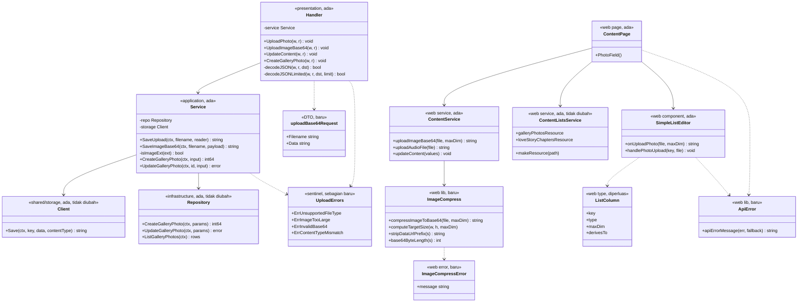
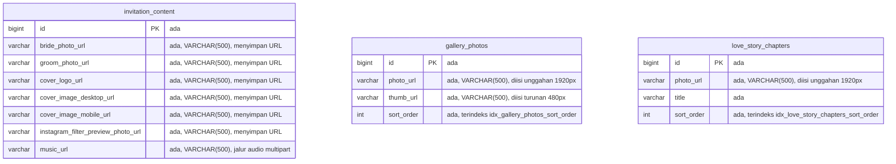
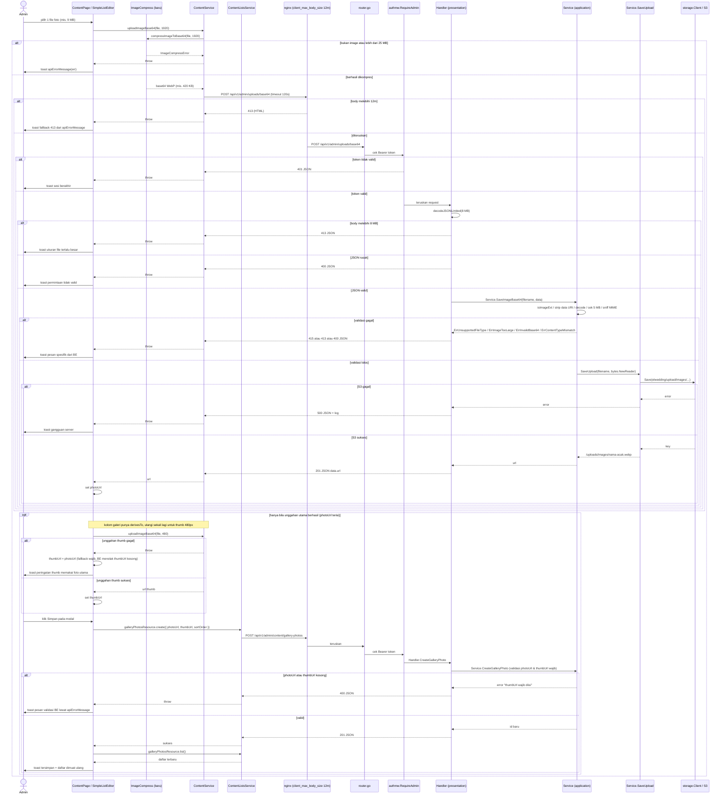

# PLAN — Upload Image Base64 & Perbaikan Kegagalan Upload di `/admin/content`

Analis: System Analyst (sesi 2026-09-03)
Target pembaca: programmer yang mengimplementasikan.

**Status implementasi (2026-09-03):** Task 1-12 dan 14-18 selesai dikerjakan
dan terverifikasi (`go build`, `go test ./...`, `npm run typecheck`,
`npm run test` semua lulus). **Task 13 BELUM dikerjakan** — perubahan itu
harus dilakukan manual lewat SSH ke VPS produksi `elcodelabs`
(`/etc/nginx/sites-enabled/elwedding`), yang tidak dapat diakses dari sesi
implementasi ini. Tanpa Task 13, 413 di produksi TIDAK akan hilang meski
seluruh kode sudah benar — lihat Task 13 untuk baris persis yang harus
ditambahkan dan cara memverifikasinya.

---

## 1. Pernyataan requirement yang sudah disepakati

Halaman admin `/admin/content` mengalami **kegagalan upload foto dengan HTTP 413**, paling
sering di tab **Galeri Foto**, tetapi berpotensi terjadi di seluruh field foto halaman itu.
Requirement-nya dua lapis:

1. **Ganti kontrak FE→BE untuk image menjadi base64** (bukan `multipart/form-data`).
2. **Pastikan seluruh proses di `/admin/content`** — upload foto, update foto, dan CRUD data
   apa pun di halaman itu — tidak lagi gagal.

### Klasifikasi intent

**Bug fix + Enhancement.**
- *Bug fix*: 413 pada upload foto adalah penyimpangan perilaku dari yang seharusnya.
- *Enhancement*: penggantian mekanisme transport multipart → base64 adalah perubahan pada
  kapabilitas yang sudah ada.

Bukan kapabilitas baru: endpoint upload, object storage, dan halaman admin-nya sudah ada dan
sudah berjalan.

### Keputusan yang dikunci di Step 0 (jawaban user, dicatat apa adanya)

| # | Pertanyaan | Jawaban user |
|---|---|---|
| K1 | Cakupan base64 sampai lapisan mana? | **Transport saja, tetap simpan di S3.** FE kirim JSON base64 → BE decode → tetap `PutObject` ke S3 → balikan URL `/uploads/...`. Kolom DB tetap berisi URL. |
| K2 | Berlaku untuk file apa saja? | **Image saja.** Audio (musik latar) tetap lewat `multipart/form-data`. |
| K3 | Gejala kegagalan yang terlihat | **HTTP 413**, biasanya di Galeri Foto, tetapi memungkinkan di tempat lain. |
| K4 | Batas ukuran image | **Maks 5 MB per image, FE kompres dulu.** BE memvalidasi ukuran **byte hasil decode**, bukan panjang string base64. |

### Keputusan yang dikunci di Step 4 (jawaban user, dicatat apa adanya)

| # | Pertanyaan | Jawaban user |
|---|---|---|
| K5 | Bentuk endpoint base64 | **Endpoint baru `POST /api/v1/admin/uploads/base64`.** Jalur multipart lama tetap utuh untuk audio. |
| K6 | Format & resolusi hasil kompresi browser | **WebP, sisi terpanjang maks 1920px, quality 0.82.** Tanpa dependency baru — pakai canvas bawaan browser. |
| K7 | Galeri Foto yang sekarang minta dua unggahan | **Satu unggahan, thumb dibuat otomatis** (thumb ~480px, lightbox ~1920px). `thumbUrl` & `photoUrl` tetap dua kolom DB — tidak ada migrasi. |
| K8 | Perbaikan nginx yang berada di luar repo | **Task manual bernomor + update `infra/nginx/nginx.conf`.** |

### Penentuan reuse / extend / create-new (hasil trace Step 3 & 5)

| Bagian | Putusan | Bukti |
|---|---|---|
| Tabel & kolom DB | **Tidak ada perubahan** | Seluruh kolom URL sudah `VARCHAR(500)` dan menampung path `/uploads/images/<nama>` yang panjangnya < 60 karakter — [`000001_create_content_tables.up.sql:79-80`](../../../apps/api/migrations/000001_create_content_tables.up.sql#L79-L80) |
| `Service.SaveUpload` | **Reuse** — dipanggil ulang lewat `bytes.NewReader` | [`service_upload.go:49-73`](../../../apps/api/internal/modules/content/application/service_upload.go#L49-L73) menerima `io.Reader`, jadi sumber byte apa pun cocok |
| `storage.Client.Save` | **Reuse tanpa perubahan** | [`storage.go:47-56`](../../../apps/api/internal/shared/storage/storage.go#L47-L56) |
| `allowedUploadExt` / `categoryByExt` / `contentTypeByExt` | **Reuse** — jadi dasar filter "images only" | [`service_upload.go:15-34`](../../../apps/api/internal/modules/content/application/service_upload.go#L15-L34) |
| Route penyajian `GET /uploads/{category}/{filename}` | **Tidak disentuh** | [`router.go:126-166`](../../../apps/api/internal/router/router.go#L126-L166) |
| Handler upload multipart | **Dipertahankan** untuk audio | [`handler.go:94-124`](../../../apps/api/internal/modules/content/presentation/handler.go#L94-L124) |
| `Repository` modul content | **Reuse tanpa perubahan** — hanya dipakai lewat `Service` yang sudah ada | [`repository.go`](../../../apps/api/internal/modules/content/infrastructure/repository.go); pemanggilnya di [`service_lists.go:146-158`](../../../apps/api/internal/modules/content/application/service_lists.go#L146-L158) |
| `Handler.UpdateContent`, `Handler.CreateGalleryPhoto`, `Service.CreateGalleryPhoto`, `Service.UpdateGalleryPhoto` dan CRUD daftar lainnya | **Reuse tanpa perubahan** — hanya diverifikasi ulang lewat uji manual §6.3 | [`handler.go:52-63`](../../../apps/api/internal/modules/content/presentation/handler.go#L52-L63), [`handler_lists.go:135-146`](../../../apps/api/internal/modules/content/presentation/handler_lists.go#L135-L146) |
| `makeResource` di `content-lists.service.ts` beserta `galleryPhotosResource` dan `loveStoryChaptersResource` | **Reuse tanpa perubahan** | [`content-lists.service.ts:10-29`](../../../apps/web/src/modules/admin/content/services/content-lists.service.ts#L10-L29) — sudah menangani create/update/delete/list untuk kelima resource |
| `updateContent` di `content.service.ts` (tombol Simpan tab profil) | **Reuse tanpa perubahan** — hanya diverifikasi ulang lewat uji manual §6.3 | [`content.service.ts:20-22`](../../../apps/web/src/modules/admin/content/services/content.service.ts#L20-L22) |
| Service method base64 | **Create new** — `SaveImageBase64` | Tidak ada fungsi yang mendekode base64 di mana pun (`grep base64` di `apps/api` nihil) |
| Helper kompresi image di FE | **Create new** | Tidak ada library kompresi di [`apps/web/package.json`](../../../apps/web/package.json) dan tidak ada util canvas di `apps/web/src/shared/lib/` (isinya hanya `coverMedia.ts`, `youtube.ts`) |
| Helper pesan error API di FE | **Create new dari duplikasi nyata** | Ekspresi yang sama diulang di 4 tempat — `SimpleListEditor.tsx:90`, `SimpleListEditor.tsx:112`, `ContentPage.tsx:95`, `ContentPage.tsx:205` |

---

## 2. Hasil trace — akar masalah 413

Trace dijalankan dua kali: pass 1 untuk memahami alur, pass 2 untuk mencari yang bisa dipakai
ulang. Berikut temuan yang menjadi dasar seluruh task di bawah.

### T1 — Akar masalah utama: `client_max_body_size` tidak pernah di-set (nginx default 1 MB)

Ini penyebab 413 yang sebenarnya, dan **letaknya bukan di kode Go**.

- [`infra/nginx/nginx.conf`](../../../infra/nginx/nginx.conf) — blok `server{}` tidak memuat
  `client_max_body_size`.
- vhost produksi `/etc/nginx/sites-enabled/elwedding` (salinannya tersimpan di git pada
  `docs/plan/lighthouse-performance-optimization/nginx-elwedding.conf`, dapat dibaca dengan
  `git show HEAD:docs/plan/lighthouse-performance-optimization/nginx-elwedding.conf`) — juga
  tidak memuatnya.
- Tanpa directive itu nginx memakai **default 1 MB**. Setiap foto di atas 1 MB ditolak nginx
  **sebelum request sampai ke proses Go**.

Foto galeri hampir selalu lebih besar dari 1 MB, sehingga tab Galeri Foto yang paling sering
kena — persis pola yang dilaporkan (K3).

**Konsekuensi langsung untuk requirement ini:** base64 memperbesar body ~33%. Kalau limit
nginx tidak dinaikkan, perpindahan ke base64 **memperparah** 413, bukan menyembuhkannya.
Karena itu perbaikan nginx (Task 12–13) bukan pelengkap, melainkan bagian yang menentukan
apakah requirement "tidak ada error atau gagal" tercapai.

### T2 — Batas Go 10 MB praktis tidak pernah tercapai

[`handler.go:92-103`](../../../apps/api/internal/modules/content/presentation/handler.go#L92-L103)
memasang `maxUploadSize = 10 << 20` lewat `http.MaxBytesReader` dan sudah memetakan
`"http: request body too large"` ke 413 dengan pesan yang benar. Batas ini sehat, tetapi
karena nginx sudah menolak di 1 MB, cabang ini nyaris tidak pernah dieksekusi di produksi.

### T3 — Pesan error asli tidak pernah sampai ke admin

Di tiga tempat, ekstraksi pesan error mengecek `err instanceof Error` **lebih dulu**:

- [`ContentPage.tsx:95`](../../../apps/web/src/modules/admin/content/pages/ContentPage.tsx#L95)
- [`SimpleListEditor.tsx:90`](../../../apps/web/src/modules/admin/content/components/SimpleListEditor.tsx#L90)
- [`SimpleListEditor.tsx:112`](../../../apps/web/src/modules/admin/content/components/SimpleListEditor.tsx#L112)

`AxiosError` **adalah** instance `Error`, sehingga cabang pertama selalu menang dan yang
tampil di toast adalah `"Request failed with status code 413"` — pesan generik axios. Pesan
JSON spesifik dari BE (`"File terlalu besar (maks 10 MB)"`, `"photoUrl wajib diisi"`, dst.)
tidak pernah terlihat oleh admin. Ini membuat kegagalan sulit didiagnosis dan termasuk dalam
"upload gagal" yang diminta diperbaiki.

Catatan tambahan: saat 413 datang dari nginx, body respons berupa **HTML**, bukan envelope
JSON proyek, sehingga `response.data.message` memang `undefined`. Helper baru harus punya
fallback per status code, bukan hanya membaca `message`.

### T4 — Tidak ada validasi ukuran maupun kompresi di sisi FE

[`ContentPage.tsx:83-101`](../../../apps/web/src/modules/admin/content/pages/ContentPage.tsx#L83-L101)
dan [`SimpleListEditor.tsx:103-121`](../../../apps/web/src/modules/admin/content/components/SimpleListEditor.tsx#L103-L121)
mengirim objek `File` mentah apa adanya lewat `uploadPhoto` di
[`content.service.ts:24-29`](../../../apps/web/src/modules/admin/content/services/content.service.ts#L24-L29).
Foto dari kamera HP masa kini berukuran 4–12 MB, jadi kegagalan bersifat deterministik, bukan
sesekali.

### T5 — `PhotoField` menerima file audio

[`ContentPage.tsx:84`](../../../apps/web/src/modules/admin/content/pages/ContentPage.tsx#L84)
memasang `accept="image/*,audio/*"`, padahal keenam pemakaian `PhotoField` (baris 416, 428,
452, 453, 454, 516) semuanya field foto. Seorang admin bisa memasukkan `.mp3` ke
`bridePhotoUrl` dan BE akan menerimanya, karena `SaveUpload` mengizinkan ekstensi audio.

### T6 — Timeout axios 30 detik berlaku global

[`http-client.ts:7-10`](../../../apps/web/src/shared/services/http-client.ts#L7-L10) menetapkan
`timeout: 30000`. Unggahan besar pada koneksi lambat berakhir `ECONNABORTED` dan tampil
sebagai kegagalan yang tidak jelas sebabnya.

### T7 — Galeri Foto meminta dua unggahan terpisah untuk satu foto

[`ContentPage.tsx:587-593`](../../../apps/web/src/modules/admin/content/pages/ContentPage.tsx#L587-L593)
mendefinisikan dua kolom bertipe `photo` yang keduanya `required`, dan BE juga mewajibkan
keduanya ([`service_lists.go:139-145`](../../../apps/api/internal/modules/content/application/service_lists.go#L139-L145)).
Admin harus mengunggah dua kali, dan setiap unggahan adalah satu kesempatan gagal — inilah
sebabnya tab ini paling sering bermasalah.

### T8 — Konflik sumber (dilaporkan, tidak diubah)

`CLAUDE.md` menyatakan frontend "React 19 + Tailwind 4", sedangkan
[`apps/web/package.json`](../../../apps/web/package.json) mem-pin `react ^18.3.1` dan
`react-dom ^18.3.1`. Menurut `knowledge/SOURCE_PRIORITY.md`, **kode & config (peringkat 3)
menang atas dokumen (peringkat 4)**. Rencana ini ditulis untuk React 18. Konflik ini
dilaporkan sebagai temuan, **bukan** diputuskan sendiri — penyelarasan dokumen berada di luar
lingkup.

---

## 3. Desain solusi

### 3.1 Backend — endpoint base64 baru (K5)

`POST /api/v1/admin/uploads/base64` (di belakang `authmw.RequireAdmin`, sama seperti seluruh
route `/api/v1/admin/`).

Request:

```json
{ "filename": "foto.webp", "data": "<base64, boleh berawalan data:image/webp;base64,>" }
```

Respons sukses `201` mengikuti envelope proyek (`.claude/rules/api-standard.md`):

```json
{ "success": true, "message": "Image uploaded successfully", "data": { "url": "/uploads/images/1756...-a1b2.webp" } }
```

Aturan validasi, berurutan:

1. Body dibatasi `maxBase64BodySize = 8 << 20` lewat `http.MaxBytesReader`. Lewat batas →
   **413**. (5 MB decoded ≈ 6,67 MB base64 + overhead JSON; 8 MB memberi kelonggaran.)
2. `filename` wajib ada, ekstensinya harus **image** (`categoryByExt[ext] == "images"`).
   Ekstensi audio ditolak di endpoint ini → **415**.
3. Prefix `data:<mime>;base64,` dibuang bila ada, lalu `base64.StdEncoding.DecodeString`.
   Gagal → **400**. Hasil decode kosong (`data` kosong atau hanya prefix) juga → **400**
   dengan `ErrInvalidBase64`; tanpa cek ini payload kosong lolos ke langkah 5 dan ditolak
   sebagai "MIME tidak cocok", pesan yang menyesatkan bagi admin.
4. Panjang byte **hasil decode** ≤ `maxImageDecodedSize = 5 << 20` (K4). Lewat → **413**.
5. Byte hasil decode di-sniff dengan `http.DetectContentType` dan harus cocok dengan
   `contentTypeByExt[ext]`. Tidak cocok → **400**. (Kelima ekstensi image di whitelist —
   `.jpg`/`.jpeg`/`.png`/`.webp`/`.gif` — memetakan ke empat MIME yang semuanya dikenali tabel
   sniff bawaan Go, jadi pencocokan eksak aman. **Sudah dibuktikan** dengan menjalankan
   `http.DetectContentType` atas byte header tiap format pada toolchain Go proyek ini:
   `image/jpeg`, `image/png`, `image/webp`, `image/gif` — cocok persis dengan nilai di
   `contentTypeByExt`. Uji yang sama memastikan byte kosong menghasilkan
   `text/plain; charset=utf-8`, itulah sebabnya cek kosong di langkah 3 diperlukan.)
6. Byte diserahkan ke `SaveUpload` yang sudah ada lewat `bytes.NewReader`, sehingga penamaan
   file acak, pemilihan kategori, prefix key `elwedding/upload/`, dan penulisan ke S3 tetap
   satu jalur dengan upload multipart.

Kenapa endpoint terpisah dan bukan percabangan di `/admin/uploads`: blast radius terkecil dan
paling mudah di-rollback — jalur audio tidak ikut terekspos regresi, dan pembatalan cukup
dengan mengembalikan pemanggilan di FE.

### 3.2 Backend — decoder JSON yang membedakan 413 dari 400

`decodeJSON` yang ada di [`handler.go:20-26`](../../../apps/api/internal/modules/content/presentation/handler.go#L20-L26)
memetakan **semua** kegagalan decode ke 400. Digabung dengan `MaxBytesReader`, body kebesaran
akan tampil sebagai `400 "Invalid request body"` — menyesatkan. Karena itu ditambahkan
`decodeJSONLimited` yang memeriksa `*http.MaxBytesError` dengan `errors.As` dan mengembalikan
413 beserta pesan yang benar. `decodeJSON` lama **tidak diubah** agar seluruh handler CRUD
lain tidak terpengaruh.

### 3.3 Frontend — kompresi di browser (K6)

Modul baru `apps/web/src/shared/lib/image-compress.ts`, tanpa dependency baru:

- Tolak lebih awal file yang bukan image dan file sumber di atas 25 MB (mencegah tab kehabisan
  memori saat men-decode gambar raksasa).
- `createImageBitmap(file)` → gambar ke `<canvas>` dengan sisi terpanjang dibatasi `maxDim` →
  `canvas.toBlob('image/webp', 0.82)`.
- Bila `toBlob` WebP mengembalikan `null` (browser tanpa dukungan encode WebP), ulangi dengan
  `image/jpeg` quality 0.85. Ekstensi nama file mengikuti tipe blob yang benar-benar
  dihasilkan, supaya validasi ekstensi di BE selalu cocok dengan byte-nya.
- Blob → base64 lewat `FileReader.readAsDataURL`, prefix `data:` dibuang.
- Bila hasil akhir masih di atas 5 MB, ulangi **satu kali** dengan `maxDim` 1280 dan quality
  0,7; kalau masih lewat juga, lempar `ImageCompressError` dengan pesan berbahasa Indonesia.

Fungsi murni yang diekspor untuk pengujian: `computeTargetSize`, `stripDataUrlPrefix`,
`base64ByteLength`.

### 3.4 Frontend — service, helper error, dan komponen

- `uploadImageBase64(file, maxDim = 1920)` di `content.service.ts` — mengompres lalu
  `POST /api/v1/admin/uploads/base64` dengan `timeout: 120000` per request (T6).
- `uploadPhoto` di `content.service.ts` **diganti nama** menjadi `uploadAudioFile`. Nama
  lamanya menyesatkan: satu-satunya pemakainya adalah unggah musik di
  [`SettingsPage.tsx:63`](../../../apps/web/src/modules/admin/settings/pages/SettingsPage.tsx#L63).
  Membiarkan nama `uploadPhoto` untuk audio, sementara ada fungsi foto baru di file yang sama,
  hampir pasti menimbulkan salah pasang di kemudian hari.
- `apps/web/src/shared/lib/api-error.ts` — `apiErrorMessage(err, fallback)` yang membaca
  `response.data.message` **lebih dulu**, lalu fallback per status (413 → pesan ukuran file,
  401 → sesi berakhir, 5xx → gangguan server), baru `err.message` sebagai upaya terakhir.
  Menggantikan empat ekspresi duplikat pada T3.
- `PhotoField` diperbaiki: `accept="image/*"` (T5) dan memakai `uploadImageBase64`.
- `SimpleListEditor` mendapat dua properti opsional pada `ListColumn`: `maxDim` dan
  `derivesTo`. Kolom foto yang punya `derivesTo` menghasilkan **dua** unggahan dari satu file
  dan mengisi dua field sekaligus; kolom turunannya tidak lagi dirender sebagai input
  tersendiri (K7).

### 3.5 Galeri Foto — satu unggahan, dua ukuran (K7)

Konfigurasi kolom galeri menjadi satu kolom foto:

```
{ key: 'photoUrl', label: 'Foto', type: 'photo', required: true, maxDim: 1920,
  derivesTo: { key: 'thumbUrl', maxDim: 480 } }
```

Alurnya: unggah versi 1920px → set `photoUrl`; **hanya bila itu berhasil**, unggah versi 480px
→ set `thumbUrl`. Kalau unggahan utama gagal, proses berhenti di situ — tidak ada unggahan
turunan dan tidak ada field yang terisi sebagian.

**Jalur kegagalan turunan**: bila unggahan thumb gagal sementara yang utama berhasil,
`thumbUrl` diisi nilai `photoUrl` sebagai fallback dan admin diberi peringatan. Ini wajib — BE
menolak `thumbUrl` kosong
([`service_lists.go:143-145`](../../../apps/api/internal/modules/content/application/service_lists.go#L143-L145)),
sehingga tanpa fallback baris galerinya gagal tersimpan seluruhnya.

**Baris galeri yang sudah ada tetap aman.** Baris lama hasil alur dua-unggahan sudah memiliki
`photoUrl` dan `thumbUrl` terisi. Saat admin menekan "Ubah", `openEdit`
([`SimpleListEditor.tsx:56-63`](../../../apps/web/src/modules/admin/content/components/SimpleListEditor.tsx#L56-L63))
menyalin **seluruh** field item ke `form`, termasuk `thumbUrl` yang tidak lagi punya input
sendiri. Nilai lama itu ikut terkirim apa adanya saat disimpan. Karena itu **jangan**
membuang key `thumbUrl` dari `form` atau dari `emptyItem` sewaktu mengerjakan Task 9/11 —
tidak ada migrasi data dan tidak ada baris lama yang perlu diperbaiki.

Gambar sumber didekode dua kali (sekali per ukuran target). Ini disengaja: mempertahankan satu
`ImageBitmap` bersama antara dua pemanggilan akan memaksa mengubah tanda tangan fungsi
kompresi dan service demi menghemat ±150 ms sekali per unggahan — tidak sepadan.

### 3.6 nginx (K8)

`client_max_body_size 12m;` di dalam blok `server{}`. Angka 12 MB dipilih karena harus
menampung dua jalur sekaligus: base64 image (≤ 8 MB body) **dan** multipart audio yang masih
diizinkan sampai 10 MB oleh
[`handler.go:92`](../../../apps/api/internal/modules/content/presentation/handler.go#L92).

---

## 4. Lingkup

### 4.1 Termasuk lingkup

| Berkas | Perubahan |
|---|---|
| [`apps/api/internal/modules/content/application/service_upload.go`](../../../apps/api/internal/modules/content/application/service_upload.go) | Tambah `isImageExt`, `SaveImageBase64`, `ErrImageTooLarge`, `ErrInvalidBase64`, `ErrContentTypeMismatch`, `maxImageDecodedSize` |
| [`apps/api/internal/modules/content/presentation/handler.go`](../../../apps/api/internal/modules/content/presentation/handler.go) | Tambah `decodeJSONLimited`, `UploadImageBase64`, `maxBase64BodySize`, `uploadBase64Request` |
| [`apps/api/internal/router/router.go`](../../../apps/api/internal/router/router.go) | Daftarkan route baru setelah baris 94 |
| [`apps/web/src/shared/lib/image-compress.ts`](../../../apps/web/src/shared/lib/) | Berkas baru |
| [`apps/web/src/shared/lib/api-error.ts`](../../../apps/web/src/shared/lib/) | Berkas baru |
| [`apps/web/src/modules/admin/content/services/content.service.ts`](../../../apps/web/src/modules/admin/content/services/content.service.ts) | `uploadImageBase64` baru; `uploadPhoto` → `uploadAudioFile` |
| [`apps/web/src/modules/admin/content/pages/ContentPage.tsx`](../../../apps/web/src/modules/admin/content/pages/ContentPage.tsx) | `PhotoField` (accept + service baru), pemakaian `apiErrorMessage`, konfigurasi kolom galeri |
| [`apps/web/src/modules/admin/content/components/SimpleListEditor.tsx`](../../../apps/web/src/modules/admin/content/components/SimpleListEditor.tsx) | `maxDim` & `derivesTo`, unggah turunan, `apiErrorMessage` |
| [`apps/web/src/modules/admin/settings/pages/SettingsPage.tsx`](../../../apps/web/src/modules/admin/settings/pages/SettingsPage.tsx) | Hanya menyesuaikan nama impor `uploadPhoto` → `uploadAudioFile` |
| [`infra/nginx/nginx.conf`](../../../infra/nginx/nginx.conf) | Tambah `client_max_body_size 12m;` |
| [`knowledge/DEPLOYMENT.md`](../../../knowledge/DEPLOYMENT.md) | Catat batas body sebagai bagian prosedur deploy |
| [`knowledge/API.md`](../../../knowledge/API.md) | Daftarkan endpoint baru |

### 4.2 Di luar lingkup

| Yang tidak disentuh | Alasan |
|---|---|
| Migrasi database | Tidak ada kolom baru; `VARCHAR(500)` sudah cukup untuk URL, dan K1 memutuskan base64 tidak disimpan di DB |
| Endpoint `POST /api/v1/admin/uploads` (multipart) | K2 mengunci audio tetap multipart |
| Route penyajian `GET /uploads/{category}/{filename}` | Bentuk URL tidak berubah, jadi jalur penyajian tetap benar apa adanya |
| `storage.Client` dan konfigurasi S3 | Byte yang ditulis identik; tidak ada alasan menyentuhnya |
| Halaman undangan tamu & `BuildPublicInvitation` | Payload publik hanya berisi URL pendek — tidak terpengaruh sama sekali oleh K1 |
| Penyelarasan React 18 vs klaim React 19 di `CLAUDE.md` | Dilaporkan sebagai T8; pembaruan dokumen adalah keputusan user, bukan bagian requirement ini |
| Menghapus/mengonversi file image lama di S3 | Tidak diminta; URL lama tetap tersaji dari route yang sama |

---

## 5. Task list

Kerjakan berurutan. Task 1–4 (BE) mendahului task FE karena endpoint harus sudah ada sebelum
FE memanggilnya; Task 5–6 (helper) mendahului task 7–11 yang memakainya.

**Catatan build:** Task 7, 9, 10, dan 11 adalah **satu satuan kompilasi**. Task 7 mengganti
nama `uploadPhoto` dan Task 9 mengubah tanda tangan prop `onUploadPhoto`, sehingga
`npm run typecheck` baru hijau kembali setelah Task 11 selesai. Jangan berhenti di tengah
rentang itu lalu menyimpulkan ada yang rusak — jalankan typecheck setelah Task 11.

### Backend

- [x] **Task 1** — `service_upload.go`: tambahkan `const maxImageDecodedSize = 5 << 20`, tiga
  error sentinel baru (`ErrImageTooLarge`, `ErrInvalidBase64`, `ErrContentTypeMismatch`), dan
  helper `isImageExt(ext string) bool` yang mengembalikan `categoryByExt[ext] == "images"`.
  Jangan ubah `allowedUploadExt`, `categoryByExt`, atau `contentTypeByExt` — audio masih
  memakainya lewat `SaveUpload`.

- [x] **Task 2** — `service_upload.go`: tambahkan `SaveImageBase64(ctx, filename, payload string) (string, error)`
  yang menjalankan urutan validasi §3.1 langkah 2–6, lalu memanggil `SaveUpload(ctx, filename, bytes.NewReader(decoded))`.
  Seluruh validasi harus selesai **sebelum** `s.storage` disentuh, mengikuti pola yang sudah
  diuji di [`service_upload_test.go:26-33`](../../../apps/api/internal/modules/content/application/service_upload_test.go#L26-L33).

- [x] **Task 3** — `handler.go`: tambahkan `const maxBase64BodySize = 8 << 20` dan struct
  request:

  ```go
  type uploadBase64Request struct {
      Filename string `json:"filename"`
      Data     string `json:"data"`
  }
  ```

  Lalu fungsi `decodeJSONLimited(w, r, dst, limit)` yang memetakan `*http.MaxBytesError` (dicek
  dengan `errors.As`) ke 413 dan sisanya ke 400, dan handler `UploadImageBase64` yang memetakan
  error dari Task 2: `ErrUnsupportedFileType` → 415, `ErrImageTooLarge` → 413,
  `ErrInvalidBase64` & `ErrContentTypeMismatch` → 400, error lain → 500 dengan `log.Printf`
  seperti pada [`handler.go:118`](../../../apps/api/internal/modules/content/presentation/handler.go#L118).
  Sukses → `response.Created` berisi `{"url": ...}`.

- [x] **Task 4** — `router.go`: daftarkan
  `admin.HandleFunc("POST /api/v1/admin/uploads/base64", d.ContentHandler.UploadImageBase64)`
  tepat setelah [baris 94](../../../apps/api/internal/router/router.go#L94). Route berada di
  `admin` mux sehingga otomatis berada di balik `authmw.RequireAdmin`
  ([router.go:122](../../../apps/api/internal/router/router.go#L122)) — jangan mendaftarkannya
  di `mux` utama.

### Frontend — helper

- [x] **Task 5** — buat `apps/web/src/shared/lib/image-compress.ts` sesuai §3.3. Ekspor
  `compressImageToBase64(file, maxDim)`, kelas `ImageCompressError`, serta fungsi murni
  `computeTargetSize`, `stripDataUrlPrefix`, `base64ByteLength`.

- [x] **Task 6** — buat `apps/web/src/shared/lib/api-error.ts` berisi
  `apiErrorMessage(err: unknown, fallback: string): string` sesuai §3.4.

### Frontend — service & komponen

- [x] **Task 7** — `content.service.ts`: tambahkan `uploadImageBase64(file, maxDim = 1920)`
  (kompres via Task 5, `POST /api/v1/admin/uploads/base64`, `timeout: 120000`). Ganti nama
  `uploadPhoto` → `uploadAudioFile` dan beri komentar bahwa fungsi itu khusus audio.

- [x] **Task 8** — `SettingsPage.tsx`: sesuaikan impor dan pemanggilan pada
  [baris 2 dan 63](../../../apps/web/src/modules/admin/settings/pages/SettingsPage.tsx#L63)
  menjadi `uploadAudioFile`. Tidak ada perubahan perilaku.

- [x] **Task 9** — `SimpleListEditor.tsx`: tambahkan `maxDim?: number` dan
  `derivesTo?: { key: keyof Omit<T,'id'>; maxDim: number }` pada `ListColumn`; ubah prop
  `onUploadPhoto` menjadi `(file: File, maxDim?: number) => Promise<string>`; pada
  `handlePhotoUpload`, setelah unggahan utama berhasil, jalankan unggahan turunan bila
  `derivesTo` ada, dengan fallback `derived = utama` bila unggahan turunan gagal (§3.5);
  jangan render input untuk kolom yang menjadi target `derivesTo`; pilih kolom pratinjau baris
  dari `derivesTo.key` bila ada. Ganti dua ekstraksi pesan error
  ([baris 90](../../../apps/web/src/modules/admin/content/components/SimpleListEditor.tsx#L90)
  dan [112](../../../apps/web/src/modules/admin/content/components/SimpleListEditor.tsx#L112))
  dengan `apiErrorMessage`.

- [x] **Task 10** — `ContentPage.tsx`: pada `PhotoField` ubah `accept` menjadi `"image/*"`
  ([baris 84](../../../apps/web/src/modules/admin/content/pages/ContentPage.tsx#L84)), panggil
  `uploadImageBase64`, dan pakai `apiErrorMessage`
  ([baris 95](../../../apps/web/src/modules/admin/content/pages/ContentPage.tsx#L95) dan
  [205](../../../apps/web/src/modules/admin/content/pages/ContentPage.tsx#L205)).

- [x] **Task 11** — `ContentPage.tsx`: ubah konfigurasi kolom `SimpleListEditor` galeri
  ([baris 587-593](../../../apps/web/src/modules/admin/content/pages/ContentPage.tsx#L587-L593))
  menjadi satu kolom `photoUrl` dengan `maxDim: 1920` dan
  `derivesTo: { key: 'thumbUrl', maxDim: 480 }`. `emptyItem` tetap memuat kedua field. Berikan
  `maxDim: 1920` juga pada kolom foto Love Story
  ([baris 608](../../../apps/web/src/modules/admin/content/pages/ContentPage.tsx#L608)).

### Konfigurasi & dokumentasi

- [x] **Task 12** — [`infra/nginx/nginx.conf`](../../../infra/nginx/nginx.conf): tambahkan
  `client_max_body_size 12m;` di dalam blok `server{}`.

- [ ] **Task 13 (MANUAL, di VPS — tanpa ini 413 di produksi TIDAK hilang)** — sunting
  `/etc/nginx/sites-enabled/elwedding` pada host `elcodelabs`. Tambahkan **satu baris** ke
  dalam blok `server { listen 443 ssl; ... }`:

  ```
  client_max_body_size 12m;
  ```

  Terapkan sebagai perubahan bertarget, **jangan** menimpa seluruh berkas — vhost yang ada
  memegang path sertifikat dan port `8083` yang benar. Lalu:

  ```
  sudo nginx -t && sudo systemctl reload nginx
  ```

  Verifikasi dari luar VPS bahwa unggahan >1 MB tidak lagi dijawab 413 oleh nginx.

- [x] **Task 14** — [`knowledge/DEPLOYMENT.md`](../../../knowledge/DEPLOYMENT.md): catat
  `client_max_body_size 12m` sebagai bagian tetap dari konfigurasi reverse proxy, dengan
  alasannya (batas unggah admin), agar tidak terulang saat pindah server.

- [x] **Task 15** — [`knowledge/API.md`](../../../knowledge/API.md): daftarkan
  `POST /api/v1/admin/uploads/base64` beserta bentuk request/respons dan kode error-nya.

### Pengujian

- [x] **Task 16** — tulis test Go (§6.1).
- [x] **Task 17** — tulis test frontend (§6.2).
- [x] **Task 18** — jalankan verifikasi menyeluruh (§6.3).

---

## 6. Pengujian

### 6.1 Go

Tambahkan pada `apps/api/internal/modules/content/application/service_upload_test.go`,
memakai pola `&Service{storage: nil}` yang sudah ada — kalau validasi bocor dan storage
tersentuh, test panic, dan itulah buktinya:

| Test | Harapan |
|---|---|
| `TestSaveImageBase64_EkstensiAudioDitolak` | `.mp3` → `ErrUnsupportedFileType`, storage tidak tersentuh |
| `TestSaveImageBase64_EkstensiTidakDikenalDitolak` | `.exe` → `ErrUnsupportedFileType` |
| `TestSaveImageBase64_Base64RusakDitolak` | string bukan base64 → `ErrInvalidBase64` |
| `TestSaveImageBase64_PrefixDataUriDibuang` | input `data:image/png;base64,<byte JPEG>` dengan `filename` `.png` → `ErrContentTypeMismatch`, **bukan** `ErrInvalidBase64`. Ini yang membuktikan prefix benar-benar dibuang: kalau tidak, decode gagal lebih dulu di langkah 3. Sengaja dipilih payload yang berhenti di langkah 5 supaya `storage` yang `nil` tidak pernah tersentuh — payload PNG yang sah justru akan lolos ke `SaveUpload` dan membuat test panic |
| `TestSaveImageBase64_PayloadKosongDitolak` | `data` kosong dan `data:image/png;base64,` tanpa isi → `ErrInvalidBase64` |
| `TestSaveImageBase64_LebihDari5MBDitolak` | payload decoded 5 MB + 1 byte → `ErrImageTooLarge` |
| `TestSaveImageBase64_MimeTidakCocokEkstensiDitolak` | byte PNG dengan `filename` `.jpg` → `ErrContentTypeMismatch` |
| `TestIsImageExt_HanyaKategoriImages` | kelima ekstensi image `true`, ketiga ekstensi audio `false` — dijalankan dengan iterasi atas `categoryByExt` supaya ikut gagal kalau whitelist berubah |

Tambahkan pada paket `presentation` (berkas baru `handler_upload_base64_test.go`) dengan
`httptest`, dan `Handler` yang dibangun atas `&application.Service{}` tanpa storage:

| Test | Harapan |
|---|---|
| `TestUploadImageBase64_BodyLebihDariLimit_413` | body 9 MB → status 413, `Content-Type: application/json` |
| `TestUploadImageBase64_JsonRusak_400` | body `{`  → status 400 |

### 6.2 Frontend (vitest)

**Catatan penting untuk pelaksana:** jsdom **tidak** mengimplementasikan `canvas.toBlob` maupun
`createImageBitmap`. Jangan menulis test yang menjalankan kompresi sungguhan. Tiga tingkat
pengujian yang dipakai: (a) fungsi murni diuji langsung; (b) `content.service.ts` diuji dengan
`vi.mock` atas `@/shared/lib/image-compress` **dan** atas `@/shared/services/http-client`,
mengikuti pola mock pada
[`guests.service.test.ts`](../../../apps/web/src/modules/admin/guests/services/guests.service.test.ts);
(c) `SimpleListEditor` diuji dengan `onUploadPhoto` berupa `vi.fn()` biasa lewat prop — komponen
itu tidak mengimpor modul kompresi, jadi tidak ada yang perlu di-mock di sana.

| Berkas | Test |
|---|---|
| `shared/lib/image-compress.test.ts` | `computeTargetSize` menjaga rasio aspek dan tidak memperbesar gambar yang sudah kecil; `stripDataUrlPrefix` membuang prefix `data:` dan membiarkan base64 polos; `base64ByteLength` menghitung benar termasuk padding `=` dan `==` |
| `shared/lib/api-error.test.ts` | pesan BE menang atas `err.message` bawaan axios (regresi T3); 413 tanpa body JSON tetap menghasilkan pesan ukuran file; `unknown` menghasilkan `fallback` |
| `modules/admin/content/services/content.service.test.ts` | `uploadImageBase64` mem-POST ke `/api/v1/admin/uploads/base64` dengan `{ filename, data }`, `data` tidak berawalan `data:`, dan `timeout` di-override 120000 |
| `modules/admin/content/components/SimpleListEditor.test.tsx` | kolom dengan `derivesTo` merender **satu** input file; satu berkas memicu dua pemanggilan `onUploadPhoto` dengan `maxDim` 1920 lalu 480, dan mengisi kedua field; bila pemanggilan kedua ditolak, `thumbUrl` terisi nilai `photoUrl` (jalur fallback §3.5) |

### 6.3 Verifikasi menyeluruh

```
cd apps/api && go test ./...
npm run test -w apps/web
npm run typecheck -w apps/web
npm run lint -w apps/web
```

Uji manual di `/admin/content` setelah Task 13 diterapkan, menutup setiap gejala yang
dilaporkan:

1. Tab **Galeri Foto** — unggah satu foto asli dari HP berukuran 6–10 MB. Harus berhasil, dan
   satu baris galeri berisi `photoUrl` maupun `thumbUrl`.
2. Tab **Profil Pasangan**, **Cover & Banner**, **Instagram Filter** — unggah foto di setiap
   field, lalu **Simpan**, muat ulang halaman, pastikan gambar tetap ada.
3. Tab **Love Story** — tambah dan ubah satu chapter berikut fotonya.
4. Tab **Agenda**, **Rundown**, **Rekening** — create, update, delete; pastikan validasi field
   wajib menampilkan pesan spesifik dari BE, bukan lagi "Request failed with status code 400".
5. Coba unggah berkas non-image (mis. `.pdf`) — harus ditolak dengan pesan yang jelas, bukan
   error generik.
6. Coba unggah image yang sangat besar (mis. PNG/TIFF di atas 25 MB) — harus ditolak oleh
   penjaga di FE dengan pesan berbahasa Indonesia, tanpa tab yang membeku atau crash.
7. `/admin/settings` — unggah berkas musik untuk memastikan jalur multipart audio tidak
   mengalami regresi.

---

## 7. Catatan performa dan volume data

Volume yang diasumsikan: **satu undangan pernikahan** — satu baris `invitation_content`,
puluhan baris `gallery_photos`, dan satu hingga dua admin yang mengunggah, tidak bersamaan.
Angka ini yang dipakai untuk menilai setiap butir di bawah.

- **Memori per unggahan (BE).** Satu request base64 menahan di memori: body JSON (≤ 8 MB),
  string base64 hasil parse, dan slice hasil decode (≤ 5 MB) — puncaknya sekitar 20 MB.
  Aman pada volume di atas. Kalau endpoint ini suatu saat dibuka untuk banyak penyewa
  bersamaan, batas konkurensi harus dipertimbangkan ulang; untuk sekarang tidak diperlukan.
- **`CreateGalleryPhoto` memanggil `ListGalleryPhotos`** — membaca seluruh tabel untuk
  menghitung `sort_order` berikutnya
  ([`service_lists.go:146-155`](../../../apps/api/internal/modules/content/application/service_lists.go#L146-L155)).
  Ini pola yang sudah ada dan berlaku sama untuk kelima resource daftar. Pada puluhan baris,
  biayanya tidak berarti, dan kolomnya sudah punya indeks
  (`KEY idx_gallery_photos_sort_order`, [migrasi baris 83](../../../apps/api/migrations/000001_create_content_tables.up.sql#L83)).
  **Tidak diubah** — di luar lingkup, dan tidak ada bukti masalah pada volume nyata.
- **Tidak ada query di dalam loop yang ditambahkan** oleh rencana ini. Alur base64 adalah satu
  request → satu tulis S3 → nol query database.
- **Payload publik tidak terpengaruh.** `BuildPublicInvitation`
  ([`service.go:234-275`](../../../apps/api/internal/modules/content/application/service.go#L234-L275))
  tetap mengirim URL pendek. Inilah alasan konkret K1 (base64 sebagai transport saja) unggul:
  menyimpan data URI di DB akan membengkakkan respons yang dibaca **setiap tamu**, dan kolom
  `VARCHAR(500)` akan memotong nilainya secara diam-diam.
- **Kompresi di sisi klien memindahkan biaya ke browser admin**, bukan ke server: satu decode
  dan satu encode canvas per ukuran target, ±150–400 ms untuk foto 12 MP pada laptop biasa.
  Untuk galeri, ini terjadi dua kali per foto (§3.5).

---

## 8. Diagram

### 8.1 Class diagram

Empat kotak di diagram ini adalah **label pengelompokan per berkas**, bukan nama tipe di kode.
Peta namanya: `ContentService` = [`content.service.ts`](../../../apps/web/src/modules/admin/content/services/content.service.ts),
`ContentListsService` = [`content-lists.service.ts`](../../../apps/web/src/modules/admin/content/services/content-lists.service.ts),
`ApiError` = `shared/lib/api-error.ts` (baru), dan `UploadErrors` = kumpulan sentinel error di
[`service_upload.go`](../../../apps/api/internal/modules/content/application/service_upload.go).
Sisanya adalah tipe/struct nyata dengan nama persis seperti di kode.



### 8.2 ERD

Tidak ada tabel baru dan tidak ada kolom baru — konsekuensi langsung dari K1. Diagram ini
menampilkan tiga tabel yang **dipakai apa adanya** oleh alur di atas: `invitation_content`
(field foto tab profil/cover/filter), `gallery_photos` (`photoUrl` + `thumbUrl` dari satu
unggahan, K7), dan `love_story_chapters` (`photoUrl` dengan `maxDim` 1920, Task 11). Ketiganya
dimiliki modul `content` dan tidak punya foreign key lintas modul, sesuai
`.claude/rules/backend-modular-monolith.md`.



### 8.3 Sequence diagram

Alur unggah satu foto galeri — jalur yang paling sering gagal hari ini — lengkap dengan cabang
kegagalan yang wajib ditangani.



---

## 9. Kriteria selesai

1. Foto 6–10 MB berhasil diunggah dari setiap field foto di `/admin/content`, termasuk Galeri
   Foto, tanpa 413.
2. Endpoint image memakai base64 (`POST /api/v1/admin/uploads/base64`); jalur audio tetap
   multipart dan tidak mengalami regresi.
3. Setiap kegagalan menampilkan pesan yang bisa ditindaklanjuti admin — bukan lagi "Request
   failed with status code N".
4. Galeri Foto cukup satu unggahan per baris, dan baris tersimpan dengan `photoUrl` maupun
   `thumbUrl` terisi.
5. Seluruh CRUD di kelima tab daftar data berfungsi dan menampilkan pesan validasi BE yang
   spesifik.
6. `go test ./...`, `npm run test -w apps/web`, `npm run typecheck -w apps/web`, dan
   `npm run lint -w apps/web` lulus.
7. Task 13 (nginx VPS) sudah diterapkan dan diverifikasi — tanpa ini, kriteria 1 tidak akan
   tercapai di produksi betapa pun benarnya kodenya.
