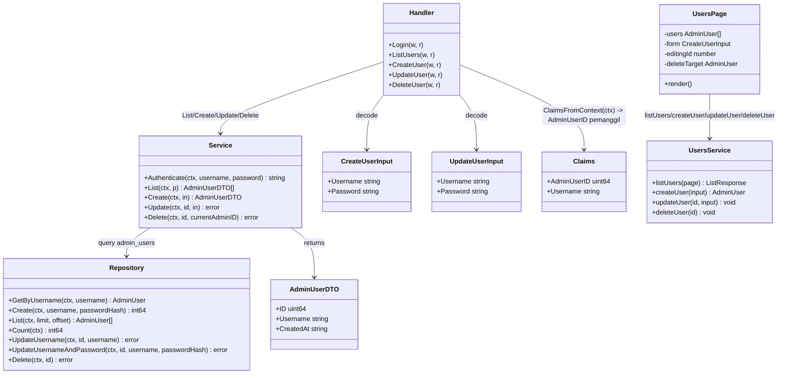
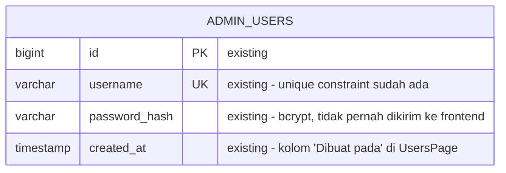
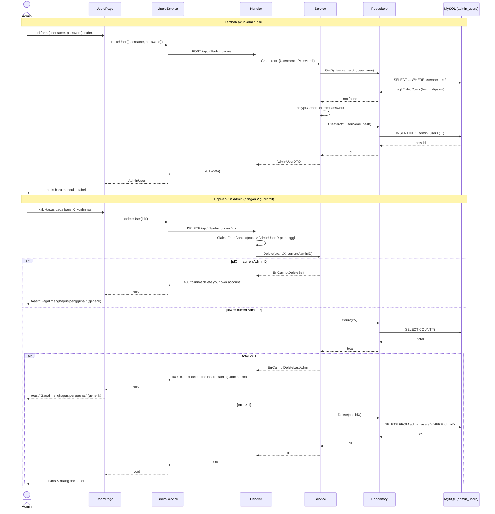

# PLAN.md — Fitur Users (kelola akun admin)

## 1. Requirement yang disepakati & klasifikasi

**New capability.** Saat ini modul `auth` cuma punya 1 endpoint (`POST /api/v1/auth/login`,
`presentation/handler.go:26-48`) dan 1 akun admin ter-seed (`migrations/000005_seed_admin.up.sql`).
Tidak ada satu pun query Create/Update/Delete/List untuk `admin_users` di seluruh codebase — cuma
`GetAdminUserByUsername` (`infrastructure/queries/admin_users.sql:1-2`), dipakai login. "1 admin"
adalah **konvensi lewat komentar kode**, bukan constraint database (tabel `admin_users` tidak
punya trigger/CHECK yang membatasi jumlah baris) — jadi menambah banyak akun secara teknis tidak
melanggar skema yang ada. Tidak ada konsep role/permission di mana pun (DB, JWT claims
`jwtutil.go:14-18`, middleware `authmw/middleware.go:18-36`).

### Keputusan terkunci (Step 0, dijawab via AskUserQuestion)

| # | Pertanyaan | Jawaban terkunci |
|---|---|---|
| 1 | CRUD penuh (lihat semua admin, tambah/ubah/hapus) atau sebatas profil/password diri sendiri? | **CRUD penuh** — menu "Users" tersendiri: list semua akun admin, tambah, ubah, hapus. Mengubah akun sendiri dilakukan lewat baris sendiri di list yang sama (bukan alur terpisah). |
| 2 | Perlu tingkatan role (super-admin vs admin) atau semua setara? | **Semua setara, tanpa role** — tidak menambah kolom/konsep role baru; semua akun admin punya akses identik ke seluruh menu admin, termasuk menu Users. |

### Keputusan desain tambahan (Step 4, dari trace + prinsip blast-radius terkecil)

- **Perluas modul `auth` yang sudah ada, JANGAN bikin modul `users` baru.** Tabel `admin_users`
  sudah dimiliki `auth` (`knowledge/MODULE_MAP.md:5`, `DATABASE.md:18`) — modul baru untuk
  mengelola tabel yang sama akan melanggar aturan "repository hanya akses tabel milik modulnya
  sendiri" (`database.md`), atau memaksa mindahkan ownership tabel tanpa alasan. `auth.New(db, ...)`
  di `main.go:32` sudah menerima `db` — tidak perlu ubah wiring `main.go` sama sekali, cuma
  menambah method baru ke `Handler`/`Service`/`Repository` yang sudah ada.
- **Tidak ada migrasi baru.** Kolom yang ada (`id`, `username`, `password_hash`, `created_at`,
  `migrations/000003_create_auth_tables.up.sql:1-9`) sudah cukup untuk CRUD tanpa role. Step 3
  verdict: **tidak berubah**.
- **Cek username unik pakai query `GetAdminUserByUsername` yang SUDAH ADA**, bukan menangkap
  error MySQL 1062 — dicek dulu (tidak ada precedent penanganan `MySQLError`/duplicate-key di
  seluruh `apps/api`, jadi menambahnya berarti pola baru; pre-check lebih sederhana & reuse
  langsung). Konsekuensi: ada celah race-condition teoritis (dua request bersamaan lolos
  pre-check lalu tabrakan di UNIQUE constraint) — pada skala panel admin internal ini (beberapa
  admin, bukan form pendaftaran publik) risikonya diterima; constraint DB tetap jadi
  benteng terakhir yang mencegah duplikat tersimpan, hanya saja request kedua akan gagal dengan
  500 generik alih-alih 400 rapi di race window itu. Dicatat di sini sebagai keputusan sadar,
  bukan celah yang tidak disadari.
- **Password di Update bersifat opsional** — field `password` kosong berarti "tidak diganti".
  Hanya di-hash & ditulis ulang bila diisi. Mencegah UX buruk yang memaksa isi ulang password
  setiap kali admin cuma mau ganti username.
- **Guardrail hapus** (karena semua admin setara/tanpa role, siapa pun bisa hapus siapa pun):
  1. **Tidak bisa hapus akun sendiri yang sedang login** — dicek dari `authmw.ClaimsFromContext`
     (`middleware.go:38-41`, sudah ada tapi belum pernah benar-benar dipakai di luar middleware
     itu sendiri — inilah pemakaian pertamanya, bukan pola baru yang diciptakan untuk plan ini).
  2. **Tidak bisa hapus admin terakhir** — `COUNT(*)` sebelum delete, tolak bila hasilnya 1.
     Mencegah sistem terkunci total (tidak ada admin yang bisa login).
  Tidak ada guard serupa di Update (username & password sendiri boleh diubah bebas oleh diri
  sendiri, konsisten dengan "semua setara").
- **List TANPA parameter pencarian `q`** — beda dari daftar Tamu/Reservasi. Jumlah akun admin
  realistis kecil (segelintir orang mengelola satu situs undangan), jadi kotak pencarian tidak
  menambah nilai nyata di skala ini; paginasi tetap dipakai (reuse `pagination.Parse`/`Meta`
  yang sudah ada, biaya nyaris nol) supaya konsisten dengan pola list lain (Tamu, Reservasi, log
  WhatsApp) tanpa menambah mekanisme baru.
- **Toast error React tetap generik**, mengikuti konvensi yang sudah ada di SELURUH frontend
  (`GuestsPage.tsx`, `ContentPage.tsx:173`, dst — dikonfirmasi tidak ada satu pun halaman yang
  menampilkan pesan error spesifik dari backend, semua pakai string generik hardcoded). Artinya
  pesan seperti "username sudah dipakai" atau "tidak bisa hapus akun sendiri" TIDAK otomatis
  muncul di toast — hanya "Gagal menyimpan pengguna."/"Gagal menghapus pengguna." generik,
  persis pola yang sudah ada. Ini trade-off UX yang disadari (bukan pola baru yang lebih baik
  tapi menyimpang), demi konsistensi penuh dengan konvensi yang sudah mapan.
- **Menu sidebar "Pengguna"** diletakkan tepat sebelum "Pengaturan" (paling bawah, sebelum
  Settings) — dikelompokkan sebagai administrasi sistem, bukan operasional acara (beda dari
  Tamu/Reservasi/WhatsApp).

## 2. Scope

### In scope
- `apps/api/internal/modules/auth/infrastructure/queries/admin_users.sql` — tambah 5 query.
- `apps/api/internal/modules/auth/infrastructure/repository.go` — tambah method sejalan.
- `apps/api/internal/modules/auth/application/service.go` — tambah `Create/List/Update/Delete`
  + validasi + `StatusHTTPCode`.
- `apps/api/internal/modules/auth/application/dto.go` — **baru**, `AdminUserDTO`, input types.
- `apps/api/internal/modules/auth/presentation/handler.go` — tambah 4 handler + helper lokal.
- `apps/api/internal/router/router.go` — tambah 4 route di bawah `/api/v1/admin/users`.
- `apps/web/src/modules/admin/users/services/users.service.ts` — **baru**.
- `apps/web/src/modules/admin/users/schemas/user.schema.ts` — **baru**.
- `apps/web/src/modules/admin/users/pages/UsersPage.tsx` — **baru**.
- `apps/web/src/app/routes/route-paths.ts`, `AdminLayout.tsx`, `AdminApp.tsx` — routing + nav.
- `knowledge/API.md`, `MODULE_MAP.md`, `DATABASE.md` — dokumentasi.
- File test terkait (lihat §5).

### Out of scope (dan alasannya)
- **Role/permission tier** — dikunci di Step 0 (semua admin setara).
- **Konfirmasi password saat ganti password sendiri** ("masukkan password lama") — tidak
  diminta; karena tanpa role, tidak ada perbedaan hak antara mengubah akun sendiri vs akun
  orang lain, jadi tidak ada alasan memberi gesekan ekstra hanya untuk kasus "diri sendiri".
- **Nonaktifkan tombol hapus untuk baris akun sendiri di frontend** — butuh decode JWT
  client-side yang belum ada presedennya sama sekali di codebase ini (`auth.store.ts` saat ini
  memperlakukan token sepenuhnya opaque). Backend tetap menolak dengan aman (guardrail di atas)
  — frontend hanya akan menampilkan toast error generik saat request itu gagal, bukan mencegah
  klik dari awal. Kalau UX ini dirasa kurang setelah dipakai, itu enhancement terpisah.
- **Email/nama tampilan pada akun admin** — tidak diminta, tabel tidak punya kolom itu; username
  tetap satu-satunya identitas.
- **Reset password lewat email/lupa password** — tidak diminta, tidak ada infrastruktur email
  di sistem ini.
- **Audit log siapa membuat/mengubah/menghapus akun mana** — tidak diminta; `whatsapp_send_logs`
  adalah satu-satunya tabel log di sistem ini dan itu untuk keperluan berbeda (kirim ulang
  pesan), bukan preseden audit-trail generik untuk ditiru di sini.

### Reuse inventory (diverifikasi baca kode)
- `Repository`/`Service`/`Handler` modul `auth` — diperluas, bukan modul baru
  (`auth.module.go:15-19`, `auth/infrastructure/repository.go`, `auth/application/service.go`,
  `auth/presentation/handler.go`).
- `GetAdminUserByUsername` (`admin_users.sql:1-2`) — dipakai ulang APA ADANYA untuk cek
  keunikan username saat create/update, tidak menulis ulang.
- `pagination.Parse`/`pagination.Meta` (`shared/pagination/pagination.go`) — dipakai ulang
  persis seperti `guest.ListGuests`/`whatsapp.ListLogs`.
- `response.OK/OKPaginated/Created/BadRequest/NotFound/Internal`
  (`shared/response/response.go`) — dipakai ulang, tidak ada envelope baru.
- `authmw.ClaimsFromContext` (`authmw/middleware.go:38-41`) — dipakai ulang (definisi sudah
  ada, pemakaian pertama di luar middleware itu sendiri).
- `golang.org/x/crypto/bcrypt` — sudah jadi dependency (dipakai `Authenticate`,
  `service.go:9,38`), dipakai ulang untuk hash password baru, tidak ada dependency baru.
- Pola `decodeJSON`/`writeServiceError`/`StatusHTTPCode(err) int` per-modul (`guest/presentation/
  handler.go:21-38`, `guest/application/service.go:497-508`) — ditiru persis di `auth`, bukan
  disatukan ke `shared/` (mengikuti konvensi yang sudah ada: tiap modul punya salinan sendiri).
- `formatRelativeTime` (`shared/utils/relative-time.ts`, diekstrak sesi `guest-reservation-
  split`) — dipakai ulang untuk kolom "Dibuat pada" di `UsersPage`.
- Pola halaman CRUD+Modal+Pagination dari `GuestsPage.tsx` (Table/Thead/Tbody/Tr/Th/Td, Modal
  tambah/ubah, Modal hapus dgn konfirmasi, `EmptyState`/`ErrorState`/`TableSkeleton`) — ditiru
  persis untuk `UsersPage.tsx`, bukan pola baru.
- Pola Zod 2-schema (required saat create, opsional saat update) — belum ada presedennya
  (`guestSchema` cuma 1 skema untuk create & update sekaligus, karena guest tidak punya field
  sensitif seperti password) — **create baru**, dijelaskan alasannya di §3.2.

## 3. Perubahan per layer

### 3.1 Backend — `auth` module

**`apps/api/internal/modules/auth/infrastructure/queries/admin_users.sql`** — tambah setelah
`GetAdminUserByUsername`:

```sql
-- name: CreateAdminUser :execlastid
INSERT INTO admin_users (username, password_hash) VALUES (?, ?);

-- name: ListAdminUsers :many
SELECT id, username, created_at FROM admin_users ORDER BY created_at DESC LIMIT ? OFFSET ?;

-- name: CountAdminUsers :one
SELECT COUNT(*) FROM admin_users;

-- name: UpdateAdminUserUsername :exec
UPDATE admin_users SET username = ? WHERE id = ?;

-- name: UpdateAdminUserUsernameAndPassword :exec
UPDATE admin_users SET username = ?, password_hash = ? WHERE id = ?;

-- name: DeleteAdminUser :exec
DELETE FROM admin_users WHERE id = ?;
```

`ListAdminUsers` sengaja TIDAK menyertakan `password_hash` (beda dari `GetAdminUserByUsername`
yang butuh hash untuk verifikasi login) — hash tidak pernah perlu sampai ke DTO/JSON manapun di
luar alur login. Jalankan `sqlc generate` di `apps/api` setelah file ini diubah.

**`apps/api/internal/modules/auth/infrastructure/repository.go`** — tambah method:

```go
func (r *Repository) Create(ctx context.Context, username, passwordHash string) (int64, error) {
	return r.q.CreateAdminUser(ctx, sqlc.CreateAdminUserParams{Username: username, PasswordHash: passwordHash})
}

func (r *Repository) List(ctx context.Context, limit, offset int32) ([]sqlc.ListAdminUsersRow, error) {
	return r.q.ListAdminUsers(ctx, sqlc.ListAdminUsersParams{Limit: limit, Offset: offset})
}

func (r *Repository) Count(ctx context.Context) (int64, error) {
	return r.q.CountAdminUsers(ctx)
}

func (r *Repository) UpdateUsername(ctx context.Context, id uint64, username string) error {
	return r.q.UpdateAdminUserUsername(ctx, sqlc.UpdateAdminUserUsernameParams{Username: username, ID: id})
}

func (r *Repository) UpdateUsernameAndPassword(ctx context.Context, id uint64, username, passwordHash string) error {
	return r.q.UpdateAdminUserUsernameAndPassword(ctx, sqlc.UpdateAdminUserUsernameAndPasswordParams{
		Username: username, PasswordHash: passwordHash, ID: id,
	})
}

func (r *Repository) Delete(ctx context.Context, id uint64) error {
	return r.q.DeleteAdminUser(ctx, id)
}
```

Nama field parameter sqlc yang tepat (`Limit`/`Offset`/`ID`/dst.) baru pasti setelah `sqlc
generate` dijalankan (task #2) — ikuti nama yang sqlc hasilkan, sama seperti pola
`ListGuestsFilteredParams` di modul `guest`.

**`apps/api/internal/modules/auth/application/dto.go`** (baru):

```go
package application

type AdminUserDTO struct {
	ID        uint64 `json:"id"`
	Username  string `json:"username"`
	CreatedAt string `json:"createdAt"`
}

type CreateUserInput struct {
	Username string `json:"username"`
	Password string `json:"password"`
}

type UpdateUserInput struct {
	Username string `json:"username"`
	Password string `json:"password"` // kosong = tidak diganti
}
```

**`apps/api/internal/modules/auth/application/service.go`** — tambah setelah `Authenticate`:

```go
var (
	ErrUsernameRequired      = errors.New("username is required")
	ErrPasswordTooShort      = errors.New("password must be at least 6 characters")
	ErrUsernameTaken         = errors.New("username already taken")
	ErrCannotDeleteSelf      = errors.New("cannot delete your own account")
	ErrCannotDeleteLastAdmin = errors.New("cannot delete the last remaining admin account")
)

func (s *Service) List(ctx context.Context, p pagination.Params) ([]AdminUserDTO, int, error) {
	total, err := s.repo.Count(ctx)
	if err != nil {
		return nil, 0, err
	}
	rows, err := s.repo.List(ctx, int32(p.Limit), int32(p.Offset()))
	if err != nil {
		return nil, 0, err
	}
	out := make([]AdminUserDTO, 0, len(rows))
	for _, row := range rows {
		out = append(out, AdminUserDTO{ID: row.ID, Username: row.Username, CreatedAt: row.CreatedAt.Format(time.RFC3339)})
	}
	return out, int(total), nil
}

func (s *Service) Create(ctx context.Context, in CreateUserInput) (AdminUserDTO, error) {
	if in.Username == "" {
		return AdminUserDTO{}, ErrUsernameRequired
	}
	if len(in.Password) < 6 {
		return AdminUserDTO{}, ErrPasswordTooShort
	}
	if _, err := s.repo.GetByUsername(ctx, in.Username); err == nil {
		return AdminUserDTO{}, ErrUsernameTaken
	} else if !errors.Is(err, sql.ErrNoRows) {
		return AdminUserDTO{}, err
	}
	hash, err := bcrypt.GenerateFromPassword([]byte(in.Password), bcrypt.DefaultCost)
	if err != nil {
		return AdminUserDTO{}, err
	}
	id, err := s.repo.Create(ctx, in.Username, string(hash))
	if err != nil {
		return AdminUserDTO{}, err
	}
	return AdminUserDTO{ID: uint64(id), Username: in.Username, CreatedAt: time.Now().Format(time.RFC3339)}, nil
}

func (s *Service) Update(ctx context.Context, id uint64, in UpdateUserInput) error {
	if in.Username == "" {
		return ErrUsernameRequired
	}
	if existing, err := s.repo.GetByUsername(ctx, in.Username); err == nil {
		if existing.ID != id {
			return ErrUsernameTaken
		}
	} else if !errors.Is(err, sql.ErrNoRows) {
		return err
	}
	if in.Password == "" {
		return s.repo.UpdateUsername(ctx, id, in.Username)
	}
	if len(in.Password) < 6 {
		return ErrPasswordTooShort
	}
	hash, err := bcrypt.GenerateFromPassword([]byte(in.Password), bcrypt.DefaultCost)
	if err != nil {
		return err
	}
	return s.repo.UpdateUsernameAndPassword(ctx, id, in.Username, string(hash))
}

func (s *Service) Delete(ctx context.Context, id, currentAdminID uint64) error {
	if id == currentAdminID {
		return ErrCannotDeleteSelf
	}
	total, err := s.repo.Count(ctx)
	if err != nil {
		return err
	}
	if total <= 1 {
		return ErrCannotDeleteLastAdmin
	}
	return s.repo.Delete(ctx, id)
}
```

Tambahan di `StatusHTTPCode(err error) int` yang sudah ada persis pola `guest/application/
service.go:497-508` (dibuat fungsi ini KARENA belum ada di modul `auth` — modul ini sebelumnya
cuma punya `ErrInvalidCredentials` yang ditangani manual di handler, `handler.go:39-42`):

```go
func StatusHTTPCode(err error) int {
	switch {
	case errors.Is(err, ErrUsernameRequired), errors.Is(err, ErrPasswordTooShort),
		errors.Is(err, ErrUsernameTaken), errors.Is(err, ErrCannotDeleteSelf),
		errors.Is(err, ErrCannotDeleteLastAdmin):
		return 400
	default:
		return 500
	}
}
```

Import tambahan yang dibutuhkan `service.go`: `"undangan-ariana-adrian/internal/shared/
pagination"` dan `"time"` (belum diimpor di file ini hari ini).

**Catatan perilaku pada `id` yang tidak ada** (Step 7 exception-path check): `Update`/`Delete`
TIDAK mengecek dulu apakah `id` benar-benar ada sebelum menjalankan `UPDATE`/`DELETE` — persis
konvensi yang sudah dipakai `guest.Service.Update`/`Delete` (`guest/infrastructure/
repository.go:29-39`, tidak pernah mengecek `RowsAffected`). Konsekuensi: `PUT`/`DELETE` ke
`id` yang tidak ada akan tetap mengembalikan `200 OK` ("User updated/deleted successfully")
meski 0 baris berubah — bukan bug baru, mengikuti pola yang sudah ada di modul lain, dicatat di
sini supaya bukan gap yang tak disadari.

**Catatan volume data** (Step 7 performance sanity check): `ListAdminUsers` mengurutkan
`ORDER BY created_at DESC` tanpa index eksplisit di kolom itu (skema `migrations/
000003_create_auth_tables.up.sql:1-9` cuma punya PK `id` & UNIQUE `username`). Diasumsikan
jumlah akun admin realistis untuk sebuah situs undangan (segelintir orang, bukan ribuan) — pada
skala itu full-table-scan tanpa index tidak berarti apa-apa secara performa; ditambah `LIMIT`/
`OFFSET` paginasi tetap dipasang untuk konsistensi pola, bukan karena tabel ini butuh
proteksi dari pertumbuhan tak terbatas.

**`apps/api/internal/modules/auth/presentation/handler.go`** — tambah helper lokal (pola persis
`guest/presentation/handler.go:21-38`) + 4 handler:

```go
func decodeJSON(w http.ResponseWriter, r *http.Request, dst any) bool {
	if err := json.NewDecoder(r.Body).Decode(dst); err != nil {
		response.BadRequest(w, "Invalid request body", nil)
		return false
	}
	return true
}

func writeServiceError(w http.ResponseWriter, err error) {
	switch application.StatusHTTPCode(err) {
	case 400:
		response.BadRequest(w, err.Error(), nil)
	default:
		response.Internal(w, "")
	}
}

func (h *Handler) ListUsers(w http.ResponseWriter, r *http.Request) {
	p := pagination.Parse(r)
	users, total, err := h.service.List(r.Context(), p)
	if err != nil {
		writeServiceError(w, err)
		return
	}
	response.OKPaginated(w, "Users retrieved successfully", users, pagination.Meta(p, total))
}

func (h *Handler) CreateUser(w http.ResponseWriter, r *http.Request) {
	var in application.CreateUserInput
	if !decodeJSON(w, r, &in) {
		return
	}
	user, err := h.service.Create(r.Context(), in)
	if err != nil {
		writeServiceError(w, err)
		return
	}
	response.Created(w, "User created successfully", user)
}

func (h *Handler) UpdateUser(w http.ResponseWriter, r *http.Request) {
	id, err := strconv.ParseUint(r.PathValue("id"), 10, 64)
	if err != nil {
		response.BadRequest(w, "Invalid id", nil)
		return
	}
	var in application.UpdateUserInput
	if !decodeJSON(w, r, &in) {
		return
	}
	if err := h.service.Update(r.Context(), id, in); err != nil {
		writeServiceError(w, err)
		return
	}
	response.OK(w, "User updated successfully", nil)
}

func (h *Handler) DeleteUser(w http.ResponseWriter, r *http.Request) {
	id, err := strconv.ParseUint(r.PathValue("id"), 10, 64)
	if err != nil {
		response.BadRequest(w, "Invalid id", nil)
		return
	}
	claims, ok := authmw.ClaimsFromContext(r.Context())
	if !ok {
		response.Internal(w, "")
		return
	}
	if err := h.service.Delete(r.Context(), id, claims.AdminUserID); err != nil {
		writeServiceError(w, err)
		return
	}
	response.OK(w, "User deleted successfully", nil)
}
```

Import tambahan di `handler.go`: `"strconv"`, `"undangan-ariana-adrian/internal/shared/
pagination"`, `"undangan-ariana-adrian/internal/shared/authmw"`. `writeServiceError` yang sudah
ada (kalau ada) HARUS diperiksa dulu supaya tidak dobel deklarasi — saat ini `handler.go` belum
punya `decodeJSON`/`writeServiceError` sama sekali (`Login` menangani error manual), jadi kedua
fungsi ini murni baru di file ini.

**`apps/api/internal/router/router.go`** — tambah di dalam blok `admin` (§84, setelah baris
`guests` sebelum komentar whatsapp §95), route baru:

```go
admin.HandleFunc("GET /api/v1/admin/users", d.AuthHandler.ListUsers)
admin.HandleFunc("POST /api/v1/admin/users", d.AuthHandler.CreateUser)
admin.HandleFunc("PUT /api/v1/admin/users/{id}", d.AuthHandler.UpdateUser)
admin.HandleFunc("DELETE /api/v1/admin/users/{id}", d.AuthHandler.DeleteUser)
```

`d.AuthHandler` sudah ada di `Deps` (`router.go:24`) dan sudah dirakit di `main.go:32` — TIDAK
ada perubahan di `main.go` maupun `Deps` struct. Route otomatis kena gate JWT lewat
`authmw.RequireAdmin` yang sudah membungkus seluruh `/api/v1/admin/*` (`router.go:104`).

### 3.2 Frontend — modul `users` (baru)

**`apps/web/src/modules/admin/users/services/users.service.ts`** (baru):

```ts
import { httpClient } from '@/shared/services/http-client'

export interface AdminUser {
  id: number
  username: string
  createdAt: string
}

export interface CreateUserInput {
  username: string
  password: string
}

export interface UpdateUserInput {
  username: string
  password: string // kosong = tidak diganti
}

export interface ListResponse {
  data: AdminUser[]
  meta: { page: number; limit: number; total: number; totalPages: number }
}

export async function listUsers(page: number): Promise<ListResponse> {
  const res = await httpClient.get<{ data: AdminUser[]; meta: { page: number; limit: number; total: number; total_pages: number } }>(
    '/api/v1/admin/users',
    { params: { page, limit: 20 } },
  )
  return {
    data: res.data.data,
    meta: { page: res.data.meta.page, limit: res.data.meta.limit, total: res.data.meta.total, totalPages: res.data.meta.total_pages },
  }
}

export async function createUser(input: CreateUserInput): Promise<AdminUser> {
  const res = await httpClient.post<{ data: AdminUser }>('/api/v1/admin/users', input)
  return res.data.data
}

export async function updateUser(id: number, input: UpdateUserInput): Promise<void> {
  await httpClient.put(`/api/v1/admin/users/${id}`, input)
}

export async function deleteUser(id: number): Promise<void> {
  await httpClient.delete(`/api/v1/admin/users/${id}`)
}
```

Pemetaan `total_pages` → `totalPages` mengikuti pola SATU-tempat yang sudah dikunci di
`guests.service.ts` (komentar "Perbaikan T1" di file itu) — bukan diubah di envelope backend.

**`apps/web/src/modules/admin/users/schemas/user.schema.ts`** (baru) — 2 skema karena password
wajib saat create tapi opsional saat update (gap nyata, `guestSchema` tidak punya field
sensitif serupa untuk ditiru):

```ts
import { z } from 'zod'

export const createUserSchema = z.object({
  username: z.string().min(1, 'Username wajib diisi'),
  password: z.string().min(6, 'Password minimal 6 karakter'),
})
export type CreateUserFormValues = z.infer<typeof createUserSchema>

export const updateUserSchema = z.object({
  username: z.string().min(1, 'Username wajib diisi'),
  password: z.union([z.literal(''), z.string().min(6, 'Password minimal 6 karakter')]),
})
export type UpdateUserFormValues = z.infer<typeof updateUserSchema>
```

**`apps/web/src/modules/admin/users/pages/UsersPage.tsx`** (baru) — struktur meniru
`GuestsPage.tsx` (Table+Modal tambah/ubah+Modal hapus+EmptyState/ErrorState/TableSkeleton/
Pagination), dipangkas (tanpa search/filter, §2 keputusan desain):

- State: `users`, `total`, `page`, `loading`, `error`, `reloadToken`, `formOpen`, `form
  {username, password}`, `formErrors`, `editingId`, `submitting`, `deleteTarget`, `deleting`.
- Efek load: `listUsers(page)` — dipanggil ulang saat `page`/`reloadToken` berubah.
- Toolbar: hanya tombol "+ Tambah pengguna" di `PageHeader` (tidak ada Input/Select filter).
- Tabel kolom: Username, Dibuat pada (`formatRelativeTime(user.createdAt)`), Aksi (Ubah, Hapus).
- Modal Tambah/Ubah: field Username + Password. Saat create pakai `createUserSchema` (password
  wajib); saat edit pakai `updateUserSchema` (password boleh kosong = tidak diganti) — placeholder
  password saat edit: "Kosongkan bila tidak ingin mengganti password".
- `handleSubmit`: parse sesuai `editingId ? updateUserSchema : createUserSchema`, lalu panggil
  `updateUser(editingId, parsed.data)` atau `createUser(parsed.data)`; catch → `toast.error('Gagal
  menyimpan pengguna.')` (generik, §2 keputusan desain — sama persis pola `GuestsPage.tsx`).
- Modal Hapus: sama persis pola `GuestsPage.tsx` (`deleteTarget`, `confirmDelete`, teks
  "Tindakan ini tidak bisa dibatalkan"); catch → `toast.error('Gagal menghapus pengguna.')`
  generik — guardrail server (tidak bisa hapus diri sendiri / admin terakhir) muncul sebagai
  toast generik ini, BUKAN pesan spesifik (§2 keputusan desain, dikonfirmasi tidak ada preseden
  menampilkan pesan error backend spesifik di frontend manapun).
- **Tidak ada**: tombol nonaktif untuk baris sendiri, filter/pencarian, kolom role.

**`apps/web/src/app/routes/route-paths.ts`** — tambah `users: '/users'`, diletakkan setelah
`whatsapp` sebelum `settings` (urutan sidebar §3.6).

**`apps/web/src/modules/admin/shared/AdminLayout.tsx`** — tambah 1 entry `NAV_ITEMS` setelah
entry `whatsapp`, sebelum entry `settings`:

```ts
{
  to: ROUTE_PATHS.users,
  label: 'Pengguna',
  end: false,
  icon: (active) => (
    <svg className={`w-4.5 h-4.5 transition-colors ${active ? 'text-blue-400' : 'text-slate-400 group-hover:text-slate-200'}`} fill="none" stroke="currentColor" viewBox="0 0 24 24">
      <path strokeLinecap="round" strokeLinejoin="round" strokeWidth="2" d="M17.982 18.725A7.488 7.488 0 0012 15.75a7.488 7.488 0 00-5.982 2.975m11.963 0a9 9 0 10-11.963 0m11.963 0A8.966 8.966 0 0112 21a8.966 8.966 0 01-5.982-2.275M15 9.75a3 3 0 11-6 0 3 3 0 016 0z" />
    </svg>
  ),
},
```

Ikon sengaja beda dari ikon Tamu (`M17 20h5v-2a3 3 0 00-5.356...` — grup orang) supaya "Pengguna"
(akun admin sistem) tidak keliru divisualisasikan sama dengan "Tamu" (tamu undangan) — ini
adalah ikon "user-circle" (1 orang dalam lingkaran), bukan grup.

**`apps/web/src/modules/admin/app/AdminApp.tsx`** — tambah import `UsersPage` + route
`<Route path={ROUTE_PATHS.users} element={<UsersPage />} />` setelah route `whatsapp`, sebelum
route `settings`.

### 3.3 Dokumentasi

- **`knowledge/API.md`** (§23, setelah baris `admin/whatsapp/logs/{id}/resend`) — tambah baris
  `| GET/POST/PUT/DELETE | \`/api/v1/admin/users[/{id}]\` | JWT | auth |` ke tabel endpoint, plus
  1 paragraf: validasi username unik, password min 6 karakter, password opsional saat update,
  guardrail hapus (tidak bisa hapus diri sendiri / admin terakhir).
- **`knowledge/MODULE_MAP.md:5`** — ganti "Login admin (1 user), terbitkan JWT" menjadi "Login
  admin, CRUD akun admin (tanpa role/permission — semua admin setara), terbitkan JWT"; tambah
  `presentation.Handler.{ListUsers,CreateUser,UpdateUser,DeleteUser}` ke kolom "Public contract".
- **`knowledge/DATABASE.md:18`** — ganti "1 baris seed (...)" menjadi keterangan bahwa
  `admin_users` sekarang dikelola CRUD lewat menu Pengguna (`docs/plan/admin-users/PLAN.md`),
  baris seed awal tetap ada sebagai akun pertama, bukan lagi asumsi "selalu 1 baris".

## 4. Task list

**Backend**
1. [x] `admin_users.sql` — tambah 5 query baru (§3.1)
2. [x] Jalankan `sqlc generate` di `apps/api`
3. [x] `repository.go` — tambah `Create/List/Count/UpdateUsername/UpdateUsernameAndPassword/Delete` (§3.1)
4. [x] Buat `application/dto.go` — `AdminUserDTO`, `CreateUserInput`, `UpdateUserInput` (§3.1)
5. [x] `application/service.go` — tambah error vars, `List/Create/Update/Delete`, `StatusHTTPCode` (§3.1)
6. [x] `presentation/handler.go` — tambah `decodeJSON`/`writeServiceError` + 4 handler (§3.1)
7. [x] `router.go` — daftarkan 4 route `/api/v1/admin/users[/{id}]` (§3.1)
8. [x] `knowledge/API.md`, `MODULE_MAP.md`, `DATABASE.md` — dokumentasi (§3.3)

**Frontend**
9. [x] Buat `users/services/users.service.ts` (§3.2)
10. [x] Buat `users/schemas/user.schema.ts` (§3.2)
11. [x] Buat `users/pages/UsersPage.tsx` (§3.2)
12. [x] `route-paths.ts` — tambah `users` (§3.2)
13. [x] `AdminLayout.tsx` — tambah nav item "Pengguna" (§3.2)
14. [x] `AdminApp.tsx` — import & daftarkan route (§3.2)
15. [x] Buat `users/pages/UsersPage.test.tsx` (§5)

Urutan memperhitungkan dependency: SQL→sqlc→repository→dto→service→handler→router (backend
harus jalan sebelum frontend memanggilnya secara live, meski TypeScript sendiri tidak butuh
backend untuk compile); `route-paths.ts` (T12) sebelum dipakai nav (T13) & routing (T14);
`UsersPage.tsx` (T11) sebelum route-nya didaftarkan (T14) dan sebelum testnya (T15).

## 5. Tes yang perlu ditulis

Konvensi proyek (dikonfirmasi ulang dari kode yang ada — `guest`, `whatsapp` module): fungsi
murni diuji unit test langsung; kode yang menyentuh DB diverifikasi lewat smoke test manual ke
server nyata. Tidak ada satu pun method `Service` di `guest`/`whatsapp` yang diuji langsung
(semua menyentuh DB) — pola yang sama berlaku di sini: `Service.Create/List/Update/Delete`
tidak diberi unit test, cukup smoke test manual (`POST /api/v1/admin/users`, login pakai akun
baru, `PUT`, `DELETE` termasuk 2 skenario guardrail: hapus diri sendiri, hapus saat cuma
tersisa 1 admin).

**Frontend (Vitest + React Testing Library)** — `UsersPage.test.tsx` (baru), meniru struktur
`GuestsPage.test.tsx`:
- Daftar kosong → `EmptyState`.
- Submit form tambah tanpa mengisi apa pun → pesan error "Username wajib diisi" & "Password
  minimal 6 karakter" muncul.
- Isi form tambah dengan data valid → `createUser` terpanggil dengan `{username, password}`.
- Buka form ubah lalu submit dengan password dikosongkan → `updateUser` terpanggil dengan
  `password: ''` (tidak wajib diisi ulang saat edit — regresi utama yang harus dijaga test ini).
- Klik Hapus → modal konfirmasi muncul, `deleteUser` TIDAK terpanggil sebelum konfirmasi.
- Konfirmasi hapus → `deleteUser` terpanggil dengan id yang benar.
- `deleteUser` gagal (mock reject, mensimulasikan guardrail backend) → toast error generik
  muncul, baris tidak hilang dari tabel.

## 6. Diagram

### 6.1 Class diagram



### 6.2 ERD

Tidak ada tabel/kolom baru — `admin_users` sudah ada sejak migrasi `000003`. Berubah dari
"1 baris seed, tidak pernah ditulis lagi" menjadi "dikelola CRUD, N baris":



### 6.3 Sequence diagram


