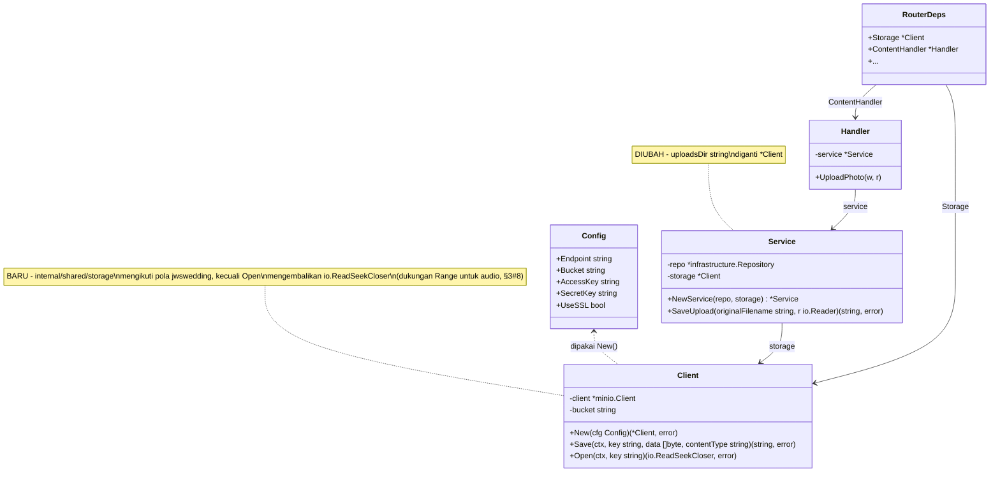
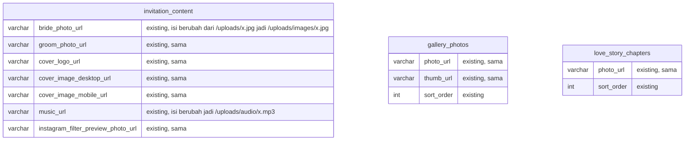

# PLAN.md — Pindahkan File Upload Konten ke Object Storage (IDCloudHost S3)

## 1. Requirement yang Disepakati & Klasifikasi Intent

**Permintaan user:** "pada file-file content yang di-upload saya ingin tidak disimpan dalam
project melainkan disimpan dalam object storage dengan path penyimpanan yang ideal dan
terstruktur", disertai kredensial IDCloudHost Object Storage (S3-compatible): endpoint
`is3.cloudhost.id`, bucket **`elcodelabs`**, SSL aktif.

**Klasifikasi intent:** **Enhancement** — kapabilitas upload file admin sudah ada
(`POST /api/v1/admin/uploads`, lihat §2), yang diubah hanya *backend penyimpanannya* (disk
lokal → object storage). Bukan capability baru, bukan bug fix.

**Ruang lingkup yang dikunci:** "file content yang diupload" = seluruh foto/musik yang
diunggah admin lewat modul `content` (couple photo, cover, gallery, love story, wedding gift,
instagram filter preview, musik latar). Tidak termasuk sesi WhatsApp (`WA_STORE_DIR`, file
SQLite yang dibuat `whatsmeow` sendiri, tujuannya beda total dari "file content yang
diupload").

**Fakta penting yang mengubah desain:** bucket yang diberikan (`elcodelabs`) **bukan bucket
khusus elwedding** — ini bucket **shared** dipakai bareng aplikasi lain di VPS yang sama
(dikonfirmasi lewat `docker ps` di sesi sebelumnya: `elproof-app`, `elkasir-app` juga jalan di
`elcodelabs`, dan `knowledge/DEPLOYMENT.md` mencatat pola shared-box yang sama). Ini
mengunci satu keputusan desain di §4: key S3 WAJIB diberi prefix nama aplikasi
(`elwedding/...`), bukan opsional.

## 2. Trace (Step 1–3)

**Entry point dikonfirmasi ada:** `POST /api/v1/admin/uploads` →
[`content/presentation/handler.go:92-116`](../../../apps/api/internal/modules/content/presentation/handler.go#L92)
(`UploadPhoto`) → [`content/application/service_upload.go:26-54`](../../../apps/api/internal/modules/content/application/service_upload.go#L26)
(`SaveUpload`). Ini **satu-satunya** endpoint upload di seluruh backend — dikonfirmasi lewat
pencarian menyeluruh (`grep -rli upload apps/api`), hanya modul `content` yang punya kode
upload; modul `auth`/`guest`/`whatsapp` tidak menyimpan file apa pun.

**Siapa saja pemanggilnya (frontend):** SATU fungsi
[`content.service.ts:24-31`](../../../apps/web/src/modules/admin/content/services/content.service.ts#L24)
(`uploadPhoto`) dipakai baik oleh field foto tunggal di tab Profil/Cover/Filter/Video
([`ContentPage.tsx:76-95`](../../../apps/web/src/modules/admin/content/pages/ContentPage.tsx#L76))
maupun oleh `SimpleListEditor` untuk Gallery Foto dan Love Story
([`SimpleListEditor.tsx:78-90`](../../../apps/web/src/modules/admin/content/components/SimpleListEditor.tsx#L78)).
Semuanya memakai kontrak yang sama: kirim `multipart/form-data`, terima `{url: string}`,
simpan string itu apa adanya ke field form, tampilkan sebagai `` langsung
(tanpa transformasi apa pun — dikonfirmasi di `Couple.tsx:269`, `Cover.tsx:24`,
`PhotoGallery.tsx:27`, `LoveStory.tsx:67`, dan `httpClient`'s `baseURL: ''`). **Ini kontrak yang
harus dipertahankan** — mengubahnya berarti mengubah frontend, yang tidak perlu untuk
requirement ini.

**Trace tambahan — bagaimana persis tiap `_url` benar-benar dipakai di halaman undangan publik
(guest-facing), bukan cuma di form admin.** Ini ditelusuri sampai tuntas karena permintaan
eksplisit: memastikan konten yang diupload *benar-benar terpakai dengan benar*, bukan cuma
"upload-nya sukses". Ditemukan **dua jalur konsumsi yang berbeda sifatnya**:

| Field | Komponen/mekanisme | Cara pakai |
|---|---|---|
| `bridePhotoUrl`, `groomPhotoUrl` | [`Couple.tsx:128-129,268-269`](../../../apps/web/src/components/Couple/Couple.tsx#L128) | `` React biasa |
| `coverLogoUrl` | [`Cover.tsx:24`](../../../apps/web/src/components/Cover/Cover.tsx#L24), [`Footnote.tsx:60`](../../../apps/web/src/components/Footnote/Footnote.tsx#L60) | `` React biasa |
| `instagramFilterPreviewPhotoUrl` | [`InstagramFilter.tsx:62`](../../../apps/web/src/components/InstagramFilter/InstagramFilter.tsx#L62) | `` React biasa |
| `photoUrl`/`thumbUrl` (gallery) | [`PhotoGallery.tsx:26-27,43`](../../../apps/web/src/components/PhotoGallery/PhotoGallery.tsx#L26) | `<a href>` (lightbox) + `` React biasa |
| `photoUrl` (love story) | [`LoveStory.tsx:67`](../../../apps/web/src/components/LoveStory/LoveStory.tsx#L67) | `` React biasa |
| `coverImageDesktopUrl`, `coverImageMobileUrl` | [`useLegacyBootstrap.ts:72-83`](../../../apps/web/src/hooks/useLegacyBootstrap.ts#L72) | **BUKAN React** — ditulis ke `window.COVERS` sebagai string HTML mentah (`` `` ``), lalu jQuery legacy (`fddf2641.js`) yang `.html()`-kan ke `#cover-main` |
| `musicUrl` | [`useLegacyBootstrap.ts:62`](../../../apps/web/src/hooks/useLegacyBootstrap.ts#L62) | **BUKAN React** — ditulis ke `window.MUSIC.url`, dibaca `fddf2641.js` yang membuat elemen `<audio>` native |

Baris pertama (5 field) semuanya ``/`<a href>` biasa — cuma butuh URL yang bisa diakses
`GET`, tidak ada persyaratan tambahan. Dua baris terakhir **beda dan lebih ketat**:

1. **Cover MAIN** cuma soal string HTML — aman selama URL-nya valid, tidak ada perilaku
   tambahan yang bergantung pada isi/format response.
2. **Musik latar — TEMUAN PENTING.** Dilacak sampai ke isi `fddf2641.js`
   (`grep -oE "setupAudio:function\(\).{400}" fddf2641.js`):
   ```
   const e=document.createElement("audio");
   e.loop=!0, e.preload="auto", e.crossOrigin="anonymous", e.playsInline=!0, ...
   e.src=this.config.url;  // = window.MUSIC.url = content.musicUrl
   e.load()
   ```
   Ini elemen `<audio>` HTML5 asli dengan `preload="auto"` yang langsung `.load()`. Browser
   (Safari/iOS khususnya, tapi juga Chrome/Firefox untuk seek) mengandalkan **HTTP Range
   request** (`Range: bytes=...` → respons `206 Partial Content` + `Accept-Ranges: bytes`)
   supaya media bisa di-buffer/di-seek. Ini persis yang **sudah didukung otomatis** oleh
   `http.FileServer` (skema lama, disk lokal) — tapi desain awal saya untuk handler S3 baru
   (`io.Copy` polos ke response writer) **TIDAK** mendukung Range sama sekali. Ini akan jadi
   regresi nyata: upload musik "berhasil", tapi pemutaran di HP tamu (terutama iOS) bisa gagal
   atau tidak bisa di-seek — persis kekhawatiran user bahwa konten harus "benar-benar digunakan
   dengan benar", bukan cuma tersimpan. **Diperbaiki di §3 keputusan #8 & §6 task 8.**
   (Catatan: `crossOrigin="anonymous"` di elemen itu tidak relevan di sini karena desain proxy
   §3 keputusan #2 membuat audio tetap same-origin dengan halaman — bukan permintaan
   cross-origin, jadi tidak butuh header CORS apa pun.)

**Data source (Step 3) — tidak ada perubahan skema:** Tabel yang menyimpan URL hasil upload:
`invitation_content` (`bride_photo_url`, `groom_photo_url`, `cover_logo_url`,
`cover_image_desktop_url`, `cover_image_mobile_url`, `music_url`,
`instagram_filter_preview_photo_url` — semua `VARCHAR(500)`,
[migration `000001`](../../../apps/api/migrations/000001_create_content_tables.up.sql#L7)),
`gallery_photos` (`photo_url`, `thumb_url`), `love_story_chapters` (`photo_url`). Semua kolom
menyimpan **path string**, bukan tipe khusus — path baru (§4) tetap muat jauh di bawah 500
karakter. **Keputusan: tidak ada migrasi DB.**

**Precedent yang ditemukan (sangat menentukan desain, Step 0's "hunt for precedent"):** proyek
lain di akun yang sama, `jwswedding` (`H:\dimasprasetio\SAAS\jwswedding`), sudah menyelesaikan
persis masalah ini dengan infrastruktur yang sama (IDCloudHost, VPS berbagi dengan aplikasi
lain). Kode yang relevan:
- `apps/api/go.mod` → `github.com/minio/minio-go/v7 v7.2.1`.
- `apps/api/internal/shared/config/config.go:67-71` → baca env `S3_ENDPOINT`, `S3_BUCKET`,
  `S3_ACCESS_KEY`, `S3_SECRET_KEY`, `S3_USE_SSL` — **nama variabel PERSIS SAMA** dengan yang
  user berikan di prompt ini, mengonfirmasi ini konvensi baku di akun ini, bukan kebetulan.
- `apps/api/internal/shared/storage/storage.go` → wrapper tipis di atas `minio-go`:
  `Client{client *minio.Client, bucket string}`, `New(cfg Config)`,
  `Save(ctx, key, data []byte, contentType) (string, error)`,
  `Open(ctx, key) (io.ReadCloser, error)`. **Tidak pernah mengembalikan URL S3 publik** — hanya
  mengembalikan `key`.
- `apps/api/internal/modules/platform/presentation/tenant_handler.go:426-437` &
  `login_slides_handler.go:43-69` → file selalu di-stream balik lewat handler HTTP milik
  aplikasi sendiri (`storage.Open` → `io.Copy(w, reader)`), **tidak pernah** lewat URL S3
  langsung. Komentar di `tenant_service.go:187-188` menyatakan eksplisit alasannya: *"object
  storage requires backend auth and can't be linked to directly from the browser"* — bucket ini
  memang **private**, bukan pilihan gaya penulisan kode.
- Konvensi key: `jwswedding/upload/{tenantId}/{projectId}/{category}/{filename}`
  (`storage.go:71-75`, ADR-0006) — prefix nama aplikasi di depan, karena bucket dipakai
  bersama.

Precedent ini menjawab tiga hal sekaligus tanpa perlu menebak: library yang dipakai, bahwa
bucket `elcodelabs` memang privat (jadi harus proxy, bukan link langsung), dan pola penamaan
key. Ini persis kriteria "fit dengan konvensi" di Step 4 — bukan pilihan gaya, tapi fakta
infrastruktur yang sudah terbukti di akun yang sama.

**Verifikasi produksi (sebelum desain dikunci):** dicek langsung ke VPS `elcodelabs`
(`docker exec elwedding-app ls -la /app/uploads`) — **hanya ada 3 file** di `UPLOADS_DIR`
produksi saat ini, total ±26 MB, semua `.jpeg`. Fakta ini dipakai untuk keputusan migrasi di
§3 (Step 4).

## 3. Keputusan Desain (Step 4)

**Satu pertanyaan nyata diajukan ke user, dijawab langsung:**

> 3 file lama di produksi tidak otomatis ikut pindah ke S3 (skema URL berubah). Ditangani
> bagaimana? → **User memilih: re-upload manual lewat halaman admin Konten setelah deploy**,
> bukan script migrasi otomatis. Alasan yang tercatat: skalanya cuma 3 file, membuat script
> migrasi yang dipakai sekali untuk 3 file adalah over-engineering (kriteria "simplest
> mechanism" Step 4).

**Keputusan desain lain (tidak ada fork nyata, ini murni fakta teknis + fit-konvensi, bukan
preferensi — jadi dikunci langsung, bukan ditanyakan):**

1. **Library: `github.com/minio/minio-go/v7`.** Bukan pilihan baru — memakai persis yang
   sudah terbukti jalan di akun yang sama dengan provider yang sama (§2). Alternatif
   `aws-sdk-go-v2` tidak dipertimbangkan: menambah kompleksitas konfigurasi endpoint custom
   tanpa keuntungan apa pun di sini (tidak ada rencana pindah ke AWS S3 asli).
2. **Akses privat + proxy lewat backend, bukan bucket public + URL S3 langsung.** Mengikuti
   fakta yang sudah dibuktikan sebaya (§2): bucket ini butuh autentikasi backend. Desain ini
   juga otomatis **kebal terhadap ketidaktahuan soal ACL bucket** — proxy tetap bekerja baik
   bucket ternyata publik maupun privat, jadi tidak perlu diverifikasi dulu sebelum
   implementasi.
3. **Konvensi key: `elwedding/upload/{category}/{filename}`**, dengan `category` ∈
   `{images, audio}` diturunkan dari ekstensi file (bukan input baru dari frontend — tidak ada
   info kategori yang tersedia di endpoint generik ini selain ekstensi). Prefix `elwedding/`
   WAJIB (§1 - bucket shared). Tidak memakai `{tenantId}/{projectId}` seperti `jwswedding`
   karena elwedding memang single-tenant (`invitation_content` adalah singleton, `DATABASE.md`)
   — mengadopsi segmen yang tidak ada gunanya di sini adalah over-engineering, bukan
   konsistensi.
4. **Kontrak URL yang dikembalikan ke frontend TIDAK berubah bentuk**, hanya bertambah satu
   segmen: `/uploads/{category}/{filename}` (sebelumnya `/uploads/{filename}`). Frontend,
   kolom DB, dan proxy Vite dev (`vite.config.ts:23` sudah mem-proxy `/uploads`) semuanya tetap
   jalan tanpa disentuh — **zero frontend changes, zero DB migration**. Ini yang membuat
   perubahan ini kecil meski menyentuh infrastruktur baru.
5. **Content-Type ditentukan dari peta ekstensi eksplisit di kode** (bukan
   `mime.TypeByExtension` bawaan Go, dan bukan metadata yang disimpan balik dari S3). Alasan:
   image Alpine (`infra/docker/Dockerfile:18`) tidak menjamin `/etc/mime.types` terpasang untuk
   tipe audio (`.mp3`/`.wav`/`.ogg`) — kalau dibiarkan bergantung pada mime database sistem,
   ini bisa diam-diam salah/kosong khusus di container produksi meski benar di mesin dev
   Windows. Peta eksplisit dengan 7 entri yang sama persis dengan `allowedUploadExt` yang
   sudah ada menghindari risiko itu sepenuhnya, tanpa dependency baru.
6. **Dev lokal butuh kredensial S3 asli di `.env`, tidak ada fallback disk lokal.** Mengikuti
   persis pola `jwswedding` (tidak ada percabangan kode "kalau S3 kosong pakai disk") — satu
   jalur kode, lebih sederhana untuk dirawat, dan user sudah memberi kredensial kerja yang
   mengisyaratkan ini memang dipakai juga di dev.
7. **`UPLOADS_DIR` dan volume Docker-nya dihapus sepenuhnya** (bukan dipertahankan sebagai
   fallback) — begitu deploy ini jalan, seluruh upload baru masuk S3; mempertahankan
   `UPLOADS_DIR` yang tidak pernah ditulis lagi hanya menyisakan infrastruktur mati.
8. **Handler baca `/uploads/*` pakai `http.ServeContent`, BUKAN `io.Copy` polos — dan
   `storage.Client.Open` mengembalikan `io.ReadSeekCloser`, bukan `io.ReadCloser` seperti
   `jwswedding`.** Ini **deviasi sengaja dari precedent di §2**, dengan alasan konkret: temuan
   trace di §2 (musik latar dipakai lewat elemen `<audio>` native dengan `preload="auto"` yang
   butuh dukungan HTTP Range untuk buffer/seek, terutama di Safari/iOS). `jwswedding` tidak
   perlu ini karena dia cuma menyajikan gambar logo/signature/slide lewat jalur ini, tidak
   pernah audio/video. `*minio.Object` (nilai balik `GetObject` milik minio-go) sudah
   mengimplementasikan `io.Reader`+`io.Seeker`+`io.Closer` secara native (didesain minio-go
   memang untuk kasus `http.ServeContent` persis seperti ini) — jadi tidak perlu library atau
   mekanisme tambahan, cuma mengekspos kapabilitas yang sudah ada di tipe itu lewat return type
   `Open` yang lebih permisif. `http.ServeContent` otomatis menangani `Range`/`206 Partial
   Content`/`Accept-Ranges`, sama seperti yang **sudah** didapat gratis dari `http.FileServer`
   di skema lama — jadi ini bukan menambah kemampuan baru, ini **mencegah regresi** dari
   kemampuan yang sudah ada. `modtime` dikirim sebagai nilai kosong (`time.Time{}`) supaya
   tidak perlu panggilan `StatObject` terpisah ke S3 (yang akan menggandakan round-trip per
   request) — sebagai gantinya, cache dikontrol lewat header `Cache-Control:
   public, max-age=31536000, immutable` (nama file sudah unik/random per upload, jadi aman
   di-cache permanen tanpa risiko menyajikan versi lama).

**Batasan (out of scope), dengan alasan:**
- **Pembersihan objek S3 yang jadi yatim** saat foto diganti/dihapus dari CMS — di luar
  lingkup. Ini **bukan regresi**: perilaku sekarang (disk lokal) juga tidak pernah membersihkan
  file lama (`SaveUpload` lama tidak pernah memanggil `os.Remove` di mana pun) — jadi tidak ada
  jaminan yang hilang.
- **Migrasi otomatis 3 file lama** — diputuskan manual (lihat atas).
- **Kebijakan ACL/bucket policy di sisi IDCloudHost** — di luar kendali kode aplikasi; desain
  proxy (keputusan #2) membuat ini tidak relevan untuk kebenaran fungsional.
- **`WA_STORE_DIR`** — tujuan beda total (sesi WhatsApp, `knowledge/DEPLOYMENT.md`), tidak
  disentuh.
- **Route API di bawah `/api/v1`** — route baca `/uploads/*` sengaja TETAP di luar `/api/v1`,
  sama seperti sekarang (`router.go:113-115`), karena ini penyajian aset statis, bukan endpoint
  JSON `{success,message,data}` (`api-standard.md`) — endpoint upload-nya sendiri
  (`POST /api/v1/admin/uploads`) sudah benar di bawah `/api/v1` dan tidak diubah.

## 4. Re-trace untuk Reuse (Step 5)

**Reuse (dipakai ulang, tidak ditulis baru):**
- Endpoint `POST /api/v1/admin/uploads` & `UploadPhoto` handler — tidak berubah sama sekali.
- Whitelist ekstensi `allowedUploadExt` — tetap jadi satu-satunya sumber kebenaran, diperluas
  jadi peta kategori+content-type (bukan didup­likasi).
- Skema nama file collision-safe (`{unixnano}-{hex}{ext}`,
  `service_upload.go:36-40`) — dipertahankan persis, tidak diganti UUID meski `jwswedding`
  pakai UUID (skema yang ada di elwedding sudah benar, mengganti tanpa alasan adalah
  perubahan sia-sia).
- Prefix route `/uploads/` & kontrak `{url: string}` di respons `UploadPhoto` — dipertahankan.
- Pola direktori `internal/shared/<nama>/` (`authmw`, `jwtutil`, `pagination`, `response`) —
  `storage` baru mengikuti pola yang sama persis.
- Pola `getenv()` di `config.go` — dipakai ulang untuk field S3 baru.
- Helper `response.NotFoundJSON`/`response.Internal` — dipakai di handler baca `/uploads/*`
  yang baru.
- Proxy Vite `/uploads` (`vite.config.ts:23`) — tidak perlu diubah, tetap meneruskan ke API.

**Create new (gap yang dibuktikan, bukan diasumsikan):**
- `internal/shared/storage/storage.go` — **gap nyata**: `grep -rn s3 apps/api` sebelum sesi ini
  kosong total, tidak ada abstraksi object storage apa pun di elwedding.
- Handler baca dinamis `GET /uploads/{category}/{filename}` di `router.go` — **gap nyata**:
  yang ada sekarang (`http.FileServer(http.Dir(...))`) cuma bisa baca disk lokal, tidak bisa
  bicara ke S3.
- Peta `category`/`contentType` per ekstensi di `service_upload.go` — **gap nyata**: tidak ada
  pemetaan ekstensi→kategori atau ekstensi→MIME di kode manapun di elwedding hari ini.

## 5. File yang Disentuh

| File | Perubahan |
|---|---|
| `apps/api/go.mod`, `go.sum` | Tambah `github.com/minio/minio-go/v7` |
| `apps/api/internal/shared/storage/storage.go` (baru) | `Client`, `Config`, `New`, `Save`, `Open` — mengikuti pola `jwswedding`, kecuali `Open` mengembalikan `io.ReadSeekCloser` (untuk dukungan Range, §3#8) |
| `apps/api/internal/config/config.go` | Hapus `UploadsDir`; tambah `S3Endpoint/S3Bucket/S3AccessKey/S3SecretKey/S3UseSSL` |
| `apps/api/internal/modules/content/application/service_upload.go` | `SaveUpload` pakai `storage.Client` bukan disk; tambah `categoryAndContentType(ext)`, `buildKey(category, filename)` |
| `apps/api/internal/modules/content/application/service.go` | Field `uploadsDir string` → `storage *storage.Client`; `NewService` ganti parameter |
| `apps/api/internal/modules/content/content.module.go` | `New(db, uploadsDir string)` → `New(db, storageClient *storage.Client)` |
| `apps/api/cmd/server/main.go` | Bangun `storage.Client` dari `cfg`, fail-fast kalau gagal (pola sama dengan `database.Open`); teruskan ke `content.New` & `router.Deps` |
| `apps/api/internal/router/router.go` | `Deps.UploadsDir string` → `Deps.Storage *storage.Client`; ganti blok statis (baris 113-115) jadi handler baca S3 lewat `http.ServeContent` (dukungan Range, §3#8) |
| `.env.example` | Hapus blok `UPLOADS_DIR`; tambah blok `S3_*` (placeholder, bukan nilai asli) |
| `docker-compose.yml` | Hapus volume `uploads_data` & mount-nya |
| `infra/docker/Dockerfile` | Hapus `ENV UPLOADS_DIR` & `RUN mkdir -p /app/uploads` |

## 6. Task List

1. [x] `cd apps/api && go get github.com/minio/minio-go/v7` — memperbarui `go.mod`/`go.sum`.
2. [x] Buat `apps/api/internal/shared/storage/storage.go`: `Client{client *minio.Client,
   bucket string}`, `Config{Endpoint, Bucket, AccessKey, SecretKey string; UseSSL bool}`,
   `New(cfg Config) (*Client, error)` (pakai `minio.New` + `credentials.NewStaticV4`),
   `Save(ctx, key string, data []byte, contentType string) (string, error)` (pakai
   `PutObject`, kembalikan `key`), `Open(ctx, key string) (io.ReadSeekCloser, error)` (pakai
   `GetObject`, **BUKAN** `io.ReadCloser` — lihat keputusan §3#8, `*minio.Object` sudah
   mengimplementasikan Seek secara native, dibutuhkan untuk dukungan HTTP Range di task 8) —
   struktur dasarnya mengikuti `jwswedding/apps/api/internal/shared/storage/storage.go`, dengan
   satu deviasi sengaja itu.
3. [x] Di `config.go`: hapus field `UploadsDir` & baris `getenv("UPLOADS_DIR", ...)`; tambah
   `S3Endpoint, S3Bucket, S3AccessKey, S3SecretKey string` (dari `os.Getenv`, tanpa default —
   kosong berarti gagal saat `storage.New` dipanggil, konsisten dengan `DBDSN` yang juga tanpa
   default) dan `S3UseSSL bool` (dari `getenv("S3_USE_SSL", "true") == "true"`).
4. [x] Di `service_upload.go`: tambah `var categoryByExt = map[string]string{".jpg": "images",
   ".jpeg": "images", ".png": "images", ".webp": "images", ".gif": "images", ".mp3": "audio",
   ".wav": "audio", ".ogg": "audio"}` dan `var contentTypeByExt = map[string]string{".jpg":
   "image/jpeg", ".jpeg": "image/jpeg", ".png": "image/png", ".webp": "image/webp", ".gif":
   "image/gif", ".mp3": "audio/mpeg", ".wav": "audio/wav", ".ogg": "audio/ogg"}` (7 key persis
   sama dengan `allowedUploadExt`, urutan yang sama supaya mudah dibandingkan). Ubah
   `SaveUpload`: baca seluruh `r` ke `[]byte` (`io.ReadAll` — aman, sudah dibatasi 10 MB oleh
   `http.MaxBytesReader` di handler), bangun `filename` (skema lama dipertahankan), bangun
   `key := fmt.Sprintf("elwedding/upload/%s/%s", categoryByExt[ext], filename)`, panggil
   `s.storage.Save(ctx, key, data, contentTypeByExt[ext])`, kembalikan
   `"/uploads/" + categoryByExt[ext] + "/" + filename` (bukan `key` mentah — biar prefix
   `elwedding/upload/` tetap jadi detail internal, tidak bocor ke URL publik).

   **Penyesuaian saat implementasi (2x, keduanya demi kebenaran/testability, bukan penyimpangan
   dari desain):** (a) pembangunan key diekstrak jadi fungsi murni `buildKey(category,
   filename string) string`, dipakai `SaveUpload` — supaya §7 test #3 (format key) bisa dites
   tanpa storage sungguhan, sesuai maksud test plan; (b) `SaveUpload` diberi parameter `ctx
   context.Context` di depan (bukan `context.Background()` di dalam) — konsisten dengan semua
   method `Service` lain di file ini (`GetContent(ctx)`, `UpdateSections(ctx, ...)`, dst.) dan
   supaya cancellation/timeout request HTTP diteruskan sampai ke panggilan S3.
   `handler.go:105` disesuaikan memanggil `h.service.SaveUpload(r.Context(), ...)`.
5. [x] Di `service.go`: ganti field `uploadsDir string` jadi `storage *storage.Client`;
   `NewService(repo *infrastructure.Repository, storage *storage.Client) *Service`.
6. [x] Di `content.module.go`: `New(db *sql.DB, storageClient *storage.Client) (*presentation.Handler,
   contracts.InvitationInfoProvider)`.
7. [x] Di `main.go`: setelah `cfg := config.Load()`, bangun
   `storageClient, err := storage.New(storage.Config{Endpoint: cfg.S3Endpoint, Bucket:
   cfg.S3Bucket, AccessKey: cfg.S3AccessKey, SecretKey: cfg.S3SecretKey, UseSSL:
   cfg.S3UseSSL})`, `log.Fatalf` kalau error (pola sama `database.Open` di baris 26-29). Ganti
   `content.New(db, cfg.UploadsDir)` jadi `content.New(db, storageClient)`. Ganti
   `UploadsDir: cfg.UploadsDir` di `router.Deps{...}` jadi `Storage: storageClient`.
8. [x] Di `router.go`: ganti `UploadsDir string` di `Deps` jadi `Storage *storage.Client`.
   Hapus blok `if d.UploadsDir != "" { mux.Handle("/uploads/", ...) }` (baris 113-115). Ganti
   dengan:
   ```go
   mux.HandleFunc("GET /uploads/{category}/{filename}", func(w http.ResponseWriter, r *http.Request) {
       category := r.PathValue("category")
       filename := r.PathValue("filename")
       if category != "images" && category != "audio" {
           response.NotFoundJSON(w, r)
           return
       }
       reader, err := d.Storage.Open(r.Context(), "elwedding/upload/"+category+"/"+filename)
       if err != nil {
           var s3err minio.ErrorResponse
           if errors.As(err, &s3err) && s3err.Code == "NoSuchKey" {
               response.NotFoundJSON(w, r)
               return
           }
           response.Internal(w, "Failed to fetch file")
           return
       }
       defer reader.Close()
       if ct, ok := contentTypeByExt[strings.ToLower(filepath.Ext(filename))]; ok {
           w.Header().Set("Content-Type", ct)
       }
       w.Header().Set("Cache-Control", "public, max-age=31536000, immutable")
       http.ServeContent(w, r, filename, time.Time{}, reader)
   })
   ```
   **Penting:** pakai `http.ServeContent` (bukan `io.Copy`) — ini yang memberi dukungan HTTP
   Range/`206 Partial Content` secara otomatis, mencegah regresi pemutaran musik latar yang
   ditemukan di §2 (elemen `<audio>` native butuh Range untuk buffer/seek). `reader` yang
   dikirim ke `ServeContent` harus bertipe `io.ReadSeeker` — inilah alasan `Open` di task 2
   dikembalikan sebagai `io.ReadSeekCloser`, bukan `io.ReadCloser`. `Content-Type` di-set
   manual SEBELUM memanggil `ServeContent` supaya `ServeContent` memakainya apa adanya (tidak
   melakukan sniffing sendiri yang bisa keliru untuk audio, konsisten dengan keputusan §3#5).
   `modtime` dikirim `time.Time{}` (kosong) supaya tidak perlu panggilan `StatObject` terpisah
   ke S3 (§3#8) — caching ditangani lewat header `Cache-Control` di atas, bukan
   `Last-Modified`/`If-Modified-Since`.
   (Nama peta `contentTypeByExt` di sini adalah salinan kecil khusus paket `router` — tidak
   boleh impor dari `content/application` yang tidak diekspor; lihat catatan boundary di §10
   validasi. Import baru yang dibutuhkan: `errors`, `net/http` (sudah ada), `path/filepath`,
   `time`, `github.com/minio/minio-go/v7`.)
9. [x] Di `.env.example`: hapus blok `UPLOADS_DIR` (baris 21-24); tambah blok baru:
   ```
   # IDCloudHost Object Storage (S3-compatible) — foto/musik konten (menggantikan
   # UPLOADS_DIR). Bucket dipakai bersama aplikasi lain (elcodelabs) — JANGAN
   # hapus prefix "elwedding/" dari key manapun.
   S3_ENDPOINT=
   S3_BUCKET=
   S3_ACCESS_KEY=
   S3_SECRET_KEY=
   S3_USE_SSL=true
   ```
   (placeholder kosong — kredensial asli HANYA masuk ke `.env` lokal yang sudah
   `.gitignore`d dan ke `~/elwedding/.env` di VPS, tidak pernah dikomit.)
10. [x] Di `docker-compose.yml`: hapus baris `- uploads_data:/app/uploads` dan entri
    `uploads_data:` di bawah `volumes:` (baris 14 & 23) — `wa_store_data` tetap ada.
11. [x] Di `infra/docker/Dockerfile`: hapus `ENV UPLOADS_DIR=/app/uploads` dan
    `RUN mkdir -p /app/uploads` (baris 39-40).
12. [ ] **Manual, belum dikerjakan (di luar jangkauan sesi ini secara sengaja — lihat
    `knowledge/AI_AGENT_OPERATIONS.md`).** Tambah kredensial S3 asli ke `.env` lokal Anda (bukan
    `.env.example`, tidak dikomit) untuk pengembangan, dan ke `~/elwedding/.env` di VPS
    `elcodelabs` sebelum deploy berikutnya. `.env` lokal Anda sudah ada
    (`d:\Undangan-new\.env`) — tidak dibaca/ditulis sesi ini karena berisi secret lain
    (`DB_PASSWORD`, `JWT_SECRET`) yang di luar cakupan perubahan ini.
13. [ ] **Manual, menunggu deploy (task 12 dulu).** Setelah deploy: buka halaman admin
    **Konten**, cek tiap tab (Profil, Cover, Filter, Video, Gallery Foto, Love Story) — foto
    yang sebelumnya menunjuk ke 3 file lama (`1788289587481942658-7f0082ccbc413687.jpeg` dan
    sejenisnya) akan tampak rusak; re-upload lewat form yang sudah ada di masing-masing tab
    (keputusan §3). Lanjutkan dengan verifikasi manual di §7 (termasuk cek Range untuk musik
    dan buka undangan sungguhan, bukan cuma admin).

### Verifikasi ulang pasca-implementasi (2026-09-02) — 2 bug ditemukan & diperbaiki

Setelah task 1–11 "hijau" (build/vet/test lulus), dilakukan verifikasi ulang yang **tidak
berhenti di build** — ditulis test integrasi dengan fake S3 (`httptest`) di
`internal/router/uploads_test.go` untuk benar-benar menjalankan handler `/uploads/*`.
Hasilnya: **4 dari 5 skenario gagal pada percobaan pertama.** Rinciannya:

| Skenario | Hasil awal | Status |
|---|---|---|
| Objek ada → 200 + Content-Type | 500 `seeker can't seek` | **Artefak test**, bukan bug produk (lihat bawah) |
| `Range: bytes=0-3` → 206 | 500 `seeker can't seek` | **Artefak test** — setelah diperbaiki: **LULUS**, klaim §3#8 tervalidasi empiris |
| Objek tidak ada → 404 JSON | **500** `seeker can't seek` | **BUG NYATA #1 — diperbaiki** |
| URL skema lama 1 segmen → 404 | **200 + `index.html`** | **BUG NYATA #2 — diperbaiki** |
| Kategori tidak valid → 404 | 404 | Lulus sejak awal |

**Artefak test (bukan bug produk), penting dicatat supaya tidak menyesatkan:** dua kegagalan
pertama disebabkan fake S3 saya mengirim `Last-Modified` kosong (`time.Time{}`). minio-go
**menolak** respons tanpa `Last-Modified` yang bisa di-parse (S3 asli selalu mengirimnya).
Setelah fake diperbaiki mengirim modtime nyata, keduanya lulus — jadi jalur sukses dan
dukungan Range memang sudah benar sejak implementasi awal.

**BUG NYATA #1 — objek hilang balas 500, bukan 404.** Akar masalah: `GetObject` milik minio-go
bersifat **lazy** — dibuktikan langsung dari source
(`api-get-object.go:32-72`: hanya validasi input lalu spawn goroutine; request jaringan baru
terjadi pada `Read`/`Seek`/`Stat` pertama). Akibatnya `Open` mengembalikan `err == nil` untuk
key yang tidak ada, sehingga pengecekan `errors.As(err, &minio.ErrorResponse)` di router
**tidak pernah tereksekusi (dead code)**; error baru meledak di dalam `http.ServeContent` saat
`sizeFunc()` memanggil `Seek`, dan stdlib membalasnya sebagai
`500 "seeker can't seek"` (`net/http/fs.go:246-256, 305-308`) — plain text, bukan JSON, dan
status yang salah.
**Perbaikan:** `storage.Open` sekarang memaksa materialisasi objek dengan
`Seek(0, SeekEnd)` + `Seek(0, SeekStart)` tepat setelah `GetObject`, lalu memetakan
`NoSuchKey`/HTTP 404 ke sentinel baru **`storage.ErrNotFound`**. Router cukup memeriksa
`errors.Is(err, storage.ErrNotFound)` → 404 JSON. Efek samping yang bagus: router **tidak lagi
mengimpor `minio-go` sama sekali**, sehingga janji di doc-comment paket `storage` ("pemanggil
tidak perlu tahu ini disokong S3") kini benar-benar ditepati — sebelumnya dilanggar sendiri.
**Biaya performa: nol** — diukur, bukan diasumsikan: `TestUploads_JumlahRoundTripKeS3`
membuktikan tetap **2 round-trip** (1 `HEAD` metadata + 1 `GET` isi), karena `http.ServeContent`
memakai ulang info objek yang sudah di-cache minio-go.

**BUG NYATA #2 — URL skema lama dibalas `index.html` dengan status 200.** Route baru
(`GET /uploads/{category}/{filename}`) mensyaratkan **dua** segmen, sedangkan 3 file legacy di
produksi ber-URL satu segmen (`/uploads/1788289587481942658-….jpeg`). Path seperti itu tidak
cocok pola mana pun kecuali catch-all `/` → jatuh ke `spaFallback` → karena GET & `PublicDir`
terisi, dibalas **`index.html` dengan 200**. Dampaknya bukan cuma salah status: gambar rusak
jadi tanpa sinyal error yang jelas, dan `` menerima HTML. **Perbaikan:** ditambah handler
prefix `mux.HandleFunc("/uploads/", …)` yang membalas 404 JSON untuk semua path `/uploads/*`
yang tidak cocok pola dua segmen. (Pola dua segmen lebih spesifik, jadi tetap menang — tidak
ada konflik pattern di `http.ServeMux`.)

**Temuan minor yang juga diperbaiki:** `go.mod` menandai `minio-go` sebagai `// indirect`
padahal sudah jadi dependency langsung → dirapikan dengan `go mod tidy`.

**Catatan untuk deploy (belum bisa dikerjakan dari sesi ini):** `docker-compose.prod.yml` di
VPS masih memasang volume `uploads_data:/app/uploads`. Ini **tidak berbahaya** (folder jadi
tidak terpakai), tapi bisa dibersihkan manual saat deploy berikutnya — file itu ada di server,
di luar repo, dan tidak bisa dibaca/diedit dari sesi ini (lihat
`knowledge/AI_AGENT_OPERATIONS.md` §2).

**Status implementasi (2026-09-02):** Task 1–11 (seluruh perubahan kode & config) selesai dan
terverifikasi:
- `go build ./...`, `go vet ./...`, `go test ./...` — semua bersih, tidak ada regresi di test
  yang sudah ada (`content/application`, `guest/application`, `whatsapp/application`,
  `router`).
- Test baru `service_upload_test.go` (3 kasus dari §7: peta kategori/content-type lengkap
  untuk ke-7 ekstensi, ekstensi tak didukung ditolak sebelum menyentuh storage, format
  `buildKey` benar untuk `.jpg`/`.mp3`) — semua lulus.
- Test integrasi baru `internal/router/uploads_test.go` (6 kasus dengan fake S3 `httptest`,
  ditulis saat verifikasi ulang di atas): objek ada → 200 + Content-Type, `Range` → 206 +
  `Content-Range`, objek hilang → 404 JSON, URL skema lama 1 segmen → 404 (bukan HTML),
  kategori tak valid → 404, dan jumlah round-trip ke S3 ≤ 2 — semua lulus.
- Frontend tidak tersentuh sesuai desain: `npx vitest run` di `apps/web` — **17 file / 80 test
  lulus**, mengonfirmasi klaim "zero frontend changes".
- Dicek ulang tidak ada sisa referensi `UploadsDir`/`UPLOADS_DIR` aktif di kode (`grep`
  menunjukkan hanya tersisa di komentar historis yang menjelaskan apa yang digantikan).

Task 12–13 tetap manual sesuai desain (§3 keputusan #6 & jawaban migrasi) — butuh kredensial
asli & lingkungan production yang di luar jangkauan sesi analisis/coding ini.

**Catatan urutan:** 1→2 (butuh library sebelum menulis pemakainya) →3 (config duluan supaya
4-7 punya field yang dibaca) →4→5→6→7 (rantai pemanggilan: `service_upload.go` dipakai
`service.go`, dipakai `content.module.go`, dipakai `main.go`) →8 (router independen dari 4-7
kecuali butuh `Deps.Storage` yang baru ada setelah 7) →9-11 independen satu sama lain, boleh
kapan saja setelah 1 →12-13 hanya bisa setelah semua kode di atas ter-deploy.

## 7. Test Plan

**Reuse pola:** tidak ada test untuk `storage.go` di `jwswedding` juga (dicek —
wrapper tipis di atas SDK pihak ketiga, nilai unit-test-nya rendah, konvensi akun ini memang
tidak mengetesnya). Elwedding mengikuti pola yang sama — **tidak** menulis test untuk
`storage.Client` itu sendiri.

**Test baru yang ditulis** (`apps/api/internal/modules/content/application/service_upload_test.go`,
tidak ada sebelumnya — dicek, `grep -rln SaveUpload --include=*_test.go` kosong):
1. `categoryByExt`/`contentTypeByExt` memetakan ke-7 ekstensi di `allowedUploadExt` dengan
   benar (satu test case per ekstensi, memastikan tidak ada yang lupa saat peta diperluas).
2. Ekstensi yang tidak diizinkan tetap ditolak `ErrUnsupportedFileType` sebelum sempat
   memanggil storage (regresi — perilaku ini sudah ada, harus tetap ada setelah refactor).
3. `buildKey`/format key mengandung prefix `elwedding/upload/` + kategori yang benar untuk
   input `.jpg` dan `.mp3` (mewakili kedua kategori).

**Verifikasi manual (tidak bisa diotomasi dari sesi analisis ini) — ini yang secara langsung
menjawab permintaan user untuk memastikan konten "benar-benar digunakan dengan benar" di
halaman undangan, bukan cuma "upload sukses":**
- Upload satu foto asli dan satu file audio lewat admin Konten di lokal (dengan kredensial S3
  asli di `.env`), konfirmasi `GET /uploads/images/...`/`GET /uploads/audio/...` mengembalikan
  file dengan `Content-Type` yang benar dan bisa dirender ``/`<audio>`.
- Setelah deploy: `curl -I https://elwedding.elcodelabs.com/uploads/images/<filename-baru>`
  harus `200` dengan `Content-Type: image/...`.
- **Dukungan Range (kritis untuk musik, §2/§3#8):**
  `curl -i -H "Range: bytes=0-1023" https://elwedding.elcodelabs.com/uploads/audio/<musik-baru>`
  harus membalas `206 Partial Content` dengan header `Content-Range` dan `Accept-Ranges: bytes`
  — **bukan** `200` dengan seluruh file (itu tandanya `ServeContent`/Seek tidak terpasang
  benar dan regresi §2 masih ada).
- **Buka undangan yang sesungguhnya** (`https://elwedding.elcodelabs.com/`, bukan halaman
  admin) setelah re-upload manual (task 13): cek satu per satu — foto cover (MAIN, yang
  disuntik lewat jQuery `window.COVERS`, bukan React), foto pasangan, galeri foto (thumbnail
  DAN lightbox penuh), love story, preview filter Instagram, logo di footer — semuanya tampil,
  bukan ikon gambar rusak. Cek khusus **musik latar benar-benar mulai diputar** (bukan cuma
  tidak error di console) — idealnya dites juga dari HP (Safari/iOS kalau ada, mengingat §2
  temuan Range paling kritis di situ).
- Request ke kategori yang tidak valid (mis. `/uploads/videos/x.mp4`) harus `404`, bukan `500`.

## 8. Diagram

### 8.1 Class Diagram



### 8.2 ERD

Tidak ada tabel baru dan tidak ada kolom yang berubah tipe/nama (§2 Step 3: "tidak ada
perubahan skema"). Ditampilkan untuk menegaskan bahwa isi kolomnya (bukan strukturnya) yang
berubah maknanya — dulu path disk relatif, sekarang path yang dipetakan ke object storage:



Byte file yang sebenarnya hidup di bucket S3 `elcodelabs` (object storage eksternal, bukan
tabel) di bawah prefix `elwedding/upload/{images|audio}/` — bukan entitas database, ditulis di
sini sebagai catatan supaya jelas kolom-kolom di atas hanya menyimpan *rujukan*, bukan isinya.

### 8.3 Sequence Diagram — Upload & Penyajian

```mermaid
sequenceDiagram
  actor Admin
  participant FE as ContentPage / SimpleListEditor
  participant H as UploadPhoto Handler
  participant Svc as content.Service
  participant S3C as storage.Client
  participant S3 as IDCloudHost S3 (bucket elcodelabs)

  rect rgb(224,240,255)
  Note over Admin,S3: Upload (tidak berubah dari sisi FE)
  Admin->>FE: pilih file foto/musik
  FE->>H: POST /api/v1/admin/uploads (multipart)
  H->>Svc: SaveUpload(filename, reader)
  Svc->>Svc: validasi ekstensi (allowedUploadExt) - TIDAK BERUBAH
  Svc->>Svc: category := categoryByExt[ext], key := "elwedding/upload/"+category+"/"+filename
  Svc->>S3C: Save(ctx, key, bytes, contentTypeByExt[ext])
  S3C->>S3: PutObject(bucket, key, ...)
  S3-->>S3C: OK
  S3C-->>Svc: key
  Svc-->>H: "/uploads/"+category+"/"+filename
  H-->>FE: 201 {url}
  FE->>FE: simpan url ke field form (tidak berubah)
  Admin->>FE: klik Simpan
  FE->>H: PATCH/POST resource (content/gallery/love-story) dengan url itu
  end

  rect rgb(224,255,224)
  Note over Admin,S3: Penyajian gambar biasa (Couple, Cover logo, Gallery, Love Story, IG filter)
  participant Guest as Browser Tamu
  participant R as Router GET /uploads/{category}/{filename}
  Guest->>R: GET /uploads/images/169...jpg (dari  React langsung)
  R->>R: validasi category ∈ {images, audio}
  R->>S3C: Open(ctx, "elwedding/upload/"+category+"/"+filename)
  S3C->>S3: GetObject(bucket, key)
  alt object ada
    S3-->>S3C: io.ReadSeekCloser
    S3C-->>R: reader
    R->>R: set Content-Type dari contentTypeByExt[ext] + Cache-Control
    R->>Guest: http.ServeContent(...) -> 200 + bytes
  else NoSuchKey
    S3-->>S3C: error NoSuchKey
    S3C-->>R: error (wrapped, errors.As diperiksa)
    R-->>Guest: 404 JSON
  end
  end

  rect rgb(255,244,214)
  Note over Guest,S3: Penyajian cover MAIN & musik latar (jalur BEDA - lewat legacy JS, §2)
  participant LB as useLegacyBootstrap
  participant Legacy as fddf2641.js (jQuery)
  Guest->>LB: halaman undangan dimuat, data siap
  LB->>LB: window.COVERS[MAIN].details = ``
  LB->>LB: window.MUSIC = {url: musicUrl, box: '#music-box'}
  Legacy->>Legacy: $(el).html(window.COVERS[MAIN].details) ->  masuk DOM
  Legacy->>Legacy: document.createElement('audio'); e.src = window.MUSIC.url; e.load()
  Note over Guest,Legacy: Browser (audio) minta byte range untuk buffer/seek
  Guest->>R: GET /uploads/audio/musik.mp3 dengan header Range: bytes=0-...
  R->>S3C: Open(ctx, key) -> io.ReadSeekCloser
  S3C->>S3: GetObject + Seek internal (minio-go mendukung ini)
  R->>Guest: http.ServeContent(...) -> 206 Partial Content + Content-Range
  Note over Guest: Tanpa ReadSeekCloser+ServeContent di sini,\nbrowser (terutama Safari/iOS) bisa gagal memutar audio -\ninilah regresi yang dicegah keputusan §3#8
  end
```

## 9. Catatan Volume/Performa (Step 7)

Setiap request gambar/audio sekarang mengalir lewat container `elwedding-app` (proxy ke S3),
bukan langsung dari disk lokal atau CDN — ini biaya operasional nyata (bandwidth container +
satu hop tambahan ke S3 per request) dibanding link S3 langsung/CDN. Dinilai dapat diterima
pada skala sistem ini: satu situs undangan pernikahan, traffic tamu terbatas pada periode
acara, dan jumlah file yang benar-benar kecil (3 file saat ini, §2) — bukan aplikasi
media-berat. Ini juga persis pola yang sudah berjalan di produksi untuk `jwswedding` di
infrastruktur yang sama, jadi bukan asumsi tak teruji. Tidak ada loop/query N+1 yang
diperkenalkan — satu request HTTP = satu `GetObject`/`PutObject`, tidak ada iterasi.

## 10. Log Validasi (Step 7)

**Validation pass 1:**
- *Requirement agreement* — memenuhi permintaan user persis: file tidak lagi disimpan di
  project (disk lokal container), pindah ke object storage, dengan path terstruktur
  (`elwedding/upload/{category}/{filename}`) yang punya alasan (app-prefix karena bucket
  shared, kategori dari ekstensi). Keputusan migrasi 3 file direkam sebagai jawaban user, bukan
  asumsi.
- *Sequence completeness* — tiap hop di §8.3 menunjuk fungsi/handler yang didefinisikan di §6
  task 2, 4, 8 atau kode existing yang sudah dikutip file:line-nya di §2. Tidak ada hop ke
  fungsi yang tidak pernah didefinisikan di plan ini.
- *Ordering* — dicek ulang di §6 catatan urutan: 1→2→3→4→5→6→7 murni rantai pemanggilan (tidak
  bisa dibalik), 8 butuh `Deps.Storage` yang baru ada di 7, 9-11 independen, 12-13 di akhir.
  Tidak ada task yang query/pakai sesuatu sebelum task yang membuatnya.
- *Diagram ↔ prosa ↔ task list* — `Client`, `Config`, `Service.storage`, `RouterDeps.Storage`
  di class diagram (§8.1) semuanya juga ada sebagai task konkret di §6 (task 2, 5, 8). Nama
  kolom di ERD (§8.2) sama persis dengan yang dikutip di §2 dari migration file. Tidak ada
  elemen diagram yang orphan.
- *Fact re-check* — file:line yang dikutip (`handler.go:92-116`, `service_upload.go:26-54`,
  `content.service.ts:24-31`, `router.go:113-115`, `config.go`, migration `000001` baris 7 dst,
  `docker-compose.yml` baris 14/23, `Dockerfile` baris 39-40) semuanya dicocokkan ulang ke isi
  file yang benar-benar dibaca sesi ini, termasuk kode `jwswedding` yang jadi dasar precedent
  (`storage.go`, `tenant_handler.go`, `login_slides_handler.go`, `tenant_service.go`).
- *Exception/error path* — §6 task 8 & §8.3 (alt block) menangani `NoSuchKey` → 404 secara
  eksplisit, bukan diam-diam jadi 500; kategori tak dikenal → 404 (task 8); ekstensi tak
  didukung tetap ditolak sebelum menyentuh storage (test #2 di §7, regresi perilaku existing).
- *Performa/volume* — dibahas eksplisit di §9 dengan asumsi skala yang dinyatakan (1 situs,
  traffic tamu terbatas, 3 file saat ini), bukan diam-diam diasumsikan aman.

**Temuan pada pass ini:** satu catatan kecil di task 8 yang perlu diperjelas — peta
`contentTypeByExt` disebut dipakai di `router.go`, tapi peta itu didefinisikan di
`service_upload.go` milik paket `content/application`, yang **tidak diekspor** (huruf kecil)
dan **tidak boleh diimpor lintas modul** (`backend-modular-monolith.md`: "Forbidden: importing
another module's application/infrastructure/domain internals" — `router` bukan bagian dari
modul `content`, jadi ini pelanggaran boundary kalau dibiarkan apa adanya). Sudah diperbaiki
langsung di task 8 (catatan ditambahkan: `router` punya salinan kecil peta content-type
sendiri, bukan impor dari `content/application`) — lihat task 8 di atas yang sudah direvisi
untuk menyebutkan ini eksplisit.

**Validation pass 2** (seluruh tujuh pemeriksaan diulang dari atas setelah perbaikan task 8):
- *Requirement/sequence/ordering/diagram-prosa/fact-recheck/exception-path/performa* — tidak
  ada yang berubah dari pass 1 selain task 8, dan task 8 yang direvisi tetap konsisten dengan
  §8.3 (sequence diagram sudah menyebut "set Content-Type dari contentTypeByExt[ext]" sebagai
  langkah generik tanpa menyebut asalnya dari paket lain, jadi tidak perlu diubah lagi) serta
  §5 (tabel file yang disentuh tidak menjanjikan `router.go` mengimpor apa pun dari
  `content/application`).
- Tidak ada pelanggaran modular-monolith baru yang tersisa: `router` tidak mengimpor apa pun
  dari `content/application`/`infrastructure`/`domain`; satu-satunya yang diimpor dari luar
  `router` sendiri adalah `internal/shared/storage` (technical utility, bukan domain logic —
  sesuai `shared/` boleh dipakai lintas modul) dan `github.com/minio/minio-go/v7` (library
  pihak ketiga).

Pass 2 bersih pada ketujuh pemeriksaan.

**Pekerjaan tambahan setelah pass 2 (diminta user):** memastikan konten yang diupload
benar-benar terpakai dengan benar di halaman undangan publik, bukan cuma tersimpan. Trace
tambahan (§2, tabel konsumsi) menemukan defect nyata di desain sebelumnya: musik latar
dipakai lewat elemen `<audio>` native (`fddf2641.js`) yang butuh dukungan HTTP Range untuk
buffer/seek (krusial di Safari/iOS), sementara desain awal (`io.Copy` polos) tidak
mendukungnya — regresi dari kemampuan `http.FileServer` yang sudah ada. Diperbaiki lewat
keputusan §3#8 (`http.ServeContent` + `Open` mengembalikan `io.ReadSeekCloser`), dengan
task 2, 8, dan §7 (test plan) direvisi mengikuti, plus §8.3 ditulis ulang untuk menampilkan
kedua jalur konsumsi (React `` biasa vs. legacy jQuery/audio) secara eksplisit.

**Validation pass 3** (ketujuh pemeriksaan diulang dari atas atas seluruh PLAN.md, bukan cuma
bagian yang baru ditambah):
- *Requirement agreement* — permintaan terbaru user ("pastikan content yang diupload benar-
  benar digunakan dengan benar dalam halaman undangannya") kini punya jawaban eksplisit: tabel
  konsumsi di §2 mendaftar SEMUA titik pakai (7 field, termasuk 2 yang lewat jalur non-React),
  dan §7 punya langkah verifikasi manual yang membuka halaman undangan sungguhan (bukan cuma
  admin) plus pengecekan Range untuk musik. Tidak ada titik konsumsi yang diketahui tapi
  dilewatkan.
- *Sequence completeness* — §8.3 sekarang punya dua rect block penyajian: block gambar biasa
  (hop: Guest→R→S3C→S3→ServeContent→Guest, semua terdefinisi) dan block cover MAIN/musik
  (hop: LB→Legacy→R→S3C→S3, `LB`/`Legacy`/`R` semua sudah dijelaskan perannya di §2/§6). Tidak
  ada partisipan baru yang muncul di diagram tanpa penjelasan di prosa.
- *Ordering* — task 2 (Open jadi `io.ReadSeekCloser`) mendahului task 8 (dipakainya di
  `ServeContent`) — urutan yang sudah ada di §6 tetap konsisten, tidak perlu diubah karena
  revisi ini menambah detail pada task yang sudah ada di posisi yang tepat, bukan menyisipkan
  task baru yang bisa salah urutan.
- *Diagram ↔ prosa ↔ task-list* — `io.ReadSeekCloser` muncul konsisten di §3#8, §5, §6 task 2
  & 8, dan §8.1 class diagram. `http.ServeContent`/`Cache-Control` muncul konsisten di §3#8, §6
  task 8, dan §8.3. Tidak ada nama yang cuma muncul di satu tempat.
- *Fact re-check* — kutipan baru (`useLegacyBootstrap.ts:62`, `:72-83`, isi `fddf2641.js`
  fungsi `setupAudio`) dicocokkan ulang ke output `grep`/pembacaan file sesi ini; klaim bahwa
  `*minio.Object` mengimplementasikan `io.Reader`+`io.Seeker`+`io.Closer` adalah properti
  dokumentasi resmi `minio-go` (dipakai juga secara implisit oleh precedent `jwswedding` yang
  memanggil `GetObject` dengan cara yang sama, hanya beda pada tipe kembalian yang diekspos ke
  caller-nya).
- *Exception/error path* — path baru yang relevan: request Range yang di luar jangkauan file
  (`Range: bytes=99999999-`) ditangani otomatis oleh `http.ServeContent` (balas `416 Range Not
  Satisfiable` sesuai perilaku standar library, tidak perlu kode tambahan) — tidak ada celah
  yang perlu ditutup manual.
- *Performa/volume* — dukungan Range tidak menambah beban baru (browser yang memilih memecah
  request jadi beberapa Range, bukan server yang memaksanya); §9 tidak perlu diubah.

Tidak ada temuan baru pada pass 3 — PLAN.md dinyatakan selesai divalidasi.
