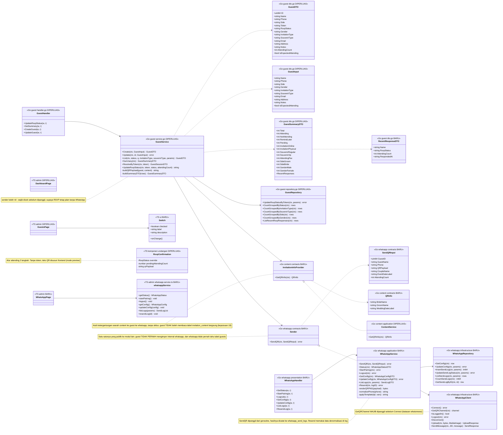
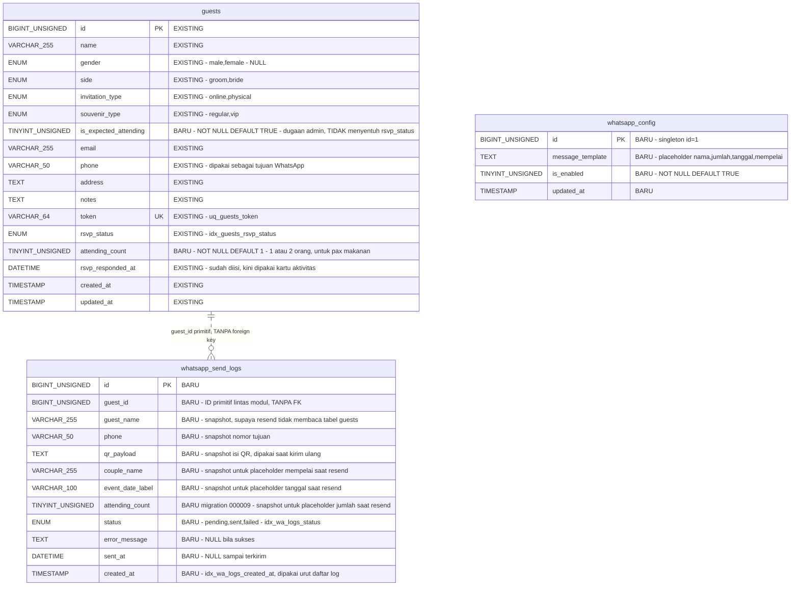
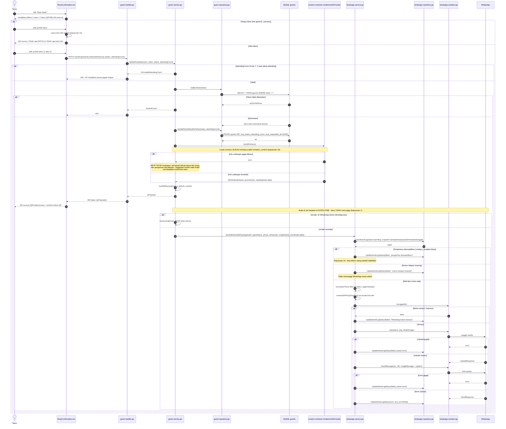
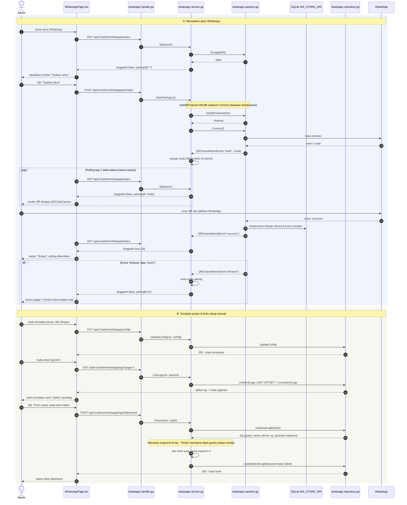

# PLAN — Dashboard Kartu, Label Perkiraan Hadir, RSVP 1/2 Tamu + Kirim QR via WhatsApp

## 0. Requirement yang Disepakati

**Permintaan user (verbatim):**

> "pada dashboard harusnya menyajikan informasi seperti layaknya dashboard
> dengan card card. kemudian dalam tambah tamu tambahkan juga datang/tidak
> datang (tipe inputan on off), itu untuk labeling yang 'saya tau dia tidak
> akan datang makanya nanti inputannya akan off'
>
> kemudian pada rsvp ketika user memilih akan datang maka sistem selain
> menampilkan qrcode juga mengirim qrcode tersebut secara otomatis ke wa tamu
> tersebut dengan menggunakan Whatsapp dari library
> https://github.com/tulir/whatsmeow
> dalam RSVP tamu yang akan datang ada opsi 1 guest atau 2 guest (karena 1
> undangan yang datang memungkinkan berpasangan).
>
> akun whatsapp yang digunakan untuk mengirim pesan di configurasi melalui
> menu baru dalam halaman admin."

**Klasifikasi intent: New capability (dominan), dengan 2 enhancement.**

- **New capability** — integrasi WhatsApp (whatsmeow) + menu admin WhatsApp
  baru + pengiriman QR otomatis. Tidak ada apa pun soal WhatsApp di codebase
  ini (`go.mod` hanya punya 4 dependency langsung: mysql driver, jwt,
  godotenv, x/crypto).
- **Enhancement** — halaman Ringkasan (sudah ada, ditambah kartu) dan form
  tambah tamu (sudah ada, ditambah 1 toggle).

**Requirement final (locked):**

1. Halaman Ringkasan disusun ulang jadi dashboard berbasis kartu: baris KPI,
   kartu breakdown, dan kartu aktivitas RSVP terbaru.
2. Form tambah/ubah tamu punya toggle on/off "diperkirakan hadir" — murni
   label dugaan admin, **tidak** menyentuh `rsvp_status` milik tamu.
3. Alur RSVP tamu jadi 2 langkah: klik **Akan Hadir** → muncul pilihan
   **1 tamu / 2 tamu** → setelah dipilih, barulah QR muncul **dan** QR
   otomatis dikirim ke WhatsApp tamu. Jumlah tamu tercatat untuk kebutuhan
   **pax makanan**.
4. Menu **WhatsApp** baru di admin: pairing akun via scan QR, status koneksi,
   edit template pesan, dan kirim ulang manual bila pengiriman gagal.

## 1. Keputusan yang Dikunci (Locked Decisions)

### 1.1 Dari user — Step 0 (apa yang diminta)

| # | Pertanyaan | Jawaban user |
|---|---|---|
| 1 | Hubungan toggle admin dengan `rsvp_status` | **Kolom terpisah, tidak menyentuh `rsvp_status`.** Tamu tetap bebas menjawab; jawaban tamu tidak tertimpa dugaan admin. |
| 2 | Alur & pencatatan opsi 1/2 tamu | **Jawaban bebas user (verbatim):** *"ketika tamu melakukan konfirmasi kehadiran dengan klik 'Hadir', maka muncul opsi 1 tamu atau 2 tamu, setelah dipilih baru muncul QRcode dan otomatis mengirim QRcode, dan data tersebut tercatat untuk kebutuhan pax makanan tamu"* |
| 3 | Isi dashboard | **KPI atas + kartu breakdown + kartu aktivitas RSVP terbaru.** Preview yang disetujui menampilkan KPI "Akan hadir **42/61 und/org**" — jadi jumlah undangan **dan** jumlah orang dua-duanya tampil. |
| 4 | Cakupan menu WhatsApp | **Pairing + status koneksi + template pesan + kirim ulang manual.** |

### 1.2 Dari user — Step 4 (bagaimana wujudnya)

| # | Pertanyaan | Jawaban user |
|---|---|---|
| 5 | Storage sesi WhatsApp | **File SQLite di folder persisten terpisah** (`WA_STORE_DIR`), driver Go murni tanpa CGO. MySQL project tidak disentuh. |
| 6 | Sumber isi QR | **Backend jadi sumber teks QR; dua-duanya render.** Backend menyusun teks & merender PNG untuk WA; frontend tetap merender `QRCodeCanvas` yang sudah ada. |
| 7 | Waktu kirim WA | **Latar belakang** — RSVP disimpan & dibalas seketika, pengiriman WA jalan di goroutine, hasilnya dicatat di log kirim. |
| 8 | Penyambungan lintas modul | **Modul `whatsapp` mengekspos `contracts.Sender`, di-inject ke service `guest`** lewat `main.go`. Relasi ke tamu disimpan sebagai `guest_id` primitif tanpa FK. |

### 1.3 Keputusan analis (berdasarkan trace, bukan asumsi)

| # | Keputusan | Dasar (terverifikasi sesi ini) |
|---|---|---|
| 19 | Modul `content` mengekspos `contracts.InvitationInfoProvider`; `SendQRInput` membawa `CoupleName` & `EventDateLabel` | **Ditemukan saat validasi plan ini, bukan saat trace.** Isi QR (dan template `{mempelai}`/`{tanggal}`) butuh nama mempelai & tanggal acara — data itu ada di `invitation_content`, **tabel milik modul `content`**. Modul `guest` membacanya langsung = pelanggaran telak `.claude/rules/backend-modular-monolith.md`. Maka `content` mengekspos contract (pola yang sama dengan keputusan #8), dan `guest` meneruskan hasilnya ke `whatsapp` lewat `SendQRInput` — sehingga modul `whatsapp` **tidak perlu** ikut bergantung pada `content`. Satu-satunya konsumen contract itu adalah `guest`. |
| 20 | `whatsapp_config.is_enabled` dicek di awal `SendQR` | Kolom ini harus punya arti, bukan sekadar ada di skema: admin perlu bisa menghentikan sementara pengiriman otomatis **tanpa** memutus tautan akun (mis. saat menguji, atau saat tidak ingin mengganggu tamu). Bila `false`, log dicatat `failed` dengan alasan "pengiriman dinonaktifkan" supaya tetap bisa dikirim ulang setelah diaktifkan. |
| 9 | `attending_count TINYINT UNSIGNED NOT NULL DEFAULT 1` | Baris tamu yang **sudah** berstatus `attending` sebelum fitur ini ada tidak punya jumlah tamu. Default `1` adalah asumsi yang benar (mereka konfirmasi untuk dirinya sendiri), sehingga `SUM(attending_count)` langsung sahih tanpa `COALESCE` per baris. Kolom NULL akan membuat SUM diam-diam kurang hitung untuk baris lama. |
| 10 | `is_expected_attending BOOLEAN NOT NULL DEFAULT TRUE` | Konsekuensi keputusan #1. Default TRUE = "belum ada alasan menduga dia tidak datang", sehingga baris lama tidak berubah maknanya. |
| 11 | Admin **tidak** mengisi `attending_count` lewat form tamu | Jawaban #2 menempatkan pilihan 1/2 tamu pada tamu saat RSVP, bukan admin. `UpdateGuest` (`queries/guests.sql:11-13`) menyebut kolom yang di-SET satu per satu, jadi `attending_count` **otomatis aman** tidak tertimpa saat admin menyunting tamu. Programmer **tidak boleh** menambahkannya ke `UpdateGuest`. |
| 12 | Payload QR & log kirim disimpan **denormalisasi** di `whatsapp_send_logs` (`guest_name`, `phone`, `qr_payload`) | Supaya "kirim ulang" bisa dijalankan modul `whatsapp` sendiri **tanpa** membaca tabel `guests` milik modul lain — mematuhi larangan cross-module read di `.claude/rules/backend-modular-monolith.md`. Tanpa ini, resend memaksa pelanggaran batas modul. |
| 13 | QR pairing WhatsApp dirender di **frontend** dari string kode | `qrcode.react` **sudah** jadi dependency `apps/web` (dipakai `RsvpConfirmation.tsx:2`) dan bisa diimpor bundle admin juga. Backend cukup mengembalikan string kode dari `GetQRChannel`; tidak perlu library QR kedua di sisi admin. |
| 14 | Status pairing dibaca lewat **polling** `GET /whatsapp/status` tiap ~2 detik saat halaman pairing terbuka, bukan SSE/websocket | Mekanisme paling sederhana yang memenuhi kebutuhan. SSE/websocket menambah jenis transport baru yang belum pernah dipakai project ini (seluruh komunikasi lewat Axios/`httpClient`), untuk layar yang hanya dibuka sesekali saat menautkan akun. |
| 15 | Mode preview tanpa token **tetap** memakai teks QR bikinan frontend | `RsvpConfirmation.tsx:34` sengaja tidak mem-PATCH saat `session.token` kosong (link generik = preview). Kalau isi QR sepenuhnya dipindah ke backend tanpa fallback, link tanpa token akan menampilkan QR kosong — regresi perilaku yang sudah dikunci plan sebelumnya. |
| 16 | `SUM(attending_count)` digabung ke query `CountGuestsGroupedByStatus` yang **sudah ada**, bukan query baru | Satu scan menghasilkan jumlah undangan **dan** jumlah orang sekaligus. Menambah query terpisah berarti dua scan untuk data dari baris yang sama. |
| 17 | Endpoint publik RSVP mengembalikan `qrPayload`, **tidak** mengembalikan nomor telepon | `GuestSessionDTO` (`dto.go`) sengaja tidak menyertakan `phone` (keputusan #14 plan sebelumnya). `qrPayload` hanya berisi nama tamu + info acara + jumlah tamu — semuanya sudah diketahui pemegang token itu, jadi tidak ada kebocoran baru. Nomor telepon hanya dipakai backend. |
| 18 | Goroutine pengiriman WA tidak dibatasi worker pool | Lihat §8. Pada volume nyata (≤1000 tamu, RSVP menyebar berhari-hari) jumlah goroutine bersamaan sangat kecil. Worker pool/queue adalah mekanisme yang harus dibayar requirement, dan requirement tidak memintanya. |

## 2. Kelayakan Teknis yang Diverifikasi Lebih Dulu

Tiga fakta ini diverifikasi **dari source library**, bukan dari ingatan,
karena kalau salah seluruh desain runtuh. (Catatan: Context7 MCP butuh
otorisasi dan tidak tersedia di sesi ini, jadi verifikasi dilakukan langsung
terhadap file source di repository whatsmeow.)

| Fakta | Bukti |
|---|---|
| **whatsmeow tidak mendukung MySQL** | `store/sqlstore/container.go` menyatakan eksplisit *"Only SQLite and Postgres are currently fully supported"* pada dokumentasi `New()` **dan** `NewWithDB()`. Ada cek khusus `c.db.Dialect == dbutil.SQLite`, tidak ada padanannya untuk MySQL. **Inilah alasan sesi WA tidak bisa menumpang DB project.** |
| **Signature yang akan dipakai** | `sqlstore.New(ctx context.Context, dialect, address string, log waLog.Logger) (*Container, error)`; `(*Container).GetFirstDevice(ctx) (*store.Device, error)`; `(*Container).Upgrade(ctx) error`; `whatsmeow.NewClient(deviceStore *store.Device, log waLog.Logger) *Client`; `(*Client).GetQRChannel(ctx) (<-chan QRChannelItem, error)`; `(*Client).Connect() error`; `(*Client).IsLoggedIn() bool`; `(*Client).Logout(ctx) error`; `(*Client).Disconnect()`; `(*Client).SendMessage(ctx, to types.JID, message *waE2E.Message, extra ...SendRequestExtra) (SendResponse, error)`; `(*Client).Upload(ctx, plaintext []byte, appInfo MediaType) (UploadResponse, error)` dengan field `URL, DirectPath, MediaKey, FileEncSHA256, FileSHA256, FileLength`. Module path: `go.mau.fi/whatsmeow`. |
| **`GetQRChannel` harus dipanggil SEBELUM `Connect()`** | Didokumentasikan di `qrchan.go`. Channel memancarkan item dengan `Event` bernilai `"code"` (ada `Code` baru), `"success"`, `"timeout"`, `"error"`. **Urutan ini mengikat alur pairing di §6.4** — kalau dibalik, pairing tidak akan pernah menghasilkan QR. |

**Risiko yang belum bisa ditutup dari dokumentasi dan WAJIB diverifikasi
saat implementasi (task A5):** pasangan nama driver ↔ string `dialect`.
whatsmeow memanggil `sqlstore.New(ctx, dialect, address, log)` dengan dialect
`"sqlite3"`, sementara driver Go murni `modernc.org/sqlite` mendaftarkan
dirinya dengan nama `"sqlite"`. Kalau keduanya tidak cocok, `sqlstore.New`
gagal saat boot. Task A5 mengharuskan programmer membuktikan kombinasi ini
jalan lebih dulu — sebelum menulis modul apa pun di atasnya.

## 3. Trace — Kondisi Nyata Kode

### 3.1 Stack & entry point (Step 1) — dikonfirmasi ada

Go 1.25 modular monolith (`go.mod`), MySQL + sqlc + golang-migrate; frontend
Vite 2 entry HTML (React 18 undangan, React admin). Tiga entry point yang
disentuh, semuanya terkonfirmasi ada:

| Alur | Entry point | Bukti |
|---|---|---|
| RSVP tamu | `RsvpConfirmation.tsx` → `PATCH /api/v1/public/guests/by-token/{token}/rsvp` | `router.go:45`, handler `UpdateRsvpStatus` |
| Ringkasan admin | `DashboardPage.tsx` → `GET /api/v1/admin/guests/summary` | `router.go:87` |
| Form tamu admin | `GuestsPage.tsx` → `POST/PUT /api/v1/admin/guests` | `router.go:89-90` |
| Menu WhatsApp | **belum ada** — ini yang dibuat | `route-paths.ts` hanya punya 6 key; `NAV_ITEMS` hanya 5 item |

### 3.2 Rantai layer RSVP (terbaca hop demi hop)

```
RsvpConfirmation.tsx:42-45  handleAttend -> setOverride('attending')
  -> :32-40  persist(status) - HANYA jika session.token ada (:34)
  -> httpClient.patch(/api/v1/public/guests/by-token/<token>/rsvp, {status})
  -> router.go:45
  -> handler.go UpdateRsvpStatus - decode {Status string}, balas response.OK(..., nil)
  -> service.go UpdateRsvpStatus - tolak status invalid & 'pending', GetByToken, lalu
     repo.UpdateRsvpStatusByToken
  -> queries/guests.sql:15-17  UPDATE guests SET rsvp_status=?, rsvp_responded_at=NOW()
```

Tiga hal penting dari rantai ini:

- **QR tidak pernah menyentuh backend.** `RsvpConfirmation.tsx:74-79`
  menyusun `qrValue` di browser dari `content.brideName`/`groomName`/
  `weddingDateLabel` + `session.name`, lalu `QRCodeCanvas` (`:113-119`)
  merendernya dan `handleDownloadQr` (`:61-70`) mengunduh dari canvas.
- **Respons RSVP saat ini kosong** (`response.OK(w, "...", nil)`) — jadi
  mengembalikan `qrPayload` adalah perluasan kontrak, bukan perubahan bentuk
  yang merusak.
- **`rsvp_responded_at` sudah diisi** setiap kali status berubah
  (`queries/guests.sql:16`) tapi **belum pernah ditampilkan di UI mana pun** —
  inilah yang membuat kartu "Aktivitas RSVP terbaru" gratis secara data.

### 3.3 Konvensi modul (Step 2) — dan celah yang ditemukan

Modul dirangkai sangat sederhana: `guest.New(db)` mengembalikan
`*presentation.Handler` (`guest.module.go`), dirakit di `main.go` lalu
diserahkan ke `router.New(router.Deps{...})`. **Tidak ada layer app service,
tidak ada event bus, dan tidak ada satu pun panggilan lintas modul saat ini.**

`auth/contracts/` dan `auth/domain/events/` **ada sebagai folder tapi
kosong** — diverifikasi: `find apps/api -type d -name contracts` menemukan 1
folder, dan `cat contracts/*.go` gagal karena tidak ada file di dalamnya.
Struktur lintas-modul sudah dicadangkan tapi belum pernah dipakai. Keputusan
#8 mengisi struktur itu untuk pertama kalinya — mengikuti pola yang sudah
dikunci aturan, bukan menciptakan pola baru.

### 3.4 Kondisi halaman Ringkasan sekarang

`DashboardPage.tsx` sudah punya: 4 kartu RSVP (`dl`/`dt`/`dd`), bar proporsi
kehadiran, dan 2 panel logistik (jenis undangan, jenis souvenir). Yang belum
ada dan diminta requirement: baris KPI ringkas, breakdown **pihak** &
**gender**, dan kartu **aktivitas RSVP terbaru**.

Backend-nya (`Summary` di `service.go`) menjalankan 3 query GROUP BY
(status, invitation_type, souvenir_type) lalu `buildSummaryDTO`
menggabungkannya, dengan catatan tegas bahwa `Total` **hanya** diakumulasi
dari loop status supaya tidak terhitung berlipat.

### 3.5 Komponen UI yang tersedia — dan yang tidak

`ui/index.ts` mengekspor: Button, Input, Textarea, Select, **Checkbox**,
Badge, Card/CardHeader/CardBody, Table set, Modal, Pagination. Ditambah
`layout/PageHeader`, `layout/StickyActionBar`, dan
`feedback/{EmptyState,ErrorState,Skeleton}`.

**Tidak ada komponen Switch/Toggle.** `Checkbox.tsx` adalah
`<input type="checkbox">` biasa dengan label. Requirement menyebut "tipe
inputan on off" — itu switch, bukan checkbox. Ini celah nyata yang
membenarkan komponen baru (task B1).

## 4. Sumber Data (Step 3) — verdict: **Enhance + Add**

| Tabel | Verdict | Alasan |
|---|---|---|
| `guests` (modul guest) | **Enhance** — +2 kolom | `attending_count` & `is_expected_attending` tidak ada di `Guest` struct hasil sqlc (diverifikasi: ID, Name, Phone, Side, Token, RsvpStatus, RsvpRespondedAt, CreatedAt, UpdatedAt, Gender, InvitationType, SouvenirType, Email, Address, Notes). Kolom lain (`phone` untuk target WA, `rsvp_responded_at` untuk kartu aktivitas) **sudah ada dan dipakai apa adanya**. |
| `whatsapp_config` (modul whatsapp) | **Add** — tabel baru | Template pesan harus bisa diedit admin (jawaban #4). Tidak boleh menumpang `invitation_content` karena tabel itu milik modul `content` — melanggar kepemilikan tabel per modul. |
| `whatsapp_send_logs` (modul whatsapp) | **Add** — tabel baru | Kirim ulang manual (jawaban #4) mustahil tanpa catatan pengiriman. Relasi ke tamu lewat `guest_id` primitif tanpa FK, sesuai aturan. |
| Sesi whatsmeow | **Add di luar MySQL** — file SQLite | Bukan pilihan desain, melainkan batasan library (§2). Skemanya dibuat & di-migrate oleh whatsmeow sendiri lewat `Container.Upgrade(ctx)`, bukan oleh golang-migrate. |

Tidak ada FK lintas tabel/modul, konsisten `knowledge/DATABASE.md`.

## 5. Scope (Step 5)

### 5.1 In scope

**Backend — modul `guest`:**

| File | Perubahan |
|---|---|
| `migrations/000007_add_guest_attendance_fields.{up,down}.sql` | **baru** — 2 kolom |
| `guest/infrastructure/queries/guests.sql` | `CreateGuest`/`UpdateGuest` +`is_expected_attending`; `UpdateGuestRsvpStatusByToken` +`attending_count`; `CountGuestsGroupedByStatus` +`SUM`; +`CountGuestsGroupedBySide`; +`CountGuestsGroupedByGender`; +`ListRecentRsvpResponses` |
| `guest/infrastructure/repository.go` | +3 method |
| `guest/application/dto.go` | `GuestDTO`/`GuestInput` +2 field; `GuestSummaryDTO` +KPI/breakdown/aktivitas |
| `guest/application/service.go` | simpan 2 kolom baru, validasi `attendingCount`, susun `qrPayload`, panggil `Sender` di goroutine, perluas `Summary`/`buildSummaryDTO` |
| `guest/presentation/handler.go` | `UpdateRsvpStatus` baca `attendingCount`, balas `qrPayload` |
| `guest/guest.module.go` | `New(db, sender, invitationInfo)` |

**Backend — modul `content` (perubahan minimal, tanpa tabel baru):**

| File | Perubahan |
|---|---|
| `content/contracts/invitation.go` | **baru** — `InvitationInfoProvider` + `QRInfo` (keputusan #19) |
| `content/application/service.go` | +`GetQRInfo(ctx)` di atas singleton yang sudah dibacanya |
| `content/content.module.go` | kembalikan provider selain handler |

**Backend — modul `whatsapp` (BARU, seluruh folder):**

| File | Isi |
|---|---|
| `migrations/000008_create_whatsapp_tables.{up,down}.sql` | `whatsapp_config`, `whatsapp_send_logs` |
| `whatsapp/contracts/sender.go` | interface `Sender` — satu-satunya yang publik ke modul lain |
| `whatsapp/infrastructure/queries/whatsapp.sql` + `sqlc/` | query config & log |
| `whatsapp/infrastructure/repository.go` | akses `whatsapp_config` & `whatsapp_send_logs` |
| `whatsapp/infrastructure/waclient.go` | pembungkus whatsmeow: connect, QR channel, kirim gambar |
| `whatsapp/application/service.go` + `dto.go` | config, pairing, kirim, kirim ulang, render PNG QR |
| `whatsapp/presentation/handler.go` | endpoint admin |
| `whatsapp/whatsapp.module.go` | perakitan modul |
| `sqlc.yaml` | entry ke-4 |
| `cmd/server/main.go`, `internal/router/router.go`, `internal/config/config.go` | wiring + `WA_STORE_DIR` |

**Frontend:**

| File | Perubahan |
|---|---|
| `shared/components/ui/Switch.tsx` + `ui/index.ts` | **baru** — toggle on/off |
| `shared/constants/guests.ts` | label perkiraan hadir |
| `modules/admin/guests/services/guests.service.ts` | +2 field, +field summary baru |
| `modules/admin/guests/schemas/guest.schema.ts` | +`isExpectedAttending` |
| `modules/admin/whatsapp/services/whatsapp.service.ts` | **baru** |
| `modules/admin/whatsapp/pages/WhatsAppPage.tsx` | **baru** |
| `app/routes/route-paths.ts`, `modules/admin/shared/AdminLayout.tsx`, `modules/admin/app/AdminApp.tsx` | menu & rute ke-6 |
| `modules/admin/guests/pages/GuestsPage.tsx` | toggle di form, badge di tabel, jumlah tamu di detail |
| `modules/admin/dashboard/pages/DashboardPage.tsx` | KPI + breakdown + aktivitas |
| `components/RsvpConfirmation/RsvpConfirmation.tsx`, `types/api.ts` | alur 2 langkah + `qrPayload` |

**Dokumentasi:** `knowledge/{API,DATABASE,MODULE_MAP,ARCHITECTURE,DEPLOYMENT}.md`.

### 5.2 Out of scope (keputusan, bukan kelalaian)

| Tidak dikerjakan | Alasan |
|---|---|
| **Sidebar didesain ulang** | Hanya **ditambah 1 item menu** sesuai permintaan; struktur & gaya sidebar tidak diubah (Anda sudah menyatakan sidebar sudah bagus). |
| **Kartu dashboard untuk `is_expected_attending`** | Preview dashboard yang Anda setujui berisi KPI + 4 breakdown (pihak, gender, jenis undangan, souvenir) + aktivitas. Menambah kartu ke-5 di luar yang disetujui. Datanya tetap tersedia bila nanti diminta. |
| **Filter `is_expected_attending` di tabel tamu** | Tidak diminta; toggle diminta untuk *labeling*. Ditampilkan sebagai badge & di panel detail. |
| **Admin mengisi `attending_count`** | Keputusan #11 — pilihan 1/2 tamu milik tamu saat RSVP. |
| **Balasan pesan WA masuk / chatbot** | Requirement hanya mengirim QR satu arah. |
| **Antrian + retry otomatis** | Keputusan #7 — kirim ulang dilakukan manual oleh admin. |
| **Grafik tren harian RSVP** | Anda memilih opsi tanpa grafik; menghindari dependency chart baru. |
| **Broadcast WA massal ke semua tamu** | Tidak diminta. Pengiriman hanya dipicu RSVP + kirim ulang per tamu. |
| **Mengubah `invitation_content`** | Template WA milik modul `whatsapp`, bukan modul `content`. |

### 5.3 Reuse inventory (dibaca, bukan ditebak dari nama)

**Dipakai apa adanya:**

| Aset | Lokasi | Untuk |
|---|---|---|
| `qrcode.react` (`QRCodeCanvas`) | `RsvpConfirmation.tsx:2`, `apps/web/package.json` | render QR tamu **dan** QR pairing WA (keputusan #13) |
| `guests.phone` | kolom existing | nomor tujuan WA |
| `guests.rsvp_responded_at` | `queries/guests.sql:16` | kartu aktivitas RSVP terbaru |
| Pola `CountGuestsGroupedByStatus` | `queries/guests.sql` | dicontek untuk side & gender |
| `escapeLike`, `pagination.Parse/Meta`, `response.*`, `authmw` | `internal/shared/*`, `guest/application/service.go` | dipakai ulang tanpa perubahan |
| `PageHeader`, `StickyActionBar` | `shared/components/layout/` | header & tombol simpan halaman WhatsApp |
| `Card/CardHeader/CardBody`, `Badge` (status+tone), `Table` set, `Button`, `Input`, `Textarea`, `Modal`, `Pagination` | `ui/index.ts` | kartu dashboard, tabel log WA, form template |
| `EmptyState`, `ErrorState`, `Skeleton`/`TableSkeleton`, `useToast` | `shared/components/feedback/`, `toast/` | state halaman WhatsApp & dashboard |
| Pola `.catch` → `setError` → `<ErrorState onRetry>` | `GuestsPage.tsx`, `DashboardPage.tsx` | halaman WhatsApp mengikuti pola ini |
| `httpClient` (header Authorization otomatis untuk `/api/v1/admin/*`) | `shared/services/http-client.ts` | service WhatsApp |
| `sqlc` + `golang-migrate` + `npm run migrate:up`/`sqlc:generate` | toolchain existing | migration & query modul baru |

**Diperluas:**

| Aset | Perluasan |
|---|---|
| `CountGuestsGroupedByStatus` | +`SUM(attending_count)` (keputusan #16) |
| `buildSummaryDTO` | +breakdown & KPI, **`Total` tetap hanya dari loop status** |
| `UpdateGuestRsvpStatusByToken` | +`attending_count` |
| `guest.New(db)` | jadi `guest.New(db, sender)` |
| `RsvpConfirmation` | jalur `attending` jadi 2 langkah |

**Dibuat baru — beserta bukti celahnya:**

| Baru | Bukti celah |
|---|---|
| `Switch` | Tidak ada di `ui/index.ts`; `Checkbox.tsx` adalah checkbox biasa (§3.5) |
| Modul `whatsapp` | Tidak ada modul/tabel/dependency WhatsApp apa pun (`go.mod` 4 dependency) |
| `contracts/sender.go` | `auth/contracts/` kosong — belum ada satu pun contract nyata (§3.3) |
| Migration 000007 & 000008 | 2 kolom & 2 tabel tidak ada di skema mana pun (§4) |
| `ListRecentRsvpResponses` | Tidak ada query yang mengurutkan berdasar `rsvp_responded_at` |

## 6. Desain per Layer

### 6.1 Migration 000007 — kolom tamu

```sql
-- up
ALTER TABLE guests
  ADD COLUMN attending_count TINYINT UNSIGNED NOT NULL DEFAULT 1 AFTER rsvp_status,
  ADD COLUMN is_expected_attending BOOLEAN NOT NULL DEFAULT TRUE AFTER souvenir_type;

-- down
ALTER TABLE guests
  DROP COLUMN is_expected_attending,
  DROP COLUMN attending_count;
```

### 6.2 Migration 000008 — tabel modul whatsapp

`whatsapp_config` singleton (`id=1`) berisi `message_template`,
`is_enabled`, `updated_at`.

`whatsapp_send_logs` berisi `guest_id` (primitif, **tanpa FK**),
`guest_name`, `phone`, `qr_payload`, **`couple_name`**, **`event_date_label`**,
**`attending_count`** (migration 000009 — koreksi ditemukan saat implementasi,
lihat catatan di bawah), `status` ENUM(`pending`,`sent`,`failed`),
`error_message`, `sent_at`, `created_at`, dengan `KEY idx_wa_logs_status
(status)` dan `KEY idx_wa_logs_created_at (created_at)` — dua kolom itulah
yang dipakai memfilter & mengurutkan daftar log.

Enam kolom snapshot (`guest_name`, `phone`, `qr_payload`, `couple_name`,
`event_date_label`, `attending_count`) adalah **syarat** agar `Resend` bisa
menyusun ulang pesan tanpa membaca tabel `guests` maupun `invitation_content`
milik modul lain (keputusan #12 & #19). Kalau salah satunya tidak disimpan,
kirim ulang terpaksa melanggar batas modul.

> **Koreksi ditemukan saat implementasi (migration 000009):** draft awal
> `SendQRInput` (§6.3) dan `whatsapp_send_logs` (migration 000008) tidak
> menyimpan jumlah tamu, padahal placeholder template `{jumlah}` dan
> `Resend` membutuhkannya untuk menyusun ulang caption yang identik.
> Ditambahkan `AttendingCount int` ke `SendQRInput` dan kolom
> `attending_count TINYINT UNSIGNED NOT NULL DEFAULT 1` ke
> `whatsapp_send_logs` lewat migration terpisah, tanpa mengubah migration
> 000008 yang sudah diterapkan.

Template mendukung placeholder: `{nama}`, `{jumlah}`, `{tanggal}`,
`{mempelai}`. Substitusi dilakukan service saat mengirim.

### 6.3 Kontrak lintas modul

Ada **dua** contract, dan arah ketergantungannya searah:
`content → guest → whatsapp`. Tidak ada siklus.

```go
// content/contracts/invitation.go — dikonsumsi HANYA oleh modul guest
type QRInfo struct {
    BrideName        string
    GroomName        string
    WeddingDateLabel string
}
type InvitationInfoProvider interface {
    GetQRInfo(ctx context.Context) (QRInfo, error)
}

// whatsapp/contracts/sender.go — dikonsumsi HANYA oleh modul guest
type SendQRInput struct {
    GuestID        uint64
    GuestName      string
    Phone          string
    QRPayload      string
    CoupleName     string // untuk placeholder {mempelai}
    EventDateLabel string // untuk placeholder {tanggal}
    AttendingCount int    // untuk placeholder {jumlah} - migration 000009
}
type Sender interface {
    SendQR(ctx context.Context, in SendQRInput) error
}
```

`CoupleName`/`EventDateLabel` ikut dikirim (keputusan #19) supaya modul
`whatsapp` bisa mengisi template tanpa perlu tahu modul `content` sama
sekali.

`guest/application.Service` menyimpan `sender contracts.Sender` **dan**
`invitationInfo contracts.InvitationInfoProvider`. `sender` boleh `nil`
(deployment tanpa WhatsApp) — service **wajib** mengecek nil sebelum
memanggil, supaya RSVP tidak panic.

### 6.4 Alur pairing WhatsApp (urutan mengikat)

`GetQRChannel(ctx)` **harus** dipanggil sebelum `Connect()` (§2). Service
menjalankan goroutine pairing yang membaca channel dan menyimpan kode QR
terakhir di memori; handler `GET /whatsapp/status` mengembalikannya, halaman
admin polling tiap 2 detik dan merender kodenya dengan `QRCodeCanvas`.
Event `"success"` → tersimpan otomatis oleh whatsmeow ke SQLite; `"timeout"`/
`"error"` → state pairing di-reset dan pesannya ditampilkan.

### 6.5 Payload QR — satu sumber, dua renderer

Backend menyusun string (keputusan #6):

```
Wedding Invitation - <brideName> & <groomName>
Nama Tamu: <name>
Status: Akan Hadir
Jumlah Tamu: <attending_count>
Tanggal: <weddingDateLabel>
```

Nama mempelai & tanggal acara **tidak** dibaca langsung dari tabel
`invitation_content` — `guest` memperolehnya lewat
`content/contracts.InvitationInfoProvider.GetQRInfo(ctx)` (keputusan #19).

Dikembalikan sebagai `qrPayload` di respons PATCH RSVP; frontend
merendernya dengan `QRCodeCanvas` yang sudah ada. Backend merender PNG-nya
sendiri lewat `qrcode.Encode(payload, qrcode.Medium, 512)` untuk dikirim ke
WA. **Fallback (keputusan #15):** bila `session.token` kosong, frontend tetap
menyusun teks QR sendiri seperti sekarang — mode preview tanpa persist.

> **Batas modul:** `guest` yang menyusun `qrPayload` (nama tamu dari tabelnya
> sendiri + info acara lewat contract `content`), lalu meneruskannya ke
> `whatsapp` sebagai string lewat `SendQRInput`. Modul `whatsapp` tidak
> pernah tahu ada tabel `guests` maupun `invitation_content`; modul `content`
> tidak tahu ada WhatsApp.

## 7. Task List

Berurutan. Dua jendela "merah" yang disengaja, supaya programmer tidak
mengira ada yang salah:

- **Go tidak compile antara A7 dan A13.** A7 mengubah signature
  `content.New(...)` dan A12 mengubah `guest.New(...)`, sementara `main.go`
  baru dirapikan di A13. Ini normal — kerjakan A7→A13 sebagai satu blok
  sebelum menjalankan `go build`.
- **Frontend tidak hijau antara C1 dan E1**, karena tipe `Guest`/
  `GuestSummary` dan alur RSVP berubah sebelum test-nya disesuaikan.

### A. Backend

- [ ] **A1** Buat `migrations/000007_add_guest_attendance_fields.{up,down}.sql` (§6.1). Jalankan `npm run migrate:up`.
- [ ] **A2** Buat `migrations/000008_create_whatsapp_tables.{up,down}.sql` (§6.2) + seed 1 baris `whatsapp_config` (`id=1`) dengan template default. Jalankan `npm run migrate:up`.
- [ ] **A3** `guest/infrastructure/queries/guests.sql`: `CreateGuest`/`UpdateGuest` +`is_expected_attending` (**JANGAN** tambahkan `attending_count` ke `UpdateGuest` — keputusan #11); `UpdateGuestRsvpStatusByToken` +`attending_count`; `CountGuestsGroupedByStatus` +`SUM(attending_count) AS total_pax`; query baru `CountGuestsGroupedBySide`, `CountGuestsGroupedByGender`, `ListRecentRsvpResponses` (`WHERE rsvp_responded_at IS NOT NULL ORDER BY rsvp_responded_at DESC LIMIT 5`).
- [ ] **A4** Buat `whatsapp/infrastructure/queries/whatsapp.sql` (get/update config; insert/list/get/update-status send log — list dengan `LIMIT ? OFFSET ?`) dan tambahkan entry ke-4 di `sqlc.yaml`.
- [ ] **A5** **Gate kelayakan.** `go get go.mau.fi/whatsmeow github.com/skip2/go-qrcode modernc.org/sqlite`, lalu buktikan dengan program kecil bahwa `sqlstore.New(ctx, <dialect>, <dsn file>, log)` + `Container.Upgrade(ctx)` **benar-benar berhasil** dengan driver `modernc.org/sqlite` (lihat risiko dialect di §2). Bila kombinasi ini gagal, **berhenti dan lapor sebelum A8** — A6 (sqlc) dan A7 (contracts) tetap boleh dikerjakan karena tidak bergantung pada whatsmeow, begitu pula seluruh bagian dashboard/toggle/1-2 tamu (A1, A3, A12, D1, D2). Yang terblokir hanyalah modul WhatsApp (A8–A11) dan halamannya (C3, D3, D4).
- [ ] **A6** Jalankan `npm run sqlc:generate`. Jangan edit folder `sqlc/` manual.
- [ ] **A7** Dua contract sesuai §6.3: `whatsapp/contracts/sender.go` (`Sender`, `SendQRInput` — termasuk `CoupleName` & `EventDateLabel`) dan `content/contracts/invitation.go` (`InvitationInfoProvider`, `QRInfo`). Implementasikan `GetQRInfo` sebagai method baru pada `*Service` di `content/application/service.go` — memakai ulang `GetContent(ctx)` (`service.go:96`) yang **sudah** membaca singleton itu, bukan query baru. Ubah `content.New(db, uploadsDir)` (`content.module.go`) agar mengembalikan provider selain `*presentation.Handler`. **Jangan** biarkan modul `guest` menyentuh tabel `invitation_content`.
- [ ] **A8** `whatsapp/infrastructure/repository.go` (config + send logs) dan `whatsapp/infrastructure/waclient.go` (bungkus `NewClient`/`GetQRChannel`/`Connect`/`IsLoggedIn`/`Logout`/`Disconnect`/`Upload`/`SendMessage` — signature §2).
- [ ] **A9** `whatsapp/application/{service,dto}.go`: baca/tulis config; goroutine pairing (§6.4); `SendQR` = cek `config.is_enabled` lebih dulu (keputusan #20 — bila `false`, catat log `failed` beralasan "pengiriman dinonaktifkan" dan **berhenti**) → `renderQRPNG` (`qrcode.Encode`) → `Upload(ctx, png, whatsmeow.MediaImage)` → `SendMessage` dengan `waE2E.ImageMessage` (caption dari `applyTemplate`) → catat hasil ke `whatsapp_send_logs`; `Resend(logID)` memakai data denormalisasi di log (keputusan #12) dan menjalankan alur kirim yang sama. `normalizePhone` `08xx`→`628xx`; nomor kosong → log `failed` dengan alasan jelas, **tanpa** memanggil WA.
- [ ] **A10** `whatsapp/presentation/handler.go`: `GET /status`, `POST /pair/start`, `POST /logout`, `GET/PUT /config`, `GET /logs`, `POST /logs/{id}/resend`. Semua di belakang JWT admin.
- [ ] **A11** `whatsapp/whatsapp.module.go` — rakit repo → waclient → service → handler, kembalikan handler **dan** `contracts.Sender`.
- [ ] **A12** Modul `guest`:
  - `dto.go` — +`AttendingCount`, `IsExpectedAttending` di `GuestDTO`/`GuestInput`; `GuestSummaryDTO` +`AttendingPax`, breakdown side/gender, `RecentResponses []RecentResponseDTO`; tipe baru `RecentResponseDTO`.
  - `repository.go` — +`CountGroupedBySide`, `CountGroupedByGender`, `ListRecentRsvpResponses`.
  - `service.go` — simpan 2 kolom baru; error sentinel baru **`ErrInvalidAttendingCount`** untuk `attendingCount` di luar {1,2} saat status `attending`, dan **WAJIB didaftarkan ke cabang `400` pada `StatusHTTPCode`** (kalau terlewat, input salah balas 500 dan test E2-2 gagal); `buildQRPayload` menyusun teks QR dari nama tamu + `invitationInfo.GetQRInfo(ctx)` + jumlah tamu (§6.5); panggil `s.sender.SendQR` di **goroutine** dengan pengecekan `nil`, mengisi `CoupleName`/`EventDateLabel` dari `QRInfo` yang sama; perluas `Summary`/`buildSummaryDTO` (**`Total` tetap hanya dari loop status**).
  - `handler.go` — `UpdateRsvpStatus` baca `attendingCount` dari body, balas `{qrPayload}`.
  - `guest.module.go` — `New(db, sender, invitationInfo)`.
- [ ] **A13** `config.go` +`WAStoreDir` (env `WA_STORE_DIR`, default `./wa-store`); `main.go` rakit modul `content` (ambil provider-nya) dan modul `whatsapp` (ambil sender-nya) **sebelum** `guest.New(db, sender, invitationInfo)`; `router.go` +`WhatsAppHandler` di `Deps` dan daftarkan route admin di belakang JWT.
- [ ] **A14** Perbarui `knowledge/API.md` (endpoint WhatsApp + param/respons RSVP baru), `DATABASE.md` (2 kolom + 2 tabel + catatan sesi WA di SQLite luar MySQL), `MODULE_MAP.md` (modul ke-4 + contract publik pertama), `ARCHITECTURE.md` (modul jadi 4), `DEPLOYMENT.md` (**`WA_STORE_DIR` wajib volume persisten — kalau hilang, WA harus pairing ulang**).

### B. Frontend — komponen bersama

- [ ] **B1** `shared/components/ui/Switch.tsx` — toggle on/off beraksesibilitas (`role="switch"`, `aria-checked`), props `checked`, `onChange`, `label`, `description?`. Ekspor dari `ui/index.ts` (Switch tinggal di `ui/`, jadi **memang** lewat barrel — berbeda dari `layout/` yang diimpor langsung).

### C. Frontend — kontrak & konstanta

- [ ] **C1** `guests.service.ts`: `Guest`/`GuestInput` +`attendingCount`, `isExpectedAttending`; `GuestSummary` +field baru. `types/api.ts`: tipe respons PATCH RSVP (`qrPayload`).
- [ ] **C2** `guest.schema.ts` +`isExpectedAttending: z.boolean()`. `shared/constants/guests.ts` +label perkiraan hadir.
- [ ] **C3** `modules/admin/whatsapp/services/whatsapp.service.ts` — status, pair, logout, config get/update, logs (paginasi), resend.
- [ ] **C4** `route-paths.ts` +`whatsapp: '/whatsapp'`; `AdminLayout.tsx` +1 `NAV_ITEMS` (ikon saja yang ditambah — struktur & gaya sidebar tidak diubah).

### D. Halaman

- [ ] **D1** `GuestsPage.tsx`: `Switch` "Diperkirakan hadir" di form (default on); badge kecil di sel Nama saat off; jumlah tamu ("2 org") di sel Status bila `attending`; `attendingCount` & status perkiraan di modal detail.
- [ ] **D2** `DashboardPage.tsx`: baris KPI (Total tamu, Sudah konfirmasi, Akan hadir `undangan/orang`, Belum jawab) + bar proporsi existing + 4 kartu breakdown (pihak, gender, jenis undangan, souvenir) + kartu Aktivitas RSVP terbaru.
- [ ] **D3** `modules/admin/whatsapp/pages/WhatsAppPage.tsx`: kartu status koneksi + pairing (QR via `QRCodeCanvas`, polling 2 detik **hanya saat belum tertaut**, dihentikan di cleanup effect), kartu template pesan (+`StickyActionBar`), tabel log kirim + tombol "Kirim ulang".
- [ ] **D4** `AdminApp.tsx` +rute `whatsapp` di dalam `ProtectedRoute`/`AdminLayout`.
- [ ] **D5** `RsvpConfirmation.tsx`: state langkah baru — klik "Akan Hadir" → tampilkan pilihan **1 tamu / 2 tamu** (QR belum muncul) → pilih → PATCH `{status:'attending', attendingCount}` → render QR dari `qrPayload` respons; **tanpa token** → langsung ke QR dengan teks bikinan frontend (keputusan #15). Tombol "Ubah pilihan" mengembalikan ke 3 tombol awal.

### E. Test

- [ ] **E1** Perbaiki test yang pasti pecah: `guests.service.test.ts` & `GuestsPage.test.tsx` (`sampleGuest` +2 field baru → TS error tanpa ini; `getGuestSummary` sekarang mengembalikan lebih banyak angka), `DashboardPage.test.tsx` (mock summary +field baru; **pastikan angka mock tidak bentrok antar kartu** — KPI, breakdown, dan aktivitas kini merender banyak angka di satu halaman, gunakan angka unik atau query ber-scope seperti pola `getAllByRole('definition')` yang sudah dipakai), `RsvpConfirmation.test.tsx` (alur `attending` kini 2 langkah — test lama yang mengharapkan QR langsung muncul setelah klik "Akan Hadir" **akan gagal** dan harus menambahkan langkah pilih jumlah tamu).
- [ ] **E2** Test baru:
  1. `buildSummaryDTO` (Go) — `Total` tidak berlipat saat 5 agregasi terisi, dan `AttendingPax` = SUM, bukan COUNT.
  2. `Service.UpdateRsvpStatus` (Go) — `attendingCount` di luar {1,2} saat status `attending` mengembalikan `ErrInvalidAttendingCount`, **dan** `StatusHTTPCode(ErrInvalidAttendingCount)` mengembalikan `400` (bukan 500) — dua assertion, karena inilah yang gagal kalau registrasi di A12 terlewat. Status non-attending mengabaikan `attendingCount`.
  3. `Service.UpdateRsvpStatus` (Go) — `sender == nil` **tidak** membuat RSVP gagal.
  4. `Service.UpdateRsvpStatus` (Go) — `invitationInfo.GetQRInfo` mengembalikan error **tidak** membuat RSVP gagal; status tetap tersimpan dan pengiriman WA dilewati.
  5. `WhatsAppService.SendQR` (Go) — `config.is_enabled == false` → log `failed` beralasan "pengiriman dinonaktifkan" dan client WhatsApp **tidak** dipanggil sama sekali (keputusan #20).
  6. Normalisasi nomor (Go) — `08xx`→`628xx`, `+62`→`62`, nomor kosong → `failed` tanpa memanggil WA.
  7. Substitusi template (Go) — `{nama}`/`{jumlah}`/`{tanggal}`/`{mempelai}` terganti benar.
  8. `RsvpConfirmation` — klik "Akan Hadir" **belum** menampilkan QR; setelah pilih "2 tamu" QR muncul & PATCH terkirim dengan `attendingCount: 2`.
  9. `RsvpConfirmation` — tanpa token: QR tetap muncul dan **tidak** ada PATCH (regresi keputusan #15).
  10. `Switch` — `role="switch"` + `aria-checked` berubah saat diklik.
  11. `WhatsAppPage` — status "belum tertaut" menampilkan QR pairing; gagal muat → `ErrorState` + "Coba lagi".
- [ ] **E3** `npm run test -w apps/web` dan `go test ./...` hijau seluruhnya.

## 8. Penilaian Volume Data & Performa

**Volume diasumsikan: ≤1000 baris `guests`** (satu pernikahan, input manual
admin), dan `whatsapp_send_logs` ≈ jumlah RSVP hadir + percobaan kirim ulang
(orde ratusan).

| Yang diperiksa | Hasil |
|---|---|
| Query dalam loop (N+1) | **Tidak ada.** `Summary` memanggil 5 GROUP BY + 1 list, semuanya **sekali** di luar loop. Kartu aktivitas memakai 1 query `LIMIT 5`, bukan query per baris. |
| Jumlah round-trip `Summary` | Naik dari 3 → 6 query sekuensial. Masing-masing full scan ≤1000 baris (orde sub-milidetik), total tetap orde milidetik. Menggabungkan jadi satu query `SUM(CASE WHEN ...)` menghemat 5 scan tapi menyimpang dari pola `GROUP BY` yang sudah dipakai — pada volume ini penghematannya tidak nyata, jadi konsistensi yang dipilih. |
| `ORDER BY rsvp_responded_at DESC LIMIT 5` tanpa index | `guests` hanya punya index `uq_guests_token` & `idx_guests_rsvp_status` (migration 000002:15-17). Sort ≤1000 baris tanpa index = sub-milidetik. **Keputusan: tidak menambah index.** Kalau daftar tamu suatu saat menembus puluhan ribu, `idx_guests_rsvp_responded_at` yang pertama ditambahkan. |
| `SUM(attending_count)` | Digabung ke GROUP BY status yang sudah ada — **nol** scan tambahan (keputusan #16). |
| Result set tak terbatas | **Tidak ada.** Daftar tamu tetap `LIMIT/OFFSET`; log WA memakai `pagination` yang sama; aktivitas `LIMIT 5`; agregasi GROUP BY mengembalikan maksimum 2–4 baris. |
| `GetQRInfo` dipanggil tiap RSVP | 1 query tambahan ke singleton `invitation_content` (1 baris, akses lewat primary key) per konfirmasi RSVP — **bukan** di dalam loop. Pada laju RSVP sistem ini (puluhan per hari, bukan per detik) biayanya tidak terukur. Caching sengaja tidak ditambahkan: itu mekanisme ekstra yang harus dibayar requirement, dan admin bisa mengubah nama/tanggal kapan saja sehingga cache justru berisiko menyajikan data basi di QR. |
| Goroutine pengiriman WA | Satu per RSVP hadir. Pada ≤1000 tamu yang RSVP tersebar berhari-hari, goroutine bersamaan hampir selalu <5. Tidak dibatasi worker pool (keputusan #18). |
| PNG QR di memori | 512px PNG ≈ puluhan KB, hidup sesaat selama upload. Tidak ada file sementara di disk. |
| Transaksi menganggur saat panggilan eksternal | **Tidak ada** — inilah alasan kirim WA dijalankan **setelah** RSVP tersimpan dan di luar transaksi (keputusan #7). Ini justru yang dicegah desain ini. |
| Polling status pairing tiap 2 detik | Hanya saat halaman WhatsApp terbuka **dan** belum tertaut; dihentikan saat unmount/tertaut. 1 admin, bukan trafik publik. |
| File SQLite sesi WA | Satu file, ditulis whatsmeow sendiri. Tidak ada query aplikasi ke sana. |

**Kesimpulan: aman pada volume nyata sistem ini (≤1000 tamu), dan volume yang
diasumsikan dicatat di sini sebagai penilaian yang berdiri di atas catatan.**

## 9. Diagram

### 9.1 Class Diagram

> **Soal penamaan:** di Go, tiap modul memakai nama tipe yang sama —
> `Service`, `Repository`, `Handler` — dibedakan oleh package-nya
> (`guest/application.Service`, `content/application.Service`, dst.). Mermaid
> tidak bisa punya dua class bernama sama, jadi diagram di bawah memberi
> prefix modul (`GuestService`, `ContentService`, `WhatsAppService`, …).
> **Prefix itu hanya untuk diagram** — jangan membuat tipe Go bernama
> `ContentService`; yang dibuat/disunting tetap `Service` di dalam package
> modulnya masing-masing.



### 9.2 ERD



Sesi WhatsApp (device & kunci enkripsi) **tidak** ada di ERD ini karena
memang tidak disimpan di MySQL — skemanya dibuat whatsmeow sendiri di file
SQLite terpisah (§2, keputusan #5).

### 9.3 Sequence — RSVP 2 Langkah + Kirim QR ke WhatsApp



### 9.4 Sequence — Pairing Akun WhatsApp & Kirim Ulang Manual



## 10. Kriteria Selesai

1. Halaman Ringkasan menampilkan baris KPI (termasuk "Akan hadir"
   undangan **dan** orang), 4 kartu breakdown, dan kartu aktivitas RSVP
   terbaru — tanpa `Total` yang terhitung berlipat.
2. Form tamu punya toggle on/off "Diperkirakan hadir" yang tersimpan dan
   **tidak** mengubah `rsvp_status`; menyunting tamu tidak menimpa
   `attending_count`.
3. Tamu klik "Akan Hadir" → muncul pilihan 1/2 tamu → setelah dipilih QR baru
   muncul; jumlahnya tersimpan dan terhitung sebagai pax di Ringkasan.
4. QR terkirim otomatis ke WhatsApp tamu di latar belakang; RSVP tetap sukses
   walau WhatsApp gagal/belum tertaut/nomor kosong, dan kegagalannya terlihat
   di log dengan alasan yang jelas.
5. Menu WhatsApp bisa menautkan akun lewat scan QR, menampilkan status
   koneksi, menyimpan template pesan, dan mengirim ulang kiriman yang gagal.
6. Sesi WhatsApp bertahan setelah restart aplikasi (file di `WA_STORE_DIR`),
   dan MySQL project tidak menyimpan data sesi apa pun.
7. Batas modul utuh: `guest` hanya mengimpor `contracts` milik `whatsapp` dan
   `content` (tidak pernah internalnya), modul `whatsapp` tidak menyentuh
   tabel `guests` maupun `invitation_content`, dan modul `content` tidak tahu
   apa pun tentang WhatsApp.
8. `npm run test -w apps/web` dan `go test ./...` hijau seluruhnya.
