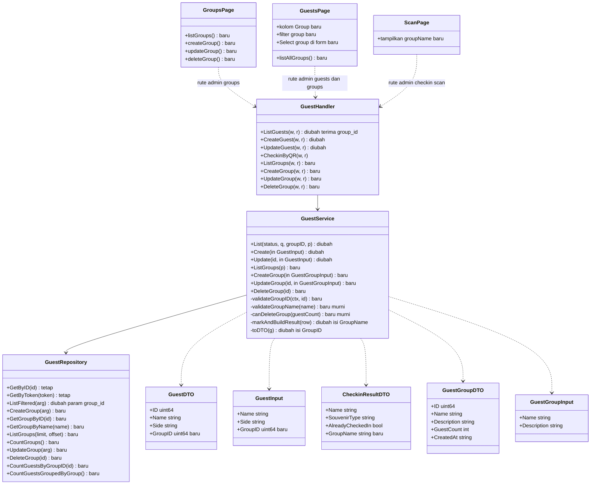
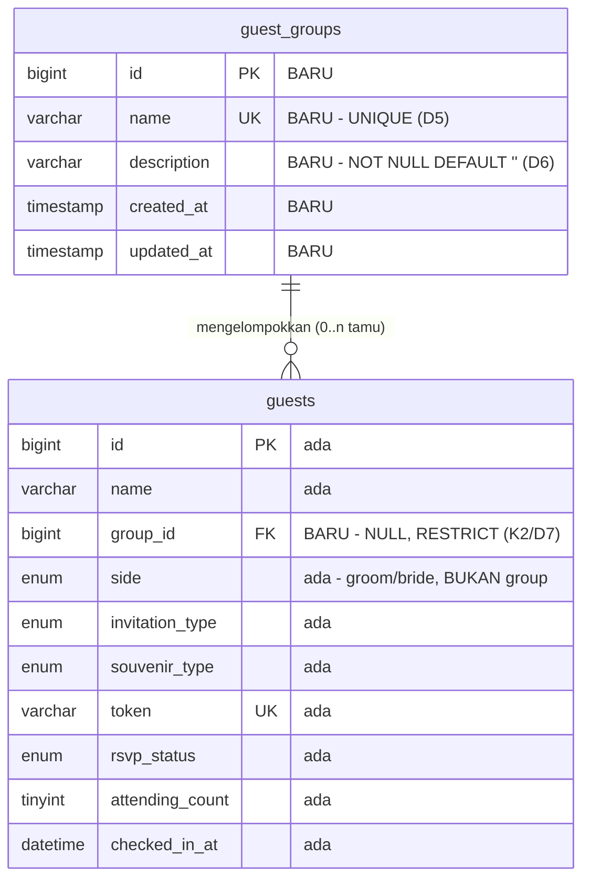
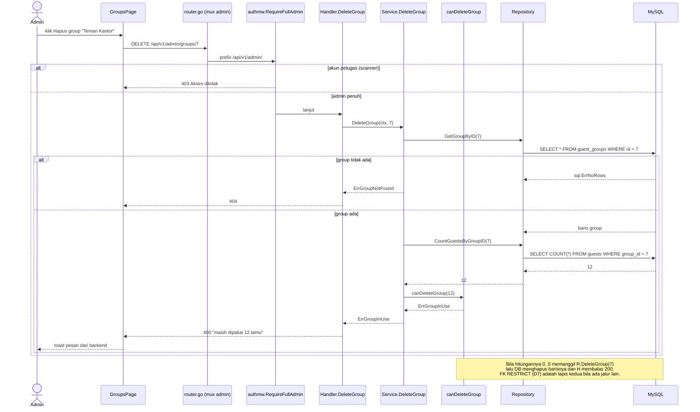
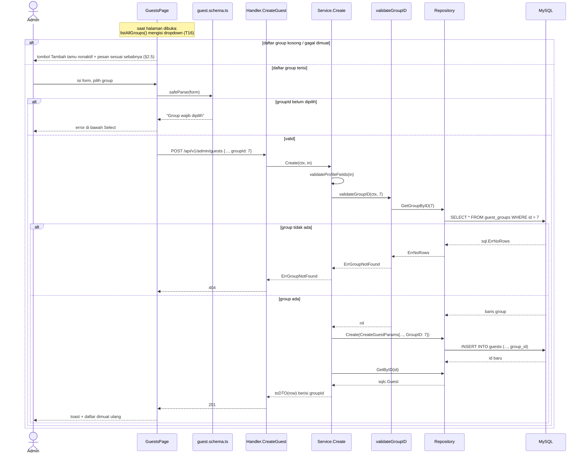
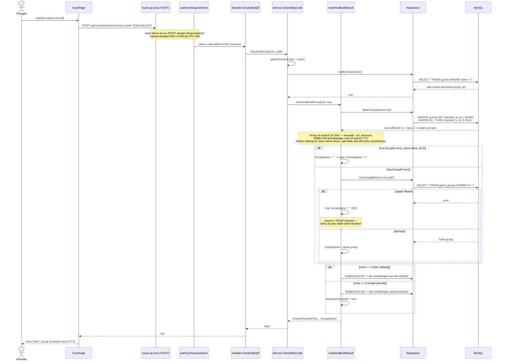

# PLAN — Menu Pengelolaan Group Tamu

Analis: System Analyst (sesi 2026-09-05)
Target pembaca: programmer yang mengimplementasikan.

---

## 1. Pernyataan requirement

**Intent: new capability.** Entitas Group dan menu CRUD-nya belum ada di mana
pun. Ia membawa dua **enhancement wajib** pada yang sudah ada: satu relasi
baru di tabel `guests`, dan satu baris data baru di kartu hasil scan.

Tiga permukaan yang dituju:

1. **Menu Group** — admin bisa membuat, mengubah, dan menghapus group.
2. **Tamu masuk ke group** — setiap tamu punya tepat satu group.
3. **Layar Scan menampilkan group** — petugas di pintu melihat tamu yang
   dipindai masuk group apa.

Group bersifat **tambahan**, berdampingan dengan `side` (groom/bride),
`invitation_type`, dan `souvenir_type` yang sudah ada — bukan menggantikan
salah satunya. Tidak ada satu pun dari ketiganya yang bisa dipakai ulang
sebagai group: semuanya ENUM berisi nilai tetap yang dikunci di migration
([000002](../../../apps/api/migrations/000002_create_guest_tables.up.sql),
[000006](../../../apps/api/migrations/000006_add_guest_profile_fields.up.sql)),
sedangkan group harus bisa dibuat dan dihapus admin kapan saja.

### 1.1 Keputusan terkunci (dijawab user)

| # | Keputusan | Jawaban user |
|---|---|---|
| K1 | Kardinalitas | **Tepat satu group per tamu.** Satu kolom `guests.group_id`, bukan tabel penghubung. Layar scan butuh SATU jawaban yang terbaca sekilas di pintu. |
| K2 | Wajib/opsional & baris lama | **Kolom nullable di DB, WAJIB saat isi data tamu.** Tamu lama tidak dikarang-karangkan masuk group palsu; mereka bergroup kosong sampai disunting. |
| K3 | Isi satu Group | **Nama + deskripsi saja.** Tanpa warna, nomor meja, maupun kuota. |
| K4 | Hapus group yang masih dipakai | **Ditolak, dengan menyebut jumlah tamunya** ("masih dipakai N tamu"). Tidak ada data yang diam-diam berubah. |
| D1 | Pemilik tabel `guest_groups` | **Modul `guest`** (jadi memiliki 2 tabel), bukan modul baru. |
| D2 | Sumber nama group di daftar Tamu | **Dipetakan di frontend** dari daftar group yang memang sudah dimuat halaman itu. Backend cukup mengirim `groupId`. |
| D3 | Lingkup perubahan menu Tamu | **Kolom Group + filter Group**, mengikuti pola dua filter yang sudah ada. |

### 1.2 Keputusan desain analis (bukan pertanyaan ke user)

| # | Keputusan | Alasan |
|---|---|---|
| D4 | `group_id` **WAJIB ditegakkan backend** pada Create/Update tamu, bukan cuma divalidasi form | Ini pola rumah yang sudah tertulis di kode: `validGenders` mewajibkan gender saat Create/Update **padahal kolomnya nullable di database** ([service.go:39-44](../../../apps/api/internal/modules/guest/application/service.go#L39)). K2 adalah situasi yang identik, jadi ia mengikuti pola yang sama persis — bukan aturan baru. Form yang mewajibkan tanpa backend yang menegakkan hanya menahan pengguna yang sopan. |
| D5 | Nama group **UNIQUE** | Dua group bernama "Keluarga" membuat pilihan di dropdown tidak bisa dibedakan dan membuat layar scan ambigu. Preseden penegakannya sudah ada: `ErrUsernameTaken` di modul auth ([service.go:151](../../../apps/api/internal/modules/auth/application/service.go#L151)) — cek nama dulu, baru tulis. |
| D6 | `description` bertipe **VARCHAR(255) NOT NULL DEFAULT ''**, bukan TEXT | MySQL **melarang** DEFAULT pada kolom TEXT — itulah sebabnya `address`/`notes` di repo ini terpaksa `TEXT NULL` + helper `nullableText`. Deskripsi group adalah label pendek, jadi VARCHAR menghindari seluruh penanganan NULL. Preseden: `email VARCHAR(255) NOT NULL DEFAULT ''` ([000006](../../../apps/api/migrations/000006_add_guest_profile_fields.up.sql)). |
| D7 | Foreign key dibiarkan **ON DELETE RESTRICT** (default) | K4 sudah ditegakkan di service dengan pesan yang enak dibaca. FK RESTRICT adalah lapis kedua yang menjamin tidak ada jalur lain (skrip, query manual) yang bisa menyisakan `group_id` menggantung. |
| D8 | Nama group di layar Scan di-resolve **di server**, berbeda dari daftar Tamu (D2) | Bukan inkonsistensi, melainkan konsekuensi akses: akun petugas **tidak bisa** memanggil `/api/v1/admin/groups` — seluruh prefix itu dijaga `RequireFullAdmin` ([router.go:162](../../../apps/api/internal/router/router.go#L162)). Jadi ScanPage tidak mungkin memetakan id→nama sendiri. Lihat §2.4. |
| D9 | Kegagalan membaca group **TIDAK PERNAH** menggagalkan check-in | Prinsip yang sama sudah dipakai di jalur QR: gangguan pada data pendukung tidak boleh menjatuhkan alur utama. Tamu tetap dicatat masuk; kolom group-nya saja yang kosong. |
| D10 | Group tidak masuk `SCANNER_ALLOWED_PATHS` | Petugas gate **melihat** group di hasil scan, tapi tidak mengelolanya. Konsisten dengan menu Tamu & Pengguna yang juga admin-only ([route-paths.ts:24](../../../apps/web/src/app/routes/route-paths.ts#L24)). |

### 1.3 Determinasi reuse / extend / create-new

| Sisi | Determinasi | Bukti |
|---|---|---|
| Tabel `guest_groups` | **Create new** | Celah nyata: `side`/`invitation_type`/`souvenir_type` semuanya ENUM bernilai tetap ([000002](../../../apps/api/migrations/000002_create_guest_tables.up.sql), [000006](../../../apps/api/migrations/000006_add_guest_profile_fields.up.sql)). Tidak ada tabel mana pun yang menyimpan label buatan admin. |
| Tabel `guests` | **Enhance** (+1 kolom, +1 index, +1 FK) | Tidak ada kolom relasi group. |
| `sqlc.yaml` | **Tidak berubah** | Konfigurasinya memetakan *direktori queries → package per modul* ([sqlc.yaml](../../../apps/api/sqlc.yaml)). File `.sql` baru di direktori guest otomatis ikut ter-generate. Preseden: modul content punya 7 file `.sql` dalam satu direktori. |
| `main.go` / `guest.module.go` | **Tidak berubah** | D1 menaruh group di modul yang sudah dirakit. Tidak ada module baru, tidak ada `contracts/` baru, tidak ada wiring baru. |
| `authmw.RequireFullAdmin` | **Reuse, tanpa perubahan** | Route group didaftarkan di mux `admin`, yang seluruhnya sudah dijaga di [router.go:162](../../../apps/api/internal/router/router.go#L162). Tidak ada middleware baru. |
| `pagination.Parse` / `pagination.Meta` | **Reuse, tanpa perubahan** | [pagination.go:26,41](../../../apps/api/internal/shared/pagination/pagination.go#L26) — dipakai apa adanya oleh ListGroups. |
| `response.*` | **Reuse, tanpa perubahan** | `OK`/`OKPaginated`/`Created`/`BadRequest`/`NotFound` sudah lengkap untuk kebutuhan ini. |
| `writeServiceError` + `StatusHTTPCode` | **Extend** (+4 error) | [handler.go:31](../../../apps/api/internal/modules/guest/presentation/handler.go#L31) & [service.go:716](../../../apps/api/internal/modules/guest/application/service.go#L716) — cukup menambah case, bukan mekanisme baru. |
| `GetGuestByID` / `GetGuestByToken` / `ListGuestsFiltered` | **TIDAK di-JOIN** (konsekuensi D2) | Ketiganya mengembalikan `sqlc.Guest` dan melayani **9 call site** ([service.go:166,399,482,547,561,598,609,248,637](../../../apps/api/internal/modules/guest/application/service.go#L166)). Meng-JOIN salah satunya mengubah tipe barisnya (`sqlc.Guest` → `...Row`) sehingga `toDTO`, `mapDTOs`, `markAndBuildResult`, dan jalur RSVP publik ikut tersentuh padahal tidak butuh group. D2 membuat perubahan ini **murni aditif**. |
| `GetGuestGroupByID` | **Dipakai ulang 4 kali** | Satu query melayani: validasi `group_id` saat Create/Update tamu (D4), resolusi nama group di layar Scan (D8), serta penjaga "group ada" pada `UpdateGroup` dan `DeleteGroup` (T5). Tidak perlu query duplikat. (Form ubah group **tidak** termasuk — ia menyunting dari baris yang sudah ada di state, pola `openEdit` [UsersPage.tsx:90](../../../apps/web/src/modules/admin/users/pages/UsersPage.tsx#L90).) |
| Pola `CountGuestsGroupedByStatus` | **Reuse pola** | [guests.sql:43](../../../apps/api/internal/modules/guest/infrastructure/queries/guests.sql#L43) — satu GROUP BY untuk seluruh angka, bukan N query COUNT. `CountGuestsGroupedByGroup` mengikutinya. |
| `UsersPage.tsx` | **Reuse sebagai template** | [UsersPage.tsx](../../../apps/web/src/modules/admin/users/pages/UsersPage.tsx) (330 baris) adalah CRUD termurni di repo ini: state + modal + zod + toast + Pagination. GroupsPage mengikuti strukturnya. |
| `shared/components/ui` & `feedback` | **Reuse, tanpa perubahan** | `Button, Input, Textarea, Select, Badge, Card, Table, Modal, Pagination` ([ui/index.ts](../../../apps/web/src/shared/components/ui/index.ts)); `EmptyState`, `ErrorState`, `TableSkeleton`; `PageHeader`; `useToast`. |
| `CheckinResultDTO` | **Extend** (+1 field) | [dto.go:110](../../../apps/api/internal/modules/guest/application/dto.go#L110). |
| Modul `whatsapp` & `content` | **Tidak disentuh** | Group tidak masuk QR, tidak masuk pesan WhatsApp, tidak masuk halaman undangan tamu. |

---

## 2. Hasil trace

Stack: `apps/api` (Go modular monolith, sqlc + golang-migrate + MySQL) dan
`apps/web` (React 19 + Vite, admin SPA entry terpisah `admin.html`).

### 2.1 Tidak ada konsep group di mana pun

Skema `guests` lengkap hari ini adalah gabungan 4 migration (000002, 000006,
000007, 000014): `id, name, gender, phone, address, notes, side,
invitation_type, souvenir_type, email, token, rsvp_status, attending_count,
checked_in_at, is_expected_attending, created_at, updated_at`.

Tiga kolom terlihat mirip pengelompokan tapi **bukan** group: `side` hanya
`groom`/`bride`, `invitation_type` hanya `online`/`physical`,
`souvenir_type` hanya `regular`/`vip`. Ketiganya ENUM — nilainya hanya bisa
berubah lewat migration, sedangkan group harus dibuat admin lewat UI. Karena
itu tabel baru memang dibutuhkan, bukan kolom baru pada tabel yang ada.

### 2.2 Modul `guest` boleh memiliki dua tabel

Aturan modular monolith melarang **join dan foreign key lintas modul**
(`.claude/rules/database.md`), bukan melarang satu modul memiliki banyak
tabel. Modul `content` sudah memiliki 7 tabel sekaligus
([MODULE_MAP.md:6](../../../knowledge/MODULE_MAP.md#L6)) dengan satu file
`.sql` per tabel.

Ini yang membuat D1 penting: dengan `guest_groups` **di dalam** modul guest,
`guests.group_id` adalah relasi **intra-modul**, sehingga FK dan JOIN sah
dipakai, dan tidak ada satu pun `contracts/`, module client, entri
`sqlc.yaml`, atau wiring `main.go` yang perlu ditambahkan. Kalau group
ditaruh di modul terpisah, seluruh mesin itu wajib dibangun hanya untuk
menempelkan sebuah label — dan `guests.group_id` tidak boleh lagi ber-FK.

### 2.3 Filter per group tidak butuh JOIN sama sekali

`group_id` ada **di baris `guests` itu sendiri**, jadi menyaring tamu per
group hanya menambah satu klausa `narg` ke `ListGuestsFiltered` /
`CountGuestsFiltered` ([guests.sql:22-38](../../../apps/api/internal/modules/guest/infrastructure/queries/guests.sql#L22)),
persis seperti `invitation_type` dan `souvenir_type` yang sudah ada. Yang
butuh JOIN hanyalah **menampilkan namanya** — dan D2 memindahkan pekerjaan
itu ke frontend, yang memang sudah memuat daftar group untuk dropdown-nya.

Konsekuensi teknis yang menguntungkan: penambahan field ke
`ListGuestsFilteredParams` bersifat aditif, dan pemanggil yang tidak
menyaring group **tidak perlu diubah sama sekali** — `sqlc.narg` selalu
menghasilkan tipe `Null*`, dan zero-value-nya (`Valid: false`) berarti NULL,
yang oleh klausa `IS NULL OR ...` diartikan "tanpa filter". Pola ini sudah
terbukti dipakai empat kali di query yang sama untuk `status`,
`invitation_type`, `souvenir_type`, dan `q`
([guests.sql:24-28](../../../apps/api/internal/modules/guest/infrastructure/queries/guests.sql#L24)).
`SearchForCheckin` ([service.go:637](../../../apps/api/internal/modules/guest/application/service.go#L637))
karena itu tidak perlu disentuh.

### 2.4 Petugas gate tidak bisa memetakan nama group sendiri

Seluruh `/api/v1/admin/` dijaga `RequireFullAdmin` dan membalas **403** untuk
akun petugas ([router.go:162](../../../apps/api/internal/router/router.go#L162));
hanya lima route `checkin/*` yang sengaja didaftarkan di mux root dengan
`RequireAdmin` supaya lolos ke petugas ([router.go:151-156](../../../apps/api/internal/router/router.go#L151)).

Artinya ScanPage **tidak mungkin** memanggil `/api/v1/admin/groups`. Nama
group karena itu wajib ikut di dalam respons check-in itu sendiri (D8) — dan
route group yang baru **tidak boleh** ikut didaftarkan di mux root seperti
`checkin/*`, karena mengelola group memang bukan hak petugas (D10).

### 2.5 Dua alur terputus yang lahir dari "group wajib"

Keduanya adalah akibat langsung K2/D4 dan **wajib ditangani**, bukan detail UI:

1. **Belum ada group sama sekali.** Saat pertama kali fitur ini hidup, tabel
   `guest_groups` kosong. Kalau form tamu mewajibkan group sementara
   dropdown-nya tidak punya satu pun pilihan, **admin tidak bisa menambah
   tamu sama sekali** — menu Tamu mati total sampai orang menebak sendiri
   bahwa ia harus ke menu Group dulu.
2. **Daftar group gagal dimuat.** Form tamu bergantung pada daftar group
   (D2). Kalau permintaannya gagal, dropdown kosong dan gejalanya identik
   dengan kasus di atas, padahal sebabnya beda.

Keduanya ditutup di T16 dengan pesan yang membedakan sebabnya.

### 2.6 Tamu lama bergroup kosong, dan itu memang disengaja

Migration menambah kolom **NULL**, jadi seluruh baris tamu yang sudah ada
tidak berubah (K2). Di daftar Tamu mereka tampil "—", dan begitu barisnya
disunting, form mewajibkan memilih group. Perilaku ini identik dengan kolom
`gender` yang sudah lebih dulu memakai pola yang sama sejak 000006.

---

## 3. Lingkup

### 3.1 Masuk lingkup

| Berkas | Perubahan |
|---|---|
| `apps/api/migrations/000016_add_guest_groups.{up,down}.sql` | **Baru** — tabel `guest_groups` + `guests.group_id` |
| `apps/api/internal/modules/guest/infrastructure/queries/guest_groups.sql` | **Baru** — 7 query CRUD |
| [guest queries/guests.sql](../../../apps/api/internal/modules/guest/infrastructure/queries/guests.sql) | +2 query (`CountGuestsByGroupID`, `CountGuestsGroupedByGroup`); +filter `group_id`; +kolom `group_id` di Create/Update |
| `apps/api/internal/modules/guest/infrastructure/sqlc/*` | **Hasil `sqlc generate`** — jangan disunting tangan |
| [guest/infrastructure/repository.go](../../../apps/api/internal/modules/guest/infrastructure/repository.go) | +7 method group, +2 method hitung |
| `apps/api/internal/modules/guest/application/service_groups.go` | **Baru** — CRUD group (pola `service_lists.go` milik content) |
| [guest/application/service.go](../../../apps/api/internal/modules/guest/application/service.go) | +error group, +`validateGroupID`, `group_id` di Create/Update, `GroupID` di `toDTO`, filter group di `List`, resolusi nama group di `markAndBuildResult` |
| [guest/application/dto.go](../../../apps/api/internal/modules/guest/application/dto.go) | +`GuestGroupDTO`/`GuestGroupInput`; +`GroupID` di `GuestDTO`&`GuestInput`; +`GroupName` di `CheckinResultDTO` |
| `apps/api/internal/modules/guest/presentation/handler_groups.go` | **Baru** — 4 handler |
| [guest/presentation/handler.go](../../../apps/api/internal/modules/guest/presentation/handler.go) | +parsing query param `group_id` di `ListGuests` |
| [router.go](../../../apps/api/internal/router/router.go) | +4 route di mux `admin` |
| `apps/api/internal/modules/guest/application/group_test.go` | **Baru** |
| [route-paths.ts](../../../apps/web/src/app/routes/route-paths.ts) | +`groups` (BUKAN di `SCANNER_ALLOWED_PATHS`) |
| [AdminApp.tsx](../../../apps/web/src/modules/admin/app/AdminApp.tsx) | +rute `/groups` |
| [AdminLayout.tsx](../../../apps/web/src/modules/admin/shared/AdminLayout.tsx) | +item nav "Group" |
| `apps/web/src/modules/admin/groups/schemas/group.schema.ts` | **Baru** |
| `apps/web/src/modules/admin/groups/services/groups.service.ts` | **Baru** |
| `apps/web/src/modules/admin/groups/pages/GroupsPage.tsx` | **Baru** |
| [guest.schema.ts](../../../apps/web/src/modules/admin/guests/schemas/guest.schema.ts) | +`groupId` wajib |
| [guests.service.ts](../../../apps/web/src/modules/admin/guests/services/guests.service.ts) | +`groupId` di `Guest`/`GuestInput`/`GuestListParams` |
| [GuestsPage.tsx](../../../apps/web/src/modules/admin/guests/pages/GuestsPage.tsx) | +muat daftar group, +kolom Group, +filter Group, +Select di form, +2 penanganan alur terputus (§2.5) |
| [checkin.service.ts](../../../apps/web/src/modules/admin/scan/services/checkin.service.ts) | +`groupName` di `CheckinResult` |
| [ScanPage.tsx](../../../apps/web/src/modules/admin/scan/pages/ScanPage.tsx) | +tampilkan group di kartu hasil |
| Test FE | `GroupsPage.test.tsx` **baru**; `GuestsPage.test.tsx` & `ScanPage.test.tsx` diperbarui |
| [knowledge/](../../../knowledge/) | `DATABASE.md`, `MODULE_MAP.md`, `API.md`, `FRONTEND.md` |

### 3.2 Di luar lingkup (keputusan, bukan kelalaian)

- **Group di menu "Tamu Masuk"** — tidak diminta. Murah ditambahkan kelak
  (`ListCheckedInGuests` +1 kolom `group_id`, lalu dipetakan di FE), tapi
  petugas gate tidak bisa memuat daftar group (§2.4), jadi ia butuh
  `groupName` dari server seperti layar Scan — bukan perubahan satu baris.
- **Group di hasil pencarian check-in manual** (`CheckinSearchItemDTO`) —
  tidak diminta. Alasan teknisnya sama dengan butir di atas.
- **Group di halaman Ringkasan** — tidak ada kartu "tamu per group".
  `Summary` ([service.go:271](../../../apps/api/internal/modules/guest/application/service.go#L271))
  tidak disentuh.
- **Group di undangan tamu / QR / WhatsApp** — group adalah data internal
  admin & gate. `GuestSessionDTO`, `buildQRPayload`, dan modul `whatsapp`
  tidak disentuh sama sekali.
- **Pindah-massal tamu antar group** — K4 memilih menolak hapus, bukan
  memindahkan. Tidak ada UI pemindahan.
- **Backfill tamu lama ke group** — ditolak di K2. Tidak ada seed, tidak ada
  group "Umum".
- **Warna / nomor meja / kuota group** — ditolak di K3.
- **Pencarian & filter di halaman Group** — jumlah group puluhan, satu
  halaman paginasi sudah cukup. Pola yang sama dipakai UsersPage.

---

## 4. Task list (dikerjakan berurutan)

### Backend

- [x] **T1 — Migration 000016.** WAJIB paling awal: sqlc membaca direktori
  `migrations` sebagai schema, jadi T2 tidak bisa dijalankan sebelum ini ada.

  ```sql
  CREATE TABLE guest_groups (
    id BIGINT UNSIGNED NOT NULL AUTO_INCREMENT,
    name VARCHAR(100) NOT NULL,
    description VARCHAR(255) NOT NULL DEFAULT '',
    created_at TIMESTAMP NOT NULL DEFAULT CURRENT_TIMESTAMP,
    updated_at TIMESTAMP NOT NULL DEFAULT CURRENT_TIMESTAMP ON UPDATE CURRENT_TIMESTAMP,
    PRIMARY KEY (id),
    UNIQUE KEY uq_guest_groups_name (name)
  );

  ALTER TABLE guests
    ADD COLUMN group_id BIGINT UNSIGNED NULL AFTER side,
    ADD KEY idx_guests_group_id (group_id),
    ADD CONSTRAINT fk_guests_group_id FOREIGN KEY (group_id) REFERENCES guest_groups(id);
  ```

  `description` VARCHAR bukan TEXT — MySQL melarang DEFAULT pada TEXT (D6).
  Kolom `group_id` **NULL** supaya baris tamu lama tidak berubah (K2/§2.6).
  FK dibiarkan RESTRICT (D7).

  `.down.sql` **urutannya terbalik dan itu wajib** — FK harus lepas sebelum
  kolomnya bisa jatuh, dan tabelnya sebelum itu masih dirujuk:
  ```sql
  ALTER TABLE guests DROP FOREIGN KEY fk_guests_group_id;
  ALTER TABLE guests DROP COLUMN group_id;
  DROP TABLE guest_groups;
  ```
  (`DROP COLUMN` ikut membuang `idx_guests_group_id`.)

- [x] **T2 — Query + `sqlc generate`.** T1 wajib lebih dulu.

  `guest_groups.sql` **baru** — 7 query: `CreateGuestGroup :execlastid`,
  `GetGuestGroupByID :one`, `GetGuestGroupByName :one`,
  `ListGuestGroups :many` (`ORDER BY name ASC LIMIT ? OFFSET ?`),
  `CountGuestGroups :one`, `UpdateGuestGroup :exec`, `DeleteGuestGroup :exec`.

  `guests.sql` — query yang menyentuh tabel `guests` tetap tinggal di sini:
  - `CountGuestsByGroupID :one` — penjaga K4, dipanggil tepat sebelum hapus.
  - `CountGuestsGroupedByGroup :many` — `SELECT group_id, COUNT(*) ... WHERE group_id IS NOT NULL GROUP BY group_id`, satu query untuk seluruh kolom "N tamu" di halaman Group (pola `CountGuestsGroupedByStatus`).
  - `ListGuestsFiltered` & `CountGuestsFiltered` +1 klausa:
    `AND (sqlc.narg(group_id) IS NULL OR group_id = sqlc.narg(group_id))`.
  - `CreateGuest` & `UpdateGuest` +kolom `group_id`.

  Jalankan `npm run sqlc:generate`. **Jangan menyunting `infrastructure/sqlc/*` dengan tangan.**

- [x] **T3 — Repository.** +`CreateGroup`, `GetGroupByID`, `GetGroupByName`,
  `ListGroups`, `CountGroups`, `UpdateGroup`, `DeleteGroup`,
  `CountGuestsByGroupID`, `CountGuestsGroupedByGroup`. Semuanya penerusan
  tipis ke `r.q.*`, persis pola method yang sudah ada.

- [x] **T4 — DTO.**
  - `GuestGroupDTO{ID, Name, Description, GuestCount, CreatedAt}` — `GuestCount` diisi service dari `CountGuestsGroupedByGroup`, bukan dari query group.
  - `GuestGroupInput{Name, Description}`.
  - `GuestDTO` +`GroupID *uint64` (`json:"groupId"`) — pointer karena NULL bermakna "belum ditentukan", pola yang sama dengan `Gender *string`.
  - `GuestInput` +`GroupID uint64` (`json:"groupId"`) — **bukan** pointer: 0 berarti tidak dikirim dan ditolak D4, persis seperti string kosong pada enum.
  - `CheckinResultDTO` +`GroupName string` (`json:"groupName"`) — kosong bila tamu belum bergroup.

- [x] **T5 — `service_groups.go` (baru).** Error baru di `service.go`:
  `ErrGroupNameRequired`, `ErrGroupNameTaken`, `ErrGroupNotFound`,
  `ErrGroupInUse`. Isi berkas:
  - `validateGroupName(name string) error` — **fungsi murni**, dipanggil Create & Update: trim, tolak kosong, tolak >100 karakter (batas kolom).
  - `canDeleteGroup(guestCount int) error` — **fungsi murni**, kembalikan `ErrGroupInUse` bila `guestCount > 0`. Dipisah supaya bisa diuji tanpa DB, pola `canDeleteAdmin` di modul auth.
  - `ListGroups(ctx, p)` — 2 query: `ListGroups` + `CountGroups`, lalu satu `CountGuestsGroupedByGroup` yang dipetakan ke map di memori. **Jangan** menghitung per baris di dalam loop.
  - `CreateGroup` / `UpdateGroup` — cek `GetGroupByName` dulu → `ErrGroupNameTaken` (pada Update, nama yang sama milik dirinya sendiri tetap boleh — bandingkan ID, pola `Update` modul auth).
  - `UpdateGroup` / `DeleteGroup` **wajib memastikan group-nya ada lebih dulu** (`GetGroupByID` → `sql.ErrNoRows` → `ErrGroupNotFound`). Tanpa ini, `UPDATE`/`DELETE` pada id yang tidak ada hanya menyentuh 0 baris dan endpoint membalas **200 seolah berhasil** — persis kenapa modul auth memanggil `GetByID` dulu di `Delete` ([service.go:235](../../../apps/api/internal/modules/auth/application/service.go#L235)).
  - `DeleteGroup` — urutannya: `GetGroupByID` → `CountGuestsByGroupID` → `canDeleteGroup` → `Delete`. Pesan error menyebut jumlahnya (K4).

- [x] **T6 — `service.go`: sambungkan group ke tamu.**
  - `validateGroupID(ctx, id uint64) error` — 0 → `ErrGroupNotFound`; `GetGroupByID` `sql.ErrNoRows` → `ErrGroupNotFound`. Dipanggil `Create` **dan** `Update` (D4).
  - `Create`/`Update` mengisi `GroupID` ke params sqlc.
  - `toDTO` memetakan `g.GroupID` → `*uint64`, mengikuti pola `Gender` yang
    sudah ada di fungsi yang sama (NULL → `nil`, terisi → pointer).
    **Tipe sumbernya ikuti hasil `sqlc generate` di T2, jangan diasumsikan** —
    kolomnya `BIGINT UNSIGNED NULL` dan tipe nullable yang dipilih sqlc untuk
    itu baru pasti setelah generate. Konversinya mungkin butuh cast eksplisit
    ke `uint64`.
  - `List` menerima parameter `groupID string`, diparse ke `sql.NullInt64` dan diteruskan ke kedua query. String kosong = tanpa filter.
  - `StatusHTTPCode`: `ErrGroupNotFound`→404; `ErrGroupNameRequired`, `ErrGroupNameTaken`, `ErrGroupInUse`→400.

- [x] **T7 — Nama group di hasil check-in.** Di `markAndBuildResult`
  ([service.go:578](../../../apps/api/internal/modules/guest/application/service.go#L578)),
  bila `row.GroupID.Valid`, panggil `GetGroupByID` dan isi `out.GroupName`.

  **Letaknya WAJIB tepat sesudah `out` tersusun dan SEBELUM `if rows == 1`.**
  Kedua cabang di bawahnya sama-sama `return out, nil` — cabang `rows == 1`
  keluar lebih awal ([service.go:594](../../../apps/api/internal/modules/guest/application/service.go#L594)),
  jadi tidak ada titik temu sesudahnya. Menaruhnya di dalam salah satu cabang
  membuat group hilang pada pemindaian pertama ATAU pada pemindaian kedua —
  bug yang tidak akan terlihat di pengujian sepintas karena separuh kasusnya
  tetap benar.

  **Error-nya di-log lalu diabaikan, TIDAK di-return** (D9): tamu yang berdiri
  di pintu harus tetap tercatat masuk walau nama group-nya gagal dibaca.

- [x] **T8 — Handler `handler_groups.go` (baru) + `ListGuests`.**
  4 handler group memakai `decodeJSON`, `writeServiceError`,
  `pagination.Parse/Meta`, `response.OKPaginated/OK/Created` yang sudah ada.
  `ListGuests` ([handler.go:43](../../../apps/api/internal/modules/guest/presentation/handler.go#L43))
  +`groupID := r.URL.Query().Get("group_id")` dan meneruskannya ke `service.List`.

- [x] **T9 — Router.** 4 route di mux **`admin`** (bukan mux root):
  ```go
  admin.HandleFunc("GET /api/v1/admin/groups", d.GuestHandler.ListGroups)
  admin.HandleFunc("POST /api/v1/admin/groups", d.GuestHandler.CreateGroup)
  admin.HandleFunc("PUT /api/v1/admin/groups/{id}", d.GuestHandler.UpdateGroup)
  admin.HandleFunc("DELETE /api/v1/admin/groups/{id}", d.GuestHandler.DeleteGroup)
  ```
  Taruh sesudah blok users ([router.go:125](../../../apps/api/internal/router/router.go#L125)).
  **JANGAN** didaftarkan di mux root seperti `checkin/*` — itu justru membuka
  pengelolaan group untuk akun petugas (D10/§2.4).

- [x] **T10 — Test Go** (`group_test.go`): `validateGroupName` (kosong,
  spasi saja, >100 karakter, valid); `canDeleteGroup` (0 tamu → nil, 1 tamu →
  `ErrGroupInUse`); `StatusHTTPCode` untuk keempat error baru.

### Frontend

> **Urutan T11–T14 disengaja: halaman dibuat SEBELUM dirujuk.** `AdminApp.tsx`
> meng-`import` `GroupsPage`, jadi mendaftarkan rutenya lebih dulu membuat
> `tsc -b` dan `vite build` gagal karena berkasnya belum ada.

- [x] **T11 — `group.schema.ts`.** `groupSchema` = `{ name: min(1).max(100), description: string }`. Ekspor `GroupFormValues` lewat `z.infer`.

- [x] **T12 — `groups.service.ts`.** `listGroups(page)`, `createGroup`,
  `updateGroup`, `deleteGroup`. **Wajib memetakan `total_pages` →
  `totalPages`** seperti [users.service.ts:35](../../../apps/web/src/modules/admin/users/services/users.service.ts#L35) — envelope backend memakai snake_case.
  Tambahkan `listAllGroups()` untuk dropdown: memanggil endpoint yang sama
  dengan `limit: 100` (batas `pagination.MaxLimit`, lihat §6).

- [x] **T13 — `GroupsPage.tsx`.** Struktur UsersPage: tabel (Nama, Deskripsi,
  Jumlah tamu, Aksi), modal tambah/ubah, konfirmasi hapus, `Pagination`,
  `EmptyState`/`ErrorState`/`TableSkeleton`, `useToast`.
  Kolom **Jumlah tamu** wajib ada — dialah yang menjelaskan kenapa sebuah
  group tidak bisa dihapus. Pesan penolakan hapus diambil dari respons
  backend, bukan ditulis ulang di frontend.

- [x] **T14 — Rute & menu.** T13 wajib lebih dulu (lihat catatan di atas).
  `route-paths.ts` +`groups: '/groups'`.
  **JANGAN** menambahkannya ke `SCANNER_ALLOWED_PATHS` (D10).
  `AdminApp.tsx` +rute eager (kecil, tanpa dependensi berat — beda dari
  ScanPage yang lazy karena pustaka kamera). `AdminLayout.tsx` +item nav
  "Group" tepat sesudah "Tamu" ([AdminLayout.tsx:45](../../../apps/web/src/modules/admin/shared/AdminLayout.tsx#L45)).

- [x] **T15 — Kontrak tamu di FE.** `guest.schema.ts` +`groupId: z.number().int().positive('Group wajib dipilih')`.
  `guests.service.ts`: `Guest` +`groupId: number | null`; `GuestInput`
  +`groupId: number`; `GuestListParams` +`groupId: string`, dikirim sebagai
  `group_id` bila terisi (pola `invitation_type` di [guests.service.ts:101](../../../apps/web/src/modules/admin/guests/services/guests.service.ts#L101)).

- [x] **T16 — `GuestsPage.tsx`.** Muat daftar group sekali lewat
  `listAllGroups()`, simpan sebagai `Map<number, string>` untuk kolom tabel
  dan sebagai array untuk kedua dropdown. Lalu:
  - kolom **Group** di tabel — `groupId` null → "—" (tamu lama, §2.6);
  - dropdown filter **Group** di bar filter, ikut masuk `hasFilter`;
  - `Select` group di form (wajib), `EMPTY_FORM` +`groupId: 0`;
  - **§2.5 butir 1** — bila daftar group kosong, tombol "+ Tambah tamu"
    dinonaktifkan dan muncul ajakan membuat group dulu beserta tautan ke
    `/groups`. Tanpa ini menu Tamu mati total di instalasi baru.
  - **§2.5 butir 2** — bila permintaan daftar group **gagal**, tampilkan
    pesan yang berbeda ("Daftar group gagal dimuat") + tombol coba lagi.
    Dua sebab, dua pesan — jangan disamakan.

- [x] **T17 — Layar Scan.** `checkin.service.ts`: `CheckinResult`
  +`groupName: string`. `ScanPage.tsx`: tampilkan group di kartu hasil.
  Taruh sebagai baris teks di bawah nama, **berdampingan dengan pihak &
  status RSVP** ([ScanPage.tsx:465](../../../apps/web/src/modules/admin/scan/pages/ScanPage.tsx#L465)) —
  **jangan** menjadikannya kartu besar sejajar "Jumlah orang"/"Souvenir":
  kedua kartu itu sengaja dipilih karena mengubah tindakan TANGAN petugas,
  sedangkan group adalah konteks. `groupName` kosong → "—".

- [x] **T18 — Test FE.** `GroupsPage.test.tsx` **baru**: daftar tampil dengan
  jumlah tamu; validasi nama kosong; hapus yang ditolak menampilkan pesan
  backend. `GuestsPage.test.tsx`: submit tanpa group ditolak; filter group
  mengirim `group_id`; **daftar group kosong menonaktifkan tambah tamu**.
  `ScanPage.test.tsx`: hasil scan menampilkan nama group; `groupName` kosong
  tidak membuat kartu rusak.

- [x] **T19 — Dokumentasi `knowledge/`.** `DATABASE.md` (tabel + kolom +
  relasi), `MODULE_MAP.md` (modul guest kini memiliki **2 tabel**),
  `API.md` (4 endpoint + query param `group_id`), `FRONTEND.md` (menu Group
  admin-only + aturan group wajib pada form tamu).

- [x] **T20 — Verifikasi.** `go build ./...`, `go vet ./...`, `go test ./...`,
  `npx tsc --noEmit`, `npx eslint .` (harus tetap **0 error**),
  `npx vitest run`, `npm run build -w apps/web`, lalu `npm run migrate:up`.
  Uji manual: buat group → tambah tamu dengan group → pindai QR tamu itu dan
  pastikan group muncul di kartu → coba hapus group tersebut dan pastikan
  ditolak dengan menyebut jumlah tamu.

---

## 5. Diagram

### 5.1 Class diagram

Nama-nama di bawah adalah nama nyata dari hasil trace. Anggota berketerangan
**`baru`** belum ada hari ini; **`diubah`** sudah ada tapi isinya berganti;
**`murni`** berarti fungsi tanpa DB sehingga bisa diuji langsung. Sisanya
dipakai ulang apa adanya.



`GuestDTO.GroupID` adalah **pointer** (`*uint64`) supaya NULL bisa dibedakan
dari 0 — pola yang sama dengan `Gender *string` yang sudah ada.
`GuestInput.GroupID` sengaja **bukan** pointer: 0 berarti tidak dikirim dan
ditolak D4.

### 5.2 ERD



Relasinya **opsional di sisi tamu** (`o{` + kolom NULL): itulah K2 — tamu
lama boleh belum bergroup. Yang mewajibkan group adalah Create/Update (D4),
bukan skema.

### 5.3 Sequence — CRUD group & penjaga hapus (K4)



### 5.4 Sequence — simpan tamu dengan group (D4)



### 5.5 Sequence — pindai QR, group ikut tampil (D8/D9)



---

## 6. Verdict performa & volume

Volume yang diasumsikan — dan ini asumsi yang dicatat, bukan pertanyaan yang
tidak pernah diajukan: **tamu ratusan sampai rendah-ribuan; group puluhan**
(satu pernikahan). Seluruh penilaian di bawah dibuat terhadap angka itu.

| Jalur | Query | Penilaian |
|---|---|---|
| `GET /groups` (halaman Group) | 3 tetap: `ListGuestGroups`, `CountGuestGroups`, `CountGuestsGroupedByGroup` | **Bukan N+1.** Jumlah tamu per group datang dari SATU `GROUP BY`, lalu dipetakan di memori — bukan satu COUNT per baris group. |
| `GET /guests?group_id=` | Tetap 2 (`Count` + `List`), tidak bertambah | Filter memakai `group_id` yang ada di baris `guests` sendiri, ber-index `idx_guests_group_id` (T1). **Tidak ada JOIN** (§2.3/D2). |
| Daftar Tamu menampilkan nama group | **0 query tambahan per baris** | Nama dipetakan di frontend dari daftar group yang sudah dimuat sekali (D2). Inilah yang mencegah bentuk N+1 yang paling mudah muncul di fitur ini. |
| `POST /checkin/scan` | +1 lookup PK `guest_groups` | Satu pemindaian = satu tamu, dilakukan satu per satu di pintu. Lookup primary key pada tabel puluhan baris — tidak terukur. |
| Create/Update tamu | +1 lookup PK (`validateGroupID`) | Aksi admin satuan. Wajib demi D4. |
| `DELETE /groups/{id}` | 3: `GetGroupByID` + `COUNT(*) WHERE group_id = ?` + `DELETE` | Keduanya ber-index (PK dan `idx_guests_group_id`). COUNT dijalankan tepat sebelum hapus supaya hitungannya sesegar mungkin. Aksi admin satuan. |

**Batas yang harus diketahui programmer:** `listAllGroups()` (T12) memakai
`limit: 100` karena `pagination.MaxLimit = 100`
([pagination.go:14](../../../apps/api/internal/shared/pagination/pagination.go#L14)).
Kalau suatu saat group melebihi 100, dropdown dan pemetaan nama di daftar
Tamu akan terpotong diam-diam. Pada volume yang diasumsikan di atas angka itu
jauh di atas kebutuhan, jadi ini dicatat sebagai **batas yang diketahui**,
bukan cacat — dan halaman Group sendiri tetap berpaginasi penuh sehingga
seluruh group tetap bisa dikelola. Bila kelak group memang bisa ratusan,
tambahkan endpoint ringan `GET /groups/options` tanpa paginasi (pola
`checkin/search` yang sengaja dibatasi keras tanpa `meta`).

Tidak ada transaksi yang menggantung, tidak ada koleksi yang ditahan di
memori, dan tidak ada respons yang tumbuh tanpa batas: setiap endpoint list
di sini berpaginasi.

---

## 7. Ringkasan untuk programmer

1. **Kerjakan T1 lebih dulu, tanpa pengecualian.** sqlc membaca `migrations`
   sebagai schema; T2 tidak akan menghasilkan apa pun yang benar sebelum
   tabel dan kolomnya ada.
2. **Jangan meng-JOIN `GetGuestByID`/`GetGuestByToken`/`ListGuestsFiltered`.**
   Ketiganya melayani 9 call site termasuk jalur RSVP publik. D2 sudah
   memindahkan pemetaan nama ke frontend supaya seluruh perubahan ini
   aditif — meng-JOIN akan membatalkan keuntungan itu.
3. **`group_id` wajib ditegakkan di backend, bukan cuma di form** (D4) —
   ikuti persis pola `validGenders` yang sudah ada di berkas yang sama.
4. **Route group masuk mux `admin`, bukan mux root.** Mendaftarkannya seperti
   `checkin/*` akan membuka pengelolaan group untuk akun petugas.
5. **Kegagalan membaca group tidak boleh menjatuhkan check-in** (D9) — log,
   kosongkan namanya, lanjutkan.
6. **Dua alur terputus di §2.5 adalah bagian dari fitur, bukan poles UI.**
   Tanpa T16, instalasi yang belum punya group membuat menu Tamu tidak bisa
   dipakai sama sekali.
7. Yang **tidak** disentuh: modul `whatsapp`, modul `content`, isi QR,
   `GuestSessionDTO`, halaman Ringkasan, dan menu Tamu Masuk.
