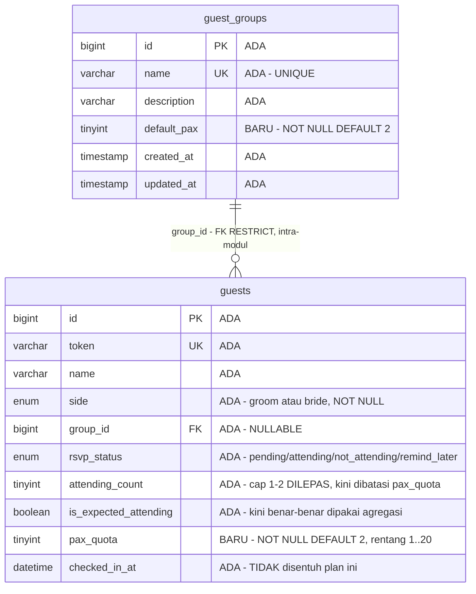
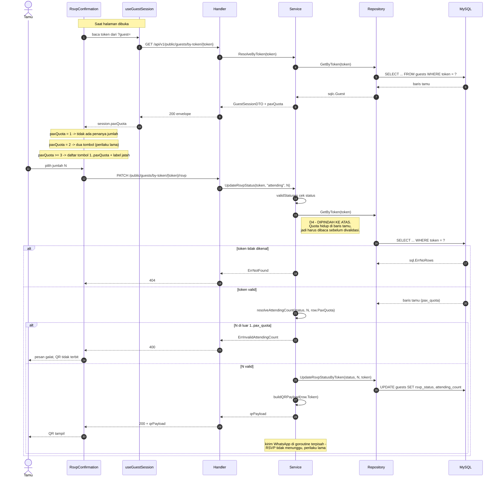
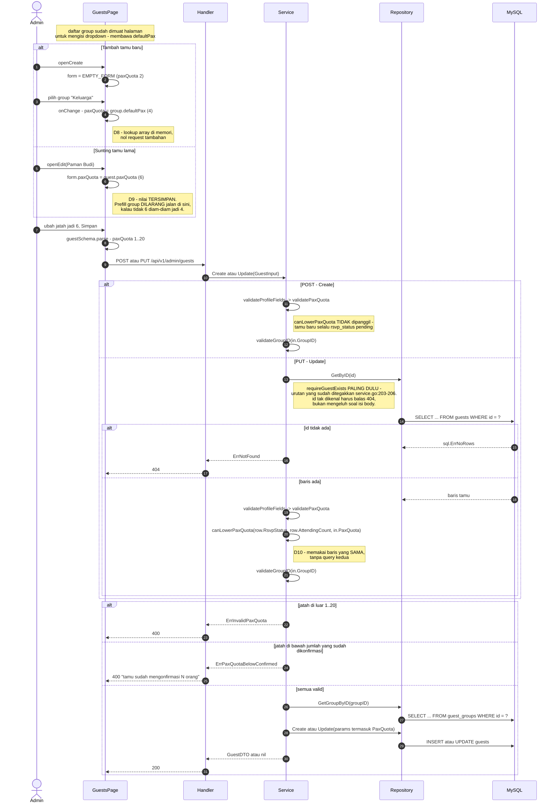

# PLAN — Jatah kursi (pax quota) + proyeksi pax catering

Modul: `guest` (backend) & `admin` + undangan tamu (frontend).
Analis: sesi System Analyst, 2026-09-06.

---

## 0. Requirement yang sudah disepakati

**Klasifikasi intent: Enhancement.**

Konsep pax **sudah ada** di sistem ini — `guests.attending_count` diisi tamu
saat RSVP ([service.go:546](../../../apps/api/internal/modules/guest/application/service.go#L546)),
dan `attendingPax` sudah dihitung dan ditampilkan di Ringkasan
([service.go:394](../../../apps/api/internal/modules/guest/application/service.go#L394),
[DashboardPage.tsx:184](../../../apps/web/src/modules/admin/dashboard/pages/DashboardPage.tsx#L184)).
Ini bukan kapabilitas dari nol; yang dikerjakan adalah **membuat pax dinamis
per tamu** dan **menambah agregasi proyeksi**. Karena itu bentuk PLAN ini
adalah handoff implementasi penuh: task list + diagram class, ERD, dan tiga
sequence (RSVP tamu, proyeksi Ringkasan, simpan tamu oleh admin).

### Masalah yang dipecahkan

Batas `attending_count` dikunci mati di 1 atau 2
([service.go:484-492](../../../apps/api/internal/modules/guest/application/service.go#L484)),
sedangkan undangan keluarga ("paman + istri + 2 anak") nyata-nyata lebih dari
2 orang. Akibatnya angka pax untuk catering **selalu bias ke bawah**, dan
biasnya terkonsentrasi justru di undangan yang pax-nya paling besar. Selain
itu tamu ber-status `pending` menyumbang 0 pax, padahal catering dipesan H-7
s/d H-14 ketika sebagian besar tamu belum menjawab.

---

## 1. Keputusan terkunci

### 1.1 Keputusan user (K)

| # | Pertanyaan | Jawaban user |
|---|---|---|
| K1 | Anak kecil dihitung berapa porsi? | **1 orang = 1 porsi.** Tidak ada kolom terpisah untuk anak, tidak ada angka kembar di dashboard. |
| K2 | Jatah kursi ditampilkan ke tamu di halaman RSVP? | **Ya, ditampilkan** ("Undangan ini berlaku untuk N orang"). Cara paling sopan menegakkan batas. |
| K3 | Tempat jatah kursi disimpan | **Dua lapis.** Group memberi *angka awal*; tamu menyimpan *kebenaran*. Angka per-tamu yang mengikat. |
| K4 | Perlakuan `is_expected_attending` | **Jawaban tamu menang atas dugaan admin.** `is_expected_attending` HANYA berlaku untuk tamu yang belum menjawab. |
| K5 | Hitung kepala nyata di pintu | **Di luar scope**, sengaja. Catering sudah terlanjur dipesan sebelum hari-H. |

Alasan K3 dua lapis, dari kasus user sendiri: group "Keluarga" berisi Paman
Budi (istri + 4 anak = 6) **dan** Bulek Sri (janda, datang sendiri = 1). Tidak
ada satu angka yang benar untuk seluruh group. Kalau jatah hanya hidup di
group, satu-satunya jalan keluar adalah membuat group palsu "Keluarga 6" /
"Keluarga 1", dan group berhenti berfungsi sebagai pengelompokan — padahal ia
juga dipakai filter daftar Tamu dan layar Scan
([D2/D8 guest-groups](../guest-groups/PLAN.md)).

### 1.2 Keputusan desain analis (D)

| # | Keputusan | Alasan |
|---|---|---|
| D1 | `guests.pax_quota` **TINYINT UNSIGNED NOT NULL DEFAULT 2** | DEFAULT 2 menjaga perilaku hari ini **persis**: batas yang berlaku sekarang memang 2, jadi seluruh baris lama langsung benar tanpa backfill. Pola identik `attending_count TINYINT UNSIGNED NOT NULL DEFAULT 1` ([000007](../../../apps/api/migrations/000007_add_guest_attendance_fields.up.sql#L9)). |
| D2 | `guest_groups.default_pax` **TINYINT UNSIGNED NOT NULL DEFAULT 2** | Angka awal per tipe tamu. **Membalik K3 guest-groups** — lihat §2, konflik dilaporkan. |
| D3 | Jatah dibatasi **1..20**, ditegakkan server | `TINYINT UNSIGNED` muat 255. Tanpa batas atas, satu salah ketik (200) diam-diam meledakkan proyeksi catering dan tidak ada yang menyadarinya sampai vendor menagih. 20 sudah sangat longgar untuk "keluarga besar" di pernikahan intimate. Pola penegakan sama dengan `groupNameMaxLen` ([service_groups.go:24](../../../apps/api/internal/modules/guest/application/service_groups.go#L24)). |
| D4 | `resolveAttendingCount` menerima **quota** sebagai parameter, dan `UpdateRsvpStatus` **memindah `GetByToken` ke ATAS** validasi | Quota hidup di baris tamu, jadi validasi mustahil dilakukan sebelum barisnya dibaca. Konsekuensi yang HARUS disadari: presedensi error berubah — token tidak dikenal + count salah kini balas **404**, bukan 400. Itu justru lebih benar (identitas divalidasi sebelum isi), tapi mengubah perilaku dan wajib masuk test. |
| D5 | `GuestSessionDTO` mendapat field **`paxQuota`** | Endpoint publik, tapi ini **jatah milik tamu itu sendiri** — alasan yang sama persis dengan `AttendingCount` yang sudah ada di DTO itu ([dto.go:65-71](../../../apps/api/internal/modules/guest/application/dto.go#L65)). Bukan data sensitif; `phone`/`email`/`address` tetap TIDAK disertakan. |
| D6 | Agregasi baru **memperluas `CountGuestsGroupedBySide`**, bukan query ke-7 | Presedennya sudah ada di berkas yang sama: `CountGuestsGroupedByStatus` menggabungkan `COUNT(*)` dan `SUM(attending_count)` dalam satu scan ([guests.sql:46](../../../apps/api/internal/modules/guest/infrastructure/queries/guests.sql#L46)). `Summary` tetap **6 query**, tidak bertambah. |
| D7 | `attendingPax` yang lama **TIDAK diubah artinya** | Kartu "Akan hadir" di Ringkasan sudah memakainya ([DashboardPage.tsx:184](../../../apps/web/src/modules/admin/dashboard/pages/DashboardPage.tsx#L184)). Field baru bersifat **aditif** supaya kartu lama tidak ikut goyang. |
| D8 | Prefill `paxQuota` dari group dilakukan **di frontend**, di dalam `onChange` dropdown Group saja | Daftar group sudah dimuat halaman Tamu untuk mengisi dropdown ([GuestsPage.tsx:695-707](../../../apps/web/src/modules/admin/guests/pages/GuestsPage.tsx#L695)) — D2 guest-groups. Jadi `defaultPax` ikut menumpang respons yang sudah ada: **nol request tambahan, nol perubahan backend**. Prefill **DILARANG** dipasang di `openEdit` — lihat D9. |
| D9 | Membuka form **edit** tamu memuat `paxQuota` **tersimpan**, tidak pernah menimpanya dengan `defaultPax` group | Kalau prefill ikut jalan saat `openEdit` ([GuestsPage.tsx:193](../../../apps/web/src/modules/admin/guests/pages/GuestsPage.tsx#L193)), menyunting nama Paman Budi akan diam-diam mengembalikan jatahnya dari 6 ke 4 dan angka catering rusak tanpa jejak. Ini jebakan implementasi paling mahal di fitur ini. |
| D10 | `pax_quota` **ditolak** bila lebih kecil dari `attending_count` tamu yang sudah RSVP `attending` | Tamu sudah berjanji 6; menurunkan jatah jadi 4 menghasilkan baris yang tidak koheren dan proyeksi yang tidak bisa dijelaskan. Ditolak dengan pesan yang menyebut angkanya — pola `canDeleteGroup` yang menyebut "masih dipakai N tamu" ([service_groups.go:60](../../../apps/api/internal/modules/guest/application/service_groups.go#L60)). |
| D11 | Admin **tetap tidak bisa** mengisi `attending_count` | Aturan lama tetap berlaku ([service.go:200-201](../../../apps/api/internal/modules/guest/application/service.go#L200)): `attending_count` milik tamu, `pax_quota` milik admin. Dua kolom, dua pemilik — jangan digabung. |

---

## 2. Konflik dengan keputusan lama — WAJIB dibaca

`docs/plan/guest-groups/PLAN.md` **K3** menyatakan:

> | K3 | Isi satu Group | **Nama + deskripsi saja.** Tanpa warna, nomor meja, maupun kuota. |

dan §3-nya menegaskan ulang: *"Warna / nomor meja / kuota group — ditolak di
K3."* Keputusan itu ikut tersalin ke kode sebagai komentar kontrak di
[dto.go:110-112](../../../apps/api/internal/modules/guest/application/dto.go#L110)
dan [group.schema.ts:4-5](../../../apps/web/src/modules/admin/groups/schemas/group.schema.ts#L4).

**D2 di plan ini membalik K3 tersebut.** Sesuai
[SOURCE_PRIORITY.md](../../../knowledge/SOURCE_PRIORITY.md) konflik dilaporkan,
tidak diselesaikan diam-diam.

**Dasar pembalikan.** K3 diputuskan ketika belum ada requirement pax sama
sekali — "kuota" waktu itu adalah fitur spekulatif tanpa pemakai, dan
menolaknya benar. Sekarang requirement-nya nyata dan dinyatakan user langsung.
Repo ini sudah punya preseden pembalikan eksplisit: migration `000015`
tercatat *"membalik keputusan lama 'semua admin setara/tanpa role'"*
([DATABASE.md](../../../knowledge/DATABASE.md)). Pembalikan boleh, asal
**dicatat**, bukan disamarkan.

**Beda makna yang menipis batasnya.** Yang K3 tolak adalah *kuota group* —
angka yang mengikat seluruh anggota. `default_pax` bukan itu: ia angka awal
yang selalu bisa ditimpa, dan yang mengikat adalah `guests.pax_quota`.
Perbedaannya nyata tapi tipis, jadi tetap diperlakukan sebagai pembalikan
penuh, bukan celah teknis.

**Alternatif yang menghormati K3 sepenuhnya** (tidak dipilih user): lewati
`guest_groups` sama sekali, `guests.pax_quota` selalu default 2, admin
mengetik angka manual untuk setiap tamu keluarga. Nol perubahan pada modul
group. Biayanya: admin mengetik ulang angka yang sama untuk setiap undangan
keluarga. User memilih jalur group-default dengan sadar setelah alternatif ini
dijelaskan.

**Wajib dikerjakan sebagai bagian dari T16:** perbarui K3 di
`docs/plan/guest-groups/PLAN.md` dengan catatan "dibalik oleh
docs/plan/guest-pax-quota/PLAN.md D2", dan perbarui komentar kontrak di
`dto.go` serta `group.schema.ts` yang masih berbunyi "maupun kuota".

---

## 3. Determinasi reuse / extend / create-new

| Sisi | Determinasi | Bukti |
|---|---|---|
| Tabel `guests` | **Extend** — 1 kolom | Semua kolom pendukung sudah ada (`side`, `rsvp_status`, `attending_count`, `is_expected_attending`). Yang hilang hanya jatah. |
| Tabel `guest_groups` | **Extend** — 1 kolom | Tabel sudah ada ([000016](../../../apps/api/migrations/000016_add_guest_groups.up.sql)). |
| Tabel baru | **Tidak ada** | Tidak ada data yang tidak muat di dua tabel di atas. |
| Query agregasi | **Extend** `CountGuestsGroupedBySide` | Preseden COUNT+SUM satu scan di [guests.sql:46](../../../apps/api/internal/modules/guest/infrastructure/queries/guests.sql#L46). |
| `resolveAttendingCount` | **Extend** (tambah parameter) | Fungsi murni yang sudah ada & sudah punya test ([resolve_attending_count_test.go](../../../apps/api/internal/modules/guest/application/resolve_attending_count_test.go)). |
| Komponen `Input` | **Reuse apa adanya** | Sudah `extends InputHTMLAttributes<HTMLInputElement>` dan meneruskan `...props`, plus punya prop `hint` ([Input.tsx:4-9](../../../apps/web/src/shared/components/ui/Input.tsx#L4)). `type="number"` `min` `max` langsung jalan — tidak perlu komponen baru. |
| Modul baru / `contracts/` | **Tidak ada** | `guests` dan `guest_groups` sama-sama milik modul `guest` (D1 guest-groups). Relasi intra-modul; tidak menyentuh `.claude/rules/backend-modular-monolith.md`. |

---

## 4. Scope

### 4.1 In scope

**Backend** (`apps/api`, seluruhnya di dalam modul `guest`)
- `migrations/000017_add_pax_quota.{up,down}.sql`
- `internal/modules/guest/infrastructure/queries/guests.sql` — `CountGuestsGroupedBySide`, `CreateGuest`, `UpdateGuest`
- `internal/modules/guest/infrastructure/queries/guest_groups.sql` — `CreateGuestGroup`, `UpdateGuestGroup`
- `internal/modules/guest/infrastructure/sqlc/*` — hasil regenerate
- `internal/modules/guest/application/service.go` — `resolveAttendingCount`, `UpdateRsvpStatus`, `Create`, `Update`, `toDTO`, `ResolveByToken`, `buildSummaryDTO`, `StatusHTTPCode`
- `internal/modules/guest/application/service_groups.go` — `validatePaxQuota`, `CreateGroup`, `UpdateGroup`, `toGroupDTO`
- `internal/modules/guest/application/dto.go` — 5 struct

**Frontend** (`apps/web`)
- `src/modules/admin/groups/` — schema, service, GroupsPage
- `src/modules/admin/guests/` — schema, service, GuestsPage
- `src/modules/admin/dashboard/pages/DashboardPage.tsx` — kartu proyeksi
- `src/types/api.ts`, `src/hooks/useGuestSession.ts`
- `src/components/RsvpConfirmation/RsvpConfirmation.tsx`

**Knowledge**
- `knowledge/DATABASE.md`, `knowledge/GLOSSARY.md`, `docs/plan/guest-groups/PLAN.md`

### 4.2 Out of scope

- **Hitung kepala nyata di pintu** (K5). Menambah input headcount di gate akan
  membalik keputusan yang sudah tertulis di
  [GLOSSARY.md](../../../knowledge/GLOSSARY.md) dan diakui terbuka ke user di
  [ArrivalsPage.tsx:283](../../../apps/web/src/modules/admin/scan/pages/ArrivalsPage.tsx#L283).
  Alasan utama menundanya bukan itu, melainkan: catering sudah dipesan sebelum
  hari-H, jadi angka di pintu tidak bisa lagi mengubah pesanan.
  `CheckinSummaryDTO.ArrivedPax` **tidak disentuh** plan ini.
- **Faktor no-show / slider buffer.** Dibahas dan ditolak: memesan catering
  adalah aktivitas sekali seumur acara, tidak layak dibayar dengan tabel
  setting baru. Admin mengalikan sendiri dari angka proyeksi.
- **Pax terpisah dewasa/anak** (K1).
- **Souvenir per-orang.** `souvenir_type` tetap per undangan. Pertanyaan
  "1 undangan 4 pax dapat berapa souvenir" belum dijawab user dan tidak
  memblokir fitur ini.
- **Kolom `attending_count` diisi admin** (D11).
- **Filter/urut daftar Tamu berdasarkan `pax_quota`.** Tidak diminta.

### 4.3 Reuse inventory (diverifikasi dengan membaca)

| Yang dipakai ulang | Lokasi | Untuk apa |
|---|---|---|
| Pola COUNT+SUM satu scan | [guests.sql:46](../../../apps/api/internal/modules/guest/infrastructure/queries/guests.sql#L46) | Bentuk `CountGuestsGroupedBySide` yang baru |
| `buildSummaryDTO` sebagai fungsi murni tanpa DB | [service.go:380](../../../apps/api/internal/modules/guest/application/service.go#L380) | Agregasi baru ikut bisa diuji tanpa MySQL |
| `validateProfileFields` dipanggil Create **dan** Update | [service.go:140](../../../apps/api/internal/modules/guest/application/service.go#L140) | Tempat memasang `validatePaxQuota` supaya dua jalur konsisten |
| Konstanta batas + validasi di service | [service_groups.go:24-51](../../../apps/api/internal/modules/guest/application/service_groups.go#L24) | Pola `paxQuotaMin`/`paxQuotaMax` |
| `canDeleteGroup` menyebut angka di pesan error | [service_groups.go:60](../../../apps/api/internal/modules/guest/application/service_groups.go#L60) | Pola pesan D10 |
| `Input` dengan `hint` + spread props | [Input.tsx:4-9](../../../apps/web/src/shared/components/ui/Input.tsx#L4) | Field angka di dua form, tanpa komponen baru |
| Daftar group sudah dimuat GuestsPage | [GuestsPage.tsx:695](../../../apps/web/src/modules/admin/guests/pages/GuestsPage.tsx#L695) | Sumber `defaultPax` untuk prefill (D8) |
| `renderBreakdownCard` (helper lokal halaman) | [DashboardPage.tsx:93](../../../apps/web/src/modules/admin/dashboard/pages/DashboardPage.tsx#L93) | Acuan gaya kartu; kartu proyeksi berbentuk tabel 3×3 sehingga **tidak** memakai helper ini apa adanya |
| Token warna semantik `theme.css` (bukan hex mentah) | [DashboardPage.tsx:21-28](../../../apps/web/src/modules/admin/dashboard/pages/DashboardPage.tsx#L21) | Warna baris kartu proyeksi konsisten dengan bar proporsi |
| `session.attendingCount` dipulihkan saat render | [RsvpConfirmation.tsx:80](../../../apps/web/src/components/RsvpConfirmation/RsvpConfirmation.tsx#L80) | Pola yang sama untuk `session.paxQuota` |

---

## 5. Aturan hitung (inti fitur)

Per tamu:

| `rsvp_status` | Pax dihitung dari | `is_expected_attending` |
|---|---|---|
| `attending` | `attending_count` | **diabaikan** (K4) |
| `not_attending` | 0 | diabaikan |
| `pending` / `remind_later` | `pax_quota` | **menentukan** — `FALSE` → 0 |

K4 diperlukan karena skenario ini nyata: admin mematikan "diperkirakan hadir"
untuk Om Hasan di Surabaya, lalu Om Hasan menjawab "Hadir, 4 orang". Kalau
dugaan admin tetap menang, empat orang datang tanpa porsi. Dugaan dibuat
**sebelum** jawaban ada; begitu tamunya menjawab, dugaan itu kedaluwarsa.

Ini juga akhirnya membuat `is_expected_attending` **benar-benar dipakai**.
Sampai sekarang kolom itu hanya disimpan dan ditampilkan sebagai badge
([GuestsPage.tsx:489](../../../apps/web/src/modules/admin/guests/pages/GuestsPage.tsx#L489)) —
tidak ada satu pun agregasi yang membacanya, meski
[GLOSSARY.md](../../../knowledge/GLOSSARY.md) sejak awal menyebutnya "dipakai
memperkirakan".

Bentuk kartu Ringkasan:

```
PROYEKSI CATERING              Pria    Wanita    Total
Sudah konfirmasi hadir           38        44       82
Belum jawab, diperkirakan        15        21       36
──────────────────────────────────────────────────────
Proyeksi pax                     53        65      118

Tidak dihitung: 9 undangan tidak hadir · 4 tidak diperkirakan hadir
```

Tiga baris, bukan satu angka: **82 fakta, 36 tebakan**. Digabung jadi satu
angka telanjang, admin tidak bisa menilai seberapa besar risikonya. Baris
"tidak dihitung" mencegah tamu hilang diam-diam dari total.

`side` adalah `ENUM('groom','bride') NOT NULL`
([000002:9](../../../apps/api/migrations/000002_create_guest_tables.up.sql#L9)) —
dua nilai, tanpa NULL — jadi kolom Pria + Wanita **selalu** persis sama dengan
Total. Tidak ada sisa yang perlu dijelaskan di UI.

---

## 6. Diagram

### 6.1 Class diagram

```mermaid
classDiagram
    class Service {
        +Create(ctx, GuestInput) GuestDTO
        +Update(ctx, id, GuestInput) error
        +UpdateRsvpStatus(ctx, token, status, count) string
        +ResolveByToken(ctx, token) GuestSessionDTO
        +Summary(ctx) GuestSummaryDTO
        +CreateGroup(ctx, GuestGroupInput) GuestGroupDTO
        +UpdateGroup(ctx, id, GuestGroupInput) error
    }

    class PureFuncs["fungsi murni - diuji tanpa DB"] {
        +resolveAttendingCount(status, requested, quota) int
        +validatePaxQuota(quota) error
        +canLowerPaxQuota(status, attendingCount, newQuota) error
        +buildSummaryDTO(statusRows, invitationRows, souvenirRows, sideRows, genderRows, recentRows) GuestSummaryDTO
    }

    class GuestInput {
        +string Name
        +string Side
        +uint64 GroupID
        +bool IsExpectedAttending
        +int PaxQuota
    }

    class GuestDTO {
        +uint64 ID
        +int AttendingCount
        +bool IsExpectedAttending
        +int PaxQuota
    }

    class GuestSessionDTO {
        +string Name
        +string RsvpStatus
        +int AttendingCount
        +int PaxQuota
    }

    class GuestSummaryDTO {
        +int Total
        +int AttendingPax
        +int SideGroom
        +int SideBride
        +int ConfirmedPaxGroom
        +int ConfirmedPaxBride
        +int ConfirmedPaxTotal
        +int ExpectedPaxGroom
        +int ExpectedPaxBride
        +int ExpectedPaxTotal
        +int ProjectedPaxGroom
        +int ProjectedPaxBride
        +int ProjectedPaxTotal
        +int ExcludedNotAttending
        +int ExcludedNotExpected
    }

    class GuestGroupInput {
        +string Name
        +string Description
        +int DefaultPax
    }

    class GuestGroupDTO {
        +uint64 ID
        +string Name
        +int GuestCount
        +int DefaultPax
    }

    class Repository {
        +Create(ctx, CreateGuestParams) int64
        +Update(ctx, UpdateGuestParams) error
        +GetByID(ctx, id) Guest
        +GetByToken(ctx, token) Guest
        +CountGroupedBySide(ctx) CountGuestsGroupedBySideRow[]
        +GetGroupByID(ctx, id) GuestGroup
        +CreateGroup(ctx, CreateGuestGroupParams) int64
        +UpdateGroup(ctx, UpdateGuestGroupParams) error
    }

    Service ..> PureFuncs : memanggil
    Service ..> Repository : memanggil
    Service ..> GuestInput
    Service ..> GuestDTO
    Service ..> GuestSessionDTO
    Service ..> GuestSummaryDTO
    Service ..> GuestGroupInput
    Service ..> GuestGroupDTO
```



Field `PaxQuota` / `DefaultPax` dan seluruh field `*Pax*` di
`GuestSummaryDTO` adalah **tambahan baru**; sisanya sudah ada dan hanya ikut
ditampilkan sebagai konteks.

### 6.2 ERD



Kedua tabel dimiliki modul `guest`, jadi FK antar keduanya **sah** — aturan
modular monolith melarang FK **lintas modul**, bukan satu modul memiliki
banyak tabel ([000016](../../../apps/api/migrations/000016_add_guest_groups.up.sql)).
Tidak ada tabel modul lain yang disentuh.

### 6.3 Sequence — Alur A: tamu RSVP (jalur paling berisiko)



### 6.4 Sequence — Alur B: admin membaca proyeksi catering

```mermaid
sequenceDiagram
    autonumber
    actor Admin
    participant DP as DashboardPage
    participant HD as Handler
    participant SVC as Service
    participant REPO as Repository
    participant DB as MySQL

    Admin->>DP: buka /admin
    DP->>HD: GET /api/v1/admin/guests/summary
    HD->>SVC: Summary(ctx)

    Note over SVC,DB: 6 query - JUMLAHNYA TIDAK BERTAMBAH (D6)
    SVC->>REPO: CountGroupedByStatus(ctx)
    REPO->>DB: GROUP BY rsvp_status - COUNT + SUM(attending_count)
    SVC->>REPO: CountGroupedByInvitationType(ctx)
    SVC->>REPO: CountGroupedBySouvenirType(ctx)
    SVC->>REPO: CountGroupedBySide(ctx)
    REPO->>DB: GROUP BY side - COUNT + confirmed_pax + expected_pax
    Note right of DB: satu scan menghasilkan tiga angka;<br/>bukan tiga query terpisah
    SVC->>REPO: CountGroupedByGender(ctx)
    SVC->>REPO: ListRecentRsvpResponses(ctx)

    SVC->>SVC: buildSummaryDTO(...)
    Note right of SVC: projected = confirmed + expected,<br/>dihitung di Go bukan di SQL -<br/>fungsi murni, bisa diuji tanpa DB
    SVC-->>HD: GuestSummaryDTO
    HD-->>DP: 200 envelope

    alt total = 0 (belum ada tamu)
        DP-->>Admin: kartu proyeksi tampil dengan semua angka 0
    else ada tamu
        DP-->>Admin: kartu 3 baris x 3 kolom + baris "tidak dihitung"
    end
```

### 6.5 Sequence — Alur C: admin menyimpan tamu (tempat tiga jebakan berkumpul)



Tiga keputusan paling mudah salah diimplementasikan — D8, D9, D10 — semuanya
berada di alur ini, karena itu ia digambar terpisah meski jalurnya pendek.

**Urutan di jalur `Update` tidak boleh ditukar.** `requireGuestExists`
berjalan **sebelum** validasi isi body, dan itu aturan yang sudah ditegakkan
sadar di [service.go:203-206](../../../apps/api/internal/modules/guest/application/service.go#L203):
id yang tidak ada harus dibalas "guest not found", bukan keluhan tentang isi
body yang menyesatkan admin ke masalah yang salah. Menyisipkan
`validatePaxQuota` di depan `GetByID` akan membuat menyunting tamu yang sudah
dihapus orang lain berbalas *"jatah tidak valid"* alih-alih *"tamu tidak
ditemukan"*.

---

## 7. Task list (dikerjakan berurutan)

### Backend

- [ ] **T1 — Migration `000017_add_pax_quota.{up,down}.sql`.** WAJIB paling
  awal: sqlc membaca direktori `migrations` sebagai schema, jadi T2 tidak bisa
  dijalankan sebelum berkas ini ada (pola T1 guest-groups).

  ```sql
  -- up
  ALTER TABLE guests
    ADD COLUMN pax_quota TINYINT UNSIGNED NOT NULL DEFAULT 2 AFTER attending_count;

  ALTER TABLE guest_groups
    ADD COLUMN default_pax TINYINT UNSIGNED NOT NULL DEFAULT 2 AFTER description;
  ```

  DEFAULT 2 pada keduanya adalah inti D1: tidak ada backfill, tidak ada baris
  lama yang perlu disentuh, dan batas efektif hari ini (2) tetap berlaku persis
  sampai admin mengubahnya. **Tanpa index** — satu-satunya pembacaan adalah
  agregasi full-scan dan lookup per baris lewat `id`/`token` yang sudah
  ber-index (alasan yang sama dengan `checked_in_at` di `000014`).
  `down` menghapus kedua kolom.

- [ ] **T2 — `queries/guests.sql`.** Ubah `CountGuestsGroupedBySide` supaya
  satu scan menghasilkan **lima agregat** per `side` (jumlah undangan, pax
  terkonfirmasi, pax perkiraan, dan dua angka "tidak dihitung"), dan tambahkan
  `pax_quota` ke `CreateGuest` + `UpdateGuest`.

  ```sql
  -- name: CountGuestsGroupedBySide :many
  SELECT
    side,
    COUNT(*) AS total,
    CAST(COALESCE(SUM(CASE WHEN rsvp_status = 'attending'
      THEN attending_count ELSE 0 END), 0) AS UNSIGNED) AS confirmed_pax,
    CAST(COALESCE(SUM(CASE WHEN rsvp_status IN ('pending','remind_later')
      AND is_expected_attending THEN pax_quota ELSE 0 END), 0) AS UNSIGNED) AS expected_pax,
    CAST(COALESCE(SUM(CASE WHEN rsvp_status = 'not_attending'
      THEN 1 ELSE 0 END), 0) AS UNSIGNED) AS excluded_not_attending,
    CAST(COALESCE(SUM(CASE WHEN rsvp_status IN ('pending','remind_later')
      AND NOT is_expected_attending THEN 1 ELSE 0 END), 0) AS UNSIGNED) AS excluded_not_expected
  FROM guests GROUP BY side;
  ```

  `CAST(... AS UNSIGNED)` mengikuti pola yang sudah dipakai
  `CountGuestsGroupedByStatus` dan `GetCheckinSummary` — tanpa itu sqlc
  memetakan hasil `SUM()` ke tipe yang tidak diinginkan.

- [ ] **T3 — `queries/guest_groups.sql`.** Tambah `default_pax` ke
  `CreateGuestGroup` dan `UpdateGuestGroup`. `SELECT *` pada
  `GetGuestGroupByID`/`ByName`/`ListGuestGroups` otomatis ikut membawa kolom
  baru — tidak perlu diubah.

- [ ] **T4 — Regenerate sqlc.** Verifikasi `sqlc.Guest` punya `PaxQuota`,
  `sqlc.GuestGroup` punya `DefaultPax`, dan
  `CountGuestsGroupedBySideRow` punya 5 field baru.

- [ ] **T5 — `dto.go`.** Tambah field:
  `GuestDTO.PaxQuota` ([dto.go:11](../../../apps/api/internal/modules/guest/application/dto.go#L11)),
  `GuestInput.PaxQuota` ([:37](../../../apps/api/internal/modules/guest/application/dto.go#L37)),
  `GuestSessionDTO.PaxQuota` ([:65](../../../apps/api/internal/modules/guest/application/dto.go#L65) — D5),
  `GuestGroupDTO.DefaultPax` + `GuestGroupInput.DefaultPax` ([:118](../../../apps/api/internal/modules/guest/application/dto.go#L118), [:126](../../../apps/api/internal/modules/guest/application/dto.go#L126)),
  dan 11 field pax baru di `GuestSummaryDTO` ([:82](../../../apps/api/internal/modules/guest/application/dto.go#L82)) sesuai class diagram §6.1.
  **Perbarui komentar** di [dto.go:112](../../../apps/api/internal/modules/guest/application/dto.go#L112)
  yang masih berbunyi "tanpa ... maupun kuota" (§2).

- [ ] **T6 — `validatePaxQuota` + konstanta.** Fungsi murni di
  `service_groups.go`, mengikuti pola `validateGroupName`
  ([service_groups.go:32](../../../apps/api/internal/modules/guest/application/service_groups.go#L32)):

  ```go
  const (
      paxQuotaMin = 1
      paxQuotaMax = 20 // D3
  )
  func validatePaxQuota(quota int) error // -> ErrInvalidPaxQuota
  ```

  Tambah **dua** error di blok error `service.go` (dekat
  [service.go:26](../../../apps/api/internal/modules/guest/application/service.go#L26)):
  `ErrInvalidPaxQuota` (di luar rentang 1..20) dan
  `ErrPaxQuotaBelowConfirmed` (penjaga D10, dipakai T9). **Keduanya WAJIB
  didaftarkan** di cabang **400** `StatusHTTPCode`
  ([service.go:810](../../../apps/api/internal/modules/guest/application/service.go#L810)) —
  error domain yang tidak terdaftar jatuh ke `default` dan dibalas **500**,
  sehingga input admin yang salah tampak seperti server rusak.

- [ ] **T7 — `validateProfileFields` memanggil `validatePaxQuota`.**
  Dipasang di [service.go:140](../../../apps/api/internal/modules/guest/application/service.go#L140)
  supaya `Create` **dan** `Update` konsisten dalam satu tempat — persis alasan
  fungsi itu dibuat.

- [ ] **T8 — `Create` & `Update` meneruskan `PaxQuota`.**
  [service.go:163](../../../apps/api/internal/modules/guest/application/service.go#L163)
  dan [:202](../../../apps/api/internal/modules/guest/application/service.go#L202).
  Tambahkan `PaxQuota: uint8(in.PaxQuota)` ke params sqlc.
  `Update` **tetap tidak menyentuh** `AttendingCount` (D11).

- [ ] **T9 — Penjaga D10 di `Update`, lewat `canLowerPaxQuota`.** Fungsi murni
  (diuji tanpa DB, pola `canDeleteGroup`):

  ```go
  func canLowerPaxQuota(status string, attendingCount, newQuota int) error {
      if status == "attending" && newQuota < attendingCount {
          return fmt.Errorf("%w karena tamu sudah mengonfirmasi %d orang",
              ErrPaxQuotaBelowConfirmed, attendingCount)
      }
      return nil
  }
  ```

  Angkanya **ikut di pesan** — itu inti D10, sama seperti `canDeleteGroup`
  yang menyebut "masih dipakai N tamu". Dipanggil di `Update` dengan baris
  yang sudah dibaca. `requireGuestExists`
  ([service.go:249](../../../apps/api/internal/modules/guest/application/service.go#L249))
  saat ini membuang baris hasil `GetByID` — ubah supaya mengembalikan
  `sqlc.Guest`, atau panggil `GetByID` sekali di `Update` dan pakai untuk
  kedua keperluan. **Jangan** menambah query kedua. `Create` tidak memanggil
  penjaga ini: tamu baru selalu `rsvp_status = 'pending'`.

- [ ] **T10 — `toDTO` membawa `PaxQuota`.**
  [service.go:131](../../../apps/api/internal/modules/guest/application/service.go#L131) —
  sebaris di sebelah `AttendingCount`.

- [ ] **T11 — `resolveAttendingCount` menerima quota (D4).**

  ```go
  func resolveAttendingCount(status string, requested, quota int) (int, error) {
      if status != "attending" {
          return 1, nil // netral, tidak pernah ikut dihitung pax manapun
      }
      if requested < 1 || requested > quota {
          return 0, ErrInvalidAttendingCount
      }
      return requested, nil
  }
  ```

- [ ] **T12 — `UpdateRsvpStatus` memindah `GetByToken` ke atas (D4).**
  Di [service.go:542-551](../../../apps/api/internal/modules/guest/application/service.go#L542),
  urutan baru: cek `validStatuses` → `GetByToken` → `resolveAttendingCount`
  dengan `int(row.PaxQuota)` → `UpdateRsvpStatusByToken`. Sisa fungsi
  (payload QR, goroutine WhatsApp) **tidak berubah**.

- [ ] **T13 — `ResolveByToken` mengirim `PaxQuota` (D5).**
  [service.go:475](../../../apps/api/internal/modules/guest/application/service.go#L475).

- [ ] **T14 — `buildSummaryDTO` mengisi 11 field pax baru.**
  Di loop `sideRows` ([service.go:425](../../../apps/api/internal/modules/guest/application/service.go#L425)):
  `ConfirmedPaxGroom`/`Bride` dan `ExpectedPaxGroom`/`Bride` diisi per `side`,
  lalu dijumlahkan ke `ConfirmedPaxTotal`/`ExpectedPaxTotal`.
  `ProjectedPax{Groom,Bride,Total} = ConfirmedPax + ExpectedPax` masing-masing.
  `ExcludedNotAttending` dan `ExcludedNotExpected` **hanya total** — query T2
  mengembalikannya per `side`, tapi DTO sengaja tidak memecahnya karena baris
  "tidak dihitung" di kartu memang tidak dipecah per pihak (§5). Akumulasikan
  kedua nilai dari seluruh baris.
  **`out.Total` TETAP hanya diakumulasi dari `statusRows`** — peringatan yang
  sudah tertulis di [service.go:374-379](../../../apps/api/internal/modules/guest/application/service.go#L374)
  berlaku penuh di sini: `sideRows` menghitung baris yang **sama** dari sudut
  pandang lain. `AttendingPax` juga tidak diubah (D7).

- [ ] **T15 — `CreateGroup`/`UpdateGroup`/`toGroupDTO` membawa `DefaultPax`.**
  [service_groups.go:116](../../../apps/api/internal/modules/guest/application/service_groups.go#L116),
  [:149](../../../apps/api/internal/modules/guest/application/service_groups.go#L149),
  [:67](../../../apps/api/internal/modules/guest/application/service_groups.go#L67).
  Keduanya memanggil `validatePaxQuota` sebelum menulis, di samping validasi
  nama & deskripsi yang sudah ada.

- [ ] **T16 — Catat pembalikan K3.** Perbarui `docs/plan/guest-groups/PLAN.md`
  (K3 + daftar out-of-scope §3), `knowledge/DATABASE.md` (dua kolom baru +
  catatan migration 000017), dan `knowledge/GLOSSARY.md` (tambah "Jatah kursi
  (pax quota)" ke tabel Tamu & kehadiran, dan perjelas bahwa
  `is_expected_attending` kini dipakai agregasi tapi HANYA untuk tamu yang
  belum menjawab). Lihat §2.

### Frontend

- [ ] **T17 — `groups.service.ts` + `group.schema.ts`.** Tambah `defaultPax`
  ke `GuestGroup` dan `GroupInput`; tambah
  `defaultPax: z.number().int().min(1).max(20)` ke `groupSchema`
  ([group.schema.ts](../../../apps/web/src/modules/admin/groups/schemas/group.schema.ts)).
  Batas 1/20 adalah **kembar lintas bahasa** dengan `paxQuotaMin`/`paxQuotaMax`
  di T6 — pola yang sudah dipakai batas 100/255 di berkas yang sama. Perbarui
  komentar "maupun kuota" di berkas ini (§2).

- [ ] **T18 — `GroupsPage.tsx`.** Tambah field ketiga di modal form setelah
  Deskripsi ([GroupsPage.tsx:277-283](../../../apps/web/src/modules/admin/groups/pages/GroupsPage.tsx#L277)),
  dan `defaultPax: 2` ke `EMPTY_FORM`
  ([:21](../../../apps/web/src/modules/admin/groups/pages/GroupsPage.tsx#L21)).

  ```tsx
  <Input
    label="Jumlah tamu"
    type="number" min={1} max={20}
    value={String(form.defaultPax)}
    onChange={(e) => setForm((f) => ({ ...f, defaultPax: Number(e.target.value) }))}
    error={formErrors.defaultPax}
    hint="Nilai awal untuk tamu baru di group ini. Bisa diubah per tamu."
  />
  ```

  Label **"Jumlah tamu"**, bukan "Maks. tamu": kata "maks" membuat admin
  mengira ini batas keras yang mengunci seluruh anggota group, padahal yang
  mengikat adalah angka per tamu. `hint` yang menjelaskan itu wajib ada.
  Muat juga `defaultPax` di `openEdit` group.

- [ ] **T19 — `guests.service.ts` + `guest.schema.ts`.** Tambah `paxQuota` ke
  `Guest`, `GuestInput`, dan `guestSchema`
  (`z.number().int().min(1).max(20)`); tambah 11 field pax ke `GuestSummary`.

- [ ] **T20 — `GuestsPage.tsx`: field + prefill (D8/D9).**
  - `EMPTY_FORM` ([:42](../../../apps/web/src/modules/admin/guests/pages/GuestsPage.tsx#L42)) dapat `paxQuota: 2`; `openCreate` ([:186](../../../apps/web/src/modules/admin/guests/pages/GuestsPage.tsx#L186)) memakainya apa adanya dan **tidak** perlu diubah.
  - `openEdit` ([:193](../../../apps/web/src/modules/admin/guests/pages/GuestsPage.tsx#L193)) memuat `paxQuota: guest.paxQuota` — **nilai tersimpan, JANGAN dari group**.
  - `onChange` dropdown Group ([:695-707](../../../apps/web/src/modules/admin/guests/pages/GuestsPage.tsx#L695)) satu-satunya tempat prefill:

    ```tsx
    onChange={(e) => {
      const id = Number(e.target.value)
      const g = groups.find((x) => x.id === id)
      setForm((f) => ({ ...f, groupId: id, paxQuota: g?.defaultPax ?? f.paxQuota }))
    }}
    ```
  - Field `Input type="number"` diletakkan tepat setelah dropdown Group,
    dengan `hint` "Terisi otomatis dari group. Ubah bila tamu ini berbeda."
  - Tampilkan `paxQuota` di panel detail tamu, di sebelah "Diperkirakan hadir"
    ([:786](../../../apps/web/src/modules/admin/guests/pages/GuestsPage.tsx#L786)).

- [ ] **T21 — `types/api.ts` + `useGuestSession.ts`.** Tambah `paxQuota` ke
  `GuestSession` ([api.ts:124](../../../apps/web/src/types/api.ts#L124)) dan ke
  `ResolvedGuest`; `DEFAULT_SESSION.paxQuota = 2`
  ([useGuestSession.ts:5-11](../../../apps/web/src/hooks/useGuestSession.ts#L5)).
  **DEFAULT 2 penting**: mode pratinjau (`/` tanpa `?guest=`) tidak punya baris
  tamu, dan 2 mempertahankan tampilan dua tombol yang berlaku sekarang.
  Di `.then(...)` gunakan `paxQuota: paxQuota || 2`, mengikuti pola
  `attendingCount || 1` yang sudah ada di sebelahnya.

- [ ] **T22 — `RsvpConfirmation.tsx` adaptif (K2).**
  Ganti dua tombol keras
  ([:190-206](../../../apps/web/src/components/RsvpConfirmation/RsvpConfirmation.tsx#L190))
  dengan tiga cabang berdasarkan `session.paxQuota`:
  - `1` → `handleAttend` **langsung memanggil** `handleConfirmAttending(1)`,
    `pickingCount` tidak pernah menyala. Menanyakan "berapa orang?" ke tamu
    yang jatahnya satu adalah pertanyaan jebakan.
  - `2` → dua tombol, persis seperti sekarang (tamu umum tidak merasakan
    perubahan apa pun).
  - `>= 3` → daftar tombol `1..paxQuota`, dengan teks "Undangan ini berlaku
    untuk N orang".

  `displayAttendingCount` ([:80](../../../apps/web/src/components/RsvpConfirmation/RsvpConfirmation.tsx#L80))
  **tidak berubah** — pola pemulihan dari sesi sudah benar apa adanya.

- [ ] **T23 — `DashboardPage.tsx`: kartu proyeksi catering.**
  Kartu baru disisipkan **setelah** kartu KPI yang berakhir di
  [:207](../../../apps/web/src/modules/admin/dashboard/pages/DashboardPage.tsx#L207)
  dan **sebelum** blok "Breakdown Pihak & Gender" di
  [:209](../../../apps/web/src/modules/admin/dashboard/pages/DashboardPage.tsx#L209),
  berisi grid 3 baris × 3 kolom sesuai §5, plus baris "tidak dihitung".
  Perbaiki juga label kartu **"Total tamu"**
  ([:173](../../../apps/web/src/modules/admin/dashboard/pages/DashboardPage.tsx#L173))
  menjadi **"Total undangan"** — nilainya `summary.total` yang menghitung
  BARIS (undangan), bukan orang; [GLOSSARY.md](../../../knowledge/GLOSSARY.md)
  sendiri sudah menyatakan "`Total` di Ringkasan menghitung undangan". Label
  lama inilah sumber kebingungan yang memicu requirement ini.

---

## 8. Test

### Backend (Go, tanpa DB — semua fungsi murni)

- [ ] **`resolve_attending_count_test.go` — ganti tabel kasus** (berkas ini
  saat ini menguji cap 1-2 dan akan **gagal** setelah T11):
  `("attending", 1, 2)` → 1; `("attending", 2, 2)` → 2;
  `("attending", 3, 2)` → `ErrInvalidAttendingCount`;
  `("attending", 6, 6)` → 6; `("attending", 7, 6)` → error;
  `("attending", 0, 4)` → error; `("attending", -1, 4)` → error;
  `("not_attending", 99, 2)` → 1; `("remind_later", 99, 6)` → 1.
- [ ] **`validatePaxQuota`**: 1 → ok, 2 → ok, 20 → ok, 0 → error,
  21 → error, -1 → error.
- [ ] **`StatusHTTPCode(ErrInvalidPaxQuota)` == 400 DAN
  `StatusHTTPCode(ErrPaxQuotaBelowConfirmed)` == 400** — pola test yang sudah
  ada untuk `ErrInvalidAttendingCount`. Dua-duanya diuji: error domain yang
  lupa didaftarkan jatuh ke `default` dan dibalas 500 tanpa gejala lain.
- [ ] **`buildSummaryDTO`** dengan `sideRows` berisi groom & bride:
  verifikasi `ProjectedPax* == ConfirmedPax* + ExpectedPax*`,
  `*Total == groom + bride`, dan — paling penting — **`out.Total` tidak ikut
  bertambah** oleh `sideRows`.
- [ ] **`buildSummaryDTO` dengan `sideRows` kosong** (belum ada tamu): seluruh
  field pax 0, tidak panic.
- [ ] **`buildSummaryDTO` dengan hanya satu `side`** (semua tamu pihak pria):
  `SideBride`/`ConfirmedPaxBride` tetap 0, bukan hilang dari respons (V3
  admin-ui-redesign).
- [ ] **`canLowerPaxQuota(status, attendingCount, newQuota)`** (T9):
  `("attending", 6, 4)` → error yang **memuat angka 6** di pesannya;
  `("attending", 6, 6)` → ok; `("attending", 6, 8)` → ok;
  `("pending", 6, 1)` → ok; `("not_attending", 6, 1)` → ok.

### Frontend (Vitest)

- [ ] **`GroupsPage.test.tsx`**: field "Jumlah tamu" tampil; submit dengan 0
  atau 21 menampilkan pesan galat dan tidak memanggil service.
- [ ] **`GuestsPage.test.tsx`** — dua kasus yang menjaga D8/D9:
  - mengganti group pada tamu **baru** mengubah nilai field jatah ke
    `defaultPax` group itu;
  - membuka **edit** tamu ber-`paxQuota` 6 di group ber-`defaultPax` 4
    menampilkan **6**, dan menyunting field lain tidak mengubahnya jadi 4.
- [ ] **`RsvpConfirmation.test.tsx`** — tiga cabang T22:
  `paxQuota: 1` → tidak ada penanya jumlah, PATCH langsung terkirim dengan
  `attendingCount: 1`; `paxQuota: 2` → dua tombol (test lama tetap hijau);
  `paxQuota: 5` → lima tombol + teks jatah tampil.
- [ ] **`RsvpConfirmation` mode pratinjau** (tanpa `?guest=`): `paxQuota`
  default 2, dua tombol, tidak ada PATCH — perilaku lama utuh.
- [ ] **`DashboardPage.test.tsx`**: kartu proyeksi menampilkan ketiga baris,
  dan `summary` dengan seluruh angka 0 tetap merender kartu tanpa `NaN`.
  Mock `GuestSummary` di berkas test yang sudah ada
  ([DashboardPage.test.tsx:41](../../../apps/web/src/modules/admin/dashboard/pages/DashboardPage.test.tsx#L41),
  [:84](../../../apps/web/src/modules/admin/dashboard/pages/DashboardPage.test.tsx#L84))
  dan di [guests.service.test.ts:83](../../../apps/web/src/modules/admin/guests/services/guests.service.test.ts#L83)
  **wajib ditambahi** 11 field baru, kalau tidak TypeScript menolak build.

---

## 9. Volume data & performa

**Volume yang diasumsikan: ratusan sampai ~2.000 baris `guests`, puluhan baris
`guest_groups`** — satu pernikahan, bukan platform multi-acara. Asumsi ini
dicatat supaya menjadi penilaian yang bisa dibantah, bukan pertanyaan yang
tidak pernah diajukan.

- **Query agregasi** (`CountGuestsGroupedBySide` yang diperluas) adalah full
  scan + `GROUP BY` pada kolom `ENUM` dua nilai. Pada volume di atas ini di
  bawah satu milidetik. `CASE WHEN` di dalam `SUM()` **tidak menambah scan** —
  ia dievaluasi pada baris yang memang sudah dibaca. Index pada `pax_quota`
  atau `is_expected_attending` **tidak diperlukan dan tidak ditambahkan**;
  index pada kolom berkardinalitas sangat rendah seperti `is_expected_attending`
  justru tidak akan dipakai optimizer.
- **Jumlah query `Summary` tetap 6** (D6). Tidak ada query di dalam loop.
- **Prefill jatah di form Tamu adalah lookup array di memori** dari daftar
  group yang sudah dimuat halaman — nol request tambahan, bukan bentuk N+1.
- **T9/D10 tidak menambah query**: barisnya sudah dibaca `requireGuestExists`
  di jalur `Update` yang sama.
- **Tidak ada** result set tanpa batas, tidak ada koleksi yang ditahan di
  memori, tidak ada transaksi yang menganga melintasi panggilan eksternal.
  Goroutine WhatsApp di `UpdateRsvpStatus` sudah terpisah dari jalur utama dan
  tidak disentuh plan ini.

---

## 10. Jalur galat yang wajib ditangani

| Kondisi | Perilaku yang diharapkan |
|---|---|
| Tamu mengirim `attendingCount` > jatahnya | 400 `ErrInvalidAttendingCount`. Daftar tombol membatasi di UI, tapi penegakan sebenarnya di server — form yang membatasi tanpa backend hanya menahan pengguna yang sopan (D4 guest-groups). |
| Token tidak dikenal **dan** count salah | **404**, bukan 400 (D4). Perubahan perilaku yang disengaja; wajib ada di test. |
| Admin mengisi jatah 0 / 21 / negatif | 400 `ErrInvalidPaxQuota` di `Create` **dan** `Update` (T7). |
| Admin menyunting tamu yang sudah dihapus orang lain, dengan jatah sekaligus salah | **404 `ErrNotFound`**, bukan 400 soal jatah. Perilaku lama yang WAJIB dipertahankan — `requireGuestExists` tetap berjalan lebih dulu ([service.go:203-206](../../../apps/api/internal/modules/guest/application/service.go#L203)). |
| Admin menurunkan jatah di bawah jumlah yang sudah dikonfirmasi tamu | 400 dengan pesan menyebut angka konfirmasinya (D10). |
| Group dibuat/disunting dengan `default_pax` di luar 1..20 | 400 `ErrInvalidPaxQuota` (T15). |
| Tamu membuka undangan tanpa `?guest=` (pratinjau) | `paxQuota` = 2, dua tombol, tanpa PATCH — perilaku lama utuh (T21). |
| `GET by-token` gagal karena jaringan | Tidak berubah: `access: 'unavailable'`, bukan `denied`. Plan ini tidak menyentuh `accessFromError`. |
| Ringkasan dibuka saat belum ada tamu sama sekali | Semua angka pax 0, kartu tetap dirender, tanpa pembagian nol. Kartu proyeksi **tidak** memakai persentase, jadi tidak ada `NaN` — berbeda dari bar proporsi yang membagi dengan `summary.total`. |
| Tamu sudah RSVP lalu admin menaikkan jatahnya | Diizinkan. `attending_count` **tidak** ikut berubah (D11) — proyeksi tetap memakai janji tamu yang lama sampai tamu menjawab ulang. Ini benar: yang berubah baru jatahnya, bukan janjinya. |

---

## 11. Kepatuhan aturan repo

- **Modular monolith** — seluruh perubahan backend di dalam `modules/guest`.
  `guests` dan `guest_groups` dimiliki modul yang sama, jadi FK di antara
  keduanya sah. Tidak ada `contracts/` baru, tidak ada import lintas modul,
  tidak ada join lintas modul. Modul `whatsapp` **tidak berubah**: ia menerima
  `AttendingCount` lewat `contracts.SendQRInput` yang bentuknya tetap.
- **API standard** — tidak ada endpoint baru; field aditif pada respons yang
  sudah ada, envelope `{ success, message, data }` tidak berubah.
- **Database** — golang-migrate + sqlc + `database/sql`. Repository hanya
  menyentuh tabel milik modulnya sendiri.
- **Frontend** — alias `@/*`, Zod di `modules/<m>/schemas`, semua HTTP lewat
  `shared/services/http-client.ts`. Komponen `Input` dipakai ulang apa adanya,
  tidak ada komponen UI baru.
- **Monorepo** — tidak ada dependency baru di `package.json` maupun `go.mod`.
