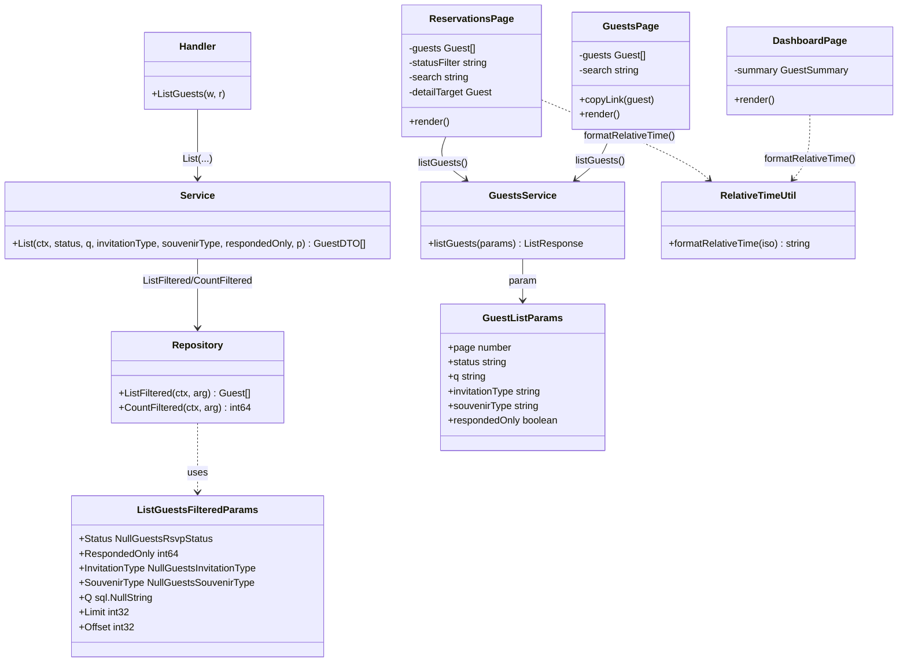
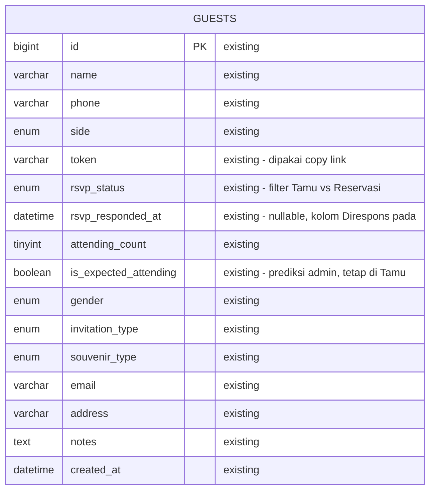
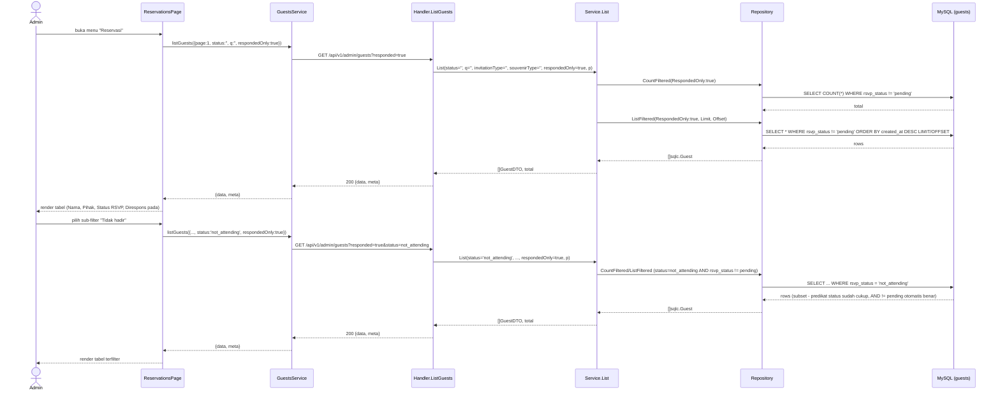

# PLAN.md — Pisah menu Tamu & Reservasi, perbaikan kartu Ringkasan

## 1. Requirement yang disepakati & klasifikasi

Permintaan dari user (via `/system-analyst`) mencakup 3 bagian, dengan klasifikasi intent
berbeda untuk masing-masing:

1. **Bug fix** — Kartu di halaman Ringkasan (Dashboard) harus tetap tampil dengan nilai **0**
   saat data belum ada, bukan diganti total oleh pesan "tidak ada apa-apa".
2. **New capability + enhancement** — "Tamu" dan "Reservasi" harus jadi 2 menu terpisah:
   - **Tamu** = master data tamu (identitas, kontak, klasifikasi undangan/souvenir, prediksi
     admin) — TIDAK menampilkan status RSVP.
   - **Reservasi** (menu baru) = tamu yang sudah mengisi form RSVP (submit jawaban apa pun),
     dipindahkan ke sini.
3. **Sudah terimplementasi, tidak ada kerja baru** — Action "copy link undangan" per tamu di
   master data. Ditemukan sudah ada di `GuestsPage.tsx:173-178,359-369` (tombol "Salin link",
   menyalin `${origin}/?guest=${token}`). Tetap dipertahankan di menu **Tamu** setelah
   pemisahan — tidak dipindah ke Reservasi.

### Keputusan terkunci (Step 0, dijawab via AskUserQuestion)

| # | Pertanyaan | Jawaban terkunci |
|---|---|---|
| 1 | Cakupan menu Reservasi: semua yang sudah merespons (Hadir/Tidak Hadir/Perlu Diingatkan) atau hanya yang konfirmasi Hadir? | **Semua yang sudah merespons** (`rsvp_status != 'pending'`) — konsisten dengan istilah "sudah konfirmasi" yang sudah dipakai di kartu Ringkasan (`total - pending`, `DashboardPage.tsx:83`). |
| 2 | Nama menu: "Kehadiran" atau "Reservasi"? | **Reservasi** — konsisten Bahasa Indonesia dengan mayoritas label sidebar lain (Ringkasan, Tamu, Pengaturan). |

### Keputusan desain tambahan (Step 4, ditentukan dari trace + prinsip blast-radius terkecil)

- **Reuse endpoint, bukan endpoint baru.** `GET /api/v1/admin/guests` sudah punya filter
  `status` (exact-match satu nilai, `guests.sql:22-36`). Ditambah SATU parameter boolean
  `responded_only` yang mengubah predikat jadi `rsvp_status != 'pending'` — dipakai bersama oleh
  halaman Tamu (`respondedOnly=false`, filter status disembunyikan dari UI) dan Reservasi
  (`respondedOnly=true`, dengan sub-filter status opsional ke salah satu dari 3 status yang
  sudah merespons). Alternatif "buat query/endpoint baru khusus Reservasi" ditolak karena
  menduplikasi logic filter yang identik (search, paginasi, escapeLike) tanpa kebutuhan nyata.
- **Reservasi read-only** (tanpa create/update/delete). Tidak ada permintaan admin mengubah
  status RSVP secara manual, dan tidak ada endpoint admin untuk itu hari ini — mengubah status
  RSVP tetap eksklusif lewat alur publik `PATCH /api/v1/public/guests/by-token/{token}/rsvp`
  (diisi tamu sendiri). Reservasi hanya menampilkan + detail.
- **Tamu dipangkas jadi master data murni**: kolom "Status" (badge RSVP + jumlah tamu) dan
  filter dropdown status dihapus dari `GuestsPage.tsx`; baris "Jumlah tamu (RSVP)" di modal
  detail dihapus. Baris "Diperkirakan hadir" (prediksi ADMIN, kolom `is_expected_attending`)
  TETAP ada di Tamu — itu data milik admin, bukan jawaban RSVP tamu, jadi termasuk master data.
- **Ringkasan tidak berubah datanya** — perbaikan murni di render frontend (hapus cabang
  render yang mengganti seluruh kartu dengan `EmptyState` saat `total === 0`). Tidak ada
  perubahan query/agregasi backend.
- **`formatRelativeTime` diekstrak ke util bersama** (`shared/utils/relative-time.ts`) karena
  Reservasi butuh format waktu relatif yang sama persis dengan kartu "Aktivitas RSVP terbaru"
  di Ringkasan (`DashboardPage.tsx:40-51`) — reuse, bukan duplikasi logic murni yang identik.
- **Tombol aksi di Ringkasan (`Kelola Tamu`) tetap mengarah ke Tamu**, tidak diubah ke
  Reservasi — tidak diminta, dan Ringkasan pada dasarnya soal kelola data tamu secara umum.

## 2. Scope

### In scope
- `apps/api/internal/modules/guest/infrastructure/queries/guests.sql` — tambah param
  `responded_only`.
- `apps/api/internal/modules/guest/application/service.go` — perluas `Service.List`.
- `apps/api/internal/modules/guest/presentation/handler.go` — baca query param `responded`.
- `apps/web/src/modules/admin/guests/services/guests.service.ts` — perluas `GuestListParams`.
- `apps/web/src/shared/constants/guests.ts` — tambah `RESPONDED_STATUS_OPTIONS`.
- `apps/web/src/shared/utils/relative-time.ts` — **baru**, ekstraksi `formatRelativeTime`.
- `apps/web/src/modules/admin/dashboard/pages/DashboardPage.tsx` — hapus cabang zero-state.
- `apps/web/src/modules/admin/guests/pages/GuestsPage.tsx` — hapus kolom/filter status RSVP.
- `apps/web/src/modules/admin/reservations/pages/ReservationsPage.tsx` — **baru**.
- `apps/web/src/app/routes/route-paths.ts`, `AdminLayout.tsx`, `AdminApp.tsx` — routing + nav.
- `knowledge/API.md` — dokumentasi param `responded` baru.
- File test terkait (lihat §5).

### Out of scope (dan alasannya)
- **Endpoint admin untuk mengubah status RSVP secara manual** — tidak diminta; RSVP tetap
  murni alur publik berbasis token.
- **Aksi WhatsApp/resend dari menu Reservasi** — tidak diminta; menu WhatsApp yang sudah ada
  tetap satu-satunya tempat kirim ulang QR.
- **Perubahan skema database** — tidak ada kolom/tabel baru; semua data yang dibutuhkan
  Reservasi (`rsvpStatus`, `attendingCount`, `rsvpRespondedAt`, dst.) sudah ada di tabel
  `guests` sejak migrasi 000002 & 000007.
- **Konversi seluruh routing admin ke `React.lazy`** — `AdminApp.tsx` saat ini memuat semua
  halaman secara eager (bukan lazy) meski `frontend-react.md` menyebut "lazy-loaded routes" —
  ini penyimpangan dokumentasi vs kode yang sudah ada SEBELUM plan ini, di luar scope tugas
  ini untuk diperbaiki; halaman baru (`ReservationsPage`) mengikuti pola eager-import yang
  sudah konsisten di file yang sama, supaya tidak jadi satu-satunya yang berbeda.

### Reuse inventory (diverifikasi baca kode)
- `Service.List` / `Repository.ListFiltered` / `Repository.CountFiltered` — diperluas, bukan
  dibuat baru (`service.go:202`, `repository.go:45,49`).
- Endpoint `GET /api/v1/admin/guests` — dipakai ulang oleh Reservasi, tidak ada endpoint baru
  (`router.go:90`).
- `guests.service.ts` → `listGuests()`, tipe `Guest` (sudah punya `rsvpStatus`,
  `attendingCount`, `rsvpRespondedAt`, `token`) — dipakai ulang penuh oleh `ReservationsPage`,
  tidak ada service module baru.
- Komponen UI: `Card`, `Table/Thead/Tbody/Tr/Th/Td`, `Badge`, `Modal`, `Pagination`, `Select`,
  `Input`, `EmptyState`, `ErrorState`, `TableSkeleton` (`@/shared/components/ui`,
  `@/shared/components/feedback/*`) — semua dipakai ulang, tidak ada komponen UI baru.
- `STATUS_LABEL`, `SIDE_LABEL` (`shared/constants/guests.ts`) — dipakai ulang di
  `ReservationsPage`.
- Action "copy link" (`GuestsPage.tsx:173-178`) — dipakai ulang APA ADANYA di Tamu, tidak
  disentuh.
- Pola `EmptyState`/`ErrorState`/skeleton loading & pagination — meniru persis pola yang sudah
  ada di `GuestsPage.tsx` untuk `ReservationsPage`, bukan pola baru.

## 3. Perubahan per layer

### 3.1 Backend — `guest` module

**`apps/api/internal/modules/guest/infrastructure/queries/guests.sql`** (§22-36) — tambah
parameter wajib `responded_only` ke `ListGuestsFiltered` dan `CountGuestsFiltered`:

```sql
-- name: ListGuestsFiltered :many
SELECT * FROM guests
WHERE (sqlc.narg(status) IS NULL OR rsvp_status = sqlc.narg(status))
  AND (sqlc.arg(responded_only) = FALSE OR rsvp_status != 'pending')
  AND (sqlc.narg(invitation_type) IS NULL OR invitation_type = sqlc.narg(invitation_type))
  AND (sqlc.narg(souvenir_type) IS NULL OR souvenir_type = sqlc.narg(souvenir_type))
  AND (sqlc.narg(q) IS NULL OR name LIKE sqlc.narg(q) OR phone LIKE sqlc.narg(q) OR email LIKE sqlc.narg(q))
ORDER BY created_at DESC
LIMIT ? OFFSET ?;

-- name: CountGuestsFiltered :one
SELECT COUNT(*) FROM guests
WHERE (sqlc.narg(status) IS NULL OR rsvp_status = sqlc.narg(status))
  AND (sqlc.arg(responded_only) = FALSE OR rsvp_status != 'pending')
  AND (sqlc.narg(invitation_type) IS NULL OR invitation_type = sqlc.narg(invitation_type))
  AND (sqlc.narg(souvenir_type) IS NULL OR souvenir_type = sqlc.narg(souvenir_type))
  AND (sqlc.narg(q) IS NULL OR name LIKE sqlc.narg(q) OR phone LIKE sqlc.narg(q) OR email LIKE sqlc.narg(q));
```

`sqlc.arg(responded_only)` (bukan `narg`) menghasilkan field `RespondedOnly bool` wajib (tidak
nullable) di `ListGuestsFilteredParams`/`CountGuestsFilteredParams` — jalankan `sqlc generate`
setelah ini (mengikuti `apps/api/sqlc.yaml` entry modul `guest`) untuk regenerasi
`infrastructure/sqlc/guests.sql.go`.

> **Koreksi ditemukan saat implementasi**: `sqlc.arg(responded_only) = FALSE` ternyata
> digenerate sqlc sebagai `RespondedOnly interface{}` (tipe tidak jelas, sama seperti kasus
> `TotalPax interface{}` di `dashboard-wa-rsvp/PLAN.md`), bukan `bool` seperti direncanakan.
> Query diubah jadi `CAST(sqlc.arg(responded_only) AS UNSIGNED) = 0 OR ...`, yang membuat sqlc
> menggenerate `RespondedOnly int64` (tipe konkret, bukan `bool`). `Service.List` tetap
> menerima parameter `respondedOnly bool` seperti rencana semula — dikonversi ke `int64` (0/1)
> tepat sebelum dipakai membangun `sqlc.CountGuestsFilteredParams`/`ListGuestsFilteredParams`,
> supaya signature publik `Service.List` tidak bocor detail representasi sqlc ke pemanggilnya.
> Lihat `service.go` komentar di atas `respondedOnlyArg`.

**`apps/api/internal/modules/guest/application/service.go`** (§202-246) — `Service.List`
menerima 1 parameter baru, diteruskan ke kedua panggilan repo:

```go
func (s *Service) List(ctx context.Context, status, q, invitationType, souvenirType string, respondedOnly bool, p pagination.Params) ([]GuestDTO, int, error) {
    // ...validasi statusArg/invitationTypeArg/souvenirTypeArg/qArg TETAP SAMA...
    total, err := s.repo.CountFiltered(ctx, sqlc.CountGuestsFilteredParams{
        Status: statusArg, RespondedOnly: respondedOnly, InvitationType: invitationTypeArg, SouvenirType: souvenirTypeArg, Q: qArg,
    })
    // ...
    rows, err := s.repo.ListFiltered(ctx, sqlc.ListGuestsFilteredParams{
        Status: statusArg, RespondedOnly: respondedOnly, InvitationType: invitationTypeArg, SouvenirType: souvenirTypeArg, Q: qArg,
        Limit: int32(p.Limit), Offset: int32(p.Offset()),
    })
    // ...
}
```

**`apps/api/internal/modules/guest/presentation/handler.go`** (§42-55) — `ListGuests` baca 1
query param baru dan teruskan:

```go
func (h *Handler) ListGuests(w http.ResponseWriter, r *http.Request) {
    p := pagination.Parse(r)
    status := r.URL.Query().Get("status")
    q := r.URL.Query().Get("q")
    invitationType := r.URL.Query().Get("invitation_type")
    souvenirType := r.URL.Query().Get("souvenir_type")
    respondedOnly := r.URL.Query().Get("responded") == "true"

    guests, total, err := h.service.List(r.Context(), status, q, invitationType, souvenirType, respondedOnly, p)
    // ...tetap sama
}
```

Tidak ada perubahan di `router.go` — route `GET /api/v1/admin/guests` (`router.go:90`) dipakai
ulang apa adanya, hanya menerima 1 query param opsional baru.

**Edge case yang sudah aman tanpa kode tambahan**: bila client mengirim
`responded=true&status=pending` (kombinasi kontradiktif), predikat AND menghasilkan set kosong
(`rsvp_status='pending' AND rsvp_status!='pending'` mustahil true) — bukan error, hanya daftar
kosong. UI Reservasi tidak pernah mengirim kombinasi ini karena dropdown sub-filternya hanya
berisi 3 status non-pending (§3.2), jadi kasus ini murni pertahanan-lapis, tidak butuh guard
eksplisit.

**Catatan volume data (Step 7 performance sanity check)**: kolom `rsvp_status` sudah punya
index (`idx_guests_rsvp_status`, `migrations/000002_create_guest_tables.up.sql:17`) sejak
awal. Query `ListGuestsFiltered`/`CountGuestsFiltered` tetap `LIMIT`/`OFFSET` (paginasi wajib,
tidak berubah dari yang sudah ada) dan tidak menambah loop/query per baris (bukan pola N+1).
Diasumsikan skala tabel `guests` sesuai konteks aplikasi (daftar tamu satu acara pernikahan —
puluhan hingga rendah-ribuan baris, bukan jutaan) — pada skala ini predikat tambahan
`rsvp_status != 'pending'` (baik dipakai sendiri maupun dikombinasi dengan `status = ?`) aman
memakai index yang sama tanpa perlu index baru, konsisten dengan query `status = ?` yang sudah
ada di jalur yang sama sebelum plan ini.

### 3.2 Frontend — shared & constants

**`apps/web/src/modules/admin/guests/services/guests.service.ts`** — `GuestListParams` +1
field, `listGuests()` kirim param baru bila true:

```ts
export interface GuestListParams {
  page: number
  status: string
  q: string
  invitationType: string
  souvenirType: string
  respondedOnly: boolean
}

export async function listGuests(params: GuestListParams): Promise<ListResponse> {
  const { page, status, q, invitationType, souvenirType, respondedOnly } = params
  const res = await httpClient.get<ApiListResponse>('/api/v1/admin/guests', {
    params: {
      page,
      limit: PAGE_SIZE,
      ...(status ? { status } : {}),
      ...(q ? { q } : {}),
      ...(invitationType ? { invitation_type: invitationType } : {}),
      ...(souvenirType ? { souvenir_type: souvenirType } : {}),
      ...(respondedOnly ? { responded: 'true' } : {}),
    },
  })
  // ...mapping meta tetap sama
}
```

**`apps/web/src/shared/constants/guests.ts`** — tambah 1 konstanta untuk sub-filter status di
Reservasi (semua `STATUS_OPTIONS` KECUALI `pending`):

```ts
export const RESPONDED_STATUS_OPTIONS: RsvpStatus[] = ['attending', 'not_attending', 'remind_later']
```

**`apps/web/src/shared/utils/relative-time.ts`** (baru) — ekstraksi persis dari
`DashboardPage.tsx:36-51`, tanpa perubahan logic:

```ts
const rtf = new Intl.RelativeTimeFormat('id', { numeric: 'auto' })

export function formatRelativeTime(iso: string): string {
  const then = new Date(iso).getTime()
  const diffSeconds = Math.round((then - Date.now()) / 1000)
  const abs = Math.abs(diffSeconds)
  if (abs < 60) return rtf.format(diffSeconds, 'second')
  const diffMinutes = Math.round(diffSeconds / 60)
  if (Math.abs(diffMinutes) < 60) return rtf.format(diffMinutes, 'minute')
  const diffHours = Math.round(diffMinutes / 60)
  if (Math.abs(diffHours) < 24) return rtf.format(diffHours, 'hour')
  const diffDays = Math.round(diffHours / 24)
  return rtf.format(diffDays, 'day')
}
```

### 3.3 Frontend — Ringkasan (bug fix)

**`apps/web/src/modules/admin/dashboard/pages/DashboardPage.tsx`**:
- Hapus definisi lokal `rtf`/`formatRelativeTime` (§36-51), ganti dengan
  `import { formatRelativeTime } from '@/shared/utils/relative-time'`.
- Hapus seluruh cabang `!loading && !error && summary && summary.total === 0` (§183-197) yang
  merender `EmptyState` pengganti kartu.
- Ubah kondisi render blok KPI+breakdown+aktivitas (§199) dari
  `!loading && !error && summary && summary.total > 0` menjadi `!loading && !error && summary`
  — dengan ini kartu SELALU dirender begitu `summary` berhasil dimuat, terlepas dari nilai
  `total`. Karena setiap baris breakdown sudah dijaga `row.value > 0 && total > 0` sebelum
  menghitung lebar bar (`DashboardPage.tsx:128`) dan `segments` (nilainya subset dari `total`,
  otomatis 0 saat `total===0`) sudah dijaga `seg.value > 0` (§229) — tidak ada risiko `NaN`
  dari pembagian saat `total===0` (sudah diverifikasi dari kode yang ada, bukan asumsi).
- Import `EmptyState` jadi tidak terpakai di file ini (satu-satunya pemakaian ada di cabang
  yang dihapus) — hapus importnya.
- Header aksi ("Kelola Tamu", §148-157) TIDAK berubah — tetap CTA yang terlihat meski
  `total===0`, jadi tidak perlu CTA tambahan di dalam kartu.

### 3.4 Frontend — Tamu (dipangkas jadi master data murni)

**`apps/web/src/modules/admin/guests/pages/GuestsPage.tsx`**:
- Hapus state `status`/`setStatus` (§52) dan `<Select>` filter status (§217-232).
- Hapus kolom tabel `<Th>Status</Th>` dan `<Td>` badge RSVP + `attendingCount` (§293,341-348).
- Hapus baris "Jumlah tamu (RSVP)" di modal detail (§551-556) — baris "Diperkirakan hadir"
  (§547-550) TETAP ada (itu data admin, bukan RSVP tamu).
- `hasFilter` (§180) drop term `status !== ''`.
- Panggilan `listGuests(...)` (§83) kirim `status: ''` tetap (variabel dihapus, literal `''`)
  dan `respondedOnly: false`.
- `<TableSkeleton rows={6} cols={6} />` (§272) → `cols={5}` (kolom tersisa: Nama, Pihak, Jenis
  undangan, Souvenir, Aksi).
- Tombol "Salin link" (§359-369) dan seluruh fungsi `copyLink` (§173-178) **tidak disentuh**.

### 3.5 Frontend — Reservasi (menu baru)

**`apps/web/src/app/routes/route-paths.ts`** — tambah:
```ts
reservations: '/reservations',
```
(diletakkan setelah `guests`, sebelum `whatsapp`, mengikuti urutan sidebar §3.6)

**`apps/web/src/modules/admin/reservations/pages/ReservationsPage.tsx`** (baru) — struktur
meniru `GuestsPage.tsx` tapi dipangkas (read-only, tanpa form tambah/ubah/hapus):

- State: `guests`, `total`, `page`, `statusFilter` (sub-filter, default `''`), `search`
  (debounced 300ms — pola sama `GuestsPage.tsx:74-79`), `loading`, `error`, `reloadToken`,
  `detailTarget`.
- Efek load: `listGuests({ page, status: statusFilter, q: debouncedSearch, invitationType: '', souvenirType: '', respondedOnly: true })`.
- Toolbar: `Input` pencarian (sama placeholder pattern) + `Select` sub-filter status berisi
  `''` ("Semua status") + `RESPONDED_STATUS_OPTIONS.map(s => STATUS_LABEL[s])` — TIDAK ada
  filter jenis undangan/souvenir (bukan konteks Reservasi).
- Tabel kolom: Nama (+ badge "Diperkirakan tidak hadir" bila `!isExpectedAttending`, pola sama
  `GuestsPage.tsx:310-317` — berguna sebagai konteks saat melihat siapa yang ternyata
  berbeda dari prediksi admin), Pihak (`SIDE_LABEL`), Status RSVP (`Badge status={guest.rsvpStatus}` +
  `{attendingCount} org` bila `attending`, pola sama `GuestsPage.tsx:341-348`), Direspons pada
  (`formatRelativeTime(guest.rsvpRespondedAt)` — nilai selalu ada karena hanya tamu dengan
  `rsvp_responded_at IS NOT NULL` yang muncul di sini), Aksi (tombol "Detail" saja).
- EmptyState (belum ada yang merespons — beda pesan dari filter kosong vs benar-benar 0,
  pola sama `GuestsPage.tsx:276-282`), ErrorState + retry, TableSkeleton, Pagination — semua
  reuse komponen yang sama dengan pola yang sama.
- Modal Detail (reuse `Modal` + `dl` pattern dari `GuestsPage.tsx:527-560`): Email, Telepon,
  Alamat, Catatan (info kontak untuk keperluan logistik), lalu Status RSVP, Jumlah tamu (bila
  attending), Direspons pada.
- **Tidak ada**: tombol Tambah, Ubah, Hapus, Salin link (itu domain Tamu).

**`apps/web/src/modules/admin/shared/AdminLayout.tsx`** — tambah 1 entry di `NAV_ITEMS`
(§13-75) setelah entry `guests` (§44-53), sebelum entry `whatsapp` (§54-63):
```ts
{
  to: ROUTE_PATHS.reservations,
  label: 'Reservasi',
  end: false,
  icon: (active) => (
    <svg className={`w-4.5 h-4.5 transition-colors ${active ? 'text-blue-400' : 'text-slate-400 group-hover:text-slate-200'}`} fill="none" stroke="currentColor" viewBox="0 0 24 24">
      <path strokeLinecap="round" strokeLinejoin="round" strokeWidth="2" d="M9 12l2 2 4-4m6 2a9 9 0 11-18 0 9 9 0 0118 0z" />
    </svg>
  ),
},
```

**`apps/web/src/modules/admin/app/AdminApp.tsx`** — tambah import
`import ReservationsPage from '@/modules/admin/reservations/pages/ReservationsPage'` dan route
`<Route path={ROUTE_PATHS.reservations} element={<ReservationsPage />} />` di dalam
`<Route element={<AdminLayout />}>` (§30-37), setelah route `guests` (§34).

### 3.6 Dokumentasi

**`knowledge/API.md`** (§34-38) — tambahkan param `responded` (`true` = hanya tamu yang sudah
merespons, `rsvp_status != 'pending'`) ke daftar query param opsional `GET /api/v1/admin/guests`
yang sudah didokumentasikan di sana.

## 4. Task list

**Backend**
1. [x] `guests.sql` — tambah param `responded_only` ke `ListGuestsFiltered` & `CountGuestsFiltered` (§3.1)
2. [x] Jalankan `sqlc generate` di `apps/api` — regenerasi `infrastructure/sqlc/guests.sql.go`
3. [x] `service.go` — perluas `Service.List` dgn parameter `respondedOnly bool` (§3.1)
4. [x] `handler.go` — `ListGuests` baca query param `responded` (§3.1)
5. [x] `knowledge/API.md` — dokumentasikan param `responded` baru (§3.6)

**Frontend — shared**
6. [x] `guests.service.ts` — perluas `GuestListParams` + `listGuests()` (§3.2)
7. [x] `constants/guests.ts` — tambah `RESPONDED_STATUS_OPTIONS` (§3.2)
8. [x] Buat `shared/utils/relative-time.ts` — ekstraksi `formatRelativeTime` (§3.2)

**Frontend — Ringkasan (bug fix)**
9. [x] `DashboardPage.tsx` — hapus cabang zero-state, selalu render kartu, pakai util bersama (§3.3)
10. [x] `DashboardPage.test.tsx` — ganti test "tampilkan EmptyState" jadi "kartu tetap tampil dgn nilai 0" (§5)

**Frontend — Tamu (pangkas ke master data)**
11. [x] `GuestsPage.tsx` — hapus filter/kolom status RSVP, baris RSVP di detail modal (§3.4)
12. [x] `GuestsPage.test.tsx` — sesuaikan assertion `listGuests` (tambah `respondedOnly: false`) (§5)

**Frontend — Reservasi (baru)**
13. [x] `route-paths.ts` — tambah `reservations` (§3.5)
14. [x] `AdminLayout.tsx` — tambah nav item "Reservasi" (§3.5)
15. [x] Buat `reservations/pages/ReservationsPage.tsx` (§3.5)
16. [x] `AdminApp.tsx` — import & daftarkan route (§3.5)
17. [x] Buat `reservations/pages/ReservationsPage.test.tsx` (§5)

Urutan di atas sudah memperhitungkan dependency: SQL→sqlc→service→handler sebelum frontend
memanggilnya; util bersama (T8) sebelum dipakai Dashboard (T9) & Reservasi (T15); route-paths
(T13) sebelum dipakai nav (T14) & routing (T16); halaman (T15) sebelum registrasi route (T16)
dan test-nya (T17).

## 5. Tes yang perlu ditulis

Konvensi proyek (dikonfirmasi dari kode yang ada): fungsi murni/tanpa DB diuji unit test
langsung; kode yang menyentuh DB/HTTP diverifikasi lewat smoke test manual terhadap server
nyata (tidak ada mocking `*sql.DB` di codebase ini). `Service.List` menyentuh DB dan tidak
punya unit test hari ini (dikonfirmasi: tidak ada pemanggil `.List(` di
`guest/application/*_test.go`) — perluasannya cukup diverifikasi lewat smoke test manual
(`GET /api/v1/admin/guests?responded=true`, `...&responded=true&status=attending`, dst.),
konsisten dengan konvensi yang sudah ada, bukan gap baru yang diperkenalkan plan ini.

**Frontend (Vitest + React Testing Library)**
- `DashboardPage.test.tsx`: ganti test `'semua nol -> tampilkan EmptyState, bukan bar dengan NaN'`
  menjadi assert kartu KPI tetap dirender dengan nilai `'0'` (4x, via `getAllByRole('definition')`)
  saat `total===0`, teks `'Belum ada tamu'` TIDAK ada, dan tetap tidak ada teks `/NaN/`.
- `GuestsPage.test.tsx`: tambahkan `respondedOnly: false` ke semua assertion
  `toHaveBeenCalledWith` pada `listGuests` yang sudah ada (4 lokasi: baris 61, 67, 129, 135).
- `ReservationsPage.test.tsx` (baru):
  - Mount awal memanggil `listGuests` dengan `respondedOnly: true, status: ''`.
  - Baris tamu berstatus `attending` menampilkan badge + `"{n} org"`.
  - Memilih sub-filter status memanggil ulang `listGuests` dengan `status` terpilih (tetap
    `respondedOnly: true`).
  - Daftar kosong (belum ada yang merespons) → `EmptyState` dengan pesan sesuai (beda pesan
    saat difilter vs benar-benar kosong, meniru pola `GuestsPage.test.tsx`).
  - Gagal memuat → `ErrorState` dengan tombol "Coba lagi".
  - Klik "Detail" membuka modal berisi info kontak + status RSVP + waktu respons.
  - TIDAK ada tombol "+ Tambah", "Ubah", "Hapus", atau "Salin link" di halaman ini.

## 6. Diagram

### 6.1 Class diagram



### 6.2 ERD

Tidak ada tabel/kolom baru — semua kolom yang dipakai plan ini sudah ada sejak migrasi
`000002_create_guest_tables` dan `000007_add_guest_attendance_fields`. Ditampilkan untuk
konfirmasi bahwa data source tidak berubah:



### 6.3 Sequence diagram — buka menu Reservasi


