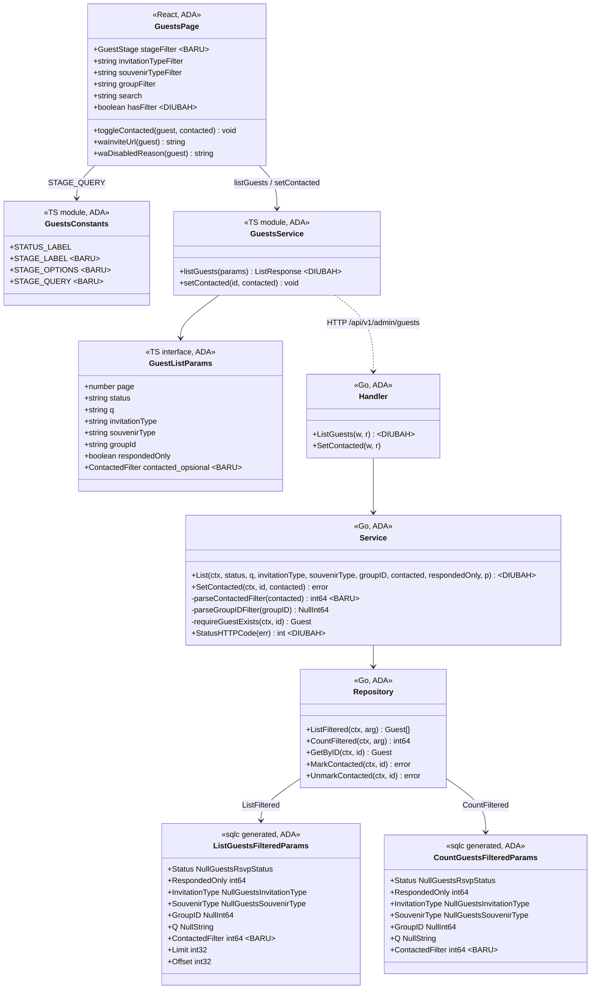
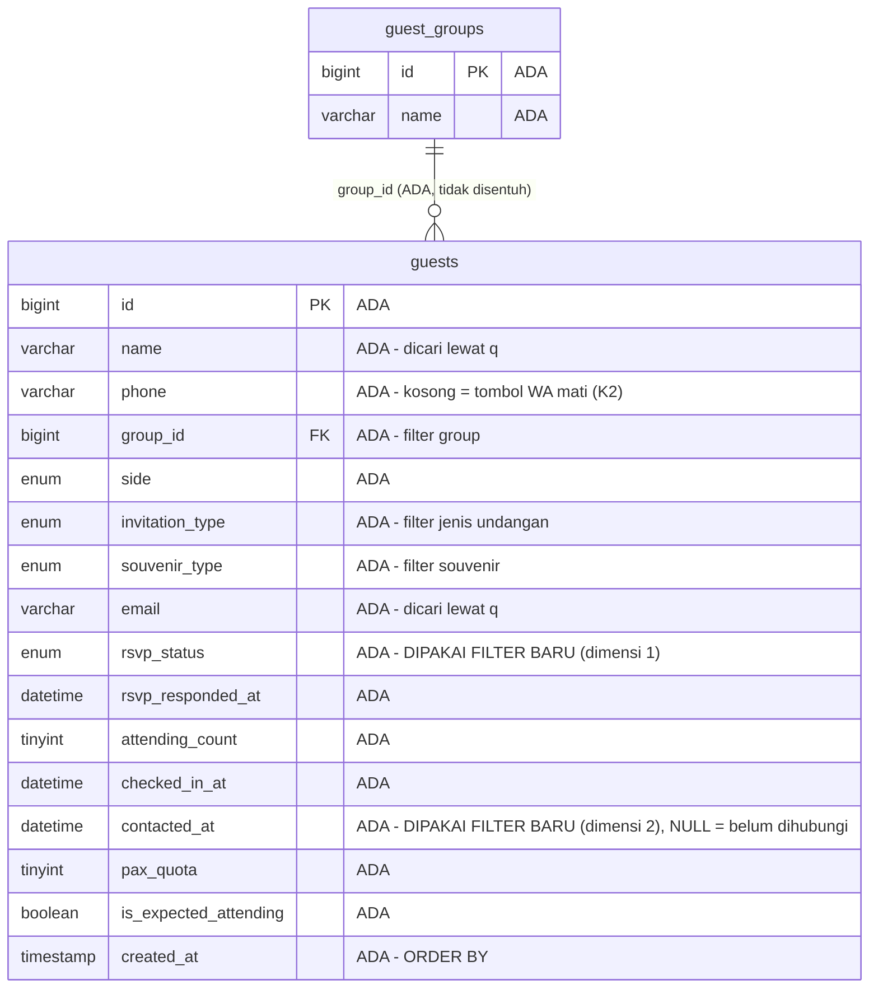

# Filter Tahap Undangan di `/admin/guests`

Analisis & rencana implementasi — modul `guest` (backend) + `modules/admin/guests` (frontend).

---

## 1. Requirement yang disepakati

Halaman `/admin/guests` mendapat **satu dropdown filter baru** yang menyaring tamu
berdasarkan *tahap undangan* — gabungan dua dimensi yang hari ini tersimpan terpisah:
apakah tamu sudah dihubungi (`guests.contacted_at`) dan apa jawaban RSVP-nya
(`guests.rsvp_status`).

**Klasifikasi: Enhancement.** Halaman ini sudah punya 3 filter (jenis undangan,
souvenir, group) + pencarian, tetapi parameter `status` ke API dikirim kosong secara
hardcode ([GuestsPage.tsx:201](../../../apps/web/src/modules/admin/guests/pages/GuestsPage.tsx#L201)) —
kapasitas filter status memang belum pernah dipakai di halaman ini. Seluruh data yang
dibutuhkan sudah ada di tabel; tidak ada kolom maupun tabel baru.

### 1.1 Lima kategori & definisinya

| Label di UI | Definisi (SQL) |
|---|---|
| Semua status | tanpa filter |
| Belum diundang | `rsvp_status = 'pending' AND contacted_at IS NULL` |
| Menunggu konfirmasi | `rsvp_status = 'pending' AND contacted_at IS NOT NULL` |
| Konfirmasi hadir | `rsvp_status = 'attending'` |
| Konfirmasi tidak hadir | `rsvp_status = 'not_attending'` |
| Minta diingatkan kembali | `rsvp_status = 'remind_later'` |

Kelima kategori adalah **partisi ketat**: setiap baris `guests` jatuh ke tepat satu
kategori, dan jumlah kelimanya selalu sama dengan total tamu. Ini konsekuensi langsung
dari aturan "jawaban tamu menang" (K1) — `contacted_at` hanya menjadi pembeda di dalam
`pending`, tidak pernah di luar itu.

---

## 2. Keputusan yang dikunci

### 2.1 Keputusan Step 0 — dijawab user

| # | Pertanyaan | Jawaban user |
|---|---|---|
| **D1** | Tamu yang menjawab "Tidak hadir" — ikut "sudah konfirmasi"? | **Dipisah jadi 2 opsi**: "Konfirmasi hadir" dan "Konfirmasi tidak hadir" berdiri sendiri. Keduanya sama-sama sudah menjawab, tapi konsekuensi operasionalnya (catering, souvenir, seating) berbeda jauh. |
| **D2** | Tamu yang sudah menjawab RSVP tapi `contacted_at` masih kosong masuk kategori mana? | **Jawaban tamu menang.** Tamu yang sudah menjawab apa pun jelas sudah diundang, jadi ia masuk kategori jawabannya — bukan "Belum diundang". "Belum diundang" = belum dihubungi **DAN** belum menjawab. |
| **D3** | Wording label | **Berbasis tahapan**: Belum diundang / Menunggu konfirmasi / Konfirmasi hadir / Konfirmasi tidak hadir / Minta diingatkan kembali. |
| **D4** | Tampilkan angka jumlah per kategori? | **Tidak.** Dropdown polos. Halaman Dashboard sudah punya ringkasan angka lewat `GET /guests/summary`, dan jumlah hasil filter tetap terbaca dari `meta.total`. Endpoint summary **tidak disentuh** rencana ini. |

### 2.2 Keputusan Step 4 — dijawab user setelah trace

| # | Pertanyaan | Jawaban user |
|---|---|---|
| **D5** | Tamu tanpa nomor HP / undangan fisik tidak punya cara apa pun ditandai "sudah diundang" (lihat K2) | **Tambah tombol tandai manual** di baris tamu yang tombol WhatsApp-nya mati. Backend nol perubahan — endpoint `PATCH /guests/{id}/contacted` sudah ada dan sudah dipanggil halaman ini. |
| **D6** | Bentuk API | **Reuse `status` + tambah parameter `contacted`.** Dropdown memetakan satu pilihan ke pasangan (`status`, `contacted`). Parameter `status` sudah jalan end-to-end dan sudah dipakai halaman Reservasi, jadi yang benar-benar baru hanya satu klausa `contacted` di SQL. |

### 2.3 Keputusan teknis analis (bukan pilihan user)

| # | Keputusan | Alasan |
|---|---|---|
| **D7** | Kode filter `contacted` dikirim ke SQL sebagai **integer** lewat `CAST(? AS UNSIGNED)`, bukan bool atau string | Pola yang sudah TERBUKTI di repo ini: [service.go:390-398](../../../apps/api/internal/modules/guest/application/service.go#L390-L398) mencatat bahwa `responded_only` versi bool polos membuat sqlc engine MySQL meng-infer tipe `interface{}`. `CAST(... AS UNSIGNED)` menghasilkan `int64` yang deterministik. Nilai: `0` = tanpa filter, `1` = sudah dihubungi, `2` = belum dihubungi. |
| **D8** | **TIDAK menambah index** pada `guests.contacted_at` | [Migration 000018](../../../apps/api/migrations/000018_add_guest_contacted_at.up.sql) menjanjikan index "ditambahkan bersama filter itu" — ini keputusan eksplisit atas janji tersebut, bukan pengabaian. Alasannya: lewat UI, `contacted_at` **tidak pernah** menjadi predikat tunggal — ia selalu berpasangan dengan `rsvp_status = 'pending'` (lihat §1.1), dan `idx_guests_rsvp_status` (migration 000002) sudah memimpin kolom itu. Lihat §8 untuk asumsi volume. |
| **D9** | Field `contacted` di `GuestListParams` (frontend) dibuat **opsional**, menyimpang dari 7 field lain yang wajib | Ada 18 literal `listGuests({...})` tersebar di 6 berkas termasuk `ReservationsPage` yang berada di luar scope. Membuatnya wajib memaksa ~16 suntingan mekanis tanpa manfaat. Alasan asli bentuk objek (keputusan #19 guest-fields-admin-layout) adalah mencegah *tertukarnya argumen posisional* — itu sudah dijamin oleh bentuk objeknya sendiri, bukan oleh keharusan tiap field. |
| **D10** | Signature `Service.List` bertambah satu parameter string posisional (jadi 6 string berurutan), **tidak** direfaktor jadi struct | Pemanggilnya hanya SATU ([handler.go:55](../../../apps/api/internal/modules/guest/presentation/handler.go#L55)), sehingga risiko tertukar nyata-nyata kecil. Refaktor ke struct adalah pekerjaan yang tidak diminta. Dicatat di sini sebagai trade-off yang diterima sadar, bukan yang terlewat. |
| **D11** | `contacted` bernilai salah bentuk **ditolak 400**, tidak didiamkan | Menyimpang dari precedent `responded` yang memakai `== "true"` dan mendiamkan sisanya ([handler.go:53](../../../apps/api/internal/modules/guest/presentation/handler.go#L53)). Untuk `responded`, salah nilai berarti "tampilkan semua" yang tidak berbahaya. Untuk `contacted`, mendiamkan `contacted=flase` (salah ketik) membuat daftar "Belum diundang" diam-diam menampilkan SELURUH tamu — filter rusak yang terlihat berhasil. Pola penolakan mengikuti `parseGroupIDFilter` ([service_groups.go:291](../../../apps/api/internal/modules/guest/application/service_groups.go#L291)). |

---

## 3. Hasil trace

### 3.1 Jalur yang dilalui (terverifikasi baris per baris)

```
/admin/guests
  └─ AdminApp.tsx:54          <Route path={ROUTE_PATHS.guests} element={<GuestsPage />} />
     └─ GuestsPage.tsx:201    listGuests({ page, status: '', q, invitationType, souvenirType, groupId, respondedOnly: false })
        └─ guests.service.ts:142 GET /api/v1/admin/guests  (?status&q&invitation_type&souvenir_type&group_id&responded)
           └─ handler.go:43       ListGuests — baca query param
              └─ service.go:352   Service.List — validasi + rakit argumen sqlc
                 └─ repository.go:85/89  ListFiltered / CountFiltered
                    └─ guests.sql:63/74  ListGuestsFiltered / CountGuestsFiltered
                       └─ tabel `guests`
```

### 3.2 Data source — **tanpa perubahan**

Kedua kolom yang dibutuhkan sudah ada dan sudah terisi di produksi:

- `rsvp_status ENUM('pending','attending','not_attending','remind_later') NOT NULL DEFAULT 'pending'` +
  `KEY idx_guests_rsvp_status` — [migration 000002](../../../apps/api/migrations/000002_create_guest_tables.up.sql)
- `contacted_at DATETIME NULL` (NULL = belum dihubungi) — [migration 000018](../../../apps/api/migrations/000018_add_guest_contacted_at.up.sql)

**Tidak ada migration baru dalam rencana ini.** Tidak ada kolom baru, tidak ada tabel
baru, tidak ada index baru (D8).

### 3.3 Temuan yang mengubah bentuk rencana

**K1 — `contacted_at` dan `rsvp_status` bisa saling bertentangan.**
`contacted_at` hanya terisi saat admin menekan "Kirim Undangan", sedangkan `rsvp_status`
diisi tamu lewat link. Admin yang mengirim undangan di luar aplikasi (japri, lisan,
undangan fisik) meninggalkan `contacted_at` kosong walau tamunya sudah menjawab. D2
menyelesaikannya: jawaban tamu adalah bukti terkuat bahwa ia sudah diundang.

**K2 — ada tamu yang MUSTAHIL ditandai "sudah diundang".**
Satu-satunya penulis `contacted_at = NOW()` di seluruh frontend adalah `onClick` pada
tautan WhatsApp ([GuestsPage.tsx:645](../../../apps/web/src/modules/admin/guests/pages/GuestsPage.tsx#L645)).
Tautan itu hanya dirender bila `waInviteUrl(guest)` mengembalikan URL, dan fungsi itu
mengembalikan `null` ketika nomor HP kosong ([GuestsPage.tsx:318-320](../../../apps/web/src/modules/admin/guests/pages/GuestsPage.tsx#L318-L320)).
Jalur sebaliknya ada (badge "Dihubungi" bisa diklik untuk membatalkan,
[GuestsPage.tsx:541-553](../../../apps/web/src/modules/admin/guests/pages/GuestsPage.tsx#L541-L553)),
tapi jalur menandai secara manual **tidak ada**. Tanpa D5, tamu undangan fisik akan
permanen tersangkut di "Belum diundang" dan filter ini justru menyesatkan.

**K3 — `toggleContacted` sengaja tidak memuat ulang daftar.**
[GuestsPage.tsx:104-106](../../../apps/web/src/modules/admin/guests/pages/GuestsPage.tsx#L104-L106)
mencatat alasannya: reload mengembalikan halaman ke posisi awal dan menghapus filter yang
sedang dipakai admin. Konsekuensi baru setelah filter ini ada: saat filter "Belum
diundang" aktif lalu admin menandai satu tamu, **baris itu tetap terlihat** (badge-nya
berubah jadi "Dihubungi") sampai daftar dimuat ulang. **Perilaku ini dipertahankan** —
untuk daftar kerja yang sedang disisir, baris yang lenyap seketika justru membuat admin
kehilangan jejak. Angka "Total N tamu" juga tidak ikut berubah, dengan alasan yang sama.

**K4 — parameter `status` sudah hidup, tinggal dipakai.**
Bukan kapasitas mati: `ReservationsPage` sudah mengirimnya ([ReservationsPage.tsx:49](../../../apps/web/src/modules/admin/reservations/pages/ReservationsPage.tsx#L49)),
dan backend sudah memvalidasinya lewat `validStatuses` ([service.go:353-358](../../../apps/api/internal/modules/guest/application/service.go#L353-L358)).
Inilah yang membuat D6 jauh lebih murah dari alternatifnya.

**K5 — `ListGuestsFilteredParams` punya pemanggil kedua.**
`SearchForCheckin` ([service.go:872](../../../apps/api/internal/modules/guest/application/service.go#L872))
memakai struct yang sama dengan literal bernama-field. Field `ContactedFilter` yang baru
akan ber-zero-value `0` di sana, yang persis berarti "tanpa filter" (D7) — pencarian
check-in tidak berubah perilakunya sama sekali. Ini bukan kebetulan yang beruntung; itu
alasan kode `0` dipilih sebagai "tanpa filter" dan bukan `1`.

---

## 4. Scope

### 4.1 In scope

**Backend — modul `guest`:**
- `apps/api/internal/modules/guest/infrastructure/queries/guests.sql` — klausa `contacted_filter` di `ListGuestsFiltered` (:63) & `CountGuestsFiltered` (:74)
- `apps/api/internal/modules/guest/infrastructure/sqlc/guests.sql.go` — **hasil generate**, jangan disunting tangan
- `apps/api/internal/modules/guest/application/service.go` — `ErrInvalidContactedFilter` (:19-24), `parseContactedFilter` + konstanta kode, `Service.List` (:352), `StatusHTTPCode` (:951)
- `apps/api/internal/modules/guest/presentation/handler.go` — `ListGuests` (:43) baca query param `contacted`
- `apps/api/internal/modules/guest/application/contacted_test.go` — tes `parseContactedFilter`

**Frontend — `modules/admin/guests`:**
- `apps/web/src/shared/constants/guests.ts` — kosakata + label + peta kategori → pasangan parameter
- `apps/web/src/modules/admin/guests/services/guests.service.ts` — field `contacted` di `GuestListParams` + pengiriman param
- `apps/web/src/modules/admin/guests/pages/GuestsPage.tsx` — state filter, dropdown, `hasFilter`, tombol "Tandai sudah diundang"
- `apps/web/src/modules/admin/guests/services/guests.service.test.ts` — tes pengiriman param
- `apps/web/src/modules/admin/guests/pages/GuestsPage.test.tsx` — tes dropdown & tombol manual

### 4.2 Out of scope

| Tidak disentuh | Alasan |
|---|---|
| `GET /admin/guests/summary` & `Service.Summary` | D4 — tidak ada angka per kategori. |
| Halaman Reservasi (`ReservationsPage.tsx`) | Permintaan menyebut `/admin/guests`. Halaman itu punya sub-filter status sendiri yang sudah berjalan, dan D9 memastikan ia tidak perlu disunting sama sekali. |
| Migration / skema database | §3.2 — kedua kolom sudah ada; D8 menutup pertanyaan index. |
| Endpoint `PATCH /guests/{id}/contacted` | D5 — sudah ada dan sudah dipakai; yang kurang hanya tombol pemicunya di UI. |
| Sinkronisasi filter ke URL query string (deep-link / tombol Back) | Tiga filter yang sudah ada murni `useState` tanpa sinkronisasi URL. Menambahkannya hanya untuk filter baru akan membuat satu halaman punya dua perilaku berbeda. |
| Refaktor `Service.List` jadi struct parameter | D10. |
| Modul lain (`content`, `whatsapp`, `auth`) | Tidak ada satu pun jalur data baru yang melintasi batas modul; seluruh perubahan berada di dalam modul `guest`. |

### 4.3 Inventaris reuse (terverifikasi dengan membaca kode)

| Yang dipakai ulang | Lokasi | Untuk apa |
|---|---|---|
| Parameter & validasi `status` | [service.go:353-358](../../../apps/api/internal/modules/guest/application/service.go#L353-L358), `validStatuses` [service.go:68](../../../apps/api/internal/modules/guest/application/service.go#L68) | Dimensi RSVP dari pasangan filter — **nol perubahan** |
| Pola `CAST(sqlc.arg(...) AS UNSIGNED)` | [guests.sql:66](../../../apps/api/internal/modules/guest/infrastructure/queries/guests.sql#L66) (`responded_only`) | Bentuk klausa `contacted_filter` (D7) |
| Pola `parseGroupIDFilter` | [service_groups.go:291](../../../apps/api/internal/modules/guest/application/service_groups.go#L291) | Bentuk `parseContactedFilter`: string kosong = tanpa filter, nilai salah = error 400 |
| `StatusHTTPCode` cabang 400 | [service.go:955-962](../../../apps/api/internal/modules/guest/application/service.go#L955-L962) | Memetakan error baru ke 400, bukan 500 |
| Komponen `Select` + pola `setPage(1)` | [GuestsPage.tsx:427-475](../../../apps/web/src/modules/admin/guests/pages/GuestsPage.tsx#L427-L475) | Dropdown baru mengikuti 3 dropdown yang sudah ada persis |
| `STATUS_LABEL` / `STATUS_OPTIONS` | [shared/constants/guests.ts](../../../apps/web/src/shared/constants/guests.ts) | Tempat kosakata baru ditaruh — satu berkas, bukan tersebar |
| `setContacted()` | [guests.service.ts:198](../../../apps/web/src/modules/admin/guests/services/guests.service.ts#L198) | Dipanggil tombol tandai manual — **nol perubahan** |
| `toggleContacted()` | [GuestsPage.tsx:108](../../../apps/web/src/modules/admin/guests/pages/GuestsPage.tsx#L108) | Handler tombol tandai manual, lengkap dengan penanganan gagal + toast — **nol perubahan** |
| Rantai backend `PATCH /contacted` — `Handler.SetContacted` ([handler.go:142](../../../apps/api/internal/modules/guest/presentation/handler.go#L142)), `Service.SetContacted` + `requireGuestExists` (yang memanggil `Repository.GetByID`) ([service.go:314-322](../../../apps/api/internal/modules/guest/application/service.go#L314-L322)), `Repository.MarkContacted`/`UnmarkContacted` ([repository.go:45](../../../apps/api/internal/modules/guest/infrastructure/repository.go#L45), [:49](../../../apps/api/internal/modules/guest/infrastructure/repository.go#L49)) | modul `guest` | Seluruh jalur tandai/batal-tandai sudah lengkap termasuk penanganan baris yang sudah dihapus (404) — **nol perubahan**. Inilah yang membuat D5 hanya berbiaya satu tombol. |
| `waDisabledReason()` | [GuestsPage.tsx:337](../../../apps/web/src/modules/admin/guests/pages/GuestsPage.tsx#L337) | Tetap dipakai tombol WA nonaktif yang berdampingan dengan tombol baru |

**Yang benar-benar baru:** satu klausa SQL, satu fungsi parse + satu error domain di Go,
satu blok kosakata di constants, satu dropdown, satu tombol. Tidak ada komponen UI baru,
tidak ada endpoint baru, tidak ada tabel baru.

---

## 5. Perubahan per lapisan

### 5.1 SQL — `queries/guests.sql`

Satu klausa identik disisipkan ke **dua** query (`ListGuestsFiltered` dan
`CountGuestsFiltered`), tepat setelah baris `responded_only`. Keduanya wajib sama persis:
kalau hanya satu yang disunting, jumlah halaman paginasi tidak akan cocok dengan isinya.

```sql
  AND (CAST(sqlc.arg(contacted_filter) AS UNSIGNED) = 0
       OR (CAST(sqlc.arg(contacted_filter) AS UNSIGNED) = 1 AND contacted_at IS NOT NULL)
       OR (CAST(sqlc.arg(contacted_filter) AS UNSIGNED) = 2 AND contacted_at IS NULL))
```

Harapannya: sqlc menyatukan tiga kemunculan `sqlc.arg(contacted_filter)` menjadi **satu**
field struct (`ContactedFilter int64`) yang diteruskan tiga kali secara posisional.
Perilaku itu sudah terbukti untuk parameter bernama di query yang sama — `arg.Status`
diteruskan dua kali dari satu field di
[guests.sql.go:60-61](../../../apps/api/internal/modules/guest/infrastructure/sqlc/guests.sql.go#L60-L61)
— tapi di sana bentuknya `sqlc.narg` dan dipakai dua kali, bukan `sqlc.arg` tiga kali.
Karena itu T2 mewajibkan hasil generate diperiksa, bukan diasumsikan.

### 5.2 Go — `application/service.go`

```go
// Kode filter contacted_at. 0 dipilih sebagai "tanpa filter" supaya zero
// value struct sqlc otomatis berarti tidak menyaring - itulah yang membuat
// SearchForCheckin (K5) tidak perlu disentuh.
const (
	contactedFilterAny int64 = 0
	contactedFilterYes int64 = 1
	contactedFilterNo  int64 = 2
)

func parseContactedFilter(contacted string) (int64, error) {
	switch contacted {
	case "":
		return contactedFilterAny, nil
	case "true":
		return contactedFilterYes, nil
	case "false":
		return contactedFilterNo, nil
	default:
		return contactedFilterAny, ErrInvalidContactedFilter
	}
}
```

`Service.List` menerima `contacted string` (setelah `groupID`), memanggil
`parseContactedFilter`, lalu meneruskan hasilnya sebagai field `ContactedFilter` ke
**kedua** panggilan repo — `CountFiltered` dan `ListFiltered`.

### 5.3 Go — `presentation/handler.go`

`ListGuests` membaca `r.URL.Query().Get("contacted")` dan meneruskannya apa adanya ke
service — parsing & penolakan jadi urusan service, persis seperti `group_id`
([handler.go:49-52](../../../apps/api/internal/modules/guest/presentation/handler.go#L49-L52)).
`writeServiceError` sudah menerjemahkan error 400 tanpa perubahan.

### 5.4 Frontend — `shared/constants/guests.ts`

```ts
export type ContactedFilter = '' | 'true' | 'false'

export type GuestStage =
  | 'not_invited' | 'awaiting_confirmation'
  | 'confirmed_attending' | 'confirmed_not_attending' | 'remind_later'

export const STAGE_LABEL: Record<GuestStage, string> = { ... }   // §1.1
export const STAGE_OPTIONS: GuestStage[] = [ ... ]               // urut §1.1
export const STAGE_QUERY: Record<GuestStage, { status: RsvpStatus; contacted: ContactedFilter }> = {
  not_invited:             { status: 'pending',       contacted: 'false' },
  awaiting_confirmation:   { status: 'pending',       contacted: 'true'  },
  confirmed_attending:     { status: 'attending',     contacted: ''      },
  confirmed_not_attending: { status: 'not_attending', contacted: ''      },
  remind_later:            { status: 'remind_later',  contacted: ''      },
}
```

`STAGE_QUERY` adalah satu-satunya tempat definisi kategori hidup di frontend. `STAGE_LABEL`
sengaja **terpisah** dari `STATUS_LABEL` yang sudah ada: badge di baris tabel tetap
berbunyi "Hadir"/"Belum jawab" (ringkas, muat di kolom sempit), sedangkan dropdown
memakai wording tahapan (D3). Menyatukan keduanya akan memaksa salah satunya berkompromi.

### 5.5 Frontend — `GuestsPage.tsx`

- `const [stageFilter, setStageFilter] = useState<GuestStage | ''>('')`
- Dropdown baru sebagai **Select pertama setelah kolom pencarian**, sebelum "Semua jenis
  undangan" — tahap undangan adalah sumbu utama yang dicari admin, tiga filter lain adalah
  penyempit.
- `onChange` memanggil `setPage(1)` lebih dulu, persis pola tiga dropdown yang ada.
- Panggilan `listGuests` mengganti `status: ''` yang hardcode dengan
  `...(stageFilter ? STAGE_QUERY[stageFilter] : { status: '' })`, dan `stageFilter` masuk
  ke dependency array `useEffect` ([:217](../../../apps/web/src/modules/admin/guests/pages/GuestsPage.tsx#L217)).

  Cabang "tanpa filter" sengaja **tidak** menyertakan `contacted: ''` sama sekali (bukan
  `{ status: '', contacted: '' }`). Alasannya konkret: lima tes yang sudah ada mencocokkan
  argumen `listGuests` dengan `toHaveBeenCalledWith({...})` yang **persis** — [GuestsPage.test.tsx:120](../../../apps/web/src/modules/admin/guests/pages/GuestsPage.test.tsx#L120),
  [:126](../../../apps/web/src/modules/admin/guests/pages/GuestsPage.test.tsx#L126),
  [:188](../../../apps/web/src/modules/admin/guests/pages/GuestsPage.test.tsx#L188),
  [:194](../../../apps/web/src/modules/admin/guests/pages/GuestsPage.test.tsx#L194),
  [:301-309](../../../apps/web/src/modules/admin/guests/pages/GuestsPage.test.tsx#L301-L309).
  Satu properti tambahan membuat kelimanya gagal. Karena `contacted` opsional (D9),
  menghilangkannya berarti persis sama dengan mengirim `''`, sekaligus membuat panggilan
  default identik dengan hari ini — nol suntingan pada tes yang sudah ada.
- `hasFilter` ([:352](../../../apps/web/src/modules/admin/guests/pages/GuestsPage.tsx#L352))
  ikut memeriksa `stageFilter !== ''`. **Tanpa ini** hasil filter kosong akan memunculkan
  empty-state "Belum ada tamu — Tambahkan tamu pertama", seolah database kosong.
- Tombol **"Tandai sudah diundang"** dirender di cabang `waInviteUrl(guest) === null`
  ([:654](../../../apps/web/src/modules/admin/guests/pages/GuestsPage.tsx#L654)), hanya
  saat `!guest.contactedAt`, berdampingan dengan tombol WA nonaktif — tombol nonaktif itu
  **tetap dipertahankan** karena `title`-nya yang menjelaskan sebabnya
  ("Nomor HP tamu belum diisi"). `onClick={() => void toggleContacted(guest, true)}`,
  tanpa handler baru. Saat `contactedAt` sudah terisi, badge "Dihubungi" yang sudah ada
  mengambil alih — termasuk jalur membatalkannya.

---

## 6. Task list

Berurutan. Task 1-6 backend sampai bisa dikompilasi & diuji, 7-11 frontend, 12-14 tes.

- [x] **T1 — SQL.** Sisipkan klausa `contacted_filter` (§5.1) ke `ListGuestsFiltered`
      **dan** `CountGuestsFiltered` di
      `apps/api/internal/modules/guest/infrastructure/queries/guests.sql`, tepat setelah
      baris `responded_only`. Sertakan komentar pendek: kode 0/1/2 dan kenapa 0 = tanpa
      filter (K5).
- [x] **T2 — Generate sqlc.** Jalankan `npm run sqlc:generate` dari root, lalu periksa
      `sqlc/guests.sql.go` pada tiga hal:
      (a) `ListGuestsFilteredParams` **dan** `CountGuestsFilteredParams` bertambah **satu**
      field `ContactedFilter int64` — bukan tiga field bernomor;
      (b) tipenya `int64`, **bukan** `interface{}` — kalau `interface{}` yang muncul,
      `CAST(... AS UNSIGNED)`-nya hilang atau salah ketik (D7);
      (c) di badan `QueryContext`/`QueryRowContext`, `arg.ContactedFilter` diteruskan
      **tiga kali** sesuai tiga kemunculannya di SQL.
      Kalau salah satu meleset, perbaiki T1 dan generate ulang — jangan pernah menambal
      hasil generate dengan tangan.
- [x] **T3 — Error domain.** Tambah `ErrInvalidContactedFilter = errors.New("Filter status undangan tidak valid")`
      ke blok `var` di [service.go:19-24](../../../apps/api/internal/modules/guest/application/service.go#L19-L24).
      Pesan berbahasa Indonesia & layak dibaca admin, mengikuti blok group/pax di berkas yang sama.
- [x] **T4 — Daftarkan ke `StatusHTTPCode`.** Tambahkan error T3 ke cabang `400` di
      [service.go:955-962](../../../apps/api/internal/modules/guest/application/service.go#L955-L962).
      Error yang lupa didaftarkan jatuh ke `default` dan dibalas **500** — salah ketik
      admin akan tampak seperti server rusak.
- [x] **T5 — `parseContactedFilter` + konstanta.** Tulis fungsi & tiga konstanta (§5.2) di
      `service.go`, dekat `Service.List`. Fungsi murni tanpa sentuhan DB, supaya bisa
      diuji seperti `parseGroupIDFilter`.
- [x] **T6 — `Service.List` + handler.** Tambah parameter `contacted string` setelah
      `groupID` pada [service.go:352](../../../apps/api/internal/modules/guest/application/service.go#L352);
      panggil `parseContactedFilter` bersebelahan dengan `parseGroupIDFilter`; teruskan
      `ContactedFilter` ke `CountFiltered` **dan** `ListFiltered` (dua-duanya, §5.1).
      Lalu di [handler.go:43](../../../apps/api/internal/modules/guest/presentation/handler.go#L43)
      baca `contacted` dari query dan teruskan. Verifikasi `go build ./...` bersih —
      `SearchForCheckin` (K5) seharusnya tidak perlu disunting.
- [x] **T7 — Kosakata frontend.** Tambah `ContactedFilter`, `GuestStage`, `STAGE_LABEL`,
      `STAGE_OPTIONS`, `STAGE_QUERY` (§5.4) ke `apps/web/src/shared/constants/guests.ts`.
      Beri komentar kenapa terpisah dari `STATUS_LABEL`.
- [x] **T8 — Service frontend.** Tambah `contacted?: ContactedFilter` ke `GuestListParams`
      dan kirim sebagai param `contacted` **hanya bila terisi**, mengikuti pola
      `...(q ? { q } : {})` di [guests.service.ts:146-151](../../../apps/web/src/modules/admin/guests/services/guests.service.ts#L146-L151).
      Catat di komentar kenapa opsional (D9).
- [x] **T9 — State & pemanggilan.** Tambah `stageFilter` state di `GuestsPage`, ganti
      `status: ''` yang hardcode pada [:201](../../../apps/web/src/modules/admin/guests/pages/GuestsPage.tsx#L201)
      dengan `...(stageFilter ? STAGE_QUERY[stageFilter] : { status: '' })`, dan masukkan
      `stageFilter` ke dependency array
      [:217](../../../apps/web/src/modules/admin/guests/pages/GuestsPage.tsx#L217).
      **Tanpa langkah dependency array, dropdown terlihat berubah tapi daftar tidak
      pernah dimuat ulang.** Cabang tanpa-filter **tidak boleh** menambahkan
      `contacted: ''` — lihat §5.5; properti tambahan itu memecahkan 5 assertion
      `toHaveBeenCalledWith` yang sudah ada.
- [x] **T10 — Dropdown + `hasFilter`.** Render `Select` baru di posisi pertama setelah
      kolom pencarian (§5.5) dengan `<option value="">Semua status</option>` diikuti
      `STAGE_OPTIONS`, `setPage(1)` di `onChange`. Tambahkan `stageFilter !== ''` ke
      `hasFilter` [:352](../../../apps/web/src/modules/admin/guests/pages/GuestsPage.tsx#L352).
- [x] **T11 — Tombol "Tandai sudah diundang".** Render di cabang `waInviteUrl(guest) === null`
      ([:654](../../../apps/web/src/modules/admin/guests/pages/GuestsPage.tsx#L654)) saat
      `!guest.contactedAt`, berdampingan dengan tombol WA nonaktif yang **tetap ada**
      (title-nya yang menjelaskan "Nomor HP tamu belum diisi"). Cabang itu berada di dalam
      IIFE `(() => { ... })()` yang hari ini mengembalikan SATU elemen — dua elemen
      berdampingan harus dibungkus fragment `<>...</>`, kalau tidak TypeScript menolaknya.
      Pakai `toggleContacted(guest, true)` apa adanya. Beri komentar yang menunjuk K2 dan
      K3 (baris tidak hilang seketika saat filter aktif — itu disengaja).
- [x] **T12 — Tes Go.** Tambahkan tes `parseContactedFilter` ke
      `application/contacted_test.go` (§7.1). Fungsi murni, tanpa DB — pola
      `group_test.go`. Jalankan `go test ./...`.
- [x] **T13 — Tes service frontend.** Tambahkan kasus pengiriman param ke
      `guests.service.test.ts` (§7.2).
- [x] **T14 — Tes halaman.** Tambahkan kasus dropdown & tombol manual ke
      `GuestsPage.test.tsx` (§7.3). Jalankan seluruh suite web. **23 tes yang sudah ada di
      berkas ini harus tetap hijau tanpa disunting** — itu kriteria, bukan harapan: kalau
      ada yang merah, penyebabnya hampir pasti `contacted: ''` yang ikut terkirim di
      cabang tanpa-filter (T9), bukan tes yang perlu diperbarui. Selain itu tes yang ada
      memilih dropdown lewat `getByDisplayValue('Semua jenis undangan')`/`('Semua group')`
      ([GuestsPage.test.tsx:191](../../../apps/web/src/modules/admin/guests/pages/GuestsPage.test.tsx#L191),
      [:297](../../../apps/web/src/modules/admin/guests/pages/GuestsPage.test.tsx#L297)),
      jadi `Select` baru berlabel "Semua status" tidak boleh membuatnya ambigu.

---

## 7. Tes yang ditulis

### 7.1 Backend — `application/contacted_test.go`

| Kasus | Harapan |
|---|---|
| `parseContactedFilter("")` | `0`, `nil` — tanpa filter |
| `parseContactedFilter("true")` | `1`, `nil` |
| `parseContactedFilter("false")` | `2`, `nil` |
| `parseContactedFilter("flase")`, `"1"`, `"TRUE"`, `"yes"` | `ErrInvalidContactedFilter` — D11: salah ketik tidak boleh diam-diam berarti "tampilkan semua" |
| `StatusHTTPCode(ErrInvalidContactedFilter)` | `400`, bukan 500 — penjaga T4 |
| `contactedFilterAny == 0` | zero value struct sqlc berarti "tanpa filter", penjaga K5 agar `SearchForCheckin` tidak diam-diam tersaring |

### 7.2 Frontend — `guests.service.test.ts`

| Kasus | Harapan |
|---|---|
| `listGuests({..., contacted: 'false'})` | request membawa param `contacted: 'false'` |
| `listGuests({...})` tanpa field `contacted` | params **tidak punya** properti `contacted` (pola tes `q` kosong yang sudah ada) |
| `listGuests({..., contacted: ''})` | params **tidak punya** properti `contacted` — string kosong = tanpa filter, bukan `contacted=` |

### 7.3 Frontend — `GuestsPage.test.tsx`

| Kasus | Harapan |
|---|---|
| Pilih "Belum diundang" | `listGuests` terpanggil dengan `status: 'pending'` **dan** `contacted: 'false'` |
| Pilih "Menunggu konfirmasi" | `status: 'pending'`, `contacted: 'true'` — penjaga agar dua kategori `pending` tidak tertukar |
| Pilih "Konfirmasi hadir" | `status: 'attending'`, `contacted: ''` |
| Kembali ke "Semua status" | argumen `listGuests` **tidak punya** properti `contacted` sama sekali, dan objeknya identik dengan panggilan awal halaman — penjaga keputusan §5.5/T9 yang menjaga 5 assertion lama tetap hijau |
| Ubah filter saat berada di halaman 3 | `page: 1` — penjaga `setPage(1)` |
| Filter aktif + hasil kosong | empty-state berbunyi "Tidak ada tamu yang cocok", **bukan** "Belum ada tamu" — penjaga `hasFilter` (T10) |
| Tamu tanpa nomor HP & `contactedAt: null` | tombol "Tandai sudah diundang" ada; mengkliknya memanggil `setContacted(id, true)` |
| Tamu tanpa nomor HP & `contactedAt` terisi | tombol tandai **tidak** dirender (badge "Dihubungi" yang mengambil alih) |
| Tamu dengan nomor HP & template siap | tombol tandai **tidak** dirender — jalurnya lewat "Kirim Undangan" |

---

## 8. Perilaku pada volume data nyata

Asumsi volume: satu acara pernikahan, **ratusan sampai ~2.000 baris** `guests` — satu
baris per undangan, bukan per orang. Rencana ini dinilai terhadap angka itu.

- **Tidak ada query baru.** Jumlah query per pemuatan halaman tetap dua (`CountFiltered` +
  `ListFiltered`), persis seperti hari ini. Yang bertambah hanya satu klausa `WHERE` pada
  kedua query itu.
- **Tidak ada N+1.** Klausa baru bekerja di dalam query yang sama; tidak ada query di
  dalam loop, dan tombol "Tandai sudah diundang" adalah satu `PATCH` per klik oleh
  manusia.
- **Hasil tetap terbatas.** `LIMIT ? OFFSET ?` yang sudah ada tidak disentuh; filter baru
  hanya mengecilkan hasil, tidak pernah membesarkannya. Tidak ada koleksi yang ditahan di
  memori.
- **Index (D8).** Alasan utamanya adalah volume: pada ~2.000 baris, satu pemindaian penuh
  tabel `guests` berada jauh di bawah ambang yang terasa manusia, sementara index tambahan
  menambah biaya tulis pada setiap klik "Kirim Undangan". Itu sudah cukup untuk memutuskan,
  dan berlaku apa pun rencana eksekusi MySQL-nya.
  Ada alasan kedua yang memperkuat, tapi **belum diverifikasi dengan `EXPLAIN` terhadap
  MySQL sungguhan** dan karena itu tidak dijadikan tumpuan: bentuk `WHERE` opsional di repo
  ini (`sqlc.narg(x) IS NULL OR kolom = x`, berlaku untuk seluruh filter yang sudah ada —
  status, responded, jenis undangan, souvenir, group, dan pencarian) cenderung membuat
  optimizer memilih pemindaian penuh, dan `ORDER BY created_at DESC` pun memang tidak
  ber-index hari ini (migration 000002/000016 hanya membuat `uq_guests_token`,
  `idx_guests_rsvp_status`, `idx_guests_group_id`).
  Kalau suatu saat tabel ini benar-benar tumbuh jauh melewati asumsi di atas, langkah
  pertamanya adalah menjalankan `EXPLAIN` — bukan menempelkan index atas dasar duga, yang
  persis jenis keputusan yang dihindari migration 000018.
- **Transaksi.** Tidak ada transaksi baru, tidak ada panggilan eksternal di dalam
  transaksi. `PATCH /contacted` adalah satu `UPDATE` satu baris yang sudah ada sebelum
  rencana ini.

---

## 9. Jalur gagal & kasus tepi

| Kejadian | Perilaku yang direncanakan |
|---|---|
| `contacted` salah bentuk (mis. `?contacted=flase`) | Service mengembalikan `ErrInvalidContactedFilter` → `writeServiceError` → **400** dengan pesan Indonesia. Bukan didiamkan (D11). |
| `status` salah bentuk | Sudah ditangani `validStatuses` → `ErrInvalidStatus` → 400. Tidak berubah. |
| `GET /admin/guests` gagal total | `ErrorState` "Gagal memuat data tamu." + tombol coba lagi yang sudah ada ([:486](../../../apps/web/src/modules/admin/guests/pages/GuestsPage.tsx#L486)). Tidak berubah. |
| Filter aktif, hasilnya kosong | Empty-state "Tidak ada tamu yang cocok — Coba ubah kata kunci atau filter", tanpa tombol "+ Tambah tamu". Bergantung pada `hasFilter` yang diperbaiki di T10. |
| `PATCH /contacted` gagal saat tombol manual diklik | `toggleContacted` menangkapnya: badge **tidak** berubah, toast "Penanda gagal disimpan." Perilaku existing, tidak diubah. |
| Tamu ditandai "sudah diundang" saat filter "Belum diundang" aktif | Baris tetap tampil dengan badge "Dihubungi" sampai daftar dimuat ulang; angka "Total N tamu" juga belum berubah. **Disengaja** (K3). |
| Tamu ditandai lalu admin salah dan ingin membatalkan | Klik badge "Dihubungi" → `toggleContacted(guest, false)`. Jalur existing, kini menjadi pasangan lengkap dari tombol manual baru. |
| Dua tab admin membuka daftar yang sama | Tidak ada penguncian; tab kedua melihat data basi sampai dimuat ulang. Sama seperti seluruh halaman ini hari ini; filter baru tidak mengubahnya. |
| Tamu lama dari sebelum migration 000018 | `contacted_at` NULL. Kalau `rsvp_status`-nya masih `pending`, ia muncul di "Belum diundang" — dan itu memang jawaban yang benar sejauh yang sistem ini bisa buktikan. Kalau sudah menjawab, D2 menempatkannya di kategori jawabannya. |
| Kombinasi filter (mis. "Belum diundang" + group "Keluarga" + kata kunci) | Semua klausa ber-`AND`, hasilnya irisan. Tidak ada filter yang saling meniadakan. |

---

## 10. Diagram

### 10.1 Class diagram



**Notasi:** penanda `~BARU~`/`~DIUBAH~` ter-render sebagai `<BARU>`/`<DIUBAH>` — itu
penanda status anggota dalam rencana ini, **bukan** tipe generik. Anggota tanpa penanda
sudah ada di kode hari ini dan tidak disentuh. `contacted_opsional` pada `GuestListParams`
adalah field `contacted?` (opsional, D9); tanda tanyanya ditulis begitu supaya blok
Mermaid tetap ter-render di GitHub/GitLab. `waInviteUrl` sebenarnya mengembalikan
`string | null` — `null`-nya justru inti K2, lihat §3.3.

Kedua struct sqlc wajib menerima `ContactedFilter` yang **sama** dalam satu permintaan —
kalau hanya satu yang diisi, `meta.total`/`total_pages` akan menghitung populasi yang
berbeda dari baris yang benar-benar ditampilkan.

### 10.2 ERD



**Tidak ada entitas, kolom, maupun index baru.** Filter ini murni membaca dua kolom yang
sudah ada. Index yang dipakai tetap `idx_guests_rsvp_status` & `idx_guests_group_id`
(migration 000002 & 000016); alasan tidak menambah index pada `contacted_at` ada di D8 & §8.

### 10.3 Sequence diagram — memuat daftar dengan filter

```mermaid
sequenceDiagram
    actor Admin
    participant Page as GuestsPage
    participant Const as STAGE_QUERY
    participant Svc as guests.service.ts
    participant H as Handler.ListGuests
    participant S as Service.List
    participant P as parseContactedFilter
    participant R as Repository
    participant DB as MySQL guests

    Admin->>Page: pilih "Belum diundang"
    Page->>Page: setPage(1); setStageFilter('not_invited')
    Page->>Const: STAGE_QUERY['not_invited']
    Const-->>Page: { status:'pending', contacted:'false' }
    Page->>Svc: listGuests({page:1, status:'pending', contacted:'false', ...})
    Svc->>H: GET /api/v1/admin/guests?page=1&limit=20&status=pending&contacted=false
    H->>S: List(ctx, "pending", q, invType, souvType, groupID, "false", false, p)
    S->>S: validStatuses["pending"] -> ok
    S->>P: parseContactedFilter("false")

    alt nilai tidak dikenali (mis. "flase")
        P-->>S: ErrInvalidContactedFilter
        S-->>H: error
        H->>H: writeServiceError -> StatusHTTPCode = 400
        H-->>Svc: 400 {success:false, message:"Filter status undangan tidak valid"}
        Svc-->>Page: throw
        Page->>Admin: ErrorState "Gagal memuat data tamu."
    else nilai sah
        P-->>S: 2 (contactedFilterNo)
        S->>R: CountFiltered({Status:pending, ContactedFilter:2, ...})
        R->>DB: SELECT COUNT(*) ... AND rsvp_status='pending' AND contacted_at IS NULL
        DB-->>R: total
        R-->>S: total
        S->>R: ListFiltered({Status:pending, ContactedFilter:2, ..., Limit, Offset})
        R->>DB: SELECT * ... ORDER BY created_at DESC LIMIT 20 OFFSET 0
        DB-->>R: rows
        R-->>S: rows
        S-->>H: []GuestDTO, total
        H-->>Svc: 200 {success:true, data:[...], meta:{page,limit,total,total_pages}}
        Svc-->>Page: {data, meta}
        alt data kosong
            Page->>Admin: EmptyState "Tidak ada tamu yang cocok" (hasFilter = true)
        else ada data
            Page->>Admin: tabel tamu + "Total N tamu"
        end
    end
```

### 10.4 Sequence diagram — menandai "sudah diundang" secara manual (D5/K2)

```mermaid
sequenceDiagram
    actor Admin
    participant Page as GuestsPage
    participant Svc as guests.service.ts
    participant H as Handler.SetContacted
    participant S as Service.SetContacted
    participant R as Repository
    participant DB as MySQL guests

    Note over Page: baris tamu tanpa nomor HP -> waInviteUrl(guest) = null,<br/>tombol "Kirim Undangan" nonaktif (title = alasannya)
    Admin->>Page: klik "Tandai sudah diundang"
    Page->>Svc: setContacted(id, true)
    Svc->>H: PATCH /api/v1/admin/guests/{id}/contacted {contacted:true}
    H->>S: SetContacted(ctx, id, true)
    S->>R: requireGuestExists(id) -> GetByID
    R->>DB: SELECT * FROM guests WHERE id = ?

    alt baris sudah dihapus admin lain
        DB-->>R: ErrNoRows
        R-->>S: ErrNoRows
        S-->>H: ErrNotFound
        H-->>Svc: 404
        Svc-->>Page: throw
        Page->>Admin: toast "Penanda gagal disimpan." (badge tidak berubah)
    else baris ada
        DB-->>R: row
        R-->>S: row
        S->>R: MarkContacted(id)
        R->>DB: UPDATE guests SET contacted_at = NOW() WHERE id = ?
        DB-->>R: ok
        R-->>S: nil
        S-->>H: nil
        H-->>Svc: 200
        Svc-->>Page: ok
        Page->>Page: setGuests(...) - HANYA baris itu, tanpa reload (K3)
        Page->>Admin: badge "Dihubungi" muncul; baris tetap di tempatnya<br/>walau filter "Belum diundang" aktif - disengaja
    end
```

---

## 11. Kriteria selesai

1. Memilih salah satu dari lima kategori menampilkan tepat tamu yang cocok dengan
   definisi §1.1, dan menjumlahkan kelimanya menghasilkan total tamu yang sama dengan
   "Semua status".
2. Filter tahap bisa dikombinasikan dengan pencarian, jenis undangan, souvenir, dan group
   tanpa saling meniadakan; mengubah salah satunya mengembalikan paginasi ke halaman 1.
3. Hasil kosong memunculkan "Tidak ada tamu yang cocok", bukan "Belum ada tamu".
4. Tamu tanpa nomor HP bisa dipindahkan keluar dari "Belum diundang" lewat tombol
   "Tandai sudah diundang", dan bisa dikembalikan lewat badge "Dihubungi".
5. `contacted` salah bentuk dibalas 400 dengan pesan Indonesia, bukan 500 dan bukan
   didiamkan.
6. `go test ./...` dan seluruh suite tes web hijau, termasuk 23 tes `GuestsPage.test.tsx`
   yang sudah ada.
7. Menu Reservasi, halaman Scan, dan endpoint summary berperilaku persis seperti sebelumnya.
