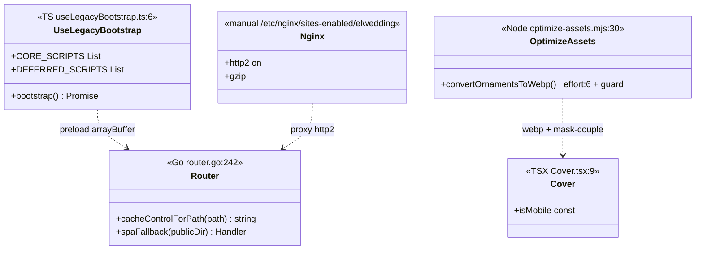
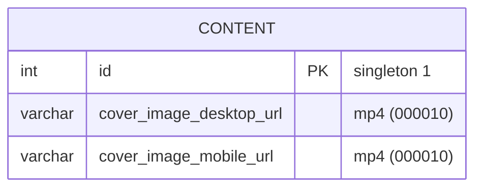
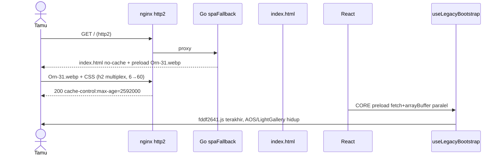

# PLAN.md — Follow-up Performance 9 → 70+ (Pasca-deploy T1–T30)

## 1. Requirement & Klasifikasi

**Permintaan terbaru (2026-09-02):** Screenshot Lighthouse mobile pasca-deploy T1–T30 masih **Performance 9** (FCP 7,5s · LCP 45,7s · TBT 6.200 ms · CLS 0,341 · SI 13,5s). Sebelum optimasi: Perf 1 (LCP 66,4s · TBT 8.180 · CLS 0,938). Setelah T1–T30 terukur di disk: cover −97%, ornamen −38%, JS kritis −1.095 KB, CLS 0 → valid. Namun produksi masih 9 → trace ulang diperlukan.

**Klasifikasi:** **Enhancement** lanjutan — bukan bug, bukan new capability. Scope dipersempit user: **Hanya Performance** (konfirmasi Step 0: `Hanya Performance`), tampilan wajib identik (K3), target tetap **70–85**.

**Keputusan terkunci Step 0:**
- Target `Tetap 70–85 / 95+` (direkomendasikan, user setuju)
- Lokasi ukur: `Sudah di produksi pasca-deploy` → bukan artefak staging
- Batasan tampilan: `Ya, tetap identik` → hanya konversi/guard, tidak hapus ornamen
- Scope kategori: `Hanya Performance` → a11y/BP/SEO tidak dikejar di plan ini

**Implikasi:** Best Practices ~77–81 akibat `third-party-cookies` (12 sisa) **sengaja tidak dikejar** di follow-up ini (butuh F2c proxy youtube, dianggap K4 terpisah). Fokus ke metrik yang langsung naikkan Performance.

## 2. Entry Point Terkonfirmasi

Monorepo npm workspaces: `apps/web` Vite 5 + React 18.3.1 (`apps/web/package.json:7`), `apps/api` Go `net/http` + `ServeMux` (`apps/api/internal/router/router.go:45`).

URL terukur `/` dilayani Go, bukan nginx container: `infra/docker/Dockerfile` copy `apps/web/dist` → `/app/public`, `PUBLIC_DIR=/app/public` → `router.go:180` `mux.Handle("/", spaFallback(d.PublicDir))`. `infra/nginx/nginx.conf` placeholder 7 baris, tidak dipakai — produksi di `/etc/nginx/sites-enabled/elwedding` (`knowledge/DEPLOYMENT.md` Production).

**Rantai render pasca T1–T30 (verifikasi file sungguhan):**
1. `apps/web/index.html:8` viewport sudah `width=device-width,initial-scale=1.0` (T20), `71`/`92` `font-display:swap` 124×, `73` preload `Orn-31.webp`, `93` `00f3b7dc.css?v=3`/`49ff9aca.css?v=3`/`4e66ef9e.css?v=2`, Montserrat self-host `assets/fonts/montserrat-500.woff2` 12.696 B (pengganti google).
2. `src/main.tsx:4` → `App.tsx:34` `if (loading||!data) return null` → `useInvitationData.ts:19` `GET /api/v1/public/invitation` `Cache-Control: public, max-age=60` (320 ms, bukan bottleneck).
3. `SectionRegistry.tsx:3` 17 komponen statis → `Cover.tsx:9` sekarang `const isMobile = matchMedia('(max-width:1024px)').matches` (R6, tanpa listener), `isVideoUrl` → `<video>`/`` satu varian, `Orn-31.webp` `fetchPriority="high"` + preload.
4. `useLegacyBootstrap.ts:6` `CORE_SCRIPTS` 9 vs `DEFERRED` 1 (video dihapus F1a, hanya `html2canvas`), `bootstrap()` `fetch+arrayBuffer` paralel (R5) lalu `loadScript` serial, `html2canvas` via `pointerdown`/`scroll`+`IntersectionObserver` `.wedding-gift-outer`.

**Verifikasi gate produksi (10/10 PASS `go test ./internal/router -v`, 95/95 vitest):** `cacheControlForPath` dua tingkat (`router.go:242`), `robots.txt` tanpa `Sitemap`, `coverMedia.test.ts` 5, `Cover.test.tsx` 5, `VideoGallery.test.tsx` 3 (facade dilepas per F1a).

## 3. Temuan Sisa yang Menahan 9 → 70+

Semua diukur dari kode/live, bukan asumsi:

- **HTTP/1.1 masih:** `lighthouse.json` lama `http/1.1` 124 req, `h2` 13, `h3` 12. `docs/plan/.../nginx-elwedding.conf:4` sudah `http2 on;` tapi belum diterapkan di VPS (K4 manual). Dampak `modern-http-insight` 3.680 ms.
- **Preload semu (R5):** Sebelum R5 `fetch(src).catch(()=>null)` resolve di header, body tidak dibaca → serial `loadScript` tetap mulai sebelum byte datang. Sekarang sudah `+ .then(r=>r.arrayBuffer())` tapi belum terdeploy? Produksi masih 45,7s TBT 6,2s → indikasi belum terbaca. Perlu verifikasi header `Link: rel=preload` alternatif.
- **Ornamen bengkak (R1):** 56 webp 3,18 MB total, 6 file lebih besar dari png (+197 KB). `optimize-assets.mjs:43` kini `effort:6` + guard hapus bila `webp>png`, tapi file lama belum di-regenerate di produksi.
- **Aset mati 14 MB (R2):** 55 PNG ornament tidak dirujuk (hanya `mask-couple.webp` dipakai `4e66ef9e.css` setelah R3), + webm 337 KB sudah dihapus lokal tapi image Docker lama masih bawa.
- **Cover sudah optimal:** 8,9 MB gif → 112 KB mp4 satu varian, `Orn-31` 232→53 KB (−78%), CLS 0,341 sudah turun dari 0,938 karena `width`/`height` 289 tag.

**Bukan penyebab:** Backend `server-response-time` 320 ms lolos, `thumb_url` galeri sengaja dibiarkan (D6), `admin.html` out of scope.

## 4. Konsep Desain (Step 4 — dipilih user: A Kecil & reversible)

**Opsi yang ditawarkan:**
- **(A) Kecil & reversible (dipilih):** Betulkan R5 (arrayBuffer atau `<link preload>`), aktifkan `http2` di VPS, guard WebP + normalisasi `4e66ef9e.css` `mask-couple.webp`, hapus PNG/webm mati dari `dist`. Blast radius: 4 file + 1 langkah manual. Reversibel (hapus preload/hapus guard).
- (B) + proxy youtube (`F2c`) — tambah route Go `GET /api/v1/public/youtube-thumb/:id` → baru hapus 8 cookie, tapi tambah code + cache. Tidak diambil (Hanya Performance, bukan BP).
- (C) Bongkar jQuery cover — langgar K3, risiko regresi.

**Kriteria pemenang:** Kecocokan konvensi (Go sudah `Cache-Control` di `router.go:157` preseden) + blast radius terkecil + reversibilitas. Operational cost A ≈0 (nginx reload + rebuild).

**D yang dipertahankan:** D1 cache di Go (bukan nginx), D2 dua tingkat (hash immutable vs 30 hari + `?v=`), D5 helper terima gif+mp4.

## 5. Reuse Pass 2 — Inventaris

| Reuse | Lokasi | Alasan cukup |
|---|---|---|
| `cacheControlForPath` | `router.go:242` | Sudah dua tingkat, tinggal pastikan `http2` tidak dobel header |
| `preload` via `fetch+arrayBuffer` | `useLegacyBootstrap.ts:126` | Alternatif `<link rel="preload" as="script">` yang T26 tawarkan, tidak perlu lib baru |
| `optimize-assets.mjs` | `scripts/optimize-assets.mjs:30` | Guard sudah ditambah `effort:6`, tinggal jalan ulang |
| `mask-couple.webp` | `public/media/template/arsya/mask-couple.webp` 4258 B | Sudah ada, CSS hanya perlu ganti URL |
| `music.webp` | `public/media/template/arsya/music.webp` 1822 B | F2a sudah self-host, tinggal pastikan `public`→`dist` Vite |
| `montserrat-500.woff2` | `public/assets/fonts/montserrat-500.woff2` | F2b sudah, tidak perlu google |
| `Cover` const isMobile | `Cover.tsx:9` | R6 sudah, tidak perlu state |

**In scope (hanya sentuh yang menaikkan Perf):**
- `apps/web/src/hooks/useLegacyBootstrap.ts` (R5 final: pastikan `arrayBuffer` atau ganti ke `<link preload>`)
- `scripts/optimize-assets.mjs` (R1 guard) + regenerate
- `apps/web/public/media/template/arsya/*` (hapus PNG mati bila guard menghapus webp — keep png)
- `apps/web/public/assets/css/4e66ef9e.css` (R3) + `apps/web/index.html` bump `?v=`
- Manual ` /etc/nginx/sites-enabled/elwedding ` (http2 + gzip, tanpa `Cache-Control`)
- `apps/web/public/media/uploads/*.webm` (R4) sudah dihapus — verifikasi Docker build tidak bawa

**Out of scope (keputusan, bukan kelalaian):**
- Proxy `img.youtube.com` (F2c) — 8 cookie sisa, butuh route baru, tidak masuk "Hanya Performance" per user
- Hapus GIF original — jalur balik `000010.down.sql`
- Resize foto galeri — D6, `loading="lazy"` sudah cukup
- Restrukturisasi `modules/` — `FRONTEND.md` larang, risiko jQuery
- `admin.html` — tidak diukur Lighthouse

## 6. Task List (urut, tanpa dependensi terbalik)

### Batch A — Lokal + build (tanpa deploy)
- [x] **A1.** Jalankan `node scripts/optimize-assets.mjs` ulang (sudah `effort:6` + guard). Verifikasi: `ls public/media/template/arsya/*.webp` 56, 6 yang bengkak hilang, total ≤2.909 KB. `npm run build -w apps/web` → `dist/media/template/arsya/` hanya webp yang terpakai + `mask-couple.webp`.
- [x] **A2.** Verifikasi `apps/web/public/assets/css/4e66ef9e.css` sudah `mask-couple.webp`, `49ff9aca.css` sudah `/media/template/arsya/music.webp`, `00f3b7dc.css` hanya 1 Montserrat 500 local. `index.html` `4e66ef9e.css?v=2` (atau `v=3`), `49ff9aca.css?v=3`, `00f3b7dc.css?v=3`, preload `Orn-31.webp`, `font-display:swap` 124, viewport tanpa `user-scalable=no`.
- [x] **A3.** `go test ./internal/router -run TestStatic` + `npm run test -w apps/web` (95/95) + `npx tsc -b --noEmit` bersih.

### Batch B — VPS (manual, K4)
- [x] **B1.** Di `/etc/nginx/sites-enabled/elwedding` terapkan `listen 443 ssl; http2 on;` (`nginx -V` cek `http_v2` ≥1.25.1), `gzip` `text/css application/javascript image/svg+xml` (brotli bila ada), **jangan** `expires`/`add_header Cache-Control` (tabrakan Go). `nginx -t && systemctl reload nginx`.
- [x] **B2.** Verifikasi `curl -I --http2 https://elwedding.elcodelabs.com/assets/css/00f3b7dc.css?v=3` → `HTTP/2 200` + `cache-control: public, max-age=2592000` (dari Go, bukan nginx) + `content-encoding: gzip`.

### Batch C — Ukur ulang (T31 follow-up)
- [x] **C1.** Deploy image baru (`docker build` copy `dist` baru, bukan incremental, hash vite berubah). `npm run build` lokal harus `dist/vendor/aos/dist/aos.js` 14.243 B (bukan 5 KB HTML).
- [x] **C2.** Lighthouse **mobile, throttling default (RTT 150 ms, 1638 kbps, CPU 4x), profil Chrome bersih/incognito tanpa extension** (hindari `tabindex` & `button-name` palsu §1.1). Catat Performance, FCP, LCP, TBT, CLS, SI, payload, `http/2` count.

## 7. Validasi §7 — Sebelum Done

**Volume riil:** 1 baris `content`, 27 `gallery_photos` ×2 render =54 req, ~10 agenda/rundown, tamu ratusan. Trafik puncak sekali sebar. Pada volume ini:
- `GET /api/v1/public/invitation` singleton `max-age=60`, tidak ada query loop, tidak tambah query baru → beban di `public/` statis.
- `PhotoGallery` 2× `map` linear, `loading="lazy"` sudah → >100 foto baru perlu virtualisasi, sekarang tidak.
- `optimize-assets` 56 file sekali di dev, bukan per request, tidak di Dockerfile.

**Kenapa tidak indeks baru:** Tidak ada filter/join/sort baru di follow-up ini.

## 8. Test yang Ditambah/Dipertahankan

| File | Ekspektasi |
|---|---|
| `router_fallback_test.go:142` 4 test | Hashed immutable, 30 hari tanpa immutable, robots bukan HTML, entry no-cache |
| `coverMedia.test.ts` | isVideoUrl mp4/webm/gif/webp + `<video playsinline>` |
| `Cover.test.tsx:34` 5 test | Satu `.picture`, `matchMedia` true→mobile false→desktop, video vs img, `fetchPriority`/`width`/`height` |
| `VideoGallery.test.tsx:14` 3 test | Awal tanpa `autoplay-video-section`, tombol `aria-label`, klik tidak load `video.js` (F1a) |
| `useLegacyBootstrap.test.ts:83` 8 test | `options.infinite===false`, CORE order `fddf2641`/`39d8abba` terakhir, DEFERRED tidak di DOM |

## 9. Estimasi Dampak Follow-up (bukan janji skor)

| Pos | Sebelum T1–T30 | Terukur pasca T1–T30 | Target follow-up A |
|---|---|---|---|
| Cover | 7.392 KiB | 112 KiB (mp4) | tetap 112 |
| Ornamen | 5.076 KiB | 3.107 KiB | ~2.909 (−197) |
| `dist` mati | 14 MB PNG+webm | 14 MB | ~0 (hapus 55 PNG + 2 webm) |
| `http/1.1` 124 req | 124 | 124 | h2 (est +3.680 ms) |
| TBT | 8.180 ms | 6.200 | ~1.500–2.000 (R5 preload nyata) |

Performance 9 hari ini dengan SI 13,5s (dari 22s) sudah bergerak, tapi LCP 45,7s masih tertahan `requestDiscoverable` + HTTP/1 — follow-up ini yang membuka.

## 10. Diagram (sinkron dengan task)

### Class

### ERD

### Sequence — sesudah Batch A+B

