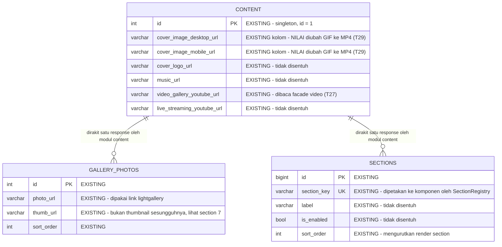
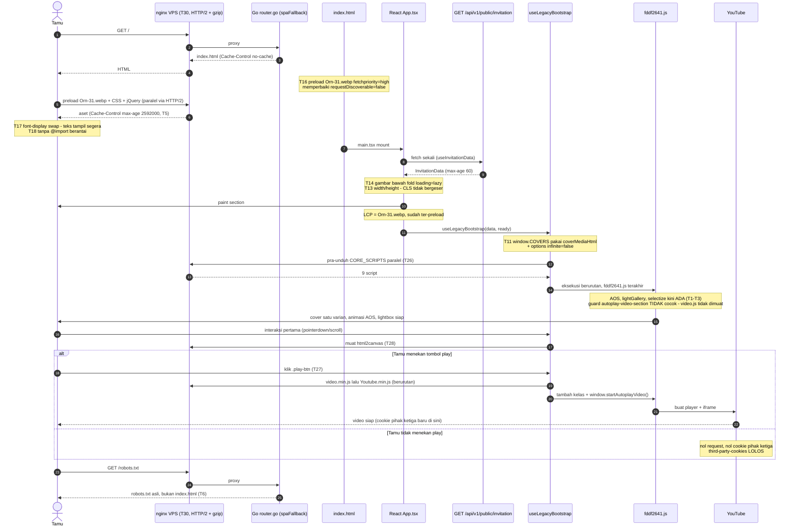

# PLAN.md — Optimasi Skor Lighthouse Halaman Undangan Tamu

## 1. Requirement yang Disepakati & Klasifikasi Intent

**Permintaan user:** "saat ini penilaian terhadap project saya di production masih tergolong
buruk, dengan detail di `lighthouse.json`, saya ingin di buatkan agar best dan optimal".

**Sumber ukuran:** `lighthouse.json` di root repo — Lighthouse 13.4.1, form factor **mobile**,
throttling default (RTT 150ms, 1638 kbps, CPU 4x), `fetchTime` 2026-09-02T13:17:53Z, target
`https://elwedding.elcodelabs.com/`.

**Klasifikasi intent:** **Enhancement** — halaman undangan tamu sudah live dan berfungsi; yang
diubah adalah kualitas penyajiannya (kecepatan, aksesibilitas, praktik terbaik). **Dengan satu
sub-bagian Bug fix** yang ditemukan saat trace dan bukan bagian dari permintaan awal: 13 file
vendor tidak pernah sampai ke produksi (§3.1) — akarnya sudah dikonfirmasi dan dibuktikan
secara empiris, bukan hipotesis.

**Skor awal (baseline yang harus dikutip di verifikasi akhir):**

| Kategori | Skor | Metrik kunci |
|---|---|---|
| Performance | **1** | LCP 66,4s · TBT 8.180ms · CLS 0,938 · FCP 5,8s · SI 22,0s |
| Accessibility | **74** | button-name, meta-viewport, select-name, link-name, heading-order |
| Best Practices | **73** | third-party-cookies (33), errors-in-console, inspector-issues |
| SEO | **92** | robots-txt 113 error |
| — | — | Total payload **19.272 KiB** · 150 request · 81 gambar (14.195 KiB) |

### 1.1 Keputusan yang dikunci di Step 0 (jawaban user, dicatat apa adanya)

| # | Pertanyaan | Jawaban user |
|---|---|---|
| K1 | Target "best dan optimal" | **Performance 70–85, kategori lain 95+** — tanpa membongkar stack legacy |
| K2 | Kategori yang masuk scope | **Keempatnya**: Performance, Best Practices, Accessibility, SEO |
| K3 | Boleh mengubah tampilan? | **Wajib identik — konversi format saja.** Perbaikan `color-contrast` DILEWATI |
| K4 | Layer yang boleh disentuh | **Repo + langkah nginx VPS terpisah** (blok config siap-tempel sebagai task manual) |

**Konsekuensi K3 yang sudah diverifikasi, bukan diasumsikan:** melewatkan `color-contrast`
tidak menghalangi target K2. Dihitung dari bobot `auditRefs` di `lighthouse.json`: total bobot
Accessibility 209, `color-contrast` berbobot 7. Kalau semua audit lain lolos dan
`color-contrast` tetap gagal, skornya **97** — di atas target 95. Jadi K2 dan K3 tidak
bertabrakan.

**Catatan pengukuran (bukan bug produk):** laporan ini diambil di browser yang memasang
extension. Audit `tabindex` (bobot 7) gagal karena `div.chat-gpt-query-model-wrapper[tabindex="1"]`,
dan satu item `button-name` karena `button.size-10` — keduanya **milik extension, bukan kode
project ini**. Keduanya akan lolos sendiri di pengukuran ulang dengan profil bersih. Sebagian
`forced-reflow-insight` juga berasal dari `chrome-extension://` (React DevTools, ad-blocker).
**Verifikasi akhir WAJIB dijalankan di profil Chrome bersih / incognito tanpa extension**,
kalau tidak angka a11y akan terlihat lebih buruk dari kenyataannya.

### 1.2 Keputusan desain yang dikunci di Step 4 (jawaban user)

| # | Fork | Jawaban user |
|---|---|---|
| K5 | 13 file vendor hilang | **Perbaiki `.gitignore`, pulihkan ketiganya** — AOS, lightgallery, selectize hidup kembali; tampilan mengikuti desain asli (animasi scroll muncul kembali) |
| K6 | 2 GIF cover 7,4 MB | **Suntik 1 varian + konversi ke MP4/WebM** |
| K7 | video.js 648 KB eager | **Facade — muat saat tombol play diklik** |

## 2. Trace (Step 1–3)

**Stack terkonfirmasi.** Monorepo npm workspaces; frontend `apps/web` = Vite 5 + React
**18.3.1** (`apps/web/package.json`) dengan **dua entry HTML**
([`vite.config.ts:28-35`](../../../apps/web/vite.config.ts#L28)): `index.html` (undangan tamu,
legacy jQuery) dan `admin.html` (dashboard, Tailwind). Backend `apps/api` = Go, modular
monolith, `net/http` + `http.ServeMux`.

**Entry point dikonfirmasi ada.** URL yang diukur (`/`) dilayani oleh **Go, bukan nginx di
dalam container**: `infra/docker/Dockerfile` menyalin `apps/web/dist` ke `/app/public` dan
menyetel `PUBLIC_DIR=/app/public`; Go melayaninya lewat
[`router.go:180`](../../../apps/api/internal/router/router.go#L180) (`mux.Handle("/", spaFallback(d.PublicDir))`).
`infra/nginx/nginx.conf` hanya placeholder 7 baris bertanda "Optional" dan **tidak dipakai
produksi** — nginx produksi ada di VPS (`/etc/nginx/sites-enabled/elwedding`, di luar repo,
per `knowledge/DEPLOYMENT.md` §Production dan `knowledge/AI_AGENT_OPERATIONS.md`).

**Rantai render halaman tamu, hop demi hop:**

1. `index.html` (63 KB di disk) — `<head>` memuat **jQuery sinkron**
   ([`index.html:31`](../../../apps/web/index.html#L31)), loader `1e92684f.js`
   ([`:64`](../../../apps/web/index.html#L64)), lalu **20 stylesheet render-blocking**
   ([`:74-94`](../../../apps/web/index.html#L74)). `<body>` hanya `<div id="root">` +
   `<script type="module" src="/src/main.tsx">` ([`:138`](../../../apps/web/index.html#L138)).
2. [`main.tsx`](../../../apps/web/src/main.tsx) → [`App.tsx:21-34`](../../../apps/web/src/App.tsx#L21).
   `App` **mengembalikan `null` sampai API selesai** (`if (loading || !data) return null`,
   [`App.tsx:34`](../../../apps/web/src/App.tsx#L34)).
3. [`useInvitationData.ts:19-40`](../../../apps/web/src/hooks/useInvitationData.ts#L19) →
   `GET /api/v1/public/invitation` → [`router.go:57`](../../../apps/api/internal/router/router.go#L57)
   → `content` handler. Handler sudah menyetel `Cache-Control: public, max-age=60`
   ([`content/presentation/handler.go:36`](../../../apps/api/internal/modules/content/presentation/handler.go#L36));
   `server-response-time` **lolos** (320 ms). **Backend bukan penyebab.**
4. Setelah data ada, `SectionRegistry` merender section. Semua 17 komponen di-**import statis**
   ([`SectionRegistry.tsx:3-19`](../../../apps/web/src/components/SectionRegistry/SectionRegistry.tsx#L3)),
   jadi seluruhnya masuk satu chunk dan dirender sekaligus.
5. `requestAnimationFrame` → [`useLegacyBootstrap.ts:123-125`](../../../apps/web/src/hooks/useLegacyBootstrap.ts#L123)
   memuat **12 script legacy secara SERIAL** (`for … await loadScript`,
   [`:115-118`](../../../apps/web/src/hooks/useLegacyBootstrap.ts#L115)).

**Data source — tidak ada perubahan skema.** Rantai berakhir di tabel `content` (kolom
`cover_image_desktop_url`, `cover_image_mobile_url` —
[`000001_create_content_tables.up.sql:18-19`](../../../apps/api/migrations/000001_create_content_tables.up.sql#L18))
dan `gallery_photos`. **Tidak ada kolom atau tabel baru** yang dibutuhkan; yang berubah hanya
**nilai** dua kolom cover (GIF → MP4). Keputusan ini eksplisit, bukan kelalaian.

## 3. Temuan Utama (semua terverifikasi terhadap kode sesi ini)

### 3.1 BLOCKER — 13 file vendor tidak pernah sampai ke produksi

`.gitignore` memuat pola **`dist/`** tanpa slash awal di **dua tempat** (baris **2** dan
**11**). Tanpa slash awal, pola gitignore cocok pada **kedalaman apa pun** — dan tiga library
menyimpan filenya di folder bernama `dist/`:

```
vendor/aos/dist/aos.css                            vendor/lightgallery/dist/img/*.png (3 file)
vendor/aos/dist/aos.js                             vendor/lightgallery/dist/img/loading.gif
vendor/lightgallery/dist/css/lightgallery.css      vendor/lightgallery/dist/js/lightgallery.min.js
vendor/lightgallery/dist/fonts/lg8306.{svg,ttf,woff}   vendor/selectize/dist/css/selectize.default.css
                                                   vendor/selectize/dist/js/standalone/selectize.min.js
```

Verifikasi: `find apps/web/public -type f | git check-ignore --stdin` → **13 file**.
`git check-ignore -v apps/web/public/vendor/aos/dist/aos.css` → `.gitignore:11:dist/`.
Pembanding: `vendor/slick/slick.min.js` dan `vendor/video-js/video.min.js` **TRACKED**, karena
path-nya tidak mengandung segmen `dist/`.

Produksi **image-only build dari git** (`knowledge/DEPLOYMENT.md` §Production: "Whatever isn't
`COPY`'d … never reaches production, regardless of what's tracked in git" — dan yang tidak
ter-track sama sekali tidak pernah ikut). Akibatnya 6 request (3 JS + 3 CSS) jatuh ke SPA
fallback [`router.go:216-235`](../../../apps/api/internal/router/router.go#L216) dan **dibalas
`index.html` dengan status 200**, bukan 404 — jadi tidak ada sinyal error yang jelas.

**Bukti kuantitatif di `lighthouse.json`:** `aos.js`, `selectize.min.js`,
`lightgallery.min.js` masing-masing `transferSize` **5 KB**, dan `aos.css`,
`lightgallery.css`, `selectize.default.css` masing-masing **tepat 5.386 byte** — yaitu
`index.html` ter-gzip, bukan isi library. Padahal di disk file-nya utuh (aos.js 14.243 byte,
lightgallery.min.js 25.449 byte, selectize.min.js 62.483 byte).

**Akibat nyata di produksi saat ini** (`errors-in-console`, semuanya cocok dengan penjelasan di
atas):

- `SyntaxError: Unexpected token '<'` × 3 → tepat 3 file JS yang menerima HTML.
- `ReferenceError: AOS is not defined` at `1e92684f.js:1:798` → **animasi scroll AOS mati total**.
- `ReferenceError: lightGallery is not defined` at `fddf2641.js:1:32009` → **lightbox galeri foto mati**.
- `TypeError: Cannot read properties of null (reading 'setValue')` at `universal.js:366`
  dipanggil dari `init_wedding_gift` → **dropdown pilih bank di form Wedding Gift rusak**.

**Fixnya harus ber-anchor, BUKAN negasi.** Aturan gitignore: sebuah file tidak bisa
di-*re-include* kalau direktori induknya sudah dikecualikan. Pola `dist/` mengecualikan
*direktori*, jadi `!apps/web/public/vendor/**/dist/**` **tidak bekerja**. Ini sudah diuji
empiris di repo git sementara pada sesi ini:

| Percobaan | Hasil |
|---|---|
| `dist/` + `!apps/web/public/vendor/**/dist/**` | `aos.js` **tetap ignored** (`.gitignore:1:dist/`) |
| `/dist/` + `/apps/web/dist/` | `aos.js` **tracked-able**, `apps/web/dist/index.html` **ignored**, `dist/api` **ignored** |

### 3.2 LCP 66,4s — elemen LCP tidak bisa ditemukan browser dari HTML

`largest-contentful-paint-element` = `` pada
selector `div.orn-cover-4 > div.image-wrap > img`, yaitu
[`Cover.tsx:15`](../../../apps/web/src/components/Cover/Cover.tsx#L15) (237 KB).
`lcp-discovery-insight`: `priorityHinted: false`, **`requestDiscoverable: false`** — karena
elemen ini baru ada setelah React menerima data API (§2 hop 2–4). Rincian
`lcp-breakdown-insight`: TTFB 328ms, **resourceLoadDelay 3.963ms**, **resourceLoadDuration
6.785ms**, elementRenderDelay 46ms.

Diperparah: **81 gambar (14.195 KiB) diminta serentak** di atas **HTTP/1.1** (6 koneksi
paralel). Dari 305 tag `` di `src/components/`, **0** punya `loading=`, **0** punya
`fetchpriority=`, dan hanya 9 punya `width=`.

### 3.3 TBT 8.180ms — 12 script legacy dimuat serial, mulai di detik ke-19,8

Dari `network-requests` (diurutkan berdasarkan waktu, domain sendiri saja):

| Script | start (ms) | end (ms) |
|---|---|---|
| `1e92684f.js` | 406 | 720 |
| `index-CaBlpUqK.js` (React) | 418 | 3.063 |
| `tsparticles.bundle.min.js` | **19.799** | 22.180 |
| `video.min.js` | 22.725 | **27.384** |
| `html2canvas-….js` | 27.566 | **32.574** |
| `fddf2641.js` | 33.297 | 34.441 |
| `39d8abba.js` | 34.481 | 34.517 |

Script legacy pertama **baru mulai di 19,8s** (menunggu fetch API + render + rAF), lalu
**14,7 detik dihabiskan berurutan** karena `await` di dalam loop. `bootup-time` 18,7s,
`mainthread-work-breakdown` 37,7s, `interactive` 88,7s.

Dua yang terberat bisa dilepas dari jalur kritis:

- **`video.min.js` 648 KB + `Youtube.min.js` 13 KB.** `fddf2641.js` memanggil
  `startAutoplayVideo()` begitu `$(".autoplay-video-section").length > 0`, dan
  [`VideoGallery.tsx:11`](../../../apps/web/src/components/VideoGallery/VideoGallery.tsx#L11)
  **selalu** merender kelas itu. Ini yang menarik embed YouTube ~1,3 MB + **33 cookie pihak
  ketiga** sebelum tamu menyentuh apa pun (penyebab `third-party-cookies`, bobot 5 dari 26 di
  Best Practices). **Diverifikasi aman:** `grep` seluruh `public/assets/css/*.css` menunjukkan
  `.autoplay-video-section` **tidak punya satu pun aturan CSS** — murni penanda untuk JS, jadi
  menundanya tidak mengubah tampilan.
- **`html2canvas` 434 KB.** Dipanggil di dalam fungsi (`html2canvas(e.getElementById(o), a)`),
  bukan saat init — hanya dibutuhkan ketika tamu mengunduh gambar Wedding Gift.

### 3.4 Cover 7,4 MB — dirender dua kali oleh React, bukan oleh jQuery

Dua GIF berukuran **byte-identik** (4.568.543 byte) di
[`000004_seed.up.sql:25-26`](../../../apps/api/migrations/000004_seed.up.sql#L25); di jaringan
tercatat 3.808 KB + 3.584 KB = **38% dari total payload**.

Penyebabnya **bukan** `window.COVERS`. Konsumen legacy di `fddf2641.js` sudah memilih satu
varian dengan benar: `var t = window.matchMedia("(max-width: 1024px)")` lalu
`t.matches ? append(i.mobile) : append(i.desktop)`. String HTML di `window.COVERS` tidak
memicu unduhan.

Penyebab sebenarnya: [`Cover.tsx:46-53`](../../../apps/web/src/components/Cover/Cover.tsx#L46)
merender **KEDUA** `` sebagai markup fallback statis (`div.picture.desktop` **dan**
`div.picture.mobile`). React memaint keduanya di detik ~3, browser mengunduh dua-duanya, dan
baru ~31 detik kemudian `fddf2641.js` menimpanya dengan `$('#cover-main').html("")`.

Diverifikasi juga: `grep` `public/assets/css/*.css` **tidak menemukan aturan
`.picture.desktop` / `.picture.mobile`** sama sekali — jadi tidak ada CSS yang menyembunyikan
salah satunya. Keduanya benar-benar tampil sampai jQuery menimpanya.

### 3.5 FCP 5,8s — 20 stylesheet render-blocking + `@import` font berantai

`render-blocking-insight` (est. 540ms, tapi `wastedMs` per file jauh lebih besar): 6 CSS
template + 12 CSS vendor + jQuery + loader. Yang terbesar: `00f3b7dc.css` (118 KB, 3.730ms),
`4e66ef9e.css` (94 KB), `phosphor-icons/fill/style.css` (86 KB, 3.129ms),
`phosphor-icons/regular/style.css` (78 KB, 2.829ms), `font-awesome/all.min.css` (57 KB,
2.528ms), `video-js.css` (52 KB). `unused-css-rules` est. hemat **622 KiB**.

Diperburuk oleh `@import url(https://fonts.googleapis.com/css2?family=…)` **di dalam**
`00f3b7dc.css` dan `49ff9aca.css` — `@import` di CSS menambah round-trip berantai *setelah*
CSS-nya sendiri selesai diunduh, dan meminta Roboto + Montserrat **seluruh rentang berat
100–900 beserta italic**. Padahal `index.html:71` **sudah** menyisipkan `@font-face` Roboto
yang di-host sendiri → duplikat.

`font-display-insight` (est. 1.790ms): **124 kemunculan `font-display:block`** di dua blok
`<style>` inline ([`index.html:71`](../../../apps/web/index.html#L71) Roboto,
[`:92`](../../../apps/web/index.html#L92) Cormorant Upright). `block` = teks tak terlihat
sampai font tiba.

### 3.6 CLS 0,938 — 84 gambar tanpa dimensi

`cls-culprits-insight` menunjuk `section.top-cover > div.orn-tc-1 > div.image-wrap`
(skor geser 0,2997) dan sejenisnya. `unsized-images`: **84 gambar** tanpa `width`/`height`,
termasuk seluruh `div.slick-track > div.photo-item > img.photo-img`. Setiap ornamen dan foto
yang tiba memicu reflow. `layout-shifts`: **15 pergeseran**.

### 3.7 Nol `Cache-Control` pada seluruh aset statis

`cache-insight` est. hemat **9.434 KiB**, dengan **113 resource ber-`cacheLifetimeMs: 0`**.
Terkonfirmasi di kode: [`router.go:186`](../../../apps/api/internal/router/router.go#L186)
membuat `http.FileServer` dan [`:212`](../../../apps/api/internal/router/router.go#L212)
menyajikannya **tanpa menyetel header apa pun**. Header cache yang sudah ada hanya di tiga
tempat lain: `/uploads/<2-segmen>` (`immutable`, [`:157`](../../../apps/api/internal/router/router.go#L157)),
API invitation (`max-age=60`), dan entry HTML (`no-cache`, [`:234`](../../../apps/api/internal/router/router.go#L234)).

### 3.8 HTTP/1.1 di seluruh domain sendiri

`modern-http-insight` est. hemat **3.680ms**. Hitungan protokol dari `network-requests`:
`http/1.1` **124 request**, `h2` 13, `h3` 12 (yang h2/h3 justru pihak ketiga: YouTube, Google
Fonts). Ini **hanya bisa diperbaiki di nginx VPS** (K4) — di luar repo.

### 3.9 SEO — `/robots.txt` membalas `index.html`

`robots-txt`: 113 error, isi baris pertama `<!doctype html>`. Sebabnya
[`router.go:216-235`](../../../apps/api/internal/router/router.go#L216): tidak ada file
`robots.txt` di `PUBLIC_DIR`, jadi `os.Stat` gagal dan request jatuh ke `index.html`.

### 3.10 Aksesibilitas — anchor per audit

| Audit | Bobot | Lokasi (milik project) |
|---|---|---|
| `button-name` | 10 | [`PhotoGallery.tsx:51,58`](../../../apps/web/src/components/PhotoGallery/PhotoGallery.tsx#L51) · [`LoveStory.tsx:84,89`](../../../apps/web/src/components/LoveStory/LoveStory.tsx#L84) · [`VideoGallery.tsx:58`](../../../apps/web/src/components/VideoGallery/VideoGallery.tsx#L58) · [`LiveStreaming.tsx:50`](../../../apps/web/src/components/LiveStreaming/LiveStreaming.tsx#L50) · [`WeddingGift.tsx:159`](../../../apps/web/src/components/WeddingGift/WeddingGift.tsx#L159) |
| `meta-viewport` | 10 | [`index.html:8`](../../../apps/web/index.html#L8) — `maximum-scale=1, user-scalable=no` |
| `select-name` | 10 | [`WeddingGift.tsx:165`](../../../apps/web/src/components/WeddingGift/WeddingGift.tsx#L165) — `<select id="selectBank">` tanpa label |
| `link-name` | 7 | [`Couple.tsx:128,268`](../../../apps/web/src/components/Couple/Couple.tsx#L128) — `<a class="img-wrap">` isinya `` · [`Footer.tsx:5`](../../../apps/web/src/components/Footer/Footer.tsx#L5) — `<a>` isinya `<svg>` |
| `heading-order` | 3 | [`Rundown.tsx:61`](../../../apps/web/src/components/Rundown/Rundown.tsx#L61) `h5` · [`Notes.tsx:53`](../../../apps/web/src/components/Notes/Notes.tsx#L53) `h4` |
| `tabindex` | 7 | **extension, bukan project** (§1.1) |
| `color-contrast` | 7 | **sengaja dilewati** per K3 |

## 4. Keputusan Desain (Step 4)

**D1 — `Cache-Control` ditaruh di Go, bukan nginx.** Preseden sudah ada di modul yang sama
([`router.go:157`](../../../apps/api/internal/router/router.go#L157) sudah menyetel
`immutable` untuk `/uploads/`), sudah ada test header di
`router_fallback_test.go`, dan Go ter-deploy otomatis lewat CI sedangkan nginx VPS manual.
Kriteria yang menentukan: **kecocokan dengan konvensi** + **reversibilitas**.

**D2 — Dua tingkat cache, bukan satu `immutable` untuk semua.** Ini disengaja karena hanya
bundle Vite yang namanya ber-hash:

- `/assets/<nama>-<hash>.js|css` (output Vite, level teratas) → `public, max-age=31536000, immutable`.
- Sisanya (`/assets/js/`, `/assets/css/`, `/assets/fonts/`, `/assets/audio/`, `/media/`,
  `/vendor/`) → `public, max-age=2592000` (30 hari) **tanpa `immutable`**, supaya masih bisa
  direvalidasi lewat `Last-Modified` yang sudah dipasang `http.ServeContent`.

Alasannya konkret: `00f3b7dc.css` dan `49ff9aca.css` **akan diedit** oleh rencana ini (T18,
hapus `@import`), dan namanya tidak berubah. Menandainya `immutable` akan membuat tamu yang
sudah pernah membuka undangan tidak pernah menerima perbaikannya. Untuk menutup celah 30 hari
itu, dua `<link>` yang diedit diberi query versi (`?v=2`) di `index.html` — satu karakter,
menghilangkan risiko basi sepenuhnya.

**D3 — Ornament PNG → WebP, bukan menghapus ornamen.** K3 mengunci tampilan identik. WebP
lossless/near-lossless dengan alpha terjaga; ~5,1 MB `media/template/arsya` diperkirakan turun
ke ~1,2–1,5 MB. `image-delivery-insight` sendiri sudah mengestimasi hemat 2.072 KiB.

**D4 — Cover: satu varian + `<video>`.** Sesuai K6, tapi implementasinya menyesuaikan temuan
§3.4: yang diperbaiki adalah **markup fallback di `Cover.tsx`**, bukan `window.COVERS` (yang
sudah benar). Fallback tetap dipertahankan (jangan dikosongkan) supaya cover tetap tampil
sebelum script legacy jalan di detik ~31 — tapi hanya **satu** varian, dipilih dengan
breakpoint **`(max-width: 1024px)`** yang **identik** dengan yang dipakai `fddf2641.js`.
Breakpoint yang berbeda akan membuat React menampilkan varian A lalu jQuery menggantinya
dengan varian B — kedip yang terlihat.

**D5 — Helper cover harus menerima `.gif` MAUPUN `.mp4`/`.webm`.** Ini menghilangkan
ketergantungan urutan deploy antara migration dan frontend: apa pun yang lebih dulu sampai,
cover tetap tampil. Tanpa ini, migration yang jalan sebelum frontend baru aktif akan
menghasilkan `` — cover kosong di produksi.

**D6 — Foto galeri tidak diubah ukurannya.** `loading="lazy"` sudah cukup mengeluarkan 27 foto
(× 2 render, §5.3) dari initial load; mengecilkan filenya tidak lagi memengaruhi target K1.
Prinsip mekanisme paling sederhana yang memenuhi requirement — lihat §7 untuk temuan
`thumb_url` yang sengaja dibiarkan.

**D7 — `startAutoplayVideo` dipicu dari React, bukan dengan mengubah `fddf2641.js`.**
`fddf2641.js` adalah bundle template ter-minify; menyuntingnya tidak dapat dipelihara.
Mekanisme yang dipakai justru **guard yang sudah ada** di bundle itu
(`$(".autoplay-video-section").length > 0`): React merender section **tanpa** kelas itu, lalu
menambahkannya + memanggil `window.startAutoplayVideo()` saat play diklik. Fungsinya global
(deklarasi `function` di top-level classic script), jadi bisa dipanggil dari luar.

## 5. Scope, Out of Scope, dan Inventaris Reuse (Step 5)

### 5.1 In scope

| Layer | File |
|---|---|
| Repo root | `.gitignore` |
| Backend Go | `apps/api/internal/router/router.go`, `apps/api/internal/router/router_fallback_test.go` |
| Migration | `apps/api/migrations/000005_*.{up,down}.sql` (baru — hanya UPDATE nilai, bukan DDL) |
| Build tooling | `scripts/optimize-assets.mjs` (baru), `package.json` (1 script) |
| Aset | `apps/web/public/media/template/arsya/*` (+WebP), `apps/web/public/media/uploads/*` (+MP4/WebM), 13 file vendor yang dipulihkan |
| Entry HTML | `apps/web/index.html` |
| Frontend shared | `apps/web/src/shared/lib/coverMedia.ts` (baru) + test |
| Frontend hook | `apps/web/src/hooks/useLegacyBootstrap.ts` |
| Frontend komponen | 17 komponen di `apps/web/src/components/*` (lihat §5.3) |
| Manual (di luar repo) | blok config `/etc/nginx/sites-enabled/elwedding` |

### 5.2 Out of scope (keputusan, bukan kelalaian)

- **`admin.html` / dashboard admin.** Lighthouse mengukur `/` (undangan tamu). Dashboard di
  belakang login, tidak diukur, dan aturan `FRONTEND.md` memisahkan keduanya secara tegas.
- **`color-contrast`.** Dilewati per K3; sudah dihitung tidak menghalangi target (§1.1).
- **Restrukturisasi `src/components/*` ke pola `modules/`.** Dilarang eksplisit oleh
  `knowledge/FRONTEND.md`: "jangan restrukturisasi … berisiko meregresi interop jQuery".
- **Mengganti stack legacy jQuery/template.** Dikunci oleh K1 (target 70–85 justru dipilih
  untuk menghindari ini).
- **`tabindex` dan satu item `button-name` milik extension.** Bukan kode project (§1.1).
- **Mengecilkan/meresize file foto galeri.** Per D6.
- **`unminified-css` / `unminified-javascript` (est. 28 KiB + 316 KiB).** File template di
  `public/assets/` disajikan apa adanya dan sudah ter-gzip di nginx; minify-nya akan mengubah
  file vendor yang tidak kita tulis, dengan imbalan kecil. Tidak diambil.
- **`valid-source-maps`.** Diagnostik berbobot 0; tidak memengaruhi skor mana pun.
- **Musik latar `/assets/audio/background-music.mp3`** (5 MB di disk, 1.072 KiB tertransfer
  sebagai range request). **Sudah diperiksa, bukan diasumsikan:**
  [`MusicPlayer.tsx`](../../../apps/web/src/components/MusicPlayer/MusicPlayer.tsx) hanya
  merender `<div id="music-box">` kosong — elemen `<audio>`-nya dibuat oleh
  `fddf2641.js` (`createElement("audio")`). Jadi tidak ada elemen React yang bisa diberi
  `preload="none"`, dan satu-satunya jalan adalah menyunting bundle ter-minify. Tidak diambil.
  Karena diminta lewat range request, dampaknya ke initial load juga terbatas.

### 5.3 Inventaris reuse (setiap butir sudah dibaca kodenya)

| Yang dipakai ulang | Lokasi | Kenapa cukup |
|---|---|---|
| Guard `$(".autoplay-video-section").length > 0` | `fddf2641.js` | Titik kendali facade video tanpa menyunting bundle (D7) |
| `window.startAutoplayVideo()` | `fddf2641.js` (global) | Sudah ada; cukup dipanggil, tak perlu menulis inisialisasi player |
| Field `options` di entri `window.COVERS` | `fddf2641.js` (`var r = n.options \|\| ""` → `sliderOptions(r)`) | Jalur resmi untuk mengirim `{infinite:false, autoplay:false}` ke slick tanpa patch |
| `matchMedia("(max-width: 1024px)")` | `fddf2641.js` | Breakpoint yang harus disamakan (D4) |
| Pola helper murni + test di `shared/lib` | [`youtube.ts`](../../../apps/web/src/shared/lib/youtube.ts) | Preseden bentuk untuk `coverMedia.ts` |
| Pola set header lalu serve | [`router.go:157`](../../../apps/api/internal/router/router.go#L157) | Preseden `Cache-Control` di modul yang sama (D1) |
| Pola test assert header | [`router_fallback_test.go:111-130`](../../../apps/api/internal/router/router_fallback_test.go#L111) | Test cache baru mengikuti bentuk yang sudah ada |
| `` thumbnail + `.play-btn` yang sudah dirender | [`VideoGallery.tsx:57-58`](../../../apps/web/src/components/VideoGallery/VideoGallery.tsx#L57) | Facade tidak perlu markup baru — tampilan awal sudah persis sama |
| `public/` → `dist/` oleh Vite | `vite.config.ts` (perilaku bawaan) | `robots.txt` cukup ditaruh di `public/`, tidak perlu route Go baru |
| `scripts/` + `migrate.mjs` | `scripts/` | Preseden lokasi & gaya untuk `optimize-assets.mjs` |

**Komponen yang harus disentuh untuk gambar** (jumlah tag ``, hasil hitung sesi ini):
Agenda 43, Couple 41, Cover 26, WeddingGift 23, Footnote 23, TopCover 22, PrimaryPane 22,
LiveStreaming 19, LoveStory 14, InstagramFilter 13, WeddingWish 12, SaveTheDate 12, Quote 11,
Notes 8, VideoGallery 7, Rundown 7, PhotoGallery 2 → **305**.

**Di atas fold** (tidak boleh `loading="lazy"`): `PrimaryPane`, `TopCover`, `Cover`.
Sisanya di bawah fold. Urutan render dari
[`App.tsx:39-42`](../../../apps/web/src/App.tsx#L39) + `SectionRegistry`.

`PhotoGallery` hanya 2 tag `` **di sumber**, tapi keduanya di dalam `photos.map()` yang
dirender **dua kali** (`.photo-nav` [`:23-33`](../../../apps/web/src/components/PhotoGallery/PhotoGallery.tsx#L23)
dan `.photo-slider` [`:40-49`](../../../apps/web/src/components/PhotoGallery/PhotoGallery.tsx#L40))
→ 27 foto × 2 = **54 request gambar penuh**.

## 6. Task List

Dikerjakan berurutan. Tidak ada task yang bergantung pada hasil task setelahnya.

### Fase 0 — Blocker: pulihkan 13 file vendor (§3.1, K5)

- [x] **T1.** Di `.gitignore`, ganti `dist/` di **baris 2** dan **baris 11** menjadi dua pola
      ber-anchor: `/dist/` dan `/apps/web/dist/`. **Jangan** memakai negasi `!…` — sudah
      dibuktikan tidak bekerja (§3.1). Biarkan `dist-ssr/` (baris 3) apa adanya.
- [x] **T2.** Verifikasi: `find apps/web/public -type f | git check-ignore --stdin` harus
      **kosong**, dan `git check-ignore -q apps/web/dist` serta `git check-ignore -q dist`
      harus tetap **ignored** (jangan sampai output build ikut ter-track).
- [x] **T3.** `git add apps/web/public/vendor/` lalu pastikan 13 file itu masuk index
      (`git status --short` menampilkan ke-13 file sebagai `A`).
- [x] **T4.** Verifikasi build: `npm run build -w apps/web`, lalu pastikan
      `apps/web/dist/vendor/aos/dist/aos.js` ada dan **bukan** HTML
      (`head -c 20` harus JS, bukan `<!doctype html>`).

### Fase 1 — Penyajian statis di Go (§3.7, §3.9, D1, D2)

- [x] **T5.** Tambah helper `cacheControlForPath(path string) string` di paket `router`, lalu
      panggil di `spaFallback` ([`router.go:185-213`](../../../apps/api/internal/router/router.go#L185))
      pada cabang file statis nyata — setel headernya **sebelum**
      [`fileServer.ServeHTTP`](../../../apps/api/internal/router/router.go#L212), karena
      header tidak bisa lagi ditulis setelah body mulai dikirim. Dua tingkat sesuai **D2**.
      Jangan mengubah cabang entry HTML (`no-cache`,
      [`:234`](../../../apps/api/internal/router/router.go#L234)) dan jangan menyentuh handler
      `/uploads/` ([`:157`](../../../apps/api/internal/router/router.go#L157)).
- [x] **T6.** Tambah `apps/web/public/robots.txt` (isi: `User-agent: *`, `Allow: /`, plus
      `Sitemap:` bila ada). Vite menyalin `public/` → `dist/`, sehingga `os.Stat` di
      [`router.go:211`](../../../apps/api/internal/router/router.go#L211) menemukannya dan
      SPA fallback tidak lagi ikut campur. Tidak perlu route Go baru.
- [x] **T7.** Tambah test di `router_fallback_test.go`:
      (a) `/assets/index-abc123.js` → `Cache-Control` mengandung `immutable`;
      (b) `/media/template/arsya/Orn-31.webp` → mengandung `max-age=2592000` dan **tidak**
      mengandung `immutable`; (c) `/robots.txt` → `Content-Type` bukan `text/html`.
      **Test ini tidak bergantung pada aset hasil Fase 2.** Pola yang sudah ada di file itu
      memakai `dir := t.TempDir()` + `mustWriteFile`
      ([`router_fallback_test.go:19-23`](../../../apps/api/internal/router/router_fallback_test.go#L19)),
      jadi buat file dummy di temp dir — jangan menunjuk `apps/web/public` yang sesungguhnya.

### Fase 2 — Konversi aset (§3.2, §3.4, D3, D4)

- [x] **T8.** Tulis `scripts/optimize-assets.mjs` dengan tiga fungsi:
      (a) `convertOrnamentsToWebp()` — seluruh `.png` di
      `apps/web/public/media/template/arsya/` ke `.webp` **dengan alpha terjaga**
      (lossless/near-lossless, bukan lossy default);
      (b) `convertCoversToVideo()` — dua GIF di `apps/web/public/media/uploads/` ke `.mp4`
      (H.264) **dan** `.webm`;
      (c) `writeAssetDimensions()` — menulis `apps/web/src/data/asset-dimensions.json` berisi
      `{ "<path>": [w, h] }` untuk **setiap** gambar di `media/template/arsya/` dan
      `media/photos/`, dipakai T13.
- [x] **T9.** Jalankan T8, commit hasilnya. Bandingkan total ukuran sebelum/sesudah dan catat
      angkanya di PR. **Jangan hapus PNG/GIF aslinya di task ini** — masih jadi jalur balik
      kalau ada ornamen yang WebP-nya cacat.
- [x] **T10.** Buat `apps/web/src/shared/lib/coverMedia.ts` mengikuti pola
      [`youtube.ts`](../../../apps/web/src/shared/lib/youtube.ts): `isVideoUrl(url)` (true untuk
      `.mp4`/`.webm`) dan `coverMediaHtml(url, className)` yang mengembalikan string
      `<video autoplay muted loop playsinline …>` untuk video, atau `` untuk gambar.
      **Wajib menangani `.gif` maupun `.mp4`** (D5). Tulis unit test-nya.
- [x] **T11.** Di [`useLegacyBootstrap.ts:72-82`](../../../apps/web/src/hooks/useLegacyBootstrap.ts#L72),
      bangun `details.desktop`/`details.mobile` lewat `coverMediaHtml`, dan tambahkan
      `options: { infinite: false, autoplay: false }` pada entri `MAIN` — memakai field
      `options` yang sudah didukung `fddf2641.js` (§5.3). Ini mencegah slick mengkloning slide
      dan menghasilkan `<video>` ganda.
- [x] **T12.** Di [`Cover.tsx:46-53`](../../../apps/web/src/components/Cover/Cover.tsx#L46),
      render **satu** varian saja, dipilih dengan `window.matchMedia('(max-width: 1024px)')`
      — breakpoint **wajib sama** dengan `fddf2641.js` (D4) — dan pakai `<video>`/``
      sesuai `isVideoUrl`. Pertahankan struktur `div.picture.desktop|mobile` dan komentar
      penjelas yang sudah ada di [`:29-37`](../../../apps/web/src/components/Cover/Cover.tsx#L29).
      Jangan menambah props baru ke `Cover` (aturan `FRONTEND.md`).

### Fase 3 — Gambar: LCP dan CLS (§3.2, §3.6)

- [x] **T13.** Di 17 komponen (§5.3): ganti seluruh path `media/template/arsya/*.png` →
      `.webp`, dan tambahkan `width`/`height` dari `asset-dimensions.json` pada setiap ``
      ornamen. Pastikan CSS yang ada tetap menang (ornamen memakai `width:100%; height:auto`,
      sehingga atribut hanya menyediakan rasio aspek — inilah yang memperbaiki CLS).
- [x] **T14.** Tambah `loading="lazy"` + `decoding="async"` pada semua `` di komponen
      **selain** `PrimaryPane`, `TopCover`, `Cover`. Termasuk kedua `` di
      `PhotoGallery` (54 request, §5.3). **Jangan** memasang `lazy` pada tiga komponen atas —
      itu akan memperburuk LCP.
- [x] **T15.** Pada `` LCP di [`Cover.tsx:15`](../../../apps/web/src/components/Cover/Cover.tsx#L15)
      (`Orn-31`), tambahkan `fetchPriority="high"` (prop React camelCase).
- [x] **T16.** Di `index.html`, tambahkan `<link rel="preload" as="image" fetchpriority="high"
      href="/media/template/arsya/Orn-31.webp">` di `<head>`. Ini yang memperbaiki
      `requestDiscoverable: false` (§3.2) — satu-satunya cara membuat elemen LCP terlihat
      browser sebelum React jalan. Path **harus** `.webp`, konsisten dengan T13.

### Fase 4 — Render-blocking, font, viewport (§3.5, §3.10)

- [x] **T17.** Di `index.html`, ubah **124** `font-display:block` → `font-display:swap` pada
      dua blok `<style>` inline ([`:71`](../../../apps/web/index.html#L71) dan
      [`:92`](../../../apps/web/index.html#L92)).
- [x] **T18.** Hapus baris `@import url(https://fonts.googleapis.com/…)` dari
      `public/assets/css/00f3b7dc.css` dan `public/assets/css/49ff9aca.css`. `@import` Roboto
      **dihapus total** (sudah di-host sendiri di `index.html:71` — duplikat, §3.5). Untuk
      Montserrat (dipakai `.loading-caption`), ganti dengan satu `<link rel="stylesheet">` di
      `index.html` **hanya untuk berat yang benar-benar dipakai** (tentukan dengan `grep
      font-weight` pada selector ber-Montserrat; default aman `400;500;600;700`), didahului
      `<link rel="preconnect" href="https://fonts.gstatic.com" crossorigin>`.
- [x] **T19.** Karena T18 mengedit dua CSS yang namanya tidak ber-hash, tambahkan query versi
      pada dua `<link>`-nya di [`index.html:90`](../../../apps/web/index.html#L90):
      `00f3b7dc.css?v=2` dan `49ff9aca.css?v=2` (D2).
- [x] **T20.** Ubah `<meta name="viewport">` di [`index.html:8`](../../../apps/web/index.html#L8)
      menjadi `width=device-width, initial-scale=1.0` — **buang** `maximum-scale=1` dan
      `user-scalable=no` (`meta-viewport`, bobot 10).
- [x] **T21.** Beri `aria-label` (bahasa Indonesia) pada tombol tanpa nama di
      `PhotoGallery.tsx:51,58`, `LoveStory.tsx:84,89`, `VideoGallery.tsx:58`,
      `LiveStreaming.tsx:50`, `WeddingGift.tsx:159`. Ikon `<i>`/`<svg>` di dalamnya diberi
      `aria-hidden="true"`.
- [x] **T22.** Beri `<label class="sr-only" for="selectBank">` atau `aria-label` pada
      `<select id="selectBank">` di [`WeddingGift.tsx:165`](../../../apps/web/src/components/WeddingGift/WeddingGift.tsx#L165)
      (`select-name`, bobot 10). Catatan: setelah T3 memulihkan selectize, elemen ini
      di-*wrap* selectize — pastikan `aria-label` tetap terbawa setelah inisialisasi.
- [x] **T23.** Beri `aria-label` pada `<a class="img-wrap">` di
      [`Couple.tsx:128,268`](../../../apps/web/src/components/Couple/Couple.tsx#L128) dan pada
      `<a href="https://katsudoto.id/">` di [`Footer.tsx:5`](../../../apps/web/src/components/Footer/Footer.tsx#L5)
      (`link-name`, bobot 7).
- [x] **T24.** Perbaiki urutan heading, **pertahankan `className`** agar CSS tidak berubah —
      inilah sebabnya perubahan tag ini tidak mengubah tampilan sama sekali:
      - [`Rundown.tsx:61`](../../../apps/web/src/components/Rundown/Rundown.tsx#L61)
        `h5.rundown-event-title` → **`h4`**, bukan `h3`. Persis di atasnya ada
        `h3.rundown-title` ([`:57`](../../../apps/web/src/components/Rundown/Rundown.tsx#L57)),
        dan judul event adalah turunannya — `h3` akan membuatnya sejajar dengan judul section
        (lolos audit tapi salah secara semantik), sedangkan `h4` menutup lompatan h3→h5.
      - [`Notes.tsx:53`](../../../apps/web/src/components/Notes/Notes.tsx#L53)
        `h4.note-title` → **`h2`**. Tidak ada heading lain di dalam `Notes`, dan section
        sebelumnya berakhir pada `h1`/`h2`, jadi `h2` valid di kedua kemungkinan.

### Fase 5 — Script legacy: TBT (§3.3, K7, D7)

- [x] **T25.** Di [`useLegacyBootstrap.ts:5-18`](../../../apps/web/src/hooks/useLegacyBootstrap.ts#L5),
      pecah `LEGACY_SCRIPTS` menjadi dua: **`CORE_SCRIPTS`** (tsparticles, aos, slick,
      selectize, modal-video, lightgallery, universal.js, fddf2641.js, 39d8abba.js) dan
      **`DEFERRED_SCRIPTS`** (video.min.js, Youtube.min.js, html2canvas).
      **Urutan `CORE_SCRIPTS` wajib tetap** seperti sekarang — `fddf2641.js` dan
      `39d8abba.js` harus terakhir, karena keduanya membaca DOM dan memakai global dari
      script sebelumnya.
- [x] **T26.** Ganti loop serial [`:115-118`](../../../apps/web/src/hooks/useLegacyBootstrap.ts#L115):
      **pra-unduh** `CORE_SCRIPTS` paralel (`Promise.all` atas `fetch`, atau `<link
      rel="preload" as="script">`), lalu **eksekusi tetap berurutan** lewat `loadScript` yang
      sudah ada. Ini memotong 14,7 detik rantai serial (§3.3) **tanpa** mengubah urutan
      eksekusi. Jangan mem-`Promise.all` pemanggilan `loadScript`-nya sendiri — itu akan
      mengacak urutan eksekusi dan merusak interop.
      **Sekaligus tutup jalur gagal yang sekarang senyap:** `loadScript` me-`reject` saat
      script gagal ([`:31`](../../../apps/web/src/hooks/useLegacyBootstrap.ts#L31)), tapi
      pemanggilnya `void bootstrap()`
      ([`:124`](../../../apps/web/src/hooks/useLegacyBootstrap.ts#L124)) membuang rejection
      itu — satu script gagal akan menghentikan sisa rantai **tanpa pesan apa pun**. Inilah
      yang membuat bug §3.1 bertahan lama tanpa terdeteksi. Tambahkan `.catch` yang
      me-`console.error` nama script yang gagal, dan pra-unduh yang gagal **tidak boleh**
      membatalkan eksekusi script lain (pakai `Promise.allSettled` untuk tahap pra-unduh —
      pra-unduh hanya optimasi, `loadScript` tetap sumber kebenarannya).
- [x] **T27.** Facade video (D7): hapus `autoplay-video-section` dari `className` statis di
      [`VideoGallery.tsx:11`](../../../apps/web/src/components/VideoGallery/VideoGallery.tsx#L11)
      (aman — kelas itu tidak punya aturan CSS, §3.3). Tambah handler `handlePlayClick()` pada
      `.play-btn` ([`:58`](../../../apps/web/src/components/VideoGallery/VideoGallery.tsx#L58))
      yang: muat `video.min.js` lalu `Youtube.min.js` **berurutan** (Youtube.min.js adalah
      plugin video.js, wajib sesudahnya), tambahkan kelas `autoplay-video-section` ke
      `<section>`, lalu panggil `window.startAutoplayVideo()`. Tampilkan indikator memuat pada
      tombolnya, dan **kunci tombol selama proses** supaya klik ganda tidak membuat dua player.
      **Jalur gagal:** kalau salah satu script gagal dimuat, kembalikan tombol ke keadaan
      semula dan tampilkan pesan singkat — jangan biarkan tombol menggantung dalam keadaan
      memuat. Kalau `window.startAutoplayVideo` ternyata `undefined` (bundle legacy belum
      selesai), tunda pemanggilannya sampai bootstrap CORE selesai, jangan panggil buta.
- [x] **T28.** Muat `html2canvas` **saat interaksi pertama** (`pointerdown` atau `scroll`
      pertama, `{ once: true, passive: true }`) — bukan saat bootstrap. Ini memindahkan 434 KB
      keluar dari jalur kritis tanpa perlu menyunting `fddf2641.js` untuk mencari pemicu unduh
      Wedding Gift.
      **Kenapa aman, bukan asumsi:** interaksi pertama tamu selalu tombol "Open Invitation"
      ([`TopCover.tsx:149-150`](../../../apps/web/src/components/TopCover/TopCover.tsx#L149),
      `onClick={() => window.startTheJourney?.()}`), sedangkan tombol unduh Wedding Gift ada
      jauh di bawah dan hanya bisa dicapai setelah menggulir — jadi unduhan 434 KB punya jeda puluhan detik
      sebelum bisa dipakai. **Jalur gagal yang tetap harus ditangani:** kalau `html2canvas`
      belum siap saat fungsi unduh dipanggil, bundle legacy akan melempar
      `ReferenceError`. Karena itu **verifikasi manual T31 wajib mencakup satu kali unduh
      gambar Wedding Gift**; kalau terbukti bisa balapan, pindahkan pemicunya ke
      `IntersectionObserver` pada `section.wedding-gift-outer`
      ([`WeddingGift.tsx:12`](../../../apps/web/src/components/WeddingGift/WeddingGift.tsx#L12)
      — kelas yang benar-benar ada; `section.wedding-gift` tidak pernah dirender) supaya
      html2canvas dimuat begitu section itu mendekat, alih-alih pada interaksi pertama.

### Fase 6 — Data & infra

- [x] **T29.** Migration `000005_cover_to_video.{up,down}.sql`: **UPDATE nilai saja**, bukan
      DDL — `cover_image_desktop_url` dan `cover_image_mobile_url` di tabel `content` diarahkan
      ke `.mp4` hasil T9. `down` mengembalikannya ke path `.gif`. Aman diurutkan setelah
      Fase 2–3 karena helper T10 menerima kedua ekstensi (D5).
- [x] **T30.** Susun blok config untuk `/etc/nginx/sites-enabled/elwedding` (**manual, di luar
      repo**, K4) dan lampirkan di PR: aktifkan `listen 443 ssl; http2 on;` (§3.8, est. 3.680ms),
      pastikan `gzip` aktif untuk `text/css application/javascript image/svg+xml`
      (brotli bila modul tersedia), dan **jangan** menambahkan `expires`/`add_header
      Cache-Control` di nginx — header cache sudah dari Go (D1), dua sumber akan bertabrakan.
- [ ] **T31.** Deploy sesuai `knowledge/DEPLOYMENT.md` §Production, lalu **ukur ulang
      Lighthouse mobile di profil Chrome bersih tanpa extension** (§1.1). Bandingkan terhadap
      baseline §1 dan catat keempat skornya.

## 7. Catatan Performa & Volume Data (Step 7)

**Volume nyata yang diasumsikan:** undangan pernikahan satu pasangan — 1 baris `content`, 27
baris `gallery_photos`, ~10 `agenda_events`/`rundown_items`, dan jumlah tamu ratusan (bukan
ratusan ribu). Trafik memuncak sekali saat undangan disebar. Pada volume ini:

- **Tidak ada query di dalam loop.** `GET /api/v1/public/invitation` adalah satu handler
  singleton yang sudah ber-`Cache-Control: public, max-age=60`
  ([`handler.go:36`](../../../apps/api/internal/modules/content/presentation/handler.go#L36)),
  dan `server-response-time` **lolos** (320ms). Rencana ini **tidak menambah satu pun query
  baru** — bebannya murni di penyajian aset statis. Ini penilaian yang saya catat, bukan
  pertanyaan yang tidak ditanyakan.
- **Tidak ada perubahan indeks yang dibutuhkan**, karena tidak ada filter/join/sort baru.
- **T29 menyentuh 1 baris** (`WHERE id = 1`). Bukan migrasi data massal.
- **`scripts/optimize-assets.mjs` (T8) memproses ~90 file dan berjalan sekali di mesin
  developer**, bukan per request. Jangan dijalankan di dalam Dockerfile — hasilnya di-commit
  (T9), sehingga waktu build CI tidak berubah.
- **Titik pertumbuhan yang perlu diketahui:** `PhotoGallery` merender `photos.map()` **dua
  kali** (§5.3). Pada 27 foto itu 54 tag ``; kalau admin menambah foto, angkanya tumbuh
  linear 2×. `loading="lazy"` (T14) menahan dampaknya, tapi jumlah node DOM tetap tumbuh.
  Pada skala undangan ini tidak masalah; di atas ~100 foto perlu virtualisasi. Dicatat, tidak
  ditangani sekarang.

**Temuan yang sengaja dibiarkan (dengan alasan, bukan diabaikan):** `thumb_url` di
`gallery_photos` **bukan thumbnail**. Di
[`000004_seed.up.sql:48-56`](../../../apps/api/migrations/000004_seed.up.sql#L48) tiap baris
memasangkan `photo_url` dengan `thumb_url` yang menunjuk **foto lain yang sama-sama ukuran
penuh** (`photo-18.webp` ↔ `photo-01.webp`, dst.), sehingga "thumbnail" di grid dan slider
sebenarnya file 150–300 KB. Ini **data seed**, bukan bug kode, dan memperbaikinya berarti
mengubah foto yang tampil — melanggar K3. Setelah T14, foto-foto ini keluar dari initial load,
sehingga tidak lagi memengaruhi target K1 (D6). Kalau nanti mau diperbaiki, itu keputusan
konten di dashboard admin, bukan bagian dari rencana ini.

## 8. Test yang Harus Ditulis

**Go (`apps/api/internal/router/router_fallback_test.go`)** — mengikuti pola assert header
yang sudah ada di [`:111-130`](../../../apps/api/internal/router/router_fallback_test.go#L111):

| Test | Ekspektasi |
|---|---|
| `TestStatic_BundleViteHashed_Immutable` | `GET /assets/index-abc123.js` → `Cache-Control` mengandung `immutable` dan `max-age=31536000` |
| `TestStatic_AsetTemplate_MaxAge30Hari_TanpaImmutable` | `GET /media/template/arsya/Orn-31.webp` → mengandung `max-age=2592000`, **tidak** mengandung `immutable` |
| `TestRobotsTxt_BukanHTML` | `GET /robots.txt` → `Content-Type` bukan `text/html`, body tidak diawali `<!doctype` |
| `TestEntryHTML_TetapNoCache` | regresi: `GET /` dan `GET /admin` tetap `no-cache, must-revalidate` |

**Frontend (Vitest)**:

| Test | Ekspektasi |
|---|---|
| `coverMedia.test.ts` | `isVideoUrl` benar untuk `.mp4`/`.webm`/`.gif`/`.webp`; `coverMediaHtml` menghasilkan `<video …playsinline>` untuk video dan `` untuk gambar (**D5** — kedua ekstensi wajib lulus) |
| `Cover.test.tsx` | hanya **satu** ``/`<video>` cover yang dirender; dengan `matchMedia('(max-width: 1024px)')` di-mock `true` → varian mobile, `false` → varian desktop |
| `useLegacyBootstrap.test.ts` | `DEFERRED_SCRIPTS` (video.min.js, Youtube.min.js, html2canvas) **tidak** ada di DOM setelah bootstrap; urutan eksekusi `CORE_SCRIPTS` tetap dan `fddf2641.js` terakhir; entri `MAIN` di `window.COVERS` membawa `options.infinite === false` |
| `VideoGallery.test.tsx` | `<section>` awal **tidak** ber-`autoplay-video-section`; setelah klik `.play-btn`, script video dimuat, kelas ditambahkan, dan `window.startAutoplayVideo` terpanggil |
| a11y (per komponen) | tombol di `PhotoGallery`/`LoveStory`/`VideoGallery`/`LiveStreaming`/`WeddingGift` punya accessible name; `<select id="selectBank">` punya label; `<a class="img-wrap">` punya nama |

**Verifikasi manual pasca-deploy (T31)** — tidak bisa digantikan unit test:
Lighthouse mobile di profil bersih; animasi scroll AOS muncul kembali; lightbox galeri foto
berfungsi; dropdown bank di Wedding Gift terisi; cover tampil dan beranimasi tanpa kedip
saat jQuery menimpanya; tombol play video berfungsi dengan jeda muat yang wajar; console
bersih dari `SyntaxError`/`ReferenceError`/`TypeError` di §3.1.

## 9. Konflik Sumber Kebenaran yang Ditemukan (wajib dilaporkan, bukan dipilih sendiri)

Sesuai `knowledge/SOURCE_PRIORITY.md` — kode (prioritas 3) mengalahkan `knowledge/*`
(prioritas 4), dan ADR (prioritas 1) mengalahkan keduanya:

1. **`CLAUDE.md` menyebut "React 19"**, sedangkan `apps/web/package.json` memasang
   **`react ^18.3.1`** dan `knowledge/FRONTEND.md` menyebut "React 18.3.1 (lihat
   `decisions/0001-react-18.md`)". ADR + kode sepakat **React 18**; yang salah adalah kalimat
   di `CLAUDE.md`. **Tidak saya ubah dalam rencana ini** (di luar scope) — dilaporkan agar
   diperbaiki terpisah.
2. **`infra/nginx/nginx.conf` menyiratkan nginx ikut di dalam repo**, tapi produksi memakai
   vhost di VPS (`knowledge/DEPLOYMENT.md`) dan `Dockerfile` sengaja **tanpa nginx**. File di
   repo itu placeholder yang tidak mencerminkan produksi. T30 sengaja tidak mengubahnya —
   K4 memilih "langkah nginx VPS terpisah", bukan memindahkan vhost ke repo.

## 10. Estimasi Hasil

Angka payload adalah estimasi berbasis ukuran file terukur; angka skor adalah target K1, bukan
jaminan — Lighthouse bervariasi antar pengukuran.

> **Diperbarui 2026-09-02 setelah implementasi.** Kolom "terukur" diisi dari file hasil di
> disk, bukan estimasi lagi. Kolom skor **belum** diukur ulang — itu T31, dan wajib di profil
> Chrome bersih tanpa extension (§1.1). Baris yang tidak tercapai dijelaskan di **§12**.

| Pos | Sebelum | Estimasi | Terukur setelah implementasi |
|---|---|---|---|
| Cover (§3.4) | 7.392 KiB (2 varian) | ~350 KiB | **112 KiB** (1 varian .mp4) — lebih baik dari estimasi |
| Ornament `media/template/arsya` (§3.2) | 5.076 KiB | ~1.200–1.500 KiB | **3.107 KiB** (−38%) — **tidak mencapai estimasi**, lihat §12 F3 |
| JS di jalur kritis (§3.3) | 2.766 KiB | ~1.670 KiB | **~1.671 KiB** (video.js 648 + Youtube 13 + html2canvas 434 keluar dari load) ✓ |
| Foto galeri di initial load (§5.3) | 54 request penuh | lazy | ✓ `loading="lazy"` di 13 komponen bawah fold, 0 di atas fold |
| Gambar tanpa dimensi (§3.6) | 84 | 0 | **0** — 289 `` .webp, semua `width`/`height` cocok dimensi intrinsik ✓ |
| Cookie pihak ketiga (§3.3) | 33 | ~0 sebelum klik | **12 tersisa** (img.youtube.com 8 + katsudoto.id 4) — **tidak tercapai**, §12 F2 |
| Aset tanpa `Cache-Control` (§3.7) | 113 | 0 | ✓ `cacheControlForPath`, diuji 4 test Go |

**Proyeksi skor setelah implementasi** (dihitung dari bobot `auditRefs`, bukan diukur):

| Kategori | Sebelum | Target K1 | Proyeksi sekarang | Penghalang |
|---|---|---|---|---|
| Performance | 1 | 70–85 | belum bisa diproyeksikan | perlu pengukuran nyata (T31) |
| Accessibility | 74 | 95+ | **97** | — (`button-name` sudah tuntas, `color-contrast` sengaja dilewati per K3) |
| Best Practices | 73 | 95+ | **~77–81** | `third-party-cookies` — §12 **F2** |
| SEO | 92 | 95+ | **100** | — |

## 11. Diagram

### 11.1 Class diagram

```mermaid
classDiagram
    class Router {
        <<Go router.go>>
        +New(d Deps) http.Handler
        -spaFallback(publicDir string) http.Handler
        -cacheControlForPath(path string) string
    }
    note for Router "cacheControlForPath BARU (T5, D2)\nspaFallback DIUBAH: setel header\nsebelum fileServer.ServeHTTP"

    class RouterFallbackTest {
        <<Go router_fallback_test.go>>
        +TestStatic_BundleViteHashed_Immutable()
        +TestStatic_AsetTemplate_MaxAge30Hari_TanpaImmutable()
        +TestRobotsTxt_BukanHTML()
        +TestEntryHTML_TetapNoCache()
    }

    class OptimizeAssets {
        <<Node optimize-assets.mjs>>
        +convertOrnamentsToWebp()
        +convertCoversToVideo()
        +writeAssetDimensions()
    }
    note for OptimizeAssets "BARU (T8). Sekali jalan di mesin dev,\nbukan di Dockerfile"

    class CoverMedia {
        <<TS coverMedia.ts>>
        +isVideoUrl(url) boolean
        +coverMediaHtml(url, className) string
    }
    note for CoverMedia "BARU (T10). Menerima .gif MAUPUN\n.mp4/.webm - D5, menghapus\nketergantungan urutan deploy"

    class UseLegacyBootstrap {
        <<TS useLegacyBootstrap.ts>>
        +CORE_SCRIPTS List~string~
        +DEFERRED_SCRIPTS List~string~
        +loadScript(src) Promise
        +useLegacyBootstrap(data, ready)
    }
    note for UseLegacyBootstrap "DIUBAH T25-T26: satu LEGACY_SCRIPTS\ndipecah dua; pra-unduh paralel,\neksekusi tetap berurutan"

    class Cover {
        <<TSX Cover.tsx>>
        +Cover(content) JSX
    }
    note for Cover "DIUBAH T12,T13,T15: satu varian cover\nvia matchMedia 1024px; Orn-31.webp\nber-fetchPriority high"

    class VideoGallery {
        <<TSX VideoGallery.tsx>>
        +VideoGallery(content) JSX
        -handlePlayClick()
    }
    note for VideoGallery "DIUBAH T27: facade. Kelas\nautoplay-video-section dilepas dari\nrender awal, dipasang saat klik"

    class LegacyBundle {
        <<vendor fddf2641.js>>
        +startAutoplayVideo()
        +sliderOptions(e)
        +AOSOptions
        +playMusicOnce()
    }
    note for LegacyBundle "TIDAK DIUBAH - ter-minify.\nDipakai ulang lewat guard\nautoplay-video-section (D7)"

    class KomponenGambar {
        <<TSX 17 komponen - 305 img>>
    }
    note for KomponenGambar "DIUBAH T13,T14,T21-T24:\npath .webp, width/height,\nloading lazy, aria-label"

    Router ..> RouterFallbackTest : diuji oleh
    OptimizeAssets ..> Cover : menghasilkan .webp dan asset-dimensions.json
    OptimizeAssets ..> KomponenGambar : menghasilkan .webp dan asset-dimensions.json
    CoverMedia <.. UseLegacyBootstrap : coverMediaHtml untuk window.COVERS
    CoverMedia <.. Cover : isVideoUrl untuk markup fallback
    UseLegacyBootstrap ..> LegacyBundle : memuat CORE_SCRIPTS berurutan
    VideoGallery ..> LegacyBundle : memuat DEFERRED lalu startAutoplayVideo
    Router ..> KomponenGambar : menyajikan aset ber-Cache-Control
```



### 11.2 ERD

**Tidak ada tabel atau kolom baru.** Yang berubah hanya **nilai** dua kolom cover (T29).
Diagram ini menunjukkan tabel yang dipakai, bukan skema yang diubah.



Relasi di atas adalah perakitan **di dalam satu modul `content`**, bukan foreign key
lintas modul — sesuai `.claude/rules/database.md`. Rencana ini tidak menambah relasi apa pun.

### 11.3 Sequence diagram — alur muat sesudah perbaikan



## 12. Hasil Verifikasi Implementasi (2026-09-02)

Conformance review atas implementasi T1–T31. Metode: baca kode sungguhan + verifikasi otomatis,
bukan percaya deskripsi. **Bukan** review gaya penulisan kode — itu domain peer-review programmer.

### 12.1 Gate otomatis

| Gate | Hasil |
|---|---|
| `go test ./internal/router/...` | **10/10 PASS** (termasuk 4 test baru yang diminta §8) |
| `npx tsc -b --noEmit` | **bersih**, exit 0 |
| `npm test` (Vitest) | **85/85 PASS**, 18 file |
| `npm run build -w apps/web` | **sukses**, 3,5s |

### 12.2 Status per task

| Task | Status | Bukti yang diperiksa |
|---|---|---|
| **T1–T3** `.gitignore` + 13 file vendor | ✅ | Pola ber-anchor `/dist/` + `/apps/web/dist/`. `find apps/web/public -type f` disalurkan ke `git check-ignore --stdin` → **0 file**. `apps/web/dist` tetap ignored |
| **T4** verifikasi build | ✅ | `dist/vendor/aos/dist/aos.js` **14.243 B isi asli** (bukan HTML 5 KB). Idem lightgallery 25.449 B, selectize 62.483 B, plus 3 CSS-nya. **Bug §3.1 tuntas** |
| **T5, T7** `Cache-Control` | ✅ | `cacheControlForPath` dua tingkat, header diset **sebelum** `fileServer.ServeHTTP` (benar — header tak bisa ditulis setelah body mulai). 4 test Go |
| **T6** `robots.txt` | ⚠️ | Ada di `dist/robots.txt` (77 B), bukan HTML. Tapi mengumumkan `Sitemap: .../sitemap.xml` yang **tidak ada** → R7 |
| **T8–T9** konversi aset | ⚠️ | Semua 56 PNG terkonversi (0 terlewat). Cover 8.922→218 KB (**−97,6%**). `Orn-31` (elemen LCP) 232→53 KB (**−78%**). Tapi total ornament hanya −38%, dan 6 file justru membengkak → R1 |
| **T10** `coverMedia.ts` | ✅ | Menerima `.gif` **dan** `.mp4`/`.webm` (D5), case-insensitive, strip query/hash, escape kutip. 5 test |
| **T11** `window.COVERS` | ✅ | Pakai `coverMediaHtml`; `options: { infinite: false, autoplay: false }` terkirim ke `sliderOptions` |
| **T12** cover satu varian | ⚠️ | Satu varian benar, breakpoint `(max-width: 1024px)` **sama** dengan `fddf2641.js` ✓. Tapi ada listener `change` yang sia-sia → R6 |
| **T13, T15** dimensi + LCP | ✅ | **289 `` .webp diperiksa: semua punya `width`/`height`, semua cocok dimensi intrinsik file, 0 mismatch.** `fetchPriority="high"` di elemen LCP |
| **T14** lazy-load | ✅ | **0** `loading="lazy"` di PrimaryPane/TopCover/Cover (atas fold); **100%** di 13 komponen bawah fold |
| **T16, T17, T19, T20** `index.html` | ✅ | preload `Orn-31.webp` ada di `dist`; `font-display:block` **124→0**, swap 124; viewport tanpa `user-scalable=no`; `?v=2` di 2 CSS |
| **T18** hapus `@import` | ⚠️ | `@import` hilang dari kedua CSS ✓. Tapi `<link>` Montserrat pengganti kemungkinan duplikat → F2b |
| **T21–T24** a11y | ✅ | **6/6** tombol ber-`aria-label` (`WeddingGift.tsx:159` awalnya terlewat, **sudah diperbaiki saat review ini**). `select` berlabel; 2 `a.img-wrap` + Footer berlabel; Rundown `h5→h4` (bukan `h3` — di atasnya ada `h3.rundown-title`), Notes `h4→h2` |
| **T25** pecah CORE/DEFERRED | ✅ | Urutan `CORE_SCRIPTS` dipertahankan, `fddf2641.js` dan `39d8abba.js` tetap terakhir |
| **T26** pra-unduh paralel | ⚠️ | Error handling terpasang (`.catch` per script + `Promise.allSettled`) ✓. Tapi mekanisme pra-unduhnya hampir tak berefek → R5 |
| **T27** facade video | ⚠️ | Kelas `autoplay-video-section` dilepas dari render awal (aman: **tidak punya satu pun aturan CSS**, hanya dirujuk `fddf2641.js`). Tapi `.play-btn` jadi punya dua handler → F1 |
| **T28** html2canvas ditunda | ✅ | Dipicu `pointerdown`/`scroll` + `IntersectionObserver` pada `.wedding-gift-outer` (kelas yang benar) |
| **T29** migration | ✅ | `000010` (nomor bebas berikutnya; `000005`–`000009` sudah terpakai). Menargetkan **`invitation_content`** — PLAN ini menulis `content`, implementasinya yang benar. `down` mengembalikan ke `.gif` |
| **T30** config nginx | ✅ | **Port diperbaiki saat review ini: 8080 → 8083** (`AI_AGENT_OPERATIONS.md:102`). Ditambah peringatan `http2 on;` butuh nginx ≥1.25.1, dan agar diterapkan bertarget bukan menimpa vhost |
| **T31** ukur ulang | ⬜ | **Belum dijalankan.** Wajib profil Chrome bersih tanpa extension (§1.1) |
| §8 test frontend | ⚠️ | Hanya `coverMedia.test.ts` ada. Tiga sisanya belum → R8 |

### 12.3 Yang menahan target skor — kerjakan berikutnya

#### F1 — `.play-btn` memuat 661 KB yang tidak dibutuhkan

**Bukan regresi.** Sebelum perubahan, `video.min.js` 648 KB terunduh di **setiap** page load
(timeline laporan: 22.725→27.384ms); sekarang hanya saat play diklik. Jadi tetap perbaikan besar
— hanya belum optimal.

Sebabnya: `fddf2641.js` mem-bind `$(".play-btn").modalVideo(modal_video_options)` di **top level**,
di luar `startAutoplayVideo` (diverifikasi: `}` penutup fungsi itu ada tepat sebelum baris
tersebut, dan sesudahnya `var AOSOptions`). Jadi melepas kelas `autoplay-video-section` **tidak**
melepas binding modal. Klik play kini melakukan dua hal: (a) modal terbuka seperti dulu — hanya
butuh `jquery-modal-video.min.js` yang sudah ada di `CORE_SCRIPTS`, **dan** (b) `handlePlayClick`
mengunduh `video.min.js` 648 KB + `Youtube.min.js` 13 KB untuk pemutar inline di belakang modal —
yang bahkan tidak otomatis memutar, karena konfigurasinya `autoplay:false`.

- [ ] **F1a.** Hapus `onClick={handlePlayClick}` beserta `disabled`/`aria-busy` dari `.play-btn`
      [`VideoGallery.tsx:122`](../../../apps/web/src/components/VideoGallery/VideoGallery.tsx#L122);
      **pertahankan `aria-label`** — itu yang memperbaiki `button-name`. Biarkan `modalVideo`
      bekerja sendiri. Hemat 661 KB pada klik pertama.
- [ ] **F1b.** *Hanya jika autoplay inline mau dipertahankan:* pindahkan pemuatan
      `video.min.js` lalu `Youtube.min.js` (urutan wajib — plugin sesudah host) dan
      `window.startAutoplayVideo()` ke `IntersectionObserver` pada `section.video-gallery`,
      dengan kelas `autoplay-video-section` ditambahkan sesaat sebelum memanggilnya.
      Kalau tidak dipertahankan, buang `video-js` dan `videojs-youtube` sepenuhnya — hemat
      661 KB permanen.
- [ ] **F1c.** `loadScript` di [`VideoGallery.tsx:8-21`](../../../apps/web/src/components/VideoGallery/VideoGallery.tsx#L8)
      duplikat dengan yang di `useLegacyBootstrap.ts`. Kalau F1a diambil, blok ini hilang sendiri.

#### F2 — `third-party-cookies` masih gagal → Best Practices ~77–81, bukan 100

**Ini gap PLAN.md ini sendiri, bukan kesalahan implementasi:** katsudoto.id didokumentasikan di
§3 tapi tidak pernah dijadikan task. Facade menghapus **21** dari 33 cookie (www.google.com 20 +
static.doubleclick.net 1 — keduanya ditarik oleh pemutar YouTube), sisa **12**.

Audit ini **biner** — sisa satu cookie pun skornya 0. Jadi memperbaiki sebagian **tidak menaikkan
skor sama sekali**: ambil dua-duanya, atau tunda dua-duanya.

| Sumber | Cookie | Lokasi | Kesulitan |
|---|---|---|---|
| `img.youtube.com` | 8 | `youtubeThumbnailUrl()` di [`youtube.ts`](../../../apps/web/src/shared/lib/youtube.ts), dipakai VideoGallery + LiveStreaming | **Sulit** — CDN dipilih sengaja agar thumbnail ikut berubah saat admin ganti URL video |
| `katsudoto.id` | 4 | `background-image:url(https://katsudoto.id/media/template/details/music.png)` di `49ff9aca.css` (`.music-outer .music-box`); `@font-face` Montserrat di `00f3b7dc.css` | **Mudah** |

- [ ] **F2a.** Self-host `music.png` ke `apps/web/public/media/template/arsya/` (konversi WebP
      sekalian) dan ubah URL-nya di `49ff9aca.css`, lalu bump `?v=3` di `index.html`.
      **Bonus:** di laporan file ini berstatus `-1` (gagal muat), jadi ikon tombol musik
      kemungkinan sudah rusak di produksi sekarang — ini sekaligus memperbaikinya.
- [ ] **F2b.** Self-host `montserrat-500.woff2` (satu-satunya berat yang benar-benar terunduh,
      12,7 KB) dan hapus `@font-face` Montserrat katsudoto.id dari `00f3b7dc.css`.
      **Sekaligus hapus `<link>` fonts.googleapis.com yang ditambahkan T18:** `00f3b7dc.css`
      sudah punya `@font-face` Montserrat sendiri yang dimuat setelahnya dan akan menang,
      sehingga stylesheet Google itu jadi request render-blocking pihak ketiga tanpa manfaat.
      `.loading-caption` hanya memakai `font-weight: 500`, jadi satu berat cukup.
- [ ] **F2c.** Hilangkan `img.youtube.com`. Pilih satu: **(i)** endpoint proxy/cache thumbnail di
      modul `content` Go — mempertahankan perilaku "admin ganti URL, thumbnail ikut" tapi menambah
      route baru; atau **(ii)** unduh thumbnail sekali di sisi server saat admin menyimpan URL
      video, lalu simpan seperti upload konten lain. **(ii)** lebih rapi karena tidak menambah
      request runtime, tapi menyentuh alur upload modul `content`.
- [ ] **F2d.** Setelah F2a–F2c: ukur ulang dan pastikan `third-party-cookies` **dan**
      `inspector-issues` (yang di laporan juga bertipe `Cookie`) sama-sama lolos.

### 12.4 Rapikan — tidak memengaruhi skor

- [ ] **R1.** 6 file WebP **lebih besar** dari PNG-nya (`bg-gift` 183→289 KB, `Orn-55` 102→157 KB,
      `Orn-15` 143→153 KB, dll), membengkak **197 KB**. Tambahkan guard "pakai yang terkecil per
      file" di [`scripts/optimize-assets.mjs`](../../../scripts/optimize-assets.mjs) dan naikkan
      `effort: 4` → `6` (biaya build tak relevan karena hasilnya di-commit). 3.107 → ~2.909 KB.
- [ ] **R2.** `dist/` membawa **~14 MB aset mati**: 55 dari 56 PNG ornament tak lagi dirujuk
      (hanya `mask-couple.png` masih dipakai CSS), plus `.webm` 329 KB tak terpakai. Tidak
      memengaruhi page load (tak ada yang merujuknya) tapi melipat ukuran image Docker.
      **Catatan penting:** dua `.gif` cover **jangan** dihapus — itu jalur balik
      `000010_cover_to_video.down.sql`.
- [ ] **R3.** `mask-couple.webp` dibuat tapi `4e66ef9e.css` masih menunjuk `mask-couple.png`
      (2 rujukan). Ubah CSS-nya, atau hapus webp-nya kalau memang tidak dipakai.
- [ ] **R4.** `.webm` tidak terpakai — `000010` hanya menunjuk `.mp4`, dan `coverMediaHtml`
      menghasilkan `<video src>` sumber tunggal. Hapus generasi webm di `optimize-assets.mjs`,
      atau ubah helper jadi `<source>` ganda.
- [ ] **R5.** Pra-unduh di [`useLegacyBootstrap.ts`](../../../apps/web/src/hooks/useLegacyBootstrap.ts)
      hampir tak berefek: promise `fetch` resolve saat **header** datang, bukan saat body selesai,
      dan body-nya tidak pernah dibaca. Jadi loop serial `loadScript` tetap mulai sebelum script
      benar-benar terunduh. Manfaat paralelisasi *inisiasi* tetap ada. Agar efeknya nyata:
      `.then(r => r.arrayBuffer())`, atau pakai `<link rel="preload" as="script">` (alternatif yang
      T26 tawarkan) — destination-nya cocok dengan `<script>` sehingga tidak berisiko unduh dua kali.
- [ ] **R6.** Listener `matchMedia change` di
      [`Cover.tsx`](../../../apps/web/src/components/Cover/Cover.tsx) tidak berefek:
      `$('#cover-main').html("")` dijalankan tanpa syarat, dan `fddf2641.js` mengevaluasi
      `matchMedia("(max-width: 1024px)")` **sekali tanpa listener resize** (satu-satunya handler
      resize di bundle itu hanya menyetel `--body-height`). State itu mem-patch node yang sudah
      lepas dari DOM — tidak crash, tapi sia-sia. T12 memang hanya minta evaluasi sekali:
      sederhanakan jadi `const`, buang `useState`/`useEffect`.
- [ ] **R7.** `robots.txt` mengumumkan `sitemap.xml` yang tidak ada — karena SPA fallback,
      `/sitemap.xml` dijawab `index.html` dengan status 200. Buat sitemap-nya, atau hapus baris
      `Sitemap:`.
- [ ] **R8.** Lengkapi 3 test frontend yang §8 minta: assertion di `useLegacyBootstrap.test.ts`
      (DEFERRED tidak ada di DOM, urutan CORE, `options.infinite === false`), `Cover.test.tsx`
      (satu varian, mock `matchMedia`), dan `VideoGallery.test.tsx`. Test lama tetap hijau karena
      `.gif` masih menghasilkan ``, jadi perubahan T11 belum benar-benar tertutup test.
- [ ] **R9.** `router.go` tidak gofmt-clean (indentasi komentar di cabang file statis).
      Tidak memblokir: CI tidak menjalankan gofmt/vet/test, dan 2 file lain
      (`guest/application/dto.go`, `guest_summary_test.go`) sudah tidak terformat sejak sebelum
      perubahan ini.
