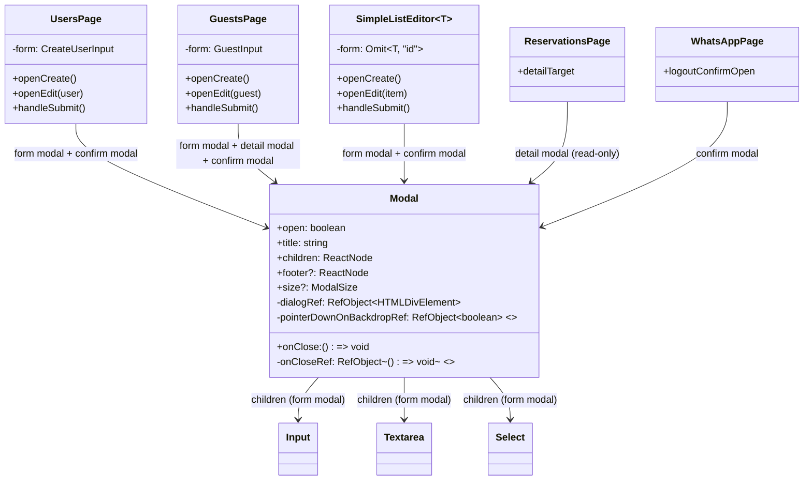
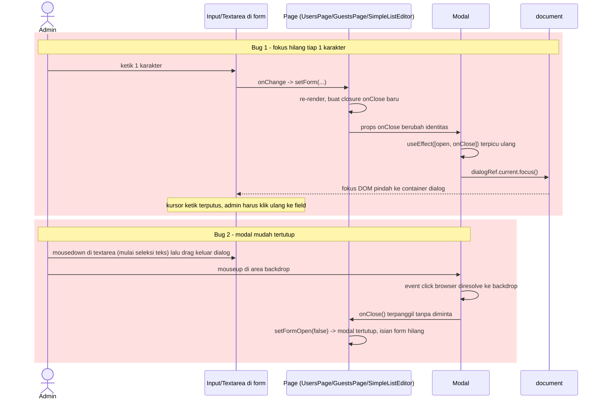
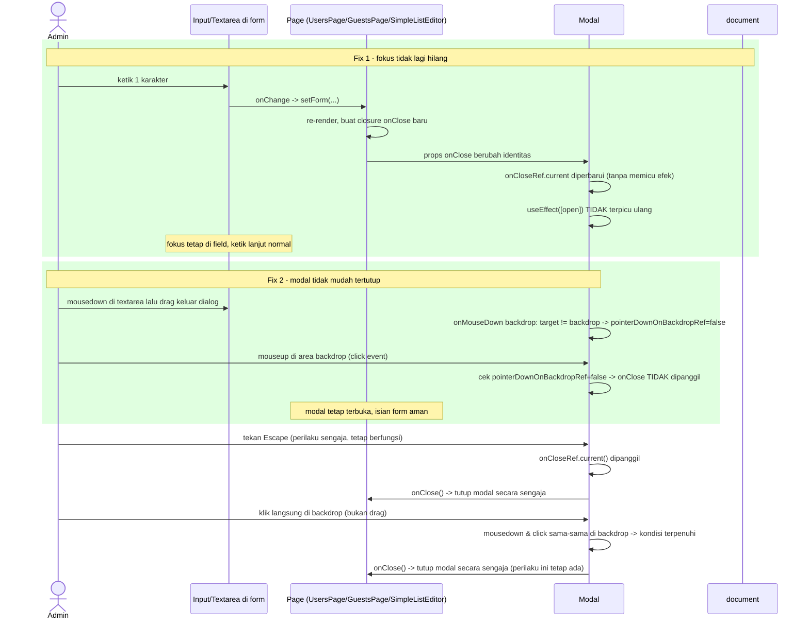

# PLAN.md — Perbaikan Fokus Input Hilang & Modal Mudah Tertutup (Halaman Admin)

## 1. Requirement yang Disepakati & Klasifikasi Intent

**Permintaan asli (user):**
> "saat ini inputan dalam halaman admin saya, setiap menginputkan 1 karakter,
> fokus field-nya hilang, perbaiki agar ideal dan tidak ada bug, terutama
> pada field-field inputan dalam form yang ada dalam modal, juga modal itu
> sepertinya mekanismenya saat ini tidak ideal, karena mudah terclose."

**Klasifikasi intent:** **Bug fix (defect triage)** — perilaku menyimpang dari
yang seharusnya (input kehilangan fokus setiap 1 karakter; modal tertutup
tanpa diminta). Bukan enhancement atau capability baru — tidak ada perilaku
baru yang diminta, murni memperbaiki cacat pada mekanisme yang sudah ada.

**Ruang lingkup yang dikunci dari pesan user:** fokus perbaikan adalah
field input **di dalam form yang berada di dalam modal** (bukan seluruh
input halaman admin secara umum), plus mekanisme modal itu sendiri
(gampang ter-close).

**Keputusan Step 0:** Tidak ada pertanyaan yang diajukan ke user sebelum
trace, karena tidak ada ambiguitas "apa" yang tersisa — gejala, lokasi
(form dalam modal), dan hasil yang diinginkan ("ideal, tidak ada bug") sudah
cukup jelas untuk langsung ditelusuri ke kode.

## 2. Trace (Step 1–3) — Hasil Investigasi

**Stack:** React 19 (function component + hooks), Tailwind 4, tanpa state
management eksternal untuk form modal (pakai `useState` lokal per halaman).
Semua modal admin memakai satu komponen bersama:
[`apps/web/src/shared/components/ui/Modal.tsx`](../../../apps/web/src/shared/components/ui/Modal.tsx).

**Entry point dikonfirmasi ada** — dicek pemakaian `<Modal` di seluruh
`apps/web/src/modules/admin/**`, ditemukan di 5 tempat, semuanya memakai
komponen `Modal` yang sama:

| Halaman/komponen | Modal dipakai untuk | Ada input teks di dalam? |
|---|---|---|
| `users/pages/UsersPage.tsx:230` | form tambah/ubah pengguna | Ya (`Input` x2) |
| `guests/pages/GuestsPage.tsx:379,499,527` | form tambah/ubah, detail, konfirmasi hapus tamu | Ya (`Input`, `Select`, `Textarea`) |
| `content/components/SimpleListEditor.tsx:170,235` (dipakai `ContentPage.tsx`) | form tambah/ubah item konten, konfirmasi hapus | Ya (`Input`/`Textarea`) |
| `reservations/pages/ReservationsPage.tsx:196` | detail reservasi (read-only) | Tidak |
| `whatsapp/pages/WhatsAppPage.tsx:361` | konfirmasi logout | Tidak |

`sections/pages/SectionsPage.tsx` dan `settings/pages/SettingsPage.tsx`
**tidak** memakai `Modal` — form-nya inline langsung di halaman. Dicek juga
tidak ada dialog kustom lain (`grep "role=\"dialog\""` / `"fixed inset-0"` di
`modules/admin/**` hanya menemukan overlay sidebar mobile di
`AdminLayout.tsx`, bukan form modal) — jadi seluruh masalah bermuara ke satu
komponen bersama.

### Root cause #1 — fokus hilang setiap 1 karakter

Di `Modal.tsx:26-34`:

```tsx
useEffect(() => {
  if (!open) return
  function onKeyDown(e: KeyboardEvent) {
    if (e.key === 'Escape') onClose()
  }
  document.addEventListener('keydown', onKeyDown)
  dialogRef.current?.focus()
  return () => document.removeEventListener('keydown', onKeyDown)
}, [open, onClose])
```

Efek ini bergantung pada `onClose`. Namun di **semua** titik pemanggilan
(`UsersPage.tsx:232`, `GuestsPage.tsx:381/499/529`,
`SimpleListEditor.tsx:172/237`, dst.), `onClose` dikirim sebagai **arrow
function inline**, misalnya `onClose={() => setFormOpen(false)}`. Arrow
function ini dibuat ulang (identitas baru) setiap kali komponen halaman
(`UsersPage`, `GuestsPage`, `SimpleListEditor`) re-render.

Alur bug: mengetik 1 karakter di `Input`/`Textarea` di dalam form →
`onChange` memanggil `setForm(...)` → state di halaman berubah → halaman
re-render → `Modal` menerima prop `onClose` baru (identitas fungsi berbeda)
→ `useEffect` dengan dependency `[open, onClose]` mendeteksi `onClose`
berubah → efek dijalankan ulang → `dialogRef.current?.focus()` dipanggil
lagi → fokus DOM dipaksa pindah dari input yang sedang diketik ke container
dialog (`div` dengan `tabIndex={-1}` di baris 44-48). Ini terjadi di **setiap
keystroke**, persis gejala yang dilaporkan.

### Root cause #2 — modal mudah tertutup tanpa diminta

Di `Modal.tsx:39-42`:

```tsx
<div
  className="fixed inset-0 z-50 ..."
  onClick={onClose}
>
  <div ... onClick={(e) => e.stopPropagation()}>
```

Backdrop menutup modal di `onClick`. `stopPropagation()` di kotak dialog
hanya mencegah event yang **berasal** dari dalam kotak dialog. Tapi kalau
admin melakukan **mousedown di dalam elemen form** (mis. mulai men-select
teks di `Textarea` alamat/catatan) lalu men-drag pointer ke luar kotak
dialog sebelum mouse dilepas, event `click` yang dihasilkan browser
targetnya adalah **backdrop** (karena mousedown dan mouseup berada di
elemen yang berbeda, titik temu terdekatnya adalah backdrop) — bukan kotak
dialog — sehingga `stopPropagation()` di kotak dialog tidak pernah
terpanggil, dan `onClose` di backdrop langsung tereksekusi. Modal tertutup
padahal admin cuma sedang menyeleksi teks di dalam form, bukan bermaksud
menutup modal.

## 3. Desain Perbaikan (Step 4)

Tidak ada fork "bagaimana" yang perlu dikonfirmasi ke user — ini murni
perbaikan cacat, bukan pilihan desain dengan trade-off. Kedua perbaikan
diletakkan **di satu file**, `Modal.tsx`, mengikuti kriteria *smallest
blast radius* + *simplest mechanism*: memperbaiki komponen bersama sekali
otomatis memperbaiki seluruh 5 titik pemakaian tanpa menyentuh satu pun
halaman pemanggil.

- **Fix #1 (fokus):** putuskan efek fokus/Escape dari identitas `onClose`
  yang tidak stabil, pakai pola *latest ref* — simpan `onClose` terbaru ke
  `useRef` yang di-assign ulang setiap render (tanpa memicu efek), dan ubah
  dependency array efek menjadi `[open]` saja. Efek jadi hanya berjalan saat
  modal benar-benar transisi buka/tutup, bukan setiap re-render halaman.
  Handler Escape memanggil `onCloseRef.current()` supaya tetap memanggil
  versi `onClose` terbaru walau tidak ada di dependency array.
- **Fix #2 (mudah tertutup):** bedakan "klik sengaja di backdrop" dari
  "drag yang berakhir di backdrop" dengan melacak elemen tempat
  `mousedown` terjadi (`useRef<boolean>`), lewat `onMouseDown` di backdrop.
  `onClick` backdrop hanya memanggil `onClose()` bila **baik** mousedown
  **maupun** click sama-sama tepat mengenai backdrop itu sendiri
  (`e.target === e.currentTarget` di kedua event). Pola ini dipakai luas di
  library dialog (Radix/Headless UI) untuk masalah yang sama.

Dicek ke `apps/web/src/shared/hooks/` — direktori ini **tidak ada**, dan
tidak ditemukan util `useLatest`/`useEvent` di manapun di `apps/web/src`
(hanya 1 hit `useCallback` di `ToastProvider.tsx`, tidak relevan). Jadi pola
*latest ref* ditulis inline di `Modal.tsx`, tidak membuat hook/abstraksi
baru — membuat hook bersama untuk satu titik pakai adalah over-engineering
untuk perbaikan sekecil ini.

**Batasan (out of scope) — dan alasannya:**
- `SectionsPage.tsx` & `SettingsPage.tsx` — tidak dalam scope karena form-nya
  inline, bukan di dalam `Modal`; gejala yang dilaporkan spesifik ke form
  dalam modal.
- `Input.tsx`, `Textarea.tsx`, `Select.tsx` — tidak diubah; root cause bukan
  di komponen field, melainkan di `Modal` yang mencuri fokus balik.
- Tidak ada perubahan skema database/API — ini murni bug UI frontend,
  sehingga tidak ada bagian **ERD** dalam PLAN.md ini (tidak ada tabel/data
  yang disentuh atau relevan dengan perbaikan ini).
- Tombol close (X) dan tombol Escape tetap berfungsi menutup modal secara
  sengaja — perilaku ini dipertahankan, hanya jalur "tidak sengaja" yang
  diperbaiki.

## 4. Re-trace untuk Reuse (Step 5)

- **Reuse:** komponen `Modal` itu sendiri (tidak dibuat modal baru),
  `dialogRef` yang sudah ada tetap dipakai untuk fokus awal saat modal
  dibuka.
- **Reuse pola test:** `apps/web/src/shared/components/ui/Switch.test.tsx`
  dipakai sebagai acuan gaya test (`@testing-library/react` + `fireEvent`,
  tanpa helper tambahan) untuk `Modal.test.tsx` yang baru.
- **Create new (dengan bukti gap):** ref `onCloseRef` dan
  `pointerDownOnBackdropRef` di dalam `Modal.tsx` — tidak ada util sejenis
  yang bisa dipakai ulang (dicek, direktori hooks bersama tidak ada).
- **Tidak ada perubahan** di 5 titik pemanggil (`UsersPage.tsx`,
  `GuestsPage.tsx`, `SimpleListEditor.tsx`, `ReservationsPage.tsx`,
  `WhatsAppPage.tsx`) — perbaikan sepenuhnya terkurung di `Modal.tsx`.

## 5. File yang Disentuh

| File | Perubahan |
|---|---|
| `apps/web/src/shared/components/ui/Modal.tsx` | Fix #1 (latest-ref untuk `onClose` di efek fokus/Escape) + Fix #2 (bedakan mousedown vs click di backdrop) |
| `apps/web/src/shared/components/ui/Modal.test.tsx` (baru) | Test regresi untuk kedua bug |

## 6. Task List

1. [x] Di `Modal.tsx`: tambahkan `const onCloseRef = useRef(onClose)` lalu
   `onCloseRef.current = onClose` di body komponen (dijalankan tiap render,
   tanpa `useEffect`).
2. [x] Di `Modal.tsx`: ubah `useEffect` baris 26-34 — dependency array jadi
   `[open]` saja, handler `onKeyDown` memanggil `onCloseRef.current()`
   (bukan `onClose()` langsung).
3. [x] Di `Modal.tsx`: tambahkan `const pointerDownOnBackdropRef = useRef(false)`.
4. [x] Di `Modal.tsx`: tambahkan `onMouseDown` pada `div` backdrop (baris
   39-42) yang men-set `pointerDownOnBackdropRef.current = e.target === e.currentTarget`.
5. [x] Di `Modal.tsx`: ubah `onClick` backdrop menjadi handler yang hanya
   memanggil `onClose()` jika `pointerDownOnBackdropRef.current === true`
   **dan** `e.target === e.currentTarget`, lalu reset ref ke `false` setelah
   dicek (mencegah "nyangkut" true di klik berikutnya).
6. [x] Buat `apps/web/src/shared/components/ui/Modal.test.tsx` mengikuti
   pola `Switch.test.tsx`, mencakup seluruh kasus di §7 Test Plan.
7. [x] Jalankan test suite frontend (`npx vitest run` di `apps/web`) dan
   pastikan test existing yang me-render `Modal` tidak regresi:
   `GuestsPage.test.tsx`, `UsersPage.test.tsx`, `ReservationsPage.test.tsx`,
   `WhatsAppPage.test.tsx`, `SectionsPage.test.tsx`.

**Status implementasi:** Selesai. `Modal.test.tsx` (5 test baru) lulus,
kelima test file existing di atas (28 test) tetap hijau tanpa perubahan,
dan `tsc --noEmit` bersih.

**Catatan urutan:** task 1-2 (Fix #1) dan task 3-5 (Fix #2) independen satu
sama lain (sama-sama di file yang sama tapi blok kode berbeda), boleh
dikerjakan dalam urutan apa pun sebelum task 6; task 6-7 baru bisa jalan
setelah 1-5 selesai karena test menguji hasil fix-nya.

## 7. Test Plan (`Modal.test.tsx`)

Mengikuti pola `Switch.test.tsx` (`@testing-library/react`, `fireEvent`,
tanpa mock tambahan):

1. **Fokus tidak hilang saat mengetik** — render `Modal` `open` lewat
   wrapper controlled yang menyimpan `onClose` sebagai arrow function baru
   di setiap render (mensimulasikan pola asli di `UsersPage`/`GuestsPage`),
   berisi satu `<input>` di dalam. `fireEvent.change` pada input beberapa
   kali berturut-turut (mensimulasikan ketik per karakter, masing-masing
   memicu re-render induk). Assert: `document.activeElement` tetap elemen
   input yang sama di setiap langkah (bukan berpindah ke `div[role=dialog]`).
2. **Escape tetap menutup modal** — `fireEvent.keyDown(document, { key: 'Escape' })`
   memanggil `onClose` (regresi check, memastikan Fix #1 tidak merusak
   fitur Escape lewat `onCloseRef`).
3. **Klik langsung di backdrop tetap menutup modal** — `fireEvent.click`
   pada elemen backdrop (bukan kotak dialog) tanpa `mousedown` sebelumnya
   di dalam dialog → `onClose` terpanggil (regresi check untuk perilaku
   "klik di luar modal = tutup" yang harus tetap ada).
4. **Drag dari dalam dialog ke backdrop TIDAK menutup modal** —
   `fireEvent.mouseDown` pada elemen anak di dalam dialog (mis. textarea),
   lalu `fireEvent.click` pada backdrop (simulasi mouseup yang berakhir di
   backdrop). Assert `onClose` **tidak** terpanggil — ini kasus utama
   Fix #2.
5. **Tombol close (ikon X) tetap menutup modal** — regresi check sederhana,
   `fireEvent.click` pada tombol dengan `aria-label="Tutup"`.

## 8. Diagram

### 8.1 Class Diagram



### 8.2 Sequence Diagram — Alur Saat Ini (Bug)



### 8.3 Sequence Diagram — Alur Setelah Perbaikan



### 8.4 ERD

Tidak dibuat — tidak ada tabel/data/API yang disentuh atau relevan dengan
perbaikan ini. Ini murni bug pada state React & event handling di komponen
UI (`Modal.tsx`).

## 9. Catatan Volume/Performa (Step 7)

Perubahan hanya menambah 2 `useRef` dan mengganti dependency array satu
`useEffect` dari 2 item ke 1 item, plus satu handler `onMouseDown` ringan
pada backdrop. Tidak ada loop, query, atau operasi yang skalanya
bergantung pada jumlah data — dampak performa nihil, berlaku di volume
data berapa pun karena ini murni interaksi UI per instance modal yang
sedang terbuka.

## 10. Log Validasi (Step 7)

**Validation pass 1:**
- Requirement agreement: sesuai — kedua gejala yang dilaporkan user
  (fokus hilang per karakter, modal mudah tertutup) masing-masing punya
  root cause terverifikasi dan fix terpisah.
- Sequence completeness: setiap hop di §8.2/§8.3 merujuk fungsi/elemen yang
  benar-benar ada di kode (`dialogRef`, `onClose`, backdrop `div`) atau ke
  ref baru yang didefinisikan di task list §6 — tidak ada hop menggantung.
- Ordering: task 1-2 dan 3-5 independen, task 6-7 bergantung ke 1-5 dan
  sudah diurutkan setelahnya — tidak ada task yang butuh hasil task
  sesudahnya.
- Diagram ↔ prosa ↔ task list: `onCloseRef` dan `pointerDownOnBackdropRef`
  muncul konsisten di §3, §5 class diagram, dan task 1-5; tidak ada nama
  yang orphan.
- Fact re-check: `Modal.tsx:26-34` (efek fokus/Escape) dan `Modal.tsx:39-42`
  (backdrop) dicocokkan ulang ke isi file yang sudah dibaca — sesuai.
- Exception/error path: tombol close (X) dan Escape sebagai jalur "tutup
  yang disengaja" tetap dipertahankan dan dicek regresinya di test #2 & #5;
  klik sengaja di backdrop (bukan drag) tetap menutup modal, dicek di
  test #3.
- Performa/volume: dibahas di §9, tidak ada risiko di volume data
  berapa pun karena ini murni UI event handling.

Tidak ada temuan pada pass ini — PLAN.md dinyatakan selesai divalidasi.
