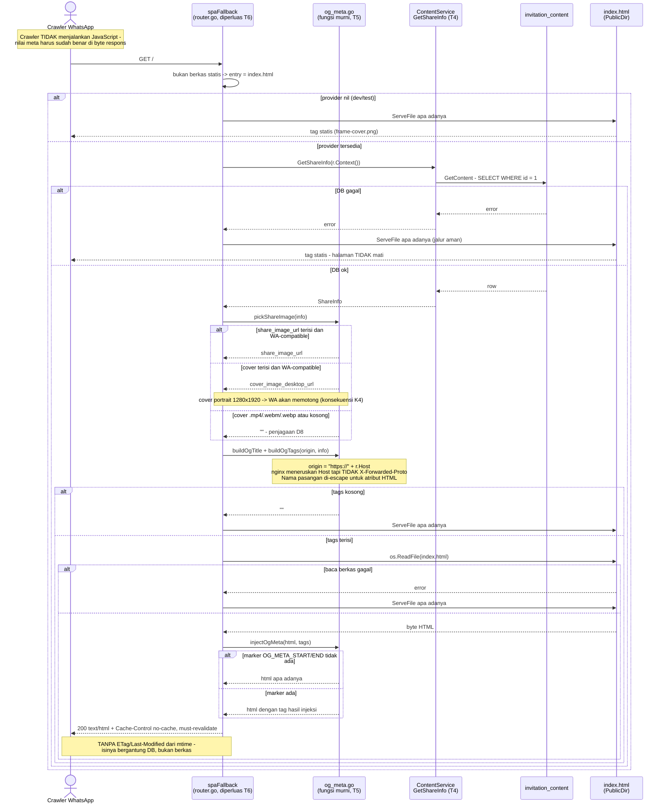
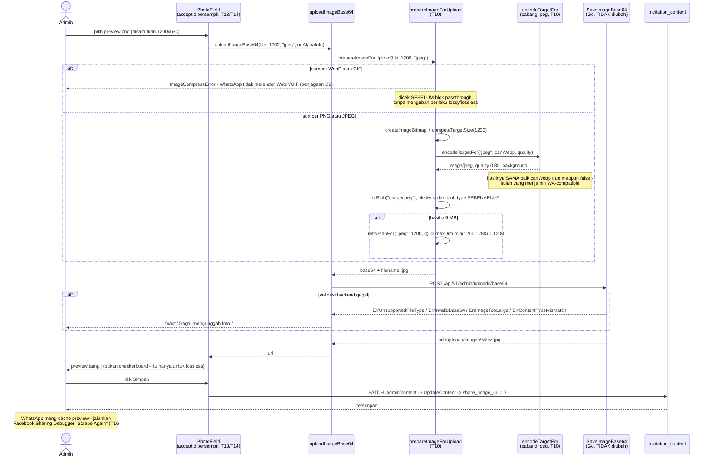
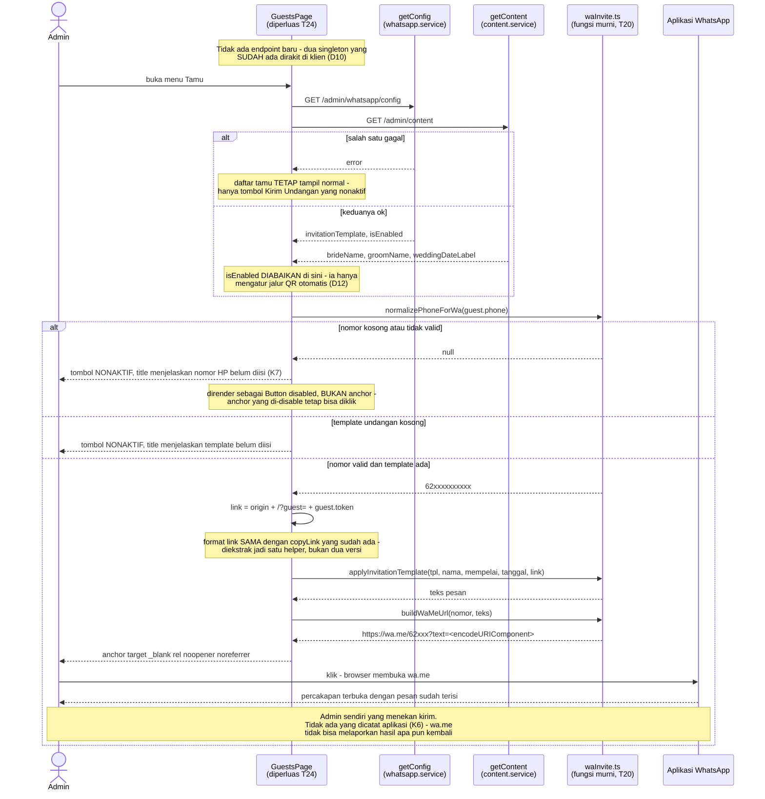

# PLAN — Berbagi Undangan lewat WhatsApp: Preview Link Dinamis + Kirim Undangan per Tamu

Analis: System Analyst (sesi 2026-09-04, lanjutan)
Target pembaca: programmer yang mengimplementasikan.

Plan ini memuat **dua bagian** yang keduanya berujung pada satu hal: link
undangan yang dikirim ke tamu lewat WhatsApp.

| Bagian | Isi | Intent | Task |
|---|---|---|---|
| **A** | Preview link (`og:*`) memakai gambar & judul dari admin, bukan frame template | **bug fix** | T1-T16 |
| **B** | Template Pesan dipecah jadi dua (QR + Undangan), plus tombol kirim undangan per tamu lewat `wa.me/` | **new capability** | T17-T26 |

Keduanya sengaja disatukan di satu berkas atas permintaan user. Kaitannya nyata,
bukan sekadar administratif: Bagian B **mengirim** link, Bagian A menentukan
**bagaimana link itu terlihat** saat sampai di WhatsApp. Bagian B tidak
bergantung pada Bagian A secara teknis (bisa dikerjakan lebih dulu — lihat
catatan nomor migration di T17), tapi mengerjakan B tanpa A berarti tamu
menerima link yang preview-nya masih menampilkan frame template.

---

## 1. Pernyataan requirement (hasil Step 0, sudah dikonfirmasi user)

### Bagian A

**Intent: bug fix** — preview link WhatsApp menampilkan **aset yang salah**.
Bukan lagi hitam (itu sudah beres), tapi yang tampil `frame-cover.png` alias
frame template, bukan gambar yang admin unggah. Screenshot user memperlihatkan
bentuk gapura putih di atas latar hitam — itu persis `frame-cover.png`.

Perlu dicatat jujur: perbaikan sebelumnya (`revisi-uat-logo-og-nama-tamu-dresscode`
R2/T4) **berhasil sesuai yang disepakati** — user memilih opsi statis (K4/K6 di
plan itu), dan hasilnya memang gambar tampil, tidak hitam lagi. Yang berubah
adalah keputusannya, setelah melihat hasil nyatanya. Opsi "dinamis per undangan"
yang dulu ditolak sekarang jadi pilihan.

### 1.1 Yang SUDAH beres dan tidak diulang di sini

Diverifikasi dari produksi pada sesi ini, bukan diasumsikan:

| Temuan lama | Bukti | Status |
|---|---|---|
| R1 logo berlatar putih | `coverLogoUrl` kini `/uploads/images/1788521140667336435-cf668151ac0ea3f7.png`, **640x427, RGBA, 78,3% piksel alpha=0** | **TUNTAS** - pipeline PNG-lossless & `maxDim=640` bekerja persis |
| R4 gambar dress code | `dresscodeImageUrl` terisi `/uploads/images/1788521412474794731-129a767584b69c1a.png` | **TUNTAS** - migration 000011 sukses di produksi |
| R2 preview hitam | `og:image` live sudah absolut + `.png` (dibaca dari HTML produksi) | **Akar hitamnya beres**; sisa masalahnya "gambar salah" = plan ini |

### 1.2 Keputusan terkunci (dijawab user di Step 0/4)

| # | Keputusan | Jawaban user |
|---|---|---|
| K1 | Sumber gambar preview | **Field baru khusus preview** yang admin unggah sendiri, rasio landscape ~1200x630. Bukan memakai cover/foto mempelai yang ada. |
| K2 | Judul & deskripsi preview | **Dinamis pakai nama pasangan** (`brideName` & `groomName`), bukan "Undangan Pernikahan" generik. |
| K3 | Format gambar preview | **Tambah format `"jpeg"` baru** yang SELALU menghasilkan JPEG. Alasan yang menentukan: keandalan, bukan hemat byte - crawler WA punya batas ukuran tak terdokumentasi, dan PNG fotografis 1200x630 bisa 1-2,5 MB sehingga preview berisiko diam-diam tidak muncul. |
| K4 | Fallback sebelum admin mengunggah | **Jatuh ke Gambar Cover** (`coverImageDesktopUrl`). User memilih ini di atas rekomendasi saya (yang menyarankan tetap `frame-cover.png`), sadar bahwa cover-nya portrait dan akan terpotong. |

### Bagian B — pernyataan requirement

**Intent: new capability.** Menu WhatsApp sekarang punya **satu** Template
Pesan; harus jadi **dua**:

1. **Template Pesan QR Code** — yang sudah ada, dipakai modul WhatsApp
   (whatsmeow) untuk mengirim QR otomatis sesudah tamu RSVP.
2. **Template Pesan Undangan** — **baru**, dipakai untuk mengirim **link
   undangan** ke tamu.

Di daftar tamu ditambahkan **satu tombol "Kirim Undangan"** per tamu.
Mekanismenya lewat WhatsApp tapi **BUKAN** modul WhatsApp yang existing:
memakai link `wa.me/` yang membuka aplikasi WhatsApp dengan pesan sudah
terisi.

| # | Keputusan | Jawaban user |
|---|---|---|
| K5 | Placeholder Template Pesan Undangan | **`{nama}`, `{mempelai}`, `{tanggal}`, `{link}`** — **tanpa** `{jumlah}`, karena saat undangan dikirim tamu belum RSVP sehingga angkanya selalu menyesatkan. |
| K6 | Pelacakan pengiriman | **Tidak dilacak.** Tombol hanya membuka `wa.me`, tanpa menyimpan apa pun. Konsekuensi yang diterima sadar: nol kolom baru di tabel `guests`, nol endpoint baru, dan admin melacak sendiri siapa yang sudah dikirimi di luar aplikasi. |
| K7 | Tamu tanpa nomor HP | **Tombol dinonaktifkan** (disabled) dengan keterangan bahwa nomor HP belum diisi — bukan membuka `wa.me` tanpa nomor. |

### 1.3 Keputusan desain (Step 4)

| # | Keputusan | Alasan |
|---|---|---|
| D1 | Meta di-inject **server-side di `spaFallback`**, bukan lewat templating `index.html` oleh Vite | Crawler WhatsApp **tidak menjalankan JavaScript**, jadi menambal `og:image` dari `location.origin` di klien mati sejak awal. Dan nilainya ada di DB, sedangkan `index.html` statis. Injeksi di jalur yang sudah menyajikan HTML itu adalah mekanisme paling sederhana yang memenuhi requirement. |
| D2 | Akses data lewat **`contracts.InvitationInfoProvider` yang SUDAH ADA**, ditambah satu method | Modul `router` tidak boleh mengimpor internal modul `content` (`.claude/rules/backend-modular-monolith.md`), dan router **sudah punya preseden mematuhi itu**: `contentTypeByExt` di [router.go:36-43](../../../apps/api/internal/router/router.go#L36) adalah salinan kecil yang sengaja dibuat dengan komentar menyebut aturannya. `contracts/` adalah permukaan publik yang sah - modul `guest` sudah memakainya. |
| D3 | `GetShareInfo` **memakai ulang `GetContent`**, bukan query baru | Mengikuti persis pola `GetQRInfo` ([service.go:109-124](../../../apps/api/internal/modules/content/application/service.go#L109)) yang komentarnya menyatakan "Memakai ulang GetContent, bukan query baru". |
| D4 | Struct kontrak **baru `ShareInfo`**, bukan menambah field ke `QRInfo` | `QRInfo` dinamai untuk keperluan QR dan komentarnya menegaskan "bukan seluruh InvitationContentDTO" - hanya field yang dibutuhkan. Menitipkan URL gambar share ke situ mengaburkan maksudnya. |
| D5 | Origin URL absolut = `"https://" + r.Host` | **Diverifikasi**, bukan ditebak: nginx meneruskan `Host` ([nginx.conf:10](../../../infra/nginx/nginx.conf#L10)) tapi **TIDAK** menyetel `X-Forwarded-Proto`, jadi skema tidak bisa dibaca dari header; `r.TLS` juga nil karena TLS diterminasi nginx. Menghardcode skema `https` + host dari request menghapus domain hardcoded (memperbaiki kerapuhan D4 plan sebelumnya) **tanpa** bergantung header yang tidak dikirim. |
| D6 | `spaFallback` menerima provider **nilable**; `nil` = tanpa injeksi | Membuat perubahan signature ini tidak memaksa menulis ulang isi 10 test yang sudah ada (cukup menambah `, nil`), **dan** sekaligus menjadi jalur aman produksi: kalau provider tidak tersedia, HTML statis disajikan apa adanya. Satu mekanisme melayani dua kebutuhan. |
| D7 | Injeksi ditandai **marker komentar HTML**, bukan mencari-ganti string `content="..."` | Marker membuat tag statis tetap ada sebagai **fallback yang valid** (dipakai saat DB gagal / marker tidak ada / dev), dan tidak rapuh terhadap perubahan urutan atau spasi di `index.html`. Mencari-ganti nilai atribut akan pecah begitu ada yang merapikan HTML-nya. |
| D8 | Fallback cover **wajib dijaga ekstensinya** | Ini jebakan nyata dari K4, bukan teoretis: kolom cover **bisa berisi video**. `isVideoUrl` menerima `.mp4`/`.webm` ([coverMedia.ts:6-9](../../../apps/web/src/shared/lib/coverMedia.ts#L6)) dan migration `000010_cover_to_video` benar-benar pernah menyetel cover ke `.mp4`. URL video sebagai `og:image` = preview rusak. Jadi cover hanya dipakai bila ekstensinya `.png`/`.jpg`/`.jpeg`. |
| D9 | Field share dibatasi `accept` PNG/JPG **dan** dijaga di pipeline | `accept` di `<input type="file">` hanya petunjuk, bukan penegakan. Karena WebP/GIF menempuh jalur **passthrough** (invarian D5 plan sebelumnya - tidak boleh disentuh), tanpa penjagaan sebuah `.webp` akan lolos utuh dan membuat preview WA rusak lagi. Jadi `prepareImageForUpload` menolak passthrough saat `format === 'jpeg'`. |
| D10 | Pesan dirakit **di browser**, bukan lewat endpoint baru | Karena `wa.me` adalah redirect klien, **tidak ada alur backend sama sekali** dalam pengiriman. Admin SPA sudah punya kedua sumber datanya sebagai endpoint terpisah (`/admin/whatsapp/config` dan `/admin/content`), jadi merakit di klien memakai nol endpoint baru dan nol pembacaan lintas modul di sisi Go. Kriteria yang memutuskan: **mekanisme paling sederhana yang memenuhi requirement** — menambah endpoint hanya untuk merangkai string adalah lapisan yang tidak dibayar apa pun. |
| D11 | `invitation_template` ditaruh di **`whatsapp_config`**, bukan tabel/modul baru | User meminta keduanya berada di menu WhatsApp (K5), dan tabel itu sudah singleton `id=1` dengan pola yang sama seperti `invitation_content`. Nol tabel baru, nol modul baru. |
| D12 | `is_enabled` tetap **milik jalur QR saja** | Switch itu dideskripsikan sebagai penghenti "pengiriman QR ke WhatsApp" ([WhatsAppPage.tsx:280-281](../../../apps/web/src/modules/admin/whatsapp/pages/WhatsAppPage.tsx#L280)). Template Undangan dikirim **manual per tamu**, jadi tidak punya dan tidak boleh ikut toggle ini — kalau disamakan, mematikan auto-send QR akan diam-diam melumpuhkan tombol Kirim Undangan. |
| D13 | Helper `wa.me` ditulis sebagai **fungsi murni** di `shared/lib` | Mengikuti konvensi yang sudah mapan: `applyTemplate`/`normalizePhone` di Go sengaja dipisah sebagai "helper murni, diuji tanpa koneksi WhatsApp/DB" ([service.go:283](../../../apps/api/internal/modules/whatsapp/application/service.go#L283)), dan `shared/lib` sudah menampung `image-compress.ts`/`coverMedia.ts` dengan pola ekspor fungsi murni + test berdampingan. |
| D14 | Normalisasi nomor **diduplikasi ke TypeScript**, dan itu disengaja | `normalizePhone` hanya ada di Go dan browser tidak bisa memanggilnya; tidak ada normalizer telepon di `apps/web` (diverifikasi: nol hasil pencarian). Duplikasi lintas bahasa di sini **tidak bisa dihindari**, jadi yang dilakukan adalah menandainya eksplisit di kedua sisi supaya perubahan aturan nomor tidak dikerjakan sebelah saja. |

### 1.4 Determinasi reuse / extend / create-new (Step 3 & 5)

| Sisi | Determinasi | Bukti |
|---|---|---|
| `contracts.InvitationInfoProvider` | **Extend** (+1 method) | Interface sudah ada ([contracts/invitation.go](../../../apps/api/internal/modules/content/contracts/invitation.go)); `content.New` **sudah** mengembalikan tipe interface ini ([content.module.go:17](../../../apps/api/internal/modules/content/content.module.go#L17)), jadi menambah method **tidak mengubah** signature `New` maupun `main.go` bagian perakitan modul. |
| `GetContent` | **Reuse, tanpa perubahan** | Sudah mengembalikan seluruh `InvitationContentDTO` termasuk `CoverImageDesktopUrl`. |
| Modul `guest` | **Tidak berubah** | Menerima `contentContracts.InvitationInfoProvider` ([guest service.go:58](../../../apps/api/internal/modules/guest/application/service.go#L58)) dan hanya memanggil `GetQRInfo` ([:467](../../../apps/api/internal/modules/guest/application/service.go#L467)). Method baru tidak dipakainya, dan karena yang disuntikkan adalah `*application.Service` konkret, ia tetap memenuhi interface. |
| `spaFallback` | **Extend** (+1 parameter nilable) | [router.go:190-245](../../../apps/api/internal/router/router.go#L190). Header `Cache-Control: no-cache, must-revalidate` di [:242](../../../apps/api/internal/router/router.go#L242) **sudah** benar untuk HTML yang isinya dinamis - tidak perlu diubah. |
| `encodeTargetFor` / `retryPlanFor` | **Extend** (+1 cabang masing-masing) | Fungsi murni di [image-compress.ts:132](../../../apps/web/src/shared/lib/image-compress.ts#L132) dan [:167](../../../apps/web/src/shared/lib/image-compress.ts#L167), sudah punya test dan pola cabang per format. |
| `PhotoField` | **Extend** (+1 prop `accept`) | Sudah menerima `maxDim`/`format`; `accept` masih hardcode di [ContentPage.tsx:124](../../../apps/web/src/modules/admin/content/pages/ContentPage.tsx#L124). |
| Tabel `invitation_content` | **Enhance** (+1 kolom) | Pola `ADD COLUMN ... NOT NULL DEFAULT '' AFTER <kolom>` sudah dipakai migration 000011 sesi lalu. Migration berikutnya: **000012**. |
| `router_fallback_test.go` | **Extend** | 10 pemanggilan `spaFallback(dir)` perlu `, nil`; suite-nya jadi tempat alami test injeksi. |
| `ogAbsoluteURL` / `isWaCompatibleImage` / `pickShareImage` / `buildOgTags` / `injectOgMeta` | **Create new** (fungsi murni, berkas baru) | Celah nyata: tidak ada satu pun helper meta/OG di `apps/api`. Dipisah sebagai fungsi murni supaya bisa dites tanpa HTTP maupun DB. |
| **Bagian B** | | |
| Tabel `whatsapp_config` | **Enhance** (+1 kolom) | Singleton `id=1` dengan `message_template TEXT NOT NULL` + seed ([000008](../../../apps/api/migrations/000008_create_whatsapp_tables.up.sql)). Pola seed-nya langsung dipakai ulang untuk default template undangan. |
| `applyTemplate` (Go) | **Tidak berubah** | [service.go:303-311](../../../apps/api/internal/modules/whatsapp/application/service.go#L303) tetap melayani jalur QR apa adanya. Jalur undangan **tidak** memakainya — perakitan terjadi di browser (D10), jadi tidak ada alasan menyentuh fungsi yang sudah tertest. |
| `normalizePhone` (Go) | **Tidak berubah, tapi jadi acuan** | [service.go:287-301](../../../apps/api/internal/modules/whatsapp/application/service.go#L287) — aturannya (`+62`/`0` → `62`, buang spasi & tanda hubung) disalin ke TypeScript (D14). |
| `copyLink` di `GuestsPage` | **Reuse polanya** | [GuestsPage.tsx:170-171](../../../apps/web/src/modules/admin/guests/pages/GuestsPage.tsx#L170) sudah membangun `${window.location.origin}/?guest=${guest.token}` — format link undangan **tidak** boleh dibuat versi kedua yang berbeda. |
| DTO tamu admin | **Reuse, tanpa perubahan** | Sudah membawa `Phone` dan `Token` ([guest dto.go:14,16](../../../apps/api/internal/modules/guest/application/dto.go#L14)) — dua-duanya yang dibutuhkan tombol, jadi **tidak** ada perubahan endpoint tamu. |
| Tabel `guests` | **Tidak berubah** | Konsekuensi langsung K6 (tanpa pelacakan): tidak ada kolom `invitation_sent_at` maupun endpoint PATCH baru. |
| Modul `whatsapp` (whatsmeow/sender) | **Tidak berubah** | Requirement menyatakan eksplisit "bukan module whatsapp yang existing". Tidak ada `Sender`, tidak ada `whatsapp_send_logs`, tidak ada JID yang tersentuh jalur undangan. |
| `normalizePhoneForWa` / `applyInvitationTemplate` / `buildWaMeUrl` | **Create new** (fungsi murni, berkas baru) | Celah nyata & terverifikasi: **nol** hasil pencarian `wa.me` di seluruh repo, dan **nol** normalizer telepon di `apps/web`. |

---

## 2. Hasil trace (Step 1-3, 5)

Stack sama seperti sesi sebelumnya: `apps/web` (React + Vite 5, `noUnusedLocals`)
dan `apps/api` (Go modular monolith, sqlc + golang-migrate + MySQL).

### 2.1 Kenapa HTML statis tidak mungkin menampilkan gambar admin

`og:image` adalah nilai literal di [index.html:35](../../../apps/web/index.html#L35).
Gambar yang admin unggah tersimpan sebagai baris DB (`invitation_content`), dan
jalur yang menyajikan HTML **tidak menyentuh DB sama sekali**:

```
mux.Handle("/", spaFallback(d.PublicDir))          // router.go:185
  -> spaFallback: http.ServeFile(w, r, .../index.html)   // router.go:243
```

`spaFallback` hanya menerima `publicDir string` ([router.go:190](../../../apps/api/internal/router/router.go#L190)) —
tidak ada dependency data apa pun. Jadi ini bukan "nilai yang salah dikonfigurasi",
melainkan **kapabilitas yang belum ada**. Itulah kenapa intent-nya bug fix tapi
pekerjaannya menambah mekanisme.

Dan crawler tidak bisa ditolong dari sisi klien: WhatsApp/Facebook **tidak
menjalankan JavaScript**, sehingga menulis ulang `<meta>` lewat React/JS tidak
akan pernah terbaca. Nilainya harus sudah benar di byte HTML yang dikirim server.

### 2.2 Yang sebenarnya tampil sekarang, dan mengapa

Dibaca langsung dari produksi:

```
og:image  = https://elwedding.elcodelabs.com/media/template/arsya/frame-cover.png
og:title  = Undangan Pernikahan
og:description = Hi, You're invited to our wedding ceremony
```

`frame-cover.png` adalah **aset template**, 1144x1624 portrait — bentuk
gapura/frame. Cocok dengan bentuk putih di screenshot user. Jadi preview-nya
"benar" secara teknis (tampil, tidak hitam) tapi menampilkan dekorasi template,
bukan foto pasangan. Judul & deskripsi juga masih string generik dari HTML statis.

### 2.3 Aset yang tersedia sebagai kandidat, dan masalahnya

Diukur dari berkas produksi sungguhan:

| Aset | Nilai | Ukuran & rasio |
|---|---|---|
| `coverImageDesktopUrl` | `/uploads/images/1788502785005640983-3b65700280171066.jpg` | JPEG **1280x1920**, rasio 0,67 (portrait), 813.782 byte |
| `coverImageMobileUrl` | `/uploads/images/1788502795429768815-1b8d497cb83a0466.jpg` | **Berkas yang sama** - 813.782 byte identik |
| `bridePhotoUrl` | `/uploads/images/1788502576003547297-b38181bd97a33f17.jpg` | JPEG 1265x1920, rasio 0,66 (portrait) |

Semuanya **portrait**, sedangkan `summary_large_image` yang dipakai WA/Facebook
mengharapkan landscape ~1,91:1. Inilah yang mendasari K1: satu-satunya cara user
mendapat komposisi yang benar adalah mengunggah gambar landscape khusus. Dan
inilah juga konsekuensi yang diterima sadar di K4 — selama field barunya kosong,
cover portrait itu yang dipakai dan akan terpotong.

### 2.4 Rantai data untuk kolom baru

Sama seperti `dresscode_image_url` sesi lalu, dan sudah terbukti jalan:

`migrations/000012_*` -> `queries/invitation_content.sql` (UPDATE; `SELECT *`
ikut otomatis) -> `sqlc generate` (regenerasi `models.go` + `invitation_content.sql.go`
di **keempat** modul, karena semua config sqlc memakai `schema: "migrations"`)
-> `service.go`: map baca di `toContentDTO` ([:92-97](../../../apps/api/internal/modules/content/application/service.go#L92))
dan map tulis di `UpdateContent` ([:170-176](../../../apps/api/internal/modules/content/application/service.go#L170))
-> `dto.go` DUA struct: `InvitationContentDTO` ([:50](../../../apps/api/internal/modules/content/application/dto.go#L50))
dan `UpdateInvitationContentInput` ([:103](../../../apps/api/internal/modules/content/application/dto.go#L103))
-> `types/api.ts` -> `ContentPage.tsx`.

Kolomnya `NOT NULL DEFAULT ''` mengikuti `cover_logo_url`/`dresscode_image_url`,
jadi sqlc menghasilkan `string` biasa — **bukan** `sql.NullString`, sehingga
**tidak** perlu `nullStr`/`toNullStr`.

### 2.5 Kenapa format `"jpeg"` perlu dijaga di pipeline, bukan cuma di `accept`

`prepareImageForUpload` meneruskan GIF/WebP **apa adanya** tanpa menyentuh kanvas
([image-compress.ts blok passthrough](../../../apps/web/src/shared/lib/image-compress.ts#L305)) —
invarian yang sengaja dipertahankan supaya animasi GIF tidak mati. Konsekuensinya
untuk field share: sebuah `.webp` yang lolos akan tersimpan tetap `.webp`, dan
crawler WA **tidak merender WebP** — bug yang sama kembali.

`accept` pada `<input type="file">` hanyalah filter dialog, bukan penegakan;
user bisa memilih "All files". Karena itu D9 menambahkan penolakan eksplisit di
pipeline untuk `format === 'jpeg'`, **tanpa** mengubah perilaku passthrough untuk
format lain.

### 2.6 Bagian B — apa yang ada sekarang dan celahnya

**Template pesan hari ini cuma satu.** `whatsapp_config` punya kolom
`message_template TEXT NOT NULL` dengan seed placeholder `{nama}`, `{jumlah}`,
`{mempelai}`, `{tanggal}` ([000008](../../../apps/api/migrations/000008_create_whatsapp_tables.up.sql)).
UI-nya satu `Textarea` "Isi pesan" plus baris bantuan daftar placeholder
([WhatsAppPage.tsx:268-275](../../../apps/web/src/modules/admin/whatsapp/pages/WhatsAppPage.tsx#L268)),
dan dirender ke pesan oleh `applyTemplate` yang dipanggil `sendQR`
([service.go:261](../../../apps/api/internal/modules/whatsapp/application/service.go#L261)).
Jadi menambah template kedua = satu kolom + satu textarea, bukan mekanisme baru.

**Perangkat untuk `wa.me` hampir seluruhnya sudah ada.** `wa.me/<nomor>?text=<pesan>`
butuh tiga hal, dan ketiganya sudah tersedia di sisi admin:

| Dibutuhkan | Sudah ada? | Bukti |
|---|---|---|
| Nomor format internasional tanpa `+` | Aturannya ada di Go | `normalizePhone` menghasilkan `62xxxxxxxxxx` ([service.go:287-301](../../../apps/api/internal/modules/whatsapp/application/service.go#L287)) — **persis** bentuk yang diminta `wa.me` |
| Link undangan per tamu | **Ya** | `copyLink` sudah menyusun `${window.location.origin}/?guest=${guest.token}` ([GuestsPage.tsx:170-171](../../../apps/web/src/modules/admin/guests/pages/GuestsPage.tsx#L170)) |
| Nomor & token tamu di admin | **Ya** | `Phone` dan `Token` sudah ada di DTO tamu admin ([guest dto.go:14,16](../../../apps/api/internal/modules/guest/application/dto.go#L14)) |

Yang **belum** ada, dan terverifikasi bukan asumsi: pencarian `wa.me` di seluruh
`apps/web` dan `apps/api` mengembalikan **nol** hasil, dan tidak ada normalizer
telepon apa pun di `apps/web`. Jadi tiga fungsi murni baru memang celah nyata,
bukan duplikasi sesuatu yang sudah ada.

**Kenapa perakitan pesan jatuh ke browser (D10).** `GuestsPage` saat ini hanya
memuat daftar tamu (`listGuests`) — tidak memuat konten undangan maupun config
WhatsApp. Untuk merender `{mempelai}`/`{tanggal}`/`{link}` ia butuh dua singleton
tambahan, dan keduanya **sudah punya endpoint admin sendiri**:
`GET /admin/whatsapp/config` (`getConfig`) dan `GET /admin/content` (`getContent`).
Merakit di klien berarti nol endpoint baru. Alternatifnya — menaruh URL siap-pakai
di respons daftar tamu — memaksa modul `guest` membaca `whatsapp_config` **dan**
`invitation_content`, dua pembacaan lintas modul yang harus lewat `contracts/`;
jauh lebih invasif untuk hasil yang identik.

**Jebakan yang harus dijaga.** `is_enabled` pada `whatsapp_config`
dideskripsikan di UI sebagai penghenti pengiriman QR otomatis
([WhatsAppPage.tsx:280-281](../../../apps/web/src/modules/admin/whatsapp/pages/WhatsAppPage.tsx#L280)).
Template Undangan dikirim manual per tamu dan **tidak** boleh ikut toggle itu
(D12) — kalau disamakan, admin yang mematikan auto-send QR akan diam-diam
kehilangan tombol Kirim Undangan tanpa penjelasan apa pun.

---

## 3. Lingkup

### 3.1 Masuk lingkup

| Berkas | Perubahan |
|---|---|
| `apps/api/migrations/000012_add_share_image.{up,down}.sql` | **Baru** — `ADD COLUMN share_image_url` |
| [queries/invitation_content.sql](../../../apps/api/internal/modules/content/infrastructure/queries/invitation_content.sql) | Tambah kolom di UPDATE |
| `apps/api/internal/modules/content/infrastructure/sqlc/*` | **Hasil `sqlc generate`** — jangan disunting tangan |
| [content/application/dto.go](../../../apps/api/internal/modules/content/application/dto.go) | `ShareImageUrl` di DUA struct |
| [content/application/service.go](../../../apps/api/internal/modules/content/application/service.go) | Map baca + tulis, dan `GetShareInfo` |
| [content/contracts/invitation.go](../../../apps/api/internal/modules/content/contracts/invitation.go) | Struct `ShareInfo` + method di `InvitationInfoProvider` |
| [apps/api/cmd/server/main.go](../../../apps/api/cmd/server/main.go) | Teruskan `invitationInfo` ke `router.Deps` |
| [apps/api/internal/router/router.go](../../../apps/api/internal/router/router.go) | `Deps` +1 field; `spaFallback` +1 param; panggil injeksi |
| `apps/api/internal/router/og_meta.go` | **Baru** — fungsi murni OG |
| `apps/api/internal/router/og_meta_test.go` | **Baru** — test fungsi murni |
| [apps/api/internal/router/router_fallback_test.go](../../../apps/api/internal/router/router_fallback_test.go) | 10 pemanggilan `spaFallback` +`, nil`; test injeksi end-to-end |
| [apps/web/index.html](../../../apps/web/index.html) | Marker `OG_META_START`/`END` di sekitar tag statis |
| [apps/web/src/shared/lib/image-compress.ts](../../../apps/web/src/shared/lib/image-compress.ts) | `'jpeg'` di `ImageOutputFormat`, `encodeTargetFor`, `retryPlanFor`, penolakan passthrough |
| [apps/web/src/shared/lib/image-compress.test.ts](../../../apps/web/src/shared/lib/image-compress.test.ts) | Test cabang `'jpeg'` |
| [apps/web/src/types/api.ts](../../../apps/web/src/types/api.ts) | `shareImageUrl: string` |
| [apps/web/src/modules/admin/content/pages/ContentPage.tsx](../../../apps/web/src/modules/admin/content/pages/ContentPage.tsx) | `PhotoField` prop `accept`; field "Gambar Preview Link" |
| [knowledge/FRONTEND.md](../../../knowledge/FRONTEND.md) + [knowledge/BACKEND.md](../../../knowledge/BACKEND.md) | Catat mekanisme injeksi & format `'jpeg'` |

**Bagian B:**

| Berkas | Perubahan |
|---|---|
| `apps/api/migrations/000013_add_invitation_template.{up,down}.sql` | **Baru** — `ADD COLUMN invitation_template` + isi default |
| [whatsapp/infrastructure/queries](../../../apps/api/internal/modules/whatsapp/infrastructure/queries/whatsapp.sql) | Tambah kolom di UPDATE config |
| `apps/api/internal/modules/whatsapp/infrastructure/sqlc/*` | **Hasil `sqlc generate`** — jangan disunting tangan |
| [whatsapp/application/dto.go](../../../apps/api/internal/modules/whatsapp/application/dto.go) | `InvitationTemplate` di DTO config |
| [whatsapp/application/service.go](../../../apps/api/internal/modules/whatsapp/application/service.go) | Map baca + tulis config; **`applyTemplate` & `sendQR` TIDAK disentuh** |
| `apps/web/src/shared/lib/waInvite.ts` | **Baru** — 3 fungsi murni (`normalizePhoneForWa`, `applyInvitationTemplate`, `buildWaMeUrl`) |
| `apps/web/src/shared/lib/waInvite.test.ts` | **Baru** — test ketiganya |
| [whatsapp/services/whatsapp.service.ts](../../../apps/web/src/modules/admin/whatsapp/services/whatsapp.service.ts) | `invitationTemplate` di `WhatsAppConfig` |
| [whatsapp/pages/WhatsAppPage.tsx](../../../apps/web/src/modules/admin/whatsapp/pages/WhatsAppPage.tsx) | Satu Textarea jadi dua bagian berlabel |
| [guests/pages/GuestsPage.tsx](../../../apps/web/src/modules/admin/guests/pages/GuestsPage.tsx) | Muat config + konten; tombol "Kirim Undangan" per baris |
| [knowledge/BACKEND.md](../../../knowledge/BACKEND.md) | Catat dua template & batas `is_enabled` |

### 3.2 Di luar lingkup (keputusan, bukan kelalaian)

- **Preview berbeda per tamu** (`og:title` memuat nama tamu dari `?guest=`) —
  tidak diminta. Semua link berbagi preview yang sama.
- **Menghapus `frame-cover.png` dari `index.html`** — tetap dipertahankan
  sebagai fallback terakhir (D7) bila DB gagal atau kedua kolom kosong.
- **Mengubah `coverImageDesktopUrl`/`coverImageMobileUrl`** — tidak disentuh.
  Fakta bahwa keduanya berkas identik adalah kondisi data, bukan bug kode.
- **Menyetel `X-Forwarded-Proto` di nginx** — tidak diperlukan setelah D5, dan
  vhost produksi berada di luar repo (`/etc/nginx/sites-enabled/elwedding`)
  sehingga tidak bisa dijamin dari sini.
- **Caching hasil injeksi** — lihat §6; pada volume sistem ini tidak dibayar.
- **`resetGuestSessionCache`, pipeline galeri, form gift** — tidak tersentuh.
**Bagian B:**

- **Pelacakan "undangan terkirim"** — ditolak user di K6. Konsekuensi yang
  diterima sadar: tidak ada kolom `invitation_sent_at`, tidak ada penanda di
  daftar tamu, dan admin melacak sendiri siapa yang sudah dikirimi.
- **Kirim massal / broadcast** — user meminta **satu** tombol per tamu. `wa.me`
  juga tidak bisa mengirim ke banyak nomor sekaligus; setiap klik membuka satu
  percakapan.
- **Mengubah jalur QR** — `applyTemplate`, `sendQR`, `normalizePhone`,
  `whatsapp_send_logs`, dan seluruh integrasi whatsmeow **tidak disentuh**.
  Requirement menyatakan eksplisit mekanismenya bukan modul WhatsApp existing.
- **Menyatukan dua template jadi satu editor dengan tab** — tidak diminta; dua
  bagian berlabel dalam satu Card lebih sederhana dan tetap jelas.
- **Bukti pengiriman / status terkirim** — `wa.me` secara desain **tidak bisa**
  melaporkan apa pun kembali ke aplikasi. Menampilkan status "terkirim" akan
  menjadi klaim yang tidak bisa dibuktikan, jadi sengaja tidak dibuat.
- **Preview pesan sebelum kirim** — tidak diminta. Admin melihat pesannya
  langsung di WhatsApp sebelum menekan kirim, jadi salah tulis tetap tertangkap.

- **Permukaan tipe & error yang dipakai apa adanya (tidak diubah):**
  `CompressedImage` (termasuk field `hasAlpha`), `EncodeTarget`, dan `RetryPlan`
  di `image-compress.ts` hanya bertambah cabang nilai, bukan berubah bentuk;
  kolom `DresscodeImageUrl` dari migration 000011 tidak disentuh; dan keempat
  error backend `ErrUnsupportedFileType`, `ErrInvalidBase64`,
  `ErrImageTooLarge`, `ErrContentTypeMismatch` sudah menangani byte JPEG
  dengan benar — digambar di §5.4 supaya programmer tidak menyangka ada cabang
  baru yang perlu dibuat.

---

## 4. Task list (dikerjakan berurutan)

### Bagian A — Preview link dinamis (T1-T16)

- [x] **T1 — Migration 000012.**
  `000012_add_share_image.up.sql`:
  ```sql
  ALTER TABLE invitation_content
    ADD COLUMN share_image_url VARCHAR(500) NOT NULL DEFAULT '' AFTER dresscode_image_url;
  ```
  `.down.sql`: `DROP COLUMN share_image_url;`.
  `NOT NULL DEFAULT ''` supaya sqlc menghasilkan `string` biasa (bukan
  `sql.NullString`) dan baris singleton `id=1` otomatis dapat `''` tanpa
  backfill. **T1 wajib mendahului T2** — `sqlc.yaml` memakai
  `schema: "migrations"`.

- [x] **T2 — Query + `sqlc generate`.**
  Tambah `share_image_url = ?` pada `UpdateInvitationContent`. Lalu
  `sqlc generate` (binari sudah terpasang di `$(go env GOPATH)/bin/sqlc`).
  Harapkan **empat** `models.go` bertambah satu baris — itu benar, semua
  modul mencerminkan seluruh skema. Jangan sunting `infrastructure/sqlc/`.

- [x] **T3 — DTO + map service Go.**
  - `dto.go`: `ShareImageUrl string \`json:"shareImageUrl"\`` di **kedua**
    struct (`InvitationContentDTO` dan `UpdateInvitationContentInput`).
    Melewatkan salah satunya membuat field hilang senyap di satu arah.
  - `service.go`: `ShareImageUrl: row.ShareImageUrl` di `toContentDTO`
    (**tanpa** `nullStr`) dan `ShareImageUrl: in.ShareImageUrl` di
    `UpdateContent` (**tanpa** `toNullStr`).
  - **Jangan** menambah validasi wajib: `''` adalah keadaan sah "belum ada",
    dan T5 memang punya fallback untuk itu.

- [x] **T4 — Kontrak `ShareInfo` + `GetShareInfo`.**
  Di `contracts/invitation.go`, tambah struct dan method pada interface yang
  sudah ada:
  ```go
  type ShareInfo struct {
      BrideName        string
      GroomName        string
      WeddingDateLabel string
      ShareImageUrl    string // '' bila admin belum unggah
      CoverImageUrl    string // fallback K4; BISA berisi video/webp - penjagaan di T6
  }

  type InvitationInfoProvider interface {
      GetQRInfo(ctx context.Context) (QRInfo, error)
      GetShareInfo(ctx context.Context) (ShareInfo, error)
  }
  ```
  Implementasi di `service.go`, **memakai ulang `GetContent`** persis seperti
  `GetQRInfo` (D3) — bukan query baru; isi `CoverImageUrl` dari
  `dto.CoverImageDesktopUrl`.
  Beri komentar bahwa `CoverImageUrl` **tidak dijamin** berupa gambar, supaya
  pemakai berikutnya tidak lupa menjaganya.
  **Modul `guest` tidak perlu disentuh**: ia menerima interface dan hanya
  memakai `GetQRInfo`; yang disuntikkan `main.go` adalah `*application.Service`
  konkret yang kini memenuhi kedua method.

- [x] **T5 — `og_meta.go`: fungsi murni.**
  Berkas baru di paket `router`. Semua murni (tanpa HTTP/DB) supaya bisa dites
  langsung:
  - `func ogAbsoluteURL(origin, path string) string` — gabungkan origin +
    path; kembalikan `path` apa adanya bila sudah absolut (`http://`/`https://`).
  - `func isWaCompatibleImage(path string) bool` — **hanya** `.png`, `.jpg`,
    `.jpeg` (case-insensitive, buang query/fragment dulu). Ini penjaga D8.
  - `func pickShareImage(info contracts.ShareInfo) string` — urutan K4:
    `ShareImageUrl` bila tidak kosong **dan** WA-compatible; lalu
    `CoverImageUrl` bila tidak kosong **dan** WA-compatible; lalu `""`
    (artinya: pakai tag statis).
  - `func buildOgTitle(info contracts.ShareInfo) string` — **realisasi K2** —
    `"<Bride> & <Groom>"`;
    bila salah satu kosong pakai yang ada; bila keduanya kosong `""`.
  - `func buildOgTags(origin string, info contracts.ShareInfo) string` —
    rangkai `og:url`, `og:title`, `og:description`, `og:image`,
    `og:image:type` (dari ekstensi), plus `twitter:*` yang sepadan.
    Kembalikan `""` bila tidak ada yang layak di-inject (biar statis dipakai).
    **Escape** nilai teks untuk atribut HTML — nama pasangan berasal dari
    input admin dan bisa memuat `"` atau `&`; tanpa escape, HTML-nya rusak.
  - `func injectOgMeta(html []byte, tags string) []byte` — ganti isi antara
    `<!--OG_META_START-->` dan `<!--OG_META_END-->`. Bila salah satu marker
    **tidak ada**, atau `tags` kosong, kembalikan `html` **apa adanya**.

- [x] **T6 — `router.go`: sambungkan injeksi** (realisasi D1 — inilah satu-satunya
  tempat nilai meta bisa benar sebelum byte HTML dikirim).
  - `Deps` +1 field: `InvitationInfo contentContracts.InvitationInfoProvider`
    (impor `content/contracts` — permukaan publik yang sah, D2).
  - `spaFallback(publicDir string, info contentContracts.InvitationInfoProvider)`;
    baris [185](../../../apps/api/internal/router/router.go#L185) jadi
    `spaFallback(d.PublicDir, d.InvitationInfo)`.
  - Di cabang entry HTML ([:226-243](../../../apps/api/internal/router/router.go#L226)):
    injeksi **hanya** bila `entry == "index.html"` **dan** `info != nil`.
    `admin.html` tidak pernah di-inject.
  - Origin: `"https://" + r.Host` (D5). Jangan membaca `X-Forwarded-Proto` —
    nginx repo ini tidak menyetelnya, jadi hasilnya akan kosong.
  - Baca berkas dengan `os.ReadFile`, panggil `injectOgMeta`, lalu tulis
    byte-nya sendiri dengan `Content-Type: text/html; charset=utf-8`.
    **Pertahankan** `Cache-Control: no-cache, must-revalidate` yang sudah ada.
    **Jangan** menyetel `Last-Modified`/`ETag` dari mtime berkas: isinya kini
    bergantung DB, jadi validator berbasis berkas akan menyajikan preview
    basi setelah admin mengganti gambar.
  - **Jalur gagal wajib jatuh ke statis, bukan error**: bila `GetShareInfo`
    gagal (DB mati), atau `os.ReadFile` gagal, atau hasil injeksi kosong —
    sajikan lewat `http.ServeFile` seperti sebelumnya. Halaman undangan tidak
    boleh mati hanya karena preview tidak bisa dipersonalisasi.
  - Gunakan `r.Context()` untuk panggilan `GetShareInfo`.

- [x] **T7 — Test Go.**
  - `og_meta_test.go` (fungsi murni): `isWaCompatibleImage` menerima
    `.png/.jpg/.jpeg` dan **menolak** `.webp`, `.gif`, `.mp4`, `.webm`
    (**ini test regresi D8** — beri komentar yang menyebutkannya);
    `pickShareImage` mengikuti urutan K4 termasuk kasus share kosong, cover
    berisi `.mp4`, dan keduanya kosong; `buildOgTitle` untuk dua nama, satu
    nama, dan kosong; `ogAbsoluteURL` untuk path relatif dan URL yang sudah
    absolut; `injectOgMeta` untuk marker lengkap, marker hilang, dan `tags`
    kosong; dan **escaping** nama yang memuat `"` / `&`.
  - `router_fallback_test.go`: tambah `, nil` pada **10** pemanggilan
    `spaFallback(dir)` — dengan `nil` seluruh assertion lama tetap berlaku
    (D6), jadi isi test tidak perlu ditulis ulang. Tambah dua test baru:
    provider stub mengembalikan `ShareInfo` -> HTML keluar memuat `og:image`
    hasil pilihan dan judul nama pasangan; provider stub mengembalikan error
    -> HTML keluar **identik** dengan berkas statis (jalur fallback T6).

- [x] **T8 — `main.go`: teruskan provider.**
  `invitationInfo` **sudah** tersedia di [main.go:47](../../../apps/api/cmd/server/main.go#L47)
  (`contentHandler, invitationInfo := content.New(...)`) dan sudah dipakai
  `guest.New` di [:56](../../../apps/api/cmd/server/main.go#L56). Tambahkan
  `InvitationInfo: invitationInfo,` ke `router.Deps{...}` di [:58-66](../../../apps/api/cmd/server/main.go#L58).
  Tidak ada perubahan urutan perakitan modul — content sudah dirakit lebih dulu.

- [x] **T9 — `index.html`: marker.**
  Bungkus blok `og:*` dan `twitter:*` yang ada dengan
  `<!--OG_META_START-->` dan `<!--OG_META_END-->`. **Biarkan nilai statisnya
  apa adanya** — itu fallback yang sah (D7). Perbarui komentar peringatan yang
  sudah ada supaya menyebut bahwa nilai di dalam marker akan **ditimpa
  server-side** saat data tersedia, agar orang berikutnya tidak bingung kenapa
  suntingannya "tidak berpengaruh" di produksi.
  Jangan menulis token substitusi env secara literal di komentar — scanner
  Vite memindai komentar HTML dan akan memunculkan warning build (pelajaran
  nyata dari sesi lalu).

- [x] **T10 — `image-compress.ts`: format `'jpeg'`.**
  - `ImageOutputFormat` jadi `'lossy' | 'lossless' | 'jpeg'`.
  - `encodeTargetFor`: cabang `format === 'jpeg'` -> selalu
    `{ mime: 'image/jpeg', quality: 0.85, background: '#ffffff' }`, **tanpa
    memedulikan `canWebp`**. Latar putih benar di sini karena JPEG memang
    tidak mendukung alpha.
  - `retryPlanFor`: cabang `'jpeg'` ->
    `{ maxDim: Math.min(maxDim, 1280), quality: Math.max(0.6, quality - 0.12) }`.
    Pakai `Math.min` — cabang `lossy` mengembalikan `1280` tetap, yang untuk
    `maxDim` 1200 justru **memperbesar** dan bukan mengecilkan.
  - **Penjagaan D9**: di `prepareImageForUpload`, bila `format === 'jpeg'`
    dan `sourceType` termasuk `PASSTHROUGH_TYPES`, lempar `ImageCompressError`
    berbahasa Indonesia yang menjelaskan bahwa WhatsApp tidak bisa merender
    WebP dan GIF untuk preview, jadi gambar preview harus PNG atau JPG.
    Lakukan cek ini **sebelum** blok passthrough, dan **jangan** mengubah
    perilaku passthrough untuk `lossy`/`lossless`.
  - `hasAlpha` tidak relevan untuk `'jpeg'`; biarkan `probeAlpha` berjalan
    seperti apa adanya (hasilnya diabaikan pemanggil karena peringatan alpha
    hanya menyala untuk `lossless`).

- [x] **T11 — Test `'jpeg'`** di `image-compress.test.ts`:
  1. `encodeTargetFor('jpeg', true, 0.92)` **dan** `('jpeg', false, 0.92)` →
     keduanya `image/jpeg`, quality `0.85`, background `'#ffffff'` — mengunci
     bahwa hasilnya **tidak bergantung** dukungan WebP browser.
  2. `retryPlanFor('jpeg', 1200, 0.82)` → `maxDim` **1200** (bukan 1280) dan
     quality `toBeCloseTo(0.7)` — pakai `toBeCloseTo`, `0.82 - 0.12` tidak
     eksak di IEEE-754.
  3. `prepareImageForUpload(fileWebp, 1200, 'jpeg')` → **reject**
     `ImageCompressError` dengan pesan menyebut WhatsApp/preview, dan
     `createImageBitmap` **tidak** dipanggil.
  4. `prepareImageForUpload(fileGif, 1200, 'lossless')` → **tetap passthrough**
     `cover.gif` — membuktikan T10 tidak meregresi invarian GIF.

- [x] **T12 — Tipe frontend.**
  `shareImageUrl: string` di `InvitationContent` ([types/api.ts](../../../apps/web/src/types/api.ts#L49)
  area dresscode), dengan komentar bahwa `''` berarti fallback ke cover.
  Karena `ContentFormValues` diturunkan lewat `Omit<...>`, field ikut otomatis.
  **Jangan lupa**: menambah field **wajib** ke `InvitationContent` memutus
  **tujuh** fixture test yang membangun objek lengkap
  (`App.test.tsx`, `Cover.test.tsx`, `RsvpConfirmation.test.tsx`,
  `SectionRegistry.test.tsx`, `VideoGallery.test.tsx`,
  `useInvitationData.test.ts`, `useLegacyBootstrap.test.ts`) — semuanya punya
  baris `dresscodeNote: '', dresscodeImageUrl: '',`. Tambahkan
  `shareImageUrl: ''` di ketujuhnya dalam task ini, jangan ditunda ke T15.

- [x] **T13 — `PhotoField` prop `accept`.**
  Tambah prop opsional `accept?: string`; pakai sebagai nilai atribut
  `accept` di [ContentPage.tsx:124](../../../apps/web/src/modules/admin/content/pages/ContentPage.tsx#L124),
  default tetap string yang sekarang supaya **tujuh** pemanggil `PhotoField`
  lain tidak berubah perilaku.

- [x] **T14 — Field admin "Gambar Preview Link".**
  Di tab **cover**, di bawah `PhotoField` "Gambar Cover (Mobile)":
  ```jsx
  <PhotoField label="Gambar Preview Link (WhatsApp)" value={form.shareImageUrl}
    onChange={(v) => set('shareImageUrl', v)}
    onUploadingChange={handlePhotoUploading}
    maxDim={1200} format="jpeg"
    accept="image/png,image/jpeg,.png,.jpg,.jpeg" />
  ```
  Sertakan komentar: rasio yang dianjurkan **1200x630 landscape** (K1),
  `format="jpeg"` dijamin WA-compatible (K3), `accept` dipersempit karena
  WebP/GIF tidak dirender crawler WA (D9), dan bila dibiarkan kosong preview
  jatuh ke Gambar Cover yang portrait sehingga akan terpotong (K4).

- [x] **T15 — Dokumentasi `knowledge/`.**
  - `FRONTEND.md`: bagian OG yang ditulis sesi lalu **harus dikoreksi** —
    nilainya kini **ditimpa server-side**, jadi menyunting `index.html` saja
    tidak lagi mengubah preview produksi bila data tersedia. Sebut marker
    `OG_META_START/END`, dan tambahkan format `'jpeg'` (selalu JPEG, dipakai
    field preview, menolak passthrough WebP/GIF).
  - `BACKEND.md`: catat bahwa `spaFallback` menyuntikkan meta OG untuk
    `index.html` lewat `contracts.InvitationInfoProvider`; router **tidak**
    mengimpor internal modul content; dan setiap kegagalan (DB, baca berkas,
    marker hilang, provider `nil`) **wajib** jatuh ke HTML statis.

- [x] **T16 — Verifikasi (kriteria selesai).** Setiap butir menyebut task yang
  diverifikasinya.
  1. **(T10, T12, T13, T14)** `npm run typecheck -w apps/web` bersih —
     sekaligus membuktikan T12 sudah menambal ketujuh fixture dan prop
     `accept` T13 tidak memutus tujuh pemanggil `PhotoField` lain.
  2. **(T11)** `npm run test -w apps/web` lulus, bertambah **4** test.
  3. **(semua FE)** `npm run lint -w apps/web` tanpa error baru (baseline: 4
     error pra-eksisting di `SimpleListEditor.tsx`, `Modal.tsx`,
     `http-client.ts`).
  4. **(T1, T2, T3, T4, T5, T6, T7, T8)** `go build ./...` dan `go test ./...`
     lulus, termasuk suite `router` yang lama (bukti `, nil` di T7 tidak
     meregresi apa pun) dan `service_test.go` content (bukti map T3 konsisten
     dengan struct hasil T2).
  5. **(T9, T14)** `npm run build:web` sukses **tanpa warning**.
  6. **(T1)** Migration dua arah pada MySQL lokal: `up` -> `down 1` -> `up`,
     lalu baca `information_schema` untuk memastikan
     `share_image_url varchar(500) nullable=NO default=""`.
  7. **(T5-T8)** Uji lokal tanpa DB produksi: `curl -s localhost:<port>/ | grep og:`
     harus memperlihatkan `og:title` berisi nama pasangan dan `og:image`
     absolut ber-`https://`. Bila `share_image_url` masih `''`, yang tampil
     harus URL cover — dan bila cover di-set ke `.mp4` secara manual, harus
     **kembali** ke nilai statis (bukti penjagaan D8).
  8. **(T14, T10)** Uji manual admin: unggah gambar preview PNG → tersimpan
     berekstensi **`.jpg`** (bukan `.png`/`.webp`), karena `format="jpeg"`
     selalu meng-encode JPEG. Coba pilih berkas `.webp` → ditolak dengan
     pesan yang menyebut WhatsApp.
  9. **(T6, T9)** Sesudah deploy, jalankan **Facebook Sharing Debugger** pada
     URL produksi dan tekan **Scrape Again** — WhatsApp meng-cache preview
     dengan agresif, jadi tanpa langkah ini preview lama masih muncul dan
     mudah disalahartikan sebagai perbaikan yang gagal.
  10. **(T15)** `knowledge/FRONTEND.md` & `BACKEND.md` tidak lagi memuat
      klaim yang bertentangan dengan kode (khususnya klaim lama bahwa
      `og:image` murni statis).

  Butir di atas memverifikasi **Bagian A saja**. Bagian B punya gerbangnya
  sendiri di T26.

### Bagian B — Template Undangan & tombol kirim (T17-T26)

- [x] **T17 — Migration 000013: kolom `invitation_template`** (realisasi D11).
  ```sql
  ALTER TABLE whatsapp_config
    ADD COLUMN invitation_template TEXT NOT NULL AFTER message_template;

  UPDATE whatsapp_config SET invitation_template =
    'Halo {nama}, kami mengundang Anda ke pernikahan {mempelai} pada {tanggal}. Undangan lengkap bisa dibuka di: {link}'
  WHERE id = 1;
  ```
  `.down.sql`: `DROP COLUMN invitation_template;`.
  **Dua pernyataan, bukan satu.** `TEXT` di MySQL tidak boleh punya
  `DEFAULT` literal, jadi pola `NOT NULL DEFAULT ''` yang dipakai kolom
  `VARCHAR` di Bagian A **tidak berlaku di sini** — kolomnya ditambahkan lalu
  baris singleton `id=1` langsung diisi teks default lewat `UPDATE`. Kalau
  hanya `ADD COLUMN` tanpa `UPDATE`, admin membuka menu WhatsApp dan
  menemukan Template Undangan kosong.
  **Nomor migration:** 000013 mengasumsikan Bagian A (000012) sudah ada di
  disk. Kalau Bagian B dikerjakan lebih dulu atau terpisah, ganti jadi
  **000012** — nomornya harus berurutan tanpa lubang, dan `sqlc` membaca
  seluruh folder `migrations` sebagai skema.

- [x] **T18 — Query + `sqlc generate` (modul whatsapp).**
  Di [whatsapp.sql:5](../../../apps/api/internal/modules/whatsapp/infrastructure/queries/whatsapp.sql#L5),
  `UpdateWhatsAppConfig` menyebut kolomnya **eksplisit**
  (`SET message_template = ?, is_enabled = ?`) — tambahkan
  `invitation_template = ?` di situ. `GetWhatsAppConfig`
  ([:2](../../../apps/api/internal/modules/whatsapp/infrastructure/queries/whatsapp.sql#L2))
  memakai `SELECT *` sehingga **ikut otomatis** dan tidak perlu disunting.
  Lalu `sqlc generate`.
  Harapkan **keempat** `models.go` bertambah satu baris — itu benar, semua
  modul mencerminkan seluruh skema. Jangan sunting `infrastructure/sqlc/`.

- [x] **T19 — DTO + service config (Go).**
  - `dto.go`: tambah `InvitationTemplate string \`json:"invitationTemplate"\``
    ke **`WhatsAppConfigDTO`** ([dto.go:12-15](../../../apps/api/internal/modules/whatsapp/application/dto.go#L12)).
    Struct ini dipakai **kedua arah** — `GetConfig` mengembalikannya dan
    `UpdateConfig` menerimanya sebagai input — jadi cukup **satu** struct,
    beda dari modul content yang punya DTO baca & input tulis terpisah.
  - `service.go`: map baca di `GetConfig`
    ([:143](../../../apps/api/internal/modules/whatsapp/application/service.go#L143))
    dan map tulis di `UpdateConfig`
    ([:148](../../../apps/api/internal/modules/whatsapp/application/service.go#L148)) —
    keduanya baris tunggal; tambahkan `InvitationTemplate` di masing-masing.
    Melewatkan salah satunya membuat field hilang senyap di satu arah: lewat
    di baca → admin selalu melihat textarea kosong; lewat di tulis →
    suntingan admin tidak pernah tersimpan.
    Konkretnya, `GetConfig` yang sekarang hanya menyalin `MessageTemplate` dan
    `IsEnabled` harus menyalin `InvitationTemplate` juga; begitu pula
    `UpdateConfig` yang meneruskan `MessageTemplate` + `IsEnabled` ke
    `sqlc.UpdateWhatsAppConfigParams`.
  - **JANGAN menyentuh** `applyTemplate` ([:303](../../../apps/api/internal/modules/whatsapp/application/service.go#L303)),
    `normalizePhone` ([:287](../../../apps/api/internal/modules/whatsapp/application/service.go#L287)),
    maupun `sendQR` ([:261](../../../apps/api/internal/modules/whatsapp/application/service.go#L261)).
    Jalur QR harus keluar dari task ini persis seperti sebelumnya.
  - **Jangan** menambah validasi wajib untuk `invitation_template`: template
    kosong adalah keadaan sah (tombol kirim yang menonaktifkan diri, T24).

- [x] **T20 — `waInvite.ts`: tiga fungsi murni** (realisasi D13).
  Berkas baru `apps/web/src/shared/lib/waInvite.ts`:
  - `export function normalizePhoneForWa(phone: string): string | null` —
    **cerminan `normalizePhone` Go** (D14): buang spasi & tanda hubung,
    `+62...` → `62...`, `0...` → `62...`, kosong → `null`. Beri komentar yang
    menyebut berkas Go-nya supaya perubahan aturan tidak dikerjakan sebelah.
    Tambahkan pembuangan karakter non-digit lain (mis. `(`, `)`, `.`) yang
    lazim di input manual — Go tidak melakukannya karena nomornya sudah
    tervalidasi form, tapi di sini nomor datang langsung dari data admin.
  - `export function applyInvitationTemplate(tpl: string, v: { nama: string; mempelai: string; tanggal: string; link: string }): string` —
    ganti `{nama}`, `{mempelai}`, `{tanggal}`, `{link}` (K5). **Tanpa**
    `{jumlah}`. Placeholder yang tidak dikenal dibiarkan apa adanya, bukan
    dihapus, supaya salah tulis terlihat admin alih-alih hilang senyap.
  - `export function buildWaMeUrl(normalizedPhone: string, text: string): string` —
    `https://wa.me/<nomor>?text=<encodeURIComponent(text)>`.
    **Wajib `encodeURIComponent`** — pesan memuat spasi, baris baru, dan `?`/`&`
    dari URL undangan; tanpa encoding pesannya terpotong di karakter pertama
    yang bermakna bagi URL.

- [x] **T21 — Test `waInvite.ts`.**
  1. `normalizePhoneForWa`: `'0812-3456-789'` → `'62123456789'`;
     `'+62 812 345'` → `'62812345'`; `'62812345'` → `'62812345'` (idempoten);
     `''` dan `'   '` → `null`.
  2. `applyInvitationTemplate`: keempat placeholder tergantikan; placeholder
     yang muncul **dua kali** tergantikan keduanya; `{jumlah}` **dibiarkan
     utuh** (mengunci K5 — bukti `{jumlah}` memang tidak didukung).
  3. `buildWaMeUrl`: hasilnya berawalan `https://wa.me/62...?text=`, dan
     **spasi, baris baru, `?`, `&` ter-encode** — assert dengan memeriksa
     `decodeURIComponent` dari bagian `text=` mengembalikan pesan aslinya
     persis (bukan mencocokkan string ter-encode secara harfiah, yang rapuh).

- [x] **T22 — `whatsapp.service.ts`: tipe config.**
  Tambah `invitationTemplate: string` ke `WhatsAppConfig`
  ([whatsapp.service.ts:10-13](../../../apps/web/src/modules/admin/whatsapp/services/whatsapp.service.ts#L10)).
  `getConfig`/`updateConfig` sudah mengirim seluruh objek, jadi tidak ada
  perubahan lain di berkas ini.

- [x] **T23 — `WhatsAppPage.tsx`: dua template berlabel.**
  Pada Card "Template Pesan" ([:253-286](../../../apps/web/src/modules/admin/whatsapp/pages/WhatsAppPage.tsx#L253)),
  pecah satu `Textarea` menjadi dua bagian berlabel jelas:
  - **"Template Pesan QR Code"** — `config.messageTemplate` apa adanya, baris
    bantuan placeholder tetap `{nama}`, `{jumlah}`, `{mempelai}`, `{tanggal}`,
    dan tambahkan satu kalimat bahwa template ini dipakai pengiriman QR
    otomatis sesudah tamu RSVP.
  - **"Template Pesan Undangan"** — `config.invitationTemplate`, baris bantuan
    placeholder `{nama}`, `{mempelai}`, `{tanggal}`, `{link}` (**tanpa**
    `{jumlah}` — K5), dan satu kalimat bahwa template ini dipakai tombol
    "Kirim Undangan" di menu Tamu lewat WhatsApp biasa.
  - Switch `isEnabled` **tetap berada di bagian QR** dan deskripsinya tidak
    diubah (D12). Jangan memindahkannya ke luar sebagai toggle bersama —
    itu akan menyiratkan ia juga mengatur tombol Kirim Undangan.
  - `configDirty` dan `handleSaveConfig` sudah membandingkan/mengirim seluruh
    objek config, jadi keduanya bekerja untuk field baru tanpa perubahan —
    **verifikasi ini** saat mengerjakan, jangan diasumsikan.

- [x] **T24 — `GuestsPage.tsx`: tombol "Kirim Undangan".**
  - Muat dua singleton saat mount, di samping `listGuests`: `getConfig()` dari
    `whatsapp.service` dan `getContent()` dari `content.service`. Simpan di
    state. **Kegagalan keduanya tidak boleh menggagalkan daftar tamu** —
    tangkap error secara terpisah dan cukup nonaktifkan tombolnya.
    Mengimpor service milik modul admin lain **bukan pelanggaran** di sisi
    frontend, dan ini berdasar preseden nyata bukan kelonggaran yang saya
    berikan sendiri: `SettingsPage` sudah mengimpor `content.service`
    ([SettingsPage.tsx:2](../../../apps/web/src/modules/admin/settings/pages/SettingsPage.tsx#L2)),
    sementara `DashboardPage` ([:3](../../../apps/web/src/modules/admin/dashboard/pages/DashboardPage.tsx#L3))
    dan `ReservationsPage` ([:2](../../../apps/web/src/modules/admin/reservations/pages/ReservationsPage.tsx#L2))
    mengimpor `guests.service`. Aturan batas `contracts/` yang ketat berlaku
    untuk `apps/api/**` (`.claude/rules/backend-modular-monolith.md`), bukan
    untuk modul UI admin.
  - Susun link undangan **dengan cara yang sama** seperti `copyLink`
    ([:170-171](../../../apps/web/src/modules/admin/guests/pages/GuestsPage.tsx#L170)):
    `${window.location.origin}/?guest=${guest.token}`. Jangan membuat format
    kedua yang berbeda — ekstrak jadi satu helper lokal dan pakai di keduanya.
  - Render tombol di grup aksi baris ([:321-341](../../../apps/web/src/modules/admin/guests/pages/GuestsPage.tsx#L321)),
    berdampingan dengan "Salin link".
  - Pakai **`<a>`** dengan `href` hasil `buildWaMeUrl`, `target="_blank"`,
    `rel="noopener noreferrer"` — bukan `window.open` di handler klik, supaya
    tidak diblokir popup blocker dan admin bisa Ctrl/Cmd-klik.
  - **Nonaktifkan** tombol (K7) bila: `normalizePhoneForWa(guest.phone)`
    bernilai `null`, **atau** config/konten gagal dimuat, **atau**
    `invitationTemplate` kosong. Untuk keadaan nonaktif render elemen
    **non-anchor** (mis. `<Button disabled>`) — `<a>` yang di-disable lewat
    atribut tetap bisa diklik. Beri `title` yang menjelaskan alasannya
    (nomor HP belum diisi / template undangan belum diisi).
  - `{tanggal}` diisi dari `weddingDateLabel` milik konten undangan — **bukan**
    memformat ulang `weddingDateRaw` di klien, supaya format tanggalnya identik
    dengan yang dipakai jalur QR.
  - **Tidak perlu menjaga token kosong**, dan ini berdasar bukti bukan asumsi:
    `token` adalah `VARCHAR(64) NOT NULL UNIQUE`
    ([000002:10,16](../../../apps/api/migrations/000002_create_guest_tables.up.sql#L10))
    dan **selalu** dibuat server-side oleh `generateToken()`
    ([guest service.go:62](../../../apps/api/internal/modules/guest/application/service.go#L62))
    saat tamu dibuat ([:146](../../../apps/api/internal/modules/guest/application/service.go#L146),
    [:154](../../../apps/api/internal/modules/guest/application/service.go#L154)) —
    admin tidak pernah mengisinya manual. Jadi menambah cek token kosong akan
    menjadi penjagaan untuk keadaan yang tidak bisa terjadi.

- [x] **T25 — `knowledge/BACKEND.md`.**
  Catat: `whatsapp_config` kini menyimpan **dua** template; `message_template`
  untuk QR otomatis lewat whatsmeow, `invitation_template` untuk tombol
  "Kirim Undangan" yang **murni klien lewat `wa.me`** dan tidak menyentuh
  modul whatsapp sama sekali. Tegaskan bahwa `is_enabled` **hanya** mengatur
  jalur QR (D12), dan bahwa aturan normalisasi nomor sekarang ada di **dua
  tempat** (`normalizePhone` Go dan `normalizePhoneForWa` TS) yang harus
  diubah bersamaan (D14).

- [x] **T26 — Verifikasi Bagian B (kriteria selesai).**
  1. **(T20, T21)** `npm run test -w apps/web` lulus, bertambah **3** test
     dari T21 (di luar 4 test Bagian A dari T11).
  2. **(T22, T23, T24)** `npm run typecheck -w apps/web` bersih.
  3. **(semua FE)** `npm run lint -w apps/web` tanpa error baru.
  4. **(T17, T18, T19)** `go build ./...` dan `go test ./...` lulus —
     khususnya `whatsapp/application/service_test.go` yang menguji
     `applyTemplate`/`normalizePhone`, sebagai bukti jalur QR **tidak**
     teregresi.
  5. **(T17)** Migration dua arah: `up` → `down 1` → `up`, lalu baca
     `information_schema` memastikan `invitation_template` ada dan bertipe
     `text`; dan `SELECT invitation_template FROM whatsapp_config WHERE id=1`
     **tidak kosong** (bukti `UPDATE` seed di T17 jalan).
  6. **(T23)** Uji manual menu WhatsApp: dua bagian template tampil, masing-
     masing dengan daftar placeholder yang benar; menyunting salah satunya
     lalu Simpan → nilai keduanya tetap benar sesudah reload (bukti
     read-modify-write tidak menimpa yang lain dengan string kosong).
  7. **(T24)** Uji manual daftar tamu: tombol pada tamu **ber-nomor** membuka
     `wa.me` dengan pesan terisi lengkap — nama tamu benar, dan **link-nya
     bisa diklik** di WhatsApp (bukti encoding T20 benar). Tombol pada tamu
     **tanpa nomor** dalam keadaan nonaktif dengan `title` yang menjelaskan.
  8. **(T24)** Uji manual jalur gagal: matikan sementara endpoint config
     (atau kosongkan template) → daftar tamu **tetap tampil normal** dan
     tombolnya nonaktif, bukan halaman error.
  9. **(T25)** `knowledge/BACKEND.md` memuat ketiga catatan yang diminta —
     dua template, batas `is_enabled`, dan duplikasi aturan normalisasi nomor
     di dua bahasa — dan tidak ada klaim di sana yang bertentangan dengan kode.
  10. **(Bagian A)** Kriteria T16 masih lulus semua — Bagian B tidak boleh
      meregresi apa pun di Bagian A.

---

## 5. Diagram

### 5.1 Class diagram

`RouterPkg`, `ContentService`, `GuestService`, `WhatsAppService`,
`WaInviteLib`, dan `ImageCompressLib` adalah **label pengelompokan** untuk
paket/berkas yang sudah ada (kecuali `WaInviteLib` yang berkasnya baru di T20)
— bukan kelas baru.
Field `ContentHandler` pada `Deps` juga sudah ada dan tidak disentuh; ia
digambar hanya untuk menunjukkan bahwa `InvitationInfo` berdiri di sebelahnya. Yang
benar-benar baru: `ShareInfo`, `OgMeta`, kolom `share_image_url`, dan cabang
format `jpeg`.

```mermaid
classDiagram
    class InvitationInfoProvider {
        <<Go interface: content/contracts - diperluas>>
        +GetQRInfo(ctx) QRInfo
        +GetShareInfo(ctx) ShareInfo
    }

    class QRInfo {
        <<Go struct: existing, tidak berubah>>
        +BrideName string
        +GroomName string
        +WeddingDateLabel string
    }

    class ShareInfo {
        <<Go struct: BARU>>
        +BrideName string
        +GroomName string
        +WeddingDateLabel string
        +ShareImageUrl string
        +CoverImageUrl string
    }

    class ContentService {
        <<Go: content/application - diperluas>>
        +GetContent(ctx) InvitationContentDTO
        +UpdateContent(ctx, in) error
        +GetQRInfo(ctx) QRInfo
        +GetShareInfo(ctx) ShareInfo
        -toContentDTO(row) InvitationContentDTO
    }

    class InvitationContentDTO {
        <<Go struct: dto.go - diperluas>>
        +CoverImageDesktopUrl string
        +DresscodeImageUrl string
        +ShareImageUrl string
    }

    class RouterPkg {
        <<Go: internal/router - diperluas>>
        +New(Deps) Handler
        -spaFallback(publicDir, info) Handler
    }

    class Deps {
        <<Go struct: router - diperluas>>
        +ContentHandler
        +PublicDir string
        +InvitationInfo InvitationInfoProvider
    }

    class OgMeta {
        <<Go: router/og_meta.go - BARU, fungsi murni>>
        +ogAbsoluteURL(origin, path) string
        +isWaCompatibleImage(path) bool
        +pickShareImage(info) string
        +buildOgTitle(info) string
        +buildOgTags(origin, info) string
        +injectOgMeta(html, tags) bytes
    }

    class GuestService {
        <<Go: guest/application - TIDAK berubah>>
        +invitationInfo InvitationInfoProvider
    }

    class ImageCompressLib {
        <<module: shared/lib/image-compress.ts - diperluas>>
        +prepareImageForUpload(file, maxDim, format) CompressedImage
        +encodeTargetFor(format, canWebp, quality) EncodeTarget
        +retryPlanFor(format, maxDim, quality) RetryPlan
        +hasAlphaChannel(pixels) boolean
    }

    class ImageOutputFormat {
        <<type: diperluas>>
        lossy
        lossless
        jpeg
    }

    class PhotoField {
        <<component: ContentPage.tsx - diperluas>>
        +maxDim number
        +format ImageOutputFormat
        +accept string
    }

    class WhatsAppConfigDTO {
        <<Go struct: whatsapp/dto.go - diperluas>>
        +MessageTemplate string
        +InvitationTemplate string
        +IsEnabled bool
    }

    class WhatsAppService {
        <<Go: whatsapp/application - diperluas>>
        +GetConfig(ctx) WhatsAppConfigDTO
        +UpdateConfig(ctx, in) error
        -applyTemplate(tpl, ...) string
        -normalizePhone(phone) string
        -sendQR(...) error
    }

    class WaInviteLib {
        <<module: shared/lib/waInvite.ts - BARU, fungsi murni>>
        +normalizePhoneForWa(phone) string
        +applyInvitationTemplate(tpl, vars) string
        +buildWaMeUrl(normalizedPhone, text) string
    }

    class WhatsAppPage {
        <<component: admin - diperluas T23>>
        +messageTemplate textarea
        +invitationTemplate textarea
        +isEnabled switch
    }

    class GuestsPage {
        <<component: admin - diperluas T24>>
        +copyLink(guest)
        +kirimUndangan anchor
    }

    WhatsAppService ..> WhatsAppConfigDTO : kedua arah
    WhatsAppPage --> WhatsAppConfigDTO : dua template
    GuestsPage --> WaInviteLib : merakit URL wa.me
    GuestsPage ..> WhatsAppConfigDTO : invitationTemplate
    GuestsPage ..> InvitationContentDTO : mempelai & tanggal

    InvitationInfoProvider ..> QRInfo : mengembalikan
    InvitationInfoProvider ..> ShareInfo : mengembalikan
    ContentService ..|> InvitationInfoProvider : implementasi
    ContentService ..> InvitationContentDTO : memetakan
    GuestService ..> InvitationInfoProvider : hanya GetQRInfo
    RouterPkg ..> Deps : memakai
    Deps ..> InvitationInfoProvider : dependency baru
    RouterPkg ..> OgMeta : memanggil
    OgMeta ..> ShareInfo : membaca
    ImageCompressLib ..> ImageOutputFormat : memakai
    PhotoField ..> ImageOutputFormat : mendeklarasikan
    PhotoField ..> ImageCompressLib : lewat uploadImageBase64
```



### 5.2 ERD

```mermaid
erDiagram
    invitation_content {
        BIGINT id PK "existing - singleton id=1"
        VARCHAR bride_name "existing - sumber og:title (K2)"
        VARCHAR groom_name "existing - sumber og:title (K2)"
        VARCHAR cover_image_desktop_url "existing - fallback og:image (K4), BISA berisi video"
        VARCHAR cover_image_mobile_url "existing - tidak dipakai untuk preview"
        VARCHAR cover_logo_url "existing - tidak disentuh"
        VARCHAR dresscode_image_url "existing sejak 000011 - tidak disentuh"
        VARCHAR share_image_url "BARU 000012 - NOT NULL DEFAULT '' (T1)"
    }

    guests {
        BIGINT id PK "existing - TIDAK berubah"
        VARCHAR name "existing - sumber {nama} pada Template Undangan"
        VARCHAR phone "existing - dinormalkan jadi 62xxx untuk wa.me (T20)"
        VARCHAR token "existing - sumber {link} lewat ?guest=token"
    }

    whatsapp_config {
        BIGINT id PK "existing - singleton id=1"
        TEXT message_template "existing - jalur QR whatsmeow, TIDAK disentuh"
        TEXT invitation_template "BARU 000013 - jalur wa.me (T17)"
        BOOLEAN is_enabled "existing - HANYA mengatur jalur QR (D12)"
    }

    whatsapp_send_logs {
        BIGINT id PK "existing - TIDAK dipakai jalur undangan"
        BIGINT guest_id "existing - ID primitif, tanpa FK"
        ENUM status "existing - pending/sent/failed dari pengiriman NYATA"
    }
```



**Dua kolom baru, nol tabel baru, nol relasi baru.** `share_image_url`
(Bagian A) dan `invitation_template` (Bagian B), keduanya pada tabel singleton
yang sudah ada. Keduanya hanya **dibaca sebagai bagian dari baris `id=1`** —
tidak difilter, tidak di-sort, tidak di-join — jadi **tidak ada indeks** yang
perlu ditambahkan.

`guests` dan `whatsapp_send_logs` digambar justru untuk menegaskan batas, bukan
karena berubah:

- `guests` **tidak berubah** — konsekuensi K6 (tanpa pelacakan). Kolom `name`,
  `phone`, `token` yang dipakai Bagian B semuanya sudah ada dan sudah terekspos
  di DTO tamu admin.
- `whatsapp_send_logs` **tidak dipakai sama sekali** oleh jalur undangan. Tabel
  itu punya `status` `pending/sent/failed` yang berasal dari **konfirmasi
  pengiriman nyata** oleh whatsmeow; `wa.me` secara desain tidak bisa
  mengonfirmasi apa pun, jadi menulis ke tabel ini akan menghasilkan status
  yang berdusta.
- Preview link **tidak** dipersonalisasi per tamu (§3.2), jadi tidak ada relasi
  `guests` ↔ `invitation_content` yang diperkenalkan.

### 5.3 Sequence diagram — crawler WhatsApp mengambil preview



### 5.4 Sequence diagram — admin mengunggah gambar preview



---

### 5.5 Sequence diagram — Bagian B: admin mengirim undangan lewat wa.me



---

## 6. Verdict performa & volume data (Step 7)

Volume yang diasumsikan: **satu undangan** (`invitation_content` singleton
`id=1`), ratusan tamu, dan trafik skala undangan pernikahan — ribuan pemuatan
halaman total, bukan ribuan per detik.

**Biaya yang ditambahkan per pemuatan halaman undangan:** satu `GetContent`
(`SELECT ... WHERE id = 1 LIMIT 1` — lookup primary key pada tabel satu baris)
plus satu `os.ReadFile` atas `index.html` (~65 KB, hampir selalu dari page
cache OS). Keduanya konstan, tidak tumbuh dengan jumlah tamu maupun jumlah
foto. Tidak ada query di dalam loop, tidak ada N+1, tidak ada result set tak
berbatas, dan tidak ada transaksi yang dibuka melintasi panggilan eksternal.

**Kenapa tidak di-cache.** Menambah cache in-process ber-TTL akan
memperkenalkan invalidasi yang harus dipikirkan (admin mengganti gambar lalu
bingung kenapa preview belum berubah) demi menghemat satu lookup primary key
pada volume ini — tidak dibayar oleh requirement, jadi sengaja tidak
dilakukan. Kalau nanti trafiknya berubah wujud, ini titik pertama yang layak
ditinjau, dan `Cache-Control: no-cache, must-revalidate` yang sudah ada tetap
menjaga korektnessnya.

**Konsekuensi kehilangan 304.** Menulis byte hasil injeksi berarti melepas
`ETag`/`Last-Modified` yang `http.ServeFile` biasanya berikan, sehingga
revalidasi browser mengembalikan 200 (~65 KB) bukan 304. Itu **disengaja dan
benar**: validator berbasis mtime berkas akan menyajikan preview basi setelah
admin mengganti gambar, padahal berkasnya sendiri tidak berubah. Trade-off-nya
~65 KB per pemuatan halaman pada halaman yang total asetnya sudah belasan MB —
tidak berarti. `admin.html` tidak ikut kena karena tidak pernah di-inject.

**Biaya di sisi crawler.** `og:image` hanya diambil oleh server WhatsApp/
Facebook, bukan oleh browser tiap tamu, dan hanya sekali lalu di-cache. Inilah
yang membuat K3 penting: JPEG ~200-400 KB jauh lebih kecil dari PNG fotografis
1-2,5 MB, sehingga risiko crawler menolak gambar karena ukuran ikut hilang.

**Sisi unggah admin.** `probeAlpha` tetap satu kali per unggahan pada kanvas
64x64 (4.096 piksel) — tidak berubah, dan tidak relevan untuk `'jpeg'` selain
biaya kecil yang sudah ada.

**Yang tidak diperbaiki dan tidak dipura-purakan.** Berat halaman guest masih
didominasi aset cover; Lighthouse produksi tercatat LCP 66,4 s / 19.272 KiB.
Plan ini tidak memperbaikinya, dan juga tidak memperburuknya secara berarti.

### Bagian B

Volume yang diasumsikan: **ratusan baris `guests`** (skala undangan
pernikahan), dan halaman admin yang dipakai satu-dua orang — bukan halaman
publik.

**Biaya yang ditambahkan: dua request singleton, sekali per pemuatan halaman
Tamu.** `getConfig` dan `getContent` masing-masing `WHERE id = 1 LIMIT 1` pada
tabel satu baris, dijalankan **paralel** dengan `listGuests` yang sudah ada.
Konstan — tidak tumbuh dengan jumlah tamu.

**Kenapa eager, bukan lazy per klik.** Memuat saat mount membuat keadaan
tombol (aktif/nonaktif) diketahui langsung tanpa latensi klik, dan menghindari
balapan dua fetch bila admin mengklik beberapa baris cepat. Biayanya dua
lookup primary key pada halaman yang memang sudah memuat daftar terpaginasi —
tidak sebanding dengan kompleksitas cache/state per baris yang dibutuhkan
versi lazy.

**Tidak ada N+1.** Perakitan pesan per baris adalah **operasi string murni**
di klien — `normalizePhoneForWa`, `applyInvitationTemplate`, `buildWaMeUrl`
semuanya tanpa I/O. Untuk 500 baris terpaginasi (default per halaman jauh di
bawah itu) biayanya tak terukur. Tidak ada query di dalam loop, tidak ada
request per baris, dan `whatsapp_send_logs` tidak ditulis sama sekali (K6).

**Tidak ada beban baru di jalur tamu.** Seluruh Bagian B hidup di dashboard
admin. Halaman undangan tamu, jalur QR whatsmeow, dan `spaFallback` tidak
tersentuh — jadi tidak ada tambahan apa pun pada jalur yang dilalui ratusan
tamu.

**Batas panjang URL.** `wa.me` membawa pesan di query string, dan browser/OS
punya batas panjang URL praktis (aman di bawah ~8.000 karakter). Template
undangan yang realistis beserta link `?guest=<token>` berada jauh di bawah itu,
jadi tidak dibatasi di kode. Kalau suatu saat admin menempelkan template
sangat panjang, gejalanya akan terlihat langsung saat diklik (WhatsApp
menerima pesan terpotong) — bukan kegagalan senyap di produksi, jadi tidak
dibayar penjagaan tambahan sekarang.

---

## 6.1 Catatan implementasi (diisi saat pengerjaan)

Seluruh T1-T26 dikerjakan. Dua hal menyimpang dari teks plan, keduanya
disengaja dan diverifikasi:

1. **`buildOgTags` digerbangi ADA-TIDAKNYA GAMBAR, bukan judul.** T5 menulis
   "kembalikan `""` bila tidak ada yang layak"; implementasi awal membaca itu
   sebagai "judul ATAU gambar", sehingga saat cover berisi `.mp4` yang
   tersuntik hanyalah judul - dan karena injeksi mengganti SELURUH isi marker,
   `og:image` statis ikut terhapus dan preview keluar **tanpa gambar sama
   sekali**. Itu bertentangan dengan kriteria **T16 #7** ("harus kembali ke
   nilai statis") dan **§3.2** (`frame-cover.png` dipertahankan sebagai
   fallback terakhir). Diperbaiki: tanpa gambar yang layak, `buildOgTags`
   mengembalikan `""` dan seluruh blok statis dipakai. Judul cadangan
   `"Undangan Pernikahan"` dipakai bila ada gambar tapi kedua nama kosong,
   supaya tidak pernah keluar blok bergambar tanpa judul.

2. **Nilai harapan T21 #1 salah tulis dan tidak dipakai apa adanya.** Plan
   menulis `'0812-3456-789'` -> `'62123456789'`, padahal aturan yang
   dicerminkan (`normalizePhone` Go: `"62" + p[1:]`) menghasilkan
   `'628123456789'` - hanya `0` di depan yang dibuang, angka `8` tetap ada.
   Test memakai nilai yang benar; kalau tidak, ia justru mengunci perilaku
   yang menyimpang dari jalur QR.

Tambahan di luar daftar task, semuanya kecil dan sejalan dengan plan:

- `applyInvitationTemplate` memakai **satu lintasan regex**, bukan rantai
  `replace` per placeholder. Alasannya kesetaraan dengan `strings.NewReplacer`
  di jalur QR (nilai hasil substitusi tidak ikut disubstitusi lagi); `String.
  replaceAll` juga tidak tersedia pada target TS proyek ini.
- `hasOgMarkers` ditambahkan supaya keputusan "inject vs statis" eksplisit,
  bukan ditebak dari hasil `injectOgMeta`.
- Empat test tombol Kirim Undangan ditambahkan ke `GuestsPage.test.tsx`
  (termasuk jalur gagal config & keadaan non-anchor K7), dan dua fixture test
  yang memuat config WhatsApp ditambal untuk field baru.

Bukti verifikasi yang dijalankan: `go build ./...` & `go test ./...` lulus;
`npm run typecheck/test/lint -w apps/web` (156 test lulus, lint tetap **4
error pra-eksisting** yang sama, nol error baru); `npm run build:web` sukses
tanpa warning dan marker `OG_META_START/END` selamat di `dist/index.html`;
migration 000012 & 000013 `up -> down 1 -> up` pada MySQL lokal, dengan
`information_schema` mengonfirmasi `share_image_url varchar(500) NOT NULL
DEFAULT ''` dan `invitation_template text NOT NULL` beserta seed `id=1` yang
terisi; injeksi OG diuji langsung lewat `curl` untuk keempat keadaan (share
`.jpg`, fallback cover `.jpg`, share `.webp` dilewati, cover `.mp4` -> statis);
dan `PUT`/`GET /admin/whatsapp/config` membuktikan menyunting satu template
tidak mengosongkan yang lain.

Satu hal yang **belum** bisa diverifikasi dari sini dan tetap wajib dilakukan
sesudah deploy: **T16 #9** - Facebook Sharing Debugger > *Scrape Again* pada
URL produksi. Tanpa itu preview lama yang di-cache WhatsApp masih muncul dan
mudah disalahartikan sebagai perbaikan yang gagal.

---

## 7. Ringkasan untuk programmer

Tujuh hal yang paling mudah salah dikerjakan:

1. **T1 sebelum T2.** `sqlc.yaml` membaca `schema: "migrations"`; generate
   tanpa migration menghasilkan struct tanpa kolom baru.
2. **`share_image_url` NOT NULL** → map di `service.go` **tanpa**
   `nullStr`/`toNullStr`, beda dari `dresscode_note` di sebelahnya.
3. **Isi `ShareImageUrl` di KEDUA struct `dto.go`.** Melewatkan satu = field
   hilang senyap di satu arah.
4. **Kolom cover bisa berisi `.mp4`.** `isWaCompatibleImage` bukan formalitas —
   tanpa itu K4 justru menghasilkan preview rusak. Ini yang dites di T7.
5. **Setiap kegagalan jatuh ke HTML statis.** DB mati, `os.ReadFile` gagal,
   marker hilang, provider `nil`, `tags` kosong — semuanya sajikan statis.
   Halaman undangan tidak boleh mati karena preview.
6. **Jangan setel `ETag`/`Last-Modified` dari mtime** pada HTML hasil injeksi.
7. **Menambah field wajib ke `InvitationContent` memutus 7 fixture test.**
   Tambal semuanya di T12, jangan ditunda.

Enam hal untuk Bagian B:

8. **`TEXT` di MySQL tidak boleh punya `DEFAULT` literal.** Karena itu T17
   memakai **dua pernyataan** — `ADD COLUMN` lalu `UPDATE` untuk mengisi baris
   `id=1`. Pola `NOT NULL DEFAULT ''` dari Bagian A tidak bisa dipakai di sini,
   dan tanpa `UPDATE` admin menemukan Template Undangan kosong.
9. **Nomor migration bergantung urutan pengerjaan.** 000013 mengasumsikan
   Bagian A (000012) sudah ada. Kalau Bagian B dikerjakan lebih dulu, ganti
   jadi 000012 — tidak boleh ada lubang nomor.
10. **`invitationTemplate` harus dipetakan di KEDUA arah** meski hanya satu
    struct. Lewat di baca → textarea selalu kosong; lewat di tulis → suntingan
    admin tidak pernah tersimpan.
11. **Jangan sentuh jalur QR.** `applyTemplate`, `normalizePhone`, `sendQR`,
    `whatsapp_send_logs` keluar dari Bagian B persis seperti sebelumnya —
    `service_test.go` modul whatsapp adalah buktinya (T26 #4).
12. **`is_enabled` bukan milik Template Undangan** (D12). Menyamakannya membuat
    admin yang mematikan auto-send QR kehilangan tombol Kirim Undangan tanpa
    penjelasan.
13. **Keadaan nonaktif harus non-anchor.** `<a>` yang di-disable lewat atribut
    tetap bisa diklik; render `<Button disabled>` untuk kasus K7, dan `<a>`
    hanya saat benar-benar bisa dikirim. Dan **`encodeURIComponent` wajib** —
    tanpa itu pesan terpotong di `?`/`&` pertama, yang justru datang dari URL
    undangan itu sendiri.
