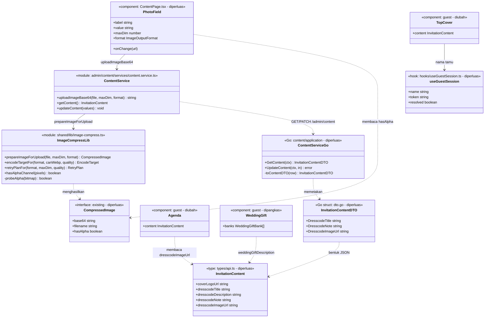
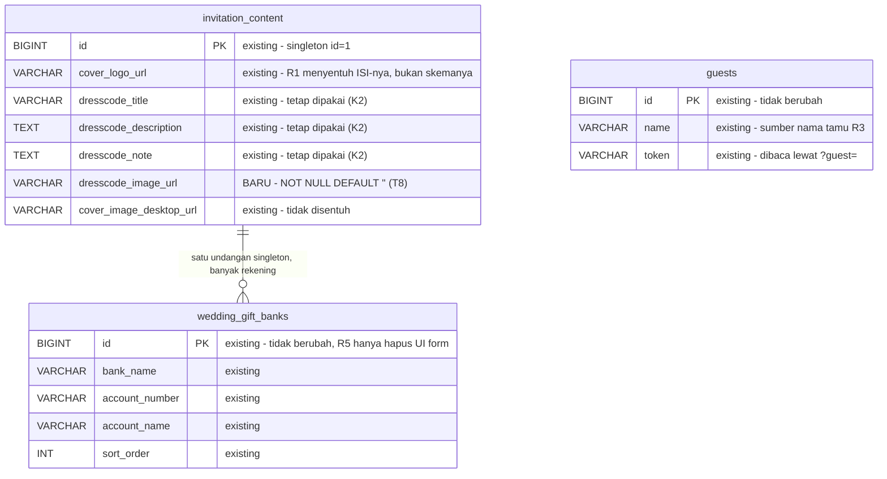
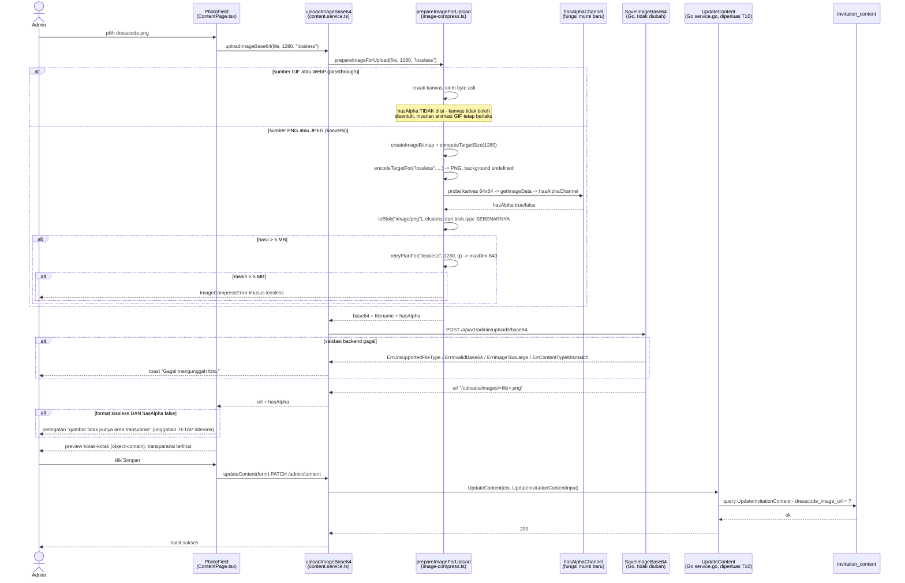
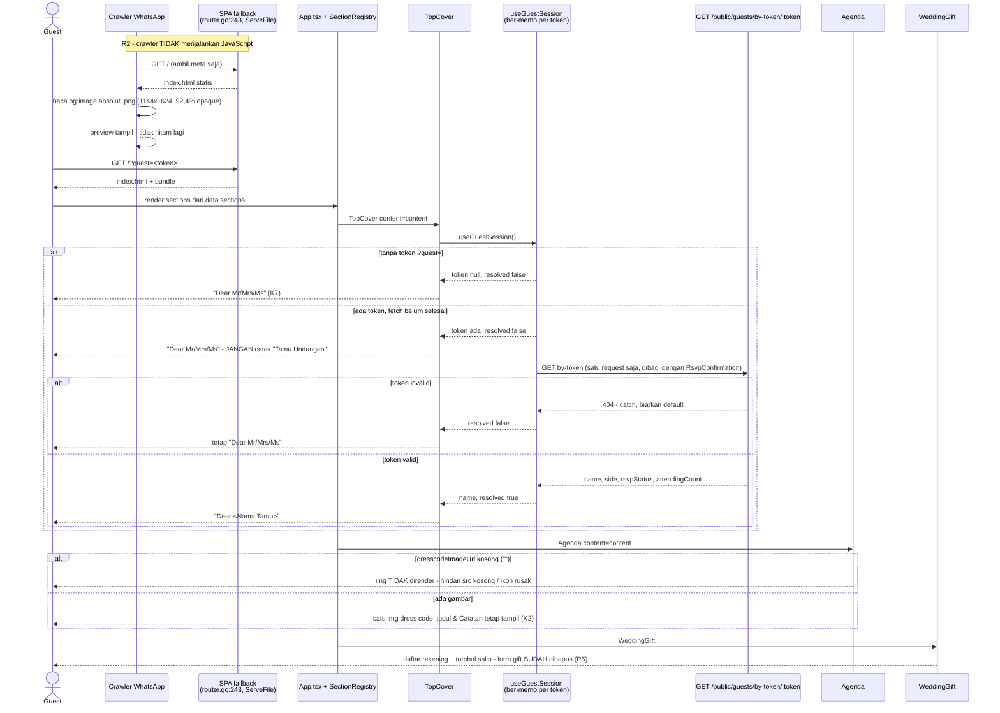

# PLAN — Revisi UAT: Logo Transparan, Preview WA, Nama Tamu, Gambar Dress Code, Hapus Form Gift

Analis: System Analyst (sesi 2026-09-04)
Target pembaca: programmer yang mengimplementasikan.

---

## 1. Pernyataan requirement (hasil Step 0, sudah dikonfirmasi user)

Lima temuan UAT dalam satu batch. Klasifikasi intent per temuan — bukan satu
label untuk semuanya, karena bentuk pekerjaannya memang berbeda:

| # | Temuan (kata user) | Intent | Ringkas akar masalah |
|---|---|---|---|
| R1 | "logo nama masih ada backgroundnya di undangan guest yang harusnya transparant karena upload nya png" | **Bug fix** (jalur kode bersih → butuh diagnosa data lebih dulu) | Tidak ada background di CSS maupun di jalur encode. Putihnya ada di BYTE berkas. §2.1 |
| R2 | "saat undangan sudah berbentuk link, foto jd hitam aja ketika link di share melalui WA" | **Bug fix** | `og:image` memakai URL **relatif** dan format **WebP** — crawler WA butuh URL absolut + JPEG/PNG. §2.2 |
| R3 | "nama tamu yg di undang gak muncul pada halaman guest" | **Bug fix** (wiring hilang) | `TopCover.tsx` menulis literal `Dear Mr/Mrs/Ms`; `useGuestSession` sudah jalan tapi hanya dipakai `RsvpConfirmation`. §2.3 |
| R4 | "belum ada inputan gambar untuk dress code, gambar color pallet" | **New capability** | Ikon dress & palet warna di-hardcode; tidak ada kolom DB maupun field admin. §2.4 |
| R5 | "hilangkan fill the form yg di bawah section rekening" | **Enhancement (penghapusan)** | Form gift adalah **kode mati**: `action="#"`, tanpa endpoint backend. §2.5 |

### 1.1 Keputusan terkunci (dijawab user di Step 0)

| # | Keputusan | Jawaban user |
|---|---|---|
| K1 | Bentuk inputan dress code | **Satu gambar yang diunggah admin** — "1 image saya yang di upload, jadi bentuknya tidak seperti saat ini". |
| K2 | Cakupan gambar dress code | **Ganti ikon + palet warna saja.** Judul, deskripsi, dan Catatan tetap dirender dari kolom yang sudah admin-managed. |
| K3 | Format gambar dress code | User menjawab *"Belum tahu, pilih yang paling aman"* → **keputusan analis: PNG `lossless`**, karena itu satu-satunya pilihan yang tidak bisa merusak transparansi. Dicatat di sini sebagai panggilan analis, bukan pilihan user. |
| K4 | Cakupan perbaikan preview WA | **Statis: URL absolut + PNG.** Tanpa injeksi meta di backend. |
| K5 | Base URL produksi | **Hardcode `https://elwedding.elcodelabs.com`** di `index.html`. |
| K6 | Aset preview WA | **Pakai `frame-cover.png` yang sudah ada** (bukan aset baru 1200x630). |
| K7 | Teks nama tamu tanpa token `?guest=` | **Tetap `Dear Mr/Mrs/Ms`** persis seperti sekarang. Dengan token → `Dear <Nama Tamu>`. |
| K8 | Waktu unggah logo (R1) | **"Sesudah perbaikan dideploy, tetap putih"** — jadi R1 tidak bisa ditutup dengan "unggah ulang saja"; butuh diagnosa yang memutuskan. |

### 1.2 Keputusan desain (Step 4)

| # | Keputusan | Alasan |
|---|---|---|
| D1 | R1 dikerjakan sebagai **diagnosa dulu, baru perbaikan** — bukan langsung menambal kode | Jalur kode terbukti bersih (§2.1): `fillRect` hanya ada di SATU tempat dan tidak terjangkau oleh `lossless`. Menambal kode yang sudah benar hanya menambah risiko tanpa menyentuh penyebabnya. Kriteria yang memutuskan: **jangan menebak**; instrumentasi lebih murah daripada perbaikan yang salah sasaran. |
| D2 | Tambah **deteksi alpha + peringatan admin + preview kotak-kotak** pada field `lossless` | Ini yang membuat R1 tidak bisa terulang senyap. UI sekarang memberi NOL umpan balik apakah transparansi selamat, dan preview-nya justru memakai `bg-slate-100` + `object-cover` ([ContentPage.tsx:80](../../../apps/web/src/modules/admin/content/pages/ContentPage.tsx#L80)) sehingga transparansi tidak mungkin terlihat. Dibayar oleh K8: user sudah kena bug ini dua kali. |
| D3 | Preview WA diperbaiki **tanpa** injeksi meta di backend | Konsekuensi langsung K4. Crawler WhatsApp **tidak menjalankan JavaScript**, jadi opsi "tulis ulang og:image lewat script dari `location.origin`" mati sejak awal — bukan pilihan yang saya lewatkan, tapi pilihan yang tidak valid. Karena itu nilainya harus sudah absolut di HTML statis. |
| D4 | Origin di-hardcode, **bukan** lewat `%VITE_PUBLIC_ORIGIN%` | Konsekuensi K5. Vite terpasang memang mendukung substitusi env di HTML (`htmlEnvHook` ada di `node_modules/vite`), tapi kalau env lupa diisi saat build, nilainya tertinggal sebagai teks mentah dan preview rusak lagi **tanpa peringatan**. Kriteria yang memutuskan: **reversibility + kegagalan yang kelihatan**. Trace juga menunjukkan frontend belum punya mekanisme env untuk origin ([vite.config.ts:20](../../../apps/web/vite.config.ts#L20) hanya `VITE_DEV_API_TARGET` untuk proxy dev). |
| D5 | R3 diselesaikan dengan **TopCover memanggil `useGuestSession()` langsung**, bukan mengalirkan prop lewat `SectionRegistry` | Mengikuti konvensi yang SUDAH ada: `RsvpConfirmation` memanggil hook itu langsung ([RsvpConfirmation.tsx:27](../../../apps/web/src/components/RsvpConfirmation/RsvpConfirmation.tsx#L27)). Mengalirkan prop menuntut perubahan `SectionRegistry` + `App.tsx` untuk satu nilai — blast radius lebih besar tanpa manfaat. |
| D6 | Tambah **memoisasi promise per token** di `useGuestSession` | Dibayar oleh D5: menambah konsumen kedua berarti 2 request GET identik ke `/by-token/:token` per pemuatan halaman. Memo ~5 baris menghapus duplikasi itu permanen. Ini bukan generalisasi spekulatif — duplikasinya nyata dan diperkenalkan oleh perubahan ini sendiri. |
| D7 | `maxDim` gambar dress code = **1280**, format `lossless` | Slot `.dress-inner-wrap` maksimum **550 CSS px** (`assets/css/4e66ef9e.css`), jadi DPR 2 butuh 1100 px (tertutup penuh) dan DPR 3 butuh 1650 px (tertutup 78% — tidak terlihat untuk grafis berwarna rata). Menaikkan ke 1600 akan menutup DPR 3, tapi PNG lossless 1600 px untuk gambar bergaya foto bisa menembus batas 5 MB. 1280 adalah titik tengah yang bisa dipertahankan. |
| D8 | R5 dihapus **secara bedah**, bukan buang blok | Daftar rekening berada DI DALAM `<form id="weddingGiftForm">` yang sama ([WeddingGift.tsx:74](../../../apps/web/src/components/WeddingGift/WeddingGift.tsx#L74) sampai [:189](../../../apps/web/src/components/WeddingGift/WeddingGift.tsx#L189)). Membuang `<form>` mentah-mentah akan ikut menghapus daftar rekening — justru bagian yang user ingin pertahankan. |

### 1.3 Determinasi reuse / extend / create-new (hasil Step 3 & 5)

| Sisi | Determinasi | Bukti |
|---|---|---|
| Jalur encode `lossless` | **Reuse, tanpa perubahan** | [image-compress.ts:128-130](../../../apps/web/src/shared/lib/image-compress.ts#L128) sudah mengembalikan `background: undefined`. Terbukti bersih, tidak disentuh. |
| `PhotoField` | **Extend** | Sudah menerima `maxDim`/`format` ([ContentPage.tsx:49-63](../../../apps/web/src/modules/admin/content/pages/ContentPage.tsx#L49)); ditambah preview transparansi + peringatan alpha (D2). |
| `uploadImageBase64` | **Reuse, tanpa perubahan** | Sudah menerima `format` sebagai parameter ke-3 ([content.service.ts:42](../../../apps/web/src/modules/admin/content/services/content.service.ts#L42)). Field dress code tinggal memakainya. |
| `useGuestSession` | **Extend** | Hook sudah resolve nama dari token ([useGuestSession.ts:20](../../../apps/web/src/hooks/useGuestSession.ts#L20)); ditambah memo per token (D6). Tidak ada store/context tamu yang bisa dipakai ulang — `shared/stores/` hanya berisi `auth.store.ts`. |
| Tabel `invitation_content` | **Enhance** (1 kolom baru) | `dresscode_title/description/note` sudah ada ([000001:42-44](../../../apps/api/migrations/000001_create_content_tables.up.sql#L42)) tapi tidak ada kolom gambar. Celah nyata → `dresscode_image_url`. |
| Pola kolom baru | **Reuse pola `cover_logo_url`** | `cover_logo_url VARCHAR(500) NOT NULL DEFAULT ''` ([000001:17](../../../apps/api/migrations/000001_create_content_tables.up.sql#L17)) → di sqlc jadi `string` biasa ([models.go:326](../../../apps/api/internal/modules/content/infrastructure/sqlc/models.go#L326)), **bukan** `sql.NullString` seperti `DresscodeNote`. Jadi tidak perlu `nullStr`/`toNullStr`. |
| Migration `ALTER TABLE ADD COLUMN` | **Reuse pola 000006** | [000006_add_guest_profile_fields.up.sql](../../../apps/api/migrations/000006_add_guest_profile_fields.up.sql) sudah menunjukkan konvensinya: `ADD COLUMN ... AFTER <kolom>` di up, `DROP COLUMN` urutan terbalik di down. |
| `frame-cover.png` | **Reuse** | Sudah ada, 27 KB, 1144x1624. Saya decode isinya: **92,4% piksel opaque**, 7,5% transparan hanya di tepi frame — jadi tidak akan dikomposit jadi hitam oleh WA. |
| Form gift | **Hapus** | Kode mati: `<form action="#" method="POST">`, `name="post" value="sendGift"` sisa template PHP, dan **tidak ada endpoint gift submission** di router (hanya CRUD `gift-banks`, [router.go:86-89](../../../apps/api/internal/router/router.go#L86)). |

---

## 2. Hasil trace (Step 1–3, 5)

Stack terkonfirmasi: monorepo npm workspaces — `apps/web` (React + Vite 5 +
Vitest, alias `@/*`, `noUnusedLocals: true` di
[tsconfig.app.json:17](../../../apps/web/tsconfig.app.json#L17)) dan `apps/api`
(Go modular monolith, sqlc + golang-migrate + MySQL, storage S3).
`sqlc.yaml` memakai `schema: "migrations"` — artinya sqlc membaca berkas
migration langsung, jadi **migration harus ada sebelum `sqlc generate`**
(mengikat urutan task, lihat §4).

### 2.1 R1 — Logo masih berlatar putih

Tiga jalur yang bisa menghasilkan latar putih, ketiganya sudah saya periksa
dan **ketiganya bersih**:

1. **CSS.** Tidak ada `background` pada logo. Hanya ada dua aturan, keduanya
   sekadar ukuran: `section.cover .logo-wrap{margin:0 auto;max-width:150px;position:relative;width:23.07%}`
   dan `.footnote-wrap .logo-wrap{max-width:160px;min-height:160px}`
   (`assets/css/4e66ef9e.css`, berkas ter-minify satu baris — telusuri lewat
   selektor, bukan nomor baris). Tidak ada aturan untuk `.logo` itu sendiri.
2. **Jalur encode.** `fillStyle`/`fillRect` ada di **tepat satu tempat** di
   seluruh `apps/web/src`: [image-compress.ts:174-175](../../../apps/web/src/shared/lib/image-compress.ts#L174),
   di dalam `if (background)`. Dan `encodeTargetFor('lossless', ...)`
   mengembalikan `background: undefined` untuk `canWebp` true maupun false
   ([image-compress.ts:128-130](../../../apps/web/src/shared/lib/image-compress.ts#L128)),
   sudah dikunci oleh test regresi. Field Logo memang memakai jalur itu:
   `format="lossless"` di [ContentPage.tsx:469](../../../apps/web/src/modules/admin/content/pages/ContentPage.tsx#L469).
3. **JS legacy.** Tidak ada satu pun referensi `logo` di
   `apps/web/public/assets/js/*.js` — jadi jQuery tidak menimpa ``.
   (Berbeda dari `#cover-main` yang memang ditimpa, seperti tercatat di
   `knowledge/FRONTEND.md`.)

Dan hanya ada **satu** jalur unggah untuk logo: `PhotoField` →
`uploadImageBase64`. `uploadAudioFile` (multipart) dipakai eksklusif untuk
audio di `SettingsPage` ([content.service.ts:28](../../../apps/web/src/modules/admin/content/services/content.service.ts#L28)),
bukan untuk gambar.

**Kesimpulan trace:** putih itu ada di **byte berkas yang tersimpan**, bukan
diproduksi kode saat unggah maupun saat render. Karena K8 menyatakan unggahan
dilakukan SESUDAH perbaikan dideploy, tersisa tiga kandidat, dan hanya data
yang bisa memutuskan:

- **(A) Berkas sumber admin sendiri berlatar putih opaque.** Ini kandidat
  terkuat. PNG **tidak otomatis transparan** — banyak eksport logo menaruh
  matte putih solid (alpha=255 di seluruh piksel). Premis "karena upload nya
  png" karena itu tidak menjamin transparansi.
- **(B) Berkas lama masih disajikan** dari cache browser/CDN, atau `dist`
  yang terdeploy tertinggal versi lama.
- **(C) Lubang di pipeline yang belum ketemu** — kemungkinannya kecil setelah
  tiga pemeriksaan di atas, tapi tidak nol.

T1 (§4) memisahkan ketiganya secara definitif dengan mengukur alpha berkas
yang **benar-benar tersimpan**, memakai teknik yang sudah saya buktikan jalan
pada `frame-cover.png` di sesi ini. D2 lalu memastikan kasus (A) tidak bisa
terjadi lagi tanpa admin menyadarinya.

### 2.2 R2 — Foto jadi hitam saat di-share WhatsApp

Dua cacat sekaligus dalam satu tag, di [index.html:21](../../../apps/web/index.html#L21):

```html
<meta property="og:image" content="/media/template/arsya/frame-cover.webp"/>
```

1. **URL relatif.** Crawler WhatsApp/Facebook tidak menyelesaikan path
   relatif pada `og:image` — hasilnya tidak ada gambar yang bisa diambil.
2. **Format WebP.** Crawler preview WA tidak merender WebP.

`og:url` juga relatif (`content="/"`, [index.html:18](../../../apps/web/index.html#L18)),
dan `twitter:image` mengulang kesalahan yang sama ([index.html:29](../../../apps/web/index.html#L29)).

Backend tidak menyelamatkan ini: SPA fallback hanya `http.ServeFile` berkas
statis apa adanya ([router.go:243](../../../apps/api/internal/router/router.go#L243)) —
**tidak ada injeksi/templating meta sama sekali**.

Aset penggantinya sudah tersedia: `frame-cover.png`, 27 KB, 1144x1624. Saya
decode dan hitung kanal alphanya (colorType 6 = RGBA, tanpa chunk `tRNS`):
**92,4% piksel alpha=255 (opaque), 7,5% alpha=0, 0,1% semi-transparan**.
Transparansinya hanya di tepi frame, jadi subjeknya tetap terlihat penuh dan
**tidak akan dikomposit menjadi hitam**. Ini pemeriksaan yang wajib dilakukan:
kalau asetnya ternyata mayoritas transparan, "perbaikan" ini justru akan
mereproduksi bug yang sama.

Catatan jujur soal komposisi (bukan bug, konsekuensi K6): rasio 1144x1624
adalah **portrait**, sedangkan `summary_large_image` yang dipakai WA/Facebook
mengharapkan sekitar 1200x630 landscape. Preview akan **terpotong cukup
banyak** — terbaca dan tidak hitam, tapi tidak ideal secara komposisi.
Perbaikan visualnya adalah menyiapkan aset 1200x630 rata (tanpa alpha), dan
itu **tidak** masuk lingkup ini (§3.2).

### 2.3 R3 — Nama tamu tidak muncul

[TopCover.tsx:146-148](../../../apps/web/src/components/TopCover/TopCover.tsx#L146)
menulis teks mati, tanpa interpolasi apa pun:

```jsx
<p data-aos="fade-up" ...>
    Dear Mr/Mrs/Ms                        </p>
```

Padahal mesinnya sudah lengkap dan berfungsi: `useGuestSession`
([useGuestSession.ts:20](../../../apps/web/src/hooks/useGuestSession.ts#L20))
membaca token dari `?guest=`, memanggil
`GET /api/v1/public/guests/by-token/:token`, dan mengembalikan `name`; kalau
tanpa token atau token invalid, ia jatuh ke `DEFAULT_SESSION.name =
'Tamu Undangan'` tanpa melempar error.

Masalahnya murni **wiring**: satu-satunya konsumen hook itu adalah
[RsvpConfirmation.tsx:27](../../../apps/web/src/components/RsvpConfirmation/RsvpConfirmation.tsx#L27),
yang memakainya di [:146](../../../apps/web/src/components/RsvpConfirmation/RsvpConfirmation.tsx#L146)
("Halo {session.name}, ..."). Sementara `TopCover` hanya menerima prop
`content` — `SectionRegistry` merendernya sebagai
`<TopCover content={content} />` ([SectionRegistry.tsx:39](../../../apps/web/src/components/SectionRegistry/SectionRegistry.tsx#L39)),
dan `App.tsx` merender section dari daftar
([App.tsx:42-43](../../../apps/web/src/App.tsx#L42)).

Perhatikan bahwa K7 meminta fallback tetap `Dear Mr/Mrs/Ms`, sedangkan
`DEFAULT_SESSION.name` adalah `'Tamu Undangan'`. Jadi TopCover **tidak boleh**
langsung mencetak `session.name` — ia harus bercabang atas ada/tidaknya token,
kalau tidak link generik akan berubah jadi "Dear Tamu Undangan" (melanggar K7).
Ini jebakan implementasi paling mudah terlewat di R3.

### 2.4 R4 — Dress code belum ada inputan gambar

Yang sudah admin-managed: `dresscodeTitle`, `dresscodeDescription`,
`dresscodeNote` — dirender di
[Agenda.tsx:316-317](../../../apps/web/src/components/Agenda/Agenda.tsx#L316)
dan [:367](../../../apps/web/src/components/Agenda/Agenda.tsx#L367), dan
sudah punya field di admin
([ContentPage.tsx:552-554](../../../apps/web/src/modules/admin/content/pages/ContentPage.tsx#L552)).

Yang **hardcode** dan menjadi sasaran K1/K2 — seluruh isi `.dress-list`:

- Dua ikon: `/assets/icons/ic-dress-man-formal.png` dan
  `ic-dress-woman-formal.png` ([Agenda.tsx:325](../../../apps/web/src/components/Agenda/Agenda.tsx#L325), [:347](../../../apps/web/src/components/Agenda/Agenda.tsx#L347))
- Enam kotak warna, hex mati `#BAAF5F` / `#CC7C73` / `#8195AE` lewat CSS var
  `--bg-color` ([Agenda.tsx:332-338](../../../apps/web/src/components/Agenda/Agenda.tsx#L332) untuk Men, [:354-360](../../../apps/web/src/components/Agenda/Agenda.tsx#L354) untuk Women) —
  palet Men dan Women **identik**, jadi tidak ada informasi yang hilang saat
  keduanya diganti satu gambar.

Hanya ada **satu** blok `dress-wrapper` di berkas itu (baris 312), jadi tidak
ada markup kembar yang harus diubah dua kali.

**Jebakan kompilasi yang WAJIB diperhatikan:** `import type { CSSProperties }`
di [Agenda.tsx:1](../../../apps/web/src/components/Agenda/Agenda.tsx#L1)
dipakai **hanya** oleh keenam baris `dress-color-item` itu. Begitu
`.dress-list` dihapus, import itu jadi tidak terpakai — dan
`noUnusedLocals: true` akan **menggagalkan build**. Import-nya harus ikut
dihapus di task yang sama.

Sisi data — rantai lengkap yang harus diikuti untuk satu kolom baru:

`migrations/000011_*` → `queries/invitation_content.sql` (UPDATE; SELECT `*`
otomatis ikut) → `sqlc generate` (regenerasi `models.go` +
`invitation_content.sql.go`) → `service.go`: map baca di dalam `toContentDTO`
([:92](../../../apps/api/internal/modules/content/application/service.go#L92),
fungsi yang dipakai `GetContent`) dan map tulis di dalam `UpdateContent`
([:167](../../../apps/api/internal/modules/content/application/service.go#L167))
→ `dto.go`: DUA struct — `InvitationContentDTO` untuk baca
([:50](../../../apps/api/internal/modules/content/application/dto.go#L50), tempat
`DresscodeTitle`/`DresscodeDescription`/`DresscodeNote` berada) dan
`UpdateInvitationContentInput` untuk tulis
([:102](../../../apps/api/internal/modules/content/application/dto.go#L102))
→ `types/api.ts` ([:49](../../../apps/web/src/types/api.ts#L49)) →
`ContentPage.tsx` → `Agenda.tsx`.

Migration berikutnya adalah **000011** (terakhir yang ada: `000010_cover_to_video`).

### 2.5 R5 — Form gift di bawah section rekening

Blok yang dimaksud user dimulai di
[WeddingGift.tsx:108](../../../apps/web/src/components/WeddingGift/WeddingGift.tsx#L108)
(`bank-sender-wrap`) dengan label "Fill the form below, please" di
[:112](../../../apps/web/src/components/WeddingGift/WeddingGift.tsx#L112).

Isinya: input `name`, `account_name`, `message`, `amount`; input file
tersembunyi `weddingGiftPicture`; hidden `template=chitra` dan
`post=sendGift`; tombol `Next`; lalu slide kedua `wedding-gift-picture`
berisi `select_bank`, area "Upload proof of transfer", dan tombol submit
`Confirm`.

**Seluruhnya kode mati**, dan ini terverifikasi bukan diasumsikan:

- `<form action="#" method="POST" id="weddingGiftForm">`
  ([:74](../../../apps/web/src/components/WeddingGift/WeddingGift.tsx#L74)) —
  `action="#"` tidak mengirim ke mana pun.
- Tidak ada endpoint gift submission di backend. Router hanya punya CRUD
  `gift-banks` ([router.go:86-89](../../../apps/api/internal/router/router.go#L86));
  tidak ada handler `sendGift` di seluruh `apps/api`.
- JS legacy hanya menganimasikan transisi slide (`fddf2641.js` mengatur
  `margin-left` `.wedding-gift__first-slide`) — tidak ada pengirim data.

Jadi form ini mengumpulkan data yang tidak pernah dikirim ke mana-mana.
Menghapusnya menghilangkan UI yang menyesatkan tamu, bukan fitur.

**Kendala bentuk (D8):** daftar rekening di
[:95-106](../../../apps/web/src/components/WeddingGift/WeddingGift.tsx#L95)
berada DI DALAM `<form>` yang sama (dibuka [:74](../../../apps/web/src/components/WeddingGift/WeddingGift.tsx#L74),
ditutup [:189](../../../apps/web/src/components/WeddingGift/WeddingGift.tsx#L189)).
Karena itu penghapusannya bedah: buang `bank-sender-wrap` dan slide
`wedding-gift-picture`, sisakan `<form>`-nya (atau turunkan jadi `<div>`)
supaya daftar rekening dan tombol salin nomor rekening tetap utuh.

---

## 3. Lingkup

### 3.1 Masuk lingkup

| Berkas | Perubahan | Temuan |
|---|---|---|
| *(diagnosa, tanpa ubah kode)* | Ukur alpha berkas `cover_logo_url` yang tersimpan | R1 |
| [apps/web/src/shared/lib/image-compress.ts](../../../apps/web/src/shared/lib/image-compress.ts) | Fungsi murni baru `hasAlphaChannel` (probe kanvas kecil) | R1/D2 |
| [apps/web/src/shared/lib/image-compress.test.ts](../../../apps/web/src/shared/lib/image-compress.test.ts) | Test untuk `hasAlphaChannel` | R1/D2 |
| [apps/web/index.html](../../../apps/web/index.html) | `og:image`/`og:url`/`twitter:*` jadi absolut + PNG, tambah `og:image:type`/`width`/`height` | R2 |
| [apps/web/src/hooks/useGuestSession.ts](../../../apps/web/src/hooks/useGuestSession.ts) | Memo promise per token; ekspos pembeda "ada token atau tidak" | R3/D6 |
| [apps/web/src/components/TopCover/TopCover.tsx](../../../apps/web/src/components/TopCover/TopCover.tsx) | Render `Dear <nama>`; fallback `Dear Mr/Mrs/Ms` | R3 |
| `apps/web/src/components/TopCover/TopCover.test.tsx` | **Berkas baru** — kunci kedua cabang teks | R3 |
| `apps/api/migrations/000011_add_dresscode_image.{up,down}.sql` | **Berkas baru** — `ADD COLUMN dresscode_image_url` | R4 |
| [apps/api/internal/modules/content/infrastructure/queries/invitation_content.sql](../../../apps/api/internal/modules/content/infrastructure/queries/invitation_content.sql) | Tambah kolom di UPDATE | R4 |
| `apps/api/internal/modules/content/infrastructure/sqlc/*` | **Hasil `sqlc generate`**, jangan disunting tangan | R4 |
| [apps/api/internal/modules/content/application/dto.go](../../../apps/api/internal/modules/content/application/dto.go) | Field `DresscodeImageUrl` di DUA DTO | R4 |
| [apps/api/internal/modules/content/application/service.go](../../../apps/api/internal/modules/content/application/service.go) | Map baca + map tulis | R4 |
| [apps/web/src/types/api.ts](../../../apps/web/src/types/api.ts) | `dresscodeImageUrl` di `InvitationContent` | R4 |
| [apps/web/src/modules/admin/content/pages/ContentPage.tsx](../../../apps/web/src/modules/admin/content/pages/ContentPage.tsx) | `PhotoField` dress code; preview transparansi + peringatan alpha | R4/D2 |
| [apps/web/src/components/Agenda/Agenda.tsx](../../../apps/web/src/components/Agenda/Agenda.tsx) | Ganti `.dress-list` jadi satu ``; **hapus import `CSSProperties`** | R4 |
| [apps/web/src/components/WeddingGift/WeddingGift.tsx](../../../apps/web/src/components/WeddingGift/WeddingGift.tsx) | Hapus `bank-sender-wrap` + slide `wedding-gift-picture` | R5 |
| [knowledge/FRONTEND.md](../../../knowledge/FRONTEND.md) | Catat pola OG absolut, nama tamu di TopCover, gambar dress code | semua |

### 3.2 Di luar lingkup (keputusan, bukan kelalaian)

- **Injeksi meta OG dinamis di backend** — ditolak user di K4. Konsekuensi
  yang diterima sadar: preview WA sama untuk semua link, termasuk link
  per-tamu.
- **Aset preview 1200x630 khusus** — ditolak di K6. Konsekuensinya (preview
  portrait terpotong) sudah dicatat terbuka di §2.2. Menggantinya nanti tidak
  butuh perubahan kode lagi, cukup tukar berkas + tiga nilai meta.
- **Mengubah `dresscode_title/description/note`** — K2 secara eksplisit
  mempertahankannya.
- **Palet warna sebagai data (hex per warna)** — ditolak K1; digantikan satu
  gambar. Kolom `--bg-color` dan CSS `.dress-color-item` akan menjadi tidak
  terpakai, tapi **CSS-nya tidak dihapus** karena `4e66ef9e.css` adalah aset
  template ter-minify bersama; menyuntingnya berisiko jauh lebih besar
  daripada manfaat beberapa baris mati.
- **Auto-deteksi alpha untuk MEMILIH format** — tetap ditolak seperti di
  `admin-content-png-lossless-galeri-tajam/PLAN.md`. D2 memakai deteksi alpha
  hanya untuk **memperingatkan**, bukan untuk memindah format secara diam-diam.
- **Endpoint gift submission** — tidak pernah ada dan tidak diminta. R5
  menghapus UI-nya, bukan membangun backend-nya.
- **Permukaan tipe & error yang dipakai apa adanya (tidak diubah):** tipe
  `ImageOutputFormat`, `EncodeTarget`, `RetryPlan`, dan kelas
  `ImageCompressError` di `image-compress.ts` dipakai persis seperti sekarang —
  T2/T3 hanya menambah fungsi baru di sebelahnya. Begitu juga tipe
  `WeddingGiftBank` ([types/api.ts:93](../../../apps/web/src/types/api.ts#L93),
  prop `banks` di `WeddingGift`) dan keempat error backend
  `ErrUnsupportedFileType`, `ErrInvalidBase64`, `ErrImageTooLarge`,
  `ErrContentTypeMismatch` — semuanya sudah menangani byte PNG dengan benar,
  digambar di §5.3 supaya programmer tidak menyangka ada cabang baru yang
  perlu dibuat.
- **`imageSmoothingQuality`**, dan seluruh pipeline galeri — tidak tersentuh
  revisi ini.

---

## 4. Task list (dikerjakan berurutan)

- [x] **T1 — R1: diagnosa dulu, JANGAN ubah kode** (realisasi D1).
  Ambil nilai `cover_logo_url` yang sekarang tersimpan (lewat
  `GET /api/v1/admin/content`, atau langsung dari DB), unduh berkasnya, lalu
  **ukur kanal alpha-nya** — jangan menilai dari pandangan mata. Baca `IHDR`
  untuk `colorType` (6 = RGBA, 3 = palette+`tRNS`, 2 = RGB tanpa alpha), lalu
  dekompres `IDAT` dan hitung distribusi alpha. Teknik ini sudah terbukti
  jalan di sesi analisis pada `frame-cover.png`.
  Putuskan berdasarkan hasil:
  - **`colorType` 2, atau RGBA dengan ~100% alpha=255** → kasus (A): berkas
    sumber admin memang berlatar putih opaque. **Tidak ada bug kode.**
    Selesaikan dengan mengunggah ulang berkas yang benar-benar transparan,
    lalu lanjut ke T2 supaya ini tidak terulang senyap.
  - **Ada porsi alpha=0 yang berarti** → berkas sudah benar; masalahnya
    penyajian: kasus (B). Periksa cache browser (hard reload), header
    `Cache-Control` route `/uploads/{category}/{filename}`
    ([router.go:131](../../../apps/api/internal/router/router.go#L131)), dan
    apakah `dist` yang terdeploy memang hasil build terbaru.
  - **Nama berkas bukan `.png`** (mis. `.webp`/`.gif`) → berkas menempuh
    jalur passthrough, bukan konversi. Berarti sumbernya bukan PNG sejak awal;
    kasus (A) varian. Unggah ulang sebagai PNG.
  Tulis hasil pengukurannya (angka, bukan kesimpulan saja) ke PLAN ini atau
  ke catatan rilis — ini satu-satunya cara R1 bisa ditutup tanpa menebak.

  ### HASIL T1 (diukur 2026-09-04, dari produksi) — VERDICT: kasus (A) varian, TIDAK ADA BUG KODE

  Diambil lewat `GET https://elwedding.elcodelabs.com/api/v1/public/invitation`:

  | Yang diukur | Nilai nyata |
  |---|---|
  | `coverLogoUrl` tersimpan | `/uploads/images/1788507627798853868-03ec92588fd2d1c1.jpg` |
  | Magic bytes berkas | `FF D8 FF E0 00 10 4A 46 49 46` → **JPEG/JFIF sejati** |
  | `Content-Type` respons | `image/jpeg` |
  | Ukuran berkas | 115.450 byte |
  | Dimensi | **1536 x 1024** |
  | Kanal alpha | **TIDAK ADA** — JPEG secara format tidak punya kanal alpha |

  Pembuktian bahwa perbaikan lossless **memang sudah ter-deploy** (jadi
  kasus (B)/(C) tertutup, bukan diasumsikan tertutup):

  | Yang diukur | Nilai nyata |
  |---|---|
  | Bundle admin produksi | `/assets/admin-Dtr-jj1V.js`, 195.682 byte |
  | SHA-256 produksi | `0f3c7891fa3352291677cdbbdec1e9e8...` |
  | SHA-256 build lokal (HEAD) | `0f3c7891fa3352291677cdbbdec1e9e8...` — **IDENTIK** |
  | Jejak `lossless` + `image/png` di bundle produksi | ada |

  **Kesimpulan yang mengikuti dari angka-angka itu:** berkas logo yang
  tersimpan adalah **artefak PRA-perbaikan**, bukan hasil pipeline yang
  sekarang. Buktinya berlapis:
  1. Jalur `lossless` **tidak mungkin** menghasilkan JPEG — `encodeTargetFor('lossless', ...)`
     mengembalikan `image/png` tanpa syarat, dan ekstensinya diambil dari
     `blob.type` yang sebenarnya. JPEG hanya keluar dari cabang
     `lossy` + `canWebp === false`, yang **sekaligus** mengecat `#ffffff`
     ([image-compress.ts:174-175](../../../apps/web/src/shared/lib/image-compress.ts#L174)).
  2. Dimensi 1536 px melebihi `maxDim={640}` milik field Logo sekarang, dan
     bahkan melebihi batas retry `lossy` (1280). Angka itu hanya konsisten
     dengan default LAMA `maxDim = 1920` (1536 <= 1920 → tidak diperkecil).
  3. Bundle produksi byte-identik dengan build HEAD, jadi kodenya sudah benar
     di server — yang tertinggal adalah DATA-nya.

  **Tindakan:** cukup **unggah ulang** logo sebagai PNG bertransparansi lewat
  `/admin/content`. Tidak ada kode R1 yang perlu diubah. Cache bukan
  penghalang: `Cache-Control: public, max-age=31536000, immutable` memang
  dipasang untuk `/uploads/*` ([router.go:162](../../../apps/api/internal/router/router.go#L162)),
  tapi nama berkas unggahan selalu unik (timestamp + 8 byte acak di
  `SaveUpload`), jadi unggahan baru mendapat URL baru dan tidak pernah
  tertabrak cache lama.

  **Catatan penting untuk user:** berkas sumber yang diunggah kemarin
  kemungkinan besar juga bukan PNG transparan (JPEG 1536x1024 berukuran
  115 KB berbentuk foto/raster, bukan logo bertepi tajam). T2/T3 dibuat
  tepat untuk ini: mulai sekarang admin akan **diperingatkan** kalau gambar
  yang diunggah ke field `lossless` tidak punya area transparan, alih-alih
  mengetahuinya baru setelah melihat undangan.

- [x] **T2 — R1/D2: `hasAlphaChannel` sebagai fungsi murni + test.**
  Di `image-compress.ts`, tambah fungsi **diekspor** yang menerima
  `ImageData`-like (`Uint8ClampedArray` + panjang) dan mengembalikan `true`
  bila ADA piksel dengan alpha < 250:
  ```ts
  export function hasAlphaChannel(pixels: Uint8ClampedArray): boolean
  ```
  Murni dan bebas DOM, jadi **bisa dites di jsdom** — ini alasan yang sama
  dengan `encodeTargetFor` di plan sebelumnya (jsdom tidak
  mengimplementasikan `canvas.toBlob`/`createImageBitmap`, lihat
  [image-compress.test.ts:12-15](../../../apps/web/src/shared/lib/image-compress.test.ts#L12)).
  Ambang 250 (bukan 255) dipakai supaya piksel semi-transparan hasil
  penskalaan tetap terdeteksi.
  Test: array semua alpha=255 → `false`; ada satu alpha=0 → `true`; ada satu
  alpha=200 → `true`; array kosong → `false`.

- [x] **T3 — R1/D2: probe alpha + peringatan admin + preview transparansi.**
  - Di `image-compress.ts`, tambah helper **bernama `probeAlpha`** (tidak
    diekspor — nama ini dipakai di class diagram §5.1) yang menggambar
    bitmap ke kanvas probe kecil (mis. 64x64) lalu memanggil
    `getImageData(...).data` dan meneruskannya ke `hasAlphaChannel`. Probe
    kecil sengaja dipakai supaya biayanya tetap ~4 ribu piksel, bukan sejuta
    (§6). Penskalaan ber-smoothing membuat area transparan tetap muncul
    sebagai alpha < 255, jadi probe kecil tetap valid.
  - **Panggil `probeAlpha` SEKALI saja**, di `prepareImageForUpload` pada jalur
    konversi — **bukan** di dalam `encodeAttempt`. `encodeAttempt` bisa
    dijalankan **dua kali** kalau hasil pertama melewati 5 MB (jalur
    `retryPlanFor`), jadi menaruh probe di sana berarti memindai dua kali dan
    berpotensi menghasilkan dua jawaban berbeda. Alpha adalah properti berkas
    SUMBER, bukan properti percobaan encode.
  - Kembalikan informasinya lewat `CompressedImage` sebagai field opsional
    `hasAlpha?: boolean`. Isi field ini HANYA di jalur konversi; jalur
    passthrough GIF/WebP tetap tidak boleh menyentuh kanvas (invarian D5 plan
    sebelumnya, tercatat di [knowledge/FRONTEND.md](../../../knowledge/FRONTEND.md)),
    jadi di jalur itu `hasAlpha` tetap `undefined`.
  - **`uploadImageBase64` WAJIB tetap mengembalikan `Promise<string>`.**
    Jangan mengubahnya menjadi objek: fungsi itu dipasang langsung sebagai
    `onUploadPhoto={uploadImageBase64}` di **lima** tempat
    ([ContentPage.tsx:577](../../../apps/web/src/modules/admin/content/pages/ContentPage.tsx#L577),
    [596](../../../apps/web/src/modules/admin/content/pages/ContentPage.tsx#L596),
    [620](../../../apps/web/src/modules/admin/content/pages/ContentPage.tsx#L620),
    [639](../../../apps/web/src/modules/admin/content/pages/ContentPage.tsx#L639),
    [658](../../../apps/web/src/modules/admin/content/pages/ContentPage.tsx#L658))
    dan tipe tujuannya adalah `onUploadPhoto: (file: File, maxDim?: number) => Promise<string>`
    ([SimpleListEditor.tsx:29](../../../apps/web/src/modules/admin/content/components/SimpleListEditor.tsx#L29)).
    Mengubah bentuk kembaliannya **menggagalkan typecheck di kelima tempat itu**.
    Sampaikan alpha lewat **parameter callback opsional keempat**:
    ```ts
    export async function uploadImageBase64(
      file: File,
      maxDim = 1920,
      format: ImageOutputFormat = 'lossy',
      onAlphaInfo?: (hasAlpha: boolean | undefined) => void,
    ): Promise<string>
    ```
    Parameter opsional tambahan tidak melanggar assignability TypeScript
    (alasan yang sama dengan `format` di plan sebelumnya), jadi kelima call
    site itu **tidak perlu disentuh sama sekali**.
  - Di `PhotoField`: kalau `format === 'lossless'` dan `hasAlpha === false`,
    tampilkan `toast.error`/`toast.warning` berbahasa Indonesia yang
    menjelaskan bahwa gambar yang diunggah **tidak punya area transparan**,
    jadi latarnya akan ikut terlihat — dan minta admin mengekspor ulang PNG
    dengan latar transparan. Unggahannya **tetap diterima** (jangan menolak;
    admin mungkin memang mau logo berlatar).
  - Ganti `bg-slate-100` pada preview ([ContentPage.tsx:80](../../../apps/web/src/modules/admin/content/pages/ContentPage.tsx#L80))
    menjadi latar **kotak-kotak (checkerboard)** untuk field `lossless`, dan
    ganti `object-cover` → `object-contain` supaya logo tidak terpotong. Tanpa
    ini admin secara harfiah tidak bisa melihat apakah transparansinya selamat.

- [x] **T4 — R2: perbaiki meta OG/Twitter di `index.html`.**
  Ganti nilai relatif menjadi absolut dengan origin `https://elwedding.elcodelabs.com`
  (K5) dan aset PNG (K6):
  - [:18](../../../apps/web/index.html#L18) `og:url` → `https://elwedding.elcodelabs.com/`
  - [:21](../../../apps/web/index.html#L21) `og:image` → `https://elwedding.elcodelabs.com/media/template/arsya/frame-cover.png`
  - [:26](../../../apps/web/index.html#L26) `twitter:url` dan
    [:29](../../../apps/web/index.html#L29) `twitter:image` → nilai absolut yang sama
  - Tambah `og:image:type` = `image/png`, `og:image:width` = `1144`,
    `og:image:height` = `1624` (nilai nyata hasil pembacaan IHDR, bukan
    perkiraan) — crawler memakainya untuk menyiapkan tata letak sebelum
    mengunduh gambar.
  - Tambah komentar HTML singkat yang menyebut: URL WAJIB absolut dan format
    WAJIB PNG/JPEG karena crawler WA tidak menyelesaikan path relatif dan
    tidak merender WebP. Tanpa catatan ini, orang berikutnya akan
    "mengoptimalkan" `.png` kembali ke `.webp` dan bug-nya kembali.
  **Jangan** memakai `%VITE_PUBLIC_ORIGIN%` (D4), dan **jangan** mencoba
  menulis ulang meta lewat JavaScript — crawler WA tidak menjalankan JS (D3).
  **Sudah diverifikasi bahwa jalurnya benar-benar tersedia**, bukan diasumsikan:
  `frame-cover.png` ikut tersalin ke `apps/web/dist/media/template/arsya/frame-cover.png`
  (27.238 byte, identik dengan sumbernya) karena berada di bawah `public/`, dan
  nilai `og:image` memang mengalir apa adanya dari `apps/web/index.html` ke
  `dist/index.html` saat build. Jadi menyunting `index.html` sumber adalah
  tempat yang benar, dan URL absolutnya akan resolve — bukan 404 yang justru
  membuat preview kosong lagi.

- [x] **T5 — R3/D6: memoisasi `useGuestSession` + bedakan "tanpa token".**
  - Tambah cache promise level modul, ber-key token, supaya dua konsumen
    (`RsvpConfirmation` dan `TopCover` yang baru) hanya memicu **satu**
    request `GET /by-token/:token`. Simpan promise-nya, bukan hasilnya, supaya
    dua pemanggil yang mount bersamaan tetap berbagi satu request.
    Bila promise-nya **reject**, hapus entri cache-nya di `.catch` supaya mount
    berikutnya masih bisa mencoba lagi — kalau entri gagal dibiarkan
    tersimpan, satu gangguan jaringan sesaat akan mengunci nama tamu jadi
    fallback sampai halaman di-reload.
  - `TopCover` butuh membedakan "nama tamu sungguhan" dari "fallback", karena
    K7 mempertahankan `Dear Mr/Mrs/Ms` sedangkan `DEFAULT_SESSION.name` adalah
    `'Tamu Undangan'` ([useGuestSession.ts:5-11](../../../apps/web/src/hooks/useGuestSession.ts#L5)).
    Tambahkan penanda `resolved: boolean` yang bernilai `true` HANYA setelah
    fetch sukses — ini mencegah TopCover mencetak "Tamu Undangan" pada render
    pertama saat token ADA tapi fetch-nya belum selesai.
  - **Taruh `resolved` di tipe BARU milik hook, jangan di `GuestSession`.**
    `GuestSession` ([types/api.ts:113-122](../../../apps/web/src/types/api.ts#L113))
    adalah cermin kontrak API `GuestSessionDTO`
    ([dto.go:54](../../../apps/api/internal/modules/guest/application/dto.go#L54)) —
    menambahkan state klien ke situ mengaburkan batas kontrak. Deklarasikan di
    hook-nya, dan karena aditif `RsvpConfirmation` tidak perlu disentuh:
    ```ts
    export interface GuestSessionState extends GuestSession {
      resolved: boolean
    }
    export function useGuestSession(): GuestSessionState
    ```
  - **Jangan** mengubah perilaku `RsvpConfirmation` — teks "Halo
    {session.name}" di sana memang benar memakai fallback generik.
  - Pertahankan penanganan token invalid apa adanya: `.catch()` yang membiarkan
    default ([useGuestSession.ts:37](../../../apps/web/src/hooks/useGuestSession.ts#L37)).

- [x] **T6 — R3: `TopCover` menampilkan nama tamu.**
  - Panggil `useGuestSession()` langsung di `TopCover` (D5) — jangan menambah
    prop di `SectionRegistry`/`App.tsx`.
  - Ganti literal di [TopCover.tsx:146-148](../../../apps/web/src/components/TopCover/TopCover.tsx#L146):
    ada nama tamu sungguhan → `Dear {nama}`; tidak ada → `Dear Mr/Mrs/Ms`
    persis seperti sekarang (K7).
  - Pertahankan seluruh atribut `data-aos` pada `<p>` itu — animasi masuk
    section ini digerakkan AOS, dan menghapusnya membuat teksnya tidak pernah
    muncul.

- [x] **T7 — R3: `TopCover.test.tsx` (berkas baru).**
  Ikuti konvensi `VideoGallery.test.tsx`/`PhotoGallery.test.tsx` (`render`
  dari `@testing-library/react`, `describe`/`it`, `container.querySelector`).
  Mock `useGuestSession` (bukan HTTP-nya) supaya test tetap murni:
  1. Tanpa token → teks memuat `Dear Mr/Mrs/Ms` (mengunci K7).
  2. Dengan nama tamu → teks memuat `Dear Budi Santoso` dan **tidak** memuat
     `Mr/Mrs/Ms`.
  3. Token ada tapi belum resolve → tetap `Dear Mr/Mrs/Ms`, **tidak** pernah
     menampilkan `Tamu Undangan` (mengunci jebakan §2.3).

- [x] **T8 — R4: migration 000011.**
  Buat `000011_add_dresscode_image.up.sql`:
  ```sql
  ALTER TABLE invitation_content
    ADD COLUMN dresscode_image_url VARCHAR(500) NOT NULL DEFAULT '' AFTER dresscode_note;
  ```
  dan `.down.sql` dengan `DROP COLUMN dresscode_image_url;`.
  `NOT NULL DEFAULT ''` mengikuti pola `cover_logo_url` (§1.3) sehingga sqlc
  menghasilkan `string` biasa — **bukan** `sql.NullString` seperti
  `DresscodeNote`, jadi tidak perlu `nullStr`/`toNullStr`. Baris singleton
  `id=1` yang sudah ada otomatis dapat `''` (artinya "belum ada gambar"), jadi
  migration ini aman dijalankan pada data produksi tanpa backfill.

- [x] **T9 — R4: query + `sqlc generate`.**
  Tambah `dresscode_image_url = ?` pada `UpdateInvitationContent` di
  [invitation_content.sql](../../../apps/api/internal/modules/content/infrastructure/queries/invitation_content.sql)
  (`GetInvitationContent` memakai `SELECT *`, jadi ikut otomatis). Lalu
  jalankan `npm run sqlc:generate`.
  **Urutan ini wajib**: `sqlc.yaml` memakai `schema: "migrations"`, jadi T8
  harus sudah ada di disk atau generate akan gagal / menghasilkan struct tanpa
  kolom baru. Jangan menyunting berkas di `infrastructure/sqlc/` dengan tangan.

- [x] **T10 — R4: DTO + service Go.**
  - `dto.go`: tambah `DresscodeImageUrl string \`json:"dresscodeImageUrl"\`` di
    **kedua** DTO — DTO baca ([:50](../../../apps/api/internal/modules/content/application/dto.go#L50) area)
    dan DTO tulis ([:102](../../../apps/api/internal/modules/content/application/dto.go#L102) area).
    Melewatkan salah satunya membuat field-nya hilang senyap di satu arah.
  - `service.go`: map baca ada di dalam **`toContentDTO`**
    ([service.go:47-96](../../../apps/api/internal/modules/content/application/service.go#L47)) —
    tambahkan `DresscodeImageUrl: row.DresscodeImageUrl` setelah baris
    [:94](../../../apps/api/internal/modules/content/application/service.go#L94)
    (**langsung, tanpa `nullStr`** — kolomnya NOT NULL, beda dari
    `DresscodeNote` di sebelahnya). Map tulis ada di dalam **`UpdateContent`**
    ([service.go:123-171](../../../apps/api/internal/modules/content/application/service.go#L123)) —
    tambahkan `DresscodeImageUrl: in.DresscodeImageUrl` setelah baris
    [:169](../../../apps/api/internal/modules/content/application/service.go#L169)
    (tanpa `toNullStr`, alasan yang sama).
  - **Jangan** menambah validasi wajib untuk field ini: `''` adalah keadaan
    sah "belum ada gambar", dan T13 memang merender bersyarat.

- [x] **T11 — R4: tipe frontend.**
  Tambah `dresscodeImageUrl: string` ke `InvitationContent` di
  [types/api.ts](../../../apps/web/src/types/api.ts#L49), berdampingan dengan
  `dresscodeNote`. Karena `ContentFormValues` diturunkan lewat `Omit<...>` dari
  `InvitationContent` ([content.service.ts:9-14](../../../apps/web/src/modules/admin/content/services/content.service.ts#L9)),
  field ini otomatis ikut ke form tanpa perubahan tambahan — pola
  read-modify-write yang sudah berlaku tetap mengirimnya utuh.

- [x] **T12 — R4: field admin untuk gambar dress code.**
  Di `ContentPage.tsx`, di sebelah tiga `Field` dress code yang sudah ada
  ([:552-554](../../../apps/web/src/modules/admin/content/pages/ContentPage.tsx#L552)),
  tambah:
  ```jsx
  <PhotoField label="Gambar Dress Code" value={form.dresscodeImageUrl}
    onChange={(v) => set('dresscodeImageUrl', v)}
    onUploadingChange={handlePhotoUploading}
    maxDim={1280} format="lossless" />
  ```
  Sertakan komentar yang menyebut D7 (slot 550 CSS px) dan K3 (PNG lossless
  keputusan analis). Field ini otomatis mendapat peringatan alpha dan preview
  kotak-kotak dari T3 karena keduanya menempel pada `format === 'lossless'`.

- [x] **T13 — R4: `Agenda.tsx` — satu gambar menggantikan ikon + palet.**
  - Ganti seluruh isi `.dress-list`
    ([Agenda.tsx:320-365](../../../apps/web/src/components/Agenda/Agenda.tsx#L320) —
    kedua `.dress-item` beserta `.dress-color-list`-nya) dengan satu ``.
    **Batasnya persis**: baris 320 adalah `<div className="dress-list" ...>`
    yang dibuka, dan baris **365** adalah `</div>` yang menutupnya (baris 364
    menutup `.dress-item` kedua, JANGAN berhenti di situ). Baris 366-368 adalah
    `.dress-footer` yang HARUS tetap ada. Salah satu baris saja membuat JSX
    tidak seimbang dan build gagal.
    Gambarnya diberi `src={content.dresscodeImageUrl}`, `loading="lazy"`,
    `decoding="async"`, dan `alt` yang bermakna.
  - Render **bersyarat**: kalau `dresscodeImageUrl` kosong (`''` — keadaan
    default setelah T8), jangan render ``. `src` kosong memicu
    request ke URL halaman itu sendiri dan menampilkan ikon gambar rusak.
    Ini jalur nyata, bukan teoretis: seluruh baris existing bernilai `''`
    tepat setelah migration.
  - Pertahankan `.dress-header` (judul + deskripsi) dan `.dress-footer`
    (Catatan) apa adanya — K2.
  - **Hapus `import type { CSSProperties }` di
    [Agenda.tsx:1](../../../apps/web/src/components/Agenda/Agenda.tsx#L1).**
    Itu satu-satunya pemakainya adalah baris warna yang dihapus, dan
    `noUnusedLocals: true` ([tsconfig.app.json:17](../../../apps/web/tsconfig.app.json#L17))
    akan **menggagalkan build** kalau import-nya ditinggal.

- [x] **T14 — R5: hapus form gift secara bedah.**
  Di `WeddingGift.tsx`, hapus:
  - `bank-sender-wrap` beserta seluruh isinya —
    [:108](../../../apps/web/src/components/WeddingGift/WeddingGift.tsx#L108)
    sampai penutupnya (label "Fill the form below, please", input `name`,
    `account_name`, `message`, `amount`, blok hidden `weddingGiftPicture`/
    `template`/`post`, dan tombol `Next`).
  - Slide `wedding-gift-picture` beserta isinya (tombol `prev`, `select_bank`,
    area "Upload proof of transfer", tombol submit `Confirm`).
  **Pertahankan** daftar rekening
  ([:95-106](../../../apps/web/src/components/WeddingGift/WeddingGift.tsx#L95))
  beserta tombol `.bank-copy`-nya — itu berada di dalam `<form>` yang sama
  (D8), jadi jangan membuang `<form>` mentah-mentah. Setelah isinya tinggal
  daftar rekening, `<form action="#" method="POST" id="weddingGiftForm">`
  ([:74](../../../apps/web/src/components/WeddingGift/WeddingGift.tsx#L74))
  tidak lagi punya alasan menjadi form; turunkan menjadi `<div>` dengan
  **`className` dan `id` yang sama** supaya CSS `4e66ef9e.css` dan animasi
  slide `fddf2641.js` yang menyeleksi `#weddingGiftForm` tidak kehilangan
  targetnya.
  Setelah itu **periksa ulang** `fddf2641.js`: `wedding_gift_form` dan
  handler `.wedding-gift__next` / `.wedding-gift__prev` akan menyeleksi
  elemen yang sudah tidak ada. jQuery aman terhadap seleksi kosong (tidak
  melempar), tapi pastikan tidak ada console error baru saat section ini
  tampil — itu kriteria selesai T16 #7.

- [x] **T15 — `knowledge/FRONTEND.md`.**
  Tambahkan, di bagian yang relevan:
  - **Meta OG WAJIB absolut + PNG/JPEG** — crawler WhatsApp tidak
    menyelesaikan path relatif dan tidak merender WebP. Sebut bahwa origin
    di-hardcode (K5/D4) dan mengapa opsi env dan opsi JS ditolak (D3/D4).
  - **Nama tamu** — `TopCover` memanggil `useGuestSession()` langsung (D5);
    hook-nya ber-memo per token (D6); fallback tanpa token WAJIB
    `Dear Mr/Mrs/Ms`, **bukan** `DEFAULT_SESSION.name` (K7).
  - **Gambar dress code** — satu gambar `lossless` menggantikan ikon + palet;
    `.dress-color-item`/`--bg-color` di CSS jadi tidak terpakai tapi sengaja
    tidak dihapus (§3.2).
  - **Peringatan alpha** — field `lossless` memperingatkan bila gambar tidak
    punya area transparan; ini bukan penolakan unggahan, dan bukan pemindah
    format otomatis.

- [x] **T16 — Verifikasi (kriteria selesai).** Status aktual per 2026-09-04:
  butir 1-6, 10, 11 **LULUS**; butir 7-9 **TERBLOKIR LINGKUNGAN** (lihat
  catatan di masing-masing). Ringkasan bukti:
  - `npm run typecheck -w apps/web` bersih.
  - `npm run test -w apps/web`: **137/137 lulus**, naik dari baseline 130 -
    tepat +7 (T2: 4 test, T7: 3 test).
  - `npm run eslint`: **4 error, identik baseline**, ketiga berkasnya
    (`SimpleListEditor.tsx`, `Modal.tsx`, `http-client.ts`) tidak disentuh;
    lint atas 12 berkas yang diubah sesi ini: **nol masalah**.
  - `go build ./...` + `go test ./...`: lulus. `gofmt` bersih setelah
    normalisasi CRLF->LF (penandaan `gofmt -l` di repo ini murni line-ending,
    pra-eksisting dan juga mengenai berkas yang tidak disentuh).
  - `npm run build:web`: sukses, **nol warning**.
  - Migration diuji dua arah pada MySQL lokal sungguhan: `11/u` -> versi 11,
    `11/d` -> versi 10, `11/u` -> versi 11. Skema dibaca langsung dari
    `information_schema`: `dresscode_image_url varchar(500) nullable=NO
    default=""`, berada tepat setelah `dresscode_note` - persis seperti yang
    T8 tetapkan, dan kontras dengan `dresscode_description`/`dresscode_note`
    yang `nullable=YES` (itulah sebabnya kolom ini tidak perlu
    `nullStr`/`toNullStr`).
  - URL absolut hasil T4 diuji resolve ke produksi: `og:image` -> **HTTP 200,
    image/png, 27.238 byte** (cocok byte-per-byte dengan berkas lokal);
    `og:url` -> HTTP 200. Jadi risiko 404 tertutup.

  **Kenapa butir 7-9 terblokir (bukan dilewati):** `.env` repo ini **tidak
  memuat satu pun kunci `S3_*`**, sedangkan `config.go` membacanya tanpa
  default sehingga `storage.New` gagal dan server API **tidak bisa boot**.
  Tanpa API, halaman guest tidak mendapat data dan form unggah admin tidak
  bisa dijalankan. Docker juga tidak terpasang, jadi MinIO lokal tidak
  tersedia. Ini kendala lingkungan yang sama yang sudah tercatat di
  `admin-content-image-format-pipeline/PLAN.md`. Butir 8 punya blocker kedua
  yang wajar: produksi masih menyajikan build LAMA, jadi Facebook Sharing
  Debugger baru bisa membuktikan perbaikannya **setelah deploy**.

  Kriteria asli: **T16 — Verifikasi (kriteria selesai).**
  Setiap butir menyebut task yang diverifikasinya, supaya tidak ada task yang
  lolos tanpa bukti.
  1. **(T11, T13, T3)** `npm run typecheck -w apps/web` bersih — khususnya
     membuktikan T13 tidak meninggalkan `CSSProperties` menganggur dan T11
     menambah `dresscodeImageUrl` dengan benar.
  2. **(T2, T7)** `npm run test -w apps/web` semua lulus, jumlah test
     bertambah sesuai T2 (4) + T7 (3) = **7** test baru.
  3. **(semua FE)** `npm run lint -w apps/web` tidak menambah error baru
     (baseline: 4 error pra-eksisting di `SimpleListEditor.tsx`, `Modal.tsx`,
     `http-client.ts`).
  4. **(T9, T10)** `go build ./...` dan `go test ./...` di `apps/api` lulus —
     membuktikan hasil `sqlc generate` dan kedua map di `service.go` konsisten.
  5. **(T4, T6, T12, T13, T14)** `npm run build:web` sukses — `index.html`
     hasil T4 ikut ter-build.
  6. **(T8)** Migration diuji **dua arah**: `npm run migrate:up` lalu
     `npm run migrate:down` lalu `up` lagi — memastikan `DROP COLUMN` benar
     dan tidak meninggalkan skema rusak.
  7. **(T5, T6, T12, T13, T14)** Uji manual halaman guest: nama tamu muncul
     dengan `?guest=<token>` valid dan tetap `Dear Mr/Mrs/Ms` tanpa token;
     gambar dress code tampil setelah diunggah lewat field T12 (dan **tidak**
     ada ikon rusak saat kolomnya masih `''`); form gift hilang sementara
     daftar rekening + tombol salin masih berfungsi; **nol console error
     baru**. Buka **Network** dan pastikan `by-token` dipanggil **satu kali**,
     bukan dua — itu bukti memo T5/D6 bekerja.
  8. **(T4)** Uji manual R2 dengan **Facebook Sharing Debugger** (atau
     WhatsApp sungguhan) pada URL produksi: `og:image` terbaca sebagai URL
     absolut `.png` dan gambarnya benar-benar tampil, bukan hitam. Menguji di
     localhost tidak sah — crawler harus bisa menjangkau URL-nya dari luar.
  9. **(T2, T3)** Uji manual R1/D2: unggah PNG **tanpa** area transparan ke
     field Logo → peringatan alpha muncul dan unggahan tetap diterima; unggah
     PNG transparan → tidak ada peringatan, dan transparansinya **terlihat**
     di preview kotak-kotak. Ulangi pada field Gambar Dress Code (T12) untuk
     membuktikan peringatannya menempel pada `format`, bukan pada satu field.
  10. **(T1)** Hasil pengukuran dicatat dengan angkanya (distribusi alpha),
      bukan hanya kesimpulan.
  11. **(T15)** `knowledge/FRONTEND.md` sudah memuat keempat catatan yang
      diminta, dan tidak ada klaim di sana yang bertentangan dengan kode.

---

## 5. Diagram

### 5.1 Class diagram

`ImageCompressLib`, `ContentService`, dan `ContentServiceGo` adalah **label
pengelompokan** untuk modul/berkas yang sudah ada (lihat stereotype
masing-masing) — bukan kelas baru. Yang benar-benar baru hanya
`hasAlphaChannel`, kolom `dresscode_image_url`, dan berkas test.



### 5.2 ERD



**Satu kolom baru, nol tabel baru.** `guests` dan `wedding_gift_banks` tidak
berubah sama sekali — R3 hanya membaca `guests.name` lewat endpoint publik
yang sudah ada, dan R5 hanya menghapus markup. Relasi digambar sebagai ID
primitif dalam satu modul `content`; `guests` milik modul `guest` dan
**tidak** punya foreign key ke `invitation_content`, sesuai
`.claude/rules/database.md`.

### 5.3 Sequence diagram — R4 + R1/D2: unggah gambar dress code (dan Logo)



### 5.4 Sequence diagram — R3 + R2 + R4/R5 di halaman guest



---

## 6. Verdict performa & volume data (Step 7)

Volume yang diasumsikan: **satu undangan** (tabel `invitation_content`
singleton `id=1`), **9 foto galeri** (data seed nyata), dan jumlah tamu
skala pernikahan — ratusan baris `guests`, bukan puluhan ribu. Ini volume
produksi nyata, bukan "beberapa baris di dev".

**Kolom baru & query.** T8 hanya `ADD COLUMN` pada tabel **satu baris**, jadi
`ALTER TABLE`-nya seketika dan tidak butuh backfill. T9 hanya menambah satu
kolom pada `UPDATE ... WHERE id = 1` yang sudah ada — tidak ada query baru,
tidak ada JOIN baru, tidak ada loop berisi query, dan tidak ada result set
tak berbatas. `GetInvitationContent` tetap `SELECT * ... WHERE id = 1 LIMIT 1`.
Tidak ada kolom baru yang di-filter/sort sehingga **tidak ada indeks yang
perlu ditambahkan** — `dresscode_image_url` hanya dibaca sebagai bagian dari
baris singleton.

**R3 justru MENGURANGI request, bukan menambah.** Ini pemeriksaan yang paling
penting di sini, karena D5 sendiri yang memperkenalkan risikonya: menambah
`TopCover` sebagai konsumen kedua `useGuestSession` akan membuat **dua**
`GET /by-token/:token` identik per pemuatan halaman kalau dibiarkan, sebab
hook itu hari ini tidak punya cache sama sekali
([useGuestSession.ts:28](../../../apps/web/src/hooks/useGuestSession.ts#L28)
melakukan fetch di setiap pemanggil). T5/D6 menutup itu dengan memo promise
per token, sehingga hasil akhirnya tetap **satu** request — sama seperti
sekarang, bukan dua. Endpoint-nya sendiri lookup satu baris by token.

**Biaya probe alpha (T3).** Probe digambar ke kanvas **64x64**, jadi
`getImageData` mengembalikan 4.096 piksel (~16 KB), bukan satu juta piksel
dari gambar 1280 px (~6,5 MB). Ini pilihan sadar: memindai gambar ukuran
penuh akan menambah alokasi belasan MB per unggahan di perangkat admin, dan
tidak memberi ketelitian tambahan yang berarti — penskalaan ber-smoothing
membuat area transparan tetap turun di bawah alpha 255, sehingga ambang 250
menangkapnya. Biaya per unggahan praktis nol, dan hanya terjadi pada jalur
konversi (satu kali per unggahan, bukan per render).

**Berat halaman guest.** R4 menambah **satu** gambar di bawah fold
(`loading="lazy"`, `decoding="async"`), PNG lossless maxDim 1280 — untuk
ilustrasi berwarna rata sekitar 150-500 KB. Tapi R4 juga **menghapus** dua
ikon PNG hardcoded, dan R5 menghapus satu `` (`/media/kat/cloud-upload.png`)
beserta seluruh markup form. Jadi neraca berat halaman kira-kira imbang,
dan tidak ada tambahan pada critical path karena section dress code berada
jauh di bawah fold. R2 tidak menambah byte apa pun untuk pengunjung biasa —
`og:image` hanya diambil oleh crawler, bukan oleh browser tamu.

**Yang tidak diubah dan tetap jadi biang berat halaman.** Dua cover
GIF/MP4 masih mendominasi, dan Lighthouse produksi tercatat LCP 66,4 s dengan
total 19.272 KiB. Revisi ini **tidak memperbaiki** itu dan tidak berpura-pura
memperbaikinya (§3.2); ia juga tidak memperburuknya.

---

## 7. Ringkasan untuk programmer

Enam hal yang paling mudah salah dikerjakan di plan ini:

1. **T1 dulu, jangan langsung menambal R1.** Jalur kode sudah terbukti bersih
   (§2.1) — `fillRect` cuma ada di satu tempat dan tidak terjangkau oleh
   `lossless`. Kalau hasil ukurnya menunjukkan berkas sumbernya memang opaque,
   **tidak ada kode yang perlu diubah** untuk R1; yang dikerjakan adalah T2/T3
   supaya tidak terulang senyap.
2. **Hapus `import type { CSSProperties }`** saat mengerjakan T13. Kalau
   ditinggal, `noUnusedLocals: true` menggagalkan build.
3. **`dresscodeImageUrl` bisa `''`.** Render bersyarat di T13 — ``
   memicu request ke halaman itu sendiri dan menampilkan ikon rusak, dan
   `''` adalah keadaan SEMUA baris tepat setelah migration.
4. **Fallback nama tamu WAJIB `Dear Mr/Mrs/Ms`, bukan `DEFAULT_SESSION.name`.**
   `DEFAULT_SESSION.name` adalah `'Tamu Undangan'`; mencetaknya melanggar K7.
   Hati-hati juga pada jendela "token ada, fetch belum selesai" (T7 #3).
5. **Jangan buang `<form>` mentah-mentah di T14** — daftar rekening ada di
   dalamnya. Dan pertahankan `id`/`className`-nya supaya CSS + animasi slide
   jQuery tidak kehilangan target.
6. **T8 sebelum T9.** `sqlc.yaml` membaca `schema: "migrations"`, jadi
   `sqlc generate` tanpa migration akan menghasilkan struct tanpa kolom baru.
