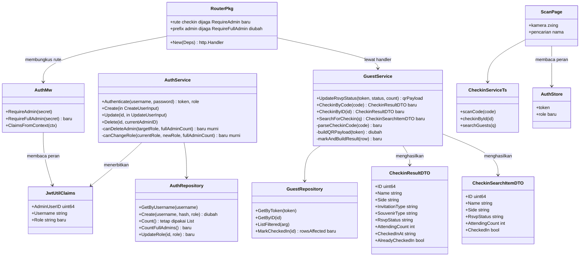
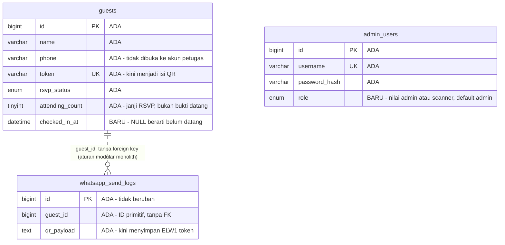
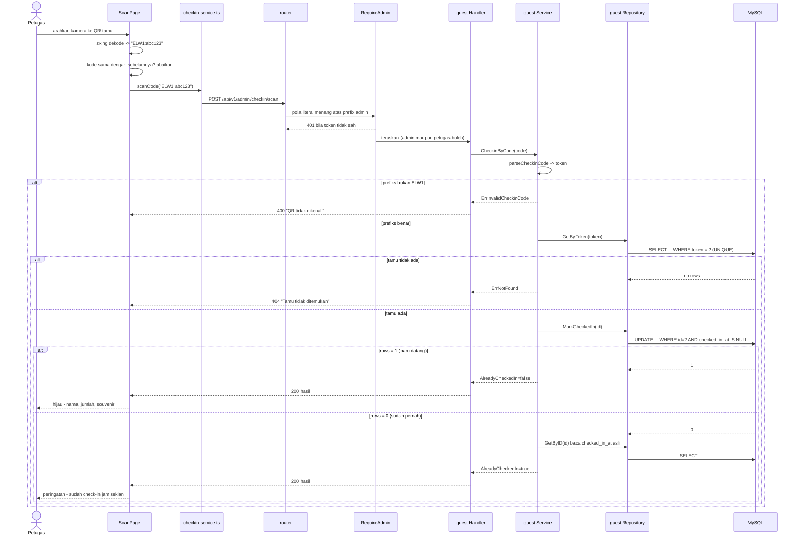
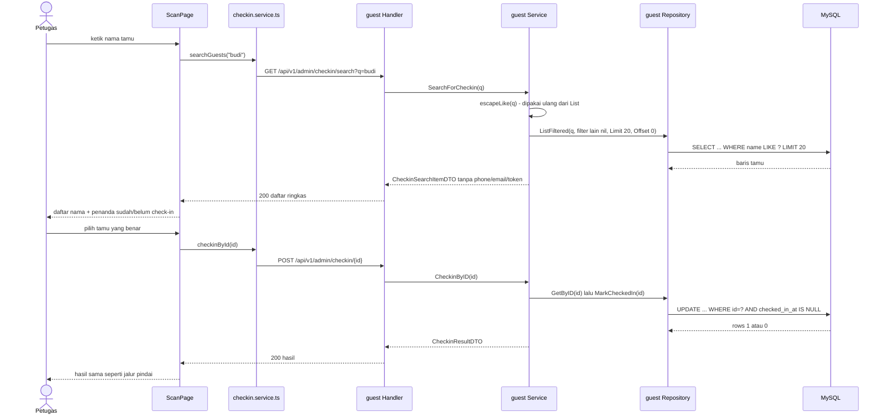
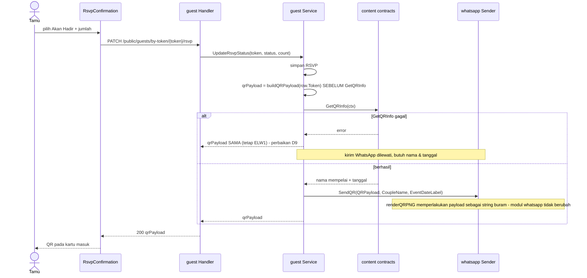

# PLAN — Menu Scan QR & Check-in Tamu di Gate

Analis: System Analyst (sesi 2026-09-05)
Target pembaca: programmer yang mengimplementasikan.

---

## 1. Pernyataan requirement

**Intent: new capability.** Fitur QR untuk tamu sudah ada (tamu menerima QR
sesudah RSVP, dan QR yang sama dikirim otomatis lewat WhatsApp), tapi **tidak
ada satu pun permukaan untuk memindainya**. Di hari-H, petugas di gate tidak
punya alat untuk memverifikasi tamu maupun mencatat kehadiran.

Requirement ini ikut membawa satu **enhancement wajib** pada fitur yang sudah
ada: isi QR harus diubah, karena QR yang sekarang **secara teknis tidak bisa
dipakai untuk identifikasi** (lihat §2.1). Tanpa perubahan itu, menu scan
tidak mungkin dibuat — ini bukan pilihan desain, melainkan konsekuensi dari
apa yang ada di dalam QR hari ini.

### 1.1 Keputusan terkunci (dijawab user)

| # | Keputusan | Jawaban user |
|---|---|---|
| K1 | QR lama yang sudah tersebar | **Belum tersebar / aman diganti.** Isi QR diganti jadi token tamu. TIDAK ada jalur kompatibilitas untuk QR format lama. |
| K2 | Operator gate & aksesnya | **Petugas dengan akun terbatas.** Tambah peran di `admin_users`; akun petugas HANYA boleh membuka menu Scan, tidak boleh mengubah konten atau menghapus tamu. |
| K3 | Aksi saat QR dipindai | **Catat kehadiran + tampilkan data tamu.** Pemindaian kedua memunculkan peringatan "sudah check-in jam sekian" dan TIDAK menghitung ganda. **Plus: check-in manual lewat pencarian nama**, untuk tamu yang lupa membawa atau kehilangan QR-nya. |
| K4 | Koneksi internet di lokasi | **Stabil — online saja.** Tidak ada mode offline, tidak ada antrean sinkronisasi. |
| D1 | Format isi QR | **`ELW1:<token>`** — berprefiks. Pemindai bisa menolak QR asing sebelum menembak API, dan prefiks versi memudahkan ganti format kelak. Bukan URL: URL membuat token tamu tercatat di riwayat browser siapa pun yang memindai. |
| D2 | Pustaka pemindai | **`@zxing/browser`** (v0.2.1, diperbarui 2026-07-06 — paling aktif dibanding `html5-qrcode` 2.3.8/April 2023 dan `jsqr` 1.4.0). Dekode langsung dari stream kamera, jalan di Safari/iOS lewat `getUserMedia`. |
| D3 | Data tamu yang terlihat akun petugas | **Ringkas saja.** Endpoint khusus mengembalikan nama, status, jumlah, sisi, jenis undangan & souvenir. Query-nya memakai ulang `ListGuestsFiltered`; yang berbeda hanya bentuk responsnya. |
| D4 | Ringkasan kehadiran di layar Scan | **Tidak ada.** Layar hanya menampilkan hasil pindaian/pencarian terakhir. Menambahkan penghitung nanti murah (satu `COUNT`), tapi tidak dikerjakan sekarang. |

### 1.2 Keputusan desain analis (bukan pertanyaan ke user)

| # | Keputusan | Alasan yang didapat dari trace |
|---|---|---|
| D5 | Check-in ditulis lewat **UPDATE bersyarat**, bukan baca-lalu-tulis | `UPDATE guests SET checked_in_at = NOW() WHERE id = ? AND checked_in_at IS NULL` + `rows affected`. Dua petugas yang memindai QR yang sama pada detik yang sama tidak akan saling menimpa, tanpa perlu transaksi. `rows = 0` berarti "sudah check-in", yang persis informasi yang diminta K3. |
| D6 | Rute scan didaftarkan sebagai **pola spesifik** di mux root, bukan sub-mux baru | Go 1.22 ServeMux memilih pola paling spesifik. Preseden ada di repo ini dan sudah berkomentar: `GET /guests/summary` sengaja literal supaya tidak bentrok `PUT /guests/{id}` ([router.go:110-116](../../../apps/api/internal/router/router.go#L110)). Jadi `POST /admin/checkin/scan` menang atas prefix `/api/v1/admin/`. |
| D7 | `RequireAdmin` **tidak diubah**; ditambah `RequireFullAdmin` di sebelahnya | Membalik arti `RequireAdmin` akan menyentuh seluruh route admin sekaligus. Menambah middleware baru membuat perubahan aksesnya terbaca eksplisit di [router.go:136](../../../apps/api/internal/router/router.go#L136), satu baris, dan mudah dibatalkan. |
| D8 | Peran kosong (`''`) pada JWT lama diperlakukan sebagai **admin penuh** | Token yang sudah tersimpan di localStorage admin tidak punya klaim `role`. Kalau kosong dianggap petugas, admin yang sedang login langsung kehilangan seluruh menu tanpa sebab yang terlihat. Kolomnya sendiri `NOT NULL DEFAULT 'admin'`, jadi baris lama juga tetap admin penuh. |
| D9 | Payload QR dihitung **sebelum** `GetQRInfo` | Lihat §2.4 — cabang degradasi yang ada sekarang mengembalikan QR tanpa identitas saat DB konten gagal dibaca. Dengan payload berbasis token, QR tidak bergantung pada `info` sama sekali, jadi cabang itu wajib ikut dibetulkan. |
| D10 | Prefiks `ELW1:` **diduplikasi** di Go dan TypeScript, dan itu disengaja | Browser tidak bisa memanggil konstanta Go. Duplikasi lintas bahasa tidak terhindarkan, jadi ditandai eksplisit di kedua sisi — persis pola yang sudah dipakai `normalizePhone` (Go) vs `normalizePhoneForWa` (TS). |

### 1.3 Determinasi reuse / extend / create-new

| Sisi | Determinasi | Bukti |
|---|---|---|
| `GetGuestByToken` | **Reuse, tanpa perubahan** | [guests.sql:8](../../../apps/api/internal/modules/guest/infrastructure/queries/guests.sql#L8) + [repository.go:25](../../../apps/api/internal/modules/guest/infrastructure/repository.go#L25). Persis lookup yang dibutuhkan pemindai, dan `token` sudah `UNIQUE KEY uq_guests_token` ([000002](../../../apps/api/migrations/000002_create_guest_tables.up.sql)). |
| `ListGuestsFiltered` + `escapeLike` | **Reuse, tanpa perubahan** | [guests.sql:22](../../../apps/api/internal/modules/guest/infrastructure/queries/guests.sql#L22) sudah `q` LIKE atas nama/telepon/email; [service.go:76](../../../apps/api/internal/modules/guest/application/service.go#L76) sudah meng-escape `%`/`_`/`\`. Pencarian nama untuk check-in manual tidak butuh query baru. |
| `GetGuestByID` | **Reuse, tanpa perubahan** | [guests.sql:5](../../../apps/api/internal/modules/guest/infrastructure/queries/guests.sql#L5) — dipakai check-in manual setelah petugas memilih hasil pencarian. |
| Modul `whatsapp` | **Tidak berubah** | `sendAndRecord` memperlakukan payload sebagai string buram: `renderQRPNG(qrPayload)` ([service.go:260](../../../apps/api/internal/modules/whatsapp/application/service.go#L260)). Mengganti isi QR tidak menyentuh modul ini, termasuk Resend yang memakai snapshot `qr_payload`. |
| `buildQRPayload` | **Extend (ganti isi)** | [service.go:427](../../../apps/api/internal/modules/guest/application/service.go#L427) — satu fungsi murni, satu pemanggil ([:478](../../../apps/api/internal/modules/guest/application/service.go#L478)). |
| Tabel `guests` | **Enhance** (+1 kolom) | Tidak ada kolom kehadiran-di-gate. `attending_count` adalah janji saat RSVP, bukan bukti datang ([000007](../../../apps/api/migrations/000007_add_guest_attendance_fields.up.sql)). |
| Tabel `admin_users` | **Enhance** (+1 kolom) | Hanya `username`+`password_hash` ([000003](../../../apps/api/migrations/000003_create_auth_tables.up.sql)). |
| `jwtutil.Claims` / `Generate` | **Extend** (+1 field, +1 param) | [jwtutil.go:14,20](../../../apps/api/internal/shared/jwtutil/jwtutil.go#L14). `Generate` hanya punya **satu** pemanggil: [auth service.go:51](../../../apps/api/internal/modules/auth/application/service.go#L51). |
| `authmw` | **Extend** (+1 middleware) | [middleware.go:18](../../../apps/api/internal/shared/authmw/middleware.go#L18). `ClaimsFromContext` ([:38](../../../apps/api/internal/shared/authmw/middleware.go#L38)) sudah ada dan langsung dipakai `RequireFullAdmin`. |
| Auth `Delete`/`Update` guardrail | **Extend (wajib)** | Lihat §2.3 — guardrail yang ada sekarang menjadi **tidak aman** begitu peran diperkenalkan. |
| `GuestDTO` | **TIDAK dipakai ulang untuk petugas** | [dto.go:11-28](../../../apps/api/internal/modules/guest/application/dto.go#L11) membawa `Phone`, `Email`, `Address`, `Notes`, **dan `Token`**. Memakainya untuk akun gate menyerahkan token undangan setiap tamu ke staf vendor. DTO ringkas baru adalah keputusan keamanan, bukan duplikasi. |
| Menu & rute admin | **Extend** | Pola jelas: [route-paths.ts](../../../apps/web/src/app/routes/route-paths.ts), rute di [AdminApp.tsx:34-41](../../../apps/web/src/modules/admin/app/AdminApp.tsx#L34), nav di [AdminLayout.tsx:13](../../../apps/web/src/modules/admin/shared/AdminLayout.tsx#L13). |
| `composeLocalQrPayload` (FE) | **Extend (ganti isi)** | [RsvpConfirmation.tsx:44](../../../apps/web/src/components/RsvpConfirmation/RsvpConfirmation.tsx#L44). |
| Halaman Scan, `parseCheckinCode`, DTO check-in, `RequireFullAdmin` | **Create new** | Celah nyata: tidak ada dependensi kamera sama sekali di [apps/web/package.json](../../../apps/web/package.json), dan tidak ada permukaan check-in di mana pun. |

---

## 2. Hasil trace

Stack: `apps/api` (Go modular monolith, sqlc + golang-migrate + MySQL) dan
`apps/web` (React + Vite, admin SPA entry terpisah `admin.html`).

### 2.1 QR yang ada sekarang tidak bisa dipakai untuk identifikasi

Ini temuan yang menentukan seluruh rancangan. `buildQRPayload` menghasilkan
**teks yang dibaca manusia, tanpa token dan tanpa ID**
([service.go:427-434](../../../apps/api/internal/modules/guest/application/service.go#L427)):

```
Wedding Invitation - <Pria> & <Wanita>
Nama Tamu: <nama>
Status: Akan Hadir
Jumlah Tamu: <n>
Tanggal: <label>
```

Konsekuensinya konkret: hasil pindaian **tidak bisa dipetakan balik ke baris
tamu**. Mencocokkan lewat nama tidak akurat (nama kembar itu lumrah di daftar
tamu pernikahan) dan sepele dipalsukan — siapa pun bisa mengetik teks yang
sama dan membuat QR-nya sendiri.

Padahal identitas per tamu **sudah ada dan sudah terbukti dipakai**: kolom
`token VARCHAR(64) NOT NULL UNIQUE` ([000002](../../../apps/api/migrations/000002_create_guest_tables.up.sql)),
selalu dibuat server-side oleh `generateToken()`, dan sudah menjadi dasar
endpoint publik `GET /api/v1/public/guests/by-token/{token}`
([router.go:67](../../../apps/api/internal/router/router.go#L67)). Menaruh
token itu ke dalam QR adalah memakai ulang identitas yang sudah ada, bukan
menciptakan yang baru.

Informasi yang selama ini dititipkan di dalam QR tidak hilang: kartu masuk
yang sekarang sudah menampilkan nama tamu, jumlah orang, dan tanggal sebagai
teks di kartunya sendiri.

### 2.2 Data kehadiran di gate belum ada

Kolom yang mirip tapi **bukan** kehadiran: `attending_count` dan
`is_expected_attending` ([000007](../../../apps/api/migrations/000007_add_guest_attendance_fields.up.sql)) —
yang pertama janji tamu saat RSVP, yang kedua dugaan admin. `rsvp_status`
juga niat, bukan bukti datang. Jadi tidak ada tempat menyimpan "tamu ini
benar-benar tiba jam sekian" → kolom baru memang dibutuhkan.

### 2.3 Guardrail akun admin menjadi tidak aman begitu peran ada

`admin_users` tidak punya peran sama sekali, dan itu **keputusan yang pernah
dikunci**, tertulis di kode: *"semua admin setara/tanpa role (keputusan #2)"*
([auth service.go:55](../../../apps/api/internal/modules/auth/application/service.go#L55)).
K2 membalik keputusan itu — catat sebagai perubahan sadar, bukan penemuan
baru.

Yang berbahaya adalah efek sampingnya. `Delete` menjaga agar admin terakhir
tidak terhapus dengan `total <= 1`, di mana `total` berasal dari
`repo.Count()` yang menghitung **seluruh baris**
([service.go:128-134](../../../apps/api/internal/modules/auth/application/service.go#L128)).
Begitu ada akun petugas, 1 admin penuh + 3 petugas = 4, sehingga admin penuh
terakhir **lolos dihapus** dan sistem terkunci total — tidak ada lagi akun
yang bisa membuka menu Users untuk memperbaikinya. Hal yang sama berlaku
untuk `Update` ([:97](../../../apps/api/internal/modules/auth/application/service.go#L97))
begitu ia bisa mengubah peran: menurunkan admin penuh terakhir jadi petugas
menghasilkan penguncian yang identik.

### 2.4 Cabang degradasi QR akan menghasilkan QR yang tak bisa dipindai

Saat `GetQRInfo` gagal, `UpdateRsvpStatus` sengaja tidak menggagalkan RSVP dan
mengembalikan payload minimal
([service.go:469-476](../../../apps/api/internal/modules/guest/application/service.go#L469)).
Perilaku itu benar untuk payload lama. Tapi begitu QR berisi token, cabang
tersebut menjadi jebakan: gangguan sesaat pada tabel `invitation_content`
akan diam-diam memberi tamu QR **tanpa identitas** yang ditolak di gate,
padahal token-nya tersedia sepanjang waktu di `row.Token`. Karena itu payload
dihitung sebelum pemanggilan `GetQRInfo` (D9).

### 2.5 Query auth menyebut kolom secara eksplisit

`GetAdminUserByUsername` dan `ListAdminUsers` memakai daftar kolom eksplisit,
**bukan `SELECT *`**
([queries/auth.sql](../../../apps/api/internal/modules/auth/infrastructure/queries)).
Artinya menambah kolom `role` **tidak** ikut otomatis: kalau daftar kolomnya
lupa diperbarui, `Authenticate` selalu menerbitkan JWT dengan peran kosong dan
seluruh pembatasan akses gagal senyap. Ini berbeda dari modul content/whatsapp
yang memakai `SELECT *` sehingga kolom baru ikut sendiri.

### 2.6 Kamera butuh HTTPS

`getUserMedia` hanya tersedia di secure context. Produksi sudah HTTPS
(`https://elwedding.elcodelabs.com`), jadi hari-H aman. Yang perlu diketahui
programmer: menguji halaman Scan lewat IP LAN ber-`http://` **tidak akan
bisa membuka kamera** — pakai `localhost` (yang dianggap secure) atau
terowongan HTTPS.

---

## 3. Lingkup

### 3.1 Masuk lingkup

| Berkas | Perubahan |
|---|---|
| `apps/api/migrations/000014_add_guest_checkin.{up,down}.sql` | **Baru** — `guests.checked_in_at` |
| `apps/api/migrations/000015_add_admin_user_role.{up,down}.sql` | **Baru** — `admin_users.role` |
| [guest queries/guests.sql](../../../apps/api/internal/modules/guest/infrastructure/queries/guests.sql) | +1 query `MarkGuestCheckedIn` |
| [auth queries](../../../apps/api/internal/modules/auth/infrastructure/queries) | `role` di daftar kolom eksplisit; +1 query `CountFullAdmins` |
| `apps/api/internal/modules/*/infrastructure/sqlc/*` | **Hasil `sqlc generate`** — jangan disunting tangan |
| [jwtutil.go](../../../apps/api/internal/shared/jwtutil/jwtutil.go) | `Role` di `Claims`, +1 param di `Generate` |
| [authmw/middleware.go](../../../apps/api/internal/shared/authmw/middleware.go) | +`RequireFullAdmin` |
| [auth/infrastructure/repository.go](../../../apps/api/internal/modules/auth/infrastructure/repository.go) | `Create` +param peran; +`CountFullAdmins`; +`UpdateRole` |
| [auth/application/service.go](../../../apps/api/internal/modules/auth/application/service.go) | Peran di `Authenticate`/`Create`/`Update`; guardrail berbasis admin penuh |
| [auth/application/dto.go](../../../apps/api/internal/modules/auth/application/dto.go) | `Role` di DTO & input |
| [auth/presentation/handler.go](../../../apps/api/internal/modules/auth/presentation/handler.go) | `role` di respons login |
| [guest/application/service.go](../../../apps/api/internal/modules/guest/application/service.go) | `buildQRPayload` jadi token; `parseCheckinCode`; `CheckinByCode`/`CheckinByID`/`SearchForCheckin` |
| [guest/application/dto.go](../../../apps/api/internal/modules/guest/application/dto.go) | `CheckinResultDTO`, `CheckinSearchItemDTO` |
| [guest/infrastructure/repository.go](../../../apps/api/internal/modules/guest/infrastructure/repository.go) | +`MarkCheckedIn` |
| [guest/presentation/handler.go](../../../apps/api/internal/modules/guest/presentation/handler.go) | 3 handler baru |
| [router.go](../../../apps/api/internal/router/router.go) | 3 rute scan + `RequireFullAdmin` pada prefix admin |
| `apps/api/internal/modules/guest/application/checkin_test.go` | **Baru** |
| `apps/api/internal/shared/authmw/middleware_test.go` | **Baru** |
| [apps/web/package.json](../../../apps/web/package.json) | +`@zxing/browser` |
| [route-paths.ts](../../../apps/web/src/app/routes/route-paths.ts) | +`scan` |
| [AdminApp.tsx](../../../apps/web/src/modules/admin/app/AdminApp.tsx) | Rute `/scan` (lazy) + pengalihan berbasis peran |
| [AdminLayout.tsx](../../../apps/web/src/modules/admin/shared/AdminLayout.tsx) | Item nav Scan + penyaringan menu per peran |
| [ProtectedRoute.tsx](../../../apps/web/src/modules/admin/shared/ProtectedRoute.tsx) | Penjaga peran |
| [auth.store.ts](../../../apps/web/src/shared/stores/auth.store.ts) | Simpan `role` |
| [auth.service.ts](../../../apps/web/src/modules/admin/auth/services/auth.service.ts) | Baca `role` dari respons login |
| `apps/web/src/modules/admin/scan/services/checkin.service.ts` | **Baru** |
| `apps/web/src/modules/admin/scan/pages/ScanPage.tsx` | **Baru** |
| [UsersPage.tsx](../../../apps/web/src/modules/admin/users/pages/UsersPage.tsx) + [user.schema.ts](../../../apps/web/src/modules/admin/users/schemas/user.schema.ts) | Pilihan peran saat buat/ubah akun |
| [RsvpConfirmation.tsx](../../../apps/web/src/components/RsvpConfirmation/RsvpConfirmation.tsx) | `composeLocalQrPayload` jadi `ELW1:<token>` |
| [knowledge/BACKEND.md](../../../knowledge/BACKEND.md), [knowledge/FRONTEND.md](../../../knowledge/FRONTEND.md), [knowledge/DATABASE.md](../../../knowledge/DATABASE.md) | Catat peran, isi QR, dan aturan check-in |

### 3.2 Di luar lingkup (keputusan, bukan kelalaian)

- **Mode offline / sinkronisasi** — ditolak di K4. Tidak ada penyimpanan
  lokal, antrean, maupun penyelesaian bentrok.
- **Penghitung progres di layar Scan** — ditolak di D4.
- **Koreksi jumlah orang yang benar-benar masuk** — user memilih opsi tanpa
  koreksi pax di K3, jadi tidak ada kolom `checked_in_count`.
- **Kompatibilitas QR format lama** — ditolak di K1. Pemindai hanya menerima
  `ELW1:`; QR lama sengaja ditolak dengan pesan jelas, bukan dicocokkan
  lewat nama.
- **Mencatat siapa petugas yang memindai** (`checked_in_by`) — tidak diminta.
  Satu kolom lagi bisa ditambahkan kelak tanpa mengubah alur.
- **Batal check-in / undo** — tidak diminta. Kalau petugas salah scan, data
  dikoreksi lewat DB, bukan lewat UI.
- **Halaman Reservasi & Ringkasan** — tidak menampilkan status check-in.
  `Summary` ([service.go:271](../../../apps/api/internal/modules/guest/application/service.go#L271))
  tidak disentuh.
- **Modul `whatsapp`** — tidak disentuh sama sekali (§1.3).
- **Mode pratinjau tanpa token** — tamu yang membuka `/` tanpa `?guest=`
  tetap melihat QR, tapi isinya teks lama yang akan ditolak pemindai. Itu
  konsisten dengan perilaku yang sudah ada (RSVP-nya juga tidak tersimpan),
  jadi sengaja tidak diberi penanganan khusus.

---

## 4. Task list (dikerjakan berurutan)

### Backend

- [x] **T1 — Migration 000014: kolom check-in.**
  ```sql
  ALTER TABLE guests
    ADD COLUMN checked_in_at DATETIME NULL AFTER attending_count;
  ```
  `.down.sql`: `DROP COLUMN checked_in_at;`.
  **NULL disengaja** (beda dari pola `NOT NULL DEFAULT ''` di kolom teks):
  NULL berarti "belum datang" dan sekaligus menjadi syarat UPDATE bersyarat
  di T7 (D5). sqlc menghasilkan `sql.NullTime`.
  Tidak diberi index: satu-satunya jalur baca adalah lookup per tamu lewat
  `token`/`id` yang sudah ber-index, dan §3.2 menutup semua fitur yang akan
  memfilter kolom ini.

- [x] **T2 — Migration 000015: peran akun admin.**
  ```sql
  ALTER TABLE admin_users
    ADD COLUMN role ENUM('admin', 'scanner') NOT NULL DEFAULT 'admin' AFTER password_hash;
  ```
  `.down.sql`: `DROP COLUMN role;`.
  ENUM mengikuti konvensi tabel lain (`guests.side`, `guests.rsvp_status`),
  sehingga sqlc menghasilkan tipe `AdminUsersRole` — bukan string bebas.
  `DEFAULT 'admin'` membuat seluruh akun yang sudah ada tetap admin penuh
  tanpa backfill (D8).

- [x] **T3 — Query + `sqlc generate`.** T1 & T2 **wajib** lebih dulu —
  `sqlc.yaml` membaca `schema: "migrations"`.
  - `guests.sql`, query baru:
    ```sql
    -- name: MarkGuestCheckedIn :execrows
    UPDATE guests SET checked_in_at = NOW() WHERE id = ? AND checked_in_at IS NULL;
    ```
    `:execrows` (bukan `:exec`) — jumlah baris terpengaruh itulah yang
    membedakan "baru saja check-in" dari "sudah check-in" (D5).
  - `auth` queries: tambahkan `role` pada daftar kolom
    `GetAdminUserByUsername` dan `ListAdminUsers`, pada `INSERT` di
    `CreateAdminUser`, dan tambahkan query baru:
    ```sql
    -- name: CountFullAdmins :one
    SELECT COUNT(*) FROM admin_users WHERE role = 'admin';

    -- name: UpdateAdminUserRole :exec
    UPDATE admin_users SET role = ? WHERE id = ?;
    ```
    **Daftar kolom eksplisit adalah jebakannya** (§2.5) — lupa satu saja
    membuat peran selalu kosong dan pembatasan akses gagal senyap.
  - Jalankan `sqlc generate`. Harapkan **keempat** `models.go` bertambah
    baris; itu benar, semua modul mencerminkan seluruh skema. Jangan sunting
    `infrastructure/sqlc/`.

- [x] **T4 — `jwtutil`: bawa peran di token.**
  - `Claims` +`Role string \`json:"role"\`` ([jwtutil.go:14](../../../apps/api/internal/shared/jwtutil/jwtutil.go#L14)).
  - `Generate(secret, expiresIn, adminUserID, username, role string)` —
    hanya **satu** pemanggil yang ikut berubah ([auth service.go:51](../../../apps/api/internal/modules/auth/application/service.go#L51)).

- [x] **T5 — `authmw.RequireFullAdmin`.**
  Middleware baru di [middleware.go](../../../apps/api/internal/shared/authmw/middleware.go),
  membungkus `RequireAdmin` lalu menolak peran petugas:
  ```go
  func RequireFullAdmin(secret string) func(http.Handler) http.Handler
  ```
  Implementasi: jalankan `RequireAdmin` dulu, lalu baca
  `ClaimsFromContext` ([:38](../../../apps/api/internal/shared/authmw/middleware.go#L38));
  bila `claims.Role == "scanner"`, hentikan dengan
  `response.Error(w, http.StatusForbidden, "Akses ditolak untuk akun petugas", nil)`
  — paket `response` **tidak punya** helper `Forbidden` (yang ada hanya
  `BadRequest`/`Unauthorized`/`NotFound`/`Internal`
  [response.go:43-65](../../../apps/api/internal/shared/response/response.go#L43)),
  jadi pakai `Error` generik; jangan menambah helper baru untuk satu pemanggil.
  Selain itu teruskan. **`Role` kosong = admin penuh** (D8) — jangan dibalik.
  `RequireAdmin` sendiri **tidak** diubah (D7).

- [x] **T6 — Modul `auth`: peran end-to-end.**
  - `dto.go`: `Role` pada `AdminUserDTO`, `CreateUserInput`, `UpdateUserInput`.
  - `infrastructure/repository.go` — service memanggil lewat pembungkus ini,
    jadi query T3 saja belum cukup:
    - `Create` ([:22](../../../apps/api/internal/modules/auth/infrastructure/repository.go#L22))
      bertambah parameter `role`.
    - `+CountFullAdmins(ctx) (int64, error)`; `Count`
      ([:30](../../../apps/api/internal/modules/auth/infrastructure/repository.go#L30))
      **tetap ada** — masih dipakai paginasi `List`, dan hanya guardrail yang
      pindah ke penghitung baru.
    - `+UpdateRole(ctx, id, role) error`.
    - `GetByUsername` ([:18](../../../apps/api/internal/modules/auth/infrastructure/repository.go#L18))
      dan `List` ([:26](../../../apps/api/internal/modules/auth/infrastructure/repository.go#L26))
      tidak berubah signature-nya; tipe baris hasil sqlc otomatis membawa
      `role` setelah T3.
  - `Authenticate` ([:38](../../../apps/api/internal/modules/auth/application/service.go#L38)):
    teruskan `user.Role` ke `jwtutil.Generate`, dan kembalikan peran itu ke
    handler supaya bisa ikut di respons login.
  - `handler.go` `Login` ([:50](../../../apps/api/internal/modules/auth/presentation/handler.go#L50)):
    respons jadi `{"token": ..., "role": ...}`.
  - `Create`/`Update`: terima peran; nilai yang bukan `admin`/`scanner`
    ditolak dengan error validasi (pola sama seperti `validStatuses` di
    modul guest).
  - **Guardrail anti-terkunci (§2.3), wajib.** Keputusannya diekstrak jadi
    **dua fungsi murni** supaya bisa diuji tanpa DB — `Service` menyimpan
    `*infrastructure.Repository` konkret
    ([:27](../../../apps/api/internal/modules/auth/application/service.go#L27)),
    jadi method yang menyentuh repo memang tidak bisa di-unit-test. Ini pola
    yang sudah dipakai `resolveAttendingCount` di modul guest
    ([service.go:415](../../../apps/api/internal/modules/guest/application/service.go#L415)),
    yang komentarnya menyebut alasan yang sama:
    ```go
    func canDeleteAdmin(targetRole string, fullAdminCount int) error
    func canChangeRole(currentRole, newRole string, fullAdminCount int) error
    ```
    - `canDeleteAdmin`: menolak hanya bila target **admin penuh** DAN
      `fullAdminCount <= 1`. Menghapus akun petugas tidak pernah boleh
      terhalang jumlah admin.
    - `canChangeRole`: menolak bila admin penuh terakhir diturunkan jadi
      petugas (`currentRole` admin, `newRole` scanner, `fullAdminCount <= 1`).
    - `Delete` ([:124](../../../apps/api/internal/modules/auth/application/service.go#L124)):
      ambil `repo.CountFullAdmins()` (menggantikan `repo.Count()` **pada
      guardrail ini saja**) lalu delegasikan ke `canDeleteAdmin`. Penjagaan
      `id == currentAdminID` yang sudah ada tetap apa adanya.
    - `Update`: panggil `canChangeRole` sebelum menulis.
    - Error baru `ErrCannotDemoteLastAdmin` didaftarkan di `StatusHTTPCode`
      ([:140](../../../apps/api/internal/modules/auth/application/service.go#L140))
      sebagai 400, sebaris dengan `ErrCannotDeleteLastAdmin`.

- [x] **T7 — Modul `guest`: logika check-in.**
  - **Fungsi murni** (diuji tanpa DB):
    ```go
    const checkinCodePrefix = "ELW1:"
    func parseCheckinCode(code string) (token string, ok bool)
    ```
    `TrimSpace` dulu (pembaca QR kadang menyisipkan newline), lalu wajib
    berprefiks `ELW1:` dan sisanya tidak kosong. Selain itu → `ok=false`.
  - `dto.go`:
    ```go
    type CheckinResultDTO struct {
        ID               uint64  `json:"id"`
        Name             string  `json:"name"`
        Side             string  `json:"side"`
        InvitationType   string  `json:"invitationType"`
        SouvenirType     string  `json:"souvenirType"`
        RsvpStatus       string  `json:"rsvpStatus"`
        AttendingCount   int     `json:"attendingCount"`
        CheckedInAt      string  `json:"checkedInAt"`
        AlreadyCheckedIn bool    `json:"alreadyCheckedIn"`
    }
    type CheckinSearchItemDTO struct {
        ID             uint64 `json:"id"`
        Name           string `json:"name"`
        Side           string `json:"side"`
        RsvpStatus     string `json:"rsvpStatus"`
        AttendingCount int    `json:"attendingCount"`
        CheckedIn      bool   `json:"checkedIn"`
    }
    ```
    **Tanpa `Phone`, `Email`, `Address`, `Notes`, dan tanpa `Token`** (D3) —
    inilah bedanya dari `GuestDTO` ([dto.go:11](../../../apps/api/internal/modules/guest/application/dto.go#L11)).
    `CheckedInAt` diformat `"2006-01-02T15:04:05Z07:00"`, konvensi yang sudah
    dipakai seluruh waktu di modul ini
    ([service.go:84](../../../apps/api/internal/modules/guest/application/service.go#L84),
    [:104](../../../apps/api/internal/modules/guest/application/service.go#L104)) —
    frontend butuh nilai yang bisa diparse untuk menampilkan "sudah check-in
    jam sekian" (K3), jadi jangan mengirim string yang sudah diformat manusia.
  - `repository.go`: +`MarkCheckedIn(ctx, id) (int64, error)` yang memanggil
    `MarkGuestCheckedIn` dan meneruskan rows-affected.
  - Service:
    - `CheckinByCode(ctx, code) (CheckinResultDTO, error)` — `parseCheckinCode`;
      bila gagal → `ErrInvalidCheckinCode`. Lalu `repo.GetByToken`;
      `sql.ErrNoRows` → `ErrNotFound`. Lalu `markAndBuildResult`.
    - `CheckinByID(ctx, id) (CheckinResultDTO, error)` — `repo.GetByID`, lalu
      `markAndBuildResult`.
    - `markAndBuildResult(ctx, row)` — panggil `repo.MarkCheckedIn(row.ID)`.
      `rows == 1` → baru check-in: `AlreadyCheckedIn=false`, `CheckedInAt`
      diisi waktu sekarang. `rows == 0` → sudah pernah:
      `AlreadyCheckedIn=true`, dan **baca ulang** `repo.GetByID` untuk
      mengambil `checked_in_at` yang asli (baris `row` yang dipegang bisa
      saja dibaca sebelum petugas lain menandainya).
    - `SearchForCheckin(ctx, q string) ([]CheckinSearchItemDTO, error)` —
      **dibatasi, bukan dipaginasi**: panggil `repo.ListFiltered` dengan
      `Limit: 20, Offset: 0`. Petugas mencari satu tamu, bukan meramban
      daftar, jadi halaman kedua tidak ada gunanya — dan tanpa paginasi
      tidak perlu `CountFiltered`, sehingga tiap ketikan hanya menghasilkan
      **satu** query, bukan dua. Karena responsnya tidak dipaginasi, amplopnya
      juga tanpa `meta`; `.claude/rules/api-standard.md` mewajibkan `meta`
      hanya untuk respons berpaginasi.
      Nilai `q` dibungkus `escapeLike(q)` persis seperti `List`
      ([:229](../../../apps/api/internal/modules/guest/application/service.go#L229)),
      filter lain (`status`, `invitationType`, `souvenirType`,
      `respondedOnly`) dibiarkan kosong/nil, lalu hasilnya dipetakan ke
      `CheckinSearchItemDTO`. **Query dan escaping dipakai ulang apa adanya**;
      yang baru hanya pemetaan DTO.
  - **Status RSVP tidak memblokir check-in.** Tamu ber-status `pending` atau
    `not_attending` yang tetap datang harus bisa dicatat; `RsvpStatus`
    dikembalikan supaya petugas melihatnya di layar. Jangan menambahkan
    penolakan berbasis status.

- [x] **T8 — Handler `guest` + error.**
  Tiga handler di [presentation/handler.go](../../../apps/api/internal/modules/guest/presentation/handler.go),
  mengikuti pola `decodeJSON`/`writeServiceError` yang sudah ada:
  - `CheckinByQR` — `POST`, body `{"code": "..."}`.
  - `CheckinByID` — `POST`, `id` dari `r.PathValue("id")`.
  - `SearchForCheckin` — `GET`, hanya query `q`. Balas `response.OK` dengan
    array data **tanpa `meta`** (bukan `ListGuests`
    ([:42](../../../apps/api/internal/modules/guest/presentation/handler.go#L42))
    yang berpaginasi) — hasilnya sudah dibatasi 20 di service.
    `q` kosong → balas array kosong, jangan mengembalikan 20 tamu pertama
    secara acak begitu petugas menghapus ketikannya.
  Di `StatusHTTPCode` ([service.go:499](../../../apps/api/internal/modules/guest/application/service.go#L499))
  cukup tambahkan `ErrInvalidCheckinCode` → **400** pada cabang 400 yang sudah
  ada. `ErrNotFound` **sudah** terpetakan ke 404 di
  [:501](../../../apps/api/internal/modules/guest/application/service.go#L501) —
  jangan menambahkannya lagi.

- [x] **T9 — Router: daftarkan rute & perketat prefix admin.**
  Di [router.go](../../../apps/api/internal/router/router.go), setelah blok
  admin yang ada:
  ```go
  scanAuth := authmw.RequireAdmin(d.JWTSecret)
  mux.Handle("POST /api/v1/admin/checkin/scan", scanAuth(http.HandlerFunc(d.GuestHandler.CheckinByQR)))
  mux.Handle("GET /api/v1/admin/checkin/search", scanAuth(http.HandlerFunc(d.GuestHandler.SearchForCheckin)))
  mux.Handle("POST /api/v1/admin/checkin/{id}", scanAuth(http.HandlerFunc(d.GuestHandler.CheckinByID)))
  ```
  lalu ubah [baris 136](../../../apps/api/internal/router/router.go#L136):
  ```go
  mux.Handle("/api/v1/admin/", authmw.RequireFullAdmin(d.JWTSecret)(admin))
  ```
  Pola literal `checkin/scan` & `checkin/search` menang atas `checkin/{id}`
  **dan** atas prefix `/api/v1/admin/` — mekanisme yang sama persis dengan
  `guests/summary` vs `guests/{id}` yang sudah berkomentar di
  [:110-116](../../../apps/api/internal/router/router.go#L110). Beri komentar
  yang menyebut D6 supaya urutannya tidak "dirapikan" orang berikutnya.

- [x] **T10 — Isi QR jadi token.**
  - `buildQRPayload(token string) string` → `checkinCodePrefix + token`
    ([service.go:427](../../../apps/api/internal/modules/guest/application/service.go#L427)).
  - Di `UpdateRsvpStatus`, **hitung payload sebelum `GetQRInfo`** dan pakai
    nilai yang sama di kedua cabang — termasuk cabang gagal di
    [:469-476](../../../apps/api/internal/modules/guest/application/service.go#L469),
    yang sekarang mengembalikan teks minimal (D9/§2.4).
  - `sender.SendQR` tetap menerima `QRPayload` yang sama; modul `whatsapp`
    tidak disentuh.

- [x] **T11 — Test Go.**
  - `guest/application/checkin_test.go`: `parseCheckinCode` untuk kode sah,
    prefiks salah (`ELW2:`, `WA:`), tanpa prefiks, prefiks tanpa token
    (`ELW1:`), string kosong, dan kode ber-spasi/newline di ujung;
    `buildQRPayload` menghasilkan `ELW1:<token>` **dan bisa dibaca balik oleh
    `parseCheckinCode`** (uji bolak-balik — inilah yang mengunci kontrak
    antara QR yang diterbitkan dan pemindai).
  - `shared/authmw/middleware_test.go`: token peran `scanner` → **403**;
    peran `admin` → diteruskan; peran **kosong** → diteruskan (mengunci D8);
    tanpa token → 401.
  - `auth/application/role_guard_test.go` (**baru**): menguji dua fungsi
    murni dari T6, bukan method `Delete`/`Update` yang menyentuh repo —
    `canDeleteAdmin` menolak saat target admin penuh & `fullAdminCount = 1`,
    **mengizinkan** saat target petugas walau `fullAdminCount = 1` (inilah
    regresi §2.3 yang dijaga), dan mengizinkan saat `fullAdminCount = 2`;
    `canChangeRole` menolak penurunan admin penuh terakhir, mengizinkan
    penurunan saat masih ada admin lain, dan mengizinkan kenaikan petugas
    jadi admin kapan pun.

### Frontend

- [x] **T12 — Peran sampai ke SPA.**
  - `auth.service.ts`: `LoginResponse.data` +`role`; `login()` kembalikan
    `{ token, role }`.
  - `auth.store.ts`: simpan `role` berdampingan dengan `token` (tetap lewat
    `persist`), dan `logout()` mengosongkan keduanya.
  - `LoginPage`: simpan keduanya, lalu arahkan petugas ke `/scan` dan admin
    ke dashboard.

- [x] **T13 — Rute & menu.**
  - `route-paths.ts`: +`scan: '/scan'`.
  - `AdminApp.tsx`: rute `/scan`. Halaman ini **lazy** (`React.lazy` +
    `Suspense`) — sengaja berbeda dari rute lain yang diimpor eager
    ([AdminApp.tsx:6-14](../../../apps/web/src/modules/admin/app/AdminApp.tsx#L6)),
    supaya pustaka kamera tidak ikut membebani bundel admin bagi mayoritas
    pengguna yang tidak pernah membuka Scan.
  - `AdminLayout.tsx`: item nav Scan di `NAV_ITEMS`
    ([:13](../../../apps/web/src/modules/admin/shared/AdminLayout.tsx#L13));
    saat peran `scanner`, **hanya** item Scan yang dirender.
  - `ProtectedRoute.tsx`: petugas yang membuka rute selain `/scan`
    dialihkan ke `/scan`.
  - **Penyaringan menu ini kosmetik.** Penegakan sebenarnya ada di
    `RequireFullAdmin` (T5); jangan pernah menjadikan penyembunyian menu
    sebagai satu-satunya pembatas.

- [x] **T14 — Dependensi pemindai.** `npm i @zxing/browser -w apps/web`
  (v0.2.1, D2). Pin versinya di `package.json`.

- [x] **T15 — `checkin.service.ts`** di `modules/admin/scan/services/`:
  `scanCode(code)`, `checkinById(id)`, `searchGuests(q)` — semuanya lewat
  `httpClient` sesuai aturan satu instance Axios.

- [x] **T16 — `ScanPage.tsx`.**
  - Pemindai kamera dari `@zxing/browser`, kamera belakang bila tersedia,
    dan **stream dihentikan saat unmount** — kamera yang menyala terus akan
    menguras baterai perangkat gate sepanjang acara.
  - Setiap hasil pindaian dikirim ke `scanCode`. Hasilnya ditampilkan besar
    dan terbaca dari jarak lengan: nama, jumlah orang, sisi, jenis souvenir.
  - **Empat keadaan yang harus jelas berbeda**: berhasil check-in; sudah
    check-in sebelumnya (tampilkan jamnya, K3); QR/tamu ditolak (kode tidak
    dikenali atau tamu tidak ditemukan); dan **permintaan gagal terkirim**
    (jaringan putus / server tidak menjawab). Yang terakhir wajib dibedakan
    dari penolakan: karena K4 mengunci mode online-only, gangguan sinyal
    sesaat adalah kegagalan yang paling mungkin terjadi di gate, dan petugas
    harus tahu bahwa tamunya **belum tercatat** lalu mengulang — bukan
    menyangka QR tamu itu palsu dan menahannya di pintu.
  - **Redam pindaian berulang**: kamera mengirim frame terus-menerus, jadi
    kode yang sama tidak boleh menembak API berkali-kali dalam sekejap —
    abaikan kode identik selama beberapa detik setelah hasil ditampilkan.
  - Panel pencarian nama untuk tamu tanpa QR (K3): ketik nama → daftar
    ringkas → tombol check-in per baris → `checkinById`. **Ketikan
    di-debounce ~300 ms**, memakai ulang pola yang sudah ada di `GuestsPage`
    ([:104-109](../../../apps/web/src/modules/admin/guests/pages/GuestsPage.tsx#L104)) —
    tanpa itu mengetik "budi" mengirim empat permintaan berturut-turut.
    Baris yang sudah check-in ditandai jelas supaya petugas tidak menekan
    tombolnya dua kali.
  - Bila izin kamera ditolak, halaman **tetap berguna**: tampilkan pesan
    yang menjelaskan sebabnya dan biarkan pencarian nama tetap jalan.

- [x] **T17 — `UsersPage` + skema: pilihan peran.**
  Tambahkan pilihan peran pada form buat/ubah akun
  ([UsersPage.tsx](../../../apps/web/src/modules/admin/users/pages/UsersPage.tsx))
  dan pada `createUserSchema`/`updateUserSchema`
  ([user.schema.ts](../../../apps/web/src/modules/admin/users/schemas/user.schema.ts)),
  serta tampilkan peran di tabel. Perbarui komentar berkas yang masih
  menyatakan "semua admin setara/tanpa role"
  ([UsersPage.tsx:24](../../../apps/web/src/modules/admin/users/pages/UsersPage.tsx#L24)).

- [x] **T18 — QR sisi tamu.**
  `composeLocalQrPayload` ([RsvpConfirmation.tsx:44](../../../apps/web/src/components/RsvpConfirmation/RsvpConfirmation.tsx#L44))
  mengembalikan `ELW1:${session.token}` bila token ada. **Bila token kosong**
  (mode pratinjau tanpa `?guest=`), kembalikan teks lama apa adanya — QR itu
  memang tidak mewakili tamu mana pun dan akan ditolak pemindai dengan pesan
  yang benar (§3.2). Beri komentar yang menyebut prefiks ini kembar dengan
  `checkinCodePrefix` di Go (D10).

- [x] **T19 — Test frontend.**
  - `ScanPage`: hasil sukses, hasil "sudah check-in" menampilkan jam, kode
    tidak dikenal, dan check-in lewat pencarian nama. Modul `@zxing/browser`
    di-mock — jsdom tidak punya kamera.
  - `ProtectedRoute`/`AdminLayout`: peran `scanner` hanya melihat menu Scan
    dan dialihkan dari rute lain.
  - `RsvpConfirmation`: QR bernilai `ELW1:<token>` saat ada token, dan teks
    lama saat mode pratinjau.

- [x] **T20 — Dokumentasi `knowledge/`.**
  - `BACKEND.md`: dua peran akun & arti `RequireFullAdmin`; alasan rute scan
    didaftarkan sebagai pola spesifik (D6); guardrail admin terakhir kini
    menghitung **admin penuh** saja (§2.3).
  - `FRONTEND.md`: isi QR sekarang `ELW1:<token>` (bukan teks), prefiks
    kembar di dua bahasa (D10), dan halaman Scan butuh HTTPS (§2.6).
  - `DATABASE.md`: `guests.checked_in_at` NULL = belum datang, dan mengapa
    check-in memakai UPDATE bersyarat (D5).

- [x] **T21 — Verifikasi (kriteria selesai).**
  1. **(T1, T2)** Migrasi dua arah pada MySQL lokal: `up` → `down 1` → `up`
     untuk keduanya, lalu `information_schema` memastikan
     `guests.checked_in_at` **nullable=YES** dan `admin_users.role` bertipe
     `enum('admin','scanner')` **NOT NULL DEFAULT 'admin'**.
  2. **(T2, D8)** `SELECT role FROM admin_users` — seluruh akun lama
     bernilai `admin`, bukan kosong.
  3. **(T3-T11)** `go build ./...` dan `go test ./...` lulus, termasuk suite
     `guest` & `whatsapp` yang lama sebagai bukti jalur RSVP/QR tidak
     teregresi.
  4. **(T5, T9)** Uji akses nyata dengan dua akun: akun petugas menembak
     `GET /api/v1/admin/guests` → **403**, sedangkan
     `GET /api/v1/admin/checkin/search?q=bu` → **200**. Akun admin →
     dua-duanya 200. Ini yang membuktikan pembatasan ada di server, bukan
     hanya di menu.
  5. **(T7, D5)** Check-in ganda: `POST /admin/checkin/scan` dua kali dengan
     kode sama → panggilan pertama `alreadyCheckedIn=false`, kedua
     `alreadyCheckedIn=true` dengan `checkedInAt` **yang sama persis**
     seperti panggilan pertama.
  6. **(T7, D3)** Respons `checkin/search` dan `checkin/scan` diperiksa
     langsung: **tidak memuat** `phone`, `email`, `address`, `notes`,
     maupun `token`.
  7. **(T10)** Tamu RSVP "Akan Hadir" → nilai QR di halaman undangan
     berawalan `ELW1:`, dan memindainya di menu Scan menemukan tamu yang
     benar. Ini menutup rantai penuh dari penerbitan sampai pemindaian.
  8. **(T6)** 1 admin penuh + 1 petugas: menghapus petugas **berhasil**;
     menghapus admin penuh **ditolak**; menurunkan admin penuh jadi petugas
     **ditolak**.
  9. **(T12-T19)** `npm run typecheck -w apps/web` bersih,
     `npm run test -w apps/web` lulus, `npm run lint -w apps/web` tanpa
     error baru (baseline: 4 error pra-eksisting di `SimpleListEditor.tsx`,
     `Modal.tsx`, `http-client.ts`), dan `npm run build:web` sukses tanpa
     warning.
  10. **(T16, §2.6)** Uji kamera di perangkat sungguhan lewat **HTTPS**
      (bukan IP LAN `http://`), pada telepon yang akan dipakai di gate.
  11. **(T16)** Keempat keadaan layar diuji dan **terlihat berbeda**: tamu
      valid; tamu yang sama dipindai lagi (muncul jamnya); QR asing (mis.
      QR promo apa pun) ditolak sebagai tidak dikenali; dan — dengan
      mematikan jaringan perangkat sejenak — **gagal terkirim**, yang harus
      menyatakan tamunya belum tercatat, bukan menuduh QR-nya tidak sah.


#### Status verifikasi (diisi saat implementasi, sesi 2026-09-05)

Sembilan dari sebelas kriteria sudah dijalankan dan lulus. **Dua sisanya
belum** - keduanya butuh telepon sungguhan, di luar jangkauan sesi ini.

| # | Status | Bukti |
|---|---|---|
| 1 | Lulus | `up` -> `down 1` x2 -> `up` pada MySQL lokal; `information_schema` memastikan `guests.checked_in_at` nullable=YES dan `admin_users.role` `enum('admin','scanner')` NOT NULL DEFAULT `admin`. |
| 2 | Lulus | `SELECT role FROM admin_users` -> seluruh akun lama bernilai `admin`. |
| 3 | Lulus | `go build ./...`, `go vet ./...`, `go test ./...` bersih - termasuk suite `guest` & `whatsapp` lama. |
| 4 | Lulus | Dua akun nyata lewat HTTP. Petugas: `/admin/guests` **403**, `/admin/users` **403**, `/admin/content` **403**, `DELETE /admin/guests/1` **403**, `/admin/checkin/search` **200**. Admin: dua-duanya **200**. Tanpa token: **401**. |
| 5 | Lulus | Pindai dua kali kode sama -> `alreadyCheckedIn` `false` lalu `true`, dengan `checkedInAt` **identik** (tidak tertimpa). Pindaian ketiga ber-newline juga dikenali. |
| 6 | Lulus | Respons `checkin/scan` & `checkin/search` diperiksa programatis: tidak memuat `phone`/`email`/`address`/`notes`/`token`. |
| 7 | Lulus | RSVP "Akan Hadir" -> `qrPayload` = `ELW1:<token>`; memindainya menemukan tamu yang benar. QR asing, QR format lama, dan token tak dikenal ditolak 400/400/404. |
| 8 | Lulus | 1 admin penuh + 1 petugas: hapus petugas **berhasil**; hapus admin penuh terakhir **ditolak** (`cannot delete the last remaining admin account`); turunkan jadi petugas **ditolak** (`cannot demote the last remaining admin account`). Dengan `repo.Count()` lama, kasus kedua akan LOLOS - regresi §2.3 terbukti tertutup. |
| 9 | Lulus | `typecheck` bersih; `test` 180 lulus (161 lama + 19 baru); `lint` tetap **4 error pra-eksisting** yang sama (`SimpleListEditor.tsx`, `Modal.tsx`, `http-client.ts` x2), tanpa tambahan baru; `build:web` sukses tanpa warning. Bonus terverifikasi: `@zxing/browser` terpisah jadi chunk `ScanPage-*.js` (465 kB) dan **tidak** membebani `admin-*.js` (204 kB). |
| 10 | **BELUM** | Butuh uji kamera di telepon sungguhan lewat HTTPS. Tidak bisa dilakukan dari sesi ini. |
| 11 | **BELUM** | Butuh melihat keempat keadaan layar di perangkat gate, termasuk mematikan jaringan untuk memicu "gagal terkirim". Logikanya sudah dikunci `ScanPage.test.tsx` (keempat keadaan + peredam pindaian berulang + penghentian stream saat unmount), tapi **rupa fisiknya belum diperiksa mata**. |


---

## 4b. Addendum: menu "Tamu Masuk" (diminta user setelah §4 selesai)

Permintaan susulan, dikerjakan sesudah T1-T21 lulus: satu menu lagi untuk
petugas gate berisi daftar tamu yang sudah masuk (nama, pihak, souvenir, jam
masuk) plus kartu total masuk pihak pria, pihak wanita, total masuk, dan total
tamu keseluruhan.

**Ini MEMBALIK sebagian D4/§3.2**, yang menolak penghitung kehadiran - catat
sebagai perubahan sadar, bukan kelalaian. Yang dibalik hanya keputusan "tidak
ada penghitung"; bentuknya sengaja berbeda dari yang dulu ditolak: penghitung
ditaruh di **menu terpisah**, BUKAN menempel di layar Scan. Layar Scan tetap
hanya menampilkan hasil pindaian terakhir, supaya perhatian petugas di pintu
tidak terpecah - alasan asli D4 tetap dihormati.

Yang TETAP di luar lingkup: koreksi jumlah orang yang benar-benar masuk.
Tidak ada kolom `checked_in_count`, jadi angka orang di kartu selalu berasal
dari `attending_count` (janji RSVP) dan **wajib ditandai perkiraan** di UI.

| # | Perubahan | Berkas |
|---|---|---|
| A1 | 3 query baru: `ListCheckedInGuests`, `CountCheckedInGuests`, `GetCheckinSummary` (satu agregat, bukan 4 COUNT) | `guest/infrastructure/queries/guests.sql` |
| A2 | `ListCheckedIn`, `CountCheckedIn`, `CheckinSummary` | `guest/infrastructure/repository.go` |
| A3 | `ArrivalItemDTO`, `CheckinSummaryDTO` - tetap tanpa phone/email/address/notes/token (D3) | `guest/application/dto.go` |
| A4 | `ListArrivals` (berpaginasi), `CheckinSummary`, `buildCheckinSummaryDTO` (murni) | `guest/application/service.go` |
| A5 | 2 handler baru | `guest/presentation/handler.go` |
| A6 | 2 rute literal baru di mux root - total kini 5 rute `checkin/*` | `router.go` |
| A7 | `SCANNER_ALLOWED_PATHS` terpusat, dipakai ProtectedRoute + AdminLayout | `route-paths.ts` dan keduanya |
| A8 | `ArrivalsPage.tsx` (lazy, chunk sendiri ~7 kB) + item nav "Tamu Masuk" | `modules/admin/scan/pages/`, `AdminLayout.tsx`, `AdminApp.tsx` |
| A9 | `listArrivals`, `getCheckinSummary` | `scan/services/checkin.service.ts` |
| A10 | Test: 3 Go (`buildCheckinSummaryDTO`, `formatCheckedInAt` NULL & valid), 8 FE `ArrivalsPage.test.tsx`, + pembaruan ProtectedRoute/AdminLayout | - |

### Verifikasi addendum (dijalankan 2026-09-05, lulus)

Terhadap server & MySQL sungguhan, dengan 4 tamu uji (2 pihak pria, 2 pihak
wanita; pax 1/2/2/1) yang di-check-in bertahap:

- **Konsistensi angka**: `arrivedGroom + arrivedBride == arrivedTotal`;
  `arrivedTotal == meta.total == jumlah baris daftar`;
  `arrivedTotal <= totalGuests`; `arrivedPax == SUM(attendingCount)` daftar;
  pecahan per pihak cocok dengan isi daftar (groom/bride tidak tertukar).
- **Urutan**: terbaru di atas, terverifikasi dari `checkedInAt`.
- **Kebocoran field**: respons `arrivals` tidak memuat `phone`/`email`/
  `address`/`notes`/`token`.
- **Akses**: petugas **200** pada `checkin/arrivals` & `checkin/summary`,
  tetap **403** pada `guests`, `guests/summary`, `users`; tanpa token **401**.
- **Pola rute**: dua literal baru TIDAK menelan `POST checkin/{id}` - check-in
  manual per id tetap jalan.
- **Paginasi**: `limit=2` menghasilkan `total_pages=2` dan halaman kedua berisi
  sisa baris yang benar.
- **Pembagi nol**: daftar tamu kosong menghasilkan progres `0%`, bukan `NaN%`
  (dikunci `ArrivalsPage.test.tsx`).

Suite penuh sesudah addendum: Go semua lulus; web **189 lulus** (31 berkas);
lint tetap **4 error pra-eksisting** yang sama, tanpa tambahan; `build:web`
sukses tanpa warning.

---

## 5. Diagram

### 5.1 Class diagram

Nama-nama di bawah adalah nama nyata dari hasil trace. Anggota yang diberi
keterangan **`baru`** belum ada hari ini; **`diubah`** sudah ada tapi isinya
berganti. Sisanya dipakai ulang apa adanya.



### 5.2 ERD



`admin_users` sengaja berdiri sendiri: check-in tidak mencatat siapa
petugasnya (§3.2), jadi tidak ada relasi ke `guests`.

### 5.3 Sequence diagram — pindai QR di gate



### 5.4 Sequence diagram — check-in manual (QR hilang)



### 5.5 Sequence diagram — penerbitan QR (yang berubah)



---

## 6. Verdict performa & volume

Volume yang diasumsikan — dan ini disebut eksplisit supaya bisa dibantah:
**satu pernikahan, ratusan baris tamu** (`guests` untuk satu acara; produksi
saat ini jauh di bawah seribu). Lonjakan terbesar terjadi di jam kedatangan,
dengan urutan besaran **beberapa pindaian per menit** oleh 1-2 petugas.

- **Pindai QR** — `GetByToken` memakai `UNIQUE KEY uq_guests_token`, dan
  `MarkGuestCheckedIn` memakai primary key. Dua lookup ber-index per
  pindaian; tidak ada loop, tidak ada N+1. Aman jauh di atas volume ini.
- **Pencarian nama** — `escapeLike` menghasilkan `%q%`
  ([service.go:76-79](../../../apps/api/internal/modules/guest/application/service.go#L76)),
  wildcard di depan sehingga **index tidak terpakai** dan MySQL memindai
  tabel. Pada ratusan baris ini berada di kisaran mikrodetik dan **tidak
  diubah** — menambah index atau full-text untuk volume segini adalah biaya
  tanpa manfaat. Yang penting: perilakunya sudah persis sama dengan
  pencarian di menu Tamu yang dipakai sehari-hari, jadi ini bukan jalur baru
  yang belum teruji. Kalau kelak dipakai untuk daftar puluhan ribu baris,
  inilah query pertama yang harus ditinjau.
- **Hasil pencarian dibatasi keras di 20 baris** — `ListGuestsFiltered` sudah
  `LIMIT ? OFFSET ?`, dan `SearchForCheckin` selalu mengisinya `20/0`, jadi
  tidak ada respons yang tumbuh mengikuti besar tabel. Tidak ada
  `CountFiltered` di jalur ini, dan ketikan di-debounce 300 ms di klien
  (T16), jadi satu pencarian = **satu** query — bukan dua per huruf.
- **Tidak ada transaksi yang menganga.** Check-in adalah satu UPDATE
  bersyarat; tidak ada transaksi yang dibuka melintasi panggilan eksternal.
- **Pengiriman WhatsApp tetap di goroutine terpisah** seperti sekarang
  ([service.go:484](../../../apps/api/internal/modules/guest/application/service.go#L484)) —
  jalur check-in tidak menyentuhnya sama sekali.
- **Beban kamera di klien** — dekode berjalan terus-menerus di perangkat
  petugas. Peredam pindaian berulang (T16) menjaga agar satu QR yang
  tertahan di depan lensa tidak menembak puluhan request per detik; tanpa
  itu, satu tamu yang berdiri diam adalah sumber beban terbesar di seluruh
  rancangan ini.

---

## 7. Ringkasan untuk programmer

Delapan hal yang paling mudah salah dikerjakan:

1. **T1 & T2 sebelum T3.** `sqlc.yaml` membaca `schema: "migrations"`;
   generate tanpa migrasi menghasilkan struct tanpa kolom baru.
2. **Query auth menyebut kolom eksplisit** (§2.5). Lupa menambahkan `role` di
   `GetAdminUserByUsername` membuat JWT selalu berperan kosong — dan karena
   peran kosong berarti admin penuh (D8), **seluruh pembatasan akses mati
   tanpa satu pun error**. Ini kegagalan paling senyap di seluruh rencana ini.
3. **Guardrail admin terakhir wajib menghitung admin penuh saja** (§2.3).
   Membiarkan `repo.Count()` apa adanya membuat sistem bisa terkunci
   permanen begitu ada akun petugas.
4. **`rows affected`, bukan baca-lalu-tulis** (D5). Itu yang membuat "sudah
   check-in" benar walau dua petugas memindai bersamaan, dan yang mencegah
   `checked_in_at` tertimpa jam kedatangan yang salah.
5. **Saat `rows = 0`, baca ulang barisnya** untuk mengambil `checked_in_at`
   yang asli — jangan memakai nilai dari baris yang sudah terlanjur dipegang.
6. **Payload QR dihitung sebelum `GetQRInfo`** (D9). Kalau tidak, gangguan
   sesaat pada DB konten diam-diam menerbitkan QR tanpa identitas yang
   ditolak di gate.
7. **Menyembunyikan menu bukan pembatasan akses** (T13). Penegakannya ada di
   `RequireFullAdmin`; kriteria verifikasi #4 menguji itu langsung lewat HTTP,
   bukan lewat tampilan.
8. **DTO petugas tidak boleh membawa `token`.** `GuestDTO` yang ada
   membawanya ([dto.go:16](../../../apps/api/internal/modules/guest/application/dto.go#L16));
   memakainya ulang berarti menyerahkan kredensial undangan seluruh tamu ke
   staf gate.
