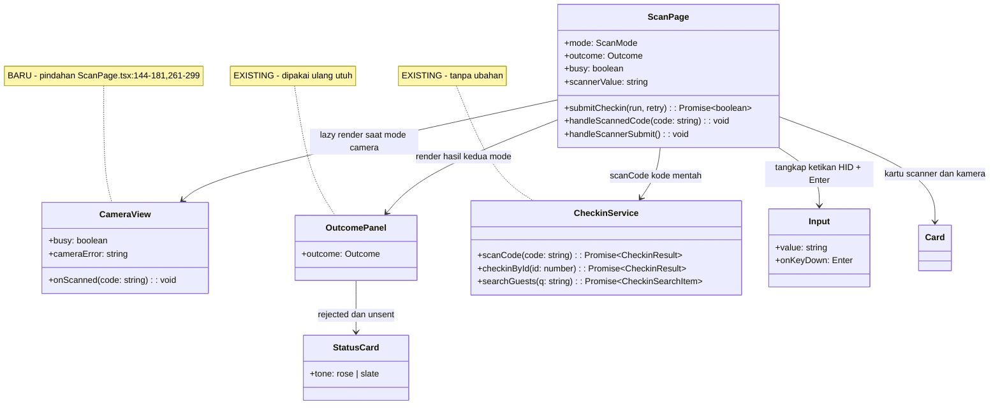
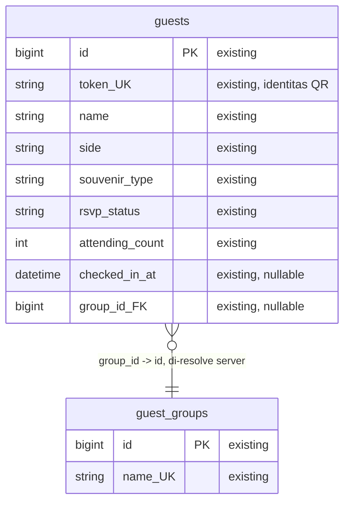
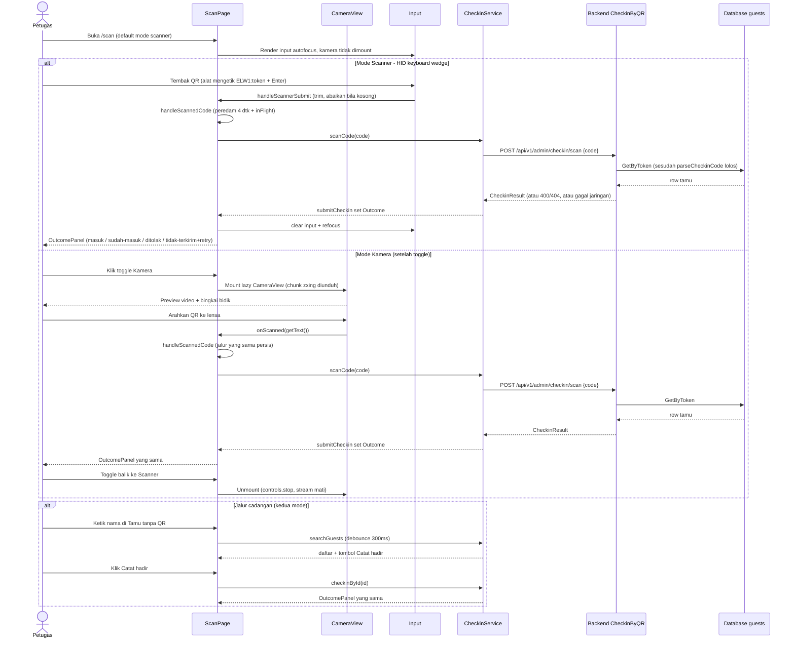

# PLAN.md — Toggle mode Scanner Device vs Kamera di menu Scan

> Handoff implementasi untuk programmer. Ditulis dalam Bahasa Indonesia.
> Intent: **Enhancement** (bukan fitur terpisah, bukan bug fix, bukan greenfield).

## 1. Requirement yang disepakati

Di menu Scan yang ada saat ini (`/scan`), tambah opsi mode input dengan **toggle eksklusif** di dalam halaman yang sama:

1. **Mode Scanner (device eksternal)** — memakai alat scanner genggam seperti cashcow yang terhubung **USB HID keyboard-wedge**: alat bertindak sebagai keyboard yang "mengetik" isi QR lalu diakhiri **Enter**. Ini menjadi **mode default** setiap kali halaman dibuka.
2. **Mode Kamera (seperti saat ini)** — memakai kamera perangkat via `@zxing/browser` persis seperti perilaku sekarang. Aktif hanya bila toggle dipindah ke Kamera.

**Perilaku eksklusif yang dikunci:** dalam satu waktu hanya satu mode yang aktif. Mode Kamera = stream kamera jalan, input scanner tidak ada. Mode Scanner = kamera **di-unmount total** (stream berhenti, tidak boros baterai), input scanner yang aktif. Panel **"Tamu tanpa QR" (pencarian nama) tetap tampil di kedua mode** sebagai jalur cadangan yang tidak berubah.

**Alur hasil tidak berubah:** kedua mode masuk ke jalur pengiriman yang sama (`scanCode` → `POST /api/v1/admin/checkin/scan`), sehingga kartu hasil, peredam pindaian berulang, dan pembedaan empat keadaan (berhasil / sudah check-in / ditolak / tidak terkirim) berlaku identik.

## 2. Keputusan terkunci (tidak boleh diubah sepihak saat implementasi)

### 2.1 Dari penajaman kebutuhan (Step 0) — dijawab user

| ID | Pertanyaan | Jawaban user (verbatim yang dilock) |
|----|-----------|-------------------------------------|
| K0 | Enhancement vs fitur terpisah | Toggle **di dalam menu scanner saat ini**: toggle kamera atau scanner; kamera = memakai kamera, scanner = memakai device seperti cashcow |
| K1 | Jenis scanner | **USB HID keyboard-wedge** (mengetik kode + Enter, tanpa driver/SDK) |
| K2 | Default | **Default-nya scanner**, bisa switch via toggle ke kamera |
| K3 | Eksklusivitas | **Eksklusif**: bila kamera maka kamera saja yang aktif; bila scanner maka scanner device saja yang aktif |

### 2.2 Dari konfirmasi desain (Step 4) — dijawab user

| ID | Pertanyaan | Jawaban user |
|----|-----------|--------------|
| D1 | Bentuk toggle | **Segmented control dua tombol (Scanner \| Kamera)**. Alasan yang diterima user: `Switch.tsx` yang sudah ada semantiknya status on/off, bukan pilihan mode |
| D2 | Pisah chunk kamera | **Ya, pecah `CameraView` jadi lazy import sendiri** agar mode Scanner (default) tidak ikut mengunduh `~465 kB` `@zxing/browser` |
| D3 | Beep audio / getar | **Tidak** — visual saja (kartu hasil), tanpa WebAudio/vibrate. Keputusan sadar untuk menjaga perubahan minimal |
| D4 | Ingat mode terakhir | **Tidak** — setiap buka halaman selalu default Scanner. Tanpa `localStorage`, tanpa state persisten |

### 2.3 Konsekuensi reuse/extend/create-new dari trace (Step 3 + Step 5)

- **Reuse (tanpa ubahan):** `checkin.service.ts` (`scanCode`, `checkinById`, `searchGuests`), `OutcomePanel` + `StatusCard`, `PageHeader`, `Input`/`Button`/`Card`, `SIDE_LABEL`/`SOUVENIR_TYPE_LABEL`/`STATUS_LABEL`, seluruh backend (`CheckinByQR` → `CheckinByCode` → `parseCheckinCode`), seluruh skema DB.
- **Extend:** `ScanPage.tsx` — tambah state mode + segmented toggle + input scanner inline + render kondisional; hapus import top-level `@zxing/browser` dari file ini.
- **Create new (satu file, dengan bukti gap):** `CameraView.tsx` — grep seluruh `modules/admin/scan` memastikan **tidak ada** komponen kamera terpisah, tidak ada listener `keydown`/`Enter`/`autoFocus`, dan tidak ada mekanisme `localStorage` mode. Kode kamera yang hari ini menempel di `ScanPage.tsx:144-181,261-299` **dipindah** ke file ini supaya bisa di-`lazy`-kan. "Baru" di sini = pindahan + pembungkus, bukan logika baru.

## 3. Temuan trace (fakta, bukan asumsi)

Stack: `apps/web` React 18.3.1 + Vite dua entry (`admin.html` untuk dashboard), Tailwind 4, Zustand, Axios satu instance; backend Go modular monolith (`net/http` ServeMux). Aturan rumah relevan: halaman Scan butuh HTTPS untuk kamera, stream wajib dihentikan saat unmount, empat keadaan wajib terlihat berbeda, pindaian berulang diredam.

- Entry frontend: rute `/scan` (`app/routes/route-paths.ts:21`), didaftarkan lazy di `modules/admin/app/AdminApp.tsx:27,62-68`, termasuk `SCANNER_ALLOWED_PATHS` (`route-paths.ts:32`) sehingga peran `scanner` boleh membukanya. HEADLINE: halaman ini **satu-satunya rute lazy** karena pustaka kamera.
- Alur kamera saat ini: `ScanPage.tsx:148-181` (`BrowserQRCodeReader.decodeFromConstraints` dengan `facingMode: 'environment'`) → callback `result.getText()` → `handleScannedCode` (`ScanPage.tsx:121-140`, diredam `REPEAT_SCAN_QUIET_MS = 4000` + `inFlightRef`) → `submitCheckin` (`ScanPage.tsx:99-119`) → `scanCode` (`scan/services/checkin.service.ts:50-53`, `POST /api/v1/admin/checkin/scan`) → `OutcomePanel` (`ScanPage.tsx:381-394` idle, `:396-423` rejected/unsent, `:425-517` admitted/already).
- Panel pencarian nama (`ScanPage.tsx:183-249`, debounce `SEARCH_DEBOUNCE_MS = 300`, `searchGuests`, `checkinById`) independen dari kamera dan **tidak disentuh**.
- Backend: `router.go:191` → `Handler.CheckinByQR` (`presentation/handler.go:166-179`) → `Service.CheckinByCode` (`application/service.go:758-771`) → `parseCheckinCode` (`service.go:666-672`: `TrimSpace` + wajib prefiks `ELW1:` + tolak sisa kosong) → `repo.GetByToken` → `markAndBuildResult`. TrimSpace inilah yang membuat string dari scanner HID (yang diakhiri Enter/newline) **lolos tanpa ubahan backend**.
- Data source: **tanpa perubahan** — tabel `guests` (kolom `token` UNIQUE sebagai identitas, `checked_in_at` penanda) dan `guest_groups` (nama di-resolve server) sudah memadai. Tidak ada kolom/tabel/query baru.
- UI kit: `shared/components/ui/index.ts:1,2,8` mengekspor `Button`, `Input`, `Card` (dipakai ulang); `Switch.tsx:1-14` **sengaja tidak dipakai** (semantik on/off status, bukan pilihan dua mode — sesuai D1).

## 4. Scope

### In scope

1. `ScanPage.tsx` — tambah `type ScanMode = 'scanner' | 'camera'`, `useState<ScanMode>('scanner')`, segmented toggle, input scanner inline (lihat §6.1), render kondisional kamera vs scanner. Import `@zxing/browser` **dihapus** dari file ini.
2. `scan/pages/CameraView.tsx` — **baru** (pindahan kode kamera + lazy boundary). Props: `{ onScanned: (code: string) => void; busy: boolean }`.
3. `ScanPage.test.tsx` — perbarui helper + tambah test mode scanner (lihat §8). Test lama yang mengasumsikan kamera langsung aktif wajib diperbarui (sekarang harus toggle ke Kamera dulu).

### Out of scope (keputusan, bukan kelalaian)

- **Backend & DB: nol perubahan.** Alasannya satu baris per item: endpoint `POST /checkin/scan` menerima string mentah apa pun dan `parseCheckinCode` sudah men-trim newline dari suffix Enter scanner; skema `guests`/`guest_groups` sudah membawa semua data yang ditampilkan kartu hasil.
- **`checkin.service.ts`: tanpa ubahan.** Bentuk request/response tidak berubah; menambah parameter hanya menambah permukaan tanpa pembeli.
- **Rute, peran, `SCANNER_ALLOWED_PATHS`, `ProtectedRoute`, `AdminLayout`: tanpa ubahan.** Ini mode di dalam `/scan`, bukan rute baru; peran `scanner` tetap boleh membuka halaman yang sama.
- **Tanpa WebHID/WebUSB/Serial/SDK scanner, tanpa dependensi baru.** HID keyboard-wedge tidak butuh itu; menambahnya melanggar kriteria "mekanisme paling sederhana" dan menaikkan biaya operasional (izin perangkat, driver, browser support).
- **Tanpa beep/getar (D3), tanpa ingat mode (D4), tanpa paginasi/riwayat pindaian, tanpa undo check-in.** Masing-masing pernah dipertimbangkan dan **ditolak user atau di luar permintaan**; undo check-in memang sudah dinyatakan out-of-scope sejak `scan-checkin-gate`.
- **Panel pencarian nama & halaman Arrivals: tanpa ubahan perilaku.**

## 5. Inventaris reuse (semua sudah dibaca sesi ini)

| Aset | Lokasi | Dipakai untuk |
|------|--------|---------------|
| `submitCheckin` + `handleScannedCode` (peredam 4 dtk + `inFlightRef` + retry `unsent`) | `ScanPage.tsx:99-140` | Jalur kirim **tunggal** untuk kedua mode; input scanner memanggil `handleScannedCode` yang sama |
| `scanCode` | `checkin.service.ts:50-53` | Satu-satunya panggilan API baru-mode; tanpa wrapper baru |
| `OutcomePanel` + `StatusCard` (4 keadaan + warna netral untuk `unsent`) | `ScanPage.tsx:381-563` | Render hasil identik di kedua mode; tidak diduplikasi |
| `Input` (forwardRef, `id` otomatis) | `shared/components/ui/Input.tsx:11` + `index.ts:2` | Kolom tangkap scanner HID |
| `Button`, `Card`, `PageHeader` | `index.ts:1,8`, `ScanPage.tsx:19-20` | Tombol toggle-sendiri, kartu scanner, header halaman |
| Label `SIDE/SOUVENIR/STATUS` | `shared/constants/guests` via `ScanPage.tsx:11-18` | Tidak ada label baru |
| `parseCheckinCode` (trim + prefiks `ELW1:`) | `application/service.go:642,666-672` | Menerima ketikan scanner tanpa perubahan |
| Pola mock `@zxing/browser` + mock service + `axiosError` + `guest()` | `ScanPage.test.tsx:20-81` | Diperluas untuk test toggle, bukan ditulis ulang |

## 6. File yang disentuh + perubahan per lapis

### 6.1 `apps/web/src/modules/admin/scan/pages/ScanPage.tsx` — EXTEND

- Hapus import `BrowserQRCodeReader`/`IScannerControls` top-level (pindah ke `CameraView.tsx`). Ini syarat chunk-split D2.
- Tambah di atas komponen: `type ScanMode = 'scanner' | 'camera'` dan `const CameraView = lazy(() => import('./CameraView'))`.
- State baru (selain `outcome/busy/search/...` yang ada): `const [mode, setMode] = useState<ScanMode>('scanner')` — literal `'scanner'` adalah implementasi K2+D4. `const [scannerValue, setScannerValue] = useState('')`, `const scannerRef = useRef<HTMLInputElement>(null)`.
- `handleScannedCode` dan `submitCheckin` **tidak diubah** — keduanya sudah mode-agnostik (menerima string kode).
- Handler baru `handleScannerSubmit`: trim `scannerValue`; kosong → abaikan (tanpa API call); tidak kosong → `handleScannedCode(trimmed)`; **langsung** `setScannerValue('')` (aman karena kode sudah disalin ke variabel dan peredam memakai salinannya, bukan state input); lalu `scannerRef.current?.focus()` untuk mengembalikan fokus. `onKeyDown` pada `Input`: bila `e.key === 'Enter'` → `preventDefault` + `handleScannerSubmit`. Tombol "Catat" di samping input memanggil handler yang sama (untuk klik manual / bila suffix scanner salah konfigurasi).
- Fokus: `autoFocus` pada `Input` + `useEffect` fokus saat `mode` berubah ke `'scanner'` + `onClick` pada kartu scanner me-refocus input. **Sengaja tanpa** listener `blur` global yang menarik fokus paksa — itu akan merampas fokus dari kolom pencarian "Tamu tanpa QR" dan tombol-tombol hasil. Ini keputusan desain, bukan kelalaian.
- Segmented toggle di atas grid (di bawah `PageHeader`, di atas konten mode): container `role="group" aria-label="Mode pemindai"`, dua `button type="button" aria-pressed={mode === ...}` berlabel "Scanner" dan "Kamera". Pindah mode tidak me-reset `outcome` (hasil terakhir tetap terlihat — konsisten dengan perilaku pencarian manual hari ini yang tidak menghapus kartu hasil).
- Render kondisional di posisi kartu kamera lama (`ScanPage.tsx:261-299`): bila `mode === 'camera'` → `<Suspense fallback={...}><CameraView onScanned={handleScannedCode} busy={busy} /></Suspense>`; bila `'scanner'` → kartu scanner (Input + hint + tombol). `OutcomePanel` dan panel pencarian **di luar** kondisional — selalu tampil.
- Aturan suffix scanner (bukan kode, tapi syarat setup yang wajib tertulis di hint UI + §10): alat dikonfigurasi **suffix Enter** (bawaan pabrik kebanyakan scanner). Suffix lain (Tab/None) tidak ditangani — menambahnya adalah generalisasi yang tidak diminta.

### 6.2 `apps/web/src/modules/admin/scan/pages/CameraView.tsx` — CREATE (pindahan + boundary lazy)

- Isi = pindahan verbatim yang disesuaikan props dari `ScanPage.tsx:86-94` (`videoRef`, `controlsRef`, `lastScanRef` tetap di ScanPage? — keputusan: `lastScanRef`/`inFlightRef` **tetap di ScanPage** karena `handleScannedCode` pemiliknya di sana; `CameraView` hanya memanggil `onScanned(result.getText())`), efek `useEffect` decode (`ScanPage.tsx:144-181`), dan markup viewport (`:261-299`) termasuk bingkai bidik, `cameraError`, indikator "Siap/Memproses/Berhenti".
- Props: `{ onScanned: (code: string) => void; busy: boolean }`. `cameraError` state internal. Cleanup `controls.stop()` saat unmount **dipertahankan** — inilah yang menjamin eksklusivitas K3 saat toggle pindah ke Scanner (komponen unmount → stream mati; test §8 memverifikasinya via `stopSpy`).
- Tidak ada import service di file ini — ia buta terhadap API (hanya meneruskan string), sehingga chunk kamera hanya berisi `zxing` + markup.

### 6.3 Lapis lain — tanpa sentuhan

- `checkin.service.ts`, backend Go, migrasi/SQL, rute, auth/peran: **tidak ada diff**. ERD §9.2 menandai semuanya `existing`.

## 7. Task list (berurutan — kerjakan dari atas ke bawah)

- [ ] **T1 — Buat `CameraView.tsx`** dari pindahan `ScanPage.tsx:144-181,261-299` dengan props `{ onScanned, busy }`; pastikan tidak ada import service/API di file ini; pastikan cleanup `controls.stop()` dipertahankan.
- [ ] **T2 — Extend `ScanPage.tsx`: state mode + toggle.** Tambah `ScanMode`, `useState('scanner')`, segmented control (`role="group"`, `aria-pressed`), hapus import `@zxing/browser` top-level, tambah `lazy(() => import('./CameraView'))`. Verifikasi: default render = input scanner, tidak ada elemen `video`.
- [ ] **T3 — Extend `ScanPage.tsx`: input scanner.** Tambah `scannerValue` + `scannerRef` + `handleScannerSubmit` (trim → abaikan-bila-kosong → `handleScannedCode` → clear → refocus) + `onKeyDown` Enter + tombol "Catat" + `autoFocus`/refocus-on-mode-change/click-card. Verifikasi: Enter dengan input kosong tidak memanggil `scanCode`.
- [ ] **T4 — Sambungkan render kondisional.** `mode === 'camera'` → `Suspense + CameraView`; `'scanner'` → kartu scanner; `OutcomePanel` + panel pencarian di luar kondisional. Verifikasi: pindah Scanner→Kamera→Scanner memanggil `stop` kamera (stream mati).
- [ ] **T5 — Perbarui + tambah test `ScanPage.test.tsx`.** Perbaiki helper lama (klik toggle "Kamera" sebelum menunggu `emitScan`), lalu tambah test §8. Jalankan `npm run test --workspace apps/web` hingga hijau.
- [ ] **T6 — Typecheck + build + verifikasi chunk.** `npm run typecheck -w apps/web`, lalu `npm run build:web` dari root; pastikan ada chunk `CameraView-*.js` (membawa zxing) terpisah dari `ScanPage-*.js`, dan chunk ScanPage tidak lagi memuat `@zxing/browser`.
- [ ] **T7 — Uji manual dua mode + setup alat.** Konfigurasi scanner fisik suffix **Enter**; uji di §10 (termasuk unmount mematikan kamera dan pencarian nama di kedua mode).

Urutan ini load-bearing: T2 bergantung pada T1 (yang di-`lazy` harus ada dulu), T4 pada T2+T3, T5 pada T2-T4 (test menulis perilaku yang baru ada), T6-T7 terakhir.

## 8. Test yang ditulis (di `ScanPage.test.tsx`, memakai pola mock yang ada)

Asumsi mock `@zxing/browser` + `scanCode/checkinById/searchGuests` dipertahankan (`ScanPage.test.tsx:20-47`). Karena default kini Scanner, SEMUA test lama yang mengasumsikan kamera langsung aktif wajib menekan toggle "Kamera" dulu sebelum menunggu `emitScan` — yaitu: helper `renderAndWaitForScanner` (render → klik "Kamera" → tunggu `emitScan`), keempat test keadaan via helper tersebut, test `kamera gagal dibuka` (`ScanPage.test.tsx:180-191`, render → klik "Kamera" → baru assert "Kamera tidak aktif"), dan test `unmount menghentikan stream kamera` (`ScanPage.test.tsx:195-202`, render → klik "Kamera" → tunggu `emitScan` → unmount → assert `stopSpy`). Tanpa ini ketiganya merah bukan karena regresi, melainkan karena default mode berubah.

Test baru/tambahan:

1. **Default = mode Scanner, kamera tidak dimuat.** Render → input ber-label/placeholder scanner ada; `video`/`emitScan` tidak ada; `decodeFromConstraints` tidak terpanggil.
2. **Enter valid → `scanCode` + kartu + clear + fokus kembali.** Mock `scanCode` resolve `guest()`; isi input `ELW1:tok-abc` + `fireEvent.keyDown(input, { key: 'Enter' })` → `scanCode` terpanggil dengan `'ELW1:tok-abc'`, "Silakan masuk" tampil, input kosong kembali, `document.activeElement === input`. Varian tombol: isi input lalu `fireEvent.click` tombol "Catat" → `scanCode` terpanggil dengan nilai yang sama (satu handler, dua pemicu).
3. **Enter kosong/spasi → diabaikan.** Isi `'   '` + Enter → `scanCode` **tidak** terpanggil, outcome tetap idle.
4. **Toggle ke Kamera me-mount kamera; toggle balik meng-unmount.** Klik "Kamera" → `emitScan` tersedia + `video` ada; `emitScan('ELW1:x')` → hasil tampil (jalur sama). Klik "Scanner" → `stopSpy` terpanggil (stream mati), `video` hilang, input scanner kembali fokus.
5. **Pencarian nama jalan di kedua mode.** Di mode Scanner dan (setelah toggle) mode Kamera: ketik nama → `searchGuests` terpanggil → "Catat hadir" → `checkinById` → kartu hasil tampil.
6. **Pindaian scanner ganda cepat diredam (reuse peredam).** Via input scanner kirim kode identik dua kali berurutan → `scanCode` terpanggil sekali (mencerminkan `REPEAT_SCAN_QUIET_MS` + `inFlightRef` yang dipakai ulang).
7. **Kasus `unsent` dari mode scanner tetap menawarkan retry.** Mock `scanCode` reject tanpa `response` → "Tamu belum tercatat" + tombol "Coba lagi" berfungsi (memanggil `scanCode` lagi dengan kode yang sama).

## 9. Diagram (Mermaid inline — nama identik dengan prose + task list)

### 9.1 Class diagram — kelas yang terlibat (existing vs baru)

### 9.2 ERD — sisi data (sengaja tanpa elemen baru)

Tidak ada tabel/kolom/relasi baru — perubahan ini murni input-mode di frontend; penegasan ini adalah keputusan (§3), bukan bagian yang terlewat.

### 9.3 Sequence diagram — end to end per mode (hop per hop sesuai trace)

## 10. Setup hardware + catatan operasional (bukan kode, tapi syarat tujuan terpenuhi)

- Scanner dikonfigurasi: mode **USB HID keyboard wedge** (biasanya default pabrik), **suffix Enter** (terminator), bahasa keyboard **US/Latin** agar `:` pada `ELW1:` tidak berubah karakter. Tidak ada driver/pairing aplikasi — cukup colok (atau USB-OTG di HP) lalu fokus ke kolom scanner.
- Keuntungan operasional mode Scanner yang tercatat sebagai keputusan: **tidak butuh HTTPS/izin kamera** (kameralah yang butuh secure context, bukan input keyboard), tidak menguras baterai untuk stream, dan fokus petugas bisa ke tamu — inilah "optimal" yang diminta: throughput gate naik tanpa biaya operasional baru.
- Volume data: satu pindaian = **satu** `POST` (sama seperti kamera hari ini); peredam 4 detik + `inFlightRef` dipakai ulang sehingga tidak ada tembakan beruntun; tidak ada query/koleksi baru, tidak ada N+1, tidak ada payload tak berbatas. Pada volume gate (ratusan tamu, satu scan per tamu) bebannya identik dengan mode kamera — verifikasi ini setara "fine at real volume" dan dicatat di sini, bukan sebagai pertanyaan terbuka.
- Uji manual wajib (T7): (a) tembak QR sah → "Silakan masuk"; (b) tembak ulang dalam 4 detik → tidak ada request kedua; (c) QR asing → "Jangan dicatat"; (d) matikan jaringan → "Tamu belum tercatat" + retry; (e) toggle ke Kamera → preview jalan; toggle balik → indikator kamera mati/stream berhenti (cek ikon kamera OS/lampu); (f) pencarian nama di kedua mode; (g) cabut-colok scanner (fokus kembali ke kolom tanpa reload).

## 11. Kriteria selesai

- Default buka = mode Scanner; toggle eksklusif bekerja dua arah; kamera mati total di mode Scanner (terbukti via test `stopSpy` + uji manual lampu kamera).
- Enter kosong tidak menembak API; Enter valid memakai jalur `handleScannedCode` yang sama (peredam + 4 outcome + retry terbukti di test).
- `npm run test --workspace apps/web` hijau, `npm run typecheck -w apps/web` bersih, `npm run build:web` menghasilkan chunk kamera terpisah dan chunk ScanPage bebas `@zxing/browser`.
- Backend/DB/rute/peran: **nol diff** (diverifikasi via `git status` hanya menyentuh §4-in-scope).
