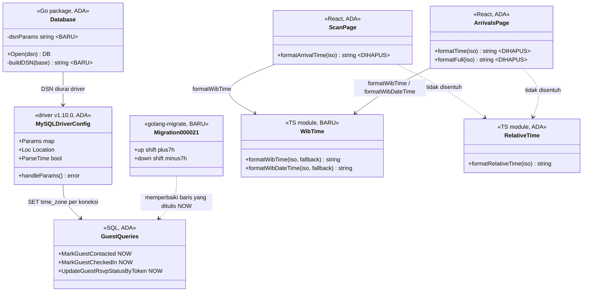
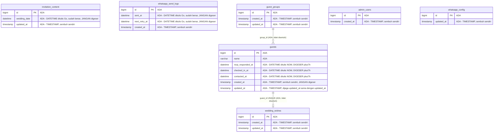
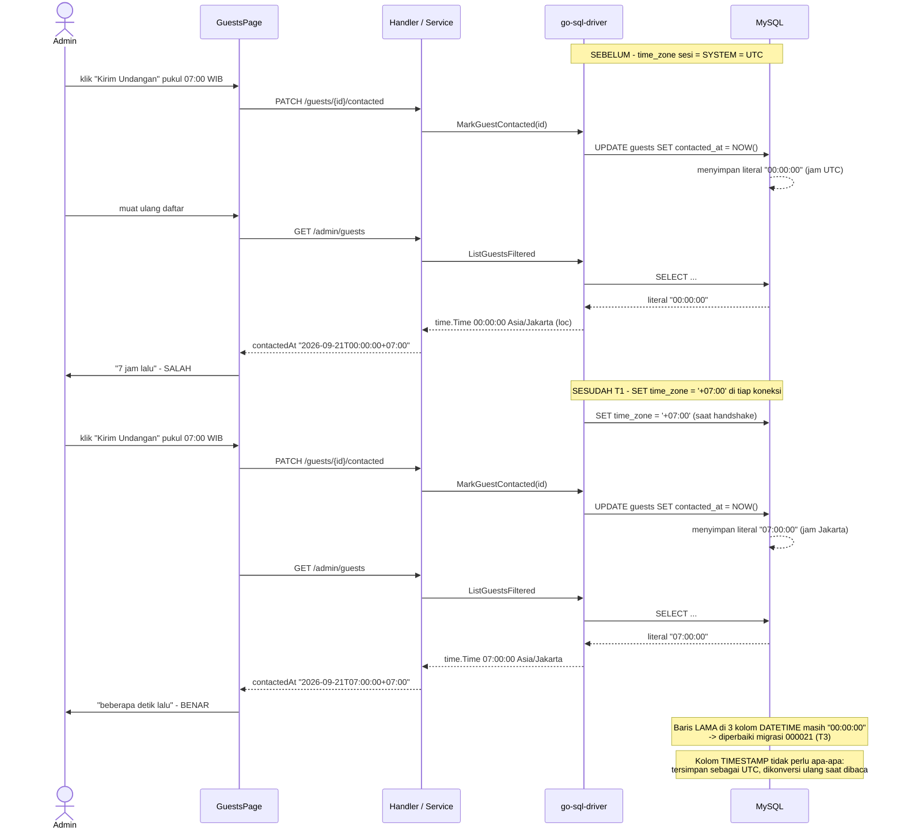
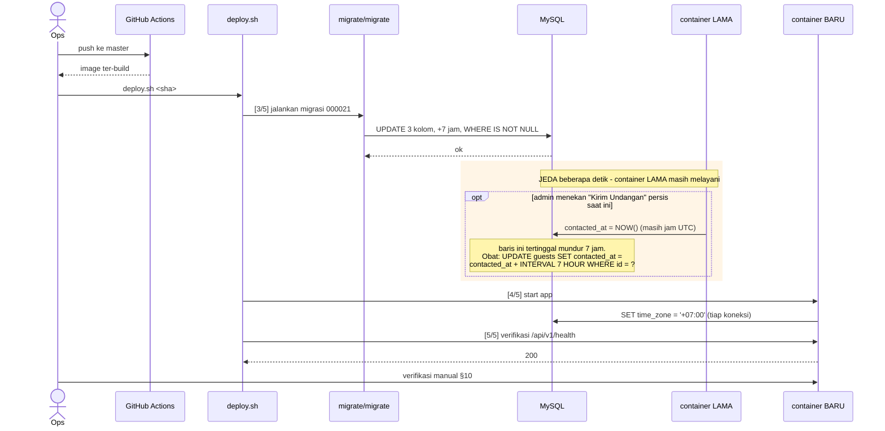

# Waktu aplikasi tidak WIB — mundur 7 jam

Defect triage & rencana perbaikan — `internal/database`, modul `guest` (migrasi data),
`infra/docker`, dan modul `admin/scan` di frontend.

---

## 1. Requirement yang disepakati

Waktu yang ditampilkan aplikasi bukan WIB (Asia/Jakarta). User meminta analisis dan
perbaikan yang menyeluruh.

**Klasifikasi: Bug fix (defect triage), berlanjut ke perbaikan.** Bukan enhancement —
tidak ada kapabilitas baru yang diminta; yang ada adalah perilaku yang menyimpang dari
yang seharusnya.

Atas permintaan user, analisis ini **menyisir seluruh titik waktu** di sistem — admin,
undangan publik, dan sesi login — lalu melaporkan mana yang meleset dan mana yang sudah
benar. Hasil sisiran itu ada di §3.4 dan §3.5.

---

## 2. Keputusan yang dikunci

### 2.1 Keputusan Step 0 — dijawab user

| # | Pertanyaan | Jawaban user |
|---|---|---|
| **D1** | Gejala waktu salah terlihat di mana? | **Semua titik** — jam & aktivitas admin, countdown/tanggal undangan, jam sesi login, dan "belum yakin persisnya". Artinya: sisir seluruh sistem, jangan berhenti di tempat yang saya duga saja. Konsekuensinya §3.5 memuat daftar titik yang **sudah benar** beserta buktinya, bukan hanya yang rusak. |
| **D2** | Data lama yang sudah tersimpan berjam UTC diapakan? | **Perbaiki sekalian (geser +7 jam)**, supaya riwayat konsisten dengan data baru. Trace kemudian mempersempit cakupannya secara drastis — lihat D6. |
| **D3** | Perlu dukung zona selain WIB? | **Selalu WIB, kunci mati.** Asia/Jakarta jadi satu-satunya zona; tidak ada variabel env zona waktu yang bisa salah diisi saat deploy. |

### 2.2 Keputusan Step 4 — dijawab user setelah trace

| # | Pertanyaan | Jawaban user |
|---|---|---|
| **D4** | Jam check-in di Scan & Tamu Masuk ikut zona perangkat (cacat kedua, berdiri sendiri) — ikut diperbaiki? | **Ikut perbaiki, kunci ke WIB.** |
| **D5** | Tambahkan `ENV TZ=Asia/Jakarta` di Dockerfile? | **Ya.** Tidak memperbaiki bug 7 jam, tapi menyamakan bahasa jam antara log container dan data. |
| **D6** | Migrasi geser jalan sebelum container baru hidup; ada jeda detik di mana container lama masih bisa menulis satu baris berjam UTC. | **Terima, catat di PLAN.md.** Lihat §9 untuk gejala dan obatnya. |

### 2.3 Keputusan teknis analis (bukan pilihan user)

| # | Keputusan | Alasan |
|---|---|---|
| **D7** | Zona diperbaiki di **DSN driver** (`time_zone='+07:00'`), bukan di konfigurasi MySQL host | MySQL di `elcodelabs` dipakai bersama `elproof-app` dan `elkasir-app` (knowledge/AI_AGENT_OPERATIONS.md §3). Mengubah `time_zone` server akan menggeser makna waktu dua aplikasi lain yang tidak ada hubungannya. DSN menyetel zona **per koneksi aplikasi ini saja** — blast radius sekecil mungkin, dan sepenuhnya reversible dengan menghapus satu parameter. |
| **D8** | Nilainya **offset tetap `'+07:00'`**, bukan nama zona `'Asia/Jakarta'` | Nama zona hanya dikenali MySQL bila tabel `mysql.time_zone*` sudah di-populate (`mysql_tzinfo_to_sql`), yang pada instalasi default **kosong** — `SET time_zone = 'Asia/Jakarta'` akan gagal dengan `Unknown or incorrect time zone`, dan karena `SET` itu dijalankan saat handshake, **setiap koneksi gagal** dan seluruh aplikasi mati. Indonesia Barat tidak mengenal DST dan tetap UTC+7 sejak 1987, jadi offset tetap tidak kehilangan informasi apa pun. |
| **D9** | Kolom `TIMESTAMP` **tidak** ikut digeser | Lihat §3.3. Menggesernya justru merusak: nilainya akan benar dengan sendirinya begitu zona sesi dibetulkan, sehingga geser +7 jam membuatnya maju 7 jam. Ini pembatasan cakupan yang menyelamatkan, bukan penghematan. |
| **D10** | DSN dirakit di fungsi murni `buildDSN`, terpisah dari `Open` | Satu-satunya cara menguji perbaikan ini tanpa database. Mengikuti konvensi tes repo ini yang menguji fungsi murni (`parseGroupIDFilter`, `parseContactedFilter`). Tesnya memakai `mysql.ParseDSN` milik driver sendiri, sehingga yang diverifikasi adalah hasil parsing driver yang sesungguhnya — bukan pencocokan string. |
| **D11** | Formatter WIB frontend jadi satu helper bersama, bukan tiga tambalan di tempat | Ketiga formatter yang bermasalah adalah duplikat (§3.4). Menambal di tempat memperbaiki tiga salinan dan membiarkan salinan keempat lahir dengan cacat yang sama. Helper bersama di `shared/utils/` mengikuti letak `relative-time.ts` yang sudah ada. |

---

## 3. Hasil trace

### 3.1 Bukti dari produksi (dibaca live saat analisis)

| Fakta | Nilai | Cara memverifikasi ulang |
|---|---|---|
| Zona host VPS | `Etc/UTC (UTC, +0000)` | `ssh elcodelabs "timedatectl"` |
| Zona container `elwedding-app` | `TZ` kosong → UTC | `ssh elcodelabs "docker exec elwedding-app date"` |
| `time_zone` MySQL | tidak diset eksplisit di `/etc/mysql/` → default `SYSTEM` → ikut OS = **UTC** | `ssh elcodelabs "grep -rs time_zone /etc/mysql/"` |

### 3.2 Mekanisme bug

Dua penulis waktu tidak sepakat, dan pembacanya hanya mengenal satu versi.

1. **MySQL menulis jam UTC.** `NOW()` dan `DEFAULT CURRENT_TIMESTAMP` memakai `time_zone`
   sesi, yang = `SYSTEM` = UTC (§3.1).
2. **Driver Go membaca sebagai jam Jakarta.** DSN memuat `loc=Asia%2FJakarta`
   ([db.go:16](../../../apps/api/internal/database/db.go#L16)), sehingga literal DATETIME
   dari MySQL di-parse ke `time.Time` berlokasi Asia/Jakarta.
3. **Serialisasi menempelkan `+07:00`.** Seluruh DTO memformat
   `Format("2006-01-02T15:04:05Z07:00")` — mis.
   [service.go:135](../../../apps/api/internal/modules/guest/application/service.go#L135)
   untuk `contactedAt`.

Akibatnya: instant nyata pukul 07:00 WIB disimpan sebagai literal `00:00:00`, dibaca
sebagai `00:00:00 +07:00`, dan tampil sebagai **pukul 00:00 WIB — mundur 7 jam**.
`formatRelativeTime` akan berbunyi "7 jam lalu" untuk sesuatu yang baru saja terjadi.

Alur baca itu utuh sampai ke layar:
[relative-time.ts:7](../../../apps/web/src/shared/utils/relative-time.ts#L7) mem-parse
string ISO tersebut dengan `new Date(iso)` — offset `+07:00` yang salah itu dipercaya apa
adanya.

### 3.3 Temuan yang paling mengubah bentuk perbaikan: `TIMESTAMP` ≠ `DATETIME`

MySQL memperlakukan kedua tipe ini berbeda secara mendasar, dan itu menentukan baris mana
yang butuh digeser:

| | `TIMESTAMP` | `DATETIME` |
|---|---|---|
| Saat ditulis | dikonversi dari zona sesi ke **UTC** untuk disimpan | disimpan **apa adanya**, tanpa konversi |
| Saat dibaca | dikonversi dari UTC ke zona sesi | dikembalikan apa adanya |
| Yang tersimpan hari ini | instant yang **BENAR** (UTC dari instant nyata) | literal jam **UTC** |
| Setelah zona sesi jadi `+07:00` | dikonversi ke jam Jakarta → **benar dengan sendirinya, termasuk baris lama** | literal tetap jam UTC → **masih salah** |
| Perlu digeser +7 jam? | **TIDAK** — menggesernya membuatnya maju 7 jam | **YA** |

Inilah yang mempersempit D2: migrasi data hanya menyentuh **3 kolom di 1 tabel**, bukan
15 kolom di 6 tabel.

### 3.4 Cacat kedua yang berdiri sendiri — jam Scan ikut zona perangkat

Terpisah dari bug database, tiga formatter di frontend memanggil `Intl.DateTimeFormat`
**tanpa** opsi `timeZone`, sehingga hasilnya mengikuti zona perangkat yang membuka halaman:

- [ScanPage.tsx:67-72](../../../apps/web/src/modules/admin/scan/pages/ScanPage.tsx#L67-L72) — `formatArrivalTime`
- [ArrivalsPage.tsx:47-52](../../../apps/web/src/modules/admin/scan/pages/ArrivalsPage.tsx#L47-L52) — `formatTime`
- [ArrivalsPage.tsx:54-59](../../../apps/web/src/modules/admin/scan/pages/ArrivalsPage.tsx#L54-L59) — `formatFull`

Dua yang pertama **duplikat**, berbeda hanya pada nilai fallback (`''` vs `'-'`).

Ini penting justru karena layarnya: Scan dan Tamu Masuk dipakai petugas gate di hari-H,
sering dari perangkat yang bukan milik admin. Perbaikan backend saja tidak menutup ini.

**Kenapa cacat ini tidak pernah ketahuan tes.**
[ArrivalsPage.test.tsx:83](../../../apps/web/src/modules/admin/scan/pages/ArrivalsPage.test.tsx#L83)
dan [:88](../../../apps/web/src/modules/admin/scan/pages/ArrivalsPage.test.tsx#L88)
sudah meng-assert `'19.30'` dan `'18.05'` dari masukan ber-offset `+07:00`. Keduanya lulus
hari ini **semata-mata karena** zona mesin pengembang kebetulan `Asia/Jakarta`
(diverifikasi: `Intl.DateTimeFormat().resolvedOptions().timeZone`), dan
`.github/workflows/deploy.yml` hanya mem-build image — **tidak menjalankan tes sama
sekali**, sehingga tidak pernah ada mesin UTC yang menjalankannya. Di mesin UTC, dua
asersi itu akan menghasilkan `12.30`/`11.05` dan gagal.

Konsekuensi yang menguntungkan: setelah T5–T7, kedua asersi itu **tetap lulus tanpa
disunting** — karena hasil yang dipatok ke `Asia/Jakarta` identik dengan hasil di mesin
ber-zona WIB. Bedanya, mulai saat itu keduanya benar karena kodenya, bukan karena
kebetulan.

Presedennya sudah ada di repo dan tinggal ditiru:
[SaveTheDate.tsx:11-13](../../../apps/web/src/components/SaveTheDate/SaveTheDate.tsx#L11-L13)
justru sudah menyematkan `timeZone: 'Asia/Jakarta'` secara eksplisit.

### 3.5 Yang sudah BENAR — diverifikasi, bukan diasumsikan (D1)

User menandai countdown dan sesi login sebagai tersangka, jadi keduanya ditelusuri sampai
tuntas, bukan dilewati:

| Titik | Bukti | Status |
|---|---|---|
| **Countdown undangan** | `wedding_date` ditulis Go lewat `ParseInLocation(..., jakarta)` ([service.go:153](../../../apps/api/internal/modules/content/application/service.go#L153)), dikirim sebagai epoch detik ([service.go:63](../../../apps/api/internal/modules/content/application/service.go#L63) → [useLegacyBootstrap.ts:74](../../../apps/web/src/hooks/useLegacyBootstrap.ts#L74)), dan skrip legacy menghitung `new Date(1e3*EVENT).getTime()` dikurangi `new Date().getTime()` — aritmetika instant murni (`apps/web/public/assets/js/fddf2641.js`). | **Benar**, kebal zona |
| **Tanggal acara di undangan & pesan WA** | `idate.FormatLong(wd)` atas `time.Time` berlokasi Jakarta ([service.go:64](../../../apps/api/internal/modules/content/application/service.go#L64)); dipakai placeholder `{tanggal}` ([whatsapp/service.go:799](../../../apps/api/internal/modules/whatsapp/application/service.go#L799)). | **Benar** |
| **Tombol "Add to Calendar"** | Diformat eksplisit di `timeZone: 'Asia/Jakarta'` ([SaveTheDate.tsx:11-13](../../../apps/web/src/components/SaveTheDate/SaveTheDate.tsx#L11-L13)). | **Benar** |
| **Sesi / kedaluwarsa JWT** | `jwt.NewNumericDate(time.Now())` ([jwtutil.go:35-36](../../../apps/api/internal/shared/jwtutil/jwtutil.go#L35-L36)) — epoch, kebal zona. **Tidak akan berubah** oleh perbaikan ini, termasuk oleh `ENV TZ`. | **Benar** |
| **`whatsapp_send_logs.sent_at` / `.next_retry_at`** | Ditulis Go `time.Now()` ([whatsapp/service.go:763](../../../apps/api/internal/modules/whatsapp/application/service.go#L763), [:387](../../../apps/api/internal/modules/whatsapp/application/service.go#L387)); driver mengonversi ke `loc` saat menulis, jadi literalnya sudah jam Jakarta. | **Benar** |
| **`formatRelativeTime`** | Membandingkan dua instant ([relative-time.ts:7-8](../../../apps/web/src/shared/utils/relative-time.ts#L7-L8)); tidak pernah merender jam dinding, jadi kebal zona perangkat. Ia menampilkan hasil salah hari ini **hanya karena** offset masukannya salah (§3.2) — begitu backend benar, ia ikut benar tanpa disentuh. | **Benar**, tidak disentuh |

**Sidik jari bug ini**, yang menjelaskan kenapa gejalanya terasa tidak konsisten: waktu
yang ditulis **Go** benar, waktu yang ditulis **SQL** meleset 7 jam. Tanggal acara terlihat
wajar sementara "Dihubungi 7 jam lalu" terasa aneh — keduanya berasal dari satu tabel yang
sama.

### 3.6 Mengapa `time_zone` di DSN benar-benar bekerja (diverifikasi di sumber driver)

Ini fakta yang menopang seluruh perbaikan, jadi diverifikasi langsung ke sumber
`github.com/go-sql-driver/mysql v1.10.0` di module cache, bukan dari ingatan:

1. Parameter DSN yang tidak dikenal driver disimpan ke `cfg.Params` (`dsn.go:681-688`).
2. Pada **setiap** koneksi baru, `handleParams()` merangkainya jadi
   `SET <param> = <val>` dan mengeksekusinya (`connection.go:106-127`).

Karena dijalankan per koneksi, seluruh pool konsisten — termasuk koneksi yang dibuat ulang
setelah `SetConnMaxLifetime` satu jam ([db.go:22](../../../apps/api/internal/database/db.go#L22)).

**Jebakan encoding yang wajib diperhatikan.** Nilai ditulis **mentah** ke perintah `SET`
(`connection.go:117-119`) — driver tidak menambahkan kutip. Jadi kutipnya harus ikut
di-encode, dan `+` **wajib** ditulis `%2B`: `url.QueryUnescape` menerjemahkan `+` menjadi
spasi, sehingga DSN yang memakai `+` literal menghasilkan `SET time_zone = ' 07:00'` dan
**setiap koneksi gagal**. Bentuk yang benar: `time_zone=%27%2B07%3A00%27` → `'+07:00'`.

### 3.7 Efek samping yang MENGUNTUNGKAN: penyapu pending WhatsApp ikut jadi benar

Ditemukan saat pengecekan ulang setelah implementasi, jadi tidak ada di rencana awal.
Dicatat di sini karena perilaku produksi akan berubah, dan perubahannya harus dipahami
sebelum dianggap regresi.

`ReapStalePendingSendLogs`
([whatsapp.sql:51](../../../apps/api/internal/modules/whatsapp/infrastructure/queries/whatsapp.sql#L51))
adalah **satu-satunya** query di repo ini yang membandingkan kolom `TIMESTAMP` terhadap
parameter waktu:

```sql
WHERE status = 'pending' AND created_at < ?
```

Kedua sisinya selama ini berbeda zona:

- **Parameter** dikirim driver setelah dikonversi ke `cfg.Loc` — terverifikasi di
  `packets.go:1211` (`appendDateTime(b, v.In(mc.cfg.Loc), …)`) — jadi literalnya **jam
  Jakarta**.
- **Kolom** bertipe `TIMESTAMP`, sehingga MySQL mengonversinya dari UTC ke **zona sesi**
  sebelum dibandingkan — sebelum perbaikan ini, itu berarti **jam UTC**.

Akibatnya kondisi `created_at < now - 5 menit` secara efektif menjadi
`created_at < now + 6 jam 55 menit`, sehingga penyapu menyapu **seluruh** baris `pending`
— termasuk yang goroutine-nya sedang benar-benar mengirim. Itu melanggar invarian yang
ditulis eksplisit di [service.go:44-47](../../../apps/api/internal/modules/whatsapp/application/service.go#L44-L47)
("stalePendingAfter > readyWaitTimeout + sendAttemptTimeout"), yang justru ada untuk
mencegah baris yang masih dikerjakan ikut dijadwalkan ulang — risiko pesan WhatsApp ganda.

Setelah zona sesi jadi `+07:00`, kedua sisi berjam Jakarta dan ambang 5 menit
([service.go:70](../../../apps/api/internal/modules/whatsapp/application/service.go#L70))
berlaku sebagaimana dimaksud. **Ini perbaikan, bukan kerusakan** — tapi konsekuensinya
terlihat: setelah rilis, baris yang berpindah ke status `retrying` akan jauh lebih sedikit
dari biasanya. Itu yang benar.

Query waktu lainnya tidak terpengaruh, dan itu sudah disapu tuntas:

| Query | Kenapa aman |
|---|---|
| `ListRetryableSendLogs` — `next_retry_at <= ?` ([whatsapp.sql:36](../../../apps/api/internal/modules/whatsapp/infrastructure/queries/whatsapp.sql#L36)) | `next_retry_at` bertipe `DATETIME` (tanpa konversi zona sesi) dan ditulis dari Go, jadi kedua sisinya sama-sama melewati konversi `loc` driver — konsisten sebelum maupun sesudah. |
| 3 penugasan `NOW()` di `guests.sql` | Penugasan, bukan perbandingan. Justru inilah yang diperbaiki. |
| Seluruh `ORDER BY` kolom waktu | Urutan tidak berubah: konversi zona bersifat monoton, dan migrasi menggeser semua baris dengan besaran yang sama. |

Sapuannya lengkap: `NOW()`/`CURRENT_TIMESTAMP`/`INTERVAL`/`UNIX_TIMESTAMP` hanya muncul di
tiga penugasan tersebut, dan perbandingan kolom `*_at` hanya ada di dua query WhatsApp di
atas.

---

## 4. Scope

### 4.1 In scope

**Backend:**
- `apps/api/internal/database/db.go` — `buildDSN` + parameter `time_zone` ([:16](../../../apps/api/internal/database/db.go#L16))
- `apps/api/internal/database/db_test.go` — **baru**, tes `buildDSN`
- `apps/api/migrations/000021_shift_guest_datetime_to_wib.up.sql` / `.down.sql` — **baru**

**Infra:**
- `infra/docker/Dockerfile` — `ENV TZ=Asia/Jakarta` ([:25](../../../infra/docker/Dockerfile#L25) area)

**Frontend:**
- `apps/web/src/shared/utils/wib-time.ts` — **baru**, formatter WIB bersama
- `apps/web/src/shared/utils/wib-time.test.ts` — **baru**
- `apps/web/src/modules/admin/scan/pages/ScanPage.tsx` — pakai helper ([:67-72](../../../apps/web/src/modules/admin/scan/pages/ScanPage.tsx#L67-L72), [:473](../../../apps/web/src/modules/admin/scan/pages/ScanPage.tsx#L473))
- `apps/web/src/modules/admin/scan/pages/ArrivalsPage.tsx` — pakai helper ([:47-59](../../../apps/web/src/modules/admin/scan/pages/ArrivalsPage.tsx#L47-L59), [:179](../../../apps/web/src/modules/admin/scan/pages/ArrivalsPage.tsx#L179), [:181](../../../apps/web/src/modules/admin/scan/pages/ArrivalsPage.tsx#L181))

### 4.2 Out of scope

| Tidak disentuh | Alasan |
|---|---|
| Konfigurasi `time_zone` MySQL di host | D7 — VPS dipakai bersama dua aplikasi lain. |
| Kolom `TIMESTAMP` — `created_at`/`updated_at` di `guests`, `guest_groups`, `wedding_wishes`, `admin_users`, `invitation_content`, `whatsapp_send_logs`, `whatsapp_config` | D9 / §3.3 — sembuh sendiri; menggesernya justru merusak. |
| `invitation_content.wedding_date`, `whatsapp_send_logs.sent_at`, `whatsapp_send_logs.next_retry_at` | §3.5 — `DATETIME` tapi ditulis Go, jadi sudah berjam Jakarta. Ikut digeser = merusak. |
| `jwtutil`, sesi login | §3.5 — epoch, kebal zona. |
| `formatRelativeTime` & 8 pemanggilnya | §3.5 — ikut benar sendiri begitu offset dari backend benar. Menyentuhnya menambah risiko tanpa menambah perbaikan. |
| Countdown, `SaveTheDate`, template legacy | §3.5 — sudah benar. |
| Variabel env untuk zona waktu | D3 — dikunci WIB, justru supaya tidak ada yang bisa salah diisi. |
| Modul `content`, `auth`, `whatsapp` (kode Go-nya) | Tidak ada jalur waktu di dalamnya yang meleset; perbaikan DSN berlaku untuk seluruh modul sekaligus tanpa menyentuh satu pun. |

### 4.3 Inventaris reuse (terverifikasi dengan membaca kode)

| Yang dipakai ulang | Lokasi | Untuk apa |
|---|---|---|
| Perakitan DSN + `loc=Asia%2FJakarta` | [db.go:16](../../../apps/api/internal/database/db.go#L16) | Diperluas satu parameter; `loc` yang sudah ada **tetap** dan justru jadi pasangan yang konsisten dengan `time_zone` |
| Mekanisme `Params` → `SET` milik driver | `dsn.go:681-688`, `connection.go:106-127` (module cache v1.10.0) | Jalan masuk `time_zone` tanpa menulis kode koneksi sendiri |
| `mysql.ParseDSN` | paket driver yang sudah jadi dependensi | Menguji `buildDSN` dengan parser driver yang sebenarnya |
| Preseden `timeZone: 'Asia/Jakarta'` | [SaveTheDate.tsx:11-13](../../../apps/web/src/components/SaveTheDate/SaveTheDate.tsx#L11-L13) | Bentuk baku formatter WIB di repo ini |
| Letak & konvensi `shared/utils/` | [relative-time.ts](../../../apps/web/src/shared/utils/relative-time.ts) | Rumah untuk `wib-time.ts` |
| Konvensi tes ko-lokasi `*.test.ts` | `shared/lib/api-error.test.ts`, `waInvite.test.ts` | Letak `wib-time.test.ts` |
| Penomoran golang-migrate | `apps/api/migrations/` (terakhir `000020`) | Migrasi berikutnya `000021` |
| `tzdata` di image | [Dockerfile:25](../../../infra/docker/Dockerfile#L25) | `ENV TZ` butuh `/usr/share/zoneinfo`, dan paketnya **sudah** terpasang — D5 jadi benar-benar satu baris |

**Yang benar-benar baru:** satu parameter DSN, satu migrasi data, satu baris `ENV`, satu
helper frontend. Tidak ada endpoint baru, tidak ada tabel baru, tidak ada kolom baru.

---

## 5. Perubahan per lapisan

### 5.1 `internal/database/db.go` — inti perbaikan

```go
// dsnParams dipisah jadi konstanta + fungsi murni supaya bisa diuji tanpa
// database (db_test.go).
//
// time_zone='+07:00' (D7/D8) adalah INTI perbaikan bug mundur 7 jam: tanpa
// ini, NOW() dan CURRENT_TIMESTAMP memakai zona server MySQL (UTC di
// elcodelabs) sementara loc=Asia/Jakarta di bawah membaca hasilnya seolah
// sudah jam Jakarta.
//
// Ditulis %2B, BUKAN '+': url.QueryUnescape menerjemahkan '+' jadi SPASI,
// sehingga DSN dengan '+' literal menghasilkan `SET time_zone = ' 07:00'`
// dan SETIAP koneksi gagal saat handshake.
//
// Offset tetap, bukan 'Asia/Jakarta': nama zona hanya dikenali MySQL bila
// tabel mysql.time_zone* sudah di-populate (mysql_tzinfo_to_sql), yang pada
// instalasi default kosong. WIB tidak mengenal DST, jadi tidak ada informasi
// yang hilang.
const dsnParams = "?parseTime=true&loc=Asia%2FJakarta&time_zone=%27%2B07%3A00%27"

func buildDSN(base string) string { return base + dsnParams }
```

`Open` memanggil `sql.Open("mysql", buildDSN(dsn))`. Selebihnya tidak berubah.

### 5.2 Migrasi `000021_shift_guest_datetime_to_wib`

Tiga kolom, satu tabel. `up`:

```sql
UPDATE guests SET rsvp_responded_at = rsvp_responded_at + INTERVAL 7 HOUR,
                  updated_at = updated_at
 WHERE rsvp_responded_at IS NOT NULL;
UPDATE guests SET checked_in_at = checked_in_at + INTERVAL 7 HOUR,
                  updated_at = updated_at
 WHERE checked_in_at IS NOT NULL;
UPDATE guests SET contacted_at = contacted_at + INTERVAL 7 HOUR,
                  updated_at = updated_at
 WHERE contacted_at IS NOT NULL;
```

`down` sama persis dengan `- INTERVAL 7 HOUR`.

Tiga hal yang membuat bentuk ini benar:

- **`updated_at = updated_at` wajib ada.** `guests.updated_at` ber-`ON UPDATE
  CURRENT_TIMESTAMP` ([migration 000002:14](../../../apps/api/migrations/000002_create_guest_tables.up.sql));
  tanpa penugasan eksplisit, migrasi ini menandai **seluruh** baris tamu seolah baru saja
  disunting. Menugaskannya ke nilainya sendiri menekan pemicu itu.
- **`WHERE ... IS NOT NULL` wajib ada.** Bukan sekadar hemat: tanpa itu, setiap baris
  tersentuh dan efek samping `updated_at` di atas jadi menyeluruh.
- **Aritmetika interval, bukan `CONVERT_TZ`.** `CONVERT_TZ` dengan nama zona butuh tabel
  `mysql.time_zone*` yang sama kosongnya dengan D8 dan akan mengembalikan `NULL` diam-diam
  — menghapus data, bukan menggesernya. Penjumlahan interval tidak bergantung pada zona
  sesi maupun tabel apa pun, jadi hasilnya sama baik dijalankan `migrate/migrate` (UTC)
  maupun dari klien lain.

**Aman digeser karena penulisnya tunggal.** Ketiga kolom hanya pernah diisi `NOW()`, oleh
tepat tiga query — `UpdateGuestRsvpStatusByToken`
([guests.sql:22](../../../apps/api/internal/modules/guest/infrastructure/queries/guests.sql#L22)),
`MarkGuestContacted`
([:55](../../../apps/api/internal/modules/guest/infrastructure/queries/guests.sql#L55)),
dan `MarkGuestCheckedIn`
([:193](../../../apps/api/internal/modules/guest/infrastructure/queries/guests.sql#L193)).
Penulis lainnya hanya menyetel `NULL` — `ResetGuestRsvpByID`
([:43](../../../apps/api/internal/modules/guest/infrastructure/queries/guests.sql#L43))
dan `UnmarkGuestContacted`
([:58](../../../apps/api/internal/modules/guest/infrastructure/queries/guests.sql#L58)) —
dan tidak ada satu pun jalur Go yang menulisnya. Tidak ada baris yang sudah benar yang
ikut tergeser.

### 5.3 `infra/docker/Dockerfile`

`ENV TZ=Asia/Jakarta` ditambahkan di sebelah `ENV APP_PORT`. `tzdata` sudah terpasang
([Dockerfile:25](../../../infra/docker/Dockerfile#L25)) untuk keperluan `loc`, jadi tidak
ada paket baru.

**Nol dampak ke isi database** — itu yang membuatnya aman: nilai yang ditulis Go tetap
dikonversi driver ke `loc=Asia/Jakarta` sebelum dikirim, apa pun `time.Local` container.
Yang berubah hanya jam pada log container dan `time.Now().Format(time.RFC3339)` di
[auth/service.go:164](../../../apps/api/internal/modules/auth/application/service.go#L164)
— yang berubah **label offsetnya** dari `Z` ke `+07:00`, sementara instant-nya identik,
sehingga tampilan di browser tidak bergeser sedikit pun.

### 5.4 `shared/utils/wib-time.ts` (baru)

```ts
const WIB = 'Asia/Jakarta'
const timeFmt = new Intl.DateTimeFormat('id-ID', { timeZone: WIB, hour: '2-digit', minute: '2-digit' })
const dateTimeFmt = new Intl.DateTimeFormat('id-ID', { timeZone: WIB, dateStyle: 'full', timeStyle: 'short' })

export function formatWibTime(iso: string, fallback = ''): string { /* guard + timeFmt */ }
export function formatWibDateTime(iso: string, fallback = ''): string { /* guard + dateTimeFmt */ }
```

Keduanya mempertahankan penjagaan yang sudah ada di ketiga formatter lama: string kosong
dan `Number.isNaN(d.getTime())` mengembalikan `fallback`. Parameter `fallback` ada justru
karena pemanggilnya memang berbeda (`''` di ScanPage, `'-'` di ArrivalsPage) — itu satu-
satunya perbedaan nyata di antara ketiganya.

### 5.5 `ScanPage.tsx` & `ArrivalsPage.tsx`

Tiga fungsi lokal dihapus, diganti impor dari `@/shared/utils/wib-time`:

| Lama | Baru |
|---|---|
| `formatArrivalTime(iso)` ([ScanPage.tsx:473](../../../apps/web/src/modules/admin/scan/pages/ScanPage.tsx#L473)) | `formatWibTime(iso)` |
| `formatTime(iso)` ([ArrivalsPage.tsx:181](../../../apps/web/src/modules/admin/scan/pages/ArrivalsPage.tsx#L181)) | `formatWibTime(iso, '-')` |
| `formatFull(iso)` ([ArrivalsPage.tsx:179](../../../apps/web/src/modules/admin/scan/pages/ArrivalsPage.tsx#L179)) | `formatWibDateTime(iso)` |

Komentar penjelas di [ArrivalsPage.tsx:45-46](../../../apps/web/src/modules/admin/scan/pages/ArrivalsPage.tsx#L45-L46)
("Jam masuk saja - acaranya satu hari") dipindahkan ke titik pemanggilan supaya alasannya
tidak hilang.

---

## 6. Task list

Berurutan. T1–T4 backend & infra, T5–T7 frontend, T8–T9 tes, T10 verifikasi pasca-deploy.

- [x] **T1 — DSN.** Di `apps/api/internal/database/db.go`, ekstrak konstanta `dsnParams`
      dan fungsi `buildDSN` (§5.1), lalu panggil `sql.Open("mysql", buildDSN(dsn))`.
      Salin komentar §5.1 apa adanya — terutama alasan `%2B` dan alasan offset tetap;
      keduanya adalah jebakan yang akan mematikan seluruh aplikasi kalau seseorang
      "merapikan"-nya nanti.
- [x] **T2 — Tes DSN.** Buat `apps/api/internal/database/db_test.go` (§7.1). **Kerjakan
      sebelum migrasi**, dan alasannya spesifik: kalau parameternya salah tulis (`+`
      literal, atau nama parameter keliru) maka `SET time_zone` tidak pernah berlaku
      sementara migrasi T3 tetap menggeser data. Hasilnya kekacauan TERBALIK — baris lama
      jadi benar, baris baru mundur 7 jam — yang jauh lebih membingungkan didiagnosis
      daripada bug aslinya, karena kedua era data terlihat sama-sama masuk akal.
- [x] **T3 — Migrasi geser.** Buat `000021_shift_guest_datetime_to_wib.up.sql` dan
      `.down.sql` (§5.2). Wajib ada pada ketiga UPDATE: `updated_at = updated_at` dan
      `WHERE <kolom> IS NOT NULL`. **Jangan** menyentuh kolom `TIMESTAMP` mana pun (D9),
      dan **jangan** menyentuh `wedding_date`/`sent_at`/`next_retry_at` (§3.5). Sertakan
      komentar berisi alasan cakupan sempit ini — ia terlihat seperti kelalaian bagi yang
      belum membaca §3.3.
- [x] **T4 — TZ container.** Tambahkan `ENV TZ=Asia/Jakarta` di `infra/docker/Dockerfile`
      berdampingan dengan `ENV APP_PORT`. Jangan menambah `apk add` — `tzdata` sudah ada
      di [:25](../../../infra/docker/Dockerfile#L25).
- [x] **T5 — Helper WIB.** Buat `apps/web/src/shared/utils/wib-time.ts` (§5.4), lengkap
      dengan penjagaan string kosong & tanggal tak valid.
- [x] **T6 — ScanPage.** Hapus `formatArrivalTime` ([:67-72](../../../apps/web/src/modules/admin/scan/pages/ScanPage.tsx#L67-L72)),
      impor `formatWibTime`, perbarui pemanggilan di [:473](../../../apps/web/src/modules/admin/scan/pages/ScanPage.tsx#L473).
- [x] **T7 — ArrivalsPage.** Hapus `formatTime` & `formatFull` ([:47-59](../../../apps/web/src/modules/admin/scan/pages/ArrivalsPage.tsx#L47-L59)),
      impor kedua helper, perbarui [:179](../../../apps/web/src/modules/admin/scan/pages/ArrivalsPage.tsx#L179)
      dan [:181](../../../apps/web/src/modules/admin/scan/pages/ArrivalsPage.tsx#L181).
      Pertahankan fallback `'-'` untuk jam. **`ArrivalsPage.test.tsx` tidak boleh
      disunting** — asersi `'19.30'`/`'18.05'` di [:83](../../../apps/web/src/modules/admin/scan/pages/ArrivalsPage.test.tsx#L83)
      dan [:88](../../../apps/web/src/modules/admin/scan/pages/ArrivalsPage.test.tsx#L88)
      justru harus tetap lulus (§3.4). Kalau salah satunya berubah jadi `12.30`/`11.05`,
      berarti `timeZone` tidak tersemat dan T5 yang salah, bukan tesnya.
- [x] **T8 — Tes helper.** Buat `apps/web/src/shared/utils/wib-time.test.ts` (§7.2).
- [x] **T9 — Jalankan semua.** Dari `apps/api`: `go build ./...`, `go test ./...`.
      Dari `apps/web`: `npx tsc --noEmit`, `npx vitest run`. Dari root: `npm run build:web`. Tidak ada tes lama yang boleh perlu disunting:
      perbaikan ini tidak mengubah satu pun kontrak API maupun bentuk data.
- [ ] **T10 — Verifikasi setelah deploy.** *(BELUM dikerjakan: butuh deploy ke produksi lebih dulu.)* Jalankan §10. **Ini bagian dari pekerjaan,
      bukan tambahan opsional**: satu-satunya bukti bahwa `SET time_zone` benar-benar
      diterima MySQL adalah perilaku di lingkungan nyata — tidak ada tes unit yang bisa
      membuktikannya.

---

## 7. Tes yang ditulis

### 7.1 `internal/database/db_test.go`

Seluruhnya menguji fungsi murni, tanpa koneksi database — konvensi yang sama dengan
`parseGroupIDFilter`/`parseContactedFilter` di modul `guest`.

| Kasus | Harapan |
|---|---|
| `mysql.ParseDSN(buildDSN("u:p@tcp(h:3306)/db"))` berhasil | Tidak error — DSN tetap sah bagi driver |
| `cfg.Params["time_zone"]` | **`'+07:00'`** persis, lengkap dengan kutip tunggal. Ini penjaga jebakan `%2B`: kalau ditulis `+` literal, nilainya jadi `' 07:00'` dan tes gagal di sini alih-alih di produksi |
| `cfg.Loc.String()` | `Asia/Jakarta` — `loc` lama tidak boleh hilang saat parameter baru ditambahkan |
| `cfg.ParseTime` | `true` — idem |
| `strings.Contains(buildDSN(x), "time_zone=%2B")` | **false** — penjaga eksplisit bahwa kutipnya tidak lupa di-encode |

### 7.2 `shared/utils/wib-time.test.ts`

| Kasus | Harapan |
|---|---|
| `formatWibTime('2026-05-16T04:00:00Z')` | Jam **11** WIB — UTC dikonversi, bukan diambil apa adanya |
| `formatWibTime('2026-05-16T11:00:00+07:00')` | Jam **11** juga — sudah WIB, tidak digeser dua kali |
| `formatWibTime('2026-05-16T23:30:00Z')` | Jam **06.30** WIB, tanggal 17 — penjaga pergantian hari, kasus yang paling mudah lolos dari mata |
| `formatWibTime('')` / `formatWibTime('bukan tanggal')` | `''`, dan `'-'` bila `fallback` diisi |
| `formatWibDateTime('2026-05-16T04:00:00Z')` | Memuat tanggal **16** dan jam **11** WIB |
| `formatWibDateTime('')` | `''` |

Locale `id-ID` menulis jam dengan pemisah titik (`11.00`), tapi bentuk persisnya
ditentukan data ICU milik runner. Yang **wajib** benar adalah angka jamnya; kalau runner
menghasilkan pemisah lain, sesuaikan literal harapannya — jangan melonggarkan asersi
jamnya, karena justru angka itu yang sedang diuji.

Tes ini bernilai justru karena ia lolos **tanpa** bergantung pada zona mesin yang
menjalankannya — itulah yang sedang diperbaiki. Runner CI berjalan UTC; sebelum perbaikan,
kasus pertama akan menghasilkan jam **04**.

---

## 8. Perilaku pada volume data nyata

Asumsi volume: satu acara pernikahan, **ratusan sampai ~2.000 baris** `guests` — asumsi
yang sama dengan `docs/plan/guest-stage-filter/PLAN.md`.

- **Nol query baru di jalur panas.** `SET time_zone` dieksekusi sekali per koneksi saat
  handshake, bukan per request. Pool maksimum 20 koneksi
  ([db.go:21](../../../apps/api/internal/database/db.go#L21)) dengan umur satu jam, jadi
  ordenya puluhan eksekusi per jam untuk seluruh aplikasi — bukan satu per permintaan
  HTTP. Bahkan dengan churn koneksi idle, biayanya tetap tak terukur dibanding query
  yang dijalankan di atasnya.
- **Migrasi menyentuh maksimum 3 × jumlah baris tamu.** Pada ~2.000 baris, tiga `UPDATE`
  penuh tabel selesai dalam hitungan detik. `WHERE ... IS NOT NULL` biasanya memangkasnya
  jauh di bawah itu — `checked_in_at` hanya terisi untuk tamu yang benar-benar hadir.
- **Tanpa index, disengaja.** Ketiga `UPDATE` memang memindai seluruh tabel; menambah
  index untuk operasi yang dijalankan **satu kali seumur hidup** adalah biaya tulis
  permanen demi penghematan sekali. Pada volume ini pemindaiannya sendiri sudah di bawah
  ambang yang terasa.
- **Tidak ada N+1, tidak ada koleksi di memori, tidak ada transaksi lintas panggilan
  eksternal.** Perbaikan ini tidak menambah satu pun loop maupun panggilan keluar.
- **Frontend justru lebih murah.** Dua `Intl.DateTimeFormat` dibuat **sekali** di tingkat
  modul (§5.4), menggantikan tiga formatter yang hari ini dikonstruksi ulang pada setiap
  pemanggilan — termasuk di dalam render daftar Tamu Masuk. `Intl.DateTimeFormat` adalah
  konstruktor yang relatif mahal, jadi ini perbaikan kecil yang kebetulan ikut terbawa,
  bukan tujuan perubahan.

---

## 9. Jalur gagal & kasus tepi

| Kejadian | Perilaku yang direncanakan |
|---|---|
| `%2B` tertulis `+` di DSN | `SET time_zone = ' 07:00'` ditolak MySQL saat handshake → **setiap** koneksi gagal → aplikasi tidak bisa melayani apa pun. Dicegah oleh dua tes di §7.1, bukan oleh kewaspadaan. |
| `time_zone` diisi nama zona (`'Asia/Jakarta'`) | Gagal dengan `Unknown or incorrect time zone` pada instalasi MySQL yang tabel `mysql.time_zone*`-nya kosong — gejalanya identik dengan baris di atas: seluruh koneksi mati. D8 menutup ini. |
| Migrasi dijalankan dua kali | golang-migrate mencatat versi; `000021` hanya jalan sekali. Bila seseorang menjalankan `down` lalu `up`, hasilnya tetap benar karena keduanya simetris (+7 / −7). |
| Baris nyasar di jeda migrasi (D6) | Migrasi jalan sebelum container baru hidup (`deploy.sh` [3/5] → [4/5]). Bila persis pada jeda beberapa detik itu ada admin menekan "Kirim Undangan" atau memindai QR, satu baris tertinggal berjam UTC. **Gejalanya:** satu tamu menunjukkan waktu mundur 7 jam sementara yang lain benar. **Obatnya:** `UPDATE guests SET contacted_at = contacted_at + INTERVAL 7 HOUR WHERE id = <id>`. Diterima sadar, bukan terlewat. |
| Admin membuka halaman saat container lama masih jalan (setelah migrasi, sebelum swap) | Tidak ada kerusakan, dan tidak ada yang tampak maju. Sisi **baca** tidak berubah antara container lama dan baru — keduanya memakai `loc=Asia/Jakarta`; yang berbeda hanya sisi **tulis**. Jadi selama jeda itu kolom `DATETIME` justru sudah tampil benar (baru saja digeser), sementara kolom `TIMESTAMP` masih mundur 7 jam karena zona sesi container lama belum `+07:00`. Satu-satunya risiko nyata di jeda ini adalah baris baru yang ditulis container lama — baris di atas. |
| `TIMESTAMP` ikut tergeser karena salah paham | Jam `created_at` akan **maju** 7 jam — arah yang berlawanan dengan bug aslinya, sehingga mudah dikenali. Dicegah oleh cakupan eksplisit T3 dan §4.2. |
| MySQL host suatu saat diubah ke zona lain | Perbaikan ini **tetap benar**: `SET time_zone = '+07:00'` menimpa zona server pada setiap koneksi aplikasi ini. Justru itu keunggulan D7 dibanding mengandalkan konfigurasi host. |
| Baris `retrying` WhatsApp mendadak jauh berkurang setelah rilis | **Diharapkan, bukan regresi** (§3.7). Penyapu pending selama ini menyapu seluruh baris `pending` karena membandingkan jam Jakarta dengan jam UTC; setelah perbaikan, ambang 5 menit berlaku sebagaimana dimaksud. Yang perlu diwaspadai justru sebaliknya: kalau jumlahnya TIDAK berubah sama sekali, kemungkinan `SET time_zone` tidak berlaku. |
| Perangkat petugas gate berzona salah | Setelah T5–T7, jam check-in tetap WIB karena `timeZone` disematkan di formatter, bukan diwarisi dari perangkat. |
| Tanggal acara terlihat bergeser setelah rilis | Tidak seharusnya terjadi — `wedding_date` DATETIME ditulis Go dan tidak disentuh migrasi (§3.5). Bila tetap terjadi, berarti ada penulis `wedding_date` di luar jalur yang tertrace dan perlu ditriase ulang, bukan ditambal dengan geser manual. |

---

## 10. Verifikasi setelah deploy (T10)

Tidak ada tes unit yang bisa membuktikan MySQL benar-benar menerima `SET time_zone` —
buktinya hanya ada di lingkungan nyata. Empat langkah, berurutan:

1. **Aplikasi hidup DAN bisa query DB.** Dua perintah, dan urutannya penting:

   - `curl -sI https://elwedding.elcodelabs.com/api/v1/health` → `200`.
     **KOREKSI (pasca-deploy):** endpoint ini TIDAK menyentuh database
     ([router.go:58-60](../../../apps/api/internal/router/router.go#L58-L60) hanya
     membalas OK), jadi 200 saja **tidak** membuktikan `SET time_zone` diterima. Yang ia
     buktikan: prosesnya hidup — dan itu sudah bermakna, karena
     [main.go:34-37](../../../apps/api/cmd/server/main.go#L34-L37) memanggil
     `database.Open` yang melakukan `db.Ping()` dan `log.Fatalf` bila gagal. Koneksi
     pertama itulah yang menjalankan `SET time_zone`, jadi container yang hidup berarti
     MySQL menerimanya.
   - `curl -s -o /dev/null -w "%{http_code}" https://elwedding.elcodelabs.com/api/v1/public/invitation`
     → `200`. **Ini bukti yang sebenarnya**: endpoint publik ini membaca
     `invitation_content` dari database tanpa perlu autentikasi, jadi 200 berarti query
     nyata berhasil lewat koneksi ber-`SET time_zone`.

   Sekalian periksa datanya konsisten — `weddingDateUnix` dikonversi ke WIB harus sama
   persis dengan `weddingDateRaw`. Kalau berbeda, `wedding_date` ikut tergeser dan
   migrasi salah cakupan.
2. **Waktu baru benar.** Di `/admin/guests`, tandai satu tamu "sudah diundang", lalu arahkan
   kursor ke badge "Dihubungi". Harus berbunyi "beberapa detik lalu", bukan "7 jam lalu".
3. **Waktu lama ikut benar.** Pada tamu yang sudah dihubungi **sebelum** rilis ini, jam
   relatifnya harus masuk akal terhadap ingatan Anda — bukan mundur 7 jam.
4. **`TIMESTAMP` sembuh sendiri.** Di `/admin/groups` atau `/admin/users`, kolom waktu
   dibuat harus wajar. Kalau di sini justru **maju** 7 jam, artinya migrasi T3 salah
   menyentuh kolom `TIMESTAMP` — jalankan `down` untuk `000021` dan periksa ulang §5.2.
5. **Penyapu WhatsApp (§3.7).** Di menu WhatsApp, perhatikan bahwa baris yang berpindah ke
   status `retrying` menjadi jauh lebih jarang. Itu perbaikan yang diharapkan, bukan tanda
   pengiriman berhenti — pastikan pesan tetap terkirim seperti biasa.

---

## 11. Diagram

### 11.1 Class diagram



**Notasi:** `~BARU~`/`~DIHAPUS~` ter-render sebagai `<BARU>`/`<DIHAPUS>` — penanda status
anggota dalam rencana ini, bukan tipe generik. Anggota tanpa penanda sudah ada dan tidak
disentuh. `RelativeTime` sengaja digambar dengan relasi putus-putus: ia ikut benar sendiri
begitu offset dari backend benar (§3.5), jadi ia tidak punya task.

### 11.2 ERD



**Tidak ada tabel, kolom, maupun index baru.** Yang berubah adalah **isi** tiga kolom
`DATETIME` pada `guests`. Relasi digambar apa adanya hanya untuk menunjukkan bahwa migrasi
tidak menyentuh satu pun di antaranya. Perhatikan pembagian yang jadi inti rencana ini:
`DATETIME` + ditulis `NOW()` → digeser; `DATETIME` + ditulis Go → jangan; `TIMESTAMP` →
jangan.

**Ketujuh tabel di atas adalah SELURUH tabel yang punya kolom waktu di repo ini** —
diverifikasi dengan menyapu `DATETIME|TIMESTAMP` di seluruh `apps/api/migrations/*.up.sql`.
Enam tabel konten lainnya (`agenda_events`, `rundown_items`, `gallery_photos`,
`love_story_chapters`, `wedding_gift_banks`, `sections`) tidak punya kolom waktu sama
sekali, jadi tidak ada yang bisa meleset di sana. Ini yang membuat cakupan migrasi di §5.2
bisa dinyatakan lengkap, bukan sekadar "yang sempat terpikir".

### 11.3 Sequence diagram — alur bug dan alur setelah perbaikan



Dua query yang disebut di atas adalah nama sqlc yang sebenarnya:
`MarkGuestContacted` ([guests.sql:54-55](../../../apps/api/internal/modules/guest/infrastructure/queries/guests.sql#L54-L55))
dan `ListGuestsFiltered` ([guests.sql:76](../../../apps/api/internal/modules/guest/infrastructure/queries/guests.sql#L76)).
Keduanya dipakai di sini hanya sebagai **contoh terpendek** dari pola yang berlaku umum —
tidak satu pun query dalam rencana ini diubah. Yang berubah hanya zona sesi tempat
`NOW()` dievaluasi, dan itu berlaku serentak untuk ketiga penulis di §5.2 tanpa menyentuh
SQL-nya.

### 11.4 Sequence diagram — migrasi & jeda yang diterima (D6)



---

## 12. Kriteria selesai

1. `/admin/guests`, `/admin/groups`, `/admin/users`, `/admin/wishes`, Dashboard, dan
   Reservasi menampilkan waktu yang cocok dengan jam dinding WIB — untuk data baru
   **maupun** data yang dibuat sebelum rilis ini.
2. Jam check-in di Scan dan Tamu Masuk tetap WIB walau perangkat yang membukanya berzona
   lain.
3. Countdown, tanggal acara, pesan WhatsApp, dan masa berlaku sesi login **tidak berubah
   sedikit pun** — ketiganya sudah benar sebelum rilis ini (§3.5), jadi perubahan apa pun
   di sini adalah regresi, bukan perbaikan.
4. `go test ./...` dan seluruh suite web hijau **tanpa satu pun tes lama disunting** —
   termasuk dua asersi jam di `ArrivalsPage.test.tsx` yang hari ini diam-diam bergantung
   pada zona mesin pengembang (§3.4) dan setelah rilis ini menjadi deterministik.
5. `curl -sI https://elwedding.elcodelabs.com/api/v1/health` → `200` setelah deploy,
   membuktikan `SET time_zone` diterima MySQL di setiap koneksi.
6. `elproof-app` dan `elkasir-app` di VPS yang sama tidak tersentuh — tidak ada perubahan
   pada konfigurasi MySQL host (D7).
