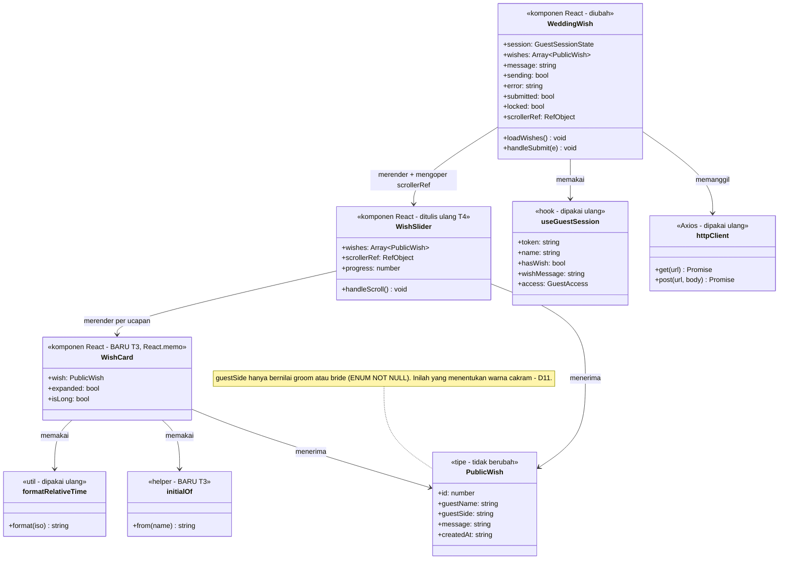
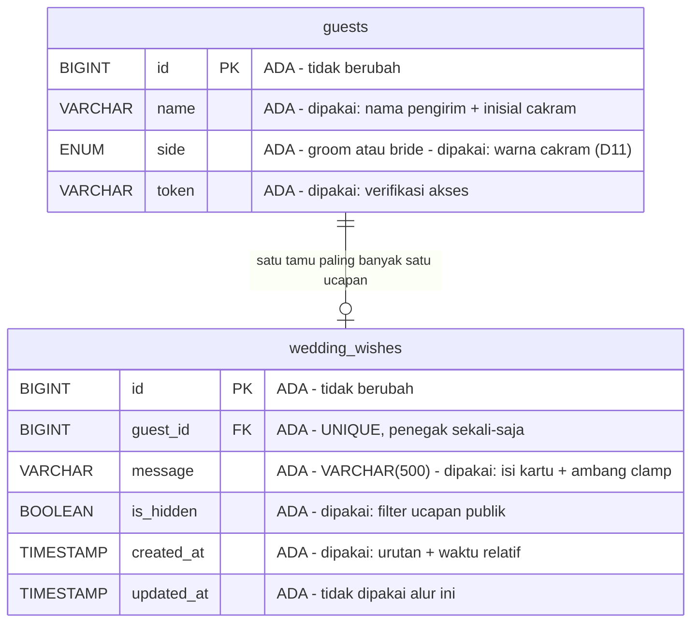
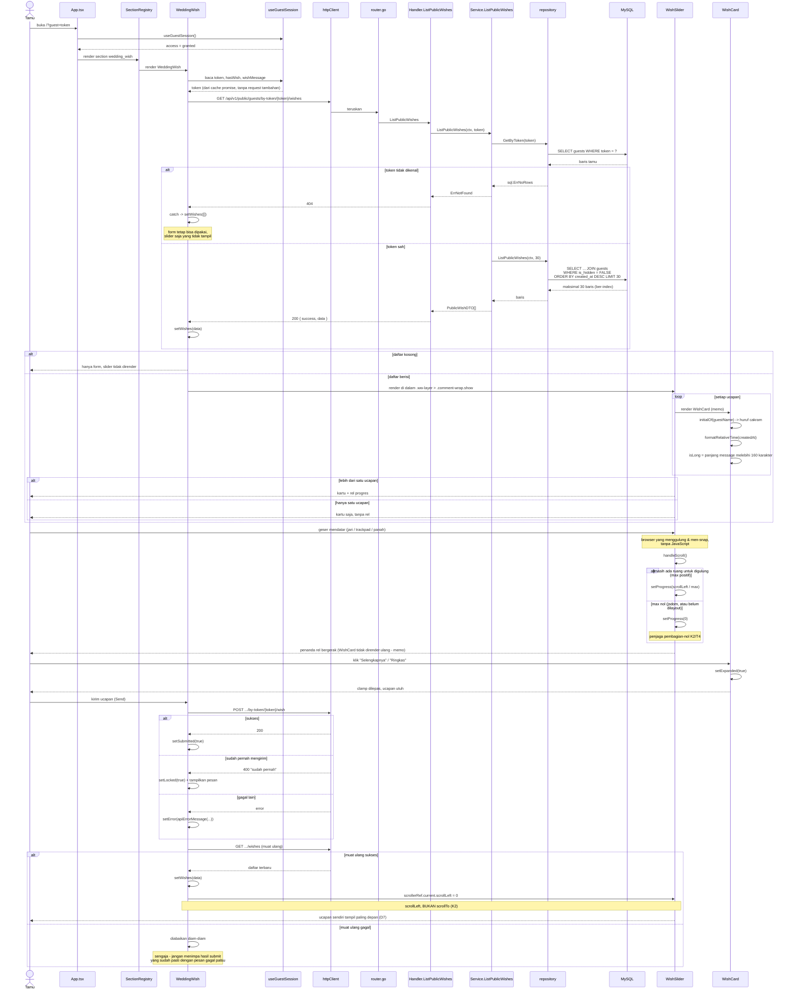

# PLAN — Redesain penyajian ucapan Wedding Wish (slider horizontal)

Analisis System Analyst atas permintaan: *"desain penyajian ucapan Wedding Wish belum ideal,
tidak bisa di-slide horizontal, dan ada card/text yang tertutup aset statis (image pohon).
Ubah total jadi card yang bisa di-slide horizontal dengan desain yang sesuai tema undangan."*

Dokumen ini **melanjutkan** `docs/plan/wedding-wish/PLAN.md` (fitur aslinya), bukan
menggantikannya. Keputusan lama yang masih berlaku dirujuk dengan kodenya (D5, D6, D7).

---

## 1. Requirement yang sudah disepakati

### 1.1 Pernyataan requirement

Pada halaman undangan publik (`/?guest=<token>`), section **Wedding Wish** menyajikan ucapan
dari para tamu. Penyajian itu diganti total menjadi **kartu yang digeser horizontal dengan
scroll native**, dengan desain yang diturunkan dari palet dan tipografi template Arsya, dan
kartu tidak lagi tertimpa ornamen taman.

### 1.2 Klasifikasi intent

**Enhancement**, dengan satu **defect** yang ikut diperbaiki di dalamnya.

Bukan kapabilitas baru: slider ucapan sudah ada sejak `docs/plan/wedding-wish/PLAN.md`
(`WishSlider` di `apps/web/src/components/WeddingWish/WeddingWish.tsx:40-118`). Yang berubah
adalah mekanisme geser dan seluruh bahasa visual kartunya. Defect yang menyertai: kartu
tertimpa ornamen (akar masalah di §2.1).

Trace (Langkah 3 & 5) **menegaskan** label ini, tidak mengubahnya: seluruh perubahan ada di
lapisan presentasi frontend, nol perubahan data dan nol perubahan backend.

### 1.3 Keputusan terkunci — tahap requirement

Semua dijawab langsung oleh user. Dicatat apa adanya.

| # | Pertanyaan | Jawaban user |
|---|---|---|
| **R1** | Seberapa luas "ubah total desain penyajian"? | **Slider ucapan tamu + kartu "Ucapan Anda"**. Form input (textarea + tombol Send) **tidak** diubah. |
| **R2** | Ornamen pohon yang menutupi kartu diapakan? | **Ornamen tetap utuh, kartu diangkat di atasnya.** Tidak ada aset yang dihapus, tidak ada overlay peredam. |
| **R3** | Bentuk geserannya seperti apa? | **Kartu dengan tepi tetangga mengintip (peek)** — tepi yang terlihat itulah isyarat bahwa kartu bisa digeser. |
| **R4** | Ucapan panjang (sampai 500 karakter) diapakan? | **Dipotong + tombol "Selengkapnya"**, tinggi kartu seragam. |

### 1.4 Keputusan terkunci — tahap desain

Diambil setelah trace, semua dijawab langsung oleh user.

| # | Keputusan | Pilihan user | Alasan yang mendasari |
|---|---|---|---|
| **D8** | Mekanisme geser | **Scroll native + CSS scroll-snap** | Satu-satunya yang benar-benar "mengikuti jari": momentum, trackpad, keyboard. Justru **menghapus** kode (handler sentuh + hitungan transform), bukan menambah — sejalan asas "mekanisme paling sederhana yang memenuhi requirement". |
| **D9** | Auto-geser 5 detik | **Dibuang** | Berkelahi dengan scroll native (kartu bisa tergeser sendiri saat tamu sedang menyeret) dan mengganggu tamu yang sedang membaca ucapan panjang. Membuangnya juga menghapus state `paused`, timer, dan `usePrefersReducedMotion`. |
| **D10** | Penanda posisi | **Rel progres tipis** | Dengan `publicWishLimit = 30`, 30 titik tidak terbaca. Lebar penanda = 1/jumlah kartu, jadi sekaligus menjawab "sekarang di mana" **dan** "masih ada berapa". |
| **D11** | Ciri khas kartu | **Cakram inisial berwarna sisi tamu** | Memakai `guestSide` yang sudah dikirim API tapi tak pernah ditampilkan. Dua warna tema (#355656 pria / #c95872 wanita) dipakai sebagai **informasi**, bukan hiasan. Sekaligus membuang tanda kutip Georgia raksasa — bagian paling generik dari desain lama. |

### 1.5 Keputusan lama yang tetap berlaku

| # | Keputusan | Status |
|---|---|---|
| **D5** | `wedding_wishes` milik modul `guest`; JOIN ke `guests` sah karena intra-modul | Tidak berubah |
| **D6** | Slider React mandiri, **bukan** Slick legacy | Tidak berubah. D8 tetap tanpa pustaka apa pun — scroll-snap adalah CSS murni. |
| **D7** | 30 ucapan terbaru, urut `created_at DESC` | Tidak berubah |

### 1.6 Verdict reuse / extend / create-new

| Lapisan | Verdict |
|---|---|
| Database (`wedding_wishes`, `guests`) | **Tidak berubah** — §3 |
| Backend (handler, service, query, migration) | **Tidak berubah** — §3 |
| Kontrak API & tipe `PublicWish` | **Reuse apa adanya** — `guestSide` sudah dikirim, tinggal dipakai |
| `WeddingWish.tsx` | **Extend** — `WishSlider` ditulis ulang, `WishCard` baru, logika form tidak disentuh |
| `wedding-wish.css` | **Extend** — blok kartu & slider ditulis ulang, `.ww-error` / `.ww-sender-note` dipertahankan |
| `WishCard` + perilaku clamp/expand | **Create new** — tidak ada preseden di seluruh `apps/web/src` (§5.3) |

---

## 2. Temuan trace

Semua klaim di bawah diverifikasi dengan membaca kode pada sesi ini, bukan dari dokumen.

### 2.1 Akar masalah kartu tertimpa ornamen — TERVERIFIKASI

Rantainya tiga fakta:

1. `.ornaments-wrapper { bottom:0; left:0; position:absolute; right:0; top:0; pointer-events:none }`
   — di `apps/web/public/assets/css/4e66ef9e.css`. **Tidak ada `z-index` sama sekali**, dan tidak
   ada satu pun aturan `z-index` pada ornamen di seluruh CSS template (sudah di-grep, nihil).
2. Blok ornamen **kedua** (`orn-lv-2` / `orn-lv-3`, yaitu pohon dan taman bunga di screenshot)
   dirender **sesudah** `.wedding-wish-body` — `WeddingWish.tsx:293-339` versus `:231`.
3. Elemen ter-posisi tanpa `z-index` dilukis menurut **urutan DOM**, sehingga ornamen menang.

Akibatnya dua tingkat keparahan yang berbeda, dan keduanya cocok persis dengan screenshot:

- `.ww-card` punya `position: relative` (`wedding-wish.css:49`) tanpa `z-index`, jadi ia ikut
  lapisan ter-posisi dan hanya kalah dari ornamen yang **setelahnya** di DOM.
- `.ww-own` **tidak ter-posisi sama sekali** (`wedding-wish.css:37-46, 122-126`), jadi ia berada
  di lapisan aliran normal dan kalah dari **kedua** blok ornamen. Ini sebabnya kartu "Ucapan
  Anda" di screenshot jauh lebih tertutup daripada kartu slider.

### 2.2 Kenapa "tidak bisa di-slide" — TERVERIFIKASI, dan bukan karena ornamen

Ornamen **tidak** memblokir sentuhan: seluruh `.ornaments-wrapper` sudah `pointer-events: none`,
dan tidak ada satu pun `pointer-events: auto` di CSS template yang mengembalikannya pada anak-anaknya.

Penyebab sebenarnya ada tiga, menumpuk:

1. Geseran sekarang cuma `transform: translateX(-n*100%)` (`WeddingWish.tsx:89`) yang **meloncat**
   per usapan. Tidak ada scroll fisik yang mengikuti jari, tidak ada momentum.
2. Hanya `onTouchStart`/`onTouchEnd` (`WeddingWish.tsx:62-74`) — di desktop/trackpad tidak ada
   cara menggeser sama sekali.
3. Dots disembunyikan saat `count < 2` (`WeddingWish.tsx:102`) dan auto-geser mati saat
   `count < 2` (`:48`). Saat ucapan baru satu — persis keadaan di screenshot — **tidak ada satu
   pun isyarat** bahwa bagian itu bisa digeser.

### 2.3 Dua kendala keras yang mengikat implementasi

**K1 — Undangan haram menyentuh Tailwind.** `apps/web/vite.config.ts:6-9` menyatakan dua entry
HTML terpisah: `index.html` (undangan tamu, legacy jQuery + CSS vendor, **tidak boleh** menyentuh
Tailwind) dan `admin.html`. `globals.css` hanya diimpor dari `admin-main.tsx`. Jadi seluruh
styling section ini ditulis sebagai CSS biasa di `wedding-wish.css`, **bukan** utility class
Tailwind.

> Ini tampak bertentangan dengan `.claude/rules/frontend-react.md` yang menetapkan Tailwind 4
> untuk `apps/web/**`. Sesuai `CLAUDE.md`, konfliknya dilaporkan, tidak dipilih diam-diam:
> pengecualian ini **sudah diratifikasi** sebagai keputusan #10 dan berlaku khusus untuk entry
> undangan tamu. Aturan Tailwind tetap berlaku penuh untuk `admin.html`. Tidak ada tindakan yang
> diperlukan; catatan ini ada supaya programmer tidak "memperbaiki" ke arah Tailwind.

**K2 — `Element.prototype.scrollTo` tidak ada di jsdom.** Diprobe langsung pada sesi ini dengan
konfigurasi test proyek (`vite.config.ts`, `environment: 'jsdom'`):

```
typeof Element.prototype.scrollTo = undefined
scrollTo() THROWS: el.scrollTo is not a function
set scrollLeft -> 50          (berfungsi)
clientWidth = 0, scrollWidth = 0   (selalu nol)
```

Konsekuensi yang **wajib** dipatuhi implementasi:

- **JANGAN panggil `el.scrollTo(...)` di mana pun.** Satu panggilan polos akan melempar
  `TypeError` dan merontokkan seluruh test `WeddingWish.test.tsx`. Desain D9+D10 memang
  membuatnya tidak pernah dibutuhkan (tidak ada auto-geser, rel progres hanya penanda).
- Untuk menggulung ke awal, pakai **`el.scrollLeft = 0`** — properti ini berfungsi di jsdom.
- `clientWidth`/`scrollWidth` **selalu 0** di jsdom, jadi perhitungan progres **wajib** dijaga
  dari pembagian dengan nol (T4). Tanpa penjaga itu hasilnya `NaN`, bocor ke atribut `style`,
  dan React akan melempar peringatan.

### 2.4 Bundle legacy menyentuh `.comment-wrap` — sudah dinetralkan, jangan dibongkar

`apps/web/public/assets/js/fddf2641.js` memuat `load_comment()` yang dipanggil **tanpa syarat**
lewat `setTimeout(()=>{load_comment()},500)`, dan isinya:

```js
e.commentItems && $(".comment-wrap").addClass("show").html(e.commentItems),
e.commentItems || $(".comment-wrap").removeClass("show")
```

Artinya: kalau sampai berhasil, ia akan **menimpa DOM React** dengan `.html()` atau **menghapus
kelas `show`** sehingga slider jadi `display:none`.

Itu **tidak bisa terjadi**, dan bukan karena kebetulan. `postData` (`universal.js`) memakai
`url: props?.url || ''`, jadi ia mem-POST ke URL halaman sendiri. `spaFallback`
(`apps/api/internal/router/router.go:275-278`, keputusan #17) menjawab **setiap non-GET dengan
JSON 404** justru untuk mencegah hal ini — komentar di kode itu menyebutkan alasannya secara
harfiah. Status 404 membuat jQuery masuk ke cabang `error`, sedangkan `load_comment` hanya
mengoper `onSuccess`, sehingga callback-nya tidak pernah jalan.

**Instruksi untuk programmer:** pertahankan pembungkus `.comment-wrap show` apa adanya
(`WeddingWish.tsx:286`). Kelas `show` tetap **wajib** karena CSS template menyetel
`.comment-wrap{display:none}` tanpa syarat. Test regresi yang menjaganya
(`WeddingWish.test.tsx:100-112`) **tidak boleh** dihapus.

### 2.5 Palet dan tipografi tema — sumbernya

Dibaca dari blok `body.arsya.original` di `apps/web/public/assets/css/4e66ef9e.css`. Seluruh
desain baru **hanya** memakai token ini, tidak ada satu pun warna karangan sendiri:

| Token | Nilai | Dipakai untuk |
|---|---|---|
| `--background-primary` | `#e6f4f8` | latar section (biru pucat, sudah ada) |
| `--background-secondary` | `#fffae3` | permukaan kartu ucapan tamu (krem, terbaca sebagai kertas) |
| `--background-tertiary` | `#fff` | permukaan kartu "Ucapan Anda" (putih, sengaja dibedakan) |
| `--text-primary` | `#355656` | teks ucapan + cakram sisi **groom** |
| `--text-secondary` | `#c95872` | nama pengirim + cakram sisi **bride** |
| `--text-tertiary` | `#5e7582` | keterangan waktu |
| `--heading-family` | `"Kapakana", cursive` | nama pengirim & huruf di cakram |
| `--body-text-family` | `"Cormorant Upright", serif` | isi ucapan |

### 2.6 Tumpukan & entry point

- Monorepo npm workspaces. Frontend React **18.3.1** + Vite (penyimpangan sadar dari React 19,
  `knowledge/decisions/ADR-0004-react-18.md`). Backend Go modular monolith, `database/sql` + sqlc.
- Entry point: `GET /` → `App` (`apps/web/src/App.tsx:82-84`) me-render `data.sections` lewat
  `SectionRegistry`, yang memetakan `'wedding_wish'` → `<WeddingWish />`
  (`SectionRegistry.tsx:68-69`). **Terkonfirmasi ada.**
- Section hanya dirender saat `access === 'granted'` (`App.tsx:32, 55`).

---

## 3. Sisi data — TIDAK BERUBAH

Ini keputusan eksplisit, bukan kelalaian.

Endpoint `GET /api/v1/public/guests/by-token/{token}/wishes`
(`router.go:77` → `handler_wishes.go:33` → `service_wishes.go:92`) **sudah** mengirim seluruh
field yang dibutuhkan desain baru:

| Field | Sumber | Dipakai desain baru |
|---|---|---|
| `id` | `wedding_wishes.id` | key React |
| `message` | `wedding_wishes.message` | isi kartu + ambang clamp |
| `createdAt` | `wedding_wishes.created_at` | keterangan waktu relatif |
| `guestName` | JOIN `guests.name` (live, bukan snapshot) | nama pengirim + inisial cakram |
| `guestSide` | JOIN `guests.side` | **warna cakram — sudah dikirim, selama ini tidak dipakai** |

`guestSide` sudah ada di tipe frontend `PublicWish` (`apps/web/src/types/api.ts:147-153`) dan
kolomnya `side ENUM('groom','bride') NOT NULL`
(`apps/api/migrations/000002_create_guest_tables.up.sql:9`) — hanya dua nilai, tidak pernah null.

**Tidak ada migration baru, tidak ada perubahan query, tidak ada perubahan DTO, tidak ada file
Go yang disentuh.**

---

## 4. Ruang lingkup

### 4.1 Dalam lingkup

| Berkas | Perubahan |
|---|---|
| `apps/web/src/components/WeddingWish/WeddingWish.tsx` | `WishSlider` ditulis ulang jadi scroller native; `WishCard` baru; pembungkus `.ww-layer`; auto-geser & handler sentuh dibuang |
| `apps/web/src/components/WeddingWish/wedding-wish.css` | Blok kartu & slider ditulis ulang total; aturan pengangkat lapisan ditambahkan |
| `apps/web/src/components/WeddingWish/WeddingWish.test.tsx` | Test usapan ditulis ulang; test baru untuk clamp, cakram, rel, dan lapisan |

### 4.2 Di luar lingkup

| Yang tidak disentuh | Alasan |
|---|---|
| Seluruh `apps/api/**` | §3 — data sudah lengkap, tidak ada yang kurang |
| `apps/web/public/assets/css/*.css` dan `assets/js/*.js` | Aset template pihak ketiga. Perbaikan lapisan dilakukan dari `wedding-wish.css` milik sendiri, bukan dengan menambal berkas template |
| Form input ucapan (textarea, tombol Send, `handleSubmit`) | Keputusan **R1** — user memilih tidak mengubahnya |
| Judul section `.wedding-wish-head` | Keputusan **R1**; di screenshot judulnya memang tidak bermasalah |
| Aset ornamen (`Orn-*.webp`) dan markup `.ornaments-wrapper` | Keputusan **R2** — ornamen tetap utuh |
| `apps/web/src/modules/admin/wishes/**` | Halaman admin kelola ucapan, tidak diminta |
| Komponen section lain | Tidak terdampak; perubahan terkurung di kelas `ww-` dan satu pembungkus baru |

### 4.3 Inventaris reuse — semua sudah dibaca dan diverifikasi

**Dipakai ulang tanpa perubahan apa pun:**

| Yang dipakai ulang | Lokasi | Catatan verifikasi |
|---|---|---|
| `formatRelativeTime` | `apps/web/src/shared/utils/relative-time.ts:6` | `Intl.RelativeTimeFormat('id')`, tanpa pustaka. Sudah dipakai kartu lama, dipakai lagi apa adanya |
| `useGuestSession` | `apps/web/src/hooks/useGuestSession.ts` | Menumpang cache promise yang sudah dimuat halaman — tidak ada request tambahan |
| `apiErrorMessage` | `apps/web/src/shared/lib/api-error.ts` | Jalur error `handleSubmit`, tidak disentuh |
| `httpClient` | `apps/web/src/shared/services/http-client.ts` | Satu instance Axios, endpoint sama persis |
| Tipe `PublicWish` | `apps/web/src/types/api.ts:147-153` | Sudah memuat `guestSide`; **tidak perlu diubah** |
| Token tema Arsya | `assets/css/4e66ef9e.css` (`body.arsya.original`) | §2.5 |
| Pembungkus `.comment-wrap show` | `WeddingWish.tsx:286` | §2.4 — dipertahankan |
| `.ww-error`, `.ww-sender-note` | `wedding-wish.css:143-157` | Di luar lingkup redesain (milik form), dibiarkan |

**Dibuat baru — celahnya sudah dibuktikan:**

| Yang baru | Bukti celahnya |
|---|---|
| Komponen `WishCard` | Tidak ada komponen kartu yang bisa dipakai ulang; `shared/components/ui` hanya dipakai admin dan bertenaga Tailwind — terlarang di entry undangan (K1) |
| Perilaku clamp + "Selengkapnya" | `grep -rn "Selengkapnya\|line-clamp\|expand"` di seluruh `apps/web/src` → **nihil**. Tidak ada preseden apa pun |
| Cakram inisial | `grep -rn "charAt(0)\|initial\|Avatar"` di `apps/web/src/components` → **nihil** |
| `.ww-scroller`, `.ww-rail`, `.ww-rail-thumb`, `.ww-layer` | Menggantikan `.ww-track`/`.ww-slide`/`.ww-dots`/`.ww-dot` yang mekanismenya dibuang oleh D8/D9/D10 |

---

## 5. Rancangan perubahan per lapisan

### 5.1 Struktur komponen sesudah perubahan

```
WeddingWish                       (tidak berubah: sesi, fetch, submit)
└── div.wedding-wish-body         (kelas template, tidak didefinisikan ulang)
    └── div.ww-layer              ← BARU: position:relative; z-index:2
        ├── div.wedding-wish-form (form ATAU kartu .ww-own)
        └── div.comment-wrap.show (dipertahankan, §2.4)
            └── WishSlider
                ├── div.ww-scroller       ← scroll-snap, tabIndex=0, onScroll
                │   └── WishCard × n      ← langsung anak flex, tanpa .ww-slide
                └── div.ww-rail > div.ww-rail-thumb   (hanya bila n > 1)
```

`.ww-layer` membungkus form **dan** slider sekaligus. Satu pembungkus itu mengangkat keduanya di
atas ornamen, jadi keluhan R2 selesai dengan satu aturan CSS, bukan tambalan per kartu.

**Kenapa pembungkus baru, bukan `.wedding-wish-body` langsung diberi `z-index`:** berkas
`wedding-wish.css` menyatakan aturannya sendiri di kepala berkas — kelas template
(`wedding-wish-*`) **tidak** didefinisikan ulang di situ. Menambah satu `div` ber-kelas `ww-`
menghormati aturan itu dan hasilnya identik.

**Kenapa `z-index: 2`, bukan `9999`:** ornamen ber-`z-index: auto`, jadi `2` sudah cukup
menang. Nilai yang lebih tinggi berisiko melompati elemen lain yang memang harus di atas —
CSS template memakai `z-index` sampai `3`, `5`, dan `999999` (pemutar musik, modal). `.secondary-pane`
dan `.kat-page__side-to-side` keduanya `position:relative` **tanpa** `z-index`, jadi tidak
membentuk stacking context dan perbandingan ini sah.

### 5.2 `WeddingWish.tsx`

**Dibuang seluruhnya** (konsekuensi D8 + D9):

| Yang dibuang | Lokasi sekarang |
|---|---|
| `SLIDE_INTERVAL_MS` | `:10` |
| `SWIPE_THRESHOLD_PX` | `:15` |
| `usePrefersReducedMotion` | `:23-31` — jadi kode mati setelah auto-geser dibuang |
| state `index`, `paused` + `useEffect` timer | `:41-53` |
| `handleTouchStart` / `handleTouchEnd` | `:62-74` |
| `safeIndex`, `go()` | `:59-60` |
| Blok dots `.ww-dots` | `:102-115` |

**Kenapa penjaga `safeIndex` boleh ikut hilang.** Komentar di `WeddingWish.tsx:57-58` menjelaskan
tugasnya: menjaga indeks tetap dalam rentang saat daftar menyusut di tengah tayang (admin
menyembunyikan satu ucapan, lalu tamu memuat ulang). Penjaga itu dibutuhkan karena `index` adalah
state React yang tidak tahu daftarnya berubah. Dengan scroll native tidak ada `index` sama sekali
— posisi disimpan browser sebagai `scrollLeft`, dan browser **sendiri** yang menjepitnya ke batas
baru begitu `scrollWidth` mengecil. `handleScroll` ikut menembak setelah penjepitan itu dan
penjaga `max > 0` menangani kasus ekstremnya. Jadi ini bukan penjaga yang hilang, melainkan
penjaga yang tidak lagi punya pekerjaan. **Jangan dibangkitkan ulang dalam bentuk lain.**

Perhatikan: yang dibuang **jauh lebih banyak** daripada yang ditambahkan. Scroll native
memindahkan pekerjaan dari JavaScript ke browser.

**Kepemilikan `scrollerRef` — sudah diputuskan, jangan ditawar lagi saat ngoding.**
`scrollerRef` dibuat di **`WeddingWish`** dan dioper ke `WishSlider` sebagai **prop biasa**, lalu
dipasang di `.ww-scroller`. Bukan `forwardRef`, bukan `useImperativeHandle`. Alasannya: T5 menuntut
`WeddingWish` menyentuh node itu setelah kirim berhasil, dan mengoper ref sebagai prop adalah cara
paling sedikit mesinnya. `WishSlider` sendiri tidak pernah membuat ref.

**`WishSlider` sesudahnya:**

```
WishSlider({ wishes, scrollerRef })   // scrollerRef = prop dari WeddingWish
  progress    : useState<number>   // 0..1, posisi rel

  handleScroll():
    el = scrollerRef.current; bila tidak ada → keluar
    max = el.scrollWidth - el.clientWidth
    setProgress(max > 0 ? el.scrollLeft / max : 0)   // ← PENJAGA WAJIB (K2/T4)

  render:
    div.ww-scroller  ref, onScroll, tabIndex={0}, role="region",
                     aria-label="Ucapan dari para tamu"
      → WishCard per ucapan
    bila wishes.length > 1:
      div.ww-rail > div.ww-rail-thumb
        style: width = `${thumbPct}%`, left = `${progress * (100 - thumbPct)}%`
        thumbPct = Math.max(100 / wishes.length, 12)
```

`tabIndex={0}` disengaja: ia membuat wadah scroll bisa difokus sehingga pengguna keyboard dapat
menggeser dengan tombol panah — perilaku scroll bawaan browser, tanpa satu baris JS pun.

**`WishCard` — komponen baru, dibungkus `React.memo`:**

```
LONG_MESSAGE_CHARS = 160

initialOf(name): name.trim().charAt(0).toUpperCase() || '?'

WishCard({ wish }) — memo
  expanded : useState(false)
  isLong   = wish.message.length > LONG_MESSAGE_CHARS

  article.ww-card  data-side={wish.guestSide}  data-expanded={expanded}
    span.ww-card-seal aria-hidden        → initialOf(wish.guestName)
    p.ww-card-message                    → wish.message
    bila isLong:
      button.ww-card-more                → expanded ? "Ringkas" : "Selengkapnya"
    footer.ww-card-meta
      span.ww-card-name                  → wish.guestName
      span.ww-card-time                  → formatRelativeTime(wish.createdAt)
```

**`React.memo` bukan hiasan, ia menutup cacat yang dibuat rancangan ini sendiri.** `onScroll`
memicu `setProgress` berkali-kali per detik saat digeser. Tanpa memo, setiap kali itu terjadi
ke-30 `WishCard` ikut dirender ulang — pada ponsel kelas menengah geserannya akan tersendat.
Dengan memo, hanya `WishSlider` (satu div + rel) yang dirender ulang; identitas objek `wish`
stabil karena array `wishes` tidak dibuat ulang saat scroll.

> **Koreksi pasca-implementasi.** Rencana awal membuat tombolnya **hilang** setelah dibuka
> (`isLong && !expanded`). Itu cacat, dan sudah diukur di browser: karena kartu meregang seragam
> (`align-items: stretch`), membuka **satu** kartu menaikkan tinggi **semua** kartu — terukur
> **277px → 469px**. Tanpa tombol untuk membalikkannya, satu ketukan menggelembungkan section
> secara permanen. Tombol yang melepas dirinya sendiri dari DOM saat diklik juga membuang fokus
> keyboard ke `body`. Karena itu tombolnya **tetap dirender** dan hanya labelnya bertukar
> (`Selengkapnya` ↔ `Ringkas`).

**Kenapa ambang karakter, bukan mengukur `scrollHeight`:** `clientWidth`/`scrollHeight` selalu 0
di jsdom (K2), jadi pengukuran nyata membuat perilaku ini **mustahil diuji**. Ambang 160 karakter
sengaja dipasang **lebih rendah** dari daya tampung 4 baris clamp (±180 karakter di lebar ponsel):
kalau meleset, tombol "Selengkapnya" muncul pada teks yang sebenarnya sudah utuh — tidak enak
dipandang tapi tidak merugikan. Kebalikannya jauh lebih buruk: teks terpotong **tanpa** cara
membukanya.

**Setelah kirim ucapan berhasil** — di dalam `handleSubmit`, sesudah `loadWishes()` sukses,
gulung scroller kembali ke awal supaya tamu langsung melihat ucapannya sendiri (D7: urut terbaru
dulu):

```
if (scrollerRef.current) scrollerRef.current.scrollLeft = 0
```

**Wajib `scrollLeft = 0`, bukan `scrollTo({left:0})`** — lihat K2.

### 5.3 `wedding-wish.css`

Aturan kunci. Sisanya (jarak, ukuran huruf) mengikuti bahasa yang sudah ada di berkas.

```css
.ww-layer { position: relative; z-index: 2; }   /* perbaikan §2.1 */

.ww-scroller {
  display: flex;
  align-items: stretch;            /* tinggi kartu seragam — R4 */
  gap: 0.9rem;
  overflow-x: auto;
  overflow-y: hidden;
  scroll-snap-type: x mandatory;
  overscroll-behavior-x: contain;  /* jangan memicu gestur "kembali" browser */
  scroll-padding-inline: 9%;
  padding: 1.9rem 9% 1.75rem;      /* gutter peek + ruang cakram (atas) & bayangan (bawah) */
  scrollbar-width: none;           /* rel progres menggantikan scrollbar */
}
.ww-scroller::-webkit-scrollbar { display: none; }
.ww-scroller:focus-visible { outline: 2px solid var(--text-secondary); outline-offset: 4px; }

.ww-card {
  box-sizing: border-box;          /* halaman ini TIDAK memakai border-box global */
  flex: 0 0 100%;                  /* = 82% layar, karena scroller ber-padding 9% */
  scroll-snap-align: center;
  min-width: 0;
  min-height: 230px;
  overflow: visible;               /* cakram boleh menonjol dari tepi atas */
  background: var(--background-secondary);
  border-radius: 18px;
}
```

> **Koreksi pasca-implementasi (diukur di Chrome, bukan ditalar).** Rencana awal menulis
> `flex: 0 0 82%` dan `padding-bottom: 0.85rem`. Keduanya salah:
>
> 1. **Persentase `flex-basis` dihitung dari *content box* flex container** — yang di sini sudah
>    dipotong padding 9% di tiap sisi. Ditambah lagi, computed `box-sizing` di halaman undangan
>    ternyata **`content-box`** (terukur langsung di browser; template tidak menyetel border-box
>    global), sehingga padding kartu 1.35rem x 2 masih ditambahkan **di luar** flex-basis. Hasil
>    terukurnya: kartu jadi **77%** scrollport, dan rasionya berubah-ubah mengikuti lebar layar
>    karena mencampur persentase dengan padding tetap. Yang benar: `box-sizing: border-box` +
>    `flex: 0 0 100%`, sehingga **padding scroller-lah satu-satunya pengatur peek**. Terukur
>    sesudah perbaikan: kartu tepat **82.0%** dengan gutter **9%** (dan **64%** / **18%** di
>    cabang >=600px) — 9 + 82 + 9 = 100 persis.
> 2. **`padding-bottom: 0.85rem` (13.6px) memotong bayangan kartu.** `box-shadow` menjulur ~25px
>    ke bawah sementara `overflow-y: hidden` memangkas apa pun yang melewati padding box —
>    bayangan terpotong rata terlihat seperti cacat render. Dinaikkan ke `1.75rem` (28px).
>
> `min-height` ikut naik 210 -> 230px karena dengan `border-box` angka itu kini sudah termasuk
> padding (efektifnya 259px sebelum koreksi). Media query >=600px kini hanya mengubah **padding**
> scroller; lebar kartu tetap 100%.

**`touch-action` sengaja TIDAK disetel.** Membiarkannya `auto` membuat browser sendiri yang
membedakan geseran mendatar (kartu) dari geseran menegak (halaman). Menyetelnya `pan-x` akan
memblokir scroll halaman saat jari mendarat di atas kartu — persis jenis kerusakan yang sulit
dilacak.

**Perubahan tipografi & warna:**

- Tanda kutip `\201C` Georgia raksasa (`wedding-wish.css:61-73`) **dihapus** — D11.
- `.ww-card-message`: `--body-text-family` (Cormorant Upright), **rata kiri**, tidak lagi
  italic dan tidak lagi rata tengah. Italic rata tengah sepanjang 500 karakter melelahkan dibaca;
  rata kiri adalah alasan keterbacaan, bukan selera.
- **Pembungkus kata panjang WAJIB ada** pada `.ww-card-message`, `.ww-card-name`, dan
  `.ww-own-message`. Ini bukan kerapian: `message` boleh 500 karakter, `guests.name` tidak
  dijamin mengandung spasi, dan tidak ada apa pun yang mencegah tamu mengirim satu kata panjang
  tanpa spasi. Kata itu memaksa lebar kartu melar, flex-basis kartu kalah, dan seluruh scroller
  ikut rusak.

  > **Koreksi pasca-implementasi.** Versi awal rencana ini menyebut
  > `overflow-wrap: break-word` sebagai penawarnya. Itu **keliru**: `break-word` memang
  > membungkus kata panjang, tapi kesempatan bungkus yang diciptakannya **tidak** ikut
  > diperhitungkan saat browser menghitung lebar **min-content** (CSS Text 3) — dan justru
  > min-content itulah yang melawan `flex-basis` pada flex item. Yang benar adalah
  > **`overflow-wrap: anywhere`**, yang ikut diperhitungkan. Preseden `anywhere` sudah ada di
  > codebase ini (`.wpass__field dd`).
  >
  > Karena tidak setiap anak kartu punya aturan pembungkus, penjaga strukturalnya ditambahkan
  > juga: **`min-width: 0` pada `.ww-card`**. Flex item ber-`min-width: auto` (bawaan) melar
  > melewati flex-basis-nya bila min-content isinya lebih besar; `min-width: 0` membuat 82% itu
  > mengikat apa pun isinya.
- `.ww-card-name`: `--heading-family` (Kapakana) — nama di bawah pesan memang sebuah **tanda
  tangan**, jadi wajar memakai huruf sambung tema.
- `.ww-card-seal`: cakram bulat, huruf Kapakana. Warna **default hijau** `--text-primary`, lalu
  `.ww-card[data-side="bride"] .ww-card-seal` menimpanya jadi `--text-secondary`. Ditulis sebagai
  default + satu penimpa, bukan dua aturan setara, supaya nilai `side` tak terduga tetap tampil
  wajar dan bukan cakram tanpa gaya.
- `.ww-card-message` saat terpotong: `display:-webkit-box; -webkit-line-clamp:4;
  -webkit-box-orient:vertical; overflow:hidden`. Saat `.ww-card[data-expanded="true"]`, clamp
  dilepas.
- `.ww-own`: tetap `--background-tertiary` (putih) — sengaja **berbeda** dari kartu krem tamu,
  supaya "ini punya Anda" versus "ini dari mereka" terbaca tanpa perlu dijelaskan.

**Perihal gerak:** ornamen template sudah bergoyang sendiri (animasi `goyang`) dan AOS sudah
menganimasikan kemunculan section. Kartu **tidak** menambah animasi apa pun — bagian ini sudah
cukup ramai. Blok `@media (prefers-reduced-motion: reduce)` yang ada (`:162-166`) menyesuaikan:
`.ww-track` sudah tidak ada, diganti `scroll-behavior: auto` pada `.ww-scroller`.

---

## 6. Daftar tugas

Berurutan. Setiap tugas hanya bergantung pada yang di atasnya.

- [ ] **T1 — Pembungkus `.ww-layer` di `WeddingWish.tsx`.**
      Bungkus isi `.wedding-wish-body` (blok `.wedding-wish-form` **dan** `.comment-wrap`) dengan
      `<div className="ww-layer">`. Markup ornamen dan `.comment-wrap show` jangan diubah.

- [ ] **T2 — Aturan `.ww-layer` di `wedding-wish.css`.**
      `position: relative; z-index: 2;`. Sesudah T1+T2, kartu "Ucapan Anda" sudah tidak tertimpa
      pohon — bisa dicek di layar sebelum lanjut.

- [ ] **T3 — Komponen `WishCard` di `WeddingWish.tsx`.**
      Sesuai §5.2: `React.memo`, konstanta `LONG_MESSAGE_CHARS = 160`, helper `initialOf`
      (dengan fallback `'?'` untuk nama kosong/spasi), state `expanded`, atribut `data-side` dan
      `data-expanded`, tombol `.ww-card-more` saat `isLong` (label bertukar
      Selengkapnya/Ringkas — lihat koreksi di §5.2). Pakai ulang
      `formatRelativeTime` — jangan tulis pemformat waktu baru.

- [ ] **T4 — Tulis ulang `WishSlider` jadi scroller native.**
      Sesuai §5.2. Buang `SLIDE_INTERVAL_MS`, `SWIPE_THRESHOLD_PX`, `usePrefersReducedMotion`,
      state `index`/`paused`, `useEffect` timer, `handleTouchStart`/`handleTouchEnd`, `safeIndex`,
      `go()`, dan blok dots. Buat `scrollerRef` di **`WeddingWish`** lalu oper ke `WishSlider`
      sebagai prop (§5.2 — sudah diputuskan, bukan pilihan bebas) dan pasang di `.ww-scroller`.
      Tambahkan state `progress` dan `handleScroll` **berikut penjaga `max > 0`** (K2 — tanpa ini
      `progress` jadi `NaN` di jsdom dan di browser saat kartu belum sempat dilayout). Rel hanya
      dirender saat `wishes.length > 1`. **Jangan panggil `el.scrollTo(...)` di mana pun.**

- [ ] **T5 — Gulung ke awal setelah kirim berhasil.**
      Di `handleSubmit`, sesudah `loadWishes()` sukses, set `scrollerRef.current.scrollLeft = 0`.
      Ref-nya sudah tersedia di `WeddingWish` sejak T4, jadi tidak ada `forwardRef` yang perlu
      dipasang. Jangan mengganggu penanganan error `handleSubmit` yang sudah ada: blok muat-ulang
      itu sengaja tidak memunculkan pesan gagal (`WeddingWish.tsx:188-197`).

- [ ] **T6 — Tulis ulang blok kartu & slider di `wedding-wish.css`.**
      Hapus `.ww-track`, `.ww-slide`, `.ww-dots`, `.ww-dot`, dan `.ww-card::before` (tanda kutip
      Georgia). Tambah `.ww-scroller`, `.ww-card` (peek 82%), `.ww-card-seal`,
      `.ww-card-message` (+clamp), `.ww-card-more`, `.ww-card-meta`, `.ww-rail`, `.ww-rail-thumb`
      sesuai §5.3. Pertahankan `.ww-error` dan `.ww-sender-note` apa adanya, dan **jangan sampai
      `overflow-wrap: anywhere` + `min-width: 0` hilang** dari `.ww-card` / `.ww-card-message` /
      `.ww-card-name` / `.ww-own-message` (§5.3 berikut koreksinya — satu kata panjang tanpa
      spasi akan merusak seluruh scroller, dan `break-word` saja tidak cukup). Perbarui blok
      `prefers-reduced-motion` agar menyasar `.ww-scroller`, bukan `.ww-track` yang sudah tiada.
      **Semua warna & huruf dari token §2.5 — tanpa nilai karangan sendiri, tanpa kelas Tailwind (K1).**

- [ ] **T7 — Tulis ulang `.ww-own` (kartu "Ucapan Anda") — R1.**
      Samakan bahasa visualnya dengan kartu tamu (radius, jarak, huruf) tapi **beda permukaan**:
      tetap `--background-tertiary` putih. Markup `.ww-own-title` / `.ww-own-message`
      (`WeddingWish.tsx:267-273`) tidak perlu berubah; cukup CSS-nya.

- [ ] **T8 — Perbarui test yang rusak karena T4.**
      `WeddingWish.test.tsx:115-141` ("usap horizontal menggeser slide") meng-assert
      `track().style.transform` — `.ww-track` sudah tidak ada. Ganti jadi test struktur scroller
      (§7 U1). **Test `.comment-wrap.show` (`:100-112`) jangan dihapus** — §2.4.

- [ ] **T9 — Tambah test baru** sesuai §7 (U2–U6).

- [ ] **T10 — Jalankan gerbang mutu.**
      `npm run test -w apps/web`, `npm run typecheck -w apps/web`, `npm run lint -w apps/web`.
      Ketiganya harus hijau.

- [ ] **T11 — Verifikasi manual di perangkat, `npm run dev:web`.**
      Daftar periksanya di §8. Mesti dicek di ponsel sungguhan, bukan hanya emulasi peramban —
      momentum dan snap adalah perilaku yang tidak jujur di emulator.

---

## 7. Test yang ditulis

Semuanya di `apps/web/src/components/WeddingWish/WeddingWish.test.tsx`, memakai pola mock yang
sudah ada (`mockSessionAndWishes`, `:29-36`) — jangan bikin harness baru.

| # | Test | Assertion |
|---|---|---|
| **U1** | Pengganti test usapan (T8) | Dengan 2 ucapan: `.ww-scroller` ada, `tabIndex === 0`, punya `role="region"`, dan berisi 2 `.ww-card`. **Tidak** meng-assert `scrollLeft`/`transform` — jsdom tidak melayout (K2) |
| **U2** | Ucapan panjang dipotong & bisa dibalik | Pesan > 160 karakter → tombol "Selengkapnya" muncul; diklik → `data-expanded="true"` dan tombol **tetap ada** berlabel "Ringkas"; diklik lagi → kembali `"false"` |
| **U3** | Ucapan pendek tidak dipotong | Pesan pendek → tombol "Selengkapnya" **tidak** ada |
| **U4** | Cakram mengikuti sisi tamu | `guestSide: 'bride'` → `.ww-card[data-side="bride"]`; `'groom'` → `data-side="groom"`. Inisial = huruf pertama `guestName`, huruf besar |
| **U5** | Rel hanya saat lebih dari satu ucapan | 1 ucapan → `.ww-rail` tidak ada; 2 ucapan → `.ww-rail` ada |
| **U6** | Render tidak melempar di jsdom | Render dengan 2 ucapan lalu `fireEvent.scroll` pada `.ww-scroller` → tidak melempar, dan `.ww-rail-thumb` **tidak** ber-`style` yang memuat `NaN`. Ini yang menjaga penjaga pembagian-nol di T4 |

Test lama yang **wajib tetap hijau tanpa diubah**: F1 (`:46`), F2 (`:58`), F3 (`:71`),
"daftar berisi" (`:82`), `.comment-wrap.show` (`:100`), "kirim sukses" (`:144`),
"sudah-pernah" (`:164`).

---

## 8. Daftar periksa verifikasi manual (T11)

- [ ] Kartu ucapan **dan** kartu "Ucapan Anda" tampil penuh di atas ornamen pohon — keluhan utama.
- [ ] Ornamen pohon & taman masih utuh, tidak ada yang hilang (R2).
- [ ] Kartu digeser dengan jari dan **mengikuti jari** secara langsung, lalu mengunci rapi.
- [ ] Tepi kartu tetangga terlihat di kanan/kiri saat diam (R3).
- [ ] Scroll halaman ke bawah **tetap berfungsi** saat jari mendarat di atas kartu.
- [ ] Geseran mendatar **tidak** memicu gestur "kembali" peramban (`overscroll-behavior-x`).
- [ ] Kartu **pertama** dan **terakhir** bisa berhenti di tengah layar. *Bila kartu terakhir tidak
      bisa center, penyebabnya padding akhir pada wadah flex di Safari lama — tambahkan
      `.ww-scroller::after { content:''; flex: 0 0 0.1px }`.*
- [ ] Rel progres bergerak mengikuti posisi, penanda melebar saat ucapan sedikit.
- [ ] "Selengkapnya" membuka ucapan panjang sepenuhnya, dan "Ringkas" mengembalikannya.
- [ ] Trackpad/roda mendatar menggeser kartu di desktop; Tab lalu tombol panah juga bisa.
- [ ] Setelah kirim ucapan, ucapan sendiri tampil paling depan.
- [ ] Ucapan hanya satu: kartu tampil rapi, tidak ada rel yang menggantung.
- [ ] Ucapan berisi satu kata panjang tanpa spasi (mis. 200 huruf beruntun) tetap terbungkus di
      dalam kartu dan tidak melebarkan scroller — penjaga `overflow-wrap: break-word` (§5.3).

---

## 9. Diagram

### 9.1 Diagram kelas



### 9.2 ERD

Seluruh sisi data **tidak berubah** (§3). Diagram ini menunjukkan tabel yang **dibaca** oleh alur
ini, bukan perubahan yang diusulkan — tidak ada satu pun kolom baru.



Relasi `guests` ↔ `wedding_wishes` adalah FK **intra-modul** (keduanya milik modul `guest`),
sehingga JOIN-nya sah menurut aturan modular monolith — D5, dan komentar di
`apps/api/internal/modules/guest/infrastructure/queries/wedding_wishes.sql:7-10`.

### 9.3 Diagram sekuens



---

## 10. Volume data & kinerja

Penilaian ini dicatat sebagai keputusan, bukan pertanyaan yang tidak pernah diajukan.

**Volume yang diasumsikan:** satu undangan pernikahan, ratusan sampai beberapa ribu tamu, dan
paling banyak **satu ucapan per tamu** — ditegakkan di dua lapis: `UNIQUE KEY
uq_wedding_wishes_guest_id` (`migrations/000020_add_wedding_wishes.up.sql`) dan penjaga di
`SubmitWish`. Jadi `wedding_wishes` berukuran orde ribuan baris, bukan jutaan.

| Yang diperiksa | Temuan |
|---|---|
| Query di dalam loop (bentuk N+1) | **Tidak ada.** Satu query dengan satu JOIN mengembalikan semua kolom sekaligus (`wedding_wishes.sql:23-29`). Nama pengirim ikut di baris yang sama, tidak diambil per ucapan |
| Hasil tanpa batas | **Tidak ada.** `publicWishLimit = 30` dipatok di server (`service_wishes.go:23`) dan dikunci test (`wish_test.go:78`). Frontend tidak bisa menaikkannya — parameternya tidak berasal dari request |
| Filter/urut tanpa index | **Aman.** `WHERE is_hidden = FALSE ORDER BY created_at DESC` dilayani `KEY idx_wedding_wishes_visible (is_hidden, created_at)` — urutan kolomnya cocok, filter dulu baru urut. Sudah dibaca langsung di migration 000020, bukan diasumsikan |
| Besar payload | ≈ 30 × ~600 byte ≈ **18 KB**. `message` dibatasi `VARCHAR(500)` |
| Seluruh koleksi ditahan di memori | Ya, 30 objek — tidak berarti pada volume ini. Virtualisasi tidak diperlukan dan tidak diusulkan |
| Transaksi menganga saat panggilan eksternal | Tidak berlaku — jalur ini hanya baca, tanpa panggilan eksternal |
| **Render ulang saat scroll (dibuat oleh rancangan ini)** | **Ditangani.** `onScroll` menembak puluhan kali per detik; tanpa `React.memo` ke-30 `WishCard` ikut dirender ulang setiap kali. `React.memo` di T3 menekannya jadi satu `WishSlider` saja. Ini satu-satunya risiko kinerja yang **ditambahkan** rancangan ini, dan penawarnya sudah menjadi tugas, bukan catatan kaki |
| Aset gambar | Tidak ada aset baru. Ornamen yang sudah ada tetap `loading="lazy"` `decoding="async"` |

**Kesimpulan:** wajar pada volume nyata sistem ini. Tidak ada paginasi, cache, atau virtualisasi
yang diperlukan — dan menambahkannya justru akan melanggar asas "mekanisme paling sederhana yang
memenuhi requirement".

---

## 11. Catatan penutup

- Rencana ini **nol perubahan backend** dan **nol perubahan skema**. Bila saat implementasi
  muncul dorongan menyentuh `apps/api/**`, itu tanda ada requirement yang belum terbuka —
  hentikan dan tanyakan, jangan diam-diam melebarkan lingkup.
- Batas modul tidak tersentuh sama sekali: tidak ada JOIN lintas modul baru, tidak ada FK lintas
  modul, tidak ada modul yang mengimpor internal modul lain. Satu-satunya JOIN adalah
  `wedding_wishes` ↔ `guests`, keduanya milik modul `guest` (D5).
- Bila `knowledge/FRONTEND.md` perlu menyebut pola scroll-snap ini sebagai preseden untuk section
  lain, itu pekerjaan terpisah — bukan bagian dari daftar tugas di atas.
