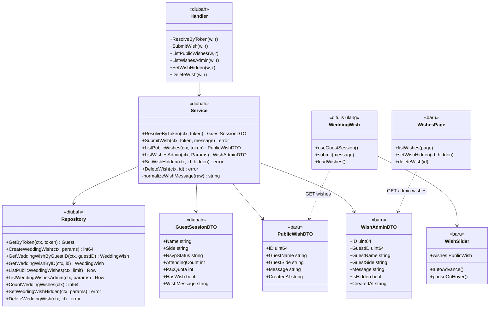
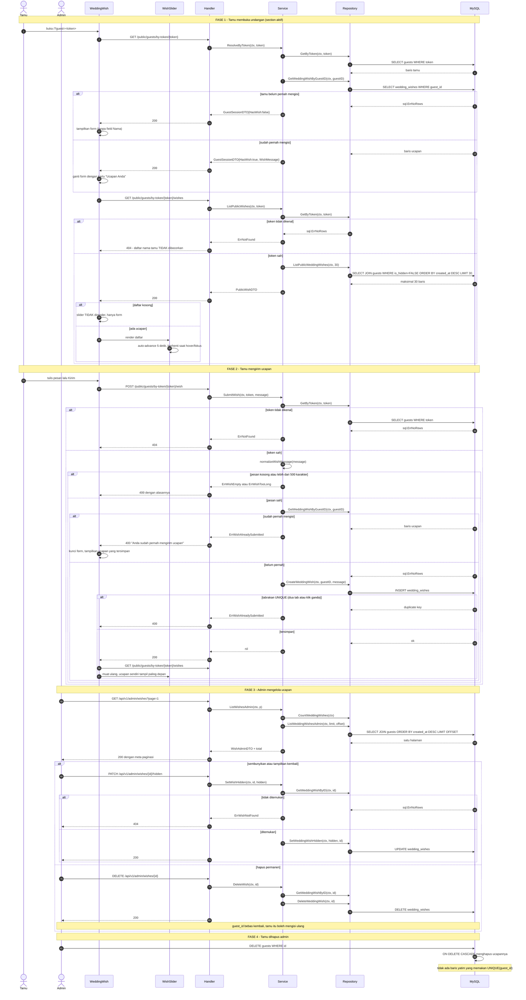

# PLAN — Wedding Wish (ucapan tamu): simpan, tampilkan, kelola

Modul: `guest` (tabel ketiga) + 1 section frontend + 1 menu admin baru.
Klasifikasi: **New capability.** Fitur Wedding Wish belum pernah berfungsi sama
sekali — yang ada hanya sisa markup template statis.

---

## 1. Pernyataan kebutuhan yang sudah disepakati

### 1.1 Koreksi premis (ditemukan saat trace, disepakati user)

Permintaan awal berbunyi "menampilkan isi dari inputan wedding wish yang sudah di
input oleh tamu". **Tidak ada data seperti itu, dan tidak pernah ada**, karena
fiturnya belum pernah tersambung ke apa pun:

| Bukti | Temuan |
|---|---|
| [`WeddingWish.tsx:34`](../../../apps/web/src/components/WeddingWish/WeddingWish.tsx) | `<form action="#" method="POST">` **tanpa `onSubmit`, tanpa state, tanpa `httpClient`**. Sisa markup server-rendered lama masih menempel: `<input name="post" value="newComment">`, `<input name="guestId" value="">`, tombol `#moreComment` dengan `data-start="0"` yang tidak dipasangi handler apa pun |
| [`WeddingWish.tsx:66-69`](../../../apps/web/src/components/WeddingWish/WeddingWish.tsx) | `<div className="comment-wrap">` isinya hanya komentar kosong `{/* COMMENTS */}` |
| `grep -rn "wish\|comment\|ucapan" apps/api/internal` | **nol hasil** — tidak ada satu baris kode backend pun |
| `grep "CREATE TABLE"` seluruh migrations | 12 tabel, **tidak satu pun** untuk ucapan |
| [`router.go:66-68`](../../../apps/api/internal/router/router.go) | Hanya 3 endpoint publik: invitation, resolve-by-token, update RSVP |

Jadi pekerjaan ini **membangun fitur dari nol**: tabel, endpoint, form yang
benar-benar menyimpan, slider penampil, dan menu admin. Bukan menampilkan data
yang sudah ada.

### 1.2 Keputusan terkunci

| # | Pertanyaan | Jawaban yang dipakai |
|---|---|---|
| D1 | Ruang lingkup | **Bangun penuh dari nol** — tabel + endpoint publik + endpoint admin + form penyimpan + slider + menu admin. Tanpa jalur simpan, tidak akan pernah ada data untuk ditampilkan maupun dikelola |
| D2 | Moderasi | **Langsung tampil, admin bisa sembunyikan & hapus.** Pengisinya hanya tamu ber-token, jadi risikonya rendah — antrian moderasi adalah mesin tambahan yang tidak sebanding dan membuat ucapan tertahan tanpa disadari |
| D3 | Siapa yang mengisi | **Hanya tamu ber-token, nama diambil dari baris `guests`.** Field `Name` pada form DIHAPUS. Ini satu-satunya cara "sekali per tamu" bisa ditegakkan di server, sekaligus mencegah orang mengaku sebagai tamu lain |
| D4 | Pembuka tanpa token | **Pertanyaan saya gugur — dikoreksi user.** Undangan memang sudah tertutup total tanpa token: [`App.tsx:55`](../../../apps/web/src/App.tsx#L55) memulangkan `GuestGate` untuk semua `access !== 'granted'`. Tidak ada cabang "mode pratinjau" yang perlu dirancang |
| D5 | Pemilik tabel | **Di dalam modul `guest`** — tabel ketiga setelah `guests` & `guest_groups`. FK + JOIN intra-modul sah, `UNIQUE(guest_id)` menegakkan "sekali saja" di level DB, nama pengirim di-JOIN sehingga selalu segar |
| D6 | Mekanisme slider | **Slider React mandiri**, bukan Slick legacy. Ucapan wajib datang dari endpoint sendiri, jadi tiba SESUDAH bundle legacy selesai membaca DOM |
| D7 | Isi slider | **30 terbaru, `ORDER BY created_at DESC`** |

### 1.3 Penentuan reuse / extend / create-new

| Sasaran | Putusan | Bukti |
|---|---|---|
| Tabel `wedding_wishes` | **Create-new** | Tidak ada tabel yang memuat ucapan; celahnya mutlak (§1.1) |
| Modul `guest` | **Extend** | Preseden `guest_groups` eksplisit: "yang dilarang adalah join & FK **lintas modul**, bukan satu modul memiliki banyak tabel" — [`000016_add_guest_groups.up.sql`](../../../apps/api/migrations/000016_add_guest_groups.up.sql) |
| `sections` | **Tidak berubah** | `wedding_wish` SUDAH ter-seed (`('wedding_wish', 'Wedding Wish', TRUE, 16)`, [`000004_seed.up.sql:86`](../../../apps/api/migrations/000004_seed.up.sql)) dan toggle-nya sudah jalan lewat `SectionsPage`. Tidak ada migration untuk ini |
| `sqlc.yaml` | **Tidak berubah** | Konfigurasinya memetakan **direktori** queries per modul, jadi berkas `.sql` baru otomatis ikut ter-generate — dinyatakan eksplisit di [`guest_groups.sql`](../../../apps/api/internal/modules/guest/infrastructure/queries/guest_groups.sql) |
| `guest.module.go`, `main.go` | **Tidak berubah** | Tidak ada modul/dependensi baru — handler & service yang sudah dirakit tinggal bertambah method |
| `GuestSessionDTO` | **Extend** | +`HasWish`, +`WishMessage`; alasan sama dengan `AttendingCount`/`PaxQuota` — data milik tamu itu sendiri, bukan data tamu lain ([`dto.go:90`](../../../apps/api/internal/modules/guest/application/dto.go)) |
| `useGuestSession` | **Reuse tanpa diubah** | Cache PROMISE per token ([`useGuestSession.ts:72`](../../../apps/web/src/hooks/useGuestSession.ts#L72)) — komponen WeddingWish memanggilnya **tanpa** menambah request |
| Komponen UI admin | **Reuse** | `Button, Input, Textarea, Card, Table, Thead, Tbody, Tr, Th, Td, Modal, Pagination` + `PageHeader, EmptyState, TableSkeleton, ErrorState, useToast` — semua sudah dipakai `GroupsPage` |
| `authmw.RequireFullAdmin` | **Reuse** | Seluruh mux `admin` sudah dijaga di [`router.go:185`](../../../apps/api/internal/router/router.go#L185) — route admin baru otomatis terlindungi |
| `shared/pagination` | **Reuse** | `pagination.Parse` + `pagination.Meta`, pola `ListGuests` |
| Pemetaan error | **Reuse konvensi** | `writeServiceError` guest hanya mengenal 404 & 400; konflik seperti `ErrGroupNameTaken` dipetakan **400**. `ErrWishAlreadySubmitted` mengikuti itu — **bukan** 409 |

---

## 2. Cakupan

### 2.1 Masuk cakupan

| Berkas | Jenis |
|---|---|
| `apps/api/migrations/000020_add_wedding_wishes.up.sql` / `.down.sql` | baru |
| `apps/api/internal/modules/guest/infrastructure/queries/wedding_wishes.sql` | baru |
| `apps/api/internal/modules/guest/infrastructure/sqlc/*` | regenerate |
| `apps/api/internal/modules/guest/infrastructure/repository.go` | diubah |
| `apps/api/internal/modules/guest/application/service_wishes.go` | baru |
| `apps/api/internal/modules/guest/application/service.go` | diubah (error sentinel, `StatusHTTPCode`, `ResolveByToken`) |
| `apps/api/internal/modules/guest/application/dto.go` | diubah |
| `apps/api/internal/modules/guest/presentation/handler_wishes.go` | baru |
| `apps/api/internal/router/router.go` | +5 route |
| `apps/web/src/components/WeddingWish/WeddingWish.tsx` | ditulis ulang |
| `apps/web/src/components/WeddingWish/wedding-wish.css` | baru |
| `apps/web/src/types/api.ts` | diubah |
| `apps/web/src/app/routes/route-paths.ts` | +1 path |
| `apps/web/src/modules/admin/app/AdminApp.tsx` | +1 route |
| `apps/web/src/modules/admin/shared/AdminLayout.tsx` | +1 menu |
| `apps/web/src/modules/admin/wishes/pages/WishesPage.tsx` | baru |
| `apps/web/src/modules/admin/wishes/services/wishes.service.ts` | baru |
| Test (§8) | baru |
| `knowledge/MODULE_MAP.md`, `API.md`, `DATABASE.md` | diperbarui |

### 2.2 Di luar cakupan

| Tidak disentuh | Alasan |
|---|---|
| Migration untuk `sections` | `wedding_wish` sudah ter-seed & toggle-nya sudah berfungsi (§1.3) |
| Modul `content`, `whatsapp`, `auth` | Tidak bersinggungan; `sections` tetap milik content dan dibaca lewat jalur yang sudah ada |
| Bundle legacy (`assets/js/*.js`, Slick) | D6 memilih slider React mandiri justru agar bundle buram itu tidak perlu disentuh |
| Sunting/hapus ucapan oleh tamu | D1/D3 mengunci "sekali saja"; memberi tombol sunting membatalkan aturan itu |
| Notifikasi WhatsApp saat ucapan masuk | Tidak diminta |
| Komentar `DEFAULT_SESSION` yang menyebut "mode pratinjau" di [`useGuestSession.ts:11-15`](../../../apps/web/src/hooks/useGuestSession.ts#L11-L15) | Komentar itu **sudah usang** sejak GuestGate menutup akses tanpa token (D4), tetapi merapikannya tidak mengubah perilaku apa pun — bukan bagian pekerjaan ini |

---

## 3. Perubahan per lapisan

### 3.1 Migration `000020_add_wedding_wishes`

```sql
-- up
CREATE TABLE wedding_wishes (
  id BIGINT UNSIGNED NOT NULL AUTO_INCREMENT,
  guest_id BIGINT UNSIGNED NOT NULL,
  message VARCHAR(500) NOT NULL,
  is_hidden BOOLEAN NOT NULL DEFAULT FALSE,
  created_at TIMESTAMP NOT NULL DEFAULT CURRENT_TIMESTAMP,
  updated_at TIMESTAMP NOT NULL DEFAULT CURRENT_TIMESTAMP ON UPDATE CURRENT_TIMESTAMP,
  PRIMARY KEY (id),
  UNIQUE KEY uq_wedding_wishes_guest_id (guest_id),
  KEY idx_wedding_wishes_visible (is_hidden, created_at),
  CONSTRAINT fk_wedding_wishes_guest_id FOREIGN KEY (guest_id)
    REFERENCES guests(id) ON DELETE CASCADE
);
```

Empat keputusan skema yang mengikat:

- **`UNIQUE(guest_id)`** — inilah penegak "sekali saja" (D3). Validasi di service
  adalah lapis pertama yang memberi pesan enak dibaca; UNIQUE adalah lapis kedua
  yang menjamin tidak ada jalur lain (dua tab, klik ganda, skrip) yang bisa
  menyelipkan ucapan kedua. Pola dua lapis yang sama dipakai `guest_groups.name`.
- **`VARCHAR(500)` bukan `TEXT`** — batas panjang ikut ditegakkan skema, bukan
  hanya service. Mengikuti preseden `description VARCHAR(255)` pada `guest_groups`
  yang sengaja menghindari `TEXT`.
- **`is_hidden` bukan kolom status ber-ENUM** — D2 hanya menuntut dua keadaan
  (tampil / disembunyikan). ENUM tiga nilai berarti membangun antrian moderasi
  yang sudah ditolak.
- **FK `ON DELETE CASCADE`**, berbeda dari `fk_guests_group_id` yang RESTRICT.
  Alasannya terbalik: sebuah group masih bermakna tanpa tamu, sedangkan ucapan
  **tidak bermakna tanpa pengirimnya** — namanya di-JOIN dari `guests`. Tanpa
  CASCADE, menghapus tamu akan menyisakan baris yatim yang hilang dari seluruh
  query (JOIN-nya tidak ketemu) tapi tetap memakan `UNIQUE(guest_id)`, sehingga
  tamu baru dengan id daur ulang bisa tertolak tanpa sebab yang terlihat.

`down` cukup `DROP TABLE IF EXISTS wedding_wishes;` — FK ikut terhapus bersama
tabelnya, dan tidak ada kolom tabel lain yang disentuh.

### 3.2 Query sqlc — `wedding_wishes.sql` (berkas baru)

```sql
-- name: CreateWeddingWish :execlastid
INSERT INTO wedding_wishes (guest_id, message) VALUES (?, ?);

-- name: GetWeddingWishByGuestID :one
-- Dipakai DUA jalur: penjaga "sekali saja" di SubmitWish, dan ResolveByToken
-- (mengisi HasWish + WishMessage). Lookup pada UNIQUE key, O(1).
SELECT * FROM wedding_wishes WHERE guest_id = ? LIMIT 1;

-- name: ListPublicWeddingWishes :many
-- JOIN ke guests SAH karena intra-modul (D5). Nama diambil live, bukan snapshot,
-- supaya perbaikan nama tamu di admin langsung tercermin di undangan.
-- Filter + sort keduanya terlayani idx_wedding_wishes_visible.
SELECT w.id, w.message, w.created_at, g.name AS guest_name, g.side AS guest_side
FROM wedding_wishes w
JOIN guests g ON g.id = w.guest_id
WHERE w.is_hidden = FALSE
ORDER BY w.created_at DESC
LIMIT ?;

-- name: ListWeddingWishesAdmin :many
-- Admin melihat SEMUA termasuk yang disembunyikan - itu justru gunanya.
SELECT w.id, w.guest_id, w.message, w.is_hidden, w.created_at,
       g.name AS guest_name, g.side AS guest_side
FROM wedding_wishes w
JOIN guests g ON g.id = w.guest_id
ORDER BY w.created_at DESC
LIMIT ? OFFSET ?;

-- name: CountWeddingWishes :one
SELECT COUNT(*) FROM wedding_wishes;

-- name: SetWeddingWishHidden :exec
UPDATE wedding_wishes SET is_hidden = ? WHERE id = ?;

-- name: GetWeddingWishByID :one
-- Penjaga 404 sebelum SetHidden/Delete, supaya admin menerima "tidak ditemukan"
-- dan bukan 200 palsu atas baris yang tidak ada.
SELECT * FROM wedding_wishes WHERE id = ? LIMIT 1;

-- name: DeleteWeddingWish :exec
DELETE FROM wedding_wishes WHERE id = ?;
```

### 3.3 `application/service_wishes.go` (berkas baru)

Berkas terpisah mengikuti preseden `service_groups.go` — satu berkas per bidang,
bukan menumpuk di `service.go` yang sudah panjang.

| Fungsi | Isi |
|---|---|
| `SubmitWish(ctx, token, message) error` | Resolve tamu by token (404 bila tidak ada) → validasi pesan → cek `GetWeddingWishByGuestID`; bila ADA → `ErrWishAlreadySubmitted` → `CreateWeddingWish` |
| `ListPublicWishes(ctx, token) ([]PublicWishDTO, error)` | **Resolve tamu by token lebih dulu** (`ErrNotFound` → 404 bila token tak dikenal), baru `ListPublicWeddingWishes` dengan `LIMIT publicWishLimit` (30, D7). Token WAJIB diverifikasi di service — tanpa itu penyarangan `by-token/` hanya hiasan URL dan daftar nama tamu tetap bisa dipanen siapa pun (§3.5) |
| `ListWishesAdmin(ctx, p) ([]WishAdminDTO, int, error)` | `CountWeddingWishes` + `ListWeddingWishesAdmin`, pola identik `ListLogs`/`ListGroups` |
| `SetWishHidden(ctx, id, hidden) error` | `GetWeddingWishByID` (404) → `SetWeddingWishHidden` |
| `DeleteWish(ctx, id) error` | `GetWeddingWishByID` (404) → `DeleteWeddingWish` |
| `normalizeWishMessage(raw) (string, error)` | Fungsi **murni**: `TrimSpace`, tolak kosong, tolak > `maxWishLength`. Dipisah agar bisa diuji tanpa DB — pola `normalizePhone`/`applyTemplate` di modul whatsapp |

Konstanta: `publicWishLimit = 30`, `maxWishLength = 500` (sama dengan `VARCHAR(500)`).

Error sentinel baru di `service.go` (dikelompokkan seperti blok group):

```go
ErrWishAlreadySubmitted = errors.New("Anda sudah pernah mengirim ucapan")
ErrWishEmpty            = errors.New("Ucapan tidak boleh kosong")
ErrWishTooLong          = errors.New("Ucapan maksimal 500 karakter")
ErrWishNotFound         = errors.New("Ucapan tidak ditemukan")
```

`StatusHTTPCode`: `ErrWishNotFound` → **404**; tiga sisanya → **400**
(mengikuti `ErrGroupNameTaken`, bukan memperkenalkan 409 — §1.3).

### 3.4 `ResolveByToken` + `GuestSessionDTO`

`GuestSessionDTO` bertambah dua field:

```go
HasWish     bool   `json:"hasWish"`
WishMessage string `json:"wishMessage"`
```

`ResolveByToken` memanggil `GetWeddingWishByGuestID` sesudah `GetByToken`;
`sql.ErrNoRows` berarti `HasWish=false` dan **bukan** error.

Dua alasan bentuk ini dipilih:

- **Menumpang endpoint yang sudah pasti dipanggil.** Setiap tamu yang membuka
  undangan sudah memanggil `by-token`, dan hasilnya di-cache per token di
  frontend. Menambahkan endpoint "apakah saya sudah mengisi" berarti satu
  permintaan tambahan untuk informasi yang bisa ikut menumpang.
- **`GetByToken` TIDAK diubah.** Query itu `SELECT *` dan juga dipakai
  `CheckinByCode`; mengubah bentuknya merembet ke jalur check-in gate yang tidak
  ada hubungannya dengan ucapan.

Ini bukan data sensitif: ucapan milik tamu itu sendiri — alasan yang sama persis
dengan `AttendingCount` dan `PaxQuota` yang sudah ada di DTO ini.

### 3.5 Route

| Method | Path | Penjaga |
|---|---|---|
| POST | `/api/v1/public/guests/by-token/{token}/wish` | token |
| GET | `/api/v1/public/guests/by-token/{token}/wishes` | token |
| GET | `/api/v1/admin/wishes` | `RequireFullAdmin` (otomatis) |
| PATCH | `/api/v1/admin/wishes/{id}/hidden` | `RequireFullAdmin` (otomatis) |
| DELETE | `/api/v1/admin/wishes/{id}` | `RequireFullAdmin` (otomatis) |

**Daftar ucapan publik sengaja ber-token**, bukan `/api/v1/public/wishes` terbuka.
Isinya adalah nama-nama tamu yang diundang beserta pesannya — persis jenis data
yang `GuestSessionDTO` sudah berhati-hati menjaganya ("hindari kebocoran data
tamu lain via token tebakan", [`dto.go:74-76`](../../../apps/api/internal/modules/guest/application/dto.go)).
Membiarkannya terbuka berarti siapa pun bisa memanen daftar undangan. Penyarangan
`by-token/{token}/...` mengikuti `PATCH .../rsvp` yang sudah ada.

**Penegakannya ada di service, bukan di bentuk URL.** `ListPublicWishes` memverifikasi
token lewat `GetByToken` sebelum membaca ucapan apa pun (§3.3). Tanpa langkah itu,
path `by-token/` hanya hiasan dan siapa pun yang menebak URL tetap menerima seluruh
daftar nama tamu.

### 3.6 Frontend — section undangan

`WeddingWish.tsx` **ditulis ulang**, seluruh ornamen dan kelas CSS template
dipertahankan apa adanya agar menyatu dengan desain sekarang. Yang **dihapus**
karena memang tidak pernah berfungsi: `<input name="post">`, `<input name="guestId">`,
`<input name="code">`, field `Name` (D3 — nama dari data tamu), dan tombol
`#moreComment`.

- Memanggil `useGuestSession()` — **tanpa** request tambahan (cache promise).
- `useEffect` mengambil daftar ucapan lewat `httpClient` (pola langsung seperti
  [`RsvpConfirmation.tsx:87`](../../../apps/web/src/components/RsvpConfirmation/RsvpConfirmation.tsx), bukan berkas service — sisi publik memang begitu konvensinya).
- `hasWish === true` → form diganti kartu "Ucapan Anda" berisi `wishMessage`.
- Kirim sukses → set state lokal + muat ulang daftar, sehingga tamu langsung
  melihat ucapannya sendiri di slider (alasan D7 memilih urut terbaru).
- **`WishSlider`** — sub-komponen di berkas yang sama: auto-advance 5 detik,
  berhenti saat hover/fokus/sentuh, dots sebagai penanda, transisi CSS transform.
  Menghormati `prefers-reduced-motion` (auto-advance mati, tetap bisa digeser
  manual). Tidak memakai pustaka apa pun.
- Daftar kosong → slider tidak dirender, hanya form. Bukan kotak kosong.

`wedding-wish.css` baru, diimpor komponen — preseden `guest-gate.css` dan
`rsvp-pass.css`.

### 3.7 Frontend — menu admin

- `ROUTE_PATHS.wishes = '/wishes'`. **TIDAK** masuk `SCANNER_ALLOWED_PATHS`:
  petugas gate tidak mengelola ucapan, sama seperti menu Tamu & Group.
- `AdminApp.tsx`: import eager + `<Route path={ROUTE_PATHS.wishes} element={<WishesPage />} />`
  (halaman kecil tanpa dependensi berat — alasan yang sama dengan `GroupsPage`).
- `AdminLayout.tsx`: item menu "Ucapan" dengan ikon balon chat.
- `WishesPage.tsx` mengikuti kerangka `GroupsPage`: `Card` + `Table` + `Pagination`,
  `TableSkeleton` saat memuat, `ErrorState` saat gagal, `EmptyState` saat kosong,
  `Modal` konfirmasi hapus, `useToast` untuk umpan balik.
  Kolom: Nama tamu (+`Badge` pihak), Ucapan, Waktu (`formatRelativeTime`), Status
  (`Badge` Tampil/Disembunyikan), Aksi (Sembunyikan/Tampilkan + Hapus).
- `wishes.service.ts` memetakan `total_pages` → `totalPages`, pola
  `whatsapp.service.ts`/`groups.service.ts`.

---

## 4. Diagram kelas



---

## 5. ERD

```mermaid
erDiagram
    guests {
        bigint id PK "ada"
        varchar name "ada - di-JOIN sebagai nama pengirim"
        enum side "ada - dipakai Badge pihak"
        varchar token UK "ada - identitas pengirim"
        bigint group_id FK "ada - relasi intra-modul"
    }

    guest_groups {
        bigint id PK "ada - preseden tabel kedua modul guest"
    }

    wedding_wishes {
        bigint id PK "BARU"
        bigint guest_id FK_UK "BARU - FK intra-modul, UNIQUE penegak sekali-saja"
        varchar message "BARU - VARCHAR(500)"
        boolean is_hidden "BARU - default FALSE, kendali admin D2"
        timestamp created_at "BARU - urutan slider D7"
        timestamp updated_at "BARU"
    }

    sections {
        bigint id PK "ada - MILIK MODUL content, TIDAK diubah"
        varchar section_key UK "ada - 'wedding_wish' sudah ter-seed"
        boolean is_enabled "ada - toggle section, sudah berfungsi"
    }

    guests ||--o| wedding_wishes : "satu tamu maksimal satu ucapan (FK + UNIQUE, ON DELETE CASCADE)"
    guest_groups ||--o{ guests : "FK intra-modul yang sudah ada"
```

Index pada `wedding_wishes`:

| Index | Melayani |
|---|---|
| `uq_wedding_wishes_guest_id (guest_id)` | Penjaga "sekali saja" **dan** lookup `GetWeddingWishByGuestID` di `SubmitWish` serta `ResolveByToken` |
| `idx_wedding_wishes_visible (is_hidden, created_at)` | `ListPublicWeddingWishes` — filter `is_hidden=FALSE` dan `ORDER BY created_at DESC` sekaligus |
| PRIMARY KEY `id` | `GetWeddingWishByID`, `SetWeddingWishHidden`, `DeleteWeddingWish` |

---

## 6. Diagram sekuens



---

## 7. Daftar tugas

Urutan bottom-up: skema dulu, lalu yang membacanya, lalu yang memanggilnya.

### Lapisan data

- [ ] **T1** — Buat `apps/api/migrations/000020_add_wedding_wishes.up.sql` persis
      seperti §3.1: tabel `wedding_wishes` + `UNIQUE(guest_id)` +
      `idx_wedding_wishes_visible` + FK `ON DELETE CASCADE`.
- [ ] **T2** — Buat `000020_add_wedding_wishes.down.sql`:
      `DROP TABLE IF EXISTS wedding_wishes;` (FK ikut terhapus; tidak ada kolom
      tabel lain yang perlu dibalik).
- [ ] **T3** — Buat `internal/modules/guest/infrastructure/queries/wedding_wishes.sql`
      berisi 8 query §3.2. Berkas baru, **`sqlc.yaml` TIDAK disentuh**.
- [ ] **T4** — Jalankan `sqlc generate` dari `apps/api`; pastikan tipe
      `WeddingWish` dan struct params `ListPublicWeddingWishesRow` /
      `ListWeddingWishesAdminRow` terbentuk.
- [ ] **T5** — Tambah 8 pembungkus di `infrastructure/repository.go`, mengikuti
      gaya pembungkus `guest_groups` yang sudah ada.

### Lapisan aplikasi

- [ ] **T6** — Di `application/service.go`: tambah 4 error sentinel §3.3 dalam
      blok tersendiri, dan daftarkan di `StatusHTTPCode` — `ErrWishNotFound` →
      404, tiga sisanya → 400.
- [ ] **T7** — Di `application/dto.go`: tambah `HasWish` + `WishMessage` pada
      `GuestSessionDTO`, serta struct `PublicWishDTO` dan `WishAdminDTO` baru.
- [ ] **T8** — Buat `application/service_wishes.go` dengan konstanta
      `publicWishLimit` & `maxWishLength`, dan fungsi **murni**
      `normalizeWishMessage` (T6 & T7 wajib lebih dulu: fungsi ini mengembalikan
      error sentinel dari T6).
- [ ] **T9** — Di berkas yang sama, tulis `SubmitWish`, `ListPublicWishes`,
      `ListWishesAdmin`, `SetWishHidden`, `DeleteWish` sesuai tabel §3.3.
      `SubmitWish` WAJIB juga menangani tabrakan UNIQUE dari `CreateWeddingWish`
      sebagai `ErrWishAlreadySubmitted` — pengecekan sebelum tulis bukan jaminan
      saat ada dua permintaan bersamaan (FASE 2 diagram sekuens).
- [ ] **T10** — Ubah `ResolveByToken` agar memanggil `GetWeddingWishByGuestID`
      dan mengisi `HasWish`/`WishMessage`; `sql.ErrNoRows` berarti belum mengisi,
      **bukan** error. `GetByToken` tidak boleh diubah bentuknya (§3.4).

### Lapisan presentasi

- [ ] **T11** — Buat `presentation/handler_wishes.go` berisi 5 handler §3.5,
      memakai `writeServiceError`, `pagination.Parse`/`pagination.Meta`, dan
      `decodeJSON` yang sudah ada.
- [ ] **T12** — Di `router.go`: daftarkan 2 route publik pada `mux` dan 3 route
      admin pada mux `admin` (otomatis di balik `RequireFullAdmin`).

### Frontend — undangan

- [ ] **T13** — Di `types/api.ts`: tambah `hasWish` + `wishMessage` pada
      `GuestSession`, dan tipe `PublicWish` baru.
- [ ] **T14** — Buat `components/WeddingWish/wedding-wish.css`: gaya slider,
      kartu ucapan, kartu "Ucapan Anda", dots, dan blok
      `@media (prefers-reduced-motion: reduce)`.
- [ ] **T15** — Tulis sub-komponen `WishSlider` lebih dulu (di berkas
      `WeddingWish.tsx`): auto-advance 5 detik, berhenti saat hover/fokus/sentuh,
      dots, bersihkan timer saat unmount, dan hormati `prefers-reduced-motion`.
      **Tanpa pustaka baru dan tanpa menyentuh Slick.** Dikerjakan sebelum T16
      karena T16 yang me-render komponen ini.
- [ ] **T16** — Tulis ulang `WeddingWish.tsx` (§3.6): pertahankan seluruh ornamen
      & kelas template, hapus markup mati (`post`, `guestId`, `code`, field Nama,
      `#moreComment`), pakai `useGuestSession()`, muat daftar lewat `httpClient`,
      render `WishSlider` (T15), dan tangani tiga keadaan — belum mengisi / sudah
      mengisi / daftar kosong.

### Frontend — admin

- [ ] **T17** — `route-paths.ts`: tambah `wishes: '/wishes'`. **JANGAN** masukkan
      ke `SCANNER_ALLOWED_PATHS`.
- [ ] **T18** — Buat `modules/admin/wishes/services/wishes.service.ts`:
      `listWishes(page)`, `setWishHidden(id, hidden)`, `deleteWish(id)`, dengan
      pemetaan `total_pages` → `totalPages`.
- [ ] **T19** — Buat `modules/admin/wishes/pages/WishesPage.tsx` mengikuti
      kerangka `GroupsPage` (§3.7).
- [ ] **T20** — `AdminApp.tsx`: import `WishesPage` + daftarkan rutenya di dalam
      `AdminLayout`.
- [ ] **T21** — `AdminLayout.tsx`: tambah item menu "Ucapan" beserta ikonnya.

### Pengujian & dokumentasi

- [ ] **T22** — Test Go (§8.1).
- [ ] **T23** — Test frontend (§8.2).
- [ ] **T24** — Perbarui `knowledge/MODULE_MAP.md` (modul guest kini 3 tabel),
      `knowledge/API.md` (5 endpoint baru), `knowledge/DATABASE.md` (tabel &
      index baru).

---

## 8. Pengujian

### 8.1 Backend — `application/wish_test.go` (tanpa DB, pola berkas test guest yang ada)

| # | Diuji | Kasus |
|---|---|---|
| U1 | `normalizeWishMessage` | spasi di ujung dipangkas; string kosong & hanya spasi → `ErrWishEmpty`; 500 karakter lolos; 501 → `ErrWishTooLong`; karakter multibyte dihitung sebagai karakter, bukan byte |
| U2 | `StatusHTTPCode` | `ErrWishNotFound` → 404; `ErrWishAlreadySubmitted`, `ErrWishEmpty`, `ErrWishTooLong` → 400 |
| U3 | `publicWishLimit` | bernilai 30, mengunci keputusan D7 agar tidak berubah diam-diam |

### 8.2 Frontend

| # | Berkas | Kasus |
|---|---|---|
| F1 | `WeddingWish.test.tsx` | `hasWish:false` → form tampil **tanpa** field Nama |
| F2 | `WeddingWish.test.tsx` | `hasWish:true` → form tidak dirender, kartu "Ucapan Anda" berisi `wishMessage` |
| F3 | `WeddingWish.test.tsx` | daftar kosong → slider tidak dirender |
| F4 | `WeddingWish.test.tsx` | kirim gagal 400 "sudah pernah" → pesan tampil dan form terkunci |
| F5 | `WishesPage.test.tsx` | daftar tampil; tombol Sembunyikan memanggil service lalu memuat ulang |
| F6 | `WishesPage.test.tsx` | hapus meminta konfirmasi lewat `Modal` lebih dulu |

### 8.3 Verifikasi manual

1. Nonaktifkan section Wedding Wish di menu Section → section hilang dari
   undangan; aktifkan → muncul lagi. (Membuktikan jalur `sections` lama memang
   sudah cukup dan §1.3 benar.)
2. Kirim ucapan sebagai satu tamu → muncul paling depan di slider. Muat ulang
   halaman → form sudah berganti kartu "Ucapan Anda".
3. Buka dua tab dengan token sama, kirim hampir bersamaan → hanya satu tersimpan,
   tab kedua menerima pesan "sudah pernah mengirim".
4. Sembunyikan ucapan di admin → hilang dari slider, tetap terlihat di admin.
5. Hapus tamu yang punya ucapan → ucapannya ikut hilang, tidak ada baris yatim.

---

## 9. Catatan performa dan volume data

Volume yang diasumsikan: satu acara pernikahan, **maksimal setara jumlah tamu**
— ratusan, realistis di bawah 1.000 baris seumur proyek, karena
`UNIQUE(guest_id)` membuat jumlah ucapan **tidak akan pernah melebihi jumlah
tamu**. Itu batas struktural, bukan perkiraan.

| Query | Perilaku pada volume nyata |
|---|---|
| `ListPublicWeddingWishes` | `WHERE is_hidden=FALSE ORDER BY created_at DESC LIMIT 30` — filter & sort keduanya terlayani `idx_wedding_wishes_visible`; hasil dibatasi 30, tidak pernah tak terbatas |
| `GetWeddingWishByGuestID` | Lookup pada UNIQUE key, O(1). Dipanggil sekali per `ResolveByToken` |
| `GetByToken` di `ListPublicWishes` | Lookup pada `uq_guests_token`, O(1) — penjaga token §3.5. Satu per pemuatan slider, bukan per baris ucapan |
| `ListWeddingWishesAdmin` | Terpaginasi lewat `shared/pagination`; JOIN pada primary key `guests.id` |
| `CountWeddingWishes` | `COUNT(*)` tanpa filter pada tabel di bawah 1.000 baris |
| `GetWeddingWishByID`, `SetWeddingWishHidden`, `DeleteWeddingWish` | Lewat primary key |

Yang sengaja dihindari:

- **Tidak ada N+1.** Nama pengirim ikut dalam JOIN pada query yang sama, bukan
  satu query per baris. Inilah keuntungan langsung dari D5 — modul terpisah akan
  memaksa snapshot nama atau panggilan per baris.
- **Tidak ada hasil tak terbatas.** Jalur publik `LIMIT 30`, jalur admin
  terpaginasi.
- **`ResolveByToken` bertambah tepat satu lookup indeks**, pada endpoint yang
  paling sering dipanggil. Ini ditimbang sadar: alternatifnya adalah endpoint
  terpisah, yang justru menambah satu **round-trip HTTP** penuh — lebih mahal
  daripada satu lookup UNIQUE di koneksi DB yang sudah terbuka.
- **Payload undangan tidak ikut membengkak.** Ucapan sengaja TIDAK menumpang
  `GET /api/v1/public/invitation` yang ber-`Cache-Control: max-age=60`
  ([`handler.go:57`](../../../apps/api/internal/modules/content/presentation/handler.go)) — menumpang di sana berarti ucapan baru tertahan sampai satu menit.
- **Slider tidak menahan koleksi besar di memori.** Maksimal 30 objek kecil, dan
  timer auto-advance dibersihkan saat unmount.

---

## 10. Kepatuhan pada aturan proyek

| Aturan | Pemenuhan |
|---|---|
| Modular monolith — hanya `contracts/` yang publik | Tidak ada modul baru; `wedding_wishes` milik modul `guest`, JOIN ke `guests` bersifat **intra-modul** |
| Tanpa join & FK lintas modul | FK satu-satunya menunjuk `guests` di modul yang sama. Tabel `sections` milik `content` **tidak** disentuh maupun di-join |
| Repository hanya menyentuh tabel modulnya | 8 query baru hanya menyentuh `wedding_wishes` dan `guests` — keduanya milik modul `guest` |
| golang-migrate + sqlc + `database/sql`, bukan GORM | Migration 000020 + `sqlc generate`, tanpa ORM |
| `/api/v1`, amplop `{ success, message, data }`, `meta` untuk paginasi | 5 route mengikuti pola lewat `shared/response` + `shared/pagination` |
| `shared/` hanya utilitas teknis | Tidak ada penambahan di `shared/` |
| Frontend: alias `@/*`, lazy route, Zustand, Zod, satu instance Axios | Semua permintaan lewat `shared/services/http-client`; `WishesPage` eager mengikuti `GroupsPage` (halaman kecil), bukan lazy seperti `ScanPage` yang menarik pustaka kamera |
| UI bersama harus domain-agnostik | `WishesPage` memakai komponen `shared/components/ui` apa adanya; tidak ada komponen bersama yang dibuat khusus untuk ucapan |
| `knowledge/` satu-satunya rak pengetahuan | T24 memperbarui `knowledge/`, tanpa `docs/` paralel |

Satu konflik sumber yang wajib dilaporkan, bukan dipilih diam-diam:
`.claude/rules/frontend-react.md` menyebut **React 19**, sedangkan `CLAUDE.md`
mengunci **React 18.3.1** lewat `knowledge/decisions/ADR-0004-react-18.md`.
Sesuai `knowledge/SOURCE_PRIORITY.md`, yang diikuti adalah ADR — **React 18.3.1**.
Tidak berpengaruh pada rancangan ini: `WishSlider` hanya memakai `useState`,
`useEffect`, dan `useRef` yang perilakunya sama di kedua versi.
