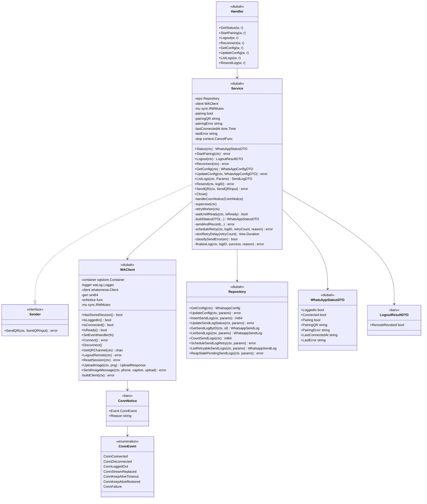
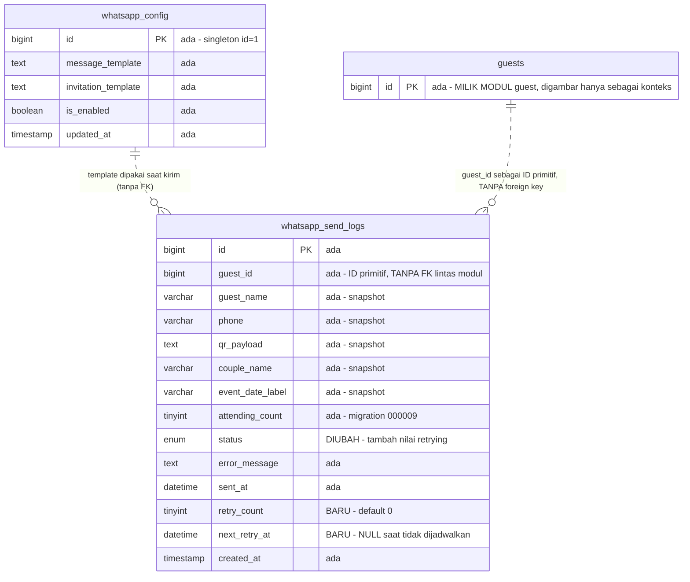
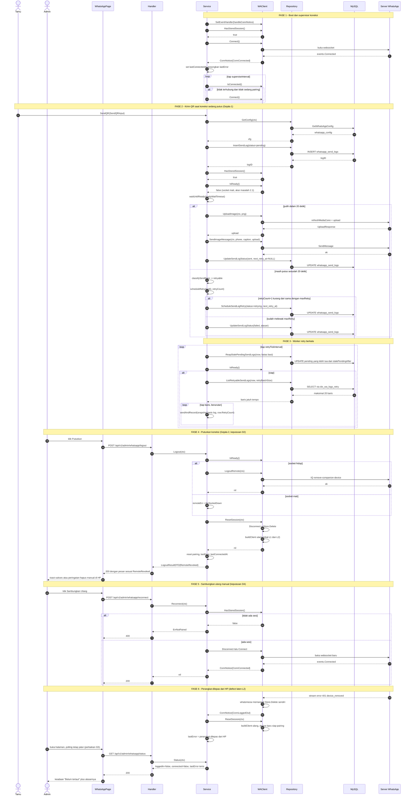

# PLAN — Ketahanan Koneksi WhatsApp (whatsapp-connection-resilience)

Modul: `whatsapp` (+ 1 route baru di `router`, + halaman admin WhatsApp di `apps/web`).
Klasifikasi: **Bug fix yang naik menjadi Enhancement.** Dua gejala yang dilaporkan
adalah defect, tetapi perbaikannya menuntut perancangan ulang siklus hidup koneksi
(bukan tambal di satu baris), karena keduanya berbagi SATU akar masalah yang sama.

---

## 1. Pernyataan kebutuhan yang sudah disepakati

Di production terjadi dua kegagalan pada modul WhatsApp:

1. Kirim QR ke WhatsApp tamu gagal dengan pesan
   `gagal unggah gambar: failed to refresh media connections: failed to query media connections: websocket not connected`.
2. Tombol **Putuskan koneksi WhatsApp** selalu gagal dengan `Gagal memutus WhatsApp.`

Yang diminta bukan sekadar menghilangkan dua pesan error itu, melainkan membuat
metode dan algoritma siklus hidup koneksi WhatsApp menjadi **kuat dan ideal**:
koneksi pulih sendiri, status yang ditampilkan jujur, pengiriman tidak hilang saat
koneksi sedang putus, dan admin selalu punya jalan keluar tanpa restart container.

### 1.1 Keputusan terkunci (dijawab user di Step 0/Step 4)

| # | Pertanyaan | Jawaban yang dipakai |
|---|---|---|
| D1 | Perilaku kirim saat koneksi putus | **Tunggu singkat + auto-retry backoff.** Gate cek koneksi, tunggu reconnect ±20 detik inline, sisanya masuk antrian retry otomatis dengan backoff yang dikerjakan worker background. Reuse tabel `whatsapp_send_logs` + kolom baru, TANPA tabel baru. |
| D2 | Perilaku tombol Putuskan saat websocket mati | **Selalu berhasil, dengan fallback bersihkan sesi lokal.** Coba putus resmi ke server WhatsApp dulu; bila socket mati/IQ gagal, tetap lakukan disconnect + hapus sesi lokal, lalu beri tahu admin dengan jujur bahwa perangkat mungkin masih terdaftar di HP. |
| D3 | Detail status di dashboard | **Pisahkan `loggedIn` (sesi ada) dan `connected` (socket hidup)**, plus `lastConnectedAt` dan `lastError`, dirangkum jadi 4 keadaan yang terbaca admin. |
| D4 | Kontrol manual pemulihan | **Ya** — endpoint `POST /api/v1/admin/whatsapp/reconnect` + tombol "Sambungkan Ulang" yang muncul saat tertaut tapi terputus. |

### 1.2 Penentuan reuse / extend / create-new (hasil trace Step 3 & Step 5)

| Sasaran | Putusan | Bukti |
|---|---|---|
| Tabel `whatsapp_send_logs` | **Extend** (3 kolom + 1 nilai enum + 1 index) | Sudah memuat seluruh snapshot yang dibutuhkan untuk kirim ulang tanpa menyentuh modul lain — [`000008_create_whatsapp_tables.up.sql:25-40`](../../../apps/api/migrations/000008_create_whatsapp_tables.up.sql) |
| Tabel `whatsapp_config` | **Tidak berubah** | Tidak ada kebutuhan konfigurasi baru; `is_enabled` sudah cukup |
| Tabel baru | **Tidak ada** | Antrian retry = baris `whatsapp_send_logs` yang sudah ada; menambah tabel antrian terpisah akan menduplikasi seluruh kolom snapshot |
| `infrastructure.WAClient` | **Extend besar** | Satu-satunya file yang boleh impor `whatsmeow` ([`waclient.go:1-5`](../../../apps/api/internal/modules/whatsapp/infrastructure/waclient.go)); batas itu dipertahankan |
| `application.Service` | **Extend besar** | Sudah memegang state pairing + `sync.RWMutex`; state koneksi menempel di struct yang sama |
| `contracts.Sender` | **Tidak berubah** | `SendQR(ctx, SendQRInput) error` tetap cukup; modul `guest` tidak perlu tahu soal retry |
| `Repository` method lama | **Reuse tanpa diubah** | `InsertSendLog`, `GetSendLogByID`, `ListSendLogs`, `CountSendLogs`, `GetConfig` dipakai apa adanya oleh alur baru — [`repository.go:17-43`](../../../apps/api/internal/modules/whatsapp/infrastructure/repository.go); hanya `UpdateSendLogStatus` yang query-nya disesuaikan, plus 3 method baru |
| `shared/response` | **Reuse** | `OK`, `BadRequest`, `NotFound`, `Internal`, `Error` sudah lengkap |
| `shared/pagination` | **Reuse** | Dipakai apa adanya oleh `ListLogs` |
| Komponen `Badge` | **Reuse tanpa diubah** | `BadgeTone` sudah punya `violet` — [`Badge.tsx:3`](../../../apps/web/src/shared/components/ui/Badge.tsx) — jadi status baru `retrying` tidak menuntut perubahan komponen |
| Modul `guest` | **Tidak disentuh** | Pemanggilan `SendQR` sudah detached goroutine; timeout ditegakkan di dalam modul `whatsapp` |

---

## 2. Analisis akar masalah (hasil trace)

### 2.1 Akar masalah tunggal

[`service.go:257`](../../../apps/api/internal/modules/whatsapp/application/service.go) memakai
`IsLoggedIn()` sebagai syarat "siap kirim":

```go
if !s.client.IsLoggedIn() {
    return fail("WhatsApp belum tertaut")
}
```

Di whatsmeow, flag `isLoggedIn` **hanya** di-set `false` oleh `handleStreamError`
(`connectionevents.go:20`). Jalur putus biasa lewat `onDisconnect`
(`client.go:588-598`) hanya melakukan `cli.socket = nil` dan **tidak pernah**
menyentuh flag itu. Akibatnya, setelah putus jaringan biasa:

```
IsLoggedIn() == true   (bohong: sesi ada, tapi socket mati)
IsConnected() == false (kenyataan)
```

Gate di atas lolos, lalu alur kirim menabrak socket mati.

### 2.2 Gejala 1 — gagal unggah gambar

Rantainya persis menghasilkan pesan production:

```
UploadImage -> cli.Upload -> refreshMediaConn -> sendIQ
  -> ErrNotConnected ("websocket not connected")   errors.go:22
  -> "failed to query media connections: %w"       mediaconn.go:68
  -> "failed to refresh media connections: %w"     upload.go:199
  -> "gagal unggah gambar: " + err                 service.go:266
```

### 2.3 Gejala 2 — gagal memutus WhatsApp

`whatsmeow.Client.Logout` mengirim IQ `remove-companion-device` **lebih dulu**,
lewat socket yang sama yang sudah mati, lalu `return` sebelum pernah mencapai
`cli.Store.Delete(ctx)`. Errornya jatuh ke `default` pada
[`StatusHTTPCode`](../../../apps/api/internal/modules/whatsapp/application/service.go#L325)
→ 500 → `response.Internal(w, "")` → frontend menampilkan `Gagal memutus WhatsApp.`
([`WhatsAppPage.tsx:99`](../../../apps/web/src/modules/admin/whatsapp/pages/WhatsAppPage.tsx)).

Konsekuensi terburuknya: **admin terjebak.** Satu-satunya jalan keluar dari koneksi
rusak justru ikut rusak, sehingga pairing ulang pun tidak bisa dilakukan.

### 2.4 Dua defect laten yang belum dilaporkan, ditemukan saat trace

| # | Temuan | Bukti |
|---|---|---|
| L1 | `store.Device.Delete` men-set `device.Deleted = true` dan mengganti seluruh store dengan `NoopStore{ErrDeviceDeleted}` (`store/store.go:284-296`). Setelahnya `unlockedConnect` selalu mengembalikan `store.ErrDeviceDeleted` (`client.go:543-545`). Artinya **seandainya pun Logout berhasil**, objek `*whatsmeow.Client` yang sama mati permanen — `StartPairing` sesudahnya gagal sampai API di-restart. | `client.go:543`, `store/store.go:284` |
| L2 | Saat admin menghapus perangkat dari HP-nya, whatsmeow menerima stream error `401 device_removed`, memancarkan `events.LoggedOut`, dan **memanggil `cli.Store.Delete` sendiri** (`connectionevents.go:40-47`) — meracuni client seperti L1. Kode saat ini tidak pernah memanggil `AddEventHandler` sama sekali, jadi kejadian ini tidak pernah diamati dan status tetap melaporkan "tertaut" selamanya. | `connectionevents.go:40-47` |

### 2.5 Faktor yang membuat kerusakan jadi permanen, bukan sesaat

| # | Celah | Bukti |
|---|---|---|
| G1 | `AddEventHandler` **tidak pernah dipanggil** di mana pun dalam modul. Service buta terhadap `Connected`, `Disconnected`, `LoggedOut`, `StreamReplaced`, `KeepAliveTimeout`. | tidak ada hasil pencarian di seluruh `apps/api` |
| G2 | `InitialAutoReconnect` default `false` — `NewClient` hanya men-set `EnableAutoReconnect` dan `AutoTrustIdentity` (`client.go:286-287`), dan `ConnectContext` hanya me-retry bila flag itu `true` (`client.go:528`). Goroutine boot di [`service.go:52-58`](../../../apps/api/internal/modules/whatsapp/application/service.go#L52-L58) hanya mencetak log lalu menyerah selamanya. Di VPS yang container-nya start sebelum jaringan/DNS siap, WhatsApp mati sampai restart manual. | `client.go:528`, `service.go:52-58` |
| G3 | Tidak ada penantian maupun retry saat kirim. Satu blip jaringan = QR tamu **tidak pernah sampai**, kecuali admin sadar dan menekan Kirim Ulang manual. | `service.go:257-272` |
| G4 | `Status()` hanya mengembalikan `loggedIn` dari flag yang sudah terbukti bohong, sehingga dashboard menampilkan "Tertaut" padahal tidak ada yang bisa dikirim. | `service.go:64-73`, `dto.go:5-10` |
| G5 | Polling status frontend **berhenti total** begitu `loggedIn` true ([`WhatsAppPage.tsx:60-63`](../../../apps/web/src/modules/admin/whatsapp/pages/WhatsAppPage.tsx)), jadi putus koneksi sesudahnya tidak pernah terlihat admin. | `WhatsAppPage.tsx:60-63` |
| G6 | `SendQR` dipanggil detached dengan `context.Background()` tanpa timeout apa pun ([`guest/service.go:719-727`](../../../apps/api/internal/modules/guest/application/service.go#L719-L727)); upload yang menggantung membocorkan goroutine dan meninggalkan baris log berstatus `pending` selamanya. | `guest/service.go:719-727` |

---

## 3. Konsep solusi

Empat pilar, semuanya di dalam modul `whatsapp`:

1. **Client yang bisa dibangun ulang (`WAClient` jadi pemilik `*whatsmeow.Client` yang dapat diganti).**
   `sqlstore.Container` yang sekarang dibuang setelah `GetFirstDevice`
   ([`waclient.go:47-56`](../../../apps/api/internal/modules/whatsapp/infrastructure/waclient.go))
   **disimpan**, supaya sesi yang sudah dihapus bisa diganti device baru lewat
   `Container.GetFirstDevice` (yang otomatis membuat `NewDevice()` saat store kosong,
   `store/sqlstore/container.go:165-175`). Ini obat untuk L1 dan L2.

2. **Supervisor koneksi berbasis event.** `AddEventHandler` didaftarkan **sebelum**
   connect pertama, diterjemahkan ke tipe milik modul sendiri (`ConnNotice`) supaya
   aturan "hanya `waclient.go` yang impor whatsmeow" tetap utuh. Di atasnya ada loop
   pengawas periodik sebagai jaring pengaman bila auto-reconnect bawaan whatsmeow
   menyerah.

3. **Gate kesiapan + antrian retry tahan restart.** Kirim hanya jalan saat
   `IsLoggedIn() && IsConnected()`. Bila belum siap, tunggu singkat; bila tetap belum,
   baris log dijadwalkan retry dengan backoff dan dikerjakan worker background.

4. **Jalan keluar yang tidak bisa gagal.** Logout selalu membersihkan sesi lokal dan
   membangun ulang client, apa pun hasil IQ ke server WhatsApp.

### 3.1 Konstanta perilaku

| Konstanta | Nilai | Alasan |
|---|---|---|
| `readyWaitTimeout` | 20 detik | Menutup blip jaringan singkat secara inline; dijalankan di goroutine detached milik `guest`, jadi tidak menahan respons RSVP tamu |
| `sendAttemptTimeout` | 60 detik | Batas per percobaan upload+kirim; menutup G6 tanpa menyentuh modul `guest` |
| `superviseInterval` | 15 detik | Kadens pengawas reconnect |
| `retryTickInterval` | 30 detik | Kadens worker retry |
| `retryBatchSize` | 20 baris | Batas eksplisit per tick supaya beban query terikat |
| `maxRetry` | 5 percobaan | Sesudahnya `failed` permanen dan admin bisa Kirim Ulang manual |
| `retryBackoff` | 1m, 5m, 15m, 60m, 180m | Horizon pemulihan ±4 jam — masuk akal untuk QR konfirmasi kehadiran |
| `stalePendingAfter` | 5 menit | Baris `pending` yang lebih tua dari ini dianggap korban restart dan dijadwalkan ulang |
| `bookkeepingTimeout` | 10 detik | Batas tulis pembukuan status log sesudah pembatalan pemanggil dilepas (§13/T2) |
| `resetSessionTimeout` | 10 detik | Batas kerja `ResetSession` sesudah pembatalan pemanggil dilepas (§13/T1) |

> **Invarian yang wajib dijaga:**
> `stalePendingAfter > readyWaitTimeout + sendAttemptTimeout`.
> Saat ini 5 menit > 20 detik + 60 detik = 80 detik, jadi marginnya aman. Invarian ini
> bukan hiasan: baris `pending` yang masih dikerjakan goroutine hidup akan disapu
> `ReapStalePendingSendLogs` dan **dikirim dua kali** ke tamu bila `stalePendingAfter`
> pernah dibuat lebih kecil dari total dua timeout di atasnya. Siapa pun yang menaikkan
> `sendAttemptTimeout` di kemudian hari wajib menaikkan `stalePendingAfter` juga.

### 3.2 Pemetaan event whatsmeow ke `ConnNotice`

| Event whatsmeow | `ConnEvent` | Reaksi `Service` |
|---|---|---|
| `*events.Connected`, `*events.PairSuccess` | `ConnConnected` | set `lastConnectedAt`, kosongkan `lastError`, hentikan state pairing |
| `*events.Disconnected` | `ConnDisconnected` | catat `lastError`, biarkan auto-reconnect bekerja |
| `*events.LoggedOut` | `ConnLoggedOut` | **bangun ulang client** (store sudah dihapus whatsmeow), reset state, set `lastError` agar admin tahu perangkat dilepas dari HP |
| `*events.StreamReplaced` | `ConnStreamReplaced` | set `lastError` "sesi diambil alih perangkat lain"; jangan reconnect (akan saling rebut) |
| `*events.KeepAliveTimeout` | `ConnKeepAliveTimeout` | catat `lastError` |
| `*events.KeepAliveRestored` | `ConnKeepAliveRestored` | kosongkan `lastError` |
| `*events.ConnectFailure`, `*events.StreamError`, `*events.ClientOutdated`, `*events.TemporaryBan` | `ConnFailure` | catat `lastError` beserta alasannya |

### 3.3 Catatan rancangan yang sengaja dipilih

- **`connected` tidak di-mirror ke field bool.** `Status()` membaca
  `client.IsConnected()` langsung. State yang di-mirror dari event bisa melenceng dari
  kenyataan — persis jenis kebohongan yang menyebabkan defect ini. Event hanya dipakai
  untuk hal yang memang tidak bisa dibaca dari polling: `lastConnectedAt`, `lastError`,
  dan reaksi terhadap `LoggedOut`.
- **`waitUntilReady` memakai polling ticker 500ms, bukan channel broadcast.** Channel
  yang ditutup lalu dipakai ulang adalah sumber bug klasik (close dua kali, pembaca
  yang ketinggalan). Untuk jendela 20 detik, 40 kali pembacaan flag atomik tidak
  berarti apa-apa secara biaya.
- **Generasi client (`gen uint64`).** `ResetSession` mengganti `*whatsmeow.Client`
  sementara handler event milik client lama masih bisa menyala. Closure handler
  menangkap nomor generasinya; notice dari generasi lama dibuang. Tanpa ini, event
  `Disconnected` dari client lama bisa membatalkan state client baru.
- **`idx_wa_logs_status` yang lama tetap dipertahankan.** Index komposit baru
  `(status, next_retry_at)` memang menjadikannya redundan untuk query retry, TETAPI
  query reap (`WHERE status = 'pending' AND created_at < ?`) tetap terlayani index
  lama itu. Menghapusnya bukan penghematan, melainkan regresi.
- **`main.go` tidak diubah.** Aplikasi belum punya graceful shutdown
  (`log.Fatal(http.ListenAndServe(...))`, [`main.go:81`](../../../apps/api/cmd/server/main.go#L81)).
  Menambahkannya adalah pelebaran cakupan yang tidak diminta. Supervisor dan worker
  memakai context milik `Service` sendiri; `Service.Close()` disediakan agar test
  dapat menghentikannya, sehingga signature `whatsapp.New` tetap sama.

---

## 4. Cakupan

### 4.1 Masuk cakupan

| Berkas | Jenis |
|---|---|
| `apps/api/migrations/000019_add_whatsapp_send_retry.up.sql` / `.down.sql` | baru |
| `apps/api/internal/modules/whatsapp/infrastructure/queries/whatsapp.sql` | diubah |
| `apps/api/internal/modules/whatsapp/infrastructure/sqlc/*` | regenerate |
| `apps/api/internal/modules/whatsapp/infrastructure/repository.go` | diubah |
| `apps/api/internal/modules/whatsapp/infrastructure/waclient.go` | diubah besar |
| `apps/api/internal/modules/whatsapp/application/service.go` | diubah besar |
| `apps/api/internal/modules/whatsapp/application/dto.go` | diubah |
| `apps/api/internal/modules/whatsapp/application/service_test.go` | diperluas |
| `apps/api/internal/modules/whatsapp/presentation/handler.go` | diubah |
| `apps/api/internal/router/router.go` | +1 route |
| `apps/api/internal/router/whatsapp_unavailable_test.go` | +1 baris kasus |
| `apps/web/src/modules/admin/whatsapp/services/whatsapp.service.ts` | diubah |
| `apps/web/src/modules/admin/whatsapp/pages/WhatsAppPage.tsx` | diubah |
| `apps/web/src/modules/admin/whatsapp/pages/WhatsAppPage.test.tsx` | diperluas |
| `knowledge/MODULE_MAP.md`, `knowledge/API.md`, `knowledge/DATABASE.md` | diperbarui |

### 4.2 Di luar cakupan

| Yang tidak disentuh | Alasan |
|---|---|
| Modul `guest` | Pemanggilan `SendQR` sudah detached; timeout dan retry ditegakkan di dalam modul `whatsapp`, sehingga batas modul tetap bersih dan blast radius kecil |
| `contracts.Sender` | Signature `SendQR` masih memadai; mengubahnya akan memaksa modul `guest` ikut berubah tanpa manfaat |
| Modul `auth`, `content` | Tidak bersinggungan |
| Graceful shutdown di `main.go` | Belum ada hari ini; menambahkannya pelebaran cakupan yang tidak diminta (lihat §3.3) |
| Tombol "Kirim Undangan" (`invitationTemplate`) | Jalur murni klien lewat `wa.me`, tidak menyentuh whatsmeow sama sekali |
| Migrasi sesi whatsmeow dari SQLite ke MySQL | whatsmeow tidak mendukung MySQL; keputusan ini tetap berlaku |

---

## 5. Perubahan per lapisan

### 5.1 Migration `000019_add_whatsapp_send_retry`

```sql
-- up
ALTER TABLE whatsapp_send_logs
  ADD COLUMN retry_count TINYINT UNSIGNED NOT NULL DEFAULT 0,
  ADD COLUMN next_retry_at DATETIME NULL;

ALTER TABLE whatsapp_send_logs
  MODIFY COLUMN status ENUM('pending','sent','failed','retrying') NOT NULL DEFAULT 'pending';

CREATE INDEX idx_wa_logs_retry ON whatsapp_send_logs (status, next_retry_at);
```

`down` membalik ketiganya: `DROP INDEX`, kembalikan enum ke tiga nilai (dahului
`UPDATE whatsapp_send_logs SET status='failed' WHERE status='retrying'` supaya tidak
ada baris yang nilainya hilang), lalu `DROP COLUMN`.

#### 5.1.1 Query sqlc — baru dan yang diubah

```sql
-- name: UpdateSendLogStatus :exec
-- DIUBAH: ikut mengosongkan jadwal retry saat baris mencapai keadaan terminal.
-- Params struct TIDAK berubah karena NULL ditulis sebagai literal.
UPDATE whatsapp_send_logs
SET status = ?, error_message = ?, sent_at = ?, next_retry_at = NULL
WHERE id = ?;

-- name: ScheduleSendLogRetry :exec
-- BARU. retry_count ditulis sebagai nilai ABSOLUT (bukan retry_count + 1), supaya
-- jalur Resend manual yang mengoper retryCount = 0 benar-benar mengulang hitungan
-- dari awal - lihat §5.3.1.
UPDATE whatsapp_send_logs
SET status = 'retrying', error_message = ?, retry_count = ?, next_retry_at = ?
WHERE id = ?;

-- name: ListRetryableSendLogs :many
-- BARU. Filter dan sort keduanya terlayani idx_wa_logs_retry (status, next_retry_at).
SELECT * FROM whatsapp_send_logs
WHERE status = 'retrying' AND next_retry_at IS NOT NULL AND next_retry_at <= ?
ORDER BY next_retry_at ASC
LIMIT ?;

-- name: ReapStalePendingSendLogs :exec
-- BARU. Baris 'pending' yang tertinggal karena API mati di tengah kirim dijadwalkan
-- ulang, bukan dibiarkan menggantung selamanya (menutup G6).
UPDATE whatsapp_send_logs
SET status = 'retrying', next_retry_at = ?, error_message = 'proses kirim terputus, dijadwalkan ulang'
WHERE status = 'pending' AND created_at < ?;
```

### 5.2 `infrastructure/waclient.go`

`WAClient` menyimpan `container`, `logger`, `client`, `gen`, `onNotice`, dan `sync.RWMutex`.

| Method | Status | Isi |
|---|---|---|
| `NewWAClient` | diubah | simpan container, panggil `buildClient` |
| `buildClient` | baru (privat) | `GetFirstDevice` → `NewClient` → set `EnableAutoReconnect = true` **dan `InitialAutoReconnect = true`** → daftarkan handler event bergenerasi |
| `SetEventHandler` | baru | dipasang `Service` sebelum connect pertama; dipakai ulang oleh client hasil rebuild |
| `IsConnected` | baru | `client.IsConnected()` |
| `IsReady` | baru | `IsLoggedIn() && IsConnected()` |
| `LogoutRemote` | baru | `client.Logout(ctx)` — jalur IQ resmi |
| `ResetSession` | baru | Lepas pembatalan pemanggil (`context.WithoutCancel` + `resetSessionTimeout`) → `Disconnect()` → `Store.Delete` (maafkan **`ErrDeviceDeleted` DAN `sqlstore.ErrDeviceIDMustBeSet`** lewat `sessionAlreadyGone`) → `buildClient` ulang **tanpa syarat**, error digabung `errors.Join`. Lihat §13/T1 |
| `sessionAlreadyGone` | baru | Memisahkan "tidak ada sesi untuk dihapus" (hasil yang diinginkan) dari kegagalan store sungguhan |
| `HasStoredSession`, `IsLoggedIn`, `Connect`, `Disconnect`, `GetQRChannel`, `UploadImage`, `SendImageMessage` | tetap | hanya ditambah pembacaan client di bawah `RLock` |
| `Logout` | **dihapus** | digantikan pasangan `LogoutRemote` + `ResetSession` |

### 5.3 `application/service.go`

| Fungsi | Status | Isi |
|---|---|---|
| `NewService` | diubah | pasang event handler **sebelum** connect; buat context milik sendiri; jalankan `supervise` dan `retryWorker` |
| `handleConnNotice` | baru | terapkan tabel §3.2 |
| `supervise` | baru | tiap `superviseInterval`: bila punya sesi, tidak sedang pairing, dan tidak terhubung → `Connect()`; `ErrAlreadyConnected` dihitung sukses |
| `retryWorker` | baru | tiap `retryTickInterval`: reap `pending` basi, baca `GetConfig` **sekali per tick** dan lewati tick bila `is_enabled` false, lalu ambil maksimal `retryBatchSize` baris jatuh tempo dan kirim **berurutan** |
| `waitUntilReady` | baru | `waitUntilReady(ctx, isReady func() bool) bool` — polling 500ms sampai `isReady()` benar atau `readyWaitTimeout` habis. Kesiapan disuntikkan sebagai closure supaya fungsinya murni dan dapat diuji tanpa client (§10.1) |
| `buildStatusDTO` | baru | fungsi murni yang merakit `WhatsAppStatusDTO` dari nilai-nilai mentah; dipakai `Status` |
| `sendAndRecord` | diubah | Menerima **satu `sendJob`** (bukan 10 parameter posisional); gate `HasStoredSession` (permanen) → `job.ready(...)` (retryable) → kirim dengan `sendAttemptTimeout` |
| `sendJob` + `jobFromLog` | baru | Snapshot satu pekerjaan kirim, termasuk `retryCount` (§5.3.1) dan `waitInline` (§13.1) |
| `bookkeeping` | baru | Melepas pembatalan pemanggil untuk tulisan status log — dipakai `finalizeLog` & `scheduleRetry` (§13/T2) |
| `Resend` | diubah | mengoper `retryCount = 0` — kirim ulang manual memberi **jatah retry baru** (§5.3.1) — dan `waitInline = false` (§13.1) |
| `classifySendError` | baru | `ErrNotConnected`/timeout/jaringan → retryable; sisanya permanen |
| `nextRetryDelay` | baru | fungsi murni `retryCount → time.Duration` menurut tabel `retryBackoff` §3.1; dipisah agar dapat diuji tanpa DB |
| `scheduleRetry` | baru | `retry_count+1 > maxRetry` → `finalizeLog(failed)`; selain itu jadwalkan `next_retry_at = now + nextRetryDelay(retryCount)` |
| `Logout` | diubah | kembalikan `(LogoutResultDTO, error)`; `ResetSession` dijalankan tanpa syarat |
| `Reconnect` | baru | tanpa sesi tersimpan → `ErrNotPaired`; selain itu `Disconnect()` lalu `Connect()` |
| `Status` | diubah | isi `Connected`, `LastConnectedAt`, `LastError` |
| `Close` | baru | batalkan context supervisor & worker (dipakai test) |
| `normalizePhone`, `applyTemplate`, `renderQRPNG`, `finalizeLog` | tetap | |

#### 5.3.1 Dari mana `retryCount` datang

`scheduleRetry` butuh tahu sudah berapa kali baris ini dicoba, sehingga
`sendAndRecord` **wajib menerimanya sebagai parameter** — tidak boleh menebak, dan
tidak boleh membaca ulang baris log (query tambahan per kirim). Ketiga pemanggilnya
mengisinya begini:

| Pemanggil | Nilai `retryCount` | Alasan |
|---|---|---|
| `SendQR` | `0` | Baris baru saja di-`InsertSendLog`, jadi `retry_count` di DB memang 0 |
| `retryWorker` | `row.RetryCount` | Dibaca dari baris yang diambil `ListRetryableSendLogs` — inilah yang membuat backoff naik dan `maxRetry` akhirnya tercapai |
| `Resend` (tombol admin) | `0` | **Disengaja.** Tanpa ini, baris yang sudah kehabisan jatah (`retry_count = 5`) akan langsung gagal permanen lagi begitu tombol Kirim Ulang ditekan, sehingga tombolnya terlihat rusak. Tindakan manual admin memberi jatah retry baru |

Konsekuensi untuk `Resend`: selain mengoper `0`, query `ScheduleSendLogRetry` yang
memakai `retry_count = retry_count + 1` tidak cocok untuk jalur ini. Karena itu
`scheduleRetry` menulis nilai absolut `retryCount + 1` (bukan increment relatif),
sehingga jalur manual benar-benar mengulang hitungan dari awal. Detail query di §5.1.1.

#### 5.3.2 Klasifikasi kegagalan — permanen vs retryable

`sendAndRecord` hari ini menyalurkan **semua** kegagalan lewat satu closure `fail()`
([`service.go:241-246`](../../../apps/api/internal/modules/whatsapp/application/service.go#L241-L246)).
Begitu antrian retry ada, menyalurkan semuanya ke `scheduleRetry` akan salah: tamu
tanpa nomor telepon akan dicoba 5 kali tanpa pernah bisa berhasil, dan baris yang
sengaja dimatikan admin akan hidup lagi. Karena itu `fail()` dipecah dua, dan tabel
ini mengikat:

| Alasan kegagalan | Kelas | Perlakuan |
|---|---|---|
| `pengiriman dinonaktifkan` (`is_enabled` false) | **permanen** | `finalizeLog(failed)` — keadaan sah yang dipilih admin, bukan gangguan |
| `nomor telepon kosong` (`normalizePhone` gagal) | **permanen** | `finalizeLog(failed)` — mencoba ulang tidak akan pernah mengubah hasilnya |
| `WhatsApp belum tertaut` (`HasStoredSession` false) | **permanen** | `finalizeLog(failed)` — butuh tindakan pairing oleh admin, bukan menunggu |
| `gagal membuat QR` (`renderQRPNG` gagal) | **permanen** | `finalizeLog(failed)` — kegagalan murni lokal dan deterministik |
| Koneksi belum siap sesudah `waitUntilReady` | **retryable** | `scheduleRetry` |
| `ErrNotConnected` saat upload atau kirim | **retryable** | `scheduleRetry` |
| `context.DeadlineExceeded` / error jaringan | **retryable** | `scheduleRetry` |
| Error lain dari `SendMessage` | **permanen** | `finalizeLog(failed)` — default konservatif; mencoba ulang error yang tidak dikenali berisiko kirim ganda ke tamu |

Default-nya sengaja **permanen**: kesalahan menandai sesuatu permanen hanya berujung
satu baris `failed` yang bisa ditekan Kirim Ulang oleh admin, sedangkan kesalahan
menandai sesuatu retryable bisa berujung pesan ganda ke tamu.

Dua error sentinel baru:

- `ErrNotPaired` — dipakai `Reconnect` saat belum ada sesi tersimpan; dipetakan ke **400** di `StatusHTTPCode`.
- `ErrSocketDown` — penanda **internal** yang dipakai `Logout` untuk mencatat bahwa
  jalur IQ resmi tidak sempat dicoba karena socket mati. Nilai ini **tidak pernah**
  dikembalikan ke handler; ia hanya menentukan `LogoutResultDTO.RemoteRevoked = false`,
  sehingga tidak perlu (dan tidak boleh) masuk ke `StatusHTTPCode`.

### 5.4 `presentation/handler.go` & `router.go`

- `Logout` membalas 200 dengan `data` = `LogoutResultDTO`, dan `message` yang berbeda
  saat `RemoteRevoked == false`.
- `Reconnect` baru, dijaga `unavailable(w)` seperti handler lain.
- `router.go`: `admin.HandleFunc("POST /api/v1/admin/whatsapp/reconnect", d.WhatsAppHandler.Reconnect)`.

### 5.5 Frontend

- `WhatsAppStatus` bertambah `connected`, `lastConnectedAt: string | null`, `lastError: string`.
- `logout()` mengembalikan `{ remoteRevoked: boolean }`; `reconnect()` baru.
- `SendLogStatus` bertambah `'retrying'`; label "Menunggu kirim ulang", tone `violet`.
- Helper `connectionState(status)` → `'ready' | 'disconnected' | 'unpaired' | 'pairing'`.
- **Polling tidak lagi berhenti saat `loggedIn`**: 2 detik saat belum siap, 15 detik saat siap.
- Tombol "Sambungkan Ulang" muncul pada state `disconnected`.
- Tombol Kirim Ulang manual: `disabled` hanya untuk status `sent`, `pending`, dan `retrying`.

---

## 6. Diagram kelas



---

## 7. ERD



Index pada `whatsapp_send_logs`:

| Index | Status | Melayani |
|---|---|---|
| `idx_wa_logs_status (status)` | ada, dipertahankan | query reap `status='pending' AND created_at < ?` |
| `idx_wa_logs_created_at (created_at)` | ada | `ListSendLogs ORDER BY created_at DESC` |
| `idx_wa_logs_retry (status, next_retry_at)` | **baru** | `status='retrying' AND next_retry_at <= ? ORDER BY next_retry_at` — filter dan sort sekaligus |

---

## 8. Diagram sekuens



---

## 9. Daftar tugas

Urutan ini mengikuti ketergantungan: skema dulu, lalu kode yang membacanya,
lalu yang memanggilnya, lalu frontend.

### Lapisan data

- [ ] **T1** — Buat `apps/api/migrations/000019_add_whatsapp_send_retry.up.sql`:
  tambah kolom `retry_count` dan `next_retry_at`, ubah enum `status` agar memuat
  `retrying`, buat index `idx_wa_logs_retry (status, next_retry_at)`. Inilah tulang
  punggung antrian retry keputusan **D1** — tanpa tabel baru.
- [ ] **T2** — Buat `000019_add_whatsapp_send_retry.down.sql`: `DROP INDEX`,
  `UPDATE ... SET status='failed' WHERE status='retrying'`, kembalikan enum ke tiga
  nilai, `DROP COLUMN` keduanya. Urutan `UPDATE` sebelum `MODIFY` bersifat wajib.
- [ ] **T3** — Tambah query di `infrastructure/queries/whatsapp.sql` persis seperti
  §5.1.1: `ScheduleSendLogRetry`, `ListRetryableSendLogs`, `ReapStalePendingSendLogs`;
  dan ubah `UpdateSendLogStatus` agar ikut menulis `next_retry_at = NULL` (params
  struct tidak berubah karena NULL ditulis sebagai literal). Perhatikan
  `ScheduleSendLogRetry` menulis `retry_count` sebagai **nilai absolut**, bukan
  `retry_count + 1` — alasannya di §5.3.1.
- [ ] **T4** — Jalankan `sqlc generate` dari `apps/api`; pastikan `WhatsappSendLog`
  kini punya `RetryCount` dan `NextRetryAt`, dan konstanta
  `WhatsappSendLogsStatusRetrying` ikut terbentuk.
- [ ] **T5** — Tambah pembungkus di `infrastructure/repository.go`:
  `ScheduleSendLogRetry`, `ListRetryableSendLogs`, `ReapStalePendingSendLogs`.

### Lapisan infrastruktur WhatsApp

- [ ] **T6** — Di `waclient.go`, ubah `WAClient` agar menyimpan `container`,
  `logger`, `gen`, `onNotice`, dan `sync.RWMutex`; pecah pembuatan client ke
  `buildClient(ctx)` privat.
- [ ] **T7** — Definisikan `ConnEvent`, `ConnNotice`, dan `SetEventHandler`, beserta
  penerjemahan seluruh event whatsmeow sesuai tabel §3.2. **Dikerjakan sebelum T8**,
  karena T8 mendaftarkan handler yang memakai tipe-tipe ini.
- [ ] **T8** — Di `buildClient`, set `EnableAutoReconnect = true` **dan**
  `InitialAutoReconnect = true` (menutup G2), lalu daftarkan handler event yang
  menangkap nomor generasi saat itu dan membuang notice dari generasi client yang
  sudah usang.
- [ ] **T9** — Tambah `IsConnected()` dan `IsReady()`.
- [ ] **T10** — Ganti `Logout` dengan `LogoutRemote(ctx)` dan `ResetSession(ctx)`;
  `ResetSession` melakukan `Disconnect` → `Store.Delete` (abaikan `ErrDeviceDeleted`)
  → `buildClient` ulang. Ini obat untuk L1 dan L2.
- [ ] **T11** — Bungkus seluruh method yang sudah ada agar membaca `client` di bawah
  `RLock`, supaya aman terhadap `ResetSession` yang berjalan bersamaan.

### Lapisan aplikasi

Urutan di bawah sengaja **bottom-up**: tipe dan fungsi murni lebih dulu, `NewService`
yang merangkai semuanya paling akhir — supaya tidak ada langkah antara yang
meninggalkan paket dalam keadaan gagal kompilasi.

- [ ] **T12** — Tambah konstanta §3.1 serta error sentinel `ErrNotPaired` dan
  `ErrSocketDown` di `service.go`; daftarkan **hanya** `ErrNotPaired` pada
  `StatusHTTPCode` sebagai 400 (`ErrSocketDown` murni internal, lihat §5.3).
- [ ] **T13** — Di `dto.go`: tambah `Connected`, `LastConnectedAt`, `LastError` pada
  `WhatsAppStatusDTO`, dan struct `LogoutResultDTO` baru. **Dikerjakan sebelum T21
  dan T23**, yang mengembalikan kedua struct ini.
- [ ] **T14** — Tambah field state ke `Service`: `lastConnectedAt`, `lastError`,
  `stop context.CancelFunc`.
- [ ] **T15** — Tulis `handleConnNotice` sesuai tabel §3.2; `ConnLoggedOut` memanggil
  `ResetSession` (T10) dan mereset state pairing.
- [ ] **T16** — Tulis `supervise(ctx)`: tiap `superviseInterval`, reconnect bila punya
  sesi, tidak sedang pairing, dan tidak terhubung. `ErrAlreadyConnected` dihitung sukses.
- [ ] **T17** — Tulis `waitUntilReady(ctx context.Context, isReady func() bool) bool`
  dengan polling 500ms sampai `readyWaitTimeout`. Kesiapan **disuntikkan sebagai
  closure**, bukan dibaca dari `s.client`, supaya dapat diuji tanpa koneksi (§10.1).
- [ ] **T18** — Tulis `classifySendError(err) bool` dan `nextRetryDelay(retryCount)`
  sebagai fungsi murni, lalu `scheduleRetry(...)` yang memakai keduanya beserta batas
  `maxRetry` — bagian "backoff" dari keputusan **D1**. `classifySendError` WAJIB
  mengikuti tabel §5.3.2, dengan default **permanen** untuk error yang tidak dikenali.
- [ ] **T19** — Ubah `sendAndRecord`: **tambah parameter `retryCount int`** (§5.3.1);
  ganti gate `IsLoggedIn()` menjadi `HasStoredSession()` (gagal permanen) lalu
  `waitUntilReady(ctx, s.client.IsReady)` (gagal retryable, bagian "tunggu singkat"
  keputusan **D1**); bungkus upload dan kirim
  dengan `context.WithTimeout(sendAttemptTimeout)` (menutup G3 dan G6); salurkan
  kegagalan retryable ke `scheduleRetry(ctx, logID, retryCount, alasan)`, sedangkan
  kegagalan permanen tetap ke `finalizeLog(failed)` — pecah closure `fail()` yang ada
  menjadi dua jalur persis menurut tabel §5.3.2, supaya nomor kosong dan pengiriman
  yang dinonaktifkan tidak pernah masuk antrian retry.
  Sesuaikan kedua pemanggil yang sudah ada: `SendQR` mengoper `0`, dan `Resend`
  mengoper `0` juga (jatah retry baru untuk tindakan manual admin).
- [ ] **T20** — Tulis `retryWorker(ctx)` — worker background keputusan **D1**: reap
  `pending` basi, baca `GetConfig` sekali per tick dan lewati tick bila `is_enabled` false, lalu ambil maksimal
  `retryBatchSize` baris jatuh tempo dan kirim **berurutan** lewat
  `sendAndRecord(..., row.RetryCount)` memakai snapshot di baris log — tanpa
  menyentuh tabel modul lain. `row.RetryCount` inilah yang membuat backoff menaik
  dan `maxRetry` akhirnya tercapai (§5.3.1).
- [ ] **T21** — Ubah `Logout` agar mengembalikan `(LogoutResultDTO, error)`: coba
  `LogoutRemote` bila siap (jika tidak, catat `ErrSocketDown` secara internal), lalu
  `ResetSession` **tanpa syarat**; hanya kegagalan `ResetSession` yang boleh menjadi
  error yang dikembalikan (keputusan D2).
- [ ] **T22** — Tambah `Reconnect(ctx)`: tanpa sesi → `ErrNotPaired`; selain itu
  `Disconnect` lalu `Connect` (keputusan D4).
- [ ] **T23** — Tulis fungsi murni `buildStatusDTO(...)`, lalu ubah `Status` agar
  membaca state di bawah `RLock` plus `client.IsLoggedIn()`/`client.IsConnected()` dan
  menyerahkan semuanya ke fungsi itu — sehingga `Connected`, `LastConnectedAt`, dan
  `LastError` terisi (keputusan D3, menutup G4).
- [ ] **T24** — Terakhir, ubah `NewService`: pasang event handler (T15) lewat
  `SetEventHandler` **sebelum** connect pertama, buat context milik sendiri, jalankan
  `supervise` (T16) dan `retryWorker` (T20). Tambah `Close()`.

### Lapisan presentasi

- [ ] **T25** — `handler.go`: `Logout` membalas `LogoutResultDTO` dengan `message`
  berbeda saat `RemoteRevoked == false`; tambah handler `Reconnect` yang dijaga
  `unavailable(w)`.
- [ ] **T26** — `router.go`: daftarkan
  `POST /api/v1/admin/whatsapp/reconnect` di grup `admin`.

### Frontend

- [ ] **T27** — `whatsapp.service.ts`: tambah `connected`, `lastConnectedAt`,
  `lastError` pada `WhatsAppStatus`; tambah `'retrying'` pada `SendLogStatus`;
  ubah `logout()` agar mengembalikan `{ remoteRevoked }`; tambah `reconnect()`.
- [ ] **T28** — `WhatsAppPage.tsx`: tambah helper `connectionState(status)` dan
  label untuk empat keadaan; tambah label serta tone `violet` untuk `retrying`;
  `disabled` tombol Kirim Ulang menjadi `status !== 'failed'` tetap berlaku sehingga
  baris `retrying` otomatis tidak bisa ditekan.
- [ ] **T29** — `WhatsAppPage.tsx`: **polling tidak lagi berhenti** saat `loggedIn`
  (menutup G5) — 2 detik saat belum siap, 15 detik saat siap.
- [ ] **T30** — `WhatsAppPage.tsx`: tombol "Sambungkan Ulang" pada keadaan
  `disconnected`, dan toast logout yang membedakan `remoteRevoked`.

### Pengujian dan dokumentasi

- [ ] **T31** — Tambah unit test Go (lihat §10.1).
- [ ] **T32** — Tambah kasus `POST /api/v1/admin/whatsapp/reconnect` ke
  `router/whatsapp_unavailable_test.go` agar route baru ikut terbukti membalas 503
  saat modul mati.
- [ ] **T33** — Tambah test frontend (lihat §10.2); tambahkan `reconnect: vi.fn()` ke
  blok `vi.mock` yang sudah ada, dan lengkapi semua `mockResolvedValue` status lama
  dengan field baru agar typecheck lolos.
- [ ] **T34** — Perbarui `knowledge/MODULE_MAP.md` (baris modul `whatsapp`),
  `knowledge/API.md` (route `reconnect` dan bentuk respons logout), serta
  `knowledge/DATABASE.md` (kolom dan index baru).

---

## 10. Pengujian

### 10.1 Backend (`application/service_test.go`, tanpa koneksi WhatsApp/DB)

| # | Fungsi diuji | Kasus |
|---|---|---|
| U1 | `classifySendError` | `ErrNotConnected` terbungkus → retryable; `context.DeadlineExceeded` → retryable; error validasi biasa → permanen |
| U2 | `nextRetryDelay` | urutan 1m, 5m, 15m, 60m, 180m; `retryCount >= maxRetry` menandakan terminal |
| U3 | `waitUntilReady` | `true` saat `isReady` sudah benar sejak awal; `true` saat `isReady` berubah benar di tengah penantian; `false` saat `readyWaitTimeout` habis; `false` saat context dibatalkan |
| U4 | `buildStatusDTO` | kombinasi loggedIn/connected/pairing menghasilkan seluruh field `WhatsAppStatusDTO` yang benar, termasuk `LastConnectedAt` nil → string kosong |
| U5 | `normalizePhone`, `applyTemplate` | tetap lulus tanpa diubah (regresi) |
| U7 | `bookkeeping` | ctx hasilnya TIDAK ikut batal walau parent sudah dibatalkan, dan tetap punya deadline sendiri |
| U8 | `sendJob.ready` | `waitInline=false` memutuskan seketika; `waitInline=true` menunggu sampai ctx/timeout |
| U9 | `jobFromLog` | seluruh field snapshot terbawa — satu yang terlewat = pesan retry salah data |
| U10 | `sessionAlreadyGone` + `ResetSession` (paket `infrastructure`) | device tanpa JID **berhasil** & client dibangun ulang; idempoten 3x; tetap rebuild walau ctx pemanggil dibatalkan |
| U6 | Invarian konstanta (§3.1) | `stalePendingAfter > readyWaitTimeout + sendAttemptTimeout` — test sederhana yang gagal bila kelak ada yang menaikkan `sendAttemptTimeout` tanpa menaikkan `stalePendingAfter`, sehingga kirim ganda ke tamu tercegah di CI, bukan di production |

Agar U3 dan U4 tetap bisa diuji **tanpa koneksi WhatsApp maupun DB** — persis gaya
`service_test.go` yang sudah ada — dua fungsi ini sengaja dirancang murni, bukan
method yang membaca `s.client` langsung:

- `waitUntilReady(ctx context.Context, isReady func() bool) bool` — kesiapan
  disuntikkan sebagai closure. Pemanggil di `sendAndRecord` mengoper
  `s.client.IsReady`.
- `buildStatusDTO(loggedIn, connected, pairing bool, qr, pairErr string, lastConnectedAt *time.Time, lastErr string) WhatsAppStatusDTO` —
  seluruh masukan berupa nilai. `Status` hanya membaca state di bawah `RLock`, memanggil
  `client.IsLoggedIn()`/`IsConnected()`, lalu menyerahkan semuanya ke fungsi ini.

Pilihan ini **menggantikan** alternatif "bungkus `WAClient` di balik interface":
interface menuntut perubahan struct `Service` dan perakitan di `whatsapp.module.go`
tanpa manfaat tambahan, sedangkan dua fungsi murni di atas sudah cukup dan tidak
menyentuh satu pun berkas di luar `application/`.

### 10.2 Frontend (`WhatsAppPage.test.tsx`)

| # | Kasus |
|---|---|
| F1 | `loggedIn: true, connected: false` → muncul teks keadaan terputus dan tombol "Sambungkan Ulang" |
| F2 | `loggedIn: true, connected: true` → muncul keadaan siap, tanpa tombol Sambungkan Ulang |
| F3 | `logout()` mengembalikan `{ remoteRevoked: false }` → toast peringatan hapus manual di HP, bukan toast sukses polos |
| F4 | Log berstatus `retrying` → badge "Menunggu kirim ulang" dan tombol Kirim Ulang dalam keadaan `disabled` |
| F5 | Polling tetap berjalan sesudah `loggedIn: true` (perbaikan G5) |

### 10.3 Verifikasi manual di production

1. Putus jaringan container sebentar, lalu RSVP satu tamu → baris log masuk
   `retrying`, dan menjadi `sent` setelah jaringan pulih tanpa tindakan admin.
2. Saat socket mati, tekan Putuskan → selalu berhasil, dengan pesan peringatan;
   pairing ulang langsung bisa dilakukan **tanpa restart container** (bukti L1 teratasi).
3. Hapus perangkat dari menu Perangkat Tertaut di HP → dashboard berpindah ke
   "Belum tertaut" beserta alasannya, dan pairing ulang langsung bisa (bukti L2 teratasi).

---

## 11. Catatan performa dan volume data

Volume yang diasumsikan: satu acara pernikahan, ratusan sampai sekitar 2.000 baris
`whatsapp_send_logs` sepanjang umur proyek. Penilaian per query yang ditambahkan:

| Query | Perilaku pada volume nyata |
|---|---|
| `ListRetryableSendLogs` | `WHERE status='retrying' AND next_retry_at <= ? ORDER BY next_retry_at LIMIT 20` — filter dan sort keduanya terlayani `idx_wa_logs_retry (status, next_retry_at)`; hasil dibatasi `retryBatchSize`, jadi tidak pernah tak terbatas |
| `ReapStalePendingSendLogs` | `WHERE status='pending' AND created_at < ?` — terlayani `idx_wa_logs_status` yang sudah ada; jumlah baris `pending` secara wajar hanya sisa restart, bukan ribuan |
| `ScheduleSendLogRetry`, `UpdateSendLogStatus` | `WHERE id = ?` lewat primary key |
| `ListSendLogs` | tidak diubah; tetap terpaginasi lewat `shared/pagination` |

Hal yang sengaja dihindari:

- **Tidak ada N+1.** Worker mengambil satu batch lewat satu query, lalu mengirim dari
  snapshot yang sudah ada di tiap baris — tidak ada query tambahan per baris.
  `GetConfig` dibaca **sekali per tick**, bukan per baris.
- **Pengiriman berurutan, bukan paralel.** Mengirim serentak ke server WhatsApp
  berisiko rate-limit hingga pemblokiran nomor; batch 20 secara berurutan sudah jauh
  melampaui laju RSVP nyata.
- **Tidak ada transaksi yang menganga melintasi panggilan eksternal.** Tiap perubahan
  status log adalah satu `UPDATE` mandiri sesudah panggilan WhatsApp selesai.
- **Tidak ada koleksi yang ditahan di memori.** PNG QR dibuat per pengiriman dan
  langsung dilepas; tidak ada akumulasi antar baris.
- **Dua goroutine tetap untuk seumur proses** (supervisor dan worker), bukan satu
  goroutine per pengiriman yang menumpuk.

---

## 12. Kepatuhan pada aturan proyek

| Aturan | Pemenuhan |
|---|---|
| Modular monolith — hanya `contracts/` yang publik | `contracts.Sender` tidak berubah; modul `guest` tidak disentuh |
| Tanpa join dan FK lintas modul | `guest_id` tetap ID primitif tanpa FK; worker retry hanya membaca `whatsapp_send_logs` |
| Repository hanya menyentuh tabel modulnya | Tiga query baru semuanya pada `whatsapp_send_logs` |
| golang-migrate + sqlc + `database/sql`, bukan GORM | Migration 000019 + `sqlc generate`, tanpa ORM |
| `/api/v1`, amplop `{ success, message, data }` | Route `reconnect` mengikuti pola yang sama lewat `shared/response` |
| `shared/` hanya utilitas teknis | Tidak ada penambahan di `shared/` |
| Frontend: alias `@/*`, satu instance Axios | Semua permintaan tetap lewat `shared/services/http-client` |
| `knowledge/` satu-satunya rak pengetahuan | T34 memperbarui `knowledge/`, bukan membuat `docs/` paralel |

Satu penyimpangan yang perlu dicatat, bukan disembunyikan: `.claude/rules/frontend-react.md`
menyebut **React 19**, sedangkan `CLAUDE.md` mengunci **React 18.3.1** lewat
`knowledge/decisions/ADR-0004-react-18.md`. Sesuai `knowledge/SOURCE_PRIORITY.md`,
yang diikuti adalah ADR — jadi **React 18.3.1**. Konflik ini dilaporkan di sini, tidak
dipilih diam-diam, dan tidak berpengaruh pada rancangan ini karena tidak ada API
khusus React 19 yang dipakai.

---

## 13. Koreksi pasca-implementasi

Verifikasi terhadap kode yang sudah diimplementasikan menemukan lima celah. Semuanya
sudah ditutup, dan masing-masing dikunci test regresi supaya tidak kembali.

### T1 — `ResetSession` gagal pada device tanpa JID (TINGGI, terbukti probe)

`Container.DeleteDevice` menolak dengan **`ErrDeviceIDMustBeSet`** (bukan
`ErrDeviceDeleted`) ketika `store.ID == nil`, yaitu keadaan client tepat sesudah
logout sukses maupun sesudah rebuild pada jalur L2. `ResetSession` lama hanya
memaafkan `ErrDeviceDeleted`, sehingga ia mengembalikan error **dan melewati
rebuild** — `Logout` meneruskannya jadi 500 dan admin melihat lagi
**"Gagal memutus WhatsApp."**, persis defect §2.3. Terjangkau lewat jendela polling
15 detik (UI masih menampilkan tombol Putuskan sesudah sesi sebenarnya bersih), dua
tab admin, atau logout kedua.

Perbaikan: `sessionAlreadyGone` memaafkan kedua sentinel, rebuild dijalankan **tanpa
syarat**, dan kedua error digabung `errors.Join` supaya tidak ada yang hilang senyap.
Selain itu `ResetSession` kini **melepas pembatalan pemanggil** — tanpa itu, request
yang dibatalkan membuat `buildClientLocked` gagal dan tetap meninggalkan client
teracuni (ditemukan oleh test regresinya sendiri, bukan oleh pembacaan kode).

### T2 — Pembukuan status log ikut batal bersama request (SEDANG)

`ResendLog` mengoper `r.Context()` sampai ke `scheduleRetry`/`finalizeLog`. Bila admin
menutup tab, tulisan DB ikut dibatalkan dan baris log menggantung di keadaan lamanya —
janji §5.3.2 ("setiap kegagalan mendarat di keadaan yang pasti") tidak berlaku.
Perbaikan: helper `bookkeeping()` melepas pembatalan (`context.WithoutCancel`) dengan
deadline sendiri, dipasang **di dalam** `finalizeLog` dan `scheduleRetry` sehingga
setiap pemanggil otomatis terlindungi dan tidak ada jalur yang bisa lupa.

### T3 — `Resend` memblokir sampai 80 detik (SEDANG)

`waitUntilReady` (20 detik) + `sendAttemptTimeout` (60 detik) dijalankan di dalam
request HTTP sinkron, berisiko 504 di reverse proxy (`proxy_read_timeout` nginx
default 60 detik). Perbaikan: aturan §13.1 di bawah.

### T4 — Worker retry membakar jatah sisa batch saat koneksi putus (SEDANG)

`processRetries` mengecek `IsReady()` sekali sebelum loop. Bila koneksi putus di tengah
batch, sisa baris (hingga 20) masing-masing gagal dan **menghabiskan satu jatah retry
percuma** padahal penyebabnya satu dan sama. Perbaikan: `IsReady()` dicek ulang di awal
setiap iterasi dan worker berhenti begitu koneksi hilang; baris yang belum tersentuh
tetap di antrian untuk tick berikutnya.

### T5 — `ReapStalePendingSendLogs` menimpa `error_message` (RENDAH, defensif)

Diperbaiki dengan `COALESCE(error_message, ...)`. Perlu dicatat jujur: **ini bukan bug
yang aktif hari ini** — baris `pending` selalu ber-`error_message` NULL karena hanya
`InsertSendLog` yang menulis status itu. Perbaikannya murni pengamanan terhadap
perubahan di kemudian hari, dan tidak mengubah params struct sqlc.

### 13.1 — Aturan menunggu per jalur (menutup T3 & T4)

Menunggu koneksi di tempat hanya sah pada jalur yang **tidak menahan siapa pun**.
Aturannya dipusatkan di `sendJob.waitInline` + `sendJob.ready()` supaya tidak ada
percabangan yang tersebar dan tidak ada jalur yang lupa menerapkannya:

| Jalur | `waitInline` | Alasan |
|---|---|---|
| `SendQR` | **true** | Berjalan di goroutine detached milik `guest`; penantian 20 detik keputusan D1 tidak menahan respons RSVP tamu sama sekali |
| `Resend` (HTTP) | false | Permintaan sinkron admin. Bila koneksi putus, baris langsung masuk antrian dan admin menerima jawaban seketika ("dijadwalkan ulang") alih-alih menunggu 80 detik |
| `retryWorker` | false | Antrian retry sudah menjadi jaring pengamannya; menunggu di sini mengunci worker berbatch-batch |

Keputusan D1 ("tunggu singkat + auto-retry backoff") **tidak berubah** — yang berubah
hanyalah di jalur mana "tunggu singkat" itu benar-benar gratis. Pada dua jalur lain,
antrian retry mengambil alih peran itu tanpa memblokir siapa pun.
